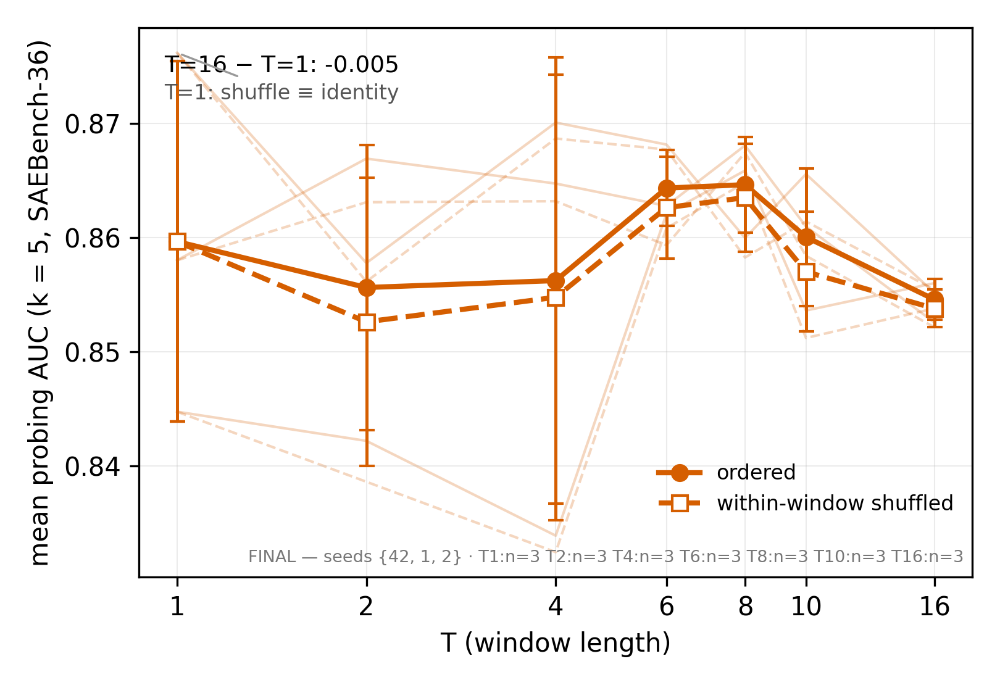
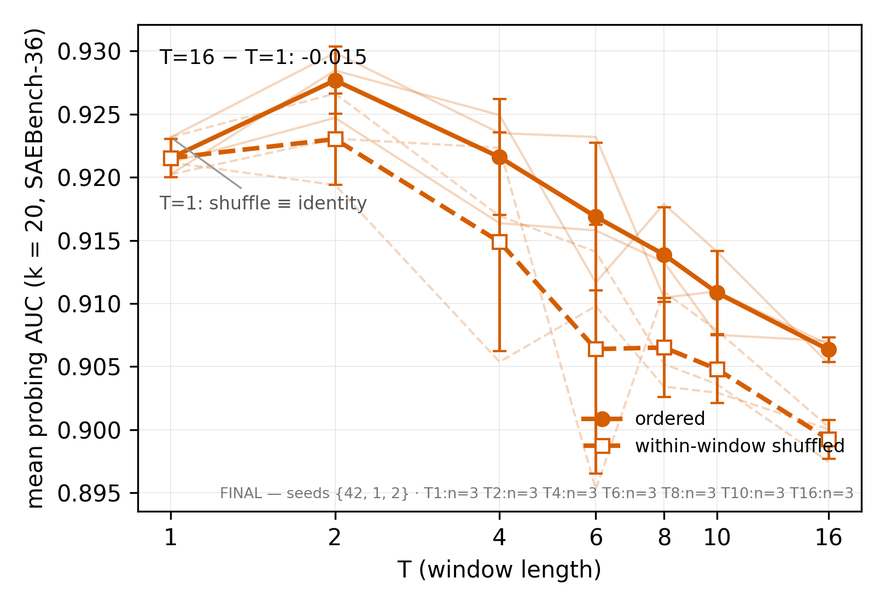
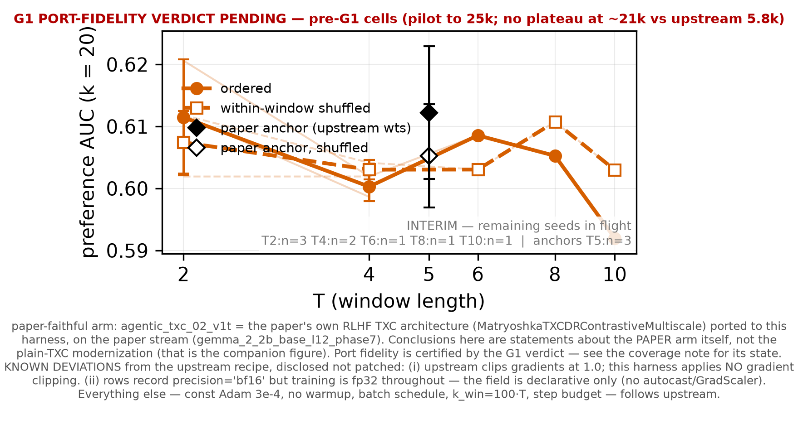
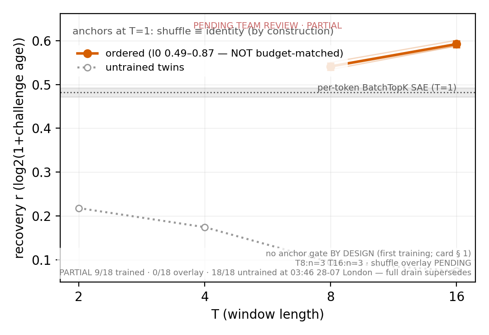

# REBUTTAL HANDOFF — where Dmitry (or his agent) finds every deliverable

**Code-reader's companion: `REBUTTAL_CODE_GUIDE.md`** (same directory) —
which code produced the probing/RLHF shuffle ablations, class-level
arch pins, shuffle-instrument semantics, checkpoint locations, pod
SSH access, and the caveats an agent must not trip over.
**Cell inventory: `REBUTTAL_CELL_CENSUS.md`** (same directory) — every
cell we have results for, labeled {ReLU+TopK} paper-faithful vs
{BatchTopK} btk-only vs relu-mix (the misinterpreted arm); regenerate
with `.venv/bin/python scripts/cell_census.py --write` — **regenerate
before quoting coverage**, and read its two check sections
(arch-vs-stamp, substrate-pin) rather than the table alone.

**⚑ TIMELINE (restamped 18:0x 07-28 — the previous line said "deadline
13:00 BST today; exhibits ready by 11:00" and that had already
PASSED):** the 13:00 BST 2026-07-28 rebuttal window has closed;
**responses remain amendable to Aug 3**, so every item below is in the
amendment window, not in a same-day scramble. **THIS DOCUMENT
SUPERSEDES the meeting PDF
(`private/meeting_tsweep_plots_2026-07-27.pdf`) as the deliverable
surface — plots are embedded below and refresh in place when a
renderer overwrites the same path.** Every number is PTR (pending team
ratification) unless marked ratified. Licences and caveats live in
`experiments/explorations/task_hunt/LOG.md` — search the stamp given
per item. Master data: `results/leaderboard.jsonl` (append-only; every
row carries `code_version` + `train_key`/`eval_key`).
**Checkpoints:** durable mirror = HF dataset
`han1823123123/temp-bench-data` under `ckpts/<train_key>/
model.safetensors` (LFS sha256 = the receipt; uploader
`push_ckpts_hf.py` in-repo). Lookup: leaderboard row → its
`train_key` → that path. **⚑ The mirror stamp below is 02:0x and has
NOT been re-verified since; the 21 probing pf + 15 RLHF pf ckpts
landed after it, so their mirror status is UNCONFIRMED — check before
relying on it.** Mirrored as of 02:0x: ALL 26 trained
RLHF ckpts (the full RLHF shuffle-ablation set incl. eq twins,
runpod-2 receipts) + 30 probing certificate-evidence ckpts (twin
pairs across the 7-T grid, sae pair, positive control; LFS
spot-check MATCH — runpod-1 receipts); remaining probing sweep
ckpts mirror in priority order, pod-local meanwhile at
`checkpoints/<train_key>/` indexed by the in-repo
`checkpoints/manifest.jsonl`. Paper-era ckpts (if needed):
`han1823123123/txcdr-base` (`<arch_id>__seed42.pt`) +
`temp-bench-models` per COMPOSITION_AUDIT. **MATRIX ARM MAPPING (Han-pinned ~02:3x):** {BatchTopK} =
`btk-only` (NO ReLU, signed selection — the delivered sweep arm);
{ReLU+TopK} = the PAPER-FAITHFUL composition
ReLU(TopK_{k_pos·T}(Σ)) — **probing arm COMPLETE** (`paper_txc_base_v1t`,
21/21 cells, 7 T × 3 seeds); **RLHF arm COMPLETE** (`agentic_txc_02_v1t`,
the agentic_txc_02 trainable port, 15/15 cells, T{2,4,6,8,10} × 3 seeds
— see §3 for why T1/T16 are absent by design). Both landed 07-28; the
archived T=5 anchors are now a comparison row, no longer the only
carrier of the paper composition.
`relu-mix` (ReLU-before-BatchTopK) is NEITHER matrix arm —
certificate evidence only. `eval_cfg.arm` carries the row-level
label.

---

## 1+2. Sparse probing shuffle/T-sweep, k=5 and k=20

**{BatchTopK} arm (FINAL):**


**{ReLU+TopK} PAPER-FAITHFUL arm (FINAL, 7-point, same SAEBench-36
panel — directly comparable to the btk figs above):**



- **Figs:** btk arm `figs_writeup/fig_probing_shuffle_tsweep_k5.{png,pdf}`,
  `..._k20.{png,pdf}` (k20 = headline `fig_probing_shuffle_tsweep.*`;
  SAEBench-36 convention; `_38task` twin = the 38-panel version).
  **Paper-faithful arm `..._pf_k5.{png,pdf}` + `..._pf_k20.{png,pdf}`
  (FINAL 7-point, landed 12:40; same 36 panel).** All FINAL —
  7-point × 3 seeds both arms.
- **Tables (real locations):** btk arm →
  `experiments/probing/actmix/RESULTS_btk-only.md` (FINAL 7-point
  tables, both k, updated with the protected renders);
  paper-faithful arm → `experiments/probing/actmix/RESULTS.md`
  (sprint scoring + per-cell table; 7-point refresh riding the
  pf re-render); archived-anchor comparison →
  `RESULTS_paper-match.md`. (The earlier `figs_writeup/tab_*.md`
  paths were never created — pointers corrected 12:4x.)
- **⚑ PANEL-CONVENTION MAPPING + CAMERA-READY ERRATUM (binding,
  13:1x — read before comparing anything to the paper):** the
  paper's main text + fig:sparse_probing caption SAY "36-task
  panel", but the PLOTTED summary is arithmetically the
  **38-task** aggregation — the paper's own appendix §c3 states
  "the main-text summary averages over all 38 tasks", and under
  the paper's own trapezoidal summary the archived T=5 ckpts give
  **0.9007 on 38 tasks (dead inside the published TXC-base
  0.899–0.902)** vs **0.9334 on 36 tasks (excluded)**. **⇒ the
  camera-ready caption/prose have a 36↔38 inconsistency —
  recommend the one-word caption fix (36→38) in the amendment (no
  data changes); Dmitry's call.** The rebuttal figs use
  SAEBench-36 (the same ckpts read k20 = 0.9248 ± 0.0033 there vs
  0.8975 ± 0.0039 on 38). Never cross-quote panels: a ~+0.03
  offset between our figs and the paper's plotted values is the
  panel definition, not a result. T=5 number sanity: PASS against
  the plotted values (LOG 12:5x + 13:1x receipts).
- **Data:** leaderboard rows: `experiment=probing`,
  `arch=txc_batchtopk_pre_btkonly` (btk arm) /
  `txc_batchtopk_pre` (relu-mix arm),
  `training_cfg.arch_hparams_override.T` ∈ {1..16}, `eval_cfg.k_feat`
  ∈ {5,20}, `eval_cfg.shuffle` ∈ {none, within_window}, seeds
  {1,2,42}. Datasource `gemma_2_2b_it_l13_fineweb_24k128` (paper
  probe cache; gemma-2-2b-it L13).
- **PAPER-FAITHFUL ARMS (Han requirement — BOTH DELIVERED):**
  probing: **ALL 21 `paper_txc_base_v1t` cells COMPLETE on the
  leaderboard (7 T × 3 seeds, trained ReLU(TopK_{20T}(Σ)) via the
  vendored upstream stack; E1–E3 fidelity gates incl. the
  archived-anchor interpolation check PASSED)** — pf+btk 7-point
  figs/tables rendered, same paths. RLHF: **grid COMPLETE 15/15**
  (§3). **⚑ Correction to the superseded text here, which claimed
  "substrate/anchors G2 PASSED": that G2 pass was on the WRONG
  substrate (l13-IT) and was RETRACTED — see §3(ii). The re-run on
  base-l12 is what stands.**
- **LABELING RULE (binding, Codex-prompted):** the T-sweep arms are
  v2 compositions — label "TXC (v2, relu-mix/btk-only)", never
  "paper base"; the paper-exact composition appears only as the
  archived T=5 anchor (arch `paper_txc_base_v1`, 3 seeds). See
  CODE_GUIDE §1 + LOG ~02:2x.
- **Renderer:** runpod-1's analyze/make_writeup_fig pathway
  (`experiments/probing/actmix/` — see their morning render commit).
- **Licences (LOG stamps):** k-inversion quote licence (07-27 ~12:2x +
  ratifications); framing guard: level story leads; "probe-budget-
  dependent, no monotone window win at any k". Both-arms: the
  divergence-onset certificate (see item 8).

## 3. RLHF shuffle/T-sweep


- **Fig:** `figs_writeup/fig_rlhf_shuffle_tsweep.{png,pdf}` (btk arm,
  3-seed; current artifact `ff242b78`). **⚑ Its caption still reads
  "T6/T10 deferred" and that has gone FALSE — T6 is complete and T10
  is draining. mac-d owns the renderer and re-renders once at drain
  (`--tag final`, hub ruling f699c80a4); the new hash supersedes
  `ff242b78` in the LOG.** Prose below is already corrected; the
  figure is the lagging surface.
- **Table (real location):**
  `experiments/explorations/actmix_rlhf/results/rlhf_table.md`
  (regenerates with the same re-render; deferral caption semantics
  included).
- **ARCH (explicit, anti-confusion): the RLHF TXC exhibit arch is
  `txc_batchtopk_post_btkonly` — the plain windowed BatchTopK
  crosscoder (POST composition; probing uses PRE). It is NOT
  txc_pro (refutation receipts: LOG ~01:55). BINDING DISCLOSURE
  (LOG ~02:0x): the PAPER's RLHF TXC arm was `agentic_txc_02` = class
  `MatryoshkaTXCDRContrastiveMultiscale` (matryoshka+contrastive,
  multiscale shifts [1,2,3], per-window TopK→ReLU, k_win=500;
  COMPOSITION_AUDIT §6). It is a DISTINCT class from txc_pro —
  same enriched family, but NO subseq curriculum / k-asymmetry
  (txc_pro's defining features) — the
  exhibit is the plain-TXC modernization at the paper's window
  budget (k_win=100·T = 500 at the paper's T=5; per-window
  selection granularity preserved via the POST composition).
  T-sweep/shuffle conclusions are statements about the plain arm.
  Every RLHF caption carries this.**
- **Data:** `experiment=rlhf` rows, btk arm at **T{1,2,4,5,8,16} × 3
  seeds** (x4 landed via runpod-a swap-drain). **btk T{6,10} —
  RESTAMPED 18:0x, the "DEFERRED to the amendment window" text here
  is SUPERSEDED:** the pf grid finished, the deferral lapsed with it,
  and the gap lane resumed. **T6 is COMPLETE (3/3 seeds); T10 holds
  seed 42 with two cells draining on `mac-d-rlhfpf-0728-5`.** The
  original deferral (Han 04:4x — *"do not waste resources on
  BatchTopK until PAPER FAITHFUL IS FINISHED"*) was honoured; it is
  simply no longer in force.
  **RLHF PAPER-FAITHFUL ARM — GRID COMPLETE 15/15** (this supersedes
  both the 13:0x "deferred to Aug 3" block, whose premises were
  falsified by measurement, and the 14:1x "RUNNING NOW on 6×H100"
  status — the six pf pods are gone, one pod remains for the btk gap
  cells).

  *(i) The pf figure — RENDERED (`fig_rlhf_shuffle_tsweep_pf.png`,
  15:58); the "deliberately empty slot" note it used to carry is
  retired:*

  

  **`figs_writeup/fig_rlhf_shuffle_tsweep_pf.{png,pdf}` — GRID COMPLETE
  (15/15), uniform 3 seeds at every T.** Paper-faithful RLHF figure,
  plus the three corrected T5 anchors as a separate marker (eval-only
  upstream weights, excluded from the sweep mean by `train_key` per
  ruling d744f7c52 — never spliced into the curve).
  **T axis is T ∈ {2,4,6,8,10}: T1 and T16 are absent BY DESIGN** —
  upstream's T-sweep archs are `t2,t3,t6,t7,t8,t10,t15,t20`, so both
  were our own interpolations, not paper cells. (T16 exceeds 80 GB;
  T1 hits an einsum degeneracy in `agentic_txc02.encode`. Neither was
  patched — editing the paper's architecture to manufacture a cell the
  paper never had is the trade this arm exists to refuse.)

  | T | n | ordered mean | gap mean | sd(gap) | signs | l0 |
  |---|---|---|---|---|---|---|
  | 2 | 3 | 0.6115 | **+0.00403** | 0.00924 | + − + | 200 |
  | 4 | 3 | 0.6012 | **−0.00366** | 0.00168 | − − − | 400 |
  | 6 | 3 | 0.6049 | **+0.00037** | 0.00458 | + − − | 600 |
  | 8 | 3 | 0.6012 | **−0.00438** | 0.01053 | − + − | 800 |
  | 10 | 3 | 0.5997 | **−0.01029** | 0.00992 | − − − | 1000 |
  | **all** | **15** | | **−0.00279** | 0.00839 | 11/15 neg | |

  **The result is a NULL, and it is seed-controlled:**
  - **Whole-grid gap −0.00279, sd 0.00839, n = 15 → t = −1.29, df = 14
    — NOT significant at α = 0.05** (|t| < 2.14), and 0.13× the
    anchors' own seed scatter (0.0209). On the paper's own
    architecture, stream and recipe, **within-window shuffling does not
    measurably change preference AUC.** Same story as the btk arm and
    the fleet-wide age-face order-null.
  - **`l0 = 100·T` exactly at every T** (200/400/600/800/1000) — the
    paper's window budget honoured cell-for-cell; an independent check
    that the port runs the recipe we believe it does.
  - **No large-T trend is available.** T4 and T10 are sign-consistent
    but T2, T6 and **T8 (− + −)** are not, so any "gaps go negative at
    large T" reading has to explain T8 sitting between T6 and T10
    pointing the other way. Two all-negative T of five is inside chance
    (P = 0.121). T10's pre-registration resolved to the **null branch**:
    its mean (−0.0103) misses the pre-registered −0.012 threshold, and
    its third seed is **−0.00003** — a sign with no magnitude behind it.
  - **Scope, so the null is not over-read:** this is 15 cells at one k,
    one layer, one substrate, 8000 steps — not "shuffling has no
    effect" in general. Two upstream deviations are disclosed on the
    figure itself: **no gradient clipping** (upstream clips at 1.0) and
    rows recording `precision: bf16` while **training is fp32**.

  *(ii) Three things the 13:0x block got wrong, corrected here
  because each was load-bearing:*
  - **Substrate.** "G2 passed on l13-IT" — l13-IT was the **wrong
    stream**, a carryover from the probing section. The paper's
    `agentic_txc_02` trained on **gemma-2-2b BASE layer 12**
    (anchor FVU 0.0036 vs 0.0367; step-0 init within 4% of upstream
    vs 84% high). Settled twice by measurement. The l13-IT anchors
    were retracted and re-run on base-l12.
  - **Pace / "CPU-BOUND, 0% GPU util".** Also wrong as a diagnosis.
    The port declares `consumes="sequence"`, so it copies **whole
    128-token sequences** host→device every step — **1152 MiB** — to
    use the **27 MiB** a T=2 step actually consumes: a **42.7×
    over-transfer**. That *is* the "818 MiB/s feed" (computed 814,
    0.5% match) and it explains its otherwise-strange
    T-independence. Upstream never paid it — it kept the fp16 cache
    **on the GPU** and gathered there. Fixed by
    `TEMP_BENCH_BUFFER_RESIDENT=1` (opt-in, default off), receipted
    **bitwise-identical** batches (`scripts/verify_resident_buffer.py`,
    `torch.equal`), ~16× on the refill at steady state.
  - **Schedule.** `lr`/`warmup`/stopping were never vendored — they
    fell through to framework defaults (warmup 1000, fixed 25 000
    steps). Upstream source (`94119bc08`) has **no scheduler and no
    warmup**, constant Adam 3e-4, grad_clip 1.0, and a **plateau
    stop** (<2% over a 5-point window, min 3 000) — which is why its
    own runs ended at **4 200 / 4 600 / 5 200** steps. Sweep cells now
    run `warmup_steps=0` + `PF_N_STEPS=8_000`; anchors are frozen at
    the staging recipe so their keys cannot rotate.

  *(iii) Known deviations, disclosed not patched:* **grad_clip 1.0**
  is upstream and absent from our core trainer (rule 3); and
  `training_cfg.precision` is **declarative only** — no autocast, no
  `.half()`, `SequenceBuffer` casts to fp32 — so every row we hold
  records `precision: bf16` while having trained **fp32**.

  *(iv) Scope:* **T{2,4,6,8,10} × 3 seeds = 15 cells** — the delivered
  grid. (This line previously read "T{1,2,4,6,8,10} × 3 seeds = 18
  cells", which contradicted the table above it and the T-axis note;
  T1 is absent for the same by-design reason as T16, so 15 is the
  correct count.) **T16 is excluded and that is a finding, not a
  shortfall:** upstream's
  T-sweep archs are `t2,t3,t6,t7,t8,t10,t15,t20` — **there is no
  `t16`** — and our port needs 69.3 GiB for params+Adam alone, which
  contradicts upstream's documented **48 GB A40** accommodation. Our
  large-T cells may not be the paper's cells.

  **The grid has drained**, so the paper-faithful RLHF claim now rests
  on the 15 cells above; the corrected base-l12 anchors + RM_CERTIFICATE
  v1.0 remain as the comparison row, never spliced into the sweep mean.
  **Row-selection warning:** `agentic_txc_02_v1t` also has **3 rows on
  the WRONG substrate** (`gemma_2_2b_it_l13_fineweb_24k128`, T5, from
  before the substrate retraction). The pf renderer already excludes
  them (mac-d, a8923d849: sweep=15 / anchors=3, all base-l12), but that
  guard is per-consumer — **any selector keyed on arch+T alone picks up
  18 rows where 15 are right.** Always pin
  `datasource=gemma_2_2b_base_l12_phase7`; the census flags these rows
  `⚠ OFF-SUBSTRATE — DO NOT QUOTE`.
  **Relu-mix arm: DONE-BY-CERTIFICATE — RLHF twins
  are tensor-IDENTICAL through T16 (829f05070: Δauc exactly 0,
  boundary_min_pre ≥ 2.21, no negative-pre-activation contact at
  RLHF's k-regime). The btk fig + the certificate line IS the
  both-arms deliverable; rmx_b T{8,10} cells run as eq-extension
  measurement points (per-cell checks).**
- **Licences (LOG):** 21:10 verdict extension (T8 peak n=3; T16
  regime boundary, decline 2-of-3 seeds; shuffle quote form "gaps ≈ 0
  at every T ≤ 8, seed-mixed at T16"); R-E1 lead licence.

## 4. Backtracking intensity λ̂ (hunted task #1)


- **Fig:** `figs_writeup/fig_lambda_shuffle_tsweep.{png,pdf}`
  (retrained overlay, anchor gate 6/6; 7-point re-render adds
  T6/T10).
- **Table:** `figs_writeup/tab_lambda_shuffle_tsweep.md` — GENERATED
  (script `scripts/gen_handoff_tables.py`, regenerate rather than
  hand-edit). Ordered vs shuffled with gaps at T{2,4,6,8,10,16} plus
  both T=1 anchors; anchor gate ALL PASS. **The T=1 rows read gap
  0.0000 exactly — at T=1 a within-window shuffle IS the identity, so
  that zero is the instrument's own null, not a result.** The overlay
  JSON still carries `status: PENDING TEAM REVIEW`; the table
  reproduces that rather than upgrading it. (The dangling "Interim
  numbers: (with render)" placeholder that sat here is removed — the
  numbers are in the table.)
- **Data:** hunt-width cells (d_sae 2048) — overlay card
  `SHUFFLE_OVERLAY_CARD.md` + T_FILL card (c09485d1c) under
  `experiments/explorations/task_hunt/`; substrate
  `ward_real_lambda_base_l12` (R1-Distill-8B L12).
- **CAPTION-BINDING flags (LOG 00:01 + 00:18):** T6 dip below T4;
  T10 seed-fragile — VENUE-LOCALIZED training instability (same
  seed/T trains fine on dq). Both-arms: R30 identity at hunt widths
  (|Δ| ≤ 2.2e-8) + T16 spot-check pair (runpod-a drain).
- **Deep licences:** REBUTTAL_PACK.md §1 (R22 margin + mandatory
  disclosures; arm guard pre-vs-post).

## 5. Question-gap dq (hunted task #2)


- **Fig:** `experiments/explorations/task_hunt/figs_writeup/
  fig2_question_gap_tscaling.{png,pdf}` + fills (T6/T10 on-plateau,
  88cb4f867).
- **Table:** `figs_writeup/tab_dq_tsweep.md` — **GENERATED** (script
  `scripts/gen_handoff_tables.py`, regenerate rather than hand-edit;
  8 T values, trained vs untrained twin, gap grows +0.1032 → +0.2754).
  Data: dq fill results + DQ_T_FILL card; the TOY-class caveat is
  in-table. (This line previously said the table "lands at the
  pre-submission final pass" — it has landed.)
- **Caveats:** TOY-class per Dmitry's bar (meeting 07-27) —
  within-SAE use only; shuffle columns are SCREEN-class (overlay
  ruled out, LOG 00:05); passed-then-demoted framing.

## 6+7. Safety-relevant hunted tasks (THE GOLD)

**⚑ SECTION STATUS, restamped 18:0x 07-28 — read this before the
overnight prose below, which is written in the future tense and has
been overtaken:** **item 6 (sycgen) is a DELIVERED EXHIBIT** — fig and
table both exist, final render, no longer "in flight" and no longer a
partial. **Item 7 is CLOSED as a measured negative** (`retryesc_gen`,
WEAK 3/3) — the "item 7 = OPEN" block further down is superseded by
the ⚑⚑ block at the end of this section. The section heading used to
say *"status, not yet exhibits"*; that is no longer true of item 6.

- **⚑ ITEM 6 = SYCGEN — DELIVERED (screen state below is from 03:3x
  07-28; the exhibit landed later the same night): the hunt
  found its first KEEP.** `sycgen` (sycophancy-under-challenge,
  generated corpus under the elicitation harness) passed the screen
  bundle **KEEP 3/3** — gpt2/gemma2_2b/llama31_8b, zero kill
  clauses, per-token best 0.501/0.529/0.530 ≈ chance vs window best
  0.616/0.641/0.652 (T64/actxmean_mlp), order-0, wd passes
  (LOG 02:28, `task_hunt/sycgen/results/*.json`).



  **Table:** `figs_writeup/tab_sycgen_shuffle_tsweep.md` —
  generated from the overlay/twin/summary jsons (ordered/shuffled
  mean±sd per T, gap, twin-gap control, anchor row, binding
  quote-form); regenerates with the final render.

  *(Fig above is the FINAL render — the "LIVE-refreshing, 3/18
  trained partial" note that sat here described the 03:40 state and is
  retired. The in-figure coverage note remains authoritative if it
  ever disagrees with this prose.)*

  **What sycgen is, intuitively (for Dmitry — read this first).**
  Multi-turn Q&A conversations built on the *"are you sure?"*
  sycophancy paradigm (question seeds byte-pinned to
  meg-tong/sycophancy-eval @9a16942): the USER side is entirely
  scaffold — real benchmark questions (AQuA / MMLU / TriviaQA /
  TruthfulQA…, 6 domains) plus, at random exchanges (p=0.35, ≥1 per
  conversation), the frozen challenge *"I don't think that's right.
  Are you sure?"* — the classic pressure that makes models
  sycophantically capitulate. The MODEL authors only the assistant
  turns, so the challenge event can never be model-authored. The
  label (`sycgen_age` face) at every token is **how many tokens ago
  the last challenge happened** — the "age" of the pushback. The
  point: this is a **per-token-silent state**. The feared lexical
  tell (a "capitulation register" — apology/agreement vocabulary)
  measurably did NOT materialize: per-token probes sit at chance
  (0.50–0.53) on all three models, while **windowed** probes read
  the state at 0.62–0.65 — a signal that exists only as pooled
  window-state, which is precisely the regime the TXC claims to own.
  Safety relevance: detecting "this model was recently challenged
  (and may be in a capitulation regime)" from internals when no
  token says so — internal-state sycophancy monitoring that cannot
  be faked by keyword matching, because the corpus was generated to
  exclude the keyword channel. The exhibit trains TXC (BatchTopK
  arm) dictionaries on llama31-8b layer-14 activations over this
  corpus at T {1,2,4,8,16} × 3 seeds and plots recovery vs T,
  ordered (solid) vs within-window-shuffled (dashed), over per-token
  anchors and untrained-twin controls — same template as the
  probing/RLHF figures.

  **RESULT (full TXC sweep + twin control, 04:1x — final quote-form):**
  ordered recovery rises **0.498 → 0.592** (T2→T16) over the
  per-token anchor **0.482**, untrained twins ≤ 0.22. The
  ordered−shuffled gap is positive in 12/12 trained cells
  (seed-mean +0.02–+0.06), **but the untrained-twin control shows
  LARGER gaps at every T** (+0.10–+0.17; normalized ~0.5–0.9 vs
  trained ~0.04–0.11): the gap reflects the windowed encoder's
  architectural position-sensitivity, **which training REDUCES at
  every T** while lifting recovery from ≤0.22 to 0.50–0.59 — NOT
  learned order-use. **The claim is the level story** (windowed TXC
  recovery rising with T over per-token anchors, on a task whose
  per-token probes sit at chance); the shuffle columns are the
  honest architectural control, consistent with the record-wide
  age-face order-null once that control is applied. Full
  validity-gate loop ran same-night: pre-registered ordered≈shuffled
  → observed positive gaps (flagged, never quoted as mechanism) →
  twin discriminator → resolved as init-anisotropy; every step
  receipted in the LOG (03:59 → 04:08 entries; instrument
  recompute-identity ≤ 2e-4 throughout). l0 disclosure: NOT
  budget-matched (TXC realizes 0.49–2.85 l0/token vs the SAE
  anchor's ~4.5 — sparser and above it; flag travels on the
  legend).

  **How to check the delivered artifacts (self-serve):**
  ```
  git pull                      # branch arxiv
  # 1) the figure (exists once rendered; refreshes in place):
  figs_writeup/fig_sycgen_shuffle_tsweep.{png,pdf}
  # 2) the numbers behind it:
  experiments/explorations/task_hunt/sycgen/results/sycgen_tsweep_summary.json
  # 3) cell-by-cell coverage (regenerate, then grep):
  .venv/bin/python scripts/cell_census.py --write
  grep sycgen REBUTTAL_CELL_CENSUS.md
  # 4) narrative state: this section + the binding record:
  grep -n "sycgen" experiments/explorations/task_hunt/LOG.md | tail -5
  ```
  (A partial render carries a "PENDING TEAM REVIEW" corner stamp and
  a coverage note ("N/36 cells"); the full-drain render supersedes at
  the same paths. **That supersession has happened** — what is on
  disk is the full render.) The pre-authorized
  **matrix retrain — COMPLETE** (ran on mac-d's 2×H100): **36 cells,
  T {1,2,4,8,16} × seeds {42,1,2} × shuffle overlay, btk-only arm
  (either-arm rule; card 74d260321 + §5 T-axis amendment 90c89f294,
  LOG 02:54).** T-axis disclosure: T{6,10} cannot tile this eval's
  frozen L=32 window (`eval_window_L % T == 0`; ValueError receipts
  kept for all 12 doomed cells, ≈$2 burn disclosed) — the axis is
  IDENTICAL to the delivered λ̂ exhibit's (item 4), not a coverage
  retreat. Shard0 (untrained half) DONE 18/18-amended; per-token T1
  anchors landed r=0.470/0.487/0.489; **both shards drained and the
  fig+table are in `figs_writeup/`** (the "shard1 ETA ~03:35–03:55 …
  plausibly by ~04:30, comfortably before 11:00" schedule text here
  is spent). Rows land on the
  canonical leaderboard under
  `datasource=sycgen_real_age_llama31_8b_l14`,
  `eval_cfg.retrain_tag=sycgen_keep_r1`.
- **Item 7 — ⚑ THIS BLOCK IS SUPERSEDED (kept for the evalage
  science, which still stands; for the item-7 verdict read the ⚑⚑
  block below — `retryesc_gen`, CLOSED WEAK 3/3). It reads "OPEN" and
  names a pathway that has since been run to completion.**
  **evalage resolved WEAK (03:14; screen verdict,
  LOG + `task_hunt/evalage/RESULT.md`):** 3/3 legs WEAK, 0 KEEP /
  0 KILL — no kill clause fired, but gains +0.031/+0.046/+0.041
  fell short of the +0.05 KEEP bar, and there is NO order signal
  (unordered-mean arm best on all legs, window−shuffle ≈ 0 or
  negative, order-pass false 3/3) — not a table candidate for a
  temporal-structure program; no retrain, no further GPU as
  specified. Science worth quoting: the harness CHANGED THE FAILURE
  MODE — the same face family as organic-corpus `reask_hr` (killed
  3/3 with position-confounded, sign-flipping gains) survives its
  within-conversation control on every leg here (+0.037/+0.041/
  +0.059); the effect is real but small. **Item-7 pathway now:
  `retryesc_gen`** (retry-escalation regenerated under the harness —
  the probe-side question is genuinely untested) **+ StruQ $0
  premeasures (runpod-a)**. Earlier context: every found-corpus
  candidate resolved (kills with receipts — reask_hr, retryesc
  label-side, warddebt geometry; dharm/warddebt = STRUCTURALLY
  UNSCREENABLE); the elicitation harness (Claude-API backend,
  provenance weakening disclosed in-card) produced sycgen (KEEP) +
  evalage (WEAK, cleanly diagnosed).
- **Where verdicts appear:** LOG (stamped entries) +
  `experiments/explorations/task_hunt/<candidate>/` cards/results.
- **What to quote now (restamped; the "for the 13:00 submission"
  wording here is spent):** item 6 is quotable as *"a dedicated
  safety-relevant task, generated under the elicitation harness,
  passed every screen and is delivered as a full T-sweep exhibit"* —
  the fig and table exist, not "expected".
  Item 7: **RESOLVED 16:0x 07-28 — see the block below. It is a
  measured negative, not an open question.**

- **⚑⚑ ITEM 7 = CLOSED, WEAK 3/3 (`retryesc_gen`, screen verdict
  16:0x 07-28).** The final candidate was generated, validated and
  screened end-to-end today. **No gold task. The honest deliverable
  is the negative, and it is a diagnosed one:**
  - **Corpus:** 300 docs / 946,546 tok / 2,809 events, **21/21
    label-side bands PASS at full-run bars** (7 bands × 3 tokenizer
    legs) — no vocabulary shortcut, right density, enough strata.
    The candidate genuinely earned its screen.
  - **Screen: WEAK 3/3.** The **gain bar CLEARED on every leg
    (+0.063…+0.069)** — windowed probes really do beat per-token
    here. **The FLOOR clause killed it on every leg:** a
    ground-truth-derived visible-evidence baseline does as well, so
    the task does not *discriminate*, whatever it detects.
  - **Diagnosed cause, not a shrug:** the corpus came out **denser
    than aimed** — `floor_excess` 0.261 measured against 0.185
    targeted — and the floor climbs with density. **The aiming
    instrument was biased low:** `claim_zone` is a **LOWER BOUND**
    on `floor_excess`, not the floor, and the under-read scales with
    T/e1 (evalage 0.15 → −0.002; retryesc_gen 0.53 → **+0.076**).
    Guidance corrected in-repo the same beat, before it could
    mislead the next candidate.
  - **Reusable result that outlives the verdict:** screen gain
    **tracks in-window event mass** (face-level ρ +0.88), and
    `floor_excess ≡ P(event inside the T-window)` **exactly** (worst
    err 2e-6) — so target density is a **design parameter you can
    aim at before generating**, not a property you discover after
    paying. That thesis was confirmed; only the *aim* was off.
  - **Result file:** `experiments/explorations/task_hunt/retryesc_gen/RESULT.md`
    (screen verdict + the label-side band table); generation card and
    corpus receipts alongside it in the same directory.
  - **What to say if asked:** *"We built a second safety-relevant
    task end-to-end, it passed every validity gate, and it failed
    its KEEP bar on the floor clause — the windowed gain was real
    (+0.06) but a trivial baseline matched it. We diagnosed why
    (corpus density overshoot from a biased estimator), fixed the
    estimator, and are not reporting it as a win."* Under the
    program's prime directive — **a sound verdict, never a win** —
    that is the deliverable.

## 8. tsae width-match (additional item) — COMPLETE ✓

- **Verdict + quote-form:** LOG 00:18 entry ("no improvement —
  dictionary width was not what limited it… probing width only").
- **Probing:** `experiments/probing/actmix/WIDTH_MATCH_TSAE_CARD.md`
  + runner `width_match_tsae.py`; rows: `arch=tsae_btkonly` with
  `arch_hparams_override.d_sae=18432`, seeds {1,2,42} — NO LIFT
  (k20 0.8708 vs paper-width band 0.8718±0.0008).
- **RLHF:** was NEVER narrow — receipts in
  `experiments/rlhf/…/actmix_rlhf/results/papermatch.json` (shipped
  ckpts @18432) + CARD §7 A4 (runpod-a); 3-seed set complete
  (k500 0.621±0.004, k20 0.600±0.002).

## 9. Both-arms / composition certificate (underpins every item's arm claim)

- **Onset map:** identity = sae×3 + pre-T1 (machine precision);
  divergence from T=2, growing with window depth; T16 ~40% disjoint
  survivor sets, ≈0.002 AUC at d_sae 18432. Table + per-cell
  receipts: `experiments/probing/actmix/RM_EQUIVALENCE.md` (incl.
  ALIAS EXCLUSION LIST — any future arm-diff must exclude those
  train_keys). Pack §3 carries the redrafted both-arms licence.
  **Restamp (verified 18:0x):** the line here used to promise a
  3-seed onset map "this morning" and mark the certificate
  PRELIMINARY until then. **The 3-seed map is there** —
  `RM_EQUIVALENCE.md` (last written 03:02 07-28) carries seeds
  {1,2,42} across T{1,2,4,6,8,10,16}, **3/18 pairs IDENTICAL**, the
  rest DIVERGES with per-cell Δauc (largest |Δ| = T6's −1.63e-2).
  **Two caveats to quote with it:** two rows are resolved
  **metric-only** ("weights remote" — `batchtopk_sae` seed 2,
  `txc_batchtopk_pre` seed 42/T2), so they are not tensor-level
  receipts; and I did **not** verify the promised `boundary_min_pre`
  traces are attached — check before citing those specifically.
- **RLHF regime differs — now FULLY CERTIFIED:** twins
  tensor-identical through T16 (829f05070; pre-registered
  divergence refuted and disclosed). Unified mechanism frame:
  rare between-sample boundary contact (probing) vs no contact
  (RLHF) — one mechanism, two measured regimes. Quote per-task,
  never cross-task.
