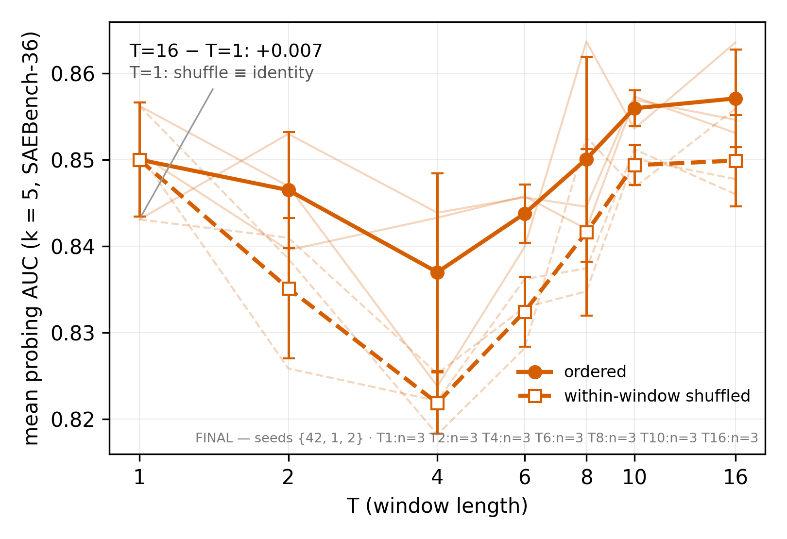
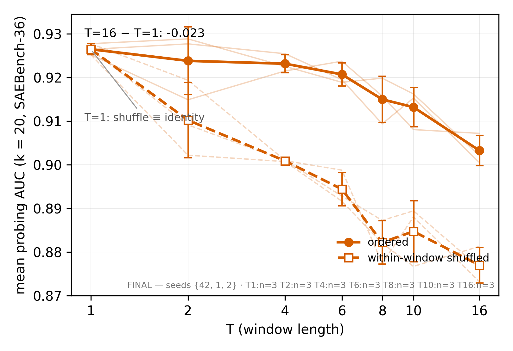
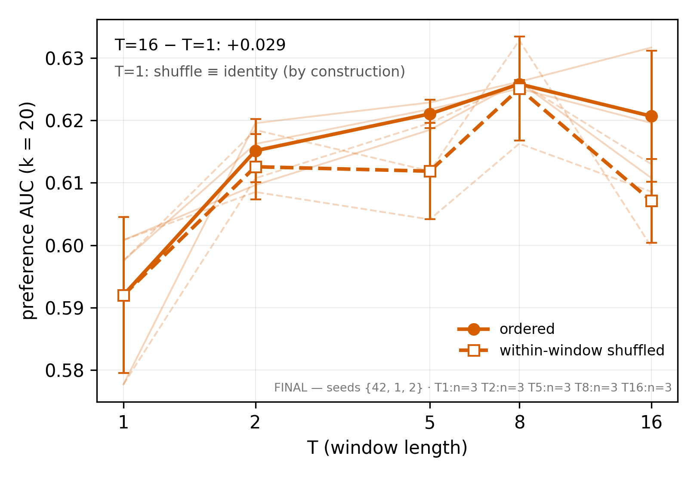
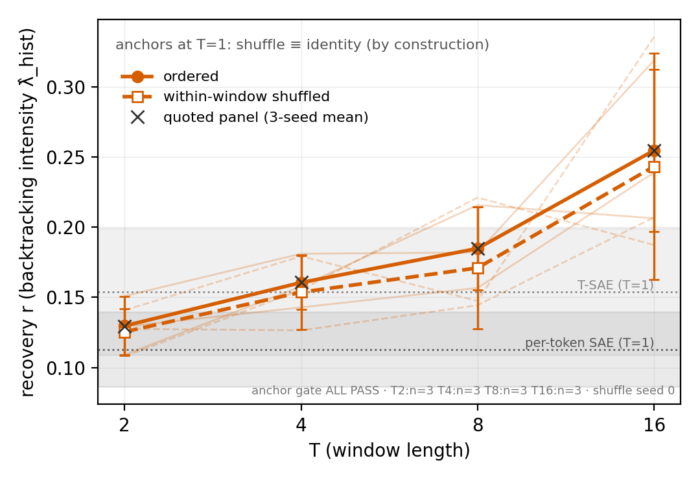
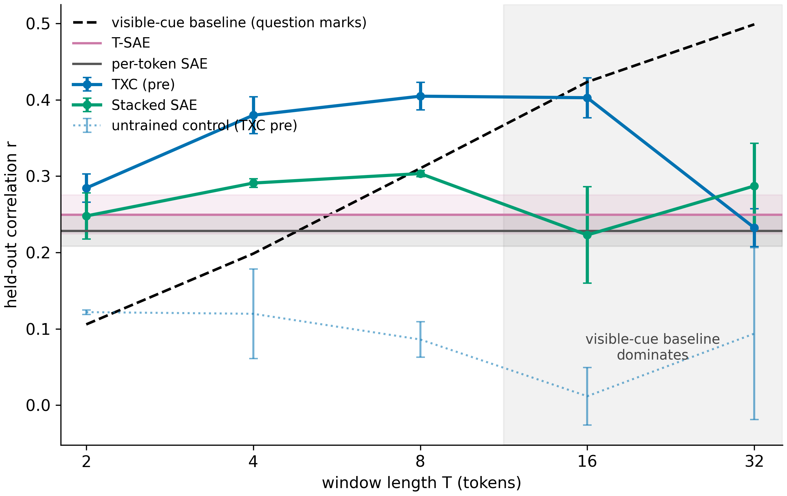

# REBUTTAL HANDOFF — where Dmitry (or his agent) finds every deliverable

**Code-reader's companion: `REBUTTAL_CODE_GUIDE.md`** (same directory) —
which code produced the probing/RLHF shuffle ablations, class-level
arch pins, shuffle-instrument semantics, checkpoint locations, pod
SSH access, and the caveats an agent must not trip over.
**Cell inventory: `REBUTTAL_CELL_CENSUS.md`** (same directory) — every
cell we have results for, labeled {ReLU+TopK} paper-faithful vs
{BatchTopK} btk-only vs relu-mix (the misinterpreted arm); regenerate
with `.venv/bin/python scripts/cell_census.py --write` (cells are
landing all night).

**Deadline: rebuttal 13:00 BST 2026-07-28; exhibits READY BY 11:00 BST**
(Han's list, LOG ~00:35 entry). **THIS DOCUMENT SUPERSEDES the
meeting PDF (`private/meeting_tsweep_plots_2026-07-27.pdf`) as the
deliverable surface — plots are embedded below and refresh
automatically as morning re-renders overwrite the same paths.** Every number is PTR (pending team
ratification) unless marked ratified. Licences and caveats live in
`experiments/explorations/task_hunt/LOG.md` — search the stamp given
per item. Master data: `results/leaderboard.jsonl` (append-only; every
row carries `code_version` + `train_key`/`eval_key`).
**Checkpoints:** durable mirror = HF dataset
`han1823123123/temp-bench-data` under `ckpts/<train_key>/
model.safetensors` (LFS sha256 = the receipt; uploader
`push_ckpts_hf.py` in-repo). Lookup: leaderboard row → its
`train_key` → that path. Mirrored as of 02:0x: ALL 26 trained
RLHF ckpts (the full RLHF shuffle-ablation set incl. eq twins,
runpod-2 receipts) + 30 probing certificate-evidence ckpts (twin
pairs across the 7-T grid, sae pair, positive control; LFS
spot-check MATCH — runpod-1 receipts); remaining probing sweep
ckpts mirror in priority order, pod-local meanwhile at
`checkpoints/<train_key>/` indexed by the in-repo
`checkpoints/manifest.jsonl`. Paper-era ckpts (if needed):
`han1823123123/txcdr-base` (`<arch_id>__seed42.pt`) +
`temp-bench-models` per COMPOSITION_AUDIT. **MATRIX ARM MAPPING (Han-pinned ~02:3x):** {BatchTopK} =
`btk-only` (NO ReLU, signed selection — the delivered sweep arm);
{ReLU+TopK} = the PAPER-FAITHFUL composition
ReLU(TopK_{k_pos·T}(Σ)) — commissioned, lands Aug 1-2 (until then:
archived T=5 anchors). `relu-mix` (ReLU-before-BatchTopK) is
NEITHER matrix arm — certificate evidence only. `eval_cfg.arm`
carries the row-level label.

---

## 1+2. Sparse probing shuffle/T-sweep, k=5 and k=20

- **Figs:** `figs_writeup/fig_probing_shuffle_tsweep_k5.{png,pdf}`,
  `..._k20.{png,pdf}` (k20 = headline `fig_probing_shuffle_tsweep.*`;
  SAEBench-36 CT-excluded convention; `_38task` twin = robustness).
  7-point re-renders (T{1,2,4,6,8,10,16}) land by morning — same
  paths, overwritten.
- **Tables:** `figs_writeup/tab_probing_shuffle_tsweep_k5.md` +
  `_k20.md` (+.csv) — land WITH the morning render (directive of
  00:35).
- **Data:** leaderboard rows: `experiment=probing`,
  `arch=txc_batchtopk_pre_btkonly` (btk arm) /
  `txc_batchtopk_pre` (relu-mix arm),
  `training_cfg.arch_hparams_override.T` ∈ {1..16}, `eval_cfg.k_feat`
  ∈ {5,20}, `eval_cfg.shuffle` ∈ {none, within_window}, seeds
  {1,2,42}. Datasource `gemma_2_2b_it_l13_fineweb_24k128` (paper
  probe cache; gemma-2-2b-it L13).
- **PAPER-FAITHFUL ARMS (Han requirement, commissioned ~02:3x):**
  the TRUE paper-composition T-sweeps (probing: trained
  ReLU(TopK_{20T}(Σ)) via the upstream class; RLHF: agentic_txc_02
  ported + trained) are COMMISSIONED and land in the amendment
  window (target Aug 1-2). Until then the exhibits carry the v2
  arms + the archived paper-composition T=5 anchors, labeled per
  the rule below.
- **LABELING RULE (binding, Codex-prompted):** the T-sweep arms are
  v2 compositions — label "TXC (v2, relu-mix/btk-only)", never
  "paper base"; the paper-exact composition appears only as the
  archived T=5 anchor (arch `paper_txc_base_v1`, 3 seeds). See
  CODE_GUIDE §1 + LOG ~02:2x.
- **Renderer:** runpod-1's analyze/make_writeup_fig pathway
  (`experiments/probing/actmix/` — see their morning render commit).
- **Licences (LOG stamps):** k-inversion quote licence (07-27 ~12:2x +
  ratifications); framing guard: level story leads; "probe-budget-
  dependent, no monotone window win at any k". Both-arms: the
  divergence-onset certificate (see item 8).

## 3. RLHF shuffle/T-sweep

- **Fig:** `figs_writeup/fig_rlhf_shuffle_tsweep.{png,pdf}` (FINAL
  3-seed; 7-point re-render lands ~morning, same path).
- **Table:** `figs_writeup/tab_rlhf_shuffle_tsweep.md` (with render).
- **ARCH (explicit, anti-confusion): the RLHF TXC exhibit arch is
  `txc_batchtopk_post_btkonly` — the plain windowed BatchTopK
  crosscoder (POST composition; probing uses PRE). It is NOT
  txc_pro (refutation receipts: LOG ~01:55). BINDING DISCLOSURE
  (LOG ~02:0x): the PAPER's RLHF TXC arm was `agentic_txc_02` = class
  `MatryoshkaTXCDRContrastiveMultiscale` (matryoshka+contrastive,
  multiscale shifts [1,2,3], per-window TopK→ReLU, k_win=500;
  COMPOSITION_AUDIT §6). It is a DISTINCT class from txc_pro —
  same enriched family, but NO subseq curriculum / k-asymmetry
  (txc_pro's defining features) — the
  exhibit is the plain-TXC modernization at the paper's window
  budget (k_win=100·T = 500 at the paper's T=5; per-window
  selection granularity preserved via the POST composition).
  T-sweep/shuffle conclusions are statements about the plain arm.
  Every RLHF caption carries this.**
- **Data:** `experiment=rlhf` rows, btk arm complete at T{1,2,5,8,16}
  + T{4,6,10} landing overnight (x4 via runpod-a swap-drain; x6/x10
  drain ~06:30). **Relu-mix arm: DONE-BY-CERTIFICATE — RLHF twins
  are tensor-IDENTICAL through T16 (829f05070: Δauc exactly 0,
  boundary_min_pre ≥ 2.21, no negative-pre-activation contact at
  RLHF's k-regime). The btk fig + the certificate line IS the
  both-arms deliverable; rmx_b T{8,10} cells run as eq-extension
  measurement points (per-cell checks).**
- **Licences (LOG):** 21:10 verdict extension (T8 peak n=3; T16
  regime boundary, decline 2-of-3 seeds; shuffle quote form "gaps ≈ 0
  at every T ≤ 8, seed-mixed at T16"); R-E1 lead licence.

## 4. Backtracking intensity λ̂ (hunted task #1)

- **Fig:** `figs_writeup/fig_lambda_shuffle_tsweep.{png,pdf}`
  (retrained overlay, anchor gate 6/6; 7-point re-render adds
  T6/T10).
- **Table:** `figs_writeup/tab_lambda_shuffle_tsweep.md` (with
  render).
- **Data:** hunt-width cells (d_sae 2048) — overlay card
  `SHUFFLE_OVERLAY_CARD.md` + T_FILL card (c09485d1c) under
  `experiments/explorations/task_hunt/`; substrate
  `ward_real_lambda_base_l12` (R1-Distill-8B L12).
- **CAPTION-BINDING flags (LOG 00:01 + 00:18):** T6 dip below T4;
  T10 seed-fragile — VENUE-LOCALIZED training instability (same
  seed/T trains fine on dq). Both-arms: R30 identity at hunt widths
  (|Δ| ≤ 2.2e-8) + T16 spot-check pair (runpod-a drain).
- **Deep licences:** REBUTTAL_PACK.md §1 (R22 margin + mandatory
  disclosures; arm guard pre-vs-post).

## 5. Question-gap dq (hunted task #2)

- **Fig:** `experiments/explorations/task_hunt/figs_writeup/
  fig2_question_gap_tscaling.{png,pdf}` + fills (T6/T10 on-plateau,
  88cb4f867).
- **Table:** `figs_writeup/tab_dq_tsweep.md` (with morning render).
- **Caveats:** TOY-class per Dmitry's bar (meeting 07-27) —
  within-SAE use only; shuffle columns are SCREEN-class (overlay
  ruled out, LOG 00:05); passed-then-demoted framing.

## 6+7. Safety-relevant hunted tasks (THE GOLD — status, not yet exhibits)

- **⚑ ITEM 6 = SYCGEN, IN FLIGHT (state 02:58 07-28): the hunt
  found its first KEEP.** `sycgen` (sycophancy-adjacent age-flattery
  register, generated corpus under the elicitation harness) passed
  the screen bundle **KEEP 3/3** — gpt2/gemma2_2b/llama31_8b, zero
  kill clauses, per-token best 0.501/0.529/0.530 ≈ chance vs window
  best 0.616/0.641/0.652 (T64/actxmean_mlp), order-0, wd passes
  (LOG 02:28, `task_hunt/sycgen/results/*.json`). The pre-authorized
  **matrix retrain is RUNNING** on mac-d's 2×H100: **36 cells,
  T {1,2,4,8,16} × seeds {42,1,2} × shuffle overlay, btk-only arm
  (either-arm rule; card 74d260321 + §5 T-axis amendment 90c89f294,
  LOG 02:54).** T-axis disclosure: T{6,10} cannot tile this eval's
  frozen L=32 window (`eval_window_L % T == 0`; ValueError receipts
  kept for all 12 doomed cells, ≈$2 burn disclosed) — the axis is
  IDENTICAL to the delivered λ̂ exhibit's (item 4), not a coverage
  retreat. Shard0 (untrained half) DONE 18/18-amended; per-token T1
  anchors landed r=0.470/0.487/0.489; shard1 ETA ~03:35–03:55 →
  overlay → **fig+table in `figs_writeup/` plausibly by ~04:30,
  comfortably before 11:00** (fallback: amendment window; renderer
  pre-written + fixture-tested, 1618b5a7a). Rows land on the
  canonical leaderboard under
  `datasource=sycgen_real_age_llama31_8b_l14`,
  `eval_cfg.retrain_tag=sycgen_keep_r1`.
- **Item 7 = evalage, CANDIDATE (screens pending):** corpus v1
  COMPLETE (400 docs / 2.04M tokens, claude-haiku, both card gates
  pass, HF-pushed w/ sha receipts) + **6/6 label-side bands PASSED**
  (unigram 0.586 vs the 0.60 bar that killed retryesc) — NOT a KEEP
  until the probe-side screen runs (3-tokenizer re-tokenization via
  mac-d's `screen_grids.py` transplant, then screens on mac-c's
  L40S). Earlier context: every found-corpus candidate resolved
  (kills with receipts — reask_hr, retryesc label-side, warddebt
  geometry; retryesc = signal-UNTESTED, regenerating as
  retryesc_gen; dharm/warddebt = STRUCTURALLY UNSCREENABLE); the
  elicitation harness (Claude-API backend, provenance weakening
  disclosed in-card) is what produced sycgen + evalage. StruQ runs
  $0 premeasures under our bars (runpod-a) as the 4th candidate.
- **Where verdicts appear:** LOG (stamped entries) +
  `experiments/explorations/task_hunt/<candidate>/` cards/results.
- **For the 13:00 submission:** item 6 is quotable NOW as "first
  dedicated safety-relevant task passed all screens; full T-sweep
  running, exhibit expected before the deadline" — with the exhibit
  itself landing by ~05:00 if the retrain drains on schedule
  (renderer pre-written + fixture-tested, 1618b5a7a).
  Item 7 + further candidates: "results follow within the amendment
  window (Aug 3)."

## 8. tsae width-match (additional item) — COMPLETE ✓

- **Verdict + quote-form:** LOG 00:18 entry ("no improvement —
  dictionary width was not what limited it… probing width only").
- **Probing:** `experiments/probing/actmix/WIDTH_MATCH_TSAE_CARD.md`
  + runner `width_match_tsae.py`; rows: `arch=tsae_btkonly` with
  `arch_hparams_override.d_sae=18432`, seeds {1,2,42} — NO LIFT
  (k20 0.8708 vs paper-width band 0.8718±0.0008).
- **RLHF:** was NEVER narrow — receipts in
  `experiments/rlhf/…/actmix_rlhf/results/papermatch.json` (shipped
  ckpts @18432) + CARD §7 A4 (runpod-a); 3-seed set complete
  (k500 0.621±0.004, k20 0.600±0.002).

## 9. Both-arms / composition certificate (underpins every item's arm claim)

- **Onset map:** identity = sae×3 + pre-T1 (machine precision);
  divergence from T=2, growing with window depth; T16 ~40% disjoint
  survivor sets, ≈0.002 AUC at d_sae 18432. Table + per-cell
  receipts: `experiments/probing/actmix/RM_EQUIVALENCE.md` (incl.
  ALIAS EXCLUSION LIST — any future arm-diff must exclude those
  train_keys). Morning: 3-seed onset map + boundary_min_pre traces +
  certificate (PRELIMINARY until then). Pack §3 carries the
  redrafted both-arms licence.
- **RLHF regime differs — now FULLY CERTIFIED:** twins
  tensor-identical through T16 (829f05070; pre-registered
  divergence refuted and disclosed). Unified mechanism frame:
  rare between-sample boundary contact (probing) vs no contact
  (RLHF) — one mechanism, two measured regimes. Quote per-task,
  never cross-task.
