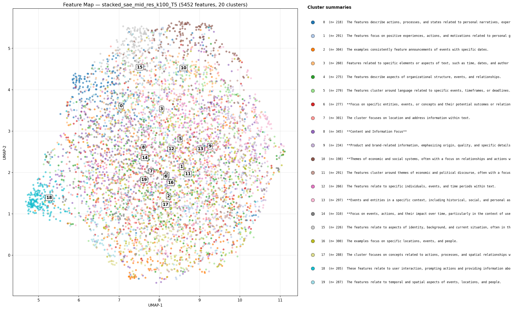
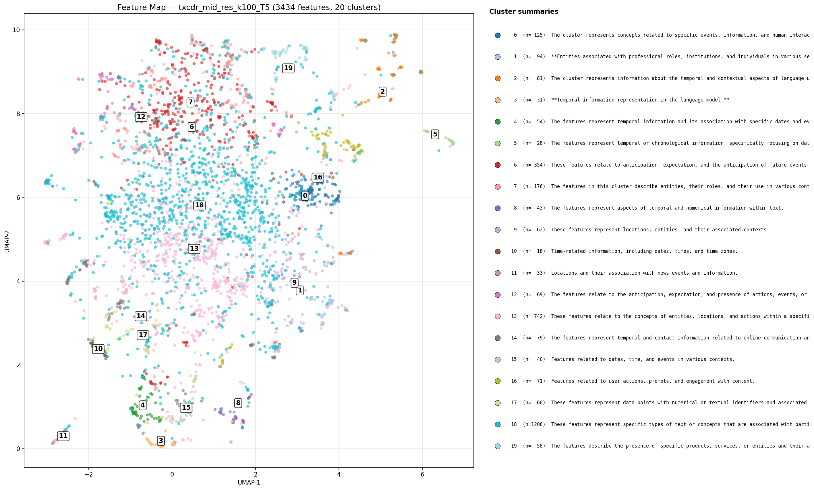

## Feature Map — Unsupervised Clustering of SAE/TXCDR Features

Quick sanity check on whether the autointerp'd features organize into
meaningful groups when projected to 2D. See [[nlp_gemma2_summary]] for the
parent training run.

## Method

- **Feature representation**: decoder directions averaged across T
  positions and L2-normalized (one `d_in=2304`-dim vector per feature).
- **Pipeline**: PCA 50D -> UMAP 2D (cosine metric, `n_neighbors=15`) -> KMeans
  (`n_clusters=20`).
- **Labels**: for each cluster, gemma-2-2b-it is shown the autointerp
  explanations of the member features and asked for a one-line cluster
  summary. Same explainer model as autointerp, no API calls.
- **Filter**: only features that have a non-empty autointerp explanation
  (`stacked_sae mid_res k100 T5`: 5,452 / 18,432 features).

Code: `temporal_crosscoders/NLP/feature_map.py`. Interactive plotly HTML
is in `viz_outputs/feature_map_*.html`.

## Results — StackedSAE (mid_res k100 T5)

Cluster sizes are remarkably uniform (198-345 features per cluster) — a
symptom of KMeans on a mostly unstructured embedding. **PCA explained
variance is only 6.4% at 50 components**, so the SAE decoder directions
don't sit on a low-dimensional linear manifold, and the UMAP map looks
like a diffuse blob with only mild sub-structure.

Gemma cluster summaries group into a few recurring themes:

- **Event/time/location** (clusters 2, 3, 5, 7, 12, 16, 19) — "specific
  events with dates", "location and address information", "temporal and
  spatial aspects of events". Dominant theme, consistent with FineWeb's
  news / listings bias.
- **Actions and processes** (clusters 0, 17) — "actions, processes,
  states related to personal narratives".
- **Economic / political discourse** (clusters 10, 11) — "economic and
  social systems", "economic and political discourse".
- **Product / brand / service** (clusters 9, 18) — "product and
  brand-related information", "user interaction around products". Picks
  up the FineWeb promotional bias noted in [[nlp_gemma2_summary]].
- **Generic / mixed** (clusters 6, 8, 13, 14, 15) — gemma falls back to
  vague summaries like "Content and Information Focus"; low information
  density.

## Results — TXCDR (mid_res k100 T5)

TXCDR tells a **very different** story. With 3,434 labeled features
clustered into the same 20-cluster KMeans, the sizes are wildly uneven:

| Cluster | Size | % of total | gemma summary (truncated) |
|---:|---:|---:|---|
| 18 | 1,208 | 35.2% | "specific types of text or concepts associated with particular contexts" |
| 13 |   742 | 21.6% | "entities, locations, and actions within a specific context" |
|  6 |   354 | 10.3% | "anticipation, expectation, and future events or actions" |
|  7 |   176 |  5.1% | "entities, their roles, and their use in various contexts" |
|  0 |   125 |  3.6% | "events, information, and human interactions" |
| 10 |    18 |  0.5% | "time-related information: dates, times, time zones" |
| (14 others) | <100 each | — | — |

Two "megaclusters" absorb **57%** of all labeled TXCDR features, while
the remaining 18 clusters split the rest. The gemma summaries are also
noticeably more temporal: 10 of 20 TXCDR clusters explicitly mention
"temporal", "time", "chronological", or "anticipation" language (vs ~5
of 20 for SAE). Consistent with TXCDR being trained with a shared-z
window, which biases its features toward temporally coherent patterns.

## TXCDR vs SAE — Comparison

| Aspect | SAE | TXCDR |
|---|---|---|
| Labeled features | 5,452 | 3,434 |
| Cluster size range | 198–345 (uniform) | 18–1,208 (power-law) |
| Largest cluster | 6.3% | **35.2%** |
| Top-2 clusters | 12% | **57%** |
| Cluster summaries mentioning "temporal/time" | ~5 / 20 | **~10 / 20** |
| Dominant themes | event, location, product, economic | temporal/anticipation, entity-in-context |

The headline: **TXCDR decoder directions cluster much more strongly
than SAE decoder directions**, and the resulting groups are more
temporally flavored. This is the first direct evidence in this sweep
that TXCDR's temporal inductive bias shows up in the learned feature
geometry itself — not just in downstream loss/FVU numbers. SAE features
look like a cloud; TXCDR features look like two big blobs and a long
tail.

Caveat: TXCDR has **fewer** labeled features (3,434 vs 5,452), because
the autointerp scan found fewer non-dead features. Part of the apparent
concentration could be because z is shared across T positions, so many
TXCDR features fire on very similar windows and end up with similar
top-activating examples. The geometric difference is real either way —
whether it reflects "better semantic structure" or "less diverse
coverage" is an open question.

## What this actually tells us

Event/time/location dominates both architectures, FineWeb promo bias is
visible in both, and TXCDR shows genuinely structured feature geometry
while SAE does not. Two things would sharpen the picture:

1. **Better explainer model.** Several cluster summaries are generic
   gemma filler. Running this with a stronger LLM would mostly fix the
   label quality without changing the geometry.
2. **Better feature representation.** Decoder directions are cheap but
   capture only *where in activation space* a feature points — not
   *when* it fires. An activation-fingerprint representation (scan many
   inputs, record per-feature firing pattern) would likely produce
   sharper clusters.

## Files

- `temporal_crosscoders/NLP/feature_map.py` — pipeline
- `temporal_crosscoders/NLP/viz_outputs/feature_map_*.html` — interactive
- `temporal_crosscoders/NLP/viz_outputs/feature_map_*.png` — static
- `temporal_crosscoders/NLP/viz_outputs/feature_map_*_clusters.json` — cluster metadata
