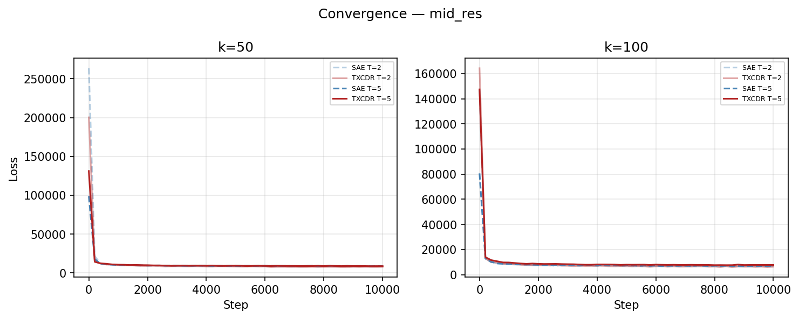
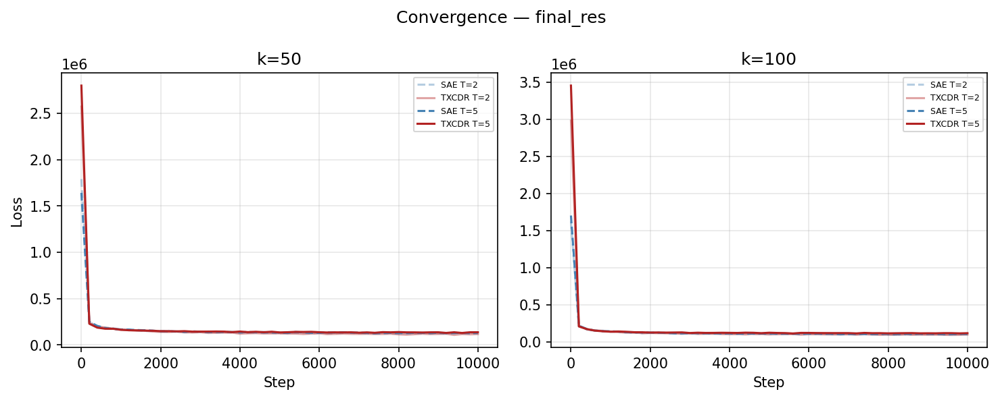
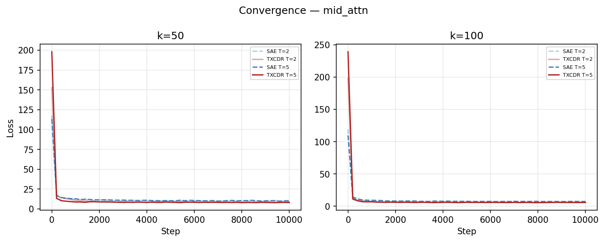
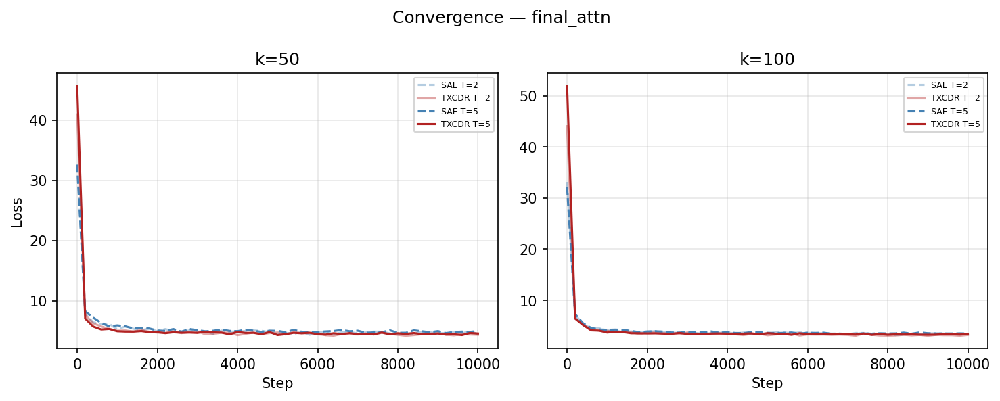
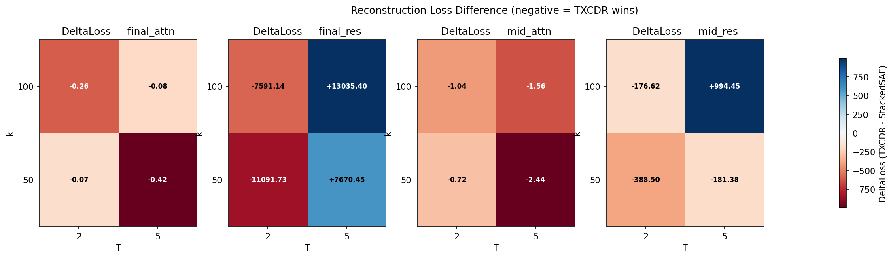
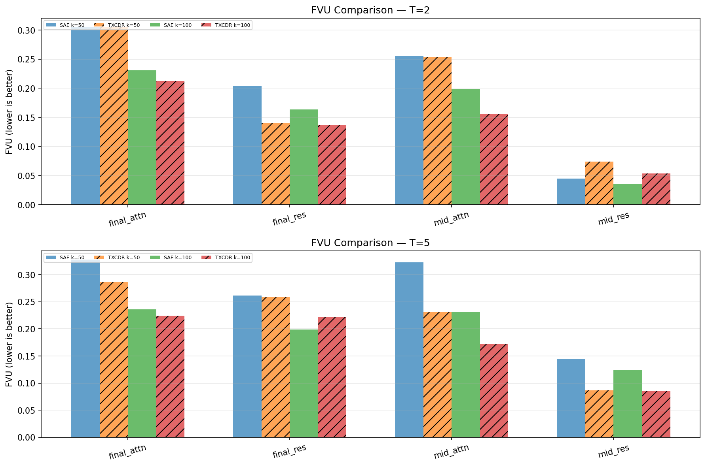
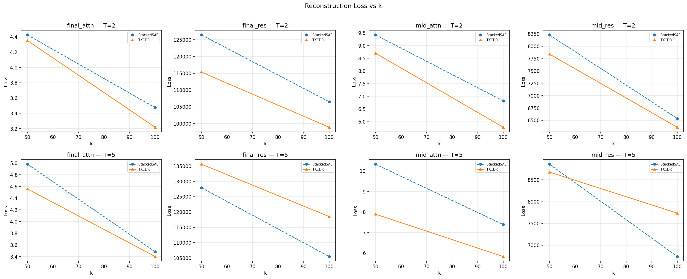
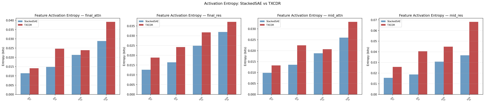
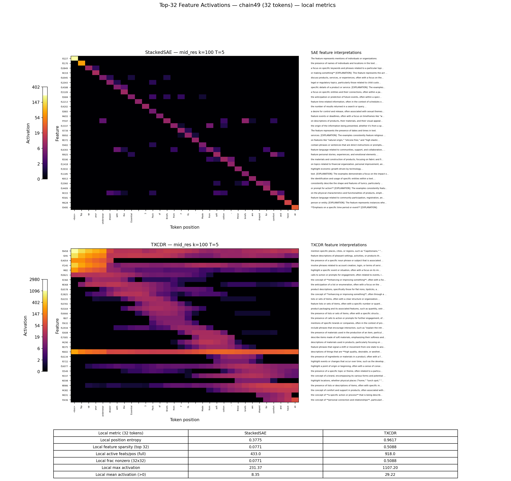

## NLP Gemma 2 2B Sweep — Summary

End-to-end results for training StackedSAE vs TemporalCrosscoder on Gemma 2
2B-IT activations from FineWeb, plus a local feature-activation example and a
brief autointerp critique. See [[nlp_gemma2_sweep]] for the original plan.

## Training Setup

Activations are cached once from `google/gemma-2-2b-it` running on streamed
FineWeb text, then both architectures (StackedSAE, TemporalCrosscoder) are
trained on the cached tensors via sliding windows of length T. Training
optimizes MSE reconstruction with TopK sparsity. Loss is `(x_hat - x)^2`
summed over the hidden dim and averaged over batch and window positions —
no auxiliary sparsity penalty.

### Hyperparameters

| Group | Parameter | Value |
|-------|-----------|-------|
| Model | base LM | `google/gemma-2-2b-it` |
| Model | `d_model` | 2304 |
| Model | layers extracted | 13, 25 (residual + attn outputs) |
| Cache | dataset | FineWeb `sample-10BT` |
| Cache | `NUM_CHAINS` | 24,000 |
| Cache | `SEQ_LENGTH` | 32 tokens |
| Cache | activation dtype | float32 mmap |
| SAE | `D_SAE` | 18,432 (8x expansion) |
| SAE | sparsity `k` | 50, 100 |
| SAE | window `T` | 2, 5 |
| SAE | architectures | `stacked_sae`, `txcdr` |
| Train | `TRAIN_STEPS` | 10,000 |
| Train | optimizer | Adam, betas `(0.9, 0.999)` |
| Train | `LEARNING_RATE` | 3e-4 |
| Train | `BATCH_SIZE` | 256 windows |
| Train | grad clip | 1.0 |
| Train | precision | fp16 autocast |
| Train | `SEED` | 42 |
| Sweep | total runs | 4 layers x 2 k x 2 T x 2 arch = **32** |

### Autointerp Setup

| Group | Parameter | Value |
|-------|-----------|-------|
| Pipeline | top-K activating windows per feature | 10 |
| Pipeline | sample chains scanned | 2,000 (of 24,000) |
| Pipeline | scan device | `cuda:1` (batched windows on GPU) |
| Explainer | model | `google/gemma-2-2b-it` (local) |
| Explainer | precision | bfloat16 |
| Explainer | max generation tokens | 256 |
| Explainer | temperature | 0 (greedy) |
| Explainer | prompt | structured `[EXPLANATION]:` template (no harm eval) |
| Detection | scoring | **disabled** for this run (`--no-score`) |

The pipeline streams cached activations, runs the trained SAE/TXCDR on
sliding T-windows in batches on `cuda:1`, accumulates per-feature top-K
activating windows via min-heap, decodes the windows back to text using the
gemma tokenizer, and asks gemma-2-2b-it to label each feature in 1-2
sentences. Detection scoring (the validation step that asks the LLM to
classify match-vs-random examples) was skipped for speed.

## Convergence

All 32 runs reached a stable loss plateau within the 10k-step budget (see
`convergence_*.png` per layer). Loss curves are monotonically decreasing
with the usual fast-then-slow shape; no instabilities or restarts. There
is no clear sign of underfitting at 10k steps.

## Final Metrics

Headline: **TXCDR wins on attention layers, loses on residual layers, with
mixed/wash on `mid_res`**. Across all 16 (layer, k, T) combos, TXCDR is
better on FVU in 11 of 16 and on raw loss in 9 of 16.

### Best per-architecture (lowest FVU)

| Layer | Arch | k | T | Loss | FVU | Window L0 |
|-------|------|---|---|------|-----|-----------|
| `mid_res` | `stacked_sae` | 100 | 2 | 6537.5 | **0.0358** | 200 |
| `mid_res` | `txcdr` | 100 | 2 | 6360.9 | 0.0537 | 200 |
| `final_res` | `stacked_sae` | 100 | 2 | 106508.6 | 0.1634 | 200 |
| `final_res` | `txcdr` | 100 | 2 | 98917.4 | **0.1369** | 200 |
| `mid_attn` | `stacked_sae` | 100 | 2 | 6.82 | 0.1985 | 200 |
| `mid_attn` | `txcdr` | 100 | 2 | 5.78 | **0.1555** | 200 |
| `final_attn` | `stacked_sae` | 100 | 2 | 3.47 | 0.2308 | 200 |
| `final_attn` | `txcdr` | 100 | 2 | 3.22 | **0.2127** | 200 |

### TXCDR mean delta-loss (TXCDR - SAE; negative = TXCDR wins)

| Layer | Mean delta-loss | Range |
|-------|----------------:|-------|
| `final_attn` | **-0.21** | [-0.42, -0.07] |
| `mid_attn` | **-1.44** | [-2.44, -0.72] |
| `mid_res` | +61.99 | [-388.50, +994.45] |
| `final_res` | +505.74 | [-11091.73, +13035.40] |

The residual layers have raw activation magnitudes that are ~10^4-10^5 larger
than attention outputs, so absolute loss numbers are not comparable across
layers — FVU is the fairer view, and there TXCDR's edge holds across most
of the grid.

### Entropy (binary firing pattern, bits)

StackedSAE entropy is consistently **lower** than TXCDR entropy across every
combo (typically 0.01-0.04 vs 0.02-0.07). This is the *opposite* of the
toy-model prediction in [[nlp_gemma2_sweep]] — we expected SAE to have higher
entropy from independent per-position fitting. The most likely cause is
that the TXCDR top-k = `k * T` produces more total active features per
window, which inflates the binary entropy of feature firing.

## Specific Example: chain 49, mid_res, k=100, T=5

Visualizes the top 32 features per model (one most-exclusive feature per
token position) for a single 32-token FineWeb chain. Selection is greedy
within each architecture, no feature reused across positions. All metrics
in the table below are **local** to this 32-token sequence.

| Local metric (32 tokens) | StackedSAE | TXCDR |
|--------------------------|-----------:|------:|
| Position entropy (bits) | 0.378 | 0.962 |
| Feature sparsity (top 32) | 0.077 | 0.509 |
| Active feats / pos (full D_SAE) | 433 | 918 |
| Frac nonzero (32x32 grid) | 0.077 | 0.509 |
| Max activation | 231.4 | 1107.2 |
| Mean activation (>0) | 8.35 | 29.22 |

**Reading the heatmap.** SAE produces sharp, near-diagonal blocks: each
chosen feature fires at one or two positions and is silent elsewhere
(7.7% of the 32x32 grid is nonzero). TXCDR produces broad horizontal
bands: because z is shared across the T=5 window, any feature that fires
once tends to be visible across 5 consecutive positions, smearing
activations across the row. The TXCDR grid is ~6.6x denser locally and
its peak activation is ~5x higher, consistent with the toy-model
prediction of stronger temporal coherence — but it also means TXCDR's
"per-token" feature attribution is muddier.

## Autointerp — Low Quality, Caveats

We ran `autointerp.py` on `mid_res k=100 T=5` for both architectures,
explainer = local gemma-2-2b-it, no detection scoring. Results: 5,453 features
labeled for SAE, 3,435 for TXCDR. Most explanations are vague,
template-y, or wrong. **Treat current autointerp as a smoke test, not as
ground truth.** The main reasons:

1. **Sequence-level, not token-level activations.** The pipeline shows
   the LLM full text windows (the SAE was trained on, e.g., a 5-token
   slice) but does not highlight *which* token within the window the
   feature is firing on. The LLM has to guess the position from
   context, and tends to anchor on the most salient phrase regardless
   of where the SAE feature actually peaks. Per-token highlighting (or
   per-position max-activation arrows) would help a lot.
2. **Promo / boilerplate domination of FineWeb.** The 24k cached chains
   are not deduplicated and FineWeb's `sample-10BT` is heavy on
   promotional text, phone-number lists, navigation chrome, and
   templated forms. Whole feature clusters end up labeled "phone
   numbers" or "advertisement boilerplate" because the top activations
   really are dominated by that content. Example: `feat_000049` of
   `stacked_sae mid_res k100 T5` lists 20 phone-number snippets and gets
   labeled "patterns found in phone numbers" — which is technically
   correct but uninformative.
3. **Weak explainer model.** gemma-2-2b-it (2B params, instruct-tuned) is
   the explainer. It struggles with the structured `[EXPLANATION]:` format,
   often produces verbose reformulations of the inputs, and rarely
   identifies abstract patterns (causal relations, syntactic roles,
   register). A 70B+ open model or Claude Haiku/Sonnet would do
   meaningfully better on the same prompts.
4. **No detection scoring run.** We disabled `--score` for speed, so
   there is no validation that the explanations actually predict held-out
   activations. The `interpretable` flag is therefore `false` everywhere.

Improving any one of these (token-level anchoring, deduplication +
better data slice, stronger explainer, enabling detection scoring) should
substantially raise quality. Token-level anchoring is the cheapest fix
and likely the highest-leverage.

## Files

- Code: [temporal_crosscoders/NLP](../../temporal_crosscoders/NLP/)
- Sweep summary: `temporal_crosscoders/NLP/viz_outputs/summary_table.txt`
- Per-feature autointerp: `temporal_crosscoders/NLP/viz_outputs/autointerp/{model}_{layer}_k{k}_T{T}/feat_*.json`
- Sentence example: `temporal_crosscoders/NLP/viz_outputs/sentence_mid_res_k100_T5_chain49_exclusive.png`
