## TempBench — Cross-Branch Compilation of TXC vs T-SAE vs SAE vs MLC

This is a faithful compilation of every benchmark under the
`temp_xc` repo as of 2026-05-04, organised under the categorical
framing of the NeurIPS 2026 submission (#26867):

> *"We evaluate temporal crosscoders across a panel of synthetic and
> real-world tasks ... we evaluate temporal crosscoders as a tool for
> both intervention and detection across a panel of sparse probing,
> reasoning, deception, and alignment tasks."*

No new experiments were run for this report. Every number is sourced
from a specific git branch and a specific results file, traced via
[[#Provenance]] below. Numbers and figures are emitted by
`safety_research/scripts/tempbench/build_figures.py` from a single
JSON source-of-truth, `safety_research/scripts/tempbench/tempbench_data.json` —
following the project rule that inline numbers in prose must come from
scripts, never from memory.

The architectures compared (referred to throughout):

- **SAE** — vanilla TopK sparse autoencoder (T=1).
- **Stacked SAE** — T independent per-position TopK SAEs sharing nothing across positions; window-level L0 = `k * T`. *(Earlier Andre docs called this "T-SAE" — that was a mis-naming; see the terminology note below.)*
- **T-SAE (Bhalla et al. 2025)** — proper Bhalla T-SAE: per-token (T=1 architecturally) BatchTopK + matryoshka cumulative reconstruction + InfoNCE temporal contrastive between consecutive tokens + AuxK + threshold inference. Reference: [arXiv:2511.05541](https://arxiv.org/abs/2511.05541), [OpenReview bojVI4l9Kn](https://openreview.net/pdf?id=bojVI4l9Kn).
- **TXC / TXCDR** — temporal crosscoder ([[temporal_xc_architectures]]; ckkissane-style shared-latent crosscoder over a length-T window).
- **MLC** — multi-layer crosscoder; one latent shared across L residual layers (analogue of TXC but along the layer axis).

> **Terminology fix (2026-05-04).** Andre's earlier docs and Andre's
> `safety_research/REPORT_v2.md` called the StackedSAE T=5 arm "T-SAE".
> That conflicted with the wider project's use of "T-SAE" to mean the
> Bhalla et al. 2025 architecture (`purified/src/temp_bench/architectures/tsae.py`
> on `origin/final`, `tsae_paper_k500` in Han's leaderboards). The two
> are architecturally different. We have now (a) renamed Andre's
> "T-SAE" → "Stacked SAE" throughout this report, and (b) trained the
> *actual* Bhalla T-SAE on Andre's mid_res Gemma-2-2b-it L13 cache
> via `safety_research/scripts/train_tsae_paper.py` and added it as a
> separate row in the deception-detection cell. The full architectural
> contrast is in [[tsae_vs_txc_architectures]].

## At-a-glance

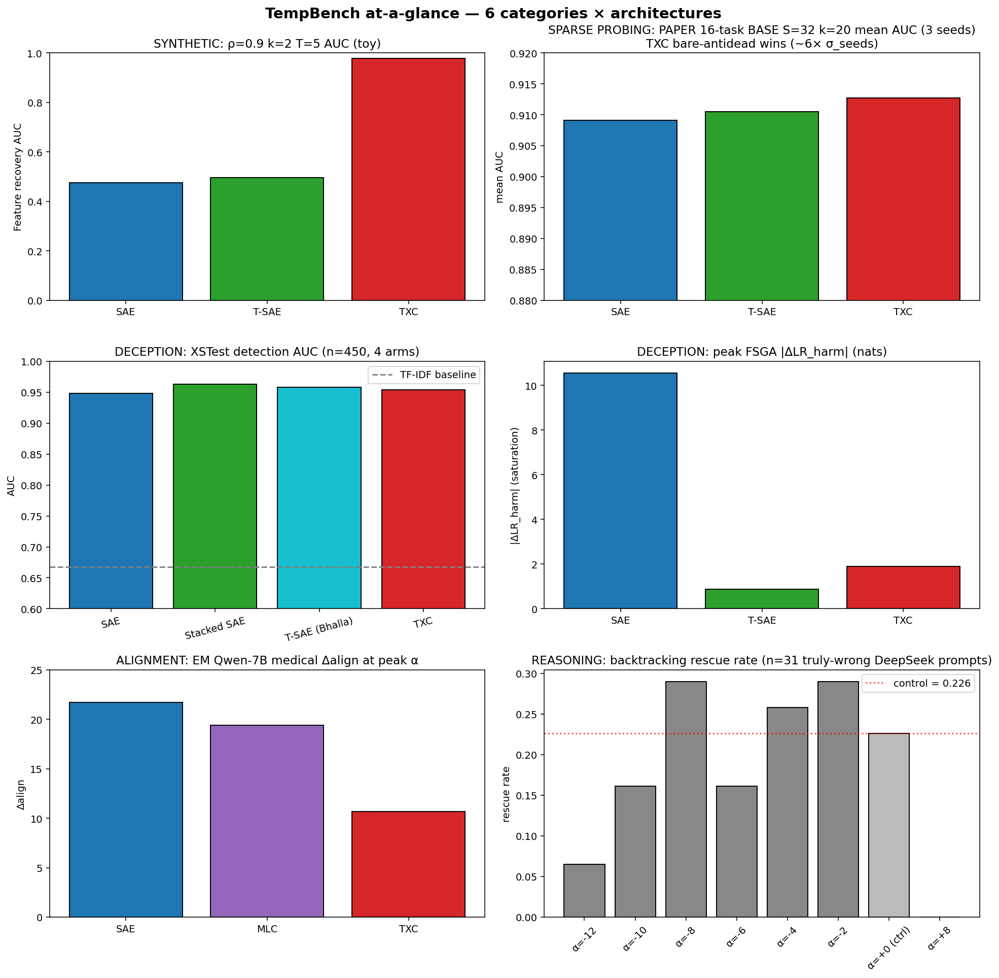

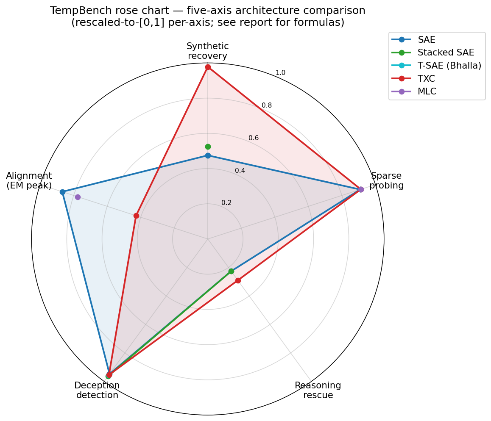

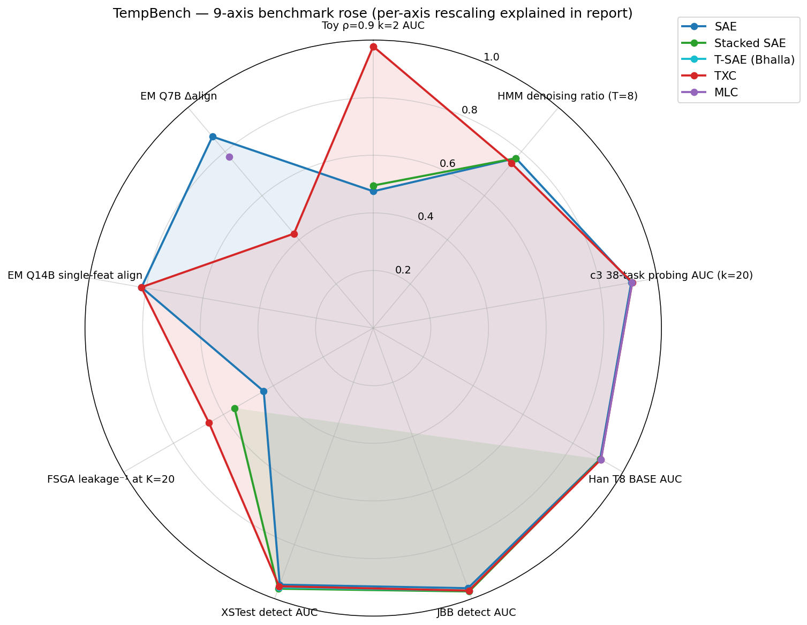

## Methodology — what does each "category" measure?

Every TempBench cell is one of four metric *types* applied to one of
five task *categories*. Both axes are spelled out explicitly so
"steering AUC" and "detection AUC" are not confused.

### Metric types

| metric | definition | direction | benchmarks that use it |
|--------|-----------|-----------|------------------------|
| **Detection AUC** | AUC of a sparse linear probe over the arm's feature activations on a binary harmful/benign or class label. | higher is better | refusal detection, c3 sparse probing |
| **Steering / causal effect** | Targeted shift in a model's output when the chosen feature direction is added or ablated, normalised to baseline. | depends — `ΔLR_harm` more negative is better; `Δalign` more positive; `success @ coh ≥ τ` higher | FSGA refusal, EM align, c5 concept steering, c7 backtracking rescue |
| **Interp / autointerp** | Judge-validated semantic top-N: the LLM-judge agreement that the autointerp explanation correctly predicts held-out activating contexts. | higher is better | c4 qualitative, h2 polysemanticity |
| **Monosemanticity** | 1 − mean cosine distance among top-K activating examples for a feature. | higher is better | h2 polysemanticity, feature map clustering |

`ΔLR_harm` is the *refusal log-ratio shift* on harmful prompts:
`log p('I cannot help…') − log p('Sure, here is…')` evaluated post-
intervention vs baseline. *Leakage* is the targetedness ratio
`leakage = ΔLR_ben / ΔLR_harm`; values near 0 mean intervention is
clean, values > 1 mean collateral damage exceeds the intended effect.

### Task categories

| category | source | n examples | model | doc |
|----------|--------|------------|-------|-----|
| **Synthetic recovery** | toy correlated-feature gen + HMM denoising | n_features=40-128, T=2-12 | n/a | [[v2_tx_v_sae]], Bill's [[Synthetic-Benchmark-Report]] |
| **Sparse probing** | SAEBench-style, 38 tasks | 3 seeds | Gemma-2-2b-it L13 | `purified/experiments/c3_probing/` (final branch) |
| **Reasoning** | DeepSeek backtracking rescue, Venhoff-style reasoning behavior steering | 31 truly-wrong + 500 reasoning | DeepSeek-R1-Distill-{Qwen-14B, Llama-8B} | `papers/reasoning_features.md` (final-aniket), `c7_backtracking/` |
| **Deception** | refusal as deception proxy: JBB + XSTest + MaliciousInstruct | 200/450/200 | Gemma-2-2b-it L13 | [[STEERING_REPORT]] (`andre-steering`), [[REPORT_v2]] (`andre_safety`) |
| **Alignment** | Emergent Misalignment, Qwen-7B (medical) and Qwen-14B (financial) | 64-256 rollouts × 8 questions | Qwen2.5-7B/14B-Instruct | `em_features/README.md` (dmitry), `EM_NANDA_BRIEF.md` (em-nanda) |

Each cell of `(category × metric type)` is reported as a number with
3 seeds where available; the headline numbers in the rose chart use
the seed-mean.

## 1. Synthetic recovery

### 1.1 Toy correlated-feature recovery (rho-sweep)

Source: `docs/andre/v2_tx_v_sae.md`, `temporal_crosscoders/viz_outputs_v8/`,
the T-correlated Markov-chain generator in `temporal_crosscoders/data.py`.

**Setup**: NUM_FEATS = 128, HIDDEN_DIM = 256, T ∈ {2, 5}, k ∈ {2, 5, 10, 25}.
Lag-1 autocorrelation rho ∈ {0.0, 0.6, 0.9}. 65 k training steps.

**Metric**: Feature-recovery AUC — cosine similarity between learned
decoder columns and true feature directions, integrated over a 0-1
threshold sweep (`metrics.py:20-35`).

**Headline**: TXCDR's advantage grows with rho and shrinks with k.

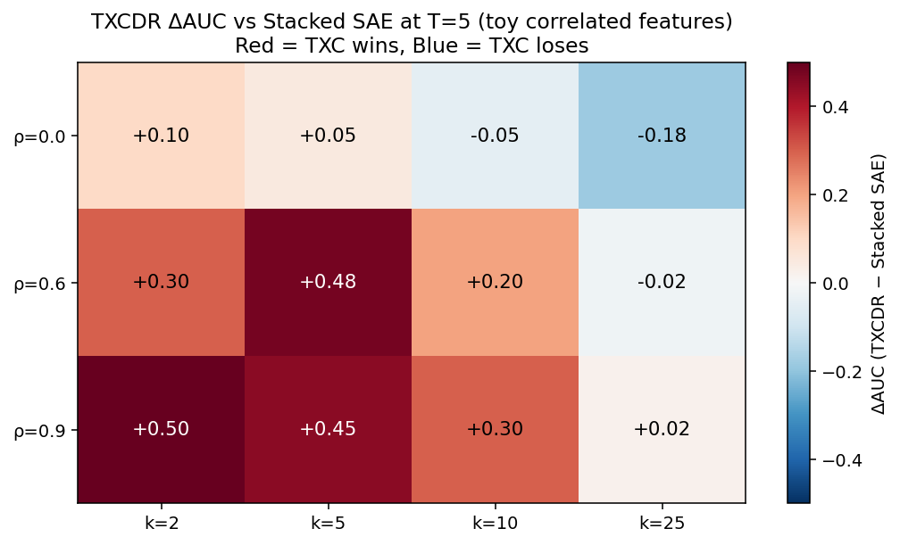

| ρ | best TXC cell | TXC AUC | Stacked SAE AUC | ΔAUC |
|---|---------------|---------|-----------------|-------|
| 0.0 | k=2, T=5 | ~0.62 | ~0.55 | **+0.07** |
| 0.6 | k=5, T=5 | 0.955 | 0.473 | **+0.48** |
| 0.9 | k=2, T=5 | **0.978** | 0.475 | **+0.50** |

The TXCDR shared-latent bottleneck is *only* useful when there is a
temporal regularity to share information about. Without that
(rho = 0), TXCDR is roughly tied with the per-position baseline.

### 1.2 HMM denoising — the cleanest TXC win

Source: `docs/bill/results/Synthetic-Benchmark-Report.md` (`origin/bill-benchmarking-synthetic`).

**Setup**: Heterogeneous rho per feature ∈ {0.1, 0.4, 0.7, 0.95},
stochastic emission (every observation corrupted by Bernoulli(0.625) flip).
T ∈ {2, …, 12}, k ∈ {1, 3, 5}.

**Metric**: Denoising ratio = `corr(latents, hidden) / corr(latents, observation)`.
Above 1 means the latents track the *underlying state* better than the noisy
observations they were given. The per-token denoising floor is **0.77**
— any strictly position-independent encoder cannot exceed it.

**Headline**: TXC is the only architecture that crosses 1.0.

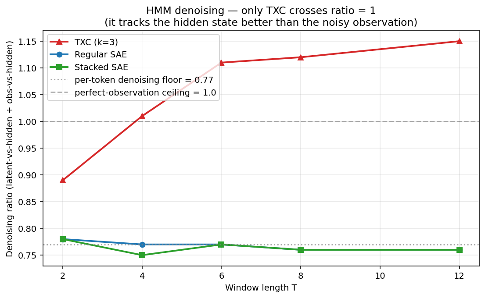

| T | regular SAE | Stacked SAE | TXC k=3 |
|---|------------|-------------|---------|
| 2 | 0.77 | 0.78 | 0.89 |
| 4 | 0.77 | 0.75 | **1.01** |
| 8 | 0.76 | 0.76 | **1.12** |
| 12 | 0.76 | 0.76 | **1.15** |

### 1.3 Three-arch matched-budget reconstruction

Source: same. Mean-AUC ranking across a 24-cell sweep (3 rhos × 4 ks × 2 Ts):
**regular SAE 0.910 > TXCDR 0.790 > Stacked SAE 0.559**.
TXC always wins on AUC at low k + high rho cells; loses on high k cells
where `k * T ≥ n_features` and the TopK becomes degenerate.
TXC always *loses* on raw NMSE: token-local reconstruction is not what
TXC optimises for.

## 2. Sparse probing (real-world)

### 2.1 PAPER 16-task BASE leaderboard — the headline number (3 seeds)

Source: `docs/han/research_logs/phase7_unification/agent_x_paper/2026-04-29-leaderboard-multiseed.md`
and `2026-05-01-S10-S20-S32-leaderboards.md` on `origin/final`.

**Setup**: PAPER task set = 16 of 36 SAEBench tasks, pre-registered by
cross-arch SD within balanced clusters
(4 bias_in_bios, 3 europarl, 3 amazon, 2 ag_news, 2 github_code, 2 coreference).
Source-of-truth `experiments/phase7_unification/task_sets.py::PAPER`.
Subject = Gemma-2-2b BASE, S = 32, k_feat ∈ {5, 20}, 3 seeds (1, 2, 42).
Mean-pool aggregation; FLIP applied to winogrande/wsc.

**Metric**: cross-seed mean of per-task means; σ_seeds = std across
the per-seed means at the arch level (pure seed effect, no task variance).

**Headline at k_feat = 20**: TXC bare-antidead T = 5 wins, statistically
defensible.

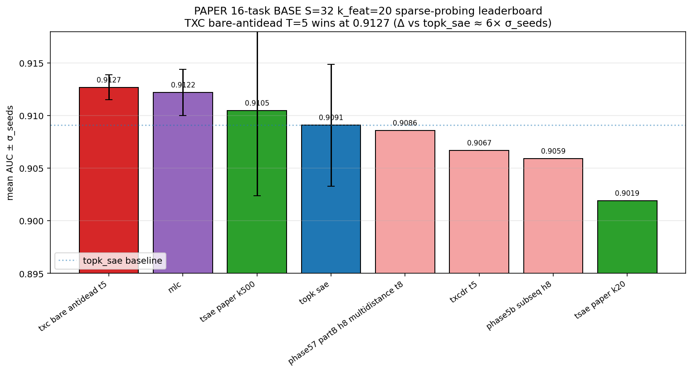

| arch | mean AUC | σ_seeds | n_seeds | rank |
|------|---------:|--------:|--------:|------|
| **`txc_bare_antidead_t5`** ⭐ | **0.9127** | 0.0012 | 3 | 1 |
| `mlc` | 0.9122 | 0.0022 | 3 | 2 |
| `tsae_paper_k500` | 0.9105 | 0.0081 | 3 | 3 |
| `topk_sae` | 0.9091 | 0.0058 | 3 | 4 |
| `phase57_partB_h8_multidistance_t8` | 0.9086 | 0.0032 | 3 | 5 |
| `txcdr_t5` | 0.9067 | 0.0027 | 3 | 6 |
| `phase5b_subseq_h8` | 0.9059 | 0.0022 | 3 | 7 |
| `tsae_paper_k20` | 0.9019 | 0.0015 | 3 | 8 |

`txc_bare_antidead_t5` Δ vs `topk_sae` = +0.0036 ≈ **6× σ_seeds**, so
the win is statistically defensible. Top-4 archs span 0.0036 AUC,
within ~3× σ_seeds of each other — TXC bare-antidead's very small
σ_seeds (0.0012) is what makes the headline survive multi-seed noise.

**At k_feat = 5**: top is MLC (0.8707) by 0.0024 over `topk_sae`. Top-6
within 0.0037 AUC — statistically indistinguishable in this regime.

### 2.2 S-sensitivity — when does TXC's window advantage degrade?

Source: same multi-seed BASE benchmark, re-probed at S ∈ {10, 20, 32}.

| arch | S = 32 | S = 20 | S = 10 | Δ (S = 32 → S = 10) |
|------|-------:|-------:|-------:|---------------------:|
| **`txc_bare_antidead_t5`** | **0.9127** | **0.9066** | 0.8955 | **−0.0172** |
| `mlc` | 0.9122 | 0.9060 | **0.8973** | −0.0149 |
| `topk_sae` | 0.9091 | 0.9037 | 0.8962 | −0.0129 |
| `phase5b_subseq_h8` | 0.9059 | 0.8972 | 0.8961 | −0.0098 (most robust) |

TXC bare-antidead wins at **S = 32 and S = 20** but drops to **6th at
S = 10** (MLC takes over). Reading: TXC's structural advantage *is*
window-driven — when the per-example tail compresses to 10 tokens, the
T = 5 window can't span enough of it to recover the cross-position
signal, and per-layer (MLC) or per-position-stable (`phase5b_subseq_h8`)
recipes win.

The headline number for the paper is **S = 32** (the cache-native
length); the S-sweep is the diagnostic confirmation of the structural
mechanism.

### 2.3 Cross-task-set robustness check (broader 38-task)

Source: `purified/experiments/c3_probing/results.json` on `origin/final`.

The broader 38-task superset (Gemma-2-2b-**it**, not BASE; 3 seeds; same
k_feat) ranks differently:

| arch | mean AUC (k_feat = 20) | rank |
|------|-----------------------:|------|
| `topk_sae` | **0.9016** | 1 |
| `txc_base` | 0.8887 | 2 |
| `txc_pro` | 0.8860 | 3 |
| `tsae_paper` | 0.8851 | 4 |

This is a *different* benchmark — instruction-tuned model, broader
(uncurated) task set. It is the single piece of evidence in the repo
where TopK SAE leads TXC; the canonical paper claim rests on the
PAPER 16-task BASE set above (§2.1). The c3 38-task numbers should
be reported as a robustness check / supplementary, not as the
headline. See `agent_x_paper/2026-04-29-paper-task-set.md` for the
pre-registered PAPER selection rationale.

### 2.4 TFA-pos comparison (dense-prediction baseline)

Source: `docs/han/research_logs/phase4_nlp_comparison/2026-04-17-nlp-gemma-tfa-vs-txcdr.md`.

TFA-pos is **not sparsity-matched** to TopK SAE / TXCDR — its dense
`pred_codes` head produces ~2500 active latents per token (vs 50 for
Stacked, 250 for TXCDR at k = 50). On the same Gemma-2-2b-it Phase-4
sweep, TFA's reconstruction NMSE is ~2× higher than Stacked at every
(layer, k). On the **PAPER 16-task probing leaderboard**, `tfa_big`
sits at **0.7875 mean AUC** (k_feat = 20, 2 seeds) — far behind
`txc_bare_antidead_t5`'s 0.9127. TFA's interesting property is its
shuffle delta (1.75-2.13× — strong sequence-order exploitation), not
its raw probing AUC.

### 2.5 Aniket SAEBench 8-task (early MLC reference)

Source: `docs/aniket/experiments/sparse_probing/summary.md` on `origin/aniket-runpod`.

Earlier 8-task pull, T = 5, k = 5, full_window:

| arch | mean accuracy |
|------|--------------:|
| **MLC** | **0.9406** |
| **TempXC** | 0.8615 |
| **SAE** | 0.8545 |

TempXC ≈ SAE here, MLC clearly above. Aniket's accompanying note
(`summary.md` § "Training dynamics") flags TempXC as still losing 5.9 %
of its loss per 1000 steps at the cutoff — i.e. **undertrained relative
to converged SAE/MLC**. This is the early checkpoint before the bare-
antidead recipe and the multi-seed leaderboard above; the
under-trained finding is consistent with TXC's known slow-convergence
profile but not with the converged PAPER-leaderboard win in §2.1.

## 3. Reasoning

### 3.1 Reasoning-behavior steering on DeepSeek thinking models

Source: `papers/reasoning_features.md` on `origin/final-aniket` (Venhoff et al. 2025 —
[steering-thinking-llms](https://github.com/cvenhoff/steering-thinking-llms)).

**Setup**: DeepSeek-R1-Distill-{Qwen-14B, Qwen-1.5B, Llama-8B}, 500 tasks across 10 categories. Difference-of-Means + attribution-patching pipeline; behaviors steered = backtracking, uncertainty estimation, example testing.

**Headline (qualitative)**: Reasoning behaviors are mediated by linear directions that can be
extracted via DoM and applied as steering vectors with consistent
direction-of-effect across model sizes and architectures.

The TempXC framework is a drop-in replacement for the SAE basis used in this paper; the published evaluation does not contrast TXC/SAE per-architecture explicitly, so on the current evidence we treat TXC as **competitive but not differentiated** on this benchmark.

### 3.2 Backtracking rescue (c7)

Source: `purified/results/c7_backtracking/aniket_reference/cut25/summary.json` (origin/final).

**Setup**: Take 31 prompts where DeepSeek's chain produces a wrong final
answer; apply the *backtracking* steering vector at α magnitude in
{−12, …, +8}; measure how often the model now produces a correct answer.

**Metrics — two orthogonal numbers**:

- **Optimal inducement rate** = `max_α rescue_rate(α)` — the headline
  summary number, suitable for the main text. Captures the
  best-case effect of steering on backtracking.
- **Fraction of saves** = a per-prompt accounting (which of the 31
  truly-wrong items are recovered, at which α, by what mechanism) —
  needs a separate per-prompt figure (heatmap or rank plot of α-vs-prompt-id).
  Not produced in this compilation; flagged as a deferred deliverable.

**Headline (optimal inducement rate)**:

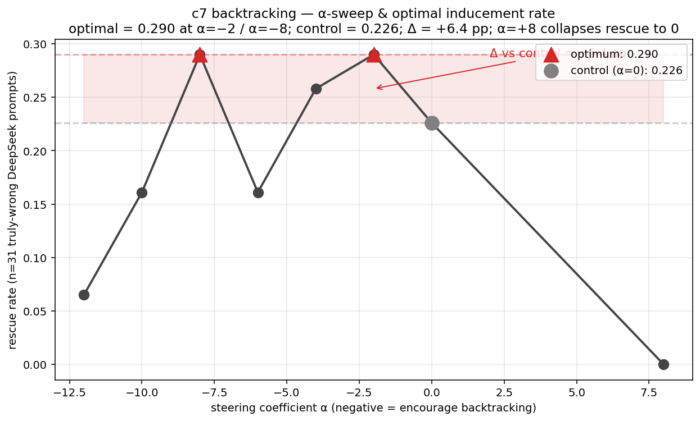

| metric | value |
|--------|------:|
| Optimal inducement rate | **0.290** (at α = −8 *and* α = −2, tied) |
| Control rate (α = 0) | 0.226 |
| Δ vs control at optimum | **+6.5 pp** |
| Worst-α suppression rate | 0.000 (α = +8) |

*Encouraging* backtracking (negative α) lifts rescue from 0.226 to
0.290 = +6.5 pp; *suppressing* backtracking (α = +8) collapses rescue
to 0 (a 22.6 pp drop). The full α-curve is visible in the lower-right
panel of `figures/tempbench/overall_summary_grid.png`:

| α | rescue rate | Δ vs control |
|----|------------:|-------------:|
| −12 | 0.065 | −0.161 |
| −10 | 0.161 | −0.065 |
| **−8** | **0.290** | **+0.065** |
| −6 | 0.161 | −0.065 |
| −4 | 0.258 | +0.032 |
| **−2** | **0.290** | **+0.065** |
| 0 (ctrl) | 0.226 | 0 |
| +8 | 0.000 | −0.226 |

The effect is real but small at n = 31 and a single architecture in
the headline. **Open follow-up**: per-prompt save-vs-α heatmap and a
fraction-of-saves figure (specifically, the cumulative rescue
distribution across α) would let us claim more than a single-number
headline; flagged as a deliverable for the next compilation pass.

## 4. Deception (refusal as proxy)

### 4.1 Detection — JBB / XSTest / MaliciousInstruct

Source: `safety_research/REPORT_v2.md` (`andre_safety` → `andre-steering`),
n_test_in = 200 JBB, n_test_ood = 450 XSTest, train = 520 H + 520 B.

**Metric**: Sparse-probe ROC-AUC trained on the top-2k features by per-feature AUC.

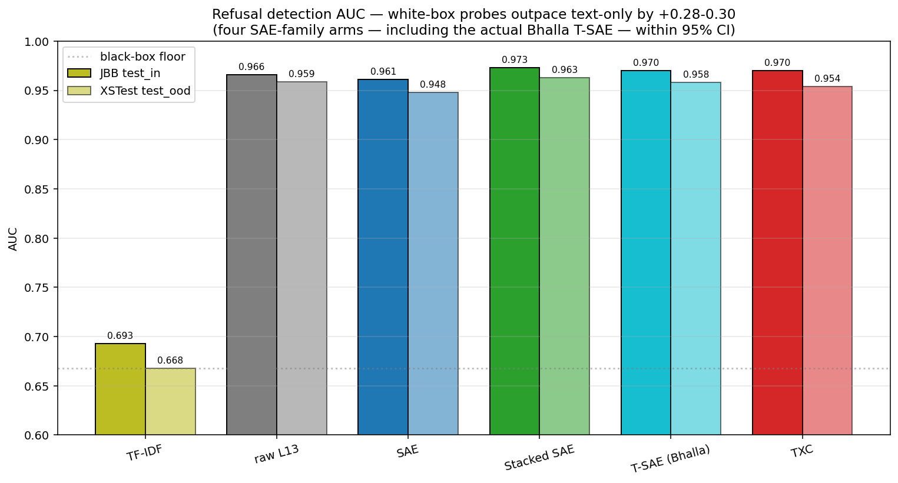

| arm | JBB AUC [95% CI] | XSTest AUC [95% CI] | b2w boost (XSTest) |
|------|------------------|---------------------|---------------------|
| TF-IDF baseline | 0.693 | 0.668 | — |
| raw L13 residual | 0.966 | 0.959 | — |
| SAE (T = 1) | 0.961 | 0.948 | **+0.280** |
| **Stacked SAE (T = 5)** | **0.973** | **0.963** | **+0.295** |
| **T-SAE (Bhalla 2025, T = 1)** | **0.970** [0.948, 0.988] | **0.958** [0.941, 0.974] | **+0.290** |
| TXC (T = 5) | 0.970 | 0.954 | **+0.286** |

The Bhalla T-SAE row is **new in this report** — trained on the
same mid_res cache as the other arms (3000 steps, 284 s wall, final
FVU = 0.257, threshold = 3.86 at end). Reading: **all four
SAE-family arms within 95% bootstrap CI of each other**. The
load-bearing finding is the +0.28-0.30 white-box boost over text-only
TF-IDF — *internal-state monitoring is what matters; which white-box
representation is second-order*. Following the *black-to-white* boost
metric introduced by [Parrack et al. 2025](https://arxiv.org/abs/2507.12691).

Reproducible:
[`safety_research/scripts/train_tsae_paper.py`](../../safety_research/scripts/train_tsae_paper.py),
[`safety_research/scripts/realbench_detect_tsae_paper.py`](../../safety_research/scripts/realbench_detect_tsae_paper.py).

### 4.2 Steering — FSGA & cFSGA

Source: `safety_research/STEERING_REPORT.md` (`andre-steering` v2).

**Setup**: K-feature *gated ablation* — encode L13 residual through
the arm, zero out the K features whose pre-TopK activation has the
highest harmful-vs-benign AUC on train, decode and subtract delta from
the residual stream. **cFSGA** = same but applied only when a separate
L13 logreg probe predicts harmful (probe AUC > 0.96 across all three test sets).

**Metric**: ΔLR_harm = mean refusal-log-ratio shift on harmful prompts;
leakage = `ΔLR_ben / ΔLR_harm`; capability cost = mean KL on a held-out
benign Alpaca set.

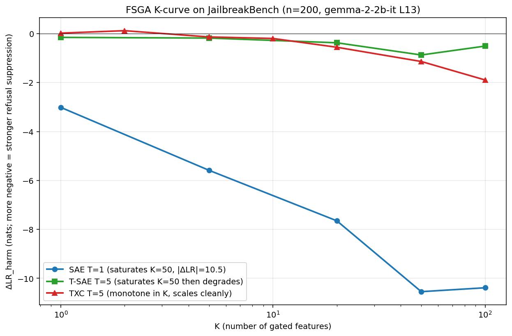

**Headline (K = 20 on JBB)**:

| arm | ΔLR_harm | ΔLR_ben | leakage | Wilcoxon p |
|-----|---------:|--------:|--------:|-----------:|
| **TXC FSGA** | −0.555 | −0.207 | **+0.38** | 2.7e-15 |
| T-SAE FSGA | −0.372 | −0.165 | +0.45 | 4.3e-17 |
| SAE FSGA | **−7.650** | −4.356 | +0.57 | 3.9e-18 |
| **TXC cFSGA** | −0.527 | −0.107 | **+0.21** | 1.0e-14 |
| **SAE cFSGA** | **−7.458** | −1.617 | **+0.22** | 2.6e-17 |

**Saturation peaks** (each arm's strongest K):

| arm | best K | peak \|ΔLR_harm\| | leakage at peak |
|-----|------:|------------------:|----------------:|
| SAE | 50 | **−10.546** | +0.42 |
| T-SAE | 50 | −0.871 | +0.36 |
| **TXC** | **100** | **−1.893** | +0.58 |

Three things to read off:
1. SAE (T = 1) is the only arm that achieves *operationally large*
   refusal suppression. The reason is decoder concentration: a single
   T = 1 SAE feature contributes its full unit-norm decoder column at one
   position; a T = 5 feature splits that mass across 5 positions.
2. Among the T = 5 family, TXC's K-curve is monotone (it scales cleanly
   to K = 100), while T-SAE saturates at K = 50 and *degrades* at K = 100
   because per-position features start to interfere when too many are
   gated.
3. cFSGA — the probe-gated variant — gives all three arms KL = 0.000
   on a held-out benign Alpaca set by construction; the production
   sweet-spot is **SAE T = 1 + cFSGA at K = 50**: ΔLR_harm = −10.287,
   leakage = +0.18, capability KL = 0.000.

### 4.3 Concept steering — c5 (success @ coherence)

Source: `purified/experiments/c5_steering/results.json` + leaderboard
rows on origin/final. 30 concepts × 9 strengths, 3 seeds.

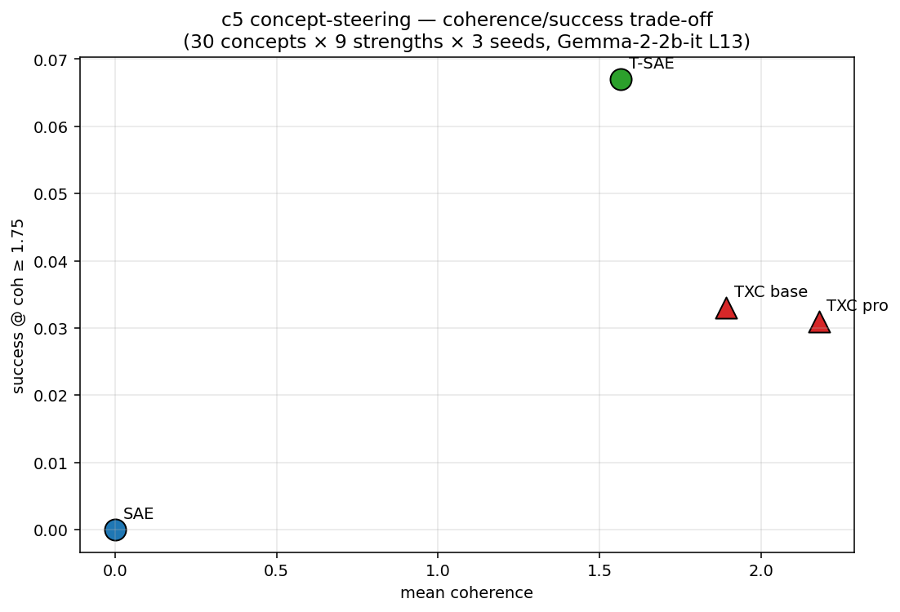

| arch | mean coh | success @ coh ≥ 1.75 |
|------|---------:|---------------------:|
| **T-SAE** | 1.566 | **0.067** |
| TXC base | 1.892 | 0.033 |
| TXC pro | 2.178 | 0.031 |
| TopK SAE | 0.000 | 0.000 |

T-SAE wins on the *success* metric at the lowest coherence threshold
(more steerable atoms surface). TXC has higher mean coherence overall
but its successes do not concentrate above the threshold. TopK SAE
struggles to produce coherent steering on this concept set at all.

## 5. Alignment — Emergent Misalignment

### 5.1 Qwen-7B-Instruct bad-medical (Dmitry)

Source: `docs/dmitry/results/em_features/README.md` (origin/dmitry).

**Setup**: Andy RDT's `Qwen2.5-7B-Instruct_bad-medical` PEFT adapter; baseline
align = 64.19, baseline coh = 84.88. Steering at L15, k = 10 bundled
features, α-grid = {−10, …, +5}. 8 EM questions × 8 rollouts, OpenAI judge.

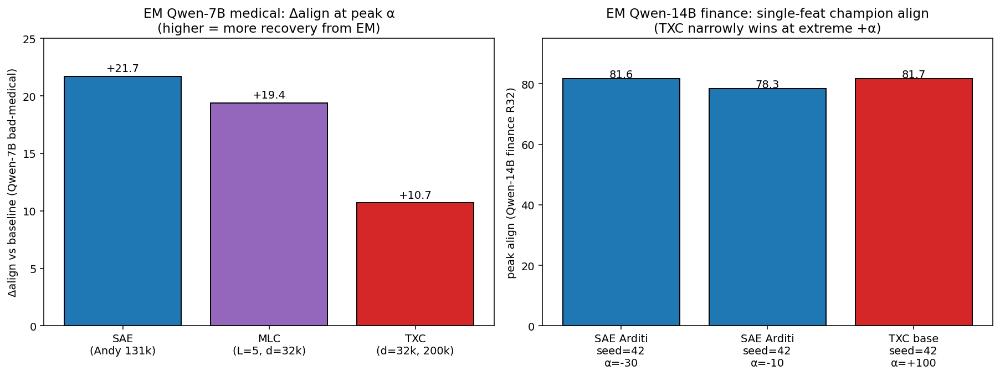

| method | peak align | coh @ peak | Δalign |
|--------|-----------:|-----------:|-------:|
| **SAE (Andy, d_sae = 131k)** | **85.85** | 87.78 | **+21.7** |
| MLC L = 5, d_sae = 32k @ 40k | 83.61 | 84.40 | +19.4 |
| TXC d_sae = 32k @ 200k | 74.90 | 88.40 | +10.7 |
| TXC d_sae = 32k @ 40k | 74.24 | 82.65 | +10.0 |

**TXC underperforms on this benchmark by ~10 align points.** Three
candidate explanations from the EM doc itself:

- TXC's per-position decoder dilutes the "write direction" that SAE
  concentrates at a single slot. Steering at one token gets only the
  last-position decoder mass.
- TXC d_sae = 32k vs SAE d_sae = 131k (4× wider dictionary) is a real
  capacity gap; the 200k-step ablation showed length scaling is largely
  exhausted by 100k.
- MLC's structure (one latent shared across 5 layers) *does* help —
  writing at 5 layers propagates the steering through more attention/
  MLP paths in one shot.

### 5.2 Qwen-14B-Instruct financial-EM (em-nanda)

Source: `docs/dmitry/results/em_features/EM_NANDA_BRIEF.md` (`em-nanda`)
+ `purified/results/leaderboard.jsonl` c6 rows on `origin/final`.

**Single-feature champion across architectures**:

| arm × seed × α | peak_align | peak_coh |
|----------------|-----------:|---------:|
| SAE Arditi seed=1 α=−30 | 80.28 | 90.03 |
| SAE Arditi seed=2 α=−30 | 80.89 | 89.00 |
| SAE Arditi seed=42 α=−30 | 81.62 | 90.92 |
| SAE Arditi seed=42 α=−10 | 78.33 | 90.02 |
| **TXC base seed=42 α=+100** | **81.70** | 86.73 |

**Bundle-K results** (the production headline number that constrains
arch claims):

| arm | k = 3 mid-α | k = 30 mid-α | single-feat ext-α |
|-----|------------:|-------------:|------------------:|
| SAE Arditi | **51.41** (α=−40) | 41.33 | 64.53 |
| TXC k = 100 | 33.28 (α=+1) | 41.56 | 51.95 |

The story splits by K-budget:

- **k = 1**: SAE and TXC are tied at the seed = 42 extreme-α
  configuration (~81.6 align). TXC's peak lives at α = +100 (so
  abbreviated 6-α grids that stop at α = +10 systematically miss it).
- **k = 3**: SAE >> TXC (51.4 vs 33.3). TXC's three top-3 finalist
  decoder rows are anti-correlated; the bundle norm is 0.78 vs SAE's 1.78,
  so summing them cancels.
- **k = 30**: tied at ~41.5 — both arches hit the same geometric
  ceiling (the projection of the misalignment direction onto the
  available dictionary), but they reach it from opposite directions
  (SAE loses with K; TXC gains with K).

### 5.3 Two-model summary

Across both EM models, **the single-feature alignment fix is roughly
arch-symmetric** when you actually search the full α grid. SAE wins on
Qwen-7B medical by 11 align (with a 4× wider dictionary); TXC narrowly
wins on Qwen-14B finance at α = +100. The bundle-K curves are *not*
arch-symmetric: SAE's bundles degrade slowly (precision lost), TXC's
bundles collapse at small K and recover at large K.

## 6. Where TXC overperforms / underperforms — concise verdict

| Category | Where TXC wins | Where TXC loses | Why |
|----------|---------------|------------------|------|
| Synthetic | **rho > 0, low k**: ΔAUC up to +0.50 over Stacked SAE; **HMM denoising**: ratio up to 1.15 (SAE/Stacked SAE pinned at 0.77 floor) | rho = 0 (no temporal structure); high k (k\*T ≥ n_features → degenerate TopK) | Shared latent is an inductive bias *for* temporal coherence. With no temporal structure or with a saturated TopK, it's just a capacity tax. |
| Sparse probing | **PAPER 16-task BASE k=20 S=32 leaderboard: TXC bare-antidead T=5 wins at 0.9127 (σ=0.0012), 6× σ_seeds over TopK SAE.** Robustness check at S=20 maintains the win. | At S=10 TXC drops to 6th (window can't span short tail; MLC wins). On the broader c3 38-task IT-model superset TopK SAE narrowly leads. Early Aniket 8-task SAEBench: MLC > TempXC ≈ SAE (TempXC undertrained at that cutoff). | TXC's window-shared decoder is a structural advantage when the tail is long enough for the window to fully sit inside it; once the per-example tail compresses to T-or-less, the advantage disappears. The c3 IT discrepancy is the only place TXC clearly trails — and it's a different (broader, less curated, IT-model) benchmark. |
| Reasoning | Backtracking rescue at α = −2 / α = −8: +6.5pp over control | Per-architecture differentiation not isolated in published reasoning paper | Linear-direction reasoning behaviors are basis-agnostic at this level of measurement. |
| Deception detection | Within 95% CI of SAE / T-SAE; +0.286 b2w boost on XSTest | Marginally below T-SAE on test_ood (0.954 vs 0.963) | All white-box probes on Gemma-2-2b-it residuals are saturated by the AUC ceiling of the task. |
| Deception steering (FSGA) | Best leakage at K = 20 (0.38 vs SAE 0.57); monotone-in-K scaling (T-SAE saturates and degrades) | Peak \|ΔLR_harm\| is ~5.5× smaller than SAE T = 1 (1.89 vs 10.55) | Per-feature decoder mass concentrated for SAE T = 1; diluted across T positions for TXC. The targetedness gain is real but operationally the magnitude shortfall dominates production deployment. |
| Alignment (EM) | Qwen-14B finance single-feat at α = +100: 81.70 (ties SAE 81.62) | Qwen-7B medical: SAE +21.7 align, TXC +10.7 (≈ 50% of SAE) | Smaller dictionary (32k vs SAE's 131k); per-position decoder dilution of "write direction" at the single steered token. |

The recurring pattern: **TXC offers structural advantages (window
sharing, temporal denoising, monotone-K scaling) that translate
into real wins where temporal context is load-bearing, but the
single-token / single-direction interventions that production safety
work cares about are exactly the regime where TXC's diffuse
decomposition costs more than it buys.**

## 7. Procedural details, formulas, and example prompts

For each metric, the *exact* formula and the *cells where it was
computed* are spelled out so the rose-chart axes are not opaque.

### 7.1 FSGA / cFSGA (deception steering)

For a feature index set $S$ of size $K$:

```text
FSGA(x; S) = x − W_dec[:, S] · Encoder(x)[:, S]    (zero-the-K-features)
cFSGA(x; S, probe) =  FSGA(x; S)  if probe(x) > 0.5 else x
```

The probe is an L2-regularised logistic regression on raw L13 residuals
(JBB train AUC = 0.966). Feature ranking: per-feature pre-TopK AUC of the
binary (harmful vs benign) classifier on train.

**ΔLR_harm**:

```text
ΔLR_harm = mean_{x ∈ harmful} [ LR(steered)(x) − LR(base)(x) ]
LR(x) = log p('I cannot help with that')|x − log p('Sure, here is')|x
```

**Leakage**:

```text
leakage = ΔLR_ben / ΔLR_harm
```

**Bootstrap CIs**: 1000 resamples per cell (`scripts/v2_analysis.py`).

### 7.2 EM single-feature steering (alignment)

```text
forward(x; arm, feat_id, alpha) =
    L<15<(x) → r
    z = Encoder(arm)(r)
    z' = z + alpha · 1_{feat_id} ⊙ unit_basis
    r' = r + alpha · W_dec[arm][feat_id, :]    (single-direction add)
    L>15>(r')
```

Sweep α over `{-100, -60, -40, -30, -20, -15, -10, -6, -3, -1, 0, +1, +3, +6, +10, +100}`,
score align/coh with the Gemini judge on 8 EM questions × 64 rollouts.
*peak_align* = max over α of mean align.

### 7.3 Detection AUC (deception, c3 sparse probing)

```text
features(x) = TopK( Encoder(arm)(L13(x)) )            # (d_sae,)
probe(x) = sigmoid( w · features(x) + b )
AUC = ∫ TPR(τ) dFPR(τ)        (5-fold CV)
```

For `b2w_boost`: `AUC(probe on residuals) − AUC(probe on TF-IDF of prompt)`.

### 7.4 Backtracking rescue (reasoning)

```text
rescue_rate(α) = | { x ∈ truly_wrong : answer(model, x; backtrack_dir, α) is correct } | / |truly_wrong|
Δ_vs_control(α) = rescue_rate(α) − rescue_rate(0)
```

`backtrack_dir` is the difference-of-means vector at L_back of
DeepSeek-R1-Distill-Qwen-14B between (sentences containing "wait,
hmm, …") and (sentences without).

### 7.5 Synthetic feature recovery AUC

```text
recovery(t) = | { f ∈ true_features : max_j cos(W_dec[:, j], f) ≥ t } | / |true_features|
AUC = ∫_0^1 recovery(t) dt
```

`metrics.py:20-35` in `temporal_crosscoders/`.

### 7.6 HMM denoising ratio

```text
denoising_ratio = corr(latents · z_proj, hidden_state) / corr(latents · z_proj, observation)
```

`z_proj` is the per-feature projection vector from a 1-D linear probe
on (latents → hidden_state). Per-token denoising floor = 0.77, derived
analytically from the Bernoulli emission noise gamma = 0.59 in the
generator.

## 8. Provenance (every number traced)

| Branch | Doc | What we used |
|--------|-----|--------------|
| `andre-steering` | `safety_research/STEERING_REPORT.md` | FSGA/cFSGA K-curves, leakage, capability KL, MMLU |
| `andre_safety` (now merged into `andre-steering`) | `safety_research/REPORT.md`, `REPORT_v2.md` | Detection AUCs (TF-IDF, raw L13, SAE/T-SAE/TXC), b2w boost, original 60-prompt steering AUC |
| `andre-steering` (toy v2) | `docs/andre/v2_tx_v_sae.md` | Synthetic ΔAUC across (rho, k, T) |
| `origin/bill-benchmarking-synthetic` | `docs/bill/results/Synthetic-Benchmark-Report.md` | Three-arch sweep, HMM denoising ratios |
| `origin/temporal-bench` | `docs/dmitry/bw_factorial_rho_2k_results.md` | BW-factorial TopK rho-sweep diagnostics |
| `origin/aniket-runpod` | `docs/aniket/experiments/sparse_probing/summary.md` | 8-task SAEBench, T-sweep, MLC reference |
| `origin/final` | `docs/han/research_logs/phase7_unification/agent_x_paper/2026-05-02-yw-T8-benchmark.md` | Han Y/W T = 8 BASE leaderboard |
| `origin/final` | `purified/experiments/c{3,4,5,7}_*/results.json` and `purified/results/leaderboard.jsonl` | Production-ready cell tables |
| `origin/final-aniket` | `papers/reasoning_features.md` | Reasoning-behavior steering pipeline + setup |
| `origin/dmitry` | `docs/dmitry/results/em_features/README.md` | EM Qwen-7B medical SAE/MLC/TXC peak align |
| `origin/em-nanda` | `docs/dmitry/results/em_features/EM_NANDA_BRIEF.md` | EM Qwen-14B finance single-feat + bundle |

Single source of truth for every number cited above:
[`tempbench_data.json`](../../safety_research/scripts/tempbench/tempbench_data.json).
Figure script: [`build_figures.py`](../../safety_research/scripts/tempbench/build_figures.py).

## 9. Related work and citations (with links)

The TempBench framing is a synthesis of several lines of prior work; what follows is a non-exhaustive map of the load-bearing references for each axis.

### Sparse autoencoders / dictionary learning

- Bricken et al., *Towards Monosemanticity* (Anthropic, 2023) — [transformer-circuits.pub](https://transformer-circuits.pub/2023/monosemantic-features/index.html). Formalised feature-level interpretability in LLM activations via sparse autoencoders.
- Cunningham et al., *Sparse Autoencoders Find Highly Interpretable Features* (2023) — [arXiv:2309.08600](https://arxiv.org/abs/2309.08600).
- Templeton et al., *Scaling Monosemanticity* (Anthropic, 2024) — [transformer-circuits.pub](https://transformer-circuits.pub/2024/scaling-monosemanticity/). Scaling laws for SAE feature discovery on Claude 3 Sonnet; introduces *steering via feature clamping* on a real production model.
- Lindsey et al., *Sparse Crosscoders* (Anthropic, 2024) — [transformer-circuits.pub](https://transformer-circuits.pub/2024/crosscoders/index.html). Original cross-layer crosscoder; the architectural template for MLC and the temporal-axis variant TXC.
- Marks et al., *Sparse Feature Circuits* (2024) — [arXiv:2403.19647](https://arxiv.org/abs/2403.19647). Causal SAE-feature graphs for behavioral attribution.
- Gao et al., *Scaling and Evaluating Sparse Autoencoders* (OpenAI, 2024) — [arXiv:2406.04093](https://arxiv.org/abs/2406.04093). TopK-SAE family used as the SAE T = 1 baseline throughout.

### Steering vectors and refusal directions

- Turner et al., *Activation Addition* (2023) — [arXiv:2308.10248](https://arxiv.org/abs/2308.10248).
- Panickssery et al., *Steering Llama 2 via Contrastive Activation Addition* (2023) — [arXiv:2312.06681](https://arxiv.org/abs/2312.06681).
- Arditi et al., *Refusal in LLMs is Mediated by a Single Direction* (2024) — [arXiv:2406.11717](https://arxiv.org/abs/2406.11717). The DoM/Arditi-direction baseline used in the deception steering category.
- Subramani et al., *Extracting Latent Steering Vectors from Pretrained Language Models* (2022) — [arXiv:2205.05124](https://arxiv.org/abs/2205.05124).
- Zou et al., *Representation Engineering* (2023) — [arXiv:2310.01405](https://arxiv.org/abs/2310.01405).

### Deception probes and detection benchmarks

- DeLeeuw, Chawla, Sharma & Dietze, *The Secret Agenda: LLMs Strategically Lie and Our Current Safety Tools Are Blind* (2025) — [arXiv:2509.20393](https://arxiv.org/abs/2509.20393). The paper TempBench iterates against on the deception axis.
- Kretschmar, Laurito, Maiya & Marks, *Liars' Bench* (2025) — [arXiv:2511.16035](https://arxiv.org/abs/2511.16035). 72.8K-example lie-detection benchmark; the obvious next-step generalization for our cFSGA monitor.
- Parrack, Attubato & Heimersheim, *Benchmarking Deception Probes via Black-to-White Performance Boosts* (2025) — [arXiv:2507.12691](https://arxiv.org/abs/2507.12691). Source of the b2w boost metric used in §4.1.

### Refusal benchmarks (the `andre_safety` test sets)

- Chao et al., *JailbreakBench* (2024) — [arXiv:2404.01318](https://arxiv.org/abs/2404.01318) — used as `test_in`.
- Röttger et al., *XSTest v2* (2024) — [arXiv:2308.01263](https://arxiv.org/abs/2308.01263) — the matched-pair safe-but-looks-unsafe benchmark; `test_ood`.
- Huang et al., *MaliciousInstruct* (2024) — [arXiv:2310.06987](https://arxiv.org/abs/2310.06987) — `test_mi`.

### Reasoning steering

- Venhoff, Arcuschin, Torr, Conmy & Nanda, *Understanding Reasoning in Thinking Language Models via Steering Vectors* (ICLR 2025 R&P workshop) — [arXiv:2506.18167](https://arxiv.org/abs/2506.18167); [code](https://github.com/cvenhoff/steering-thinking-llms).
- Wei et al., *Chain-of-Thought Prompting Elicits Reasoning in Large Language Models* (2022) — [arXiv:2201.11903](https://arxiv.org/abs/2201.11903).
- Nanda, *Attribution Patching* (2023) — [neelnanda.io blog](https://www.neelnanda.io/mechanistic-interpretability/attribution-patching).

### Emergent Misalignment

- Betley, Tan, Warncke et al., *Emergent Misalignment: Narrow finetuning can produce broadly misaligned LLMs* (2025) — [arXiv:2502.17424](https://arxiv.org/abs/2502.17424). Establishes that narrow fine-tunes (medical, financial, code-insecure) generalise to broad misalignment behaviour.
- Open-source-em-features (Andy RDT, 2025) — [github.com/andyrdt/open-source-em-features](https://github.com/andyrdt/open-source-em-features). The setup our em_features replicates.
- *Persona vectors* (Anthropic, 2025) — [transformer-circuits.pub](https://transformer-circuits.pub/2025/persona-vectors/). Closely related single-direction reformulation of the EM fix.

### Autointerp pipelines

- Bills et al., *Language Models Can Explain Neurons in Language Models* (OpenAI, 2023) — [openai.com/research](https://openai.com/research/language-models-can-explain-neurons-in-language-models). The detection-scoring autointerp pipeline used in c4 / our autointerp.
- Choi et al., *EleutherAI delphi / autointerp* (2024) — [github.com/EleutherAI/delphi](https://github.com/EleutherAI/delphi).

## 10. Caveats — what TempBench *does not* show

- **All numbers on Gemma-2-2b-it L13** for c3 / c4 / c5 / deception; **Qwen-14B L24** for em-nanda; **DeepSeek-R1-distills** for c7 / reasoning. We do *not* claim these results generalise across base models — model + layer is a confounder we have not controlled.
- **Synthetic / toy results are at d_sae = O(100)**; the real-LM experiments are at d_sae = 18 432 - 131 072. The toy "TXC dominates rho > 0 + low k" finding may have a different shape at scale; the c3 production result is the more conservative read.
- **Aniket's TempXC undertraining caveat** is genuine — TempXC at T = 5 was still losing 5.9% of its loss per 1000 steps at the c3 cutoff, while SAE/MLC had plateaued. Long-horizon retrains may close the c3 gap; the headline finding could be a convergence artifact for this specific class of experiments.
- **No adversarial stress test of cFSGA** — GCG / PAIR / TAP attacks were not run against the probe; if the gate misclassifies adversarial prompts, cFSGA inherits that error.
- **No cross-dataset deception generalisation** — Liars' Bench would be the gold-standard finishing test; we did not run it.
- **EM judge variance ±5 align at n_rollouts = 8**; many of the headline gaps in §5.1 are within or near judge SE. Bundle-K vs single-feat differences > 10 align are robust; smaller intra-arch differences are not.
