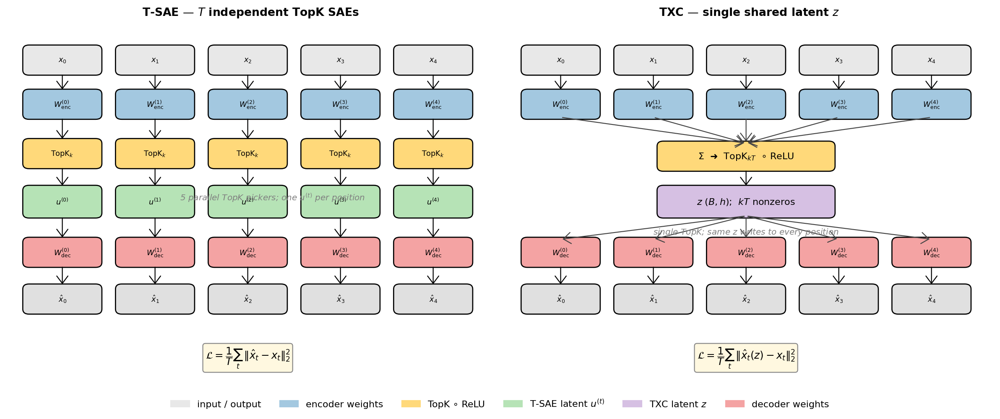
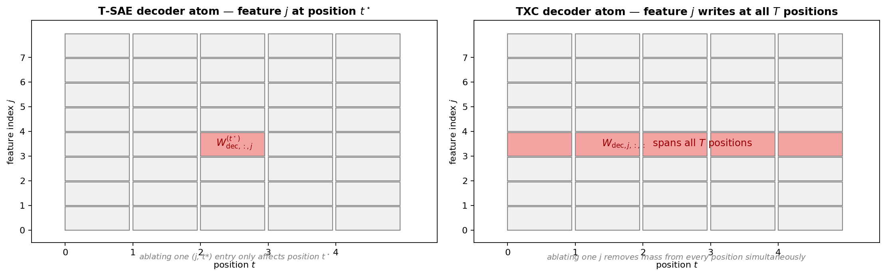
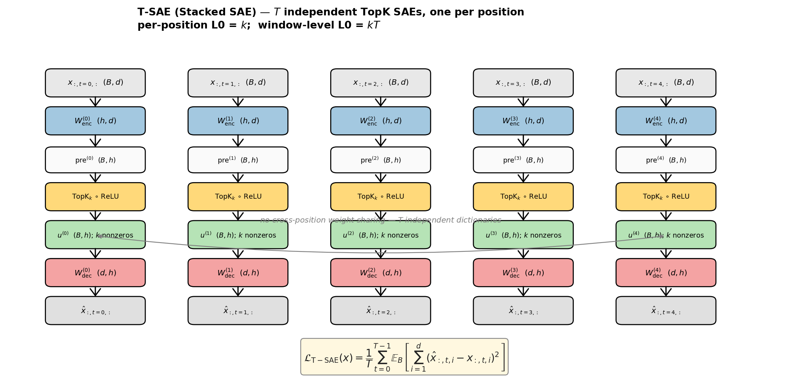
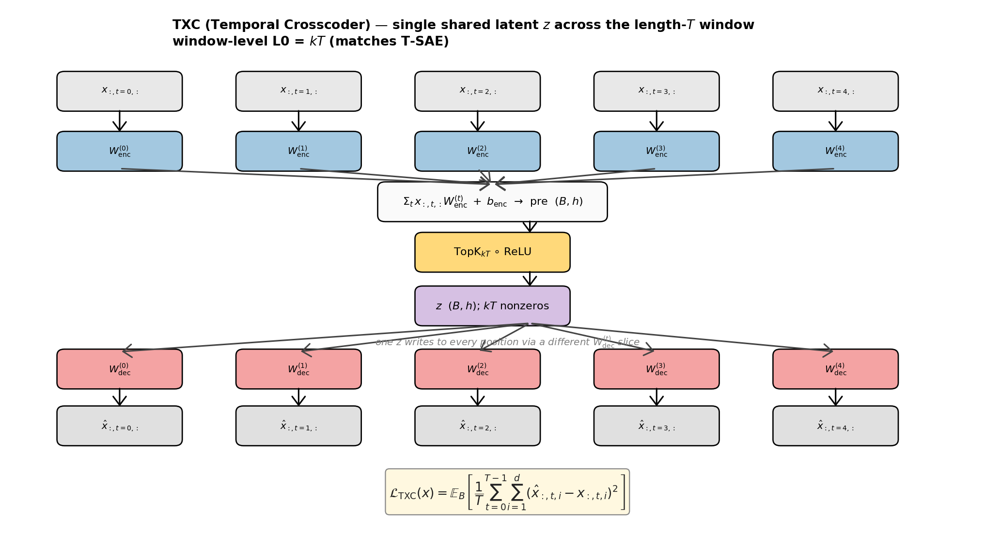

## Stacked SAE vs T-SAE (Bhalla et al. 2025) vs TXC — Architectures, Schemas, Loss Functions

Reference for the three sparse-autoencoder architectures used throughout
the temporal-crosscoders project. Every formula and shape is grounded
in `temporal_crosscoders/models.py`,
`purified/src/temp_bench/architectures/{stacked_sae.py,tsae.py}`
(on `origin/final`), and `temporal_crosscoders/train.py`, with explicit
file:line references.

> **Terminology bug we are fixing here.** Previous Andre docs used
> "T-SAE" to mean *T independent per-position TopK SAEs*. That
> architecture is **Stacked SAE** in the unified `purified/`
> codebase. The actual **T-SAE** is **Bhalla et al. 2025**
> ([arxiv 2511.05541](https://arxiv.org/abs/2511.05541),
> [OpenReview bojVI4l9Kn](https://openreview.net/pdf?id=bojVI4l9Kn);
> code at [github.com/AI4LIFE-GROUP/temporal-saes](https://github.com/AI4LIFE-GROUP/temporal-saes)) —
> a per-token SAE (T=1 architecturally) with a temporal contrastive
> loss between consecutive tokens, BatchTopK sparsity, matryoshka
> grouping, AuxK dead-feature loss, and threshold-based inference.
> They are **different architectures** and we now keep them
> distinct.





Notation throughout:

- $B$ = batch size
- $T$ = window length (number of consecutive token positions per window)
- $d$ = activation dimension (`d_in`)
- $h$ = dictionary width (`d_sae`)
- $k$ = per-position TopK sparsity budget

## 1. Stacked SAE — `StackedSAE`

> Andre's earlier docs called this "T-SAE" — that was a mis-naming.
> Stacked SAE is $T$ independent per-position TopK SAEs; the actual
> T-SAE is the Bhalla et al. 2025 architecture in §2.

Source: `temporal_crosscoders/models.py:77-125`.



### 1.1 Architecture

A *Stacked SAE* is $T$ **independent** TopK SAEs, one per window
position. Position $t$ has its own parameters $(W_{\text{enc}}^{(t)}, W_{\text{dec}}^{(t)}, b_{\text{enc}}^{(t)}, b_{\text{dec}}^{(t)})$
with no weight sharing across positions
(`temporal_crosscoders/models.py:94`).

Per-position parameters (each is one `TopKSAE` instance,
`models.py:22-72`):

$$
W_{\text{enc}}^{(t)} \in \mathbb{R}^{h \times d}, \quad
W_{\text{dec}}^{(t)} \in \mathbb{R}^{d \times h}, \quad
b_{\text{enc}}^{(t)} \in \mathbb{R}^{h}, \quad
b_{\text{dec}}^{(t)} \in \mathbb{R}^{d}
$$

Total parameters: $T \cdot (2 d h + h + d)$.

### 1.2 Forward schema

Input is a window $x \in \mathbb{R}^{B \times T \times d}$
(`models.py:101-116`).
For each position $t \in \{0, \ldots, T-1\}$:

$$
\begin{aligned}
\tilde{x}^{(t)} &= x_{:,t,:} - b_{\text{dec}}^{(t)}                        & \text{(centring; } \texttt{models.py:52}) \\
p^{(t)} &= \tilde{x}^{(t)} (W_{\text{enc}}^{(t)})^\top + b_{\text{enc}}^{(t)} & \text{(pre-activation; } \texttt{models.py:53}) \\
u^{(t)} &= \mathrm{TopK}_k(\mathrm{ReLU}(p^{(t)}))                          & \text{(TopK sparsity; } \texttt{models.py:54-57}) \\
\hat{x}^{(t)} &= u^{(t)} (W_{\text{dec}}^{(t)})^\top + b_{\text{dec}}^{(t)} & \text{(decode; } \texttt{models.py:60})
\end{aligned}
$$

with $\mathrm{TopK}_k$ keeping the $k$ largest values per row and
zeroing the rest. Output is $\hat{x} \in \mathbb{R}^{B \times T \times d}$,
$u \in \mathbb{R}^{B \times T \times h}$.

### 1.3 Sparsity

- **Per-position L0**: exactly $k$ active latents per position by
  construction (`models.py:54-57`).
- **Window-level L0**: $k \cdot T$ across the whole window — one TopK
  decision per position, no cross-position coupling.

### 1.4 Loss

Per-position MSE summed over $d$, averaged over $B$, then averaged
over the $T$ positions
(`models.py:66`, `models.py:115`):

$$
\mathcal{L}_{\text{T-SAE}}(x) = \frac{1}{T} \sum_{t=0}^{T-1}
\underbrace{\mathbb{E}_{B}\left[\, \sum_{i=1}^{d} \big(\hat{x}^{(t)}_i - x^{(t)}_i\big)^2 \,\right]}_{\text{per-position MSE}}
$$

There is **no L1 penalty** — the TopK activation provides hard sparsity.

### 1.5 Decoder normalisation

After every optimiser step, each position's decoder columns are
re-normalised to unit $\ell_2$ norm
(`models.py:46-49`, `train.py:99`):

$$
W_{\text{dec}}^{(t)}_{:, j} \leftarrow \frac{W_{\text{dec}}^{(t)}_{:, j}}{\max(\|W_{\text{dec}}^{(t)}_{:, j}\|_2, 10^{-8})}
$$

## 2. T-SAE (Bhalla et al. 2025) — `TSAEPaper`

Source: `purified/src/temp_bench/architectures/tsae.py` (`origin/final`),
re-ported into `safety_research/scripts/train_tsae_paper.py:TSAEPaper`
to train on Andre's Gemma-2-2b-it L13 cache.

Reference: Bhalla, Oesterling, Verdun, Lakkaraju & Calmon, *Temporal
Sparse Autoencoders: Leveraging the Sequential Nature of Language for
Interpretability* (2025) —
[arXiv:2511.05541](https://arxiv.org/abs/2511.05541),
[OpenReview bojVI4l9Kn](https://openreview.net/pdf?id=bojVI4l9Kn);
canonical code at
[github.com/AI4LIFE-GROUP/temporal-saes](https://github.com/AI4LIFE-GROUP/temporal-saes).

### 2.1 Architecture

T-SAE is a **per-token** SAE (`T = 1` architecturally) that adds a
**temporal contrastive objective** between consecutive tokens at
training time, plus four other components from the wasteland code:

- **BatchTopK** sparsity (global top-`k_pos · B` over the flat $(B, h)$
  pre-activations, instead of per-row top-$k$).
- **Matryoshka group structure** — the dictionary is split into a
  *high-level* (`h_frac = 0.20`) group and a *low-level* (`1 - h_frac`)
  group; reconstruction is computed cumulatively over the groups.
- **AuxK loss** on dead features — features that have not fired for
  `dead_feature_threshold_tokens` get a separate auxiliary
  reconstruction loss against the residual.
- **Threshold inference** — once training has stabilised, an EMA-tracked
  threshold replaces BatchTopK at inference (paper App. C).

Parameters:

$$
W_{\text{enc}} \in \mathbb{R}^{d \times h}, \quad
W_{\text{dec}} \in \mathbb{R}^{h \times d}, \quad
b_{\text{enc}} \in \mathbb{R}^{h}, \quad
b_{\text{dec}} \in \mathbb{R}^{d}
$$

The `W_dec` row convention `(d_sae, d_in)` matches the wasteland port,
not the `(d, h)` convention in `models.py`. Encoder is initialised to
$W_{\text{enc}} = W_{\text{dec}}^\top$ and decoder rows are unit-norm.

### 2.2 Forward schema (encode)

For input $x \in \mathbb{R}^{B \times d}$ at a single token:

$$
\begin{aligned}
\text{post\_relu} &= \mathrm{ReLU}\big( (x - b_{\text{dec}}) W_{\text{enc}} + b_{\text{enc}} \big) & \in \mathbb{R}^{B \times h} \\
z &= \begin{cases}
       \mathrm{BatchTopK}_{k_{\text{pos}} \cdot B}(\text{post\_relu}) & \text{(training)} \\
       \text{post\_relu} \odot \mathbb{1}[\text{post\_relu} > \tau] & \text{(inference, } \tau = \text{EMA threshold)}
     \end{cases} \\
\hat{x} &= z \, W_{\text{dec}} + b_{\text{dec}} & \in \mathbb{R}^{B \times d}
\end{aligned}
$$

`train_tsae_paper.py:_encode_per_token` and `train_tsae_paper.py:encode`
implement these two branches.

### 2.3 Loss

Three components:

$$
\mathcal{L}_{\text{T-SAE}}(x_{\text{anchor}}, x_{\text{temp}}) =
\underbrace{\mathcal{L}_{\text{matry}}}_{\text{cumulative MSE}}
+ \alpha_{\text{aux}} \, \mathcal{L}_{\text{auxk}}
+ \alpha_{\text{contr}} \, \mathcal{L}_{\text{contr}}
$$

with $\alpha_{\text{aux}} = 1/32$, $\alpha_{\text{contr}} = 1$, and:

**Matryoshka cumulative reconstruction** (`train_tsae_paper.py:train_step`):
let $G_0$ = high group (`h_frac · h` rows of $W_{\text{dec}}$),
$G_1$ = low group, $w_g$ = group weight (both = 1):

$$
\hat{x}^{(0)} = b_{\text{dec}} + z_{:, G_0} \, W_{\text{dec}, G_0, :}, \qquad
\hat{x}^{(1)} = \hat{x}^{(0)} + z_{:, G_1} \, W_{\text{dec}, G_1, :}
$$

$$
\mathcal{L}_{\text{matry}} = \sum_{g=0}^{1} w_g \cdot \mathbb{E}_B\Big[\, \sum_{i=1}^{d} (\hat{x}^{(g)}_i - x_{\text{anchor}, i})^2 \,\Big]
$$

**Temporal contrastive (InfoNCE)** between high-group latents at
position $t$ (anchor) and position $t+1$ (positive). Logits
$L_{ij} = z^{(0)}_i \cdot z^{(0)\, \text{temp}}_j$ form a $B \times B$
similarity matrix; loss is symmetric cross-entropy with the
identity as targets:

$$
\mathcal{L}_{\text{contr}} = \tfrac{1}{2} \big( \mathrm{CE}(L, \mathbb{1}) + \mathrm{CE}(L^\top, \mathbb{1}) \big)
$$

**AuxK** (`_auxiliary_loss`): use the residual after main reconstruction
as a target for a TopK reconstruction over *dead* features only:

$$
\mathcal{L}_{\text{auxk}} = \mathbb{E}_B\big\| \mathrm{TopK}_{d/2}(\text{post\_relu} \odot \mathbb{1}_{\text{dead}}) \, W_{\text{dec}} - (x - \hat{x}^{(1)}) \big\|_2^2
$$

A feature is "dead" if `num_tokens_since_fired >= 10^7`.

### 2.4 Decoder gradient hygiene

Two post-hoc projections every step (`_project_dec_grad` +
`renormalise_decoder`):

1. Before the optimiser step, the component of the gradient that is
   parallel to each decoder column is projected out — without this,
   the unit-norm constraint is violated between steps and the
   renormalisation shrinks the update.
2. After the optimiser step, decoder columns are unit-norm
   reprojected.

### 2.5 Concrete numbers from the Andre-cache training run

`safety_research/scripts/train_tsae_paper.py` ran 3000 steps on the
mid_res Gemma-2-2b-it L13 cache (matched to the existing arms):

| metric | value |
|--------|-------|
| wall time | 284 s |
| final FVU | 0.257 |
| final MSE | 12 114 |
| final contrastive loss | 172 |
| final L0 | 100 |
| EMA threshold @ end | 3.86 |
| ckpt | `safety_research/results/checkpoints/tsae_paper__mid_res__k100__T1.pt` |
| detection AUC, JBB | **0.970** [0.948, 0.988] |
| detection AUC, XSTest | **0.958** [0.941, 0.974] |
| black-to-white boost (XSTest) | +0.290 |

These numbers sit between Stacked SAE (0.973 / 0.963) and TXC
(0.970 / 0.954), within the bootstrap CI of both, on the
real-benchmark detection axis.

## 3. TXC (Temporal Crosscoder) — `TemporalCrosscoder`

Source: `temporal_crosscoders/models.py:130-198`.



### 3.1 Architecture

A *Temporal Crosscoder* uses a **single shared latent vector**
$z \in \mathbb{R}^h$ for the whole length-$T$ window, with
position-specific encoder and decoder weights
(`models.py:154-161`):

$$
W_{\text{enc}} \in \mathbb{R}^{T \times d \times h}, \quad
W_{\text{dec}} \in \mathbb{R}^{h \times T \times d}, \quad
b_{\text{enc}} \in \mathbb{R}^{h}, \quad
b_{\text{dec}} \in \mathbb{R}^{T \times d}
$$

The encoder bias is **shared across positions** (`models.py:160`);
the decoder bias is per-position (`models.py:161`).

Total parameters: $2 T d h + h + T d$ — same order as Stacked SAE
($T \cdot 2 d h$ leading term), but tied through a single
encoder→latent fan-in and a single latent→decoder fan-out.

### 3.2 Forward schema

Input is the same shape as Stacked SAE: $x \in \mathbb{R}^{B \times T \times d}$.
The encoder *projects every position* into the same latent space and
*sums*; a single TopK selects the active latents
(`models.py:168-174`):

$$
\begin{aligned}
p &= \sum_{t=0}^{T-1} x_{:,t,:} \, W_{\text{enc}}^{(t)} + b_{\text{enc}}            & \text{(einsum "btd,tds→bs"; } \texttt{models.py:170}) \\
z &= \mathrm{TopK}_{kT}(\mathrm{ReLU}(p))                                            & \text{(window-level TopK; } \texttt{models.py:171-174}) \\
\hat{x}_{:, t, :} &= z \, W_{\text{dec}}^{(t)} + b_{\text{dec}}^{(t)} \quad \forall t & \text{(einsum "bs,std→btd"; } \texttt{models.py:178})
\end{aligned}
$$

The decoder reconstructs **every** position from the **same** latent
vector $z$ — that is the cross-position weight tying that defines TXC.

### 3.3 Sparsity

- **Window-level L0**: exactly $k T$ active latents per window
  (`models.py:152` sets `self.k = k * T`).
- This deliberately **matches** Stacked SAE's window-level L0 = $k T$
  for apples-to-apples comparison.
- **Per-position L0** is undefined / shared — the same $k T$ latents
  contribute to every position via a different $W_{\text{dec}}^{(t)}$ slice.

### 3.4 Loss

Window-level MSE summed over $d$, averaged over $B$ and over $T$
(`models.py:184`):

$$
\mathcal{L}_{\text{TXC}}(x) = \mathbb{E}_{B}\left[\, \frac{1}{T} \sum_{t=0}^{T-1} \sum_{i=1}^{d} \big(\hat{x}_{:,t,i} - x_{:,t,i}\big)^2 \,\right]
$$

Algebraically identical reduction to Stacked SAE's loss, but $\hat{x}$
is produced from the *shared* $z$ rather than $T$ independent
$u^{(t)}$. Like Stacked SAE, **no L1 penalty** — TopK is the sparsity
mechanism.

### 3.5 Decoder normalisation

`W_dec` is normalised over the $(T, d)$ axes per latent
(`models.py:163-166`):

$$
W_{\text{dec}}_{j, :, :} \leftarrow \frac{W_{\text{dec}}_{j, :, :}}{\max\left(\sqrt{\sum_{t, i} (W_{\text{dec}}_{j, t, i})^2}, 10^{-8}\right)}
$$

A single TXC decoder atom (one $j$) therefore has unit norm across the
whole length-$T$ window — its mass can be distributed arbitrarily over
the $T$ positions, but the total is constrained.

## 4. Side-by-side comparison

| | Stacked SAE (`StackedSAE`) | T-SAE Bhalla (`TSAEPaper`) | TXC (`TemporalCrosscoder`) |
|---|---|---|---|
| File:lines | `models.py:77-125` | `train_tsae_paper.py:80-275` | `models.py:130-198` |
| Latent space | $T$ independent vectors $u^{(t)} \in \mathbb{R}^h$ | one per-token vector $z \in \mathbb{R}^h$ | one shared vector $z \in \mathbb{R}^h$ across $T$ positions |
| `W_enc` shape | $T \times (h \times d)$ | $(d, h)$ — single matrix | one tensor $(T, d, h)$ |
| `W_dec` shape | $T \times (d \times h)$ | $(h, d)$ — single matrix | one tensor $(h, T, d)$ |
| Encoder bias | per-position | shared | shared |
| Architectural $T$ | $T$ (window length) | $1$ (per-token) | $T$ (window length) |
| Sparsity rule | per-position TopK $k$ | **BatchTopK** $k_{\text{pos}} \cdot B$ across the flat $(B, h)$ | window-level TopK $kT$ |
| Per-token L0 | $k$ exact | $k_{\text{pos}}$ on average | $kT$ shared across $T$ positions |
| Window L0 (T=5, k=100) | 500 | 500 (per-token × T) | 500 |
| Inference sparsity | TopK | EMA threshold $\tau$ once $t > 1000$ | TopK |
| Decoder atom geometry | one cell on $(T \times h)$ grid | one column of $W_{\text{dec}}$ at one token | one column of $W_{\text{dec}}_{j,:,:}$ across all $T$ positions |
| Reconstruction loss | $\frac{1}{T}\sum_t \mathrm{MSE}(\hat{x}^{(t)}, x^{(t)})$ | matryoshka cumulative: $\sum_g w_g \, \mathrm{MSE}(\hat{x}^{(g)}, x_{\text{anchor}})$ | window MSE on $\hat{x}(z)$ vs $x$ |
| Auxiliary losses | none | AuxK on dead features + InfoNCE temporal contrastive on consecutive tokens | none |
| Decoder normalisation | per-position $d$-axis | flat $d$-axis + grad-parallel projection | $(T \cdot d)$-axes per feature |
| Inductive bias | "feature × position" atoms | per-token features + temporal-coherence regulariser | "feature distributed across the window" atoms |
| Cross-position coupling | none | only via the contrastive *training* loss (not at inference) | full (one TopK + shared latent) |

The three architectures sit at three points in the design space:

1. **Stacked SAE** — no cross-position coupling; treats the window as
   $T$ separate problems.
2. **T-SAE (Bhalla)** — no cross-position coupling at *inference* (it's
   per-token); cross-position coupling only at *training* via the
   InfoNCE contrastive loss between adjacent tokens.
3. **TXC** — cross-position coupling baked into the architecture itself
   via the shared latent.

Stacked SAE and TXC are deliberately matched on window-level L0 ($kT$),
leading-order parameter count ($2 T d h$), and loss reduction. Bhalla
T-SAE matches the per-token average L0 ($k$) and adds two
training-time-only objectives that operate over consecutive tokens.

## 5. Training scheme (Stacked SAE & TXC share; Bhalla T-SAE differs)

Source: `temporal_crosscoders/train.py:62-205`, `temporal_crosscoders/config.py`.

Both architectures are trained with the *same* recipe — the only
moving piece between them is the `model = ...` line
(`train.py:85` for T-SAE, the analogous TXCDR train fn for TXC).

| component | choice | code |
|---|---|---|
| optimiser | Adam | `train.py:86`, `train.py:163` |
| learning rate | `LEARNING_RATE = 3e-4` | `config.py` |
| betas | `ADAM_BETAS = (0.9, 0.999)` | `config.py` |
| grad clip | `GRAD_CLIP = 1.0` | `train.py:97`, `train.py:175` |
| precision | fp16 autocast (NLP runs) | `temporal_crosscoders/NLP/train.py` |
| batch | $B$ windows of length $T$ | `data.py` |
| TopK | hard, with `ReLU(pre)` then `topk` | `models.py:54-57`, `models.py:171-174` |
| decoder normalisation | unit-norm reproject after every step | `train.py:99`, `train.py:177` |
| L1 / KL | **none** | — |
| eval cadence | every `LOG_INTERVAL` steps | `train.py:101`, `train.py:179` |

Specifically, no auxiliary sparsity loss is applied for Stacked SAE
and TXC — the only signal is reconstruction MSE and the TopK
projection forces the sparsity.

**Bhalla T-SAE** uses the same Adam + grad-clip + decoder unit-norm
recipe but adds:

- BatchTopK instead of per-row TopK,
- AuxK loss against the residual ($\alpha_{\text{aux}} = 1/32$),
- Temporal contrastive InfoNCE between consecutive tokens
  ($\alpha_{\text{contr}} = 1$),
- An extra grad-parallel-to-decoder projection inside a
  `register_post_accumulate_grad_hook` on `W_dec`,
- A threshold-EMA buffer that takes over from BatchTopK at inference
  once `step > 1000`.

See `train_tsae_paper.py:train_step` for the canonical implementation
in the safety-research training pipeline.

## 6. Worked shape walk-through ($B = 2$, $T = 5$, $d = 256$, $h = 128$, $k = 5$)

Same input window for the position-aware arms:

```text
x : (2, 5, 256)
```

### Stacked SAE

```text
for t in [0,1,2,3,4]:
    x[:, t, :]                      shape (2, 256)
    pre_t = (x_t - b_dec_t) @ W_enc_t.T + b_enc_t   shape (2, 128)
    u_t   = topK(relu(pre_t), k=5)                  shape (2, 128) with 5 nonzeros / row
    x_hat_t = u_t @ W_dec_t.T + b_dec_t             shape (2, 256)
x_hat : (2, 5, 256), u : (2, 5, 128); window L0 = 5*5 = 25
```

### Bhalla T-SAE (per-token at inference, on `x[:, -1, :]`)

```text
last = x[:, -1, :]                                  shape (2, 256)
post = relu((last - b_dec) @ W_enc + b_enc)        shape (2, 128)
# training-time:    z = BatchTopK(post.flatten(), k_pos*B)
# inference-time:   z = post * (post > threshold)
z      shape (2, 128) with ~k_pos=5 average nonzeros / row
x_hat  = z @ W_dec + b_dec                          shape (2, 256)
```

### TXC

```text
pre = einsum("btd,tds->bs", x, W_enc) + b_enc   shape (2, 128)
z   = topK(relu(pre), k=k*T=25)                  shape (2, 128) with 25 nonzeros / row
x_hat = einsum("bs,std->btd", z, W_dec) + b_dec  shape (2, 5, 256)
window L0 = 25 (matches Stacked SAE)
```

The key shape-level difference: Stacked SAE produces **a different
sparse vector at each position** (`u : (B, T, h)` with $k$ nonzeros
per $T$-slice), Bhalla T-SAE produces **one sparse vector per token**
(`z : (B, h)` with ~$k_{\text{pos}}$ nonzeros on average via
BatchTopK), and TXC produces **one sparse vector for the whole
window** (`z : (B, h)` with $k T$ nonzeros).

## 7. Pointers

- Stacked SAE / TXC code:
  [`temporal_crosscoders/models.py`](../../temporal_crosscoders/models.py),
  [`temporal_crosscoders/train.py`](../../temporal_crosscoders/train.py),
  [`temporal_crosscoders/config.py`](../../temporal_crosscoders/config.py).
- Bhalla T-SAE port for safety research:
  [`safety_research/scripts/train_tsae_paper.py`](../../safety_research/scripts/train_tsae_paper.py),
  detection eval at
  [`safety_research/scripts/realbench_detect_tsae_paper.py`](../../safety_research/scripts/realbench_detect_tsae_paper.py).
- Bhalla T-SAE canonical implementation:
  [`purified/src/temp_bench/architectures/tsae.py`](https://github.com/chainik1125/temp_xc/blob/final/purified/src/temp_bench/architectures/tsae.py)
  on `origin/final`, originally ported from
  [github.com/AI4LIFE-GROUP/temporal-saes](https://github.com/AI4LIFE-GROUP/temporal-saes).
- Architectural overview (Dmitry): [[temporal_xc_architectures]].
- Sweep results comparing Stacked SAE vs TXC on synthetic data:
  [[v2_tx_v_sae]].
- NLP-scale results on Gemma-2-2b activations: [[nlp_gemma2_summary]].
- Cross-branch benchmark compilation: [[tempbench_metareport]].
