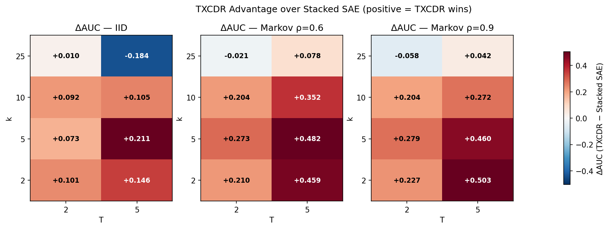
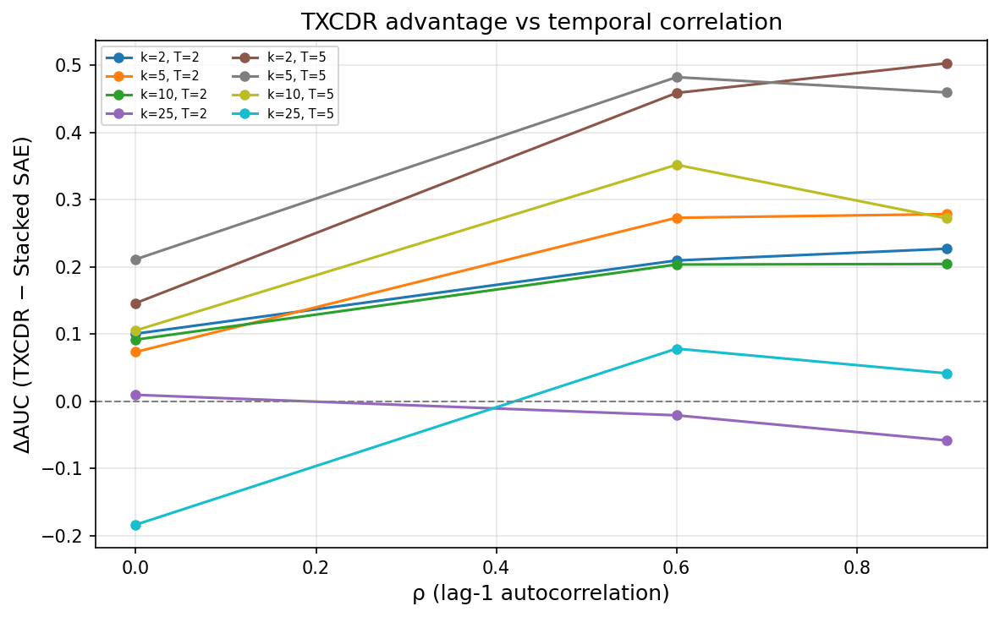
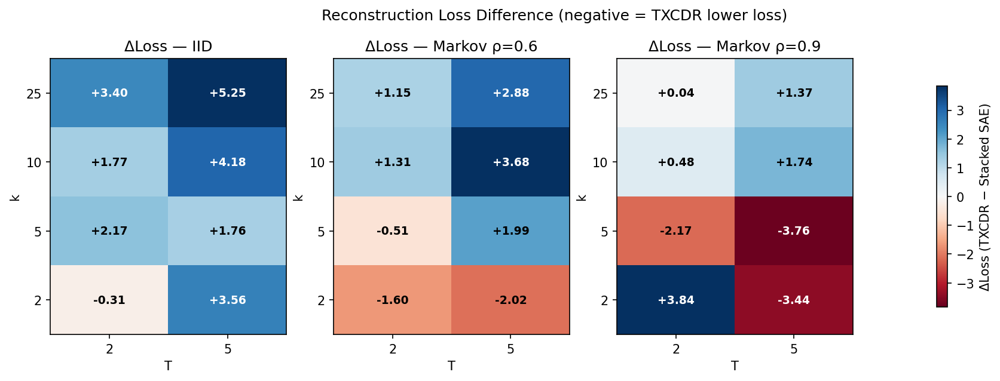
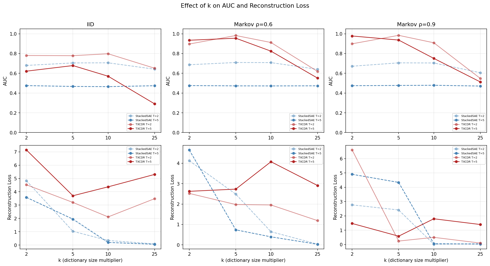
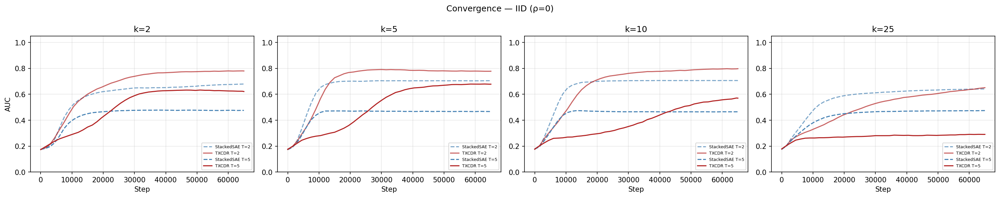
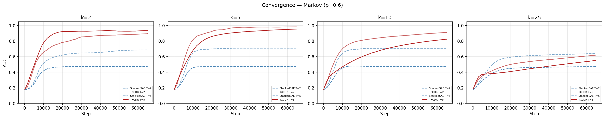
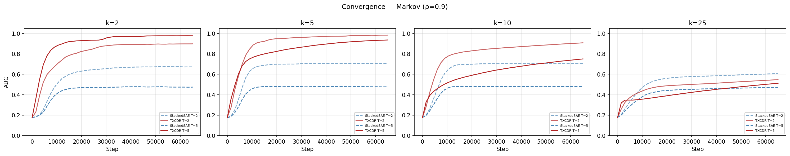
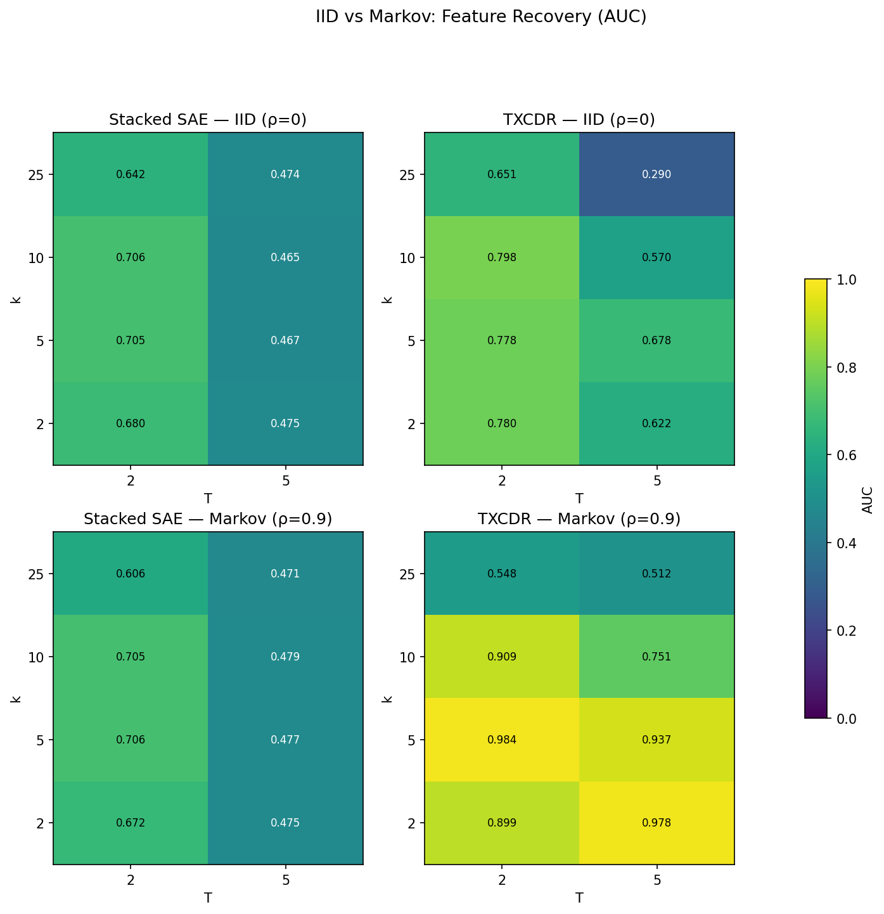
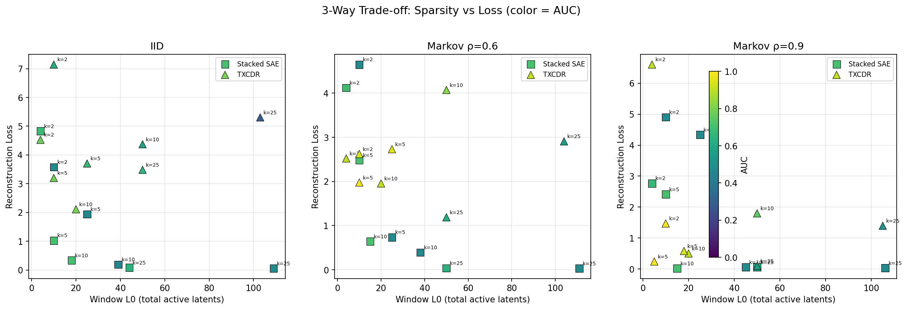

## v2 Sweep — Stacked SAE vs Temporal Crosscoder

Refer to `temporal_crosscoders/` for all code. To replicate: edit `config.py`, run `python sweep.py`, then `python viz.py`.

## Changes from v1

The biggest change is replacing the single per-token **TopKSAE** baseline with a proper **StackedSAE** (`models.py:77-125`): T independent SAE(k) modules, one per position, each with its own weights. This gives window-level L0 = k * T, making the sparsity comparison with TXCDR fair. Previously the baseline was a single SAE applied identically to each position, which was not a meaningful stacked baseline.

The second change is parametrizing temporal correlation via **lag-1 autocorrelation rho** (`config.py:32-53`) instead of raw Markov alpha/beta. Given rho and stationary probability p, the Markov parameters are `beta = p*(1-rho)` and `alpha = rho*(1-p) + p`. When **rho = 0**, alpha = beta = p, so the transition matrix becomes memoryless — each timestep is an independent Bernoulli draw, recovering IID. When rho > 0, features "stick": higher rho means features that are active tend to stay active across consecutive timesteps.

Scale also increased: NUM_FEATS 50 → 128, HIDDEN_DIM 100 → 256 (`config.py:26-27`). Training steps dropped from 80k to 65k (`config.py:57`) since convergence curves showed plateaus by ~40k.

## Experimental Setup

**Sweep grid**: rho ∈ {0.0, 0.6, 0.9}, k ∈ {2, 5, 10, 25}, T ∈ {2, 5} — 48 total runs. Configs with k*T >= 128 are skipped (`config.py:71-73`). Each run trains for 65k steps with lr=3e-4, batch_size=1, grad_clip=1.0.

**Models compared** (both with d_sae = 128 latents):

- **StackedSAE** (`models.py:77-125`): T independent TopKSAE modules. Each position gets k active latents. Window L0 = k * T.
- **TemporalCrosscoder** (`models.py:130-198`): Shared latent with per-position encoders/decoders. Uses k*T total active latents (`models.py:152`) to match StackedSAE's total L0.

**Metric**: Feature recovery AUC (`metrics.py:20-35`) — cosine similarity between decoder directions and true features, integrated over thresholds 0 to 1.

## Results

### TXCDR Advantage Grows with Temporal Correlation

At **IID (rho=0)**, TXCDR shows marginal advantage at low k (+0.10 at k=2) but *hurts* at high k (−0.18 at k=25, T=5). Mean ΔAUC = +0.069. The shared-latent bottleneck costs more than it gains when there is no temporal structure to exploit.

At **rho=0.6**, TXCDR wins across almost the entire grid. Best cell: k=5, T=5 with ΔAUC = +0.48 (TXCDR 0.955 vs StackedSAE 0.473). Mean ΔAUC = +0.255. Only k=25 T=2 is slightly negative (−0.02).

At **rho=0.9**, the pattern intensifies at low k: TXCDR(k=2, T=5) hits 0.978 AUC vs StackedSAE's 0.475, a +0.50 gap. Mean ΔAUC = +0.241.

### Advantage vs Correlation

For k ∈ {2, 5, 10}, advantage increases monotonically with rho. The slope is steepest for small k with large T — exactly the regime where shared latents can exploit correlated feature activity. At k=25, advantage remains near zero or negative across all rho, suggesting the model is over-parameterized relative to the true feature count.

### Delta Loss

Reconstruction loss tells a more nuanced story. TXCDR often has *higher* loss than StackedSAE, especially at IID. At rho=0.9 with k=5, TXCDR achieves dramatically lower loss (−2.17 at T=2, −3.76 at T=5), suggesting the crosscoder's shared representation is most efficient when features persist across the window.

### k Analysis

**AUC vs k**: StackedSAE AUC is nearly flat across k (~0.65-0.71 at rho=0, ~0.47-0.48 at T=5). TXCDR AUC peaks at k=5 then degrades — the shared bottleneck becomes counterproductive when k*T approaches NUM_FEATS. At rho=0.9, TXCDR(k=5, T=2) achieves 0.984 AUC, near-perfect recovery.

**Loss vs k**: StackedSAE loss drops monotonically with k (more capacity → lower reconstruction error). TXCDR loss is less predictable and generally higher, confirming that the crosscoder trades reconstruction quality for feature identification via the shared latent.

### Convergence

Both models plateau by 40-50k steps across all settings. The TXCDR advantage at high rho is not a training dynamics artifact — it appears early and holds.

### IID vs Markov Comparison

### Sparsity-Loss Trade-off

## Does TXCDR Have an Advantage?

**Yes, conditionally.** The hypothesis that temporal crosscoders outperform stacked SAEs is supported **when temporal correlation exists** (rho > 0) and **k is moderate** (2-10). At rho=0.6-0.9 with k=5, TXCDR achieves +0.25 to +0.50 AUC improvement and near-perfect feature recovery (R@0.9 = 0.80-0.98), while StackedSAE barely exceeds R@0.9 = 0.02.

The hypothesis is **not supported at IID** (mean ΔAUC = +0.07, with negative cells at high k) or at **high k** regardless of rho. This makes intuitive sense: the crosscoder's shared latent is a structural prior for temporal coherence. Without temporal structure, it's just a capacity constraint. With too many latents, the model overfits and the shared prior stops helping.

Compared to [[tx_v_sae|v1]], where SAE dominated everywhere, the key fix was using actual stacked SAEs and matching total L0 (k*T) rather than per-position k. v1's TXCDR was handicapped by using only k active latents to explain T positions.

## Data Generation

Data is generated via `data.py:74-113`. Each feature's binary support follows an independent 2-state Markov chain parametrized by rho (`config.py:49-53`). Given rho and stationary probability p=0.05: alpha (stay-on) = rho*(1-p) + p, beta (turn-on) = p*(1-rho). Features fire with magnitude drawn from N(1.0, 0.15²) when active. The toy model maps features to observations via an orthogonalized linear map (`data.py:23-64`).

A cached data source (`data.py:121-176`) pre-generates 128 chains of length 1024, refreshed every 50k steps. Training samples (B, T, d) windows from this cache (`data.py:165-175`).

## Code Map

| File | Lines | Purpose |
|------|-------|---------|
| `config.py` | 1-115 | All hyperparameters, sweep grid, Markov parametrization |
| `data.py` | 1-197 | Toy model, Markov sequence generation, cached data source |
| `models.py` | 1-198 | TopKSAE, StackedSAE, TemporalCrosscoder |
| `train.py` | 1-212 | Training loops for both models |
| `metrics.py` | 1-35 | Feature recovery AUC and cosine similarity |
| `sweep.py` | 1-183 | Sweep orchestrator with wandb logging |
| `viz.py` | 1-550 | All visualization (8 plots + summary table) |
