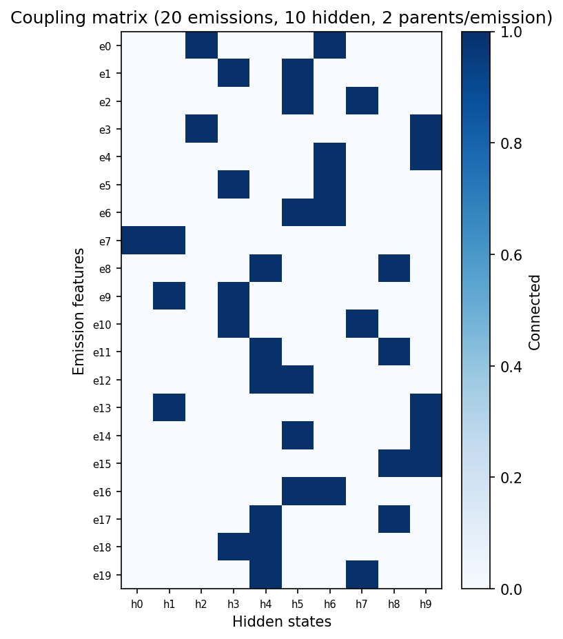
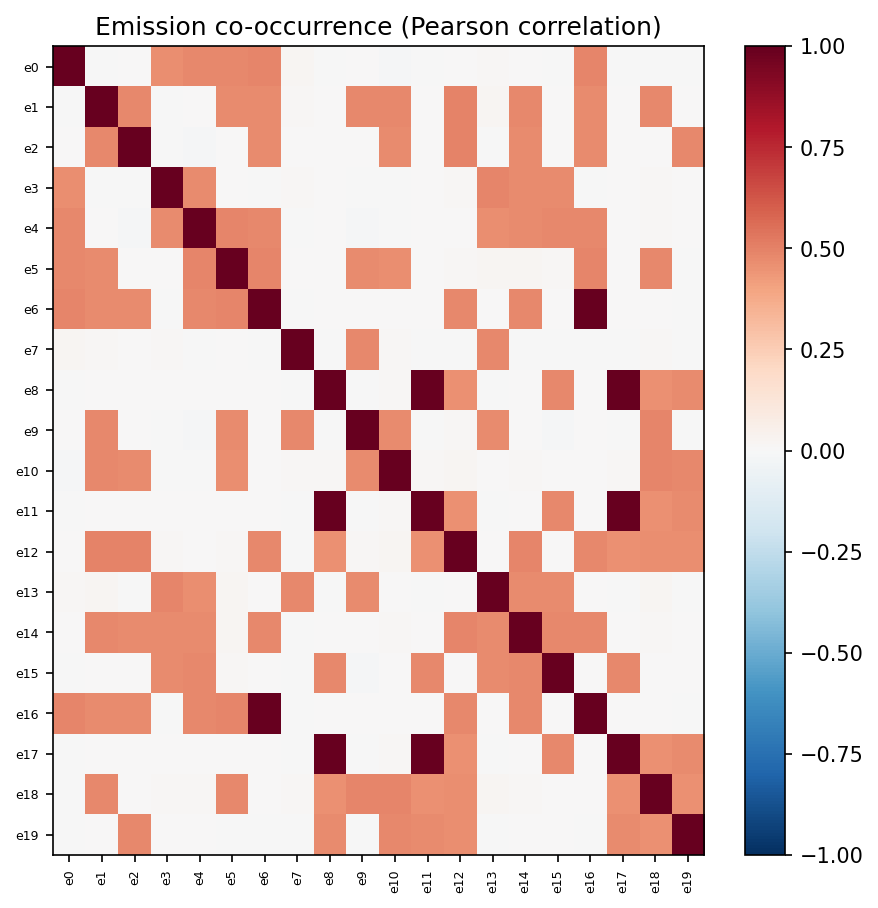
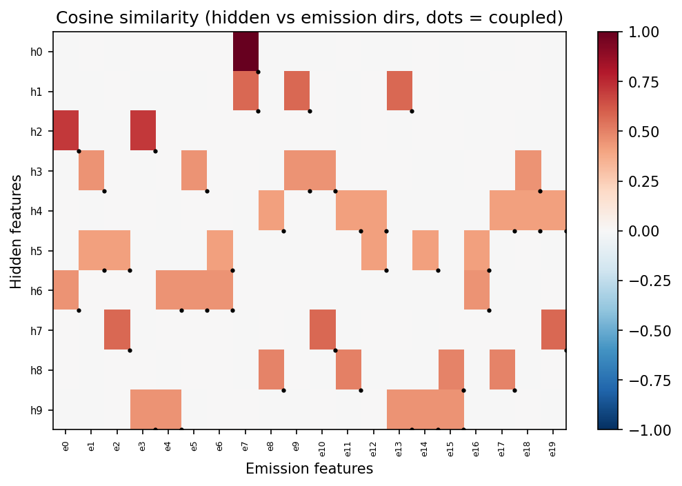
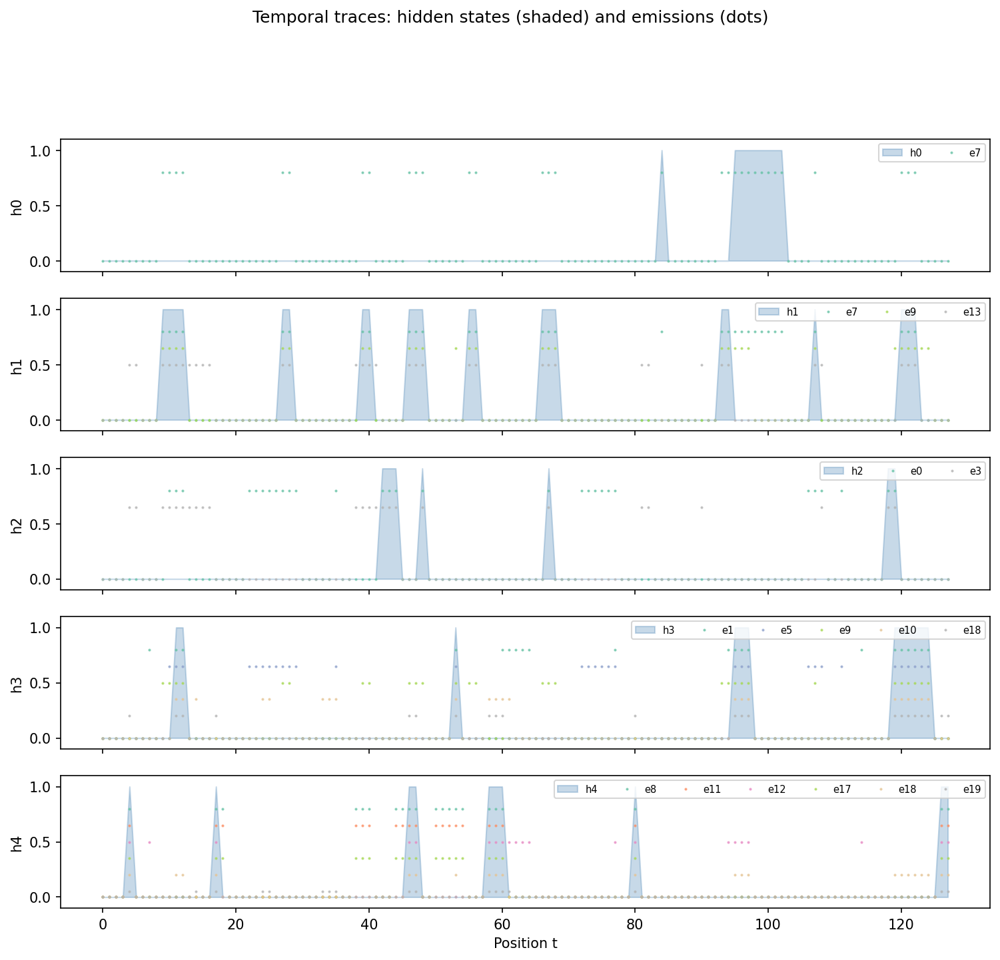
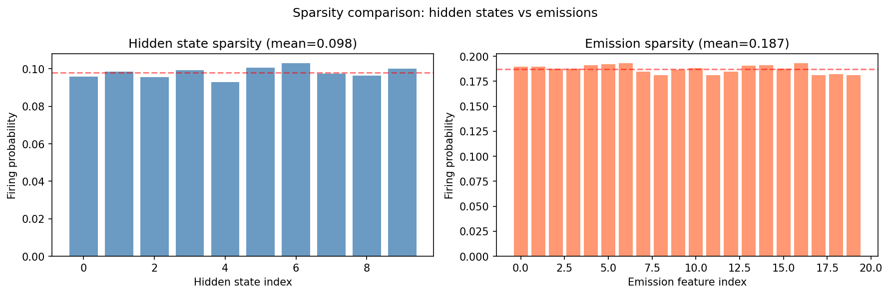

## Overview

This document summarizes two infrastructure deliverables from the April 4 meeting:

1. **`src/bench/`** -- a standardized, plug-and-play module for comparing temporal SAE
   architectures (TopKSAE, StackedSAE, TemporalCrosscoder, TFA) on synthetic data.
2. **Richer HMM extensions** -- leaky reset and coupled features in the data generation
   pipeline, enabling the "figure 2" robustness experiments Dmitry identified as essential.

Both are tested and validated on GPU.

## Part 1: Architecture Comparison Bench (`src/bench/`)

### Motivation

Previously, architecture comparisons were split across two codebases: Andre's
`temporal_crosscoders/` (StackedSAE + TXCDR, hardcoded sweep) and Han's
`src/v2_temporal_schemeC/experiment/` (ModelSpec pattern, data pipeline, unified eval).
The bench module unifies the best of both into a single canonical framework on `main`.

### Design

Adopted Han's **ModelSpec** pattern: each architecture implements an `ArchSpec` interface
with `create()`, `train()`, `eval_forward()`, and `decoder_directions()`. Adding a new
architecture requires one file + one registry entry.

```text
src/bench/
    __init__.py
    config.py               # DataConfig, TrainConfig, SweepConfig
    data.py                 # DataPipeline, build_data_pipeline()
    eval.py                 # EvalResult, evaluate_model(), feature_recovery_auc()
    sweep.py                # run_sweep(), CLI
    architectures/
        __init__.py          # registry + get_default_models()
        base.py              # ArchSpec ABC, EvalOutput, ModelEntry
        topk_sae.py          # single-token TopK SAE baseline
        stacked_sae.py       # T independent SAEs
        crosscoder.py        # temporal crosscoder (shared latent, k*T active)
        tfa.py               # temporal feature analysis (attention-based)
        _tfa_module.py       # TFA nn.Module (self-contained, no external deps)
```

### How to use

**Run a sweep from the command line:**

```bash
# See the full plan (no training):
python -m src.bench.sweep --dry-run

# Quick smoke test (100 steps, single config):
python -m src.bench.sweep --steps 100 --k 2 --rho 0.0 --T 2

# Full sweep (30k steps, all architectures):
python -m src.bench.sweep --results-dir results/bench

# Filter to specific models:
python -m src.bench.sweep --models topk_sae crosscoder --steps 5000

# Custom grid:
python -m src.bench.sweep --k 2 5 10 --rho 0.0 0.9 --T 2 5
```

**Use programmatically:**

```python
import torch
from src.bench.architectures import get_default_models
from src.bench.config import DataConfig, TrainConfig, SweepConfig
from src.bench.sweep import run_sweep

device = torch.device("cuda")
results = run_sweep(
    models=get_default_models(T_values=[2, 5]),
    data_config=DataConfig(),
    train_config=TrainConfig(total_steps=30_000),
    sweep_config=SweepConfig(k_values=[2, 5, 10], rho_values=[0.0, 0.9]),
    device=device,
    results_dir="results/bench",
)
# results is a list of dicts with model, rho, k, nmse, l0, auc, r90, ...
```

**Add a new architecture (e.g., JumpReLU, tensor network):**

1. Create `src/bench/architectures/my_arch.py`:

```python
from src.bench.architectures.base import ArchSpec, EvalOutput

class MyArchSpec(ArchSpec):
    name = "MyArch"
    data_format = "flat"  # or "seq" or "window"

    def create(self, d_in, d_sae, k, device): ...
    def train(self, model, gen_fn, total_steps, batch_size, lr, device, **kw): ...
    def eval_forward(self, model, x): ...
    def decoder_directions(self, model, pos=None): ...
```

2. Register in `src/bench/architectures/__init__.py`
3. It's automatically included in sweeps via `get_default_models()`

### Test results

19/19 tests passing (`uv run pytest tests/bench/ -v`):

| Test suite | Tests | Status |
|------------|-------|--------|
| `tests/bench/test_architectures.py` | 11 | Pass |
| `tests/bench/test_data_and_eval.py` | 8 | Pass |

Smoke sweep (100 steps, rho=0.0, k=2, T=2):

| Model | NMSE | L0 | AUC |
|-------|------|----|-----|
| TopKSAE | 0.971 | 2.0 | 0.207 |
| TFA | 0.943 | 38.9 | 0.192 |
| TFA-pos | 0.946 | 26.0 | 0.193 |
| Stacked T=2 | 0.971 | 2.0 | 0.201 |
| TXCDR T=2 | 0.952 | 4.0 | 0.217 |

(Low AUC expected at 100 steps -- models haven't converged.)

## Part 2: Richer HMM Extensions

### Motivation

Dmitry's concern from the April 4 meeting: the current generative process is too simple.
Each emission depends on exactly one hidden state, so local and global features are
nearly redundant. The TXCDRv2 might only look good because the generative process
doesn't demand real temporal reasoning. Two extensions address this.

### Extension 1: Leaky reset

Replaces the binary persist-or-resample transition with a leak parameter
$\delta \in [0,1]$ that biases reset events toward the current state.

```python
from src.data_generation.configs import TransitionConfig

# Standard reset (delta=0):
cfg_standard = TransitionConfig.from_reset_process(lam=0.5, p=0.05)

# Leaky reset (delta=0.5):
cfg_leaky = TransitionConfig.from_leaky_reset(lam=0.5, p=0.05, delta=0.5)
```

Transition probabilities:

- $P(h=1 \mid h=1) = 1 - \lambda(1-\delta)(1-\mu)$
- $P(h=1 \mid h=0) = \lambda(1-\delta)\mu$

Stationary distribution remains $\mu$ for all $\delta < 1$. Effective autocorrelation
$\rho_{\text{eff}} = 1 - \lambda(1-\delta)$ increases monotonically with $\delta$.

Verified: $\delta = 0$ reproduces standard reset; autocorrelation increases
as `[0.500, 0.625, 0.750, 0.875]` for $\delta \in [0, 0.25, 0.5, 0.75]$.

### Extension 2: Coupled features

$K$ hidden states drive $M > K$ emission features through a binary coupling matrix
$C \in \{0,1\}^{M \times K}$. This creates genuine separation between local
(emission-level) and global (hidden-state-level) structure.

```python
from src.data_generation import (
    CoupledDataGenerationConfig, CouplingConfig, generate_coupled_dataset,
)
from src.data_generation.configs import TransitionConfig, SequenceConfig

cfg = CoupledDataGenerationConfig(
    transition=TransitionConfig.from_reset_process(lam=0.4, p=0.1),
    coupling=CouplingConfig(K_hidden=10, M_emission=20, n_parents=2),
    sequence=SequenceConfig(T=128, n_sequences=200),
    hidden_dim=64,
)
result = generate_coupled_dataset(cfg)

# Two sets of ground truth for dual-AUC evaluation:
result["emission_features"]   # (20, 64) -- local ground truth
result["hidden_features"]     # (10, 64) -- global ground truth
result["coupling_matrix"]     # (20, 10) -- binary mapping
```

### Validation plots

Generated with `python -m src.data_generation.plot_coupled`.
Config: $K=10$, $M=20$, $n_{\text{parents}}=2$, $\rho=0.6$, OR-gate coupling.

**Coupling matrix**: each emission has exactly 2 parent hidden states, spread evenly
across all 10 hidden states.



**Emission co-occurrence**: emissions sharing a parent hidden state are positively
correlated (warm off-diagonal blocks). This is the temporal structure a TXCDRv2 should
learn to exploit -- emissions that co-fire across time share a hidden cause.



**Hidden-emission cosine similarity**: each hidden feature direction (row) has highest
cosine similarity with the emission features it controls (black dots mark coupled pairs).
Non-coupled entries are near-zero. Confirms `compute_hidden_features()` correctly computes
global directions as normalized sums of child emission directions.



**Temporal traces**: when a hidden state turns on (blue shaded), its child emissions
co-fire (colored dots). Multiple emissions co-activate during the same plateau. This is
the signal that temporal models can exploit for global feature recovery.



**Sparsity summary**: hidden states fire at ~0.098 (close to configured $p=0.1$).
Emissions fire at ~0.187, matching the OR-gate theory:
$P(\text{emission}) = 1 - (1-p)^{n_{\text{parents}}} \approx 0.19$ for $p=0.1$,
$n_{\text{parents}}=2$.



### Smoke test summary

All 6 data generation tests pass (`python src/data_generation/test.py`):

| Test | Status |
|------|--------|
| MC dataset (deterministic emission) | Pass |
| Custom transition matrix | Pass |
| HMM stochastic emissions | Pass |
| Leaky reset (delta sweep) | Pass |
| Coupled features (OR gate, K=10, M=20) | Pass |
| Coupled features (diagonal, K=M=10) | Pass |

## What's next

### For Han (experiments)

The coupled features pipeline is ready for sweep experiments. Suggested setup:

- Default: $K=10$ hidden, $M=20$ emissions, $n_{\text{parents}}=2$
- More entangled: $K=10$, $M=30$, $n_{\text{parents}}=3$
- Sweep $\rho \in [0.0, 0.6, 0.9]$ and $k$ values to find the phase transition
- Compute **two AUC scores**: local (vs `emission_features`) and global
  (vs `hidden_features`)

The phase transition hypothesis: at low $k$, models recover emission features
(high local AUC). At high $k$, TXCDRv2 transitions to recovering hidden-state
features (global AUC rises). This is the "figure 2" result for the paper.

### Bench integration (done)

The `src/bench/` module fully supports both HMM extensions:

**Leaky reset** -- set `MarkovConfig(delta=0.5)` or use `--delta 0.5` on the CLI:

```bash
python -m src.bench.sweep --delta 0.5 --rho 0.6 --k 2 5 10 --steps 100
```

**Coupled features** -- set `CouplingConfig` on `DataConfig` or use `--coupled` on the CLI:

```bash
python -m src.bench.sweep --coupled --K-hidden 10 --M-emission 20 --n-parents 2 \
  --k 2 5 10 --rho 0.0 0.9 --steps 100
```

In coupled mode, results include both `AUC` (local, vs emission features) and
`gAUC` (global, vs hidden-state features). The `DataPipeline.global_features`
tensor provides the K hidden-state ground truth directions.

**Programmatic example:**

```python
from src.bench.config import CouplingConfig, DataConfig, MarkovConfig
from src.bench.data import build_data_pipeline

config = DataConfig(
    markov=MarkovConfig(pi=0.1, rho=0.6, delta=0.3),
    coupling=CouplingConfig(K_hidden=10, M_emission=20, n_parents=2),
    d_sae=20,
)
pipeline = build_data_pipeline(config, device, window_sizes=[2, 5])

pipeline.true_features    # (hidden_dim, 20) -- emission features (local)
pipeline.global_features  # (hidden_dim, 10) -- hidden features (global)
```

## Code

- **Bench module**: `src/bench/`
- **Bench tests**: `tests/bench/`
- **Coupled features**: `src/data_generation/coupling.py`, `src/data_generation/coupled_dataset.py`
- **Leaky reset**: `src/data_generation/transition.py` (`build_leaky_transition_matrix`)
- **Validation plots**: `src/data_generation/plot_coupled.py`
- **Results**: `results/coupled_validation/`
- **Plan doc**: [[coupled_features_plan]]
