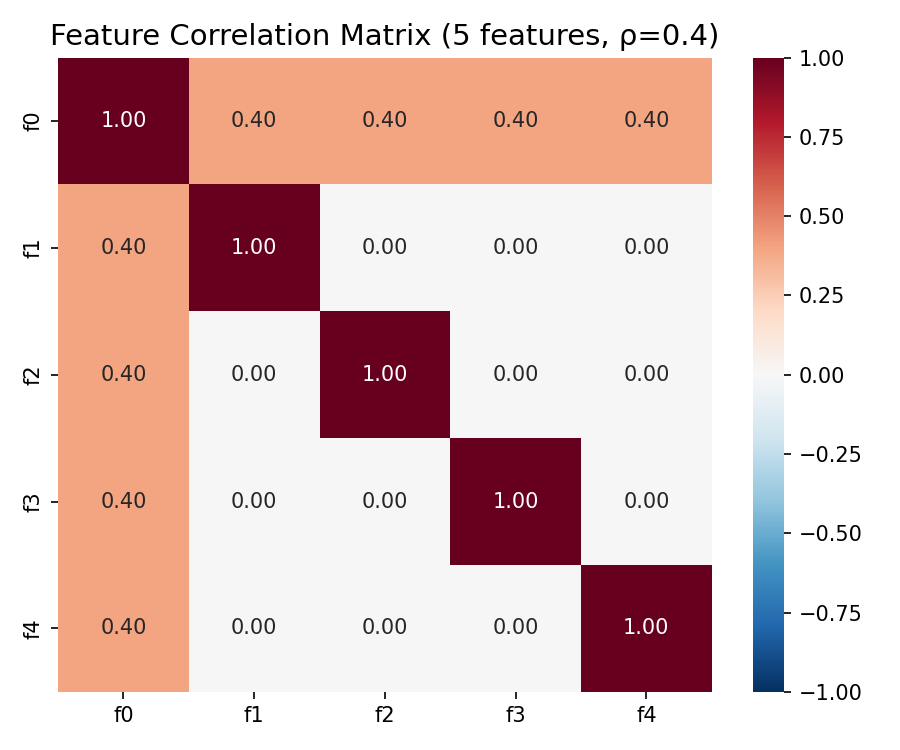
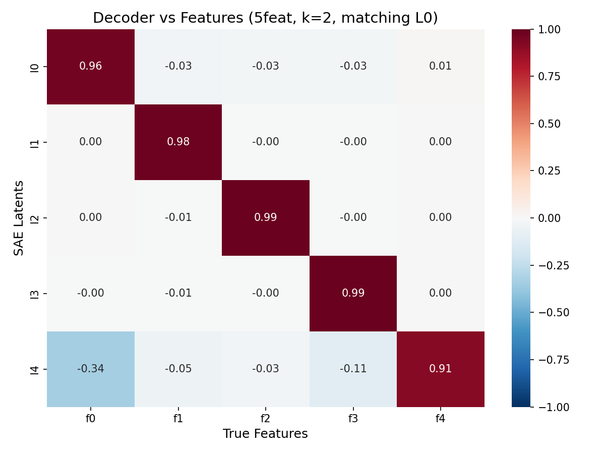
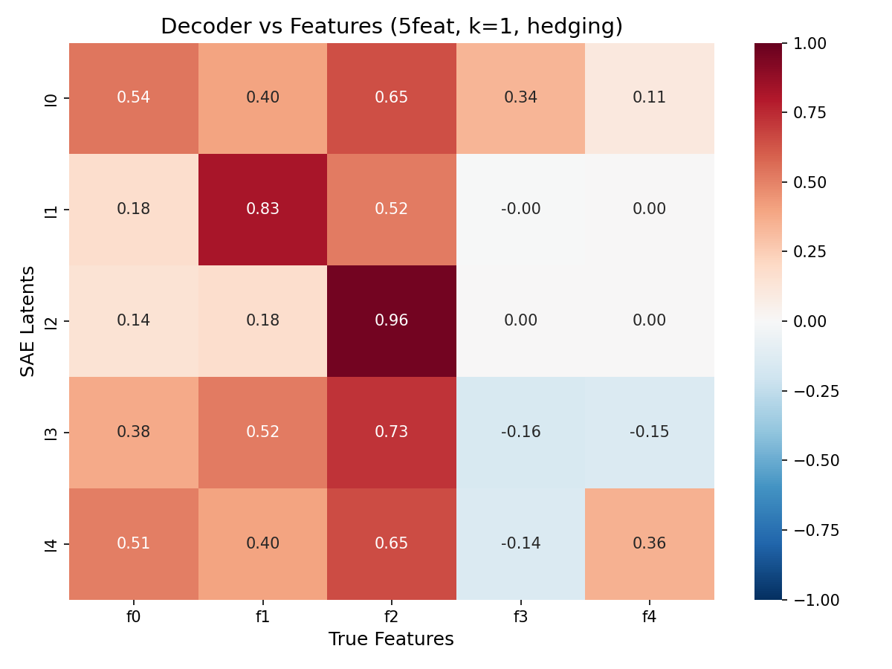
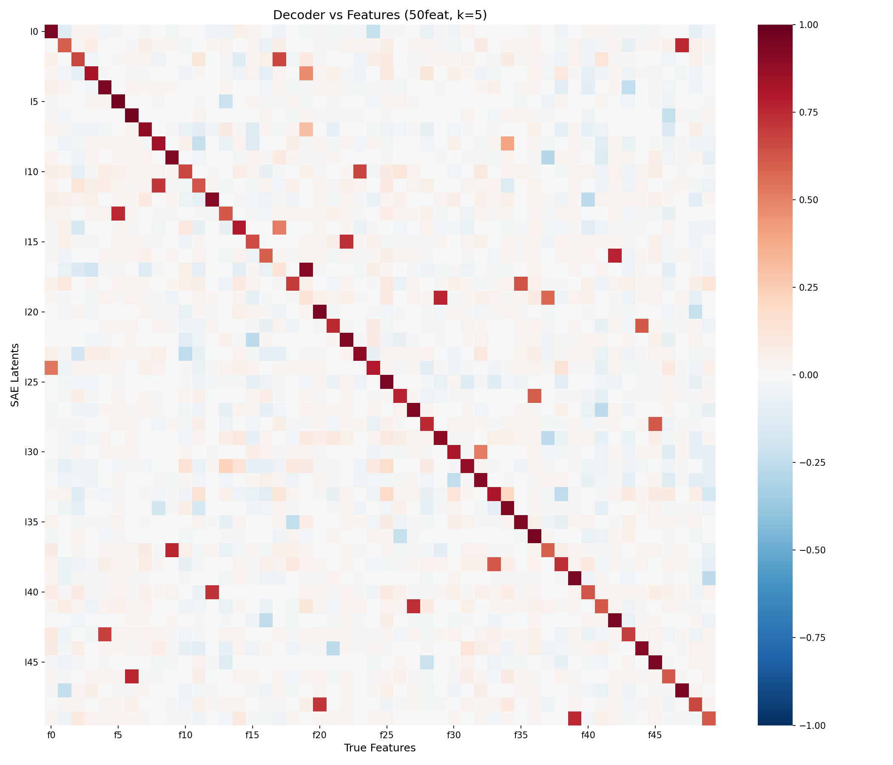
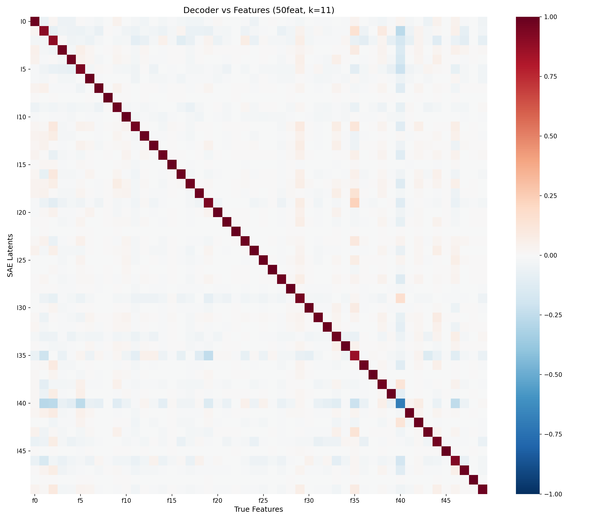
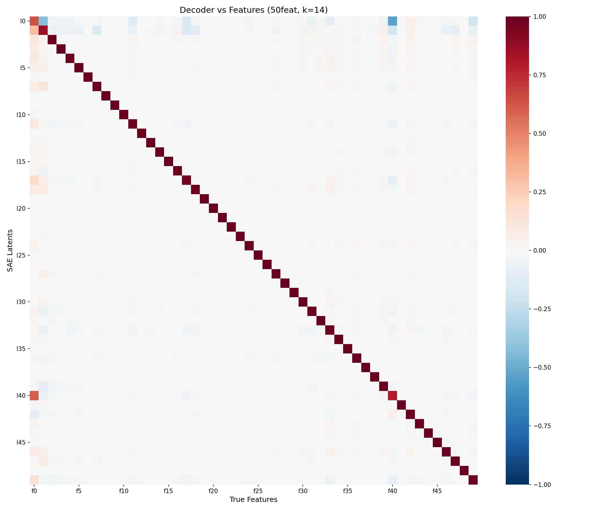
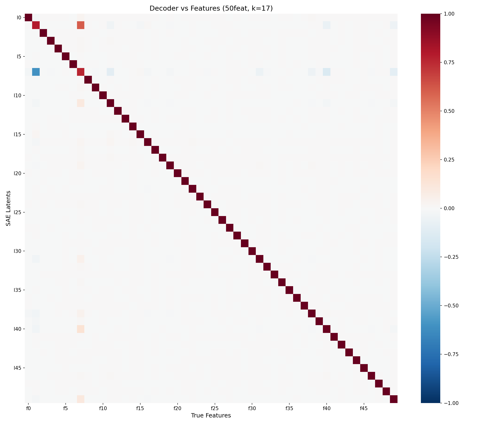
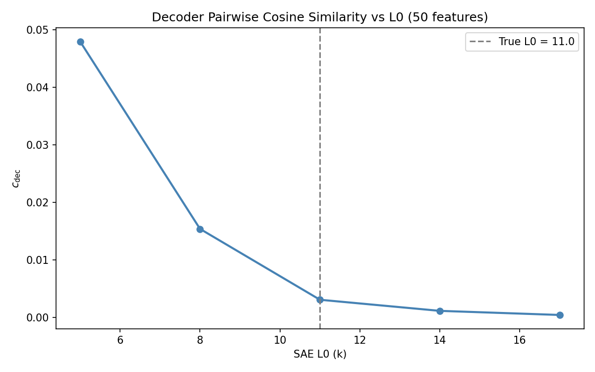

## Feature hedging in SAEs with correlated features

We reproduce and extend the "feature hedging" phenomenon described by Chanin et al. (2025, arXiv 2508.16560, Figure 2). The core finding is that when an SAE's sparsity constraint forces it to use fewer active latents than the true number of simultaneously active features (i.e. the SAE's L0 is below the data-generating process's true L0), the decoder directions are no longer monosemantic: each latent mixes in components of correlated features to improve reconstruction at the cost of interpretability. We call this **feature hedging**.

**Setup.** We use the same data-generating process as in our toy model setup. Let $\mathbf{f}_1, \ldots, \mathbf{f}_k \in \mathbb{R}^d$ be $k$ orthogonal unit-norm feature directions. Each activation vector is
$$
\mathbf{x} = \sum_{i=1}^k a_i \, \mathbf{f}_i, \qquad a_i = s_i \, m_i,
$$
where $s_i \sim \mathrm{Bernoulli}(p)$ and $m_i = 1$ (unit magnitude, no noise). The support variables $s_1, \ldots, s_k$ are drawn jointly via a Gaussian copula with a prescribed correlation matrix $\mathbf{R} \in \mathbb{R}^{k \times k}$, so that features can co-occur more or less frequently than independence would predict.

We train TopK SAEs with $h = k$ latents (matching the true number of features) and vary the sparsity parameter $k_{\text{TopK}}$. All SAEs are initialized at the ground-truth feature directions $\mathbf{W}_\text{dec} = [\mathbf{f}_1, \ldots, \mathbf{f}_k]^\top$, $\mathbf{W}_\text{enc} = \mathbf{W}_\text{dec}^\top$, $\mathbf{b}_\text{enc} = \mathbf{b}_\text{dec} = \mathbf{0}$, following the "ground-truth initialization" protocol of Chanin et al. This isolates the effect of the sparsity constraint: the SAE starts with perfect features and can only move away from them if the training objective incentivizes doing so.

**Evaluation metrics.** We measure feature recovery by computing the cosine similarity matrix $\mathbf{M} \in \mathbb{R}^{h \times k}$ between each SAE decoder column and each true feature direction:
$$
M_{ij} = \frac{\mathbf{w}_i^\top \mathbf{f}_j}{\|\mathbf{w}_i\| \, \|\mathbf{f}_j\|},
$$
where $\mathbf{w}_i$ is the $i$-th row of $\mathbf{W}_\text{dec}$ (the decoder direction for latent $i$). A clean diagonal in this matrix indicates monosemantic recovery. We also report the decoder pairwise cosine similarity $c_\text{dec}$, defined as the mean absolute cosine similarity between all pairs of decoder columns:
$$
c_\text{dec} = \frac{1}{\binom{h}{2}} \sum_{i < j} \left| \frac{\mathbf{w}_i^\top \mathbf{w}_j}{\|\mathbf{w}_i\| \, \|\mathbf{w}_j\|} \right|.
$$
Lower $c_\text{dec}$ indicates more orthogonal decoder directions, which is desirable since the true features are orthogonal by construction.

---

## Part 1: 5-feature reproduction

We first reproduce the exact setting from Chanin et al., Figure 2. Five features in $\mathbb{R}^{20}$, each firing with probability $p = 0.4$ (so the true L0 $= 5 \times 0.4 = 2.0$). Feature $f_0$ is positively correlated with each of $f_1, \ldots, f_4$ at $\rho = 0.4$; the remaining pairs are uncorrelated.



We train two TopK SAEs with $h = 5$ latents, both initialized at the ground truth:

- **$k_\text{TopK} = 2$ (matching the true L0).** The SAE can activate exactly as many latents as there are active features on average, so there is no pressure to hedge. The decoder-feature cosine similarity matrix shows a clean diagonal, with all diagonal entries $\geq 0.91$ and off-diagonal entries $\leq 0.03$ in magnitude. Each latent has learned a single true feature.



- **$k_\text{TopK} = 1$ (below the true L0).** The SAE can activate only one latent per sample, but on average two features are active. To minimize reconstruction error under this budget, the SAE learns "hedged" decoder directions that mix correlated features. The cosine similarity matrix is no longer diagonal: most latents have substantial positive similarity with multiple features. For example, latent $\ell_0$ has cosine similarities of 0.54, 0.40, and 0.65 with $f_0$, $f_1$, and $f_2$ respectively -- it has become a blend of correlated features rather than representing any single one.



**Interpretation.** The mechanism is straightforward. When only one latent can fire but two features are typically active, the SAE cannot represent both features independently. The optimal single-latent strategy is to point the decoder direction toward the average of the most commonly co-occurring features, weighted by their expected magnitudes. This is precisely feature hedging: the SAE sacrifices monosemanticity for reconstruction quality. The presence of positive correlations between $f_0$ and $f_1\text{--}f_4$ makes hedging particularly attractive, since these features tend to co-occur and a single blended direction can partially reconstruct multiple active features simultaneously.

---

## Part 2: 50-feature version

We scale the experiment to 50 features in $\mathbb{R}^{100}$, with firing probability $p = 0.22$ (true L0 $= 50 \times 0.22 = 11$). The correlation matrix is generated randomly (seed 42; mixture of positive and negative correlations with sparsity 0.3). We train TopK SAEs with $h = 50$ latents at $k_\text{TopK} \in \{5, 8, 11, 14, 17\}$, all initialized at the ground truth.

**Decoder-feature heatmaps.** As $k_\text{TopK}$ increases from well below the true L0 toward and past it, the cosine similarity matrix transitions from a noisy, off-diagonal-heavy pattern to a clean diagonal:

| $k_\text{TopK}$ | $c_\text{dec}$ | Qualitative pattern |
| --- | --- | --- |
| 5 | 0.048 | Heavy off-diagonal mixing; many latents blend multiple features |
| 8 | 0.015 | Diagonal emerging but still visible hedging |
| 11 | 0.003 | Clean diagonal; near-perfect feature recovery |
| 14 | 0.001 | Clean diagonal |
| 17 | 0.0004 | Clean diagonal |

At $k_\text{TopK} = 5$ (less than half the true L0), the heatmap shows substantial off-diagonal structure: each latent has positive cosine similarity with several features, and the diagonal entries are weaker. This is the 50-feature analogue of the hedging observed in Part 1.



At $k_\text{TopK} = 8$, the diagonal is clearly present but off-diagonal contamination persists, particularly for features that are strongly correlated in the data-generating process.


At $k_\text{TopK} = 11$ (matching the true L0), recovery is near-perfect: the heatmap is dominated by the diagonal, with off-diagonal entries close to zero.



At $k_\text{TopK} = 14$ and $k_\text{TopK} = 17$ (above the true L0), the diagonal remains clean. The extra latent budget does not cause the SAE to split features, because the ground-truth initialization provides exactly one latent per feature and there is no reconstruction benefit to splitting.





**$c_\text{dec}$ vs L0.** The decoder pairwise cosine similarity decreases monotonically as $k_\text{TopK}$ increases, with a sharp elbow near the true L0. This confirms that the true L0 is the critical threshold: below it, the sparsity constraint forces decoder columns to become non-orthogonal (hedging), while at or above it, the SAE can maintain orthogonal directions matching the true features.



---

## Implications

These results reproduce the central finding of Chanin et al. in our toy model framework: **feature hedging is a systematic failure mode of SAEs with insufficient sparsity budget**. When the SAE's L0 is below the true L0 of the data, the decoder directions are biased away from the true features toward blended directions that mix correlated features. This is not a failure of optimization (the SAEs are initialized at the ground truth) but a consequence of the training objective: the MSE loss actively incentivizes hedging when the sparsity constraint is too tight.

For our temporal crosscoder work, this establishes a baseline: before studying whether temporal structure can help with feature recovery, we need to ensure that the SAE's sparsity budget is set correctly. Feature hedging is orthogonal to temporal correlations -- it occurs even in the i.i.d. setting -- but it can confound experiments if not controlled for.

## Reproducibility

```bash
uv run python -m src.v3_feature_hedging.feature_hedging
```

All plots are saved to `results/feature_hedging/`. The experiment uses seed 42 and trains 7 SAEs (2 for Part 1, 5 for Part 2), each for 15M samples.
