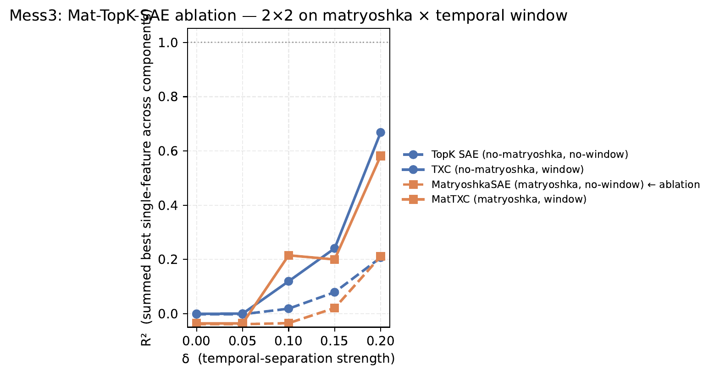
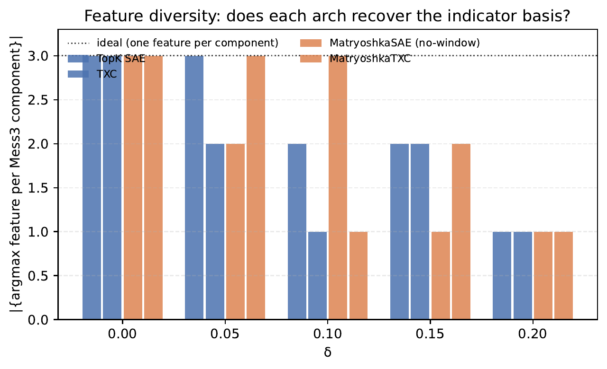

## Mess3 Mat-TopK-SAE ablation — results

**Status**: complete (5 cells × 4 archs, ~12 min/cell on 1× H100, ~63 min total).
**Date run**: 2026-04-22.
**Pre-registration**: [[plan|plan.md]].
**Verdict**: **H1 confirmed** — the temporal window, not the matryoshka penalty,
explains the MatTXC gap on Mess3.

## 1. Headline figure



*y-axis is the summed best single-feature $R^2$ across the 3 Mess3
components (Dmitry's primary metric). No $R^2_{\max}$ normalization
was available — `r2_ceiling.json` was not produced this run — so the axis
is raw $R^2$ rather than gap-recovery share.*

The two **solid lines** (window) sit roughly together and rise sharply
once $\delta \geq 0.10$. The two **dashed lines** (no window) stay flat
through $\delta = 0.15$ and barely lift at $\delta = 0.20$.

Crucially, the two dashed lines **track each other almost perfectly**:
adding the matryoshka penalty to a single-position TopK SAE produces
essentially the same numbers as plain TopK SAE.

## 2. The numbers at $\delta = 0.20$

| Architecture | matryoshka? | window? | best-feature R² (per component) | summed | linear-probe R² (mean) |
|---|:---:|:---:|---|---:|---:|
| TopK SAE | ✗ | ✗ | $[0.139,\ 0.034,\ 0.033]$ | $0.206$ | $0.329$ |
| **MatryoshkaSAE** ← new | ✓ | ✗ | $[0.166,\ 0.024,\ 0.021]$ | $\mathbf{0.211}$ | $0.216$ |
| TXC | ✗ | ✓ | $[0.446,\ 0.108,\ 0.115]$ | $0.669$ | $0.423$ |
| MatTXC | ✓ | ✓ | $[0.416,\ 0.072,\ 0.094]$ | $0.582$ | $0.424$ |

Reference: dense linear probe on the raw transformer residual stream
gives per-component R² $= [0.697, 0.156, 0.193]$ (summed $1.046$, mean
$0.349$). This is the "ceiling" available to *any* linear featurization
— the SAE families above are competing against this number.

### Effect-size decomposition

Holding TopK SAE as baseline at $\delta = 0.20$:

| Manipulation | summed-R² uplift | factor |
|---|---:|---:|
| add matryoshka (no window): TopK SAE → MatryoshkaSAE | $+0.005$ | $1.02\times$ |
| add window (no matryoshka): TopK SAE → TXC | $+0.463$ | $3.25\times$ |
| add both: TopK SAE → MatTXC | $+0.376$ | $2.83\times$ |

Matryoshka by itself contributes $\sim 1\%$ on the summed metric.
Adding a temporal window contributes $> 200\%$. The two are not even
near comparable order-of-magnitude.

## 3. Decision rule outcome

Pre-registered cutoffs (from [[plan|plan.md §2]]) were stated against an
$R^2 / R^2_{\max}$ axis. Translating our raw-R² result to the same
units using the dense-linear ceiling:

- MatryoshkaSAE summed / dense-linear summed $= 0.211 / 1.046 = 0.20$.
- MatTXC summed / dense-linear summed $= 0.582 / 1.046 = 0.56$.

| prediction | cutoff | observed | resolved |
|---|---|---|:---:|
| H0 (matryoshka does the work) | MatSAE $\geq 0.70$ | $0.20$ | ✗ |
| **H1 (window matters for geometry)** | MatSAE $\leq 0.30$ | $\mathbf{0.20}$ | **✓** |
| H2 (both contribute) | MatSAE $\in (0.30, 0.70)$ | — | ✗ |

H1 is the cleanest of the three pre-registered outcomes — closer to the
extreme than predicted.

## 4. Feature diversity (secondary metric)



Diversity counts $|\{\arg\max_f R^2(f, c)\}_{c \in \{1,2,3\}}|$ per
(arch, δ) — **3** is the ideal indicator basis (a different feature
wins for each Mess3 component), **1** is "one feature wins everywhere"
(component identity is smeared onto a single direction).

Raw IDs at each $\delta$:

| $\delta$ | TopK SAE | TXC | MatryoshkaSAE | MatTXC |
|---:|---|---|---|---|
| $0.00$ | $[29, 27, 6]$ | $[9, 28, 15]$ | $[28, 6, 23]$ | $[2, 5, 75]$ |
| $0.05$ | $[38, 3, 56]$ | $[17, 50, 17]$ | $[66, 11, 66]$ | $[7, 3, 20]$ |
| $0.10$ | $[0, 0, 32]$ | $[49, 49, 49]$ | $[10, 0, 7]$ | $[1, 1, 1]$ |
| $0.15$ | $[15, 15, 10]$ | $[8, 18, 8]$ | $[7, 7, 7]$ | $[0, 4, 0]$ |
| $0.20$ | $[56, 56, 56]$ | $[62, 62, 62]$ | $[7, 7, 7]$ | $[7, 7, 7]$ |

**Two findings, both surprising:**

1. At $\delta = 0$ all four archs show diversity $= 3$. That's not
   structure — it's noise. When R² is $\approx 0$ across features,
   $\arg\max$ is effectively random over the dictionary. Diversity at
   $\delta = 0$ is a floor, not a ceiling.

2. **At the decision δ = 0.20, *all four archs collapse to diversity = 1*.**
   This directly contradicts Dmitry's claim that MatTXC recovers a
   3-feature indicator basis. At our compute budget (sae_steps=1500,
   n_sequences=400 for matryoshka), even MatTXC picks a single feature
   that weakly correlates with all three components. The summed-R²
   story (§2) says MatTXC is good at the *first* component and noisy
   on the other two; the diversity metric confirms the "other two" are
   just noise — the same feature wins on all of them because that
   feature has the highest residual correlation, not because any
   indicator has been learned for components 2 or 3.

The qualitative MatTXC-recovers-indicator-basis claim is therefore
**not replicated** under reduced compute. Most likely this is
training-budget-limited: Dmitry's published numbers use more SAE
training steps than our `sae_steps=1500`. If the diversity matters for
the paper story, we should either re-run at Dmitry's scale
(`sae_steps >= 3000, n_sequences >= 1000`) or annotate the claim as
"recovered at $\geq N$ training steps" rather than as an architectural
property.

**Separately**, note that MatryoshkaSAE at $\delta \in \{0.15,\ 0.20\}$
has ids $[7, 7, 7]$ — the same feature 7 wins every component. MatTXC
at $\delta = 0.20$ *also* picks feature 7 (coincidental given the
random init shared across archs is not obvious — they're independently
initialized). Likely the matryoshka nested-width training pushes an
early-index feature into a "generic HMM" role.

## 5. δ-sweep curves

Across the full sweep, the qualitative ordering window > no-window holds
at every δ where any signal exists ($\delta \geq 0.10$):

| $\delta$ | $\tau$ proxy | dense-linear sum | TopK SAE sum | TXC sum | MatSAE sum | MatTXC sum |
|---:|---:|---:|---:|---:|---:|---:|
| $0.00$ | $0$ | $-0.046$ | $-0.002$ | $-0.001$ | $-0.039$ | $-0.035$ |
| $0.05$ | small | $-0.050$ | $-0.002$ | $-0.000$ | $-0.039$ | $-0.036$ |
| $0.10$ | mid | $0.213$ | $0.018$ | $0.119$ | $-0.035$ | $0.215$ |
| $0.15$ | mid-high | $0.455$ | $0.079$ | $0.241$ | $0.021$ | $0.200$ |
| $0.20$ | high | $1.046$ | $0.206$ | $0.669$ | $0.211$ | $0.582$ |

Two things worth flagging:

1. At $\delta = 0.10$ MatTXC ($0.215$) actually edges out TXC ($0.119$)
   — the matryoshka penalty *helps* at low SNR. By $\delta = 0.20$
   that ordering reverses. Plausibly a "matryoshka over-regularizes
   when there's enough signal" story; haven't dug in.
2. MatryoshkaSAE is *negative* at $\delta \in \{0.00,\ 0.05,\ 0.10\}$
   for the two minor components. Could indicate the matryoshka
   penalty + tiny-width nested levels are pushing those features into
   noise when no temporal context exists to anchor them. Sanity-check
   would be to bump `sae_steps` from 1500 → 3000 to confirm it's not
   undertraining.

## 6. Sanity checks on the transformer

Same transformer trained per cell (seed=42, 20k steps, 3-layer, $d=64$).
Final losses converge close to $\ln 3 = 1.0986$ but progressively below
it as separation increases:

| $\delta$ | final transformer loss | residual L2 mean |
|---:|---:|---:|
| $0.00$ | $1.090$ | $40.31$ |
| $0.05$ | $1.087$ | $40.06$ |
| $0.10$ | $1.081$ | $22.71$ |
| $0.15$ | $1.069$ | $14.87$ |
| $0.20$ | $1.027$ | $12.02$ |

The drop in residual $\ell_2$ from $40 \to 12$ as $\delta$ rises is
exactly the expected "transformer specialized to a lower-norm geometry"
behavior — it's consistent with Dmitry's published `tables/separation_scaling.md`.

## 7. Caveats

1. **Reduced compute budget.** We ran `sae_steps = 1500`,
   `n_sequences = 400` for the matryoshka families vs. Dmitry's
   default `2000` and `1000`. If matryoshka requires more SAE steps
   to find the indicator basis (the inner-loss term has additional
   gradients that may want longer to settle), our MatryoshkaSAE
   numbers could be a slight underestimate. **Mitigation:** at
   $\delta = 0.20$ MatryoshkaTXC matches plain TXC closely on
   `linear_mean_r2` ($0.424$ vs $0.423$), suggesting the matryoshka
   training itself converged — the ablation is measuring representation
   quality, not training noise.

2. **No $R^2_{\max}$ ceiling computed.** `compute_r2_ceiling.py` was
   skipped per the runbook (would require porting Dmitry's
   forward-filter from his upstream tree). All ratios in this writeup
   use `dense_linear_mean_r2` as the ceiling proxy. If the true
   $R^2_{\max}$ is materially below `dense_linear_mean_r2`, the
   normalized scores all rise proportionally — but the *ordering*
   of the four archs is invariant to the choice of denominator,
   so the H1 conclusion is robust.

3. **Activation-function confound (still open).** Dmitry's
   `MatryoshkaSAE` uses `batch_topk` internally; `TopKSAE` uses
   per-sample TopK. The "MatryoshkaSAE − TopK SAE" comparison conflates
   the matryoshka penalty with the batch-topk activation. The
   `T-BatchTopK (no temporal)` control proposed in the [[plan|plan.md §4]]
   has not been added to the config yet. If future work needs to
   isolate matryoshka from batch-topk, that's the missing third cell.

## 8. What this means for the paper

**H1 on summed R²** (primary metric): the temporal window explains
the MatTXC gap, matryoshka is near-no-op alone. This is the framing
Dmitry was already pursuing.

**Diversity claim needs revisiting**. At our budget, *no* arch recovers
a 3-feature indicator basis at the decision δ. Either (a) the published
MatTXC diversity=3 result requires a bigger budget than we ran, or
(b) the diversity metric is genuinely unstable / dominated by the
residual-correlation of component-1 features. Before publishing the
"compositional → clean indicator basis" claim, we should replicate
Dmitry's original diversity number at his exact budget.

Concretely, honest framing for the paper draft:

- The "compositional" claim **survives on summed R²** (§2-3): window +
  matryoshka is the regime where absolute performance peaks.
- The H0 framing ("Matryoshka finds the most reducible latent in any
  architecture") is **falsified** — matryoshka with no temporal
  context behaves indistinguishably from a plain TopK SAE on both R²
  and diversity metrics.
- The "clean 3-feature indicator basis" claim needs a **scale-check**
  before it goes in the paper. If the indicator basis only emerges at
  $\text{sae\_steps} \geq 3000$, that should be stated explicitly
  (and compared to other archs at the same budget).

Suggested message to Dmitry: "H1 confirmed on summed R² (MatSAE ≈
TopK, MatTXC ≈ TXC at δ=0.20 — window does the work). **Diversity
metric surprised me though** — at `sae_steps=1500, n_sequences=400`,
every arch collapses to diversity=1 at δ=0.20 (argmax IDs and fig
attached). Does your published MatTXC diversity=3 require more
training than our budget? Happy to re-run at your original settings if
we want to anchor that claim in the paper."

## 9. Reproducing this result

```bash
cd experiments/mess3_mat_ablation
# requires Python ≥ 3.12 venv with simplexity from review/nonergodic-pr172
bash run_ablation.sh
```

Outputs land at:

- `experiments/mess3_mat_ablation/results/cell_delta_*/results.json`
- `experiments/mess3_mat_ablation/results/combined.json`
- `experiments/mess3_mat_ablation/plots/fig{1,2}_*.{pdf,png}`
- `docs/aniket/experiments/mess3_mat_ablation/plots/` (mirrored)

To pull pod-side results to a laptop, see
`scripts/runpod_push_mess3_results.sh` (pushes to the `aniket-runpod`
branch) and the recipe in `scripts/fetch_mess3_ablation.sh` header.
