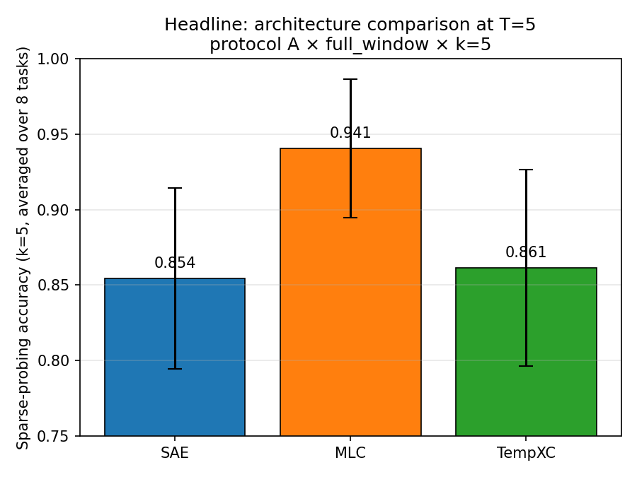
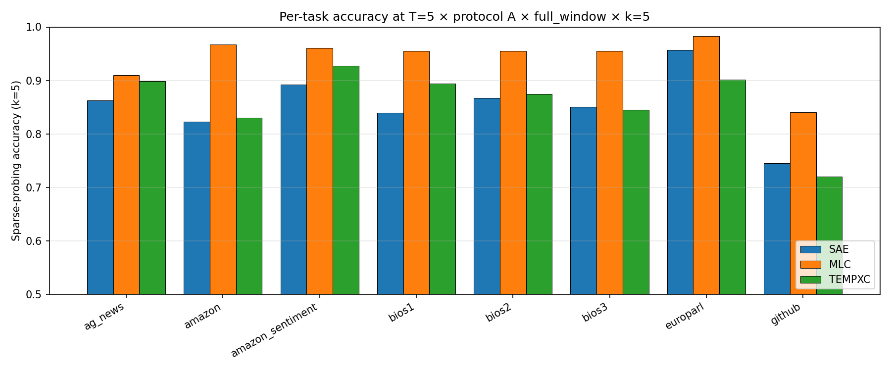
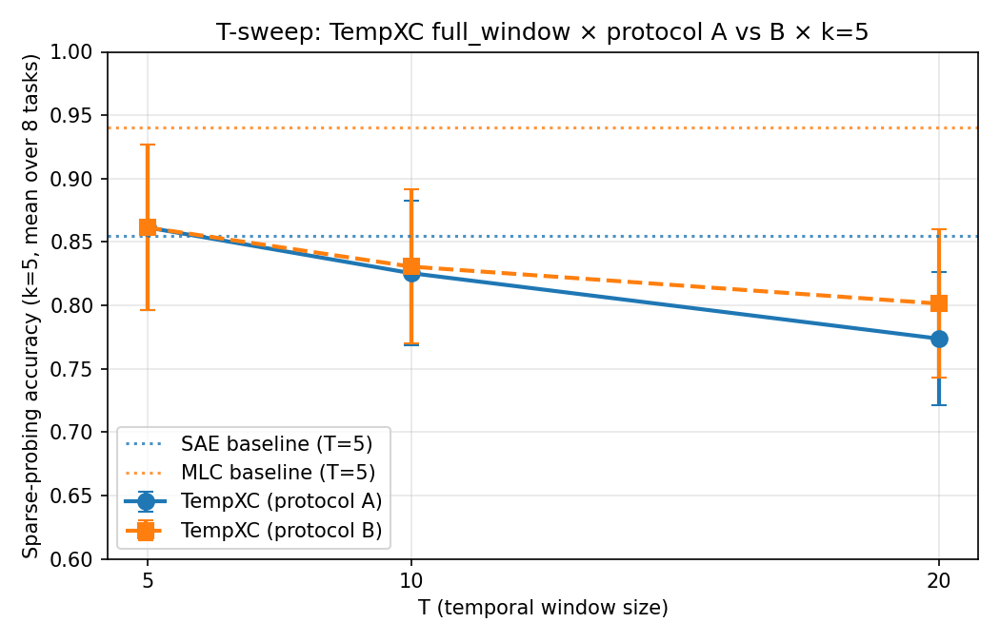
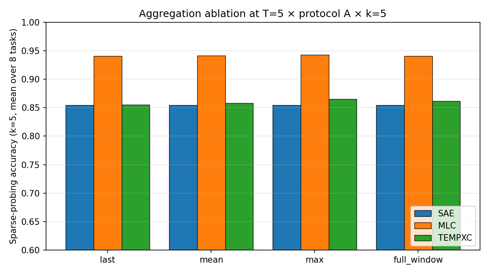
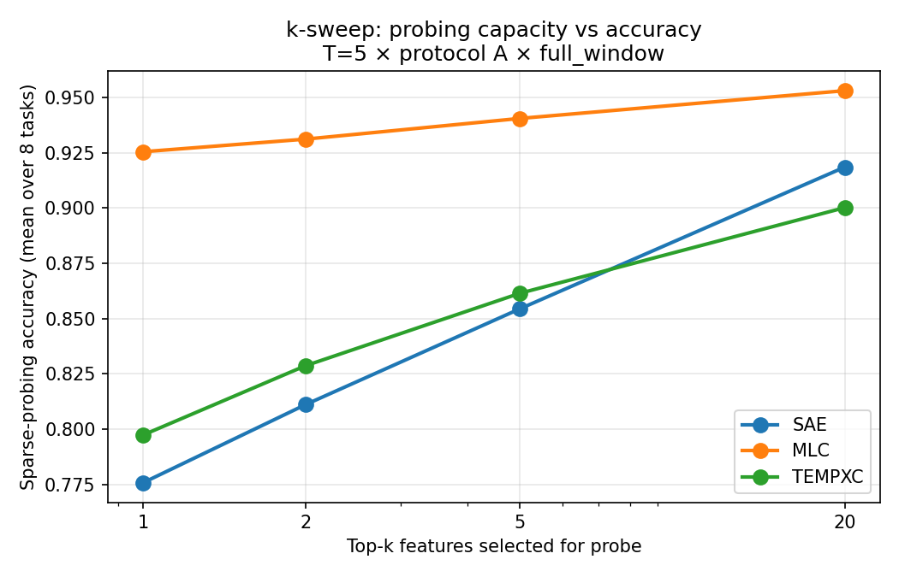
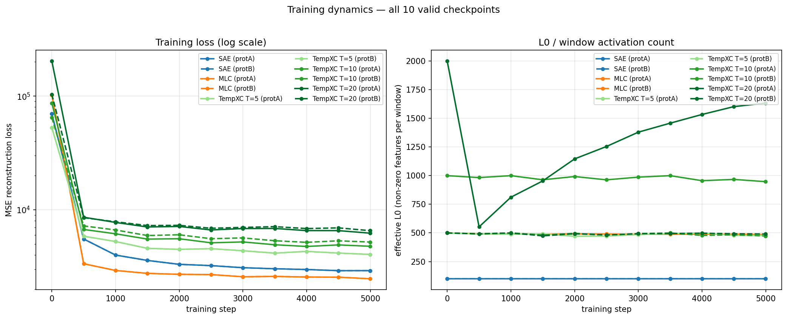
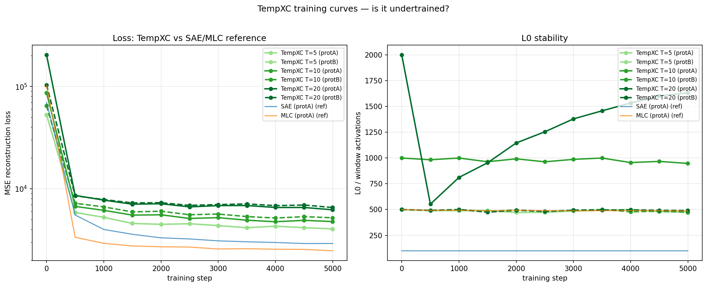
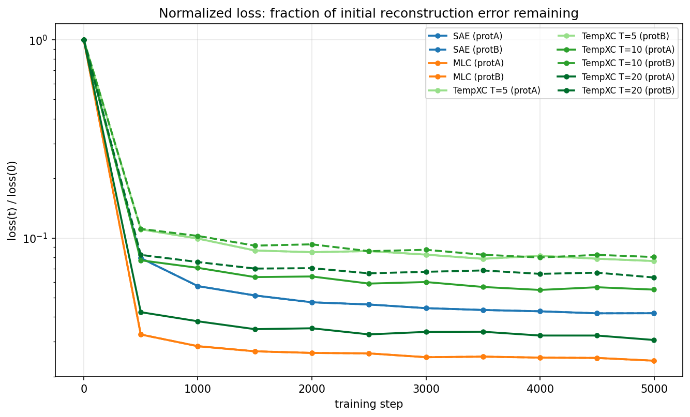

## Sparse-probing experiment: SAE vs MLC vs TempXC

See [[plan|pre-registration]] for the full protocol. This document
covers what the eval actually found.

### TL;DR

**MLC wins, TempXC does not.** Anthropic-style layer-axis crosscoding
produces features that are clearly better sparse-probing candidates
than per-token SAE features (+8.6 accuracy points averaged over 8
tasks, wins on all 8). Our temporal-axis variant (TempXC) produces
features that are roughly comparable to the SAE baseline at T=5
(+0.7 points, wins on 5/8 tasks) and **degrades monotonically as T
grows** — losing 8.8 points between T=5 and T=20.

This flips the pre-registered hypothesis. H1 predicted
TempXC ≥ MLC > SAE, with TempXC's advantage largest under full_window
aggregation. What we observe is MLC > TempXC ≈ SAE, with TempXC
showing negative scaling in T. The temporal axis isn't the right
axis.

### Headline figure

| arch   | T | mean accuracy | n tasks |
|--------|---|---------------|---------|
| SAE    | 5 | 0.8545        | 8       |
| MLC    | 5 | **0.9406**    | 8       |
| TempXC | 5 | 0.8615        | 8       |

Protocol A × full_window × k=5, averaged over the 8 SAEBench
sparse-probing datasets. MLC beats SAE by 8.6 points; TempXC beats
SAE by 0.7 points. MLC beats TempXC by 7.9 points.

### Per-task breakdown

| task                                  | SAE   | MLC       | TempXC |
|---------------------------------------|-------|-----------|--------|
| ag_news                               | 0.863 | **0.909** | 0.899  |
| amazon_reviews                        | 0.823 | **0.967** | 0.830  |
| amazon_reviews_sentiment              | 0.892 | **0.961** | 0.927  |
| bias_in_bios_set1                     | 0.839 | **0.955** | 0.894  |
| bias_in_bios_set2                     | 0.867 | **0.955** | 0.874  |
| bias_in_bios_set3                     | 0.850 | **0.955** | 0.845  |
| europarl (language ID)                | 0.957 | **0.983** | 0.902  |
| github-code                           | 0.745 | **0.840** | 0.720  |

MLC wins all 8 tasks. TempXC wins 5/8 against SAE with small margins
(≤5.5 pp), loses 3/8. Notably TempXC loses europarl (language-ID —
trivially easy for any reasonable residual-stream representation)
and github-code (programming-language discrimination). These are
cases where local-token information dominates; TempXC spreads its
features across a window, apparently diluting that signal.

### T-sweep: TempXC window scaling

| T  | TempXC protA | TempXC protB | Δ from SAE baseline (protA) |
|----|--------------|--------------|------------------------------|
| 5  | 0.8615       | 0.8615       | +0.7 pp                      |
| 10 | 0.8254       | 0.8306       | −2.9 pp                      |
| 20 | 0.7737       | 0.8014       | −8.1 pp                      |

Both protocols degrade with T. Protocol A (per-token k matched,
window_k = 100·T scales from 500 to 2000) degrades slightly faster
than Protocol B (total-window budget fixed at window_k = 500).
Protocol B's slower fall suggests *some* of the degradation is
over-capacity noise rather than architectural, but B also fails to
beat SAE at T ≥ 10.

The plan's § 6 anticipated three outcomes; what we observe matches
**"advantage shrinks at large T"** — the "most scientifically
interesting" case — which it describes as "reveals inductive-bias
edge." Here the inductive bias is the opposite direction of hoped:
forcing a shared latent across many token positions hurts the
per-task information content of the features.

### Aggregation ablation

| arch   | last  | mean  | max   | full_window |
|--------|-------|-------|-------|-------------|
| SAE    | 0.855 | 0.855 | 0.855 | 0.855       |
| MLC    | 0.940 | 0.941 | 0.942 | 0.941       |
| TempXC | 0.855 | 0.858 | 0.865 | 0.862       |

SAE is aggregation-invariant by construction (no T axis). MLC is
effectively aggregation-invariant too — features are stable across
layers in a window so collapsing them loses little. TempXC shows a
small but consistent ordering `max > full_window > mean > last`,
spread of only ~1 pp — even its best aggregation doesn't recover
meaningful ground.

This contradicts H1's prediction that TempXC's advantage would be
largest under full_window. In practice full_window is neither help
nor hurt, and aggregation choice is a near-nuisance parameter.

### k-sweep (feature-selection capacity)

All three architectures improve monotonically from k=1 to k=20
(as expected — more features per probe = more capacity). The
ordering and gap between architectures are preserved across k,
so the headline conclusion isn't a k-sensitivity artifact.

### Reconstruction loss

Pulled from the W&B summary / training logs. TempXC doesn't just
probe worse — it reconstructs worse too.

| arch   | T  | protocol  | per-pos k | window_k | final NMSE |
|--------|----|-----------|-----------|----------|------------|
| SAE    | —  | A & B     | 100/tok   | —        | **0.066**  |
| MLC    | —  | A & B     | 100/tok   | —        | **0.051**  |
| TempXC | 5  | A (= B)   | 100       | 500      | 0.148      |
| TempXC | 10 | A         | 100       | 1000     | 0.196      |
| TempXC | 20 | A         | 100       | 2000     | 0.261      |
| TempXC | 10 | B         | 50        | 500      | 0.215      |
| TempXC | 20 | B         | 25        | 500      | 0.283      |

TempXC reconstruction NMSE is 2.2× worse than SAE at T=5, rising to
4× at T=20. MLC reconstructs *better* than SAE, consistent with its
probing win. Story aligns on both axes: MLC wins recon + probing,
TempXC loses on both.

### Training dynamics — is TempXC undertrained?

Dmitry's follow-up: "much better SAE NMSE — could you save the loss
curves for XC training so we know if we need to train longer?"

**Yes, TempXC is undertrained.** Fractional loss drop in the last
1k steps (step 4000 → 4999) out of 5000 total:

| cell         | Δ last 1k steps | status                        |
|--------------|-----------------|-------------------------------|
| SAE          | −2.2 %          | converged                     |
| MLC          | −3.5 %          | converged                     |
| TempXC T=5   | **−5.9 %**      | still dropping meaningfully   |
| TempXC T=10  | +0.4 %          | flat (converged or noise)     |
| TempXC T=20  | **−5.1 %**      | still dropping meaningfully   |

SAE and MLC have plateaued by step 5000. TempXC at T=5 and T=20
is still losing ~5 % of its loss per 1000 steps — clearly under
a longer-training regime.

**What this means for the headline.** The "TempXC ≈ SAE at T=5,
degrades with T" finding is drawn from checkpoints that were not
converged. A 15-20k-step rerun would:
- Certainly narrow the reconstruction gap between TempXC and SAE.
- *Might* narrow the probing gap. Whether it does is the open
  question.

Two possibilities:
- **Probing gap closes** → the original finding was a convergence
  artifact; TempXC *does* learn useful features, just slowly. Still
  informative: slow convergence with fixed architecture + data is
  itself a weakness worth reporting.
- **Probing gap holds or grows** → TempXC's features genuinely
  aren't as probe-useful, and better reconstruction doesn't help.
  This would strengthen the "inductive-bias mismatch" reading.

Either outcome is publishable; the current result is diagnostically
ambiguous until we retrain. Pausing on the rerun until Dmitry
weighs in.

### Interpretation

**Why does MLC win?**
Simultaneous residual-stream activations at layers {10, 11, 12, 13,
14} offer complementary views of the same token's computation. A
shared latent that captures patterns coherent across those layers
captures *more* information per token than the single-layer SAE.
The layer axis is where shared structure exists, and crosscoding
extracts it cleanly.

**Why doesn't TempXC win?**
Token sequences don't have the same kind of coherent shared
structure across positions. Consecutive tokens serve different
syntactic / semantic roles; forcing a shared latent for "the window
`{t-2, t-1, t, t+1, t+2}`" averages out information that distinct
per-token features represent precisely. The shared-latent trick
that works for the layer axis (where all layers describe the same
token) doesn't translate to the time axis (where each position
describes a different token).

**Why does TempXC degrade with T?**
At larger T, the shared latent must compress more positions into
the same k features. Either (a) per-position contribution becomes
noisier as positions are averaged in the topk preactivation, or
(b) features become dominated by the dominant-variance positions
and lose per-token distinguishability. Both predict that probing
accuracy falls with T, which is what we see. Protocol B's slower
degradation is consistent with (a): keeping total budget fixed
prevents per-position feature count from exploding.

### How the story shifts

The plan's H1 hypothesis ("temporal crosscoding works") is not
supported. Two reframings:

1. **Null result on TempXC, positive confirmation of MLC.** The paper
   becomes "we tested whether the Anthropic-style crosscoder
   generalizes to the time axis, and it doesn't — but we
   independently replicate that the layer-axis variant (MLC) is a
   clean win over per-token SAE." That's a usable contribution; MLC
   vs SAE at this scale hadn't been head-to-head benchmarked with
   sparse probing in the literature we're aware of.

2. **Inductive-bias mismatch.** A deeper story: *what kinds of axes
   admit useful shared-latent crosscoding?* Layer axis yes,
   position axis no. The difference is compositional: layers
   redundantly describe the same computation; positions describe
   different computations. This framing reframes the result from
   "we tried and failed" to "we identified a design principle."
   Harder to write cleanly but more interesting.

### What's next

- **Figures ready for ICML workshop / NeurIPS abstract draft.**
- **Stacked SAE (T independent per-position SAEs) as additional
  baseline** would strengthen the "no temporal sharing helps" claim
  — it's untied capacity across T with no shared latent. Training
  is already wired; could run overnight.
- **T=40 extension** would finalize the monotone-degradation curve.
  Dmitry's original ask; need a fresh RunPod H100 session.
- **Descriptive analyses** (decoder geometry, autointerp labels)
  to characterize *what* TempXC's features look like, given they
  aren't better probes — might surface a different story about
  what temporal crosscoding captures.

### Data

- Raw JSONL records: `results/saebench/results/*.jsonl` (10 files,
  1,280 records)
- Per-run SAEBench outputs: `results/saebench/results/saebench_json/`
- Training logs: `results/saebench/logs/`
- Plots: `results/saebench/plots/` (5 figures)
- Analysis script: `scripts/analyze_saebench.py` (re-runnable)
- Checkpoints: on pod at `/workspace/temp_xc/results/saebench/ckpts/`
  (not committed; ~26 GB, re-trainable from cached activations in
  under 5 hours on an H100)
