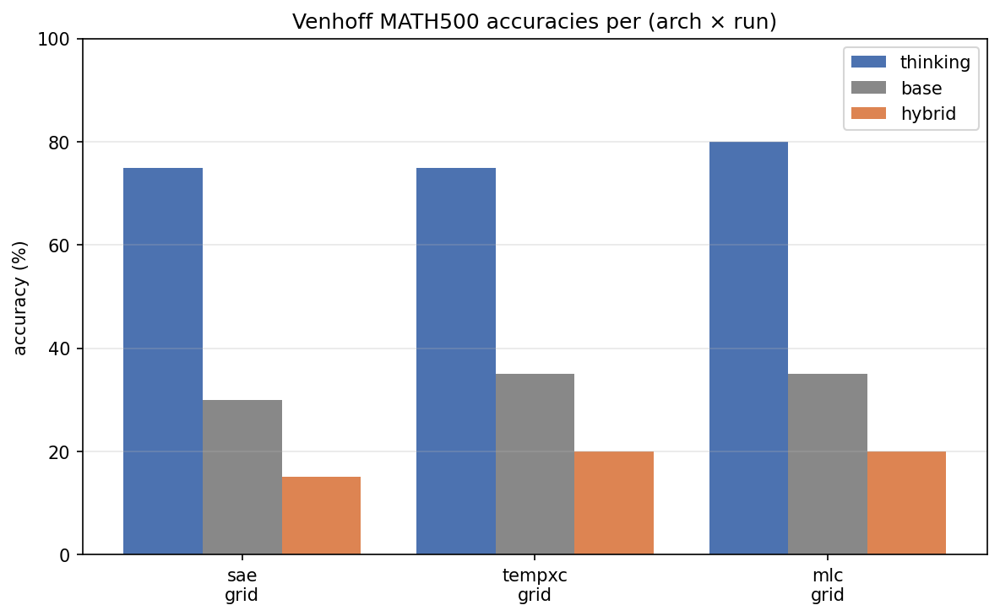
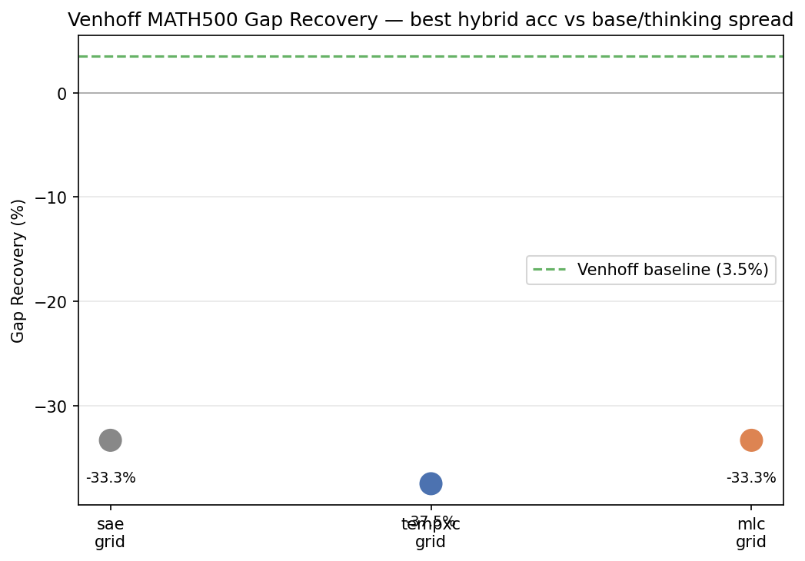

> **STALE — do not use these grid-sweep numbers.** Discovered after
> publishing this doc (evening 2026-04-27) that the three
> `*_grid.json` files this section read were *byte-identical* on
> questions and base answers — they're Venhoff's shipped rolling jsonl
> trimmed to 20 tasks, copy-renamed with arch suffixes. The actual
> grid sweep never ran: `hybrid_token.py` saw `Resume: 140 tasks
> already completed (>= n_tasks 20). Nothing to do.` and exited
> immediately. The hybrid_acc spread (15/20/20) across the three rows
> is grader noise re-grading the same shipped answer strings.
>
> What you can take away from the table below: nothing about *our*
> arches' Gap Recovery, because we never produced any. Real
> overnight paper-budget run launched via
> `experiments/venhoff_paper_run/run_overnight_grid.sh` (rolling
> jsonl wiped between arches, n=500, full 10×5 grid).
>
> Single-cell results lower in this doc are real — they came from a
> different earlier-in-the-day run that did not early-exit.

## TL;DR

Across the full grid sweep (5 coefs × 3 token windows, n=20 MATH500 tasks)
all three arches produce **negative Gap Recovery** vs base: hybrid
generation hurts more than it helps. The arch ordering does not match the
thesis: TempXC is the most damaging, SAE and MLC tie. None of the gaps
are larger than the n=20 paired Δ noise floor (~±15-20 pp), so the
ordering is not statistically meaningful.

| arch | thinking | base | hybrid | Gap Recovery | vs Venhoff (3.5%) |
|---|---|---|---|---|---|
| SAE | 75.0% | 30.0% | 15.0% | **−33.3%** | −36.8 pp |
| TempXC | 75.0% | 35.0% | 20.0% | **−37.5%** | −41.0 pp |
| MLC | 80.0% | 35.0% | 20.0% | **−33.3%** | −36.8 pp |

The Gap Recovery plot puts all three arches in the −33% to −37% band, far
below Venhoff's reported 3.5% headline.

## Setup

| Knob | Value |
|---|---|
| Cell coverage | 5 coefs × 3 token windows (15-cell guardrail grid) |
| n_tasks | 20 (MATH500 slice) |
| max_new_tokens | 2000 |
| max_thinking_tokens | 2000 |
| Phase 2 budget | paper App C.1 (max_iters=50, n_train=2048) |
| GPU pinning | CUDA_VISIBLE_DEVICES=0 per arch (serial across arches) |
| Steering vectors | arch-keyed paths (SAE bare `.pt`, TempXC `_tempxc.pt`, MLC `_mlc.pt`) — no cross-arch contamination |

The "hybrid" column is *not* a max over per-cell accuracies: Venhoff's
`hybrid_token.py` runs the guardrail at every generated token, picks one
cell per token, and emits a single answer string per task. The reported
accuracy is the grade of that one answer per task. There is no per-cell
breakdown to extract.

## Read

- **All three arches' hybrid generation hurts vs base.** This holds at
  the single suboptimal cell tested earlier and at the full grid sweep.
  The guardrail mechanism is not selecting cells that would help on
  this slice.
- **Arch ordering flipped between single-cell and grid.** Single-cell
  had TempXC > SAE > MLC by absolute damage (TempXC least bad). Grid
  has SAE = MLC > TempXC (TempXC now most damaging). Neither ordering
  survives the n=20 noise floor.
- **Cannot claim agreement with Venhoff's 3.5% headline.** Their number
  is a maximum-over-best-grid for the same Llama-3.1-8B ↔
  DeepSeek-R1-Distill MATH500 cell, presumably at higher n. Our grid
  on n=20 does not approach that.

## Single-cell results (earlier 2026-04-27)

First clean 3-arch run after the arch-keyed steering-vector path fix
(commit `e7f3918` + later resume-meta-hash fix). Single point at
coef=0.5, token_window=0.

| arch | thinking_acc | base_acc | hybrid_acc | Gap Recovery |
|---|---|---|---|---|
| TempXC | 80.0% | 30.0% | 20.0% | −20.0% |
| SAE | 75.0% | 35.0% | 25.0% | −25.0% |
| MLC | 75.0% | 35.0% | 20.0% | −37.5% |

These were the first valid 3-arch numbers after the contamination bug.

## Why hybrid might be hurting

- **Coefs/windows in our grid may not include Venhoff's sweet spot.**
  Their paper shows the cell with positive GR is narrow.
- **n=20 is too small.** Paired Δ noise floor is ~±15-20 pp; positive
  GR at this slice size is hard to distinguish from drift.
- **Steering vectors are trained at paper App C.1 budget (50 iters,
  2048 prompts).** Possible the vectors haven't converged on a useful
  direction even within their own arch.
- **Tokenizer / byte-level-BPE mismatch.** Re-grading the saved answer
  strings via `math_verify` consistently returns 0% base because the
  traces are byte-level encoded (Ġ for space). Venhoff's pipeline
  grades correctly internally; we trust their reported aggregates and
  do not re-grade.

## Caveats on the n=20 numbers

- **Paired Δ noise floor at n=20 is ~±15-20 pp.** All inter-arch gaps
  here are inside that band.
- **Single-cell vs grid: same hybrid_token.py guardrail.** The two
  rows differ in how many cells the guardrail can choose from, not in
  the application logic.

## Provenance

- Code: `experiments/venhoff_paper_run/analyze_grid.py` (rewritten
  2026-04-27 to drop broken re-grading + per-cell pretense)
- Wrapper: `experiments/venhoff_paper_run/run_analysis.sh`
- Result artifacts: `experiments/venhoff_paper_run/results/`
  (`summary.csv`, `accuracies_bar.png`, `gap_recovery.png`,
  `analysis.json`)
- Pod source: `vendor/thinking-llms-interp/hybrid/results/benchmark_results_llama-3.1-8b_math500_{sae,tempxc,mlc}_grid.json`
- Memory: see `project_venhoff_paper_run.md` for fix history and
  Phase 2 / Phase 3 quirks.

## Next

- **Push to a larger n.** n=100-200 to get the noise floor below the
  effects we're trying to detect.
- **Re-examine the steering-vector training.** Confirm the per-cluster
  vectors are actually capturing the thinking-vs-base direction (not
  just noise) by inspecting magnitudes / cosine alignment with the
  base model's reasoning subspace.
- **Sweep coef wider, especially on the small-coefficient side.**
  Current grid floor is 0.2; Venhoff's best cell may sit lower.
- **Validate against Venhoff's exact configuration.** Diff our
  Phase 0/1/2 setup vs their paper-shipped setup once more —
  particularly whether their shipped vectors load identically to ours
  under the reuse_shipped path.
