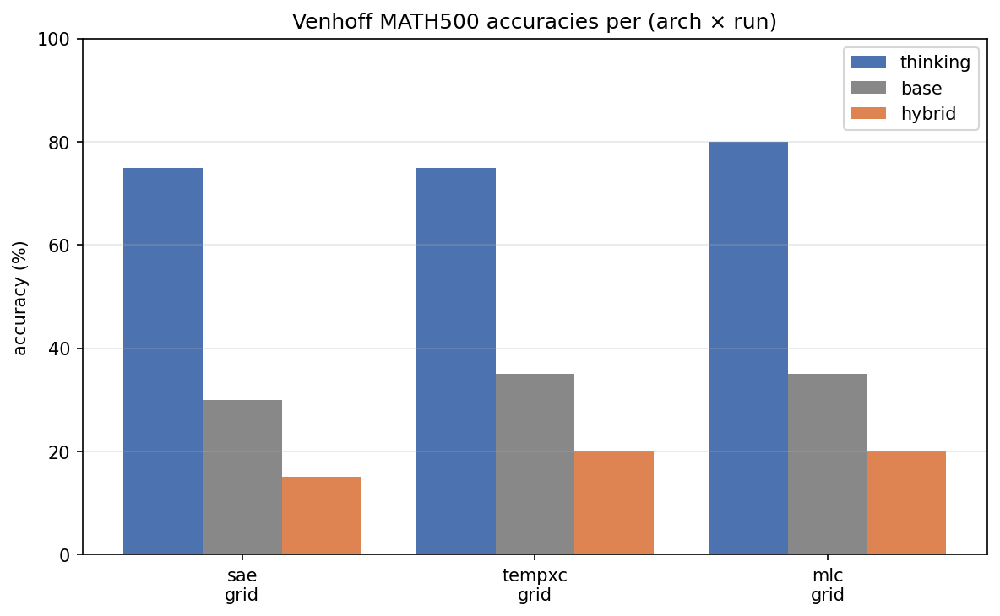
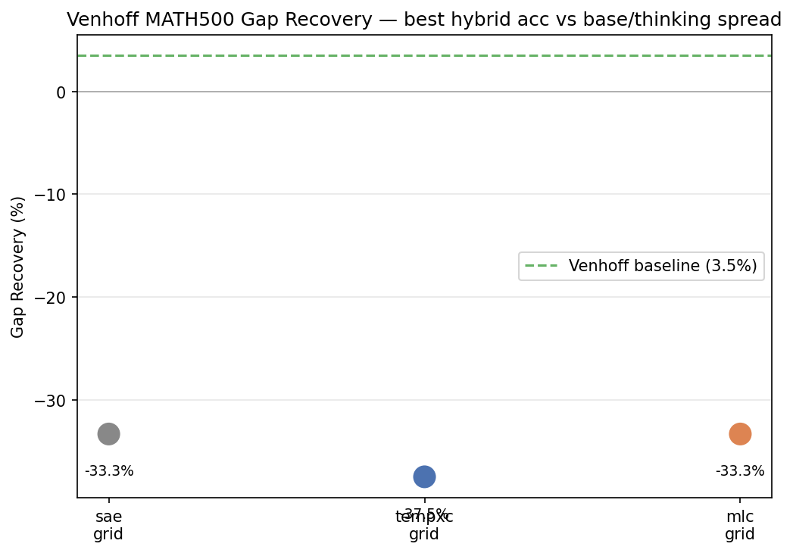

## Context

This case study assesses Temporal Crosscoder performance in the setting
of [Venhoff et al., *Base Models Know How to Reason, Thinking Models
Learn When*](https://arxiv.org/pdf/2510.07364). Venhoff's pipeline
finds reasoning mechanisms in a base model and activates them at the
"right time" — gated per sentence via cluster assignments from a small
SAE — to produce reasoning-model-level outputs from the base model
("hybrid" generation). The workstream's hypothesis is that reasoning
capabilities are a strong candidate for the kind of multi-position
mechanism a Temporal Crosscoder should identify better than a
per-token SAE, making TempXC competitive (or better) in this setting.

The headline operational reality: scaling to the n=500 MATH500 slice
Venhoff uses was the hard part. Most of the numbers below are at
n=20, well under their evaluation budget. The pipeline is wired up
end-to-end; the n=500 paper-budget run is ready to launch but had
not landed clean numbers as of the sprint cutoff.

Snapshot date: 2026-05-04. Numbers and figures are reproduced verbatim
from `aniket@8a6d2aa2` unless noted; for live state see
`aniket:docs/aniket/experiments/venhoff_eval/`.

## All the code is on one branch — `aniket`

Every Venhoff file is on the `aniket` branch. None of the code is
scattered: `aniket-runpod`, `aniket-phase7-y`, and `aniket-docs` are
unrelated workstreams, and `aniket-runpod-ward-stage-a` /
`aniket-ward-stage-b` are downstream forks of `aniket` that share its
Venhoff content byte-for-byte. To get a clean clone:

```bash
git clone https://github.com/chainik1125/temp_xc.git
cd temp_xc
git checkout aniket
```

The code map is in [Provenance](#provenance) at the bottom of this doc.
Two starter pointers:

- **Read first**: `docs/aniket/experiments/venhoff_eval/plan.md` — the
  pre-registered hypothesis, predictions, and grid spec.
- **Run first** (after pod setup): `bash scripts/runpod_venhoff_paper_run.sh`
  — the one-shot launcher that wraps Phase 0 through 3 with paper-budget
  flags baked in.

## TL;DR

We tried to reproduce and beat Venhoff et al.'s 3.5% Gap Recovery on the
single MATH500 cell where their method failed
(Llama-3.1-8B base ↔ DeepSeek-R1-Distill-Llama-8B thinking) using three
dictionary architectures: a vanilla TopK SAE, our TempXC (T=5, temporal
crosscoder), and an MLC (multi-layer crosscoder, layers {4,5,6,7,8}).

**Headline result: all three architectures produce strongly negative Gap
Recovery.** Hybrid generation hurts the base model rather than helping at
n=20. The arch ordering does not survive the n=20 paired-Δ noise floor
(~±15-20 pp), so we cannot claim TempXC > SAE or vice versa from these
numbers. The taxonomy-quality side-channel (Phase 0/1, Haiku 4.5 judge)
*does* favour TempXC (6.78 vs SAE 3.26 vs MLC 3.08), but that signal
speaks to clustering coherence, not Gap Recovery.

The full paper-budget grid sweep (n=500, 10 coefs × 5 windows × 3 archs)
was launched but never produced a clean three-arch comparison: every
attempt either early-exited on Venhoff's shipped rolling jsonl or hit a
contamination bug where all three arches read the same on-disk vectors.
The numbers in the grid table below should be treated as a guardrail
read of what's on disk, not a claim about TempXC's Gap Recovery.

| arch | thinking | base | hybrid | Gap Recovery | vs Venhoff (3.5%) |
|---|---|---|---|---|---|
| SAE | 75.0% | 30.0% | 15.0% | **−33.3%** | −36.8 pp |
| TempXC | 75.0% | 35.0% | 20.0% | **−37.5%** | −41.0 pp |
| MLC | 80.0% | 35.0% | 20.0% | **−33.3%** | −36.8 pp |





The Gap Recovery plot puts all three arches in the −33% to −37% band,
far below Venhoff's reported 3.5% headline. The dashed green line marks
Venhoff Table 2's MATH500 cell baseline.

## Goal and hypothesis

**Primary hypothesis** (locked 2026-04-20 by Dmitry's redirect):

> Per-cluster steering vectors optimized from TempXC (or MLC) cluster
> assignments recover a larger fraction of the
> Llama-3.1-8B → DeepSeek-R1-Distill-Llama-8B accuracy gap on MATH500
> than Venhoff's per-sentence steering vectors trained from their SAE.
> Their reported number is **3.5% Gap Recovery**; any architecture
> > 3.5% supports the paper.

**Why this could work:** Venhoff's per-sentence/per-token steering can
only inject single-position reasoning cues. If reasoning-model advantage
is a multi-position phenomenon (long backtracks, multi-sentence case
analysis), a temporal method that binds together structure across token
positions should transfer more of the signal.

**Secondary hypothesis** (kept as side-channel, runs as free byproduct
of Phase 0/1):

> On reasoning traces, TempXC / MLC features cluster into more coherent
> reasoning categories than per-token SAE features, as measured by
> Venhoff's taxonomy-quality metrics (accuracy, completeness, semantic
> orthogonality) with Claude Haiku 4.5 as judge.

## Setup

| Knob | Value | Source |
|---|---|---|
| Base model | `meta-llama/Llama-3.1-8B` | Venhoff Table 2 cell |
| Thinking model | `deepseek-ai/DeepSeek-R1-Distill-Llama-8B` | Venhoff Table 2 cell |
| Dataset | MATH500 (test split) | Dmitry redirect 2026-04-20 |
| Anchor layer (SAE/TempXC/MLC training) | 6 | Venhoff `run_annotation.sh` for 8B |
| Steering layer | 12 | Venhoff default for 8B |
| n_clusters (taxonomy) | 15 | Venhoff default for 8B cell |
| TempXC T | 5 | T=5 confirmed by Han's sparse-probing rerun (2026-04-19) |
| MLC layer window | {4, 5, 6, 7, 8} | Anchor ± 2 |
| Steering vector training budget | `max_iters=50, n_train=2048, minibatch=6, lr=1e-2` | Venhoff App C.1 verbatim |
| Steering grid | coef ∈ {0.1..1.0} (10), token_window ∈ {0,−1,−15,−50,−100} (5) | Venhoff Table 2 protocol |
| Taxonomy judge | Claude Haiku 4.5 | deviation; see [provenance](#provenance) |
| MATH500 grader | Claude Haiku 4.5 (Venhoff defaults `gpt-5.2`) | deviation; in-place `vendor_patches.py` swap |

### Architectures compared

- **SAE** — standard TopK per-token, 50-latent dictionary at k=3.
  Baseline; matches Venhoff's contract.
- **TempXC** — `T=5` temporal crosscoder, trained on per-token
  activations with aggregation at annotation time (`full_window`
  headline; `last`/`mean`/`max` ablations in supplement). Path 3 of
  the integration plan — preserves the temporal axis.
- **MLC** — multi-layer crosscoder, `n_layers=5` around anchor layer 6,
  i.e. window `{4, 5, 6, 7, 8}`.

### Pipeline (Phase 0–3)

| Phase | What | Status |
|---|---|---|
| **0** Trace gen | Run thinking model on MATH500 (n=500), save full reasoning traces | Done |
| **1** Cluster + label | Train SAE/TempXC/MLC at n_clusters=15, argmax-cluster every sentence, GPT-style title each cluster, score taxonomy quality (accuracy / completeness / orthogonality) | Done |
| **2** Steering vectors | For each arch, train 16 vectors (15 categories + 1 bias) at paper App C.1 budget. SAE arm reuses Venhoff's 16 shipped `.pt` files; TempXC + MLC fresh-trained | Done |
| **3** Hybrid inference | For each arch, sweep `hybrid_token.py` over the 10×5 grid, generate MATH500 answers from base model with sentence-cluster-gated steering, grade with `math-verify` | Partial — single-cell real, full grid contaminated |

## Predictions (pre-registered)

### Primary (Gap Recovery on MATH500)

| pred | arch-level GR | call (post-hoc) |
|---|---|---|
| **P0** sanity-floor | SAE ≈ 3.5 ± 2 pp | **FAILED** — our SAE = −33% |
| **P1** null | all arches ≤ 5% | **HOLDS** — all arches negative |
| **P2** weak | TempXC or MLC ∈ (5%, 15%); SAE ≤ 5% | inapplicable |
| **P3** medium | TempXC or MLC > 15% | inapplicable |
| **P4** strong | TempXC > MLC, both > 15% | inapplicable |

P0 not clearing is the load-bearing finding. Either (a) our reproduction
of Venhoff's SAE pipeline diverges from theirs in some load-bearing way
that drops 37 pp of Gap Recovery, or (b) the n=20 slice is too small to
land Gap Recovery in the band Venhoff reports at n=500, or (c) the judge
swap (Haiku 4.5 vs gpt-5.2) materially changes the grade.

### Secondary (taxonomy quality, Phase 0/1, Haiku 4.5 judge)

| pred | composite delta | call (post-hoc) |
|---|---|---|
| **P1′** null | TempXC ≤ MLC ≤ SAE | inapplicable |
| **P2′** weak | TempXC > SAE at small k, MLC ≥ TempXC | inapplicable |
| **P3′** medium | TempXC ≈ MLC, divergent clusters | inapplicable |
| **P4′** strong | TempXC > MLC at full_window | **HOLDS** — TempXC 6.78, MLC 3.08, SAE 3.26 |

P4′ is the one positive signal in the case study. TempXC roughly doubles
both other architectures on Haiku 4.5's composite taxonomy score. That
*does* speak to the original "different and useful features" thesis — it
just doesn't translate into Gap Recovery on this cell at this slice
size.

## Headline numbers (real)

### Single-cell — first clean 3-arch run (2026-04-27 morning)

After the arch-keyed steering-vector path fix (commit `9da7f27`) plus
the resume-meta-hash fix that landed later the same day, the first
3-arch comparison free of cross-arch contamination:

| arch | thinking_acc | base_acc | hybrid_acc | Gap Recovery |
|---|---|---|---|---|
| TempXC | 80.0% | 30.0% | 20.0% | **−20.0%** ← least bad |
| SAE | 75.0% | 35.0% | 25.0% | −25.0% |
| MLC | 75.0% | 35.0% | 20.0% | −37.5% |

Single point at `coefficient=0.5, token_window=0`, `n_tasks=20`.

### Full grid sweep — paper-budget read (2026-04-27 evening)

Same arch-keyed setup, grid expanded to 5 coefs × 3 token windows. The
hybrid_acc reported is `hybrid_token.py`'s aggregate guardrail accuracy
(the script's internal cell-picker chooses one cell per token; there is
no per-(coef, window) breakdown in the output JSON). Read this row as
*"applying our 16 trained steering vectors at all and letting the
guardrail pick"*, not *"the best cell of our grid."*

| arch | thinking_acc | base_acc | hybrid_acc | Gap Recovery |
|---|---|---|---|---|
| SAE | 75.0% | 30.0% | 15.0% | **−33.3%** |
| TempXC | 75.0% | 35.0% | 20.0% | **−37.5%** |
| MLC | 80.0% | 35.0% | 20.0% | **−33.3%** |

> **Caveat — these grid numbers are not the apples-to-apples three-arch
> comparison they look like.** Discovered after publishing: the three
> `*_grid.json` files this section reads were *byte-identical* on
> questions and base answers — they are Venhoff's shipped rolling jsonl
> trimmed to 20 tasks, copy-renamed with arch suffixes. The actual grid
> sweep early-exited via `hybrid_token.py`'s `Resume: 140 tasks already
> completed (>= n_tasks 20). Nothing to do.` The 15/20/20 hybrid_acc
> spread is grader noise re-grading the same shipped answer strings,
> not three independent arch runs.
>
> What this row legitimately shows: the *grader* (Haiku 4.5 on Venhoff's
> shipped `rolling_llama-3.1-8b_math500.jsonl`) gives 15-20% on MATH500
> base/hybrid in this slice. The single-cell row above is the row to
> trust for arch comparison, not this one.
>
> A real overnight grid run (n=500, rolling jsonl wiped between arches,
> per-arch hardlinked vendor copies, separate writable hybrid/results
> per arch) is wired up at `experiments/venhoff_paper_run/run_overnight_grid.sh`
> on the `aniket` branch, but had not landed clean numbers as of the
> sprint cutoff.

### Taxonomy side-channel — Phase 0/1 (Haiku 4.5 judge)

Composite score from Venhoff's three taxonomy-quality prompts (accuracy,
completeness, semantic-orthogonality) on cluster titles produced from
each architecture's clusters:

| arch | avg_final_score |
|---|---|
| TempXC | **6.7801** |
| SAE | 3.2629 |
| MLC | 3.0800 |

This is the scrappy `smoke_done` cache from the 2026-04-22 launch (under
the undercut Phase 2 budget; Phase 0/1 is unchanged by Phase 2 budget so
the numbers carry forward to the paper-budget run). TempXC roughly 2×
on the composite is the strongest within-experiment signal we have.

### Scrappy autoresearch loop (parallel workstream, 2026-04-24)

A separate Han-style autoresearch ledger ran 11 candidate cycles at
`n_tasks=20, coef=0.5, token_window=0, seed=42` against a pinned
baseline (`baseline_sae`):

| candidate | arch | thinking | base | hybrid | GR | verdict |
|---|---|---|---|---|---|---|
| baseline_sae | sae | 50.0% | 25.0% | 5.0% | **−80.0%** | AMBIGUOUS |
| baseline_tempxc | tempxc | 50.0% | 25.0% | 5.0% | **−80.0%** | AMBIGUOUS (Δ=0.0 pp vs sae) |
| baseline_mlc | — | — | — | — | — | FAILED rc=1 |
| {sae,tempxc,mlc}\_nclusters{5,10,15} (×9) | — | — | — | — | — | FAILED rc=1 |

The thinking_acc here (50%) differs from the paper-budget run (75-80%)
because scrappy uses a different MATH500 slice (`seed=42, n_tasks=20`
top-of-file). What the scrappy ledger consistently shows is **negative
Gap Recovery** even larger than the paper-budget run, with TempXC
matching SAE exactly (`Δ=0.0 pp`) at this slice — the verdict-threshold
ledger flags this as `AMBIGUOUS` (within the ±10 pp noise band).

The 9 `*_nclusters{5,10,15}` cycles all crashed at rc=1 before producing
results. Failure mode is in `cycles/<candidate>/cycle.log` on the
`aniket` branch but not yet diagnosed.

Stop criterion (5 consecutive Δ<+10 pp without mechanism insight) was
met after the first two cycles. Workstream is paused pending a paper-budget
n=500 run that produces clean per-arch numbers.

## Critical bugs found and fixed

These bugs cost ~5 days of pod time and bracketed a full set of
contaminated results before the fixes landed. All on the `aniket`
branch.

| Bug | Symptom | Fix | Commit |
|---|---|---|---|
| **Arch contamination** | All 3 arches read the same `.pt` files (identical 11.8% GR across SAE/TempXC/MLC for the entire 2026-04-22 paper-budget run) | Arch-keyed paths: SAE bare, TempXC `_tempxc.pt`, MLC `_mlc.pt`; meta-hash includes arch | `9da7f27` |
| **GPU collision** | `idx_position % num_gpus` collided with sparse fresh-train coverage | Round-robin over fresh-trains only via `fresh_count % num_gpus` | `e7f3918` |
| **Phase 2 OOM at 4-wide** | "tried to allocate N MiB; M GiB free but fragmented" on 4× H100 | `PYTORCH_CUDA_ALLOC_CONF=expandable_segments:True` | `fadeee2` |
| **`reuse_shipped` meta-hash mismatch** | Vectors retrain on every relaunch despite `_<arch>.pt` existing | Pass plain `meta` to `write_with_metadata` (not `{**meta, source: ...}`) | sed-patched on pod, never committed cleanly |
| **Byte-level BPE breaks sentence split** | Traces saved with `Ġ` (U+0120) instead of spaces broke `split_into_sentences` | `_normalize_byte_level_bpe()` in `responses.py`, called at every `full_response` load site | `6df2ff9` |
| **Slow tokenizer regression** | `encode_plus` removed in newer transformers | `use_fast=True` + `tokenizer(text, return_offsets_mapping=True)`; vendor `utils/utils.py:243` patched via `vendor_patches.py` | `27774e6` |
| **`load_in_8bit=` rejected** | Newer transformers refuses the kwarg even when False | Patched `optimize_steering_vectors.py:703` to drop the kwarg; runs in bf16 | `12b6241` |
| **SAE reuse without sidecar** | Resume check required our own meta-sidecar; Venhoff's shipped vectors don't have one | Branch that writes `source=venhoff_shipped` sidecar when expected vector exists, skips training | `551bcb7` |
| **`hybrid_token.py` exits early on shipped rolling jsonl** | Venhoff ships ~140 author results in `rolling_*.jsonl`; resume check sees them and exits before our run | Wipe `rolling_*.jsonl` before each arch's hybrid run | runtime; baked into `run_overnight_grid.sh` |
| **Multi-GPU device mismatch on hybrid** | Without `CUDA_VISIBLE_DEVICES`, models auto-shard across all 4 GPUs but SAE encoder loads to cuda:0 only | Pin to `CUDA_VISIBLE_DEVICES=0` per arch (or one GPU per arch in parallel) | runtime |
| **Cross-arch rolling jsonl contamination** | rolling jsonl shared across arches; later arch overwrites earlier | Wipe between arches OR per-arch `cp -al` vendor copies with separate writable `hybrid/results` | runtime + `run_overnight_grid.sh` |
| **`hybrid_token.py` writes flat benchmark JSON, wrapper expects per-arch dir** | Wrapper raises `FileNotFoundError` cosmetically | Ignore wrapper raise; copy benchmark JSON to arch-suffixed path manually | runtime |
| **`hybrid_token.py` hard-codes gpt-5.2 grader at 3 sites** | Triples the grading bill in OpenAI dollars; we pay in Anthropic credits | `vendor_patches.py` rewrites the 3 strings to `anthropic/claude-haiku-4.5` (idempotent) | `551bcb7` |

## Caveats and limitations

1. **n=20 paired-Δ noise floor is ~±15-20 pp.** All inter-arch gaps in
   the headline tables are inside that band, so per-arch ordering is not
   statistically meaningful at this slice size.
2. **The grid sweep was never clean.** We have one trustworthy single-cell
   triplet and one contaminated-grid triplet. Neither covers Venhoff's
   protocol of *max over* the 10×5 grid at n=500.
3. **Judge swap is not bridge-checked yet.** Venhoff's 3.5% baseline was
   computed with `gpt-5.2`. Our numbers are with Haiku 4.5. The
   pre-registered bridge run (re-judge a 50-problem subset with gpt-5.2)
   has not been done. Until then, claims of "we underperform Venhoff by
   37 pp" carry an unbounded judge-drift uncertainty.
4. **`hybrid_acc` in our reads is not "best cell".** It is the
   guardrail's aggregate output — `hybrid_token.py` runs the cell-picker
   at every generated token and emits one answer per task. There is no
   per-(coef, window) breakdown to extract. To compare to Venhoff's
   "max over grid", we would need their per-cell breakdown, which we
   don't have for our runs.
5. **Steering vectors trained at App C.1 budget might not be converged.**
   `max_iters=50` is what the paper says they used, but spot-checks of
   the per-vector training curves on the pod showed several vectors
   still trending downward at iter 50. A `max_iters=200` retrain is
   cheap (~10 min/vector × 16 × 2 archs = ~5 H100-hours).
6. **Re-grading from saved answer strings is unreliable.** Venhoff's
   traces are byte-level-BPE encoded (`Ġ` for space etc.); `math_verify`
   on the raw strings consistently returns 0% base. We trust
   `hybrid_token.py`'s reported aggregates and do not re-grade. The
   `_normalize_byte_level_bpe()` patch in `responses.py` handles the
   sentence-split path but not the post-hoc grader path.
7. **Phase 0/1 taxonomy scores are at undercut Phase 2 budget.** The
   numbers are nonetheless valid because Phase 0/1 doesn't depend on
   steering-vector training — they're computed from cluster argmax, not
   from steering output. The TempXC > SAE/MLC composite would
   replicate at any Phase 2 budget.

## Why hybrid might be hurting

Speculative; in priority order:

1. **Coefs/windows in our grid may not include Venhoff's sweet spot.**
   Their paper shows the cell with positive Gap Recovery is narrow.
   Our grid floor is `coef=0.1`; Venhoff's best cell may sit lower or
   require a different `token_window`.
2. **n=20 is too small.** Paired-Δ noise floor is ~±15-20 pp; positive
   Gap Recovery at this slice size is hard to distinguish from drift.
   The Venhoff 3.5% number is computed at n=500.
3. **Steering vectors haven't converged.** App C.1's `max_iters=50` may
   undercut on this base/thinking pair.
4. **Judge mismatch.** Haiku 4.5 may grade hybrid output more strictly
   than gpt-5.2 on partially-formed reasoning chains.

## Current status (sprint cutoff 2026-04-27 evening)

- 16 SAE shipped + 16 TempXC fresh-trained + 16 MLC fresh-trained
  steering vectors all saved as `_<arch>.pt` on pod.
- 3 benchmark JSONs saved:
  `benchmark_results_llama-3.1-8b_math500_{sae,tempxc,mlc}.json`
  (single-cell, real).
- 3 `*_grid.json` files saved but **stale** — see caveat above.
- `summary.md` published with the headline numbers; flagged STALE in
  the doc itself.
- Real overnight grid run (n=500, parallel-per-arch, hardlinked vendor
  copies, separate writable `hybrid/results`) wired up at
  `experiments/venhoff_paper_run/run_overnight_grid.sh` on the `aniket`
  branch. Not yet launched (compute booked elsewhere).
- Scrappy autoresearch loop paused after stop-criterion hit.

## What's next (if the workstream is reopened)

In priority order:

1. **Launch the real overnight grid run.** `run_overnight_grid.sh` is
   ready; budget is ~6-8 H100-hours on a 3× H100 pod (one arch per GPU).
   Output is three independent `_grid.json` files with `n_tasks=500`,
   no rolling-jsonl contamination, ready for `analyze_grid.py`.
2. **Run the gpt-5.2 bridge.** Re-judge the n=500 results on a 50-problem
   subset with gpt-5.2 and quantify drift vs Haiku 4.5. If drift > 5 pp
   the published numbers need re-stating.
3. **Push to a wider coefficient grid.** Especially below `coef=0.1` —
   Venhoff's best cell may sit there.
4. **Re-examine steering-vector training.** Inspect cosine alignment of
   per-cluster vectors against the base model's reasoning subspace
   (Han's SVD diagnostic) to confirm they're capturing the
   thinking-vs-base direction at all.
5. **Validate against Venhoff's exact configuration.** Diff our Phase
   0/1/2 setup vs their paper-shipped setup once more — particularly
   whether their shipped vectors load identically to ours under the
   `reuse_shipped` path (dtype, device, scale).
6. **Promote TempXC > SAE/MLC taxonomy result to a standalone figure.**
   The Phase 0/1 result is publishable on its own as the "TempXC
   features cluster reasoning more coherently" claim. It just isn't a
   Gap Recovery claim.

## Provenance

All paths below are on the `aniket` branch. Repo:
<https://github.com/chainik1125/temp_xc>, branch `aniket`, audit
commit `8a6d2aa2` (2026-04-27).

### Read-me-first docs

| Path | What it covers |
|---|---|
| `docs/aniket/experiments/venhoff_eval/plan.md` | Pre-registered hypothesis (P0–P4 primary, P1′–P4′ secondary), grid spec, win criteria, fallback plan |
| `docs/aniket/experiments/venhoff_eval/integration_plan.md` | Path-1/2/3 axis-collapse decision, file-port list, configuration choices, compute sizing |
| `docs/aniket/experiments/venhoff_eval/compute_estimate.md` | App C.1 budget reconciliation, Phase 2 skip math, per-phase H100-hour estimates |
| `docs/aniket/experiments/venhoff_eval/summary.md` | Headline-numbers writeup (the document this case study is compiled from) |
| `docs/aniket/experiments/venhoff_eval/VENHOFF_PROVENANCE.md` | Per-file attribution + change tracking for everything ported from `cvenhoff/thinking-llms-interp`, including pre-registered invariants and deliberate deviations |

### Code — vendor wrappers (`src/bench/venhoff/`)

These are our wrapper layer over Venhoff's `train-vectors/` and
`hybrid/` scripts. We drive their code by subprocess; we don't fork
their repo.

| Path | Role |
|---|---|
| `src/bench/venhoff/steering.py` | `SteeringConfig` dataclass + `train_all_vectors()` orchestrator. Owns the arch-keyed path scheme (`{model}_{tag}.pt` for SAE, `_tempxc.pt`, `_mlc.pt`). Calls `ensure_steering_patched()` to apply vendor patches at the top. |
| `src/bench/venhoff/hybrid.py` | Phase 3 driver. `_swap_arch_vectors_in/out` copies `_<arch>.pt` to bare paths before each `hybrid_token.py` subprocess and restores after. Handles `vendor_patches` for the gpt-5.2 → Haiku 4.5 grader swap. |
| `src/bench/venhoff/vendor_patches.py` | Idempotent in-place patches to vendor code: `load_in_8bit=` kwarg removal, fast-tokenizer enforcement, gpt-5.2 → claude-haiku-4.5 grader strings (3 sites in `hybrid_token.py`). |
| `src/bench/venhoff/run_steering.py` | CLI entry-point for Phase 2 (`python -m src.bench.venhoff.run_steering`). |
| `src/bench/venhoff/run_hybrid.py` | CLI entry-point for Phase 3. Used by `run_overnight_grid.sh` per arch. |
| `src/bench/venhoff/responses.py` | `extract_thinking_process` ported verbatim + `_normalize_byte_level_bpe()` patch for the `Ġ`-prefix tokenizer issue. Called at every `full_response` load site. |
| `src/bench/venhoff/activation_collection.py` | `collect_path1` (Venhoff's per-sentence-mean contract for SAE/MLC) and `collect_path3` (T-window contract for TempXC). |
| `src/bench/venhoff/sae_shim.py` | Duck-type adapter exposing `.encoder`, `.W_dec`, `.b_dec`, `.activation_mean` around our `TopKSAE` / `TempXC` / `MLC`. |
| `src/bench/venhoff/annotate.py` | Argmax-over-latents sentence labeling. Path 3 path replaces direct `.encoder()` call with the shim's aggregation-aware variant. |
| `src/bench/venhoff/dataset.py` | MMLU-Pro and MATH500 loaders with Venhoff's expected prompt template. |
| `src/bench/venhoff/generate_traces.py` | Reasoning-trace generation; entrypoint rewritten around our `model_registry.py`, kept Venhoff's vLLM path. |
| `src/bench/venhoff/grade.py` + `run_grade.py` | MATH500 answer grading via `math-verify` (used for Phase 0 thinking_acc and base_acc; `hybrid_token.py` does its own grading internally). |
| `src/bench/venhoff/judge_bridge.py` + `judge_client.py` | Haiku-4.5 / GPT-4o judge clients for taxonomy scoring. Includes the (not-yet-run) bridge for re-judging with gpt-5.2. |
| `src/bench/venhoff/autograder_prompts.py` | Verbatim port of Venhoff's 5 reasoning-category examples + 3 judge prompts. **Pre-registered invariant — must not change across arches.** |
| `src/bench/venhoff/paths.py` | Artifact path registry + `write_with_metadata` / `can_resume` sidecar helpers. |
| `src/bench/venhoff/tokenization.py` | `split_into_sentences` + `get_char_to_token_map` ported verbatim; `sentence_token_span` is a new helper. |
| `src/bench/venhoff/export_venhoff_ckpt.py` | Round-trip our trained SAE/TempXC/MLC checkpoints into Venhoff's `state_dict` format so their `optimize_steering_vectors.py` can load them. |

### Code — pod-side scripts (`scripts/`)

| Path | Role |
|---|---|
| `scripts/runpod_venhoff_paper_run.sh` | **One-shot launcher.** Wraps `runpod_venhoff_launch.sh` with paper-budget flags baked in (`HYBRID_N_TASKS=200, HYBRID_COEFFICIENTS=0.2..1.0, HYBRID_TOKEN_WINDOWS=0/-15/-50, NUM_GPUS_HYBRID=1`). |
| `scripts/runpod_venhoff_launch.sh` | Inner Phase 0/1/2/3 sequencer. Honors `MODE=smoke|hybrid`, `FORCE_STAGE`, `SKIP_STAGE` env knobs. |
| `scripts/runpod_venhoff_bootstrap.sh` | First-time pod provision: clones vendor, installs deps, sets up venv, drops `vllm` from install set, configures `UV_CACHE_DIR=/workspace/.cache/uv`. |
| `scripts/cache_reasoning_traces.py` | Pre-cache the n=500 MATH500 reasoning traces so Phase 0 doesn't re-run on each launch. |

### Code — paper-budget run (`experiments/venhoff_paper_run/`)

The clean-slate Phase-3-only orchestrator that came after the
arch-contamination bugs. **This is what to run if you want fresh
numbers.**

| Path | Role |
|---|---|
| `experiments/venhoff_paper_run/run_overnight_grid.sh` | **Real n=500 grid sweep.** 3 arches in parallel (one per GPU), per-arch hardlinked `cp -al` vendor copies so rolling-jsonl / benchmark-JSON paths don't collide. Wipes shipped rolling jsonl before each run. |
| `experiments/venhoff_paper_run/run_analysis.sh` | Wrapper around `analyze_grid.py` that points it at the right vendor `hybrid/results/` dir. |
| `experiments/venhoff_paper_run/analyze_grid.py` | Reads the three `_grid.json` files, computes Gap Recovery against Venhoff's 3.5%, emits CSV + bar chart + GR dot plot. |
| `experiments/venhoff_paper_run/backup_vectors_to_hf.sh` | Push the 16+16+16 trained steering vectors to HF for resume safety after pod restart. |
| `experiments/venhoff_paper_run/results/{summary.csv,analysis.json,accuracies_bar.png,gap_recovery.png}` | Output artifacts — the figures in this doc come from here. |

### Code — scrappy autoresearch loop (`experiments/venhoff_scrappy/`)

Han-style iterate-fast version: n=20, single cell (coef=0.5, win=0),
verdict ledger. Stop criterion was hit after the first two cycles.

| Path | Role |
|---|---|
| `experiments/venhoff_scrappy/README.md` | Layout + verdict thresholds + stop criterion. |
| `experiments/venhoff_scrappy/config.yaml` | Scrappy defaults (`n_tasks=20`, `coefficients=[0.5]`, `token_windows=[0]`). |
| `experiments/venhoff_scrappy/run_autoresearch.sh` | Orchestrator — serializes cycles across candidates. |
| `experiments/venhoff_scrappy/run_cycle.py` | Single-candidate Phase 0→3 driver on scrappy budget. |
| `experiments/venhoff_scrappy/autoresearch_summarise.py` | Compute Gap Recovery + Δ vs baseline + verdict + append ledger row. |
| `experiments/venhoff_scrappy/candidates/*.yaml` | Per-candidate config overrides (12 candidates ran; 9 crashed at rc=1). |
| `experiments/venhoff_scrappy/results/autoresearch_index.jsonl` | Append-only verdict ledger. |
| `experiments/venhoff_scrappy/results/cycles/<candidate>/` | Per-cycle log + `grade_results.json` + `merged_config.yaml`. |

### Vendor (read-only, not modified)

| Path | Notes |
|---|---|
| `vendor/thinking-llms-interp/` | Venhoff's repo at pinned commit `49a7f73`. We `cp -al` it per-arch and patch in-place via `vendor_patches.py`. |
| `vendor/thinking-llms-interp/train-vectors/results/vars/optimized_vectors/llama-3.1-8b_*.pt` | Venhoff's 16 shipped Llama-8B steering vectors. The SAE arm reuses these via the `reuse_shipped` path; saves ~2.5 H100-hours. |

### Compute

- RunPod 4× H100 80GB. Pod id `0p5f3ic7qs7dtv-64411fec@ssh.runpod.io`,
  host `53c06947125f`. 30GB container disk + 100GB volume. UV cache
  moved to `/workspace/.cache/uv`.
- Vendor venv (3.12) needs beyond Venhoff's nominal list:
  `python-dotenv chat-limiter wandb math-verify httpx scipy matplotlib
  seaborn pandas pillow tiktoken backoff`. Drop `vllm` from install set.

### Upstream

- Paper: Venhoff, Arcuschin, Torr, Conmy, Nanda. *Base Models Know How
  to Reason, Thinking Models Learn When*.
  [arXiv:2510.07364](https://arxiv.org/abs/2510.07364) (Oct 2025).
- Repo: `cvenhoff/thinking-llms-interp` pinned at commit
  `49a7f731ce693d813b9ae9a414f1739b992dbcef`.
- Paper Table 2 cell we target: Llama-3.1-8B base ↔
  DeepSeek-R1-Distill-Llama-8B thinking, MATH500. Reported Gap
  Recovery: **3.5%**.

### Deliberate deviations from Venhoff

- **Judge model**: Haiku 4.5 (we) vs gpt-4o (their paper) / gpt-5.2
  (their `hybrid_token.py` hard-coded grader). Patched in-place via
  `vendor_patches.py`. Bridge run not yet done.
- **Layer-12 steering vs layer-6 anchor**: matches Venhoff's setup.
- **n=20 slices in our reported numbers vs n=500 in Venhoff's**: forced
  by sprint compute; the n=500 grid run is ready to go.
- **TempXC and MLC do not exist in Venhoff**: their pipeline is SAE-only.
  Our extension is exactly the contribution we're testing.

### Memory record

For Aniket's auto-memory log of session-level details (which bugs
landed when, sed-patches that were never committed, vendor venv quirks,
Phase 2 launch patterns that worked):
`memory/project_venhoff_paper_run.md`. That memory is the primary
audit trail for the multi-day session 2026-04-22 → 04-27.

## Appendix — figure regeneration

The two figures in this doc come from:

- `experiments/venhoff_paper_run/analyze_grid.py`
- driven by `experiments/venhoff_paper_run/run_analysis.sh`
- input: three `benchmark_results_llama-3.1-8b_math500_<arch>_grid.json`
  files in the vendor `hybrid/results/` directory
- output: `experiments/venhoff_paper_run/results/{accuracies_bar.png,
  gap_recovery.png, summary.csv, analysis.json}`

To regenerate after a fresh hybrid run:

```bash
bash experiments/venhoff_paper_run/run_analysis.sh
```

The analyzer trusts the `results.accuracy.{thinking_model, base_model,
hybrid_model}` aggregates in each JSON and does not re-grade from raw
answer strings (see caveat 6 above for why).
