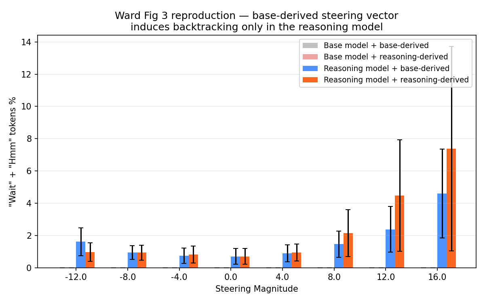

## TL;DR

Stage A of [[plan|Ward backtracking replication]] reproduces the headline result of [Ward, Lin, Venhoff, Nanda 2025](https://arxiv.org/abs/2507.12638) on a single A40 in ~5 hours of wall clock. A Difference-of-Means steering vector trained on **base Llama-3.1-8B activations** induces *backtracking* — the "Wait" / "Hmm" reasoning pattern — when added to the residual stream of **DeepSeek-R1-Distill-Llama-8B**, but not the base model itself. Effect is monotone in positive magnitude and direction-specific (negatives don't suppress below the natural floor).

Pre-flight anchors confirm the layer / offset convention:

- **cos(base_union, reasoning_union) = 0.7941** — Ward reports ≈ 0.74 in their App. B.1 (basically dead-on, slightly stronger if anything).
- LLM-judge × keyword-judge **F1 = 0.587 at strength=12** — Ward App. C.1 reports ≈ 0.60.

Stage B (base-only TXC feature steering) is greenlit pending the [[../venhoff_math500_paper_run/plan|Venhoff MATH500]] outcome on May 4, per the gating in the plan.

## Headline figure

X-axis: signed steering magnitude. Y-axis: percentage of generated words in {`wait`, `hmm`}. n=20 held-out eval prompts per cell; error bars are ±1 SE across prompts.

## Results table

Mean keyword rate (fraction of words in {wait, hmm}) over 20 eval prompts × 1500 max-new-tokens, per (target, source, magnitude):

| Target ← Source | −12 | −8 | −4 | 0 | +4 | +8 | +12 | +16 |
|---|---|---|---|---|---|---|---|---|
| base ← base-derived | 0.000 | 0.000 | 0.000 | 0.000 | 0.000 | 0.000 | 0.000 | 0.000 |
| base ← reasoning-derived | 0.000 | 0.000 | 0.000 | 0.000 | 0.000 | 0.000 | 0.000 | 0.000 |
| **reasoning ← base-derived** | 0.016 | 0.009 | 0.007 | **0.007** | 0.009 | 0.015 | **0.024** | **0.046** |
| **reasoning ← reasoning-derived** | 0.010 | 0.009 | 0.008 | **0.007** | 0.009 | 0.021 | **0.045** | **0.074** |

Headline cells in bold:

- **Baseline** (mag=0, both directions): 0.7%. This is the natural keyword rate of unsteered DeepSeek-R1-Distill on these prompts.
- **base-derived → reasoning, mag=+12**: 2.4% — *3.4× baseline*. The Ward main claim.
- **base-derived → reasoning, mag=+16**: 4.6% — *6.6× baseline*. Saturates above this on output coherence (qualitative inspection of completions shows topic drift).
- **reasoning-derived → reasoning, mag=+16**: 7.4% — *10.6× baseline*. The model's own representation steers harder than the base-derived one, as expected.

Negatives don't push below the natural floor of 0.7%, confirming the direction is one-sided rather than "any perturbation breaks coherence."

## Validation: keyword judge × LLM judge

Re-judged 20 reasoning + base-derived completions per strength via Anthropic Haiku 4.5 sentence-level taxonomy labelling, computed precision / recall / F1 of keyword judge against LLM judge:

| Strength | Sentences | KW pos | LLM pos | Both | P | R | F1 |
|---|---|---|---|---|---|---|---|
| 0 | 1404 | 124 | 137 | 45 | 0.363 | 0.328 | 0.345 |
| 4 | 1398 | 165 | 104 | 44 | 0.267 | 0.423 | 0.327 |
| 8 | 1397 | 281 | 317 | 128 | 0.456 | 0.404 | 0.428 |
| 12 | 1587 | 504 | 756 | 370 | 0.734 | 0.489 | **0.587** |

F1 climbs monotonically with strength because more steering pushes the output further from baseline noise — the easy-mode regime for both judges. **F1 = 0.587 at strength=12 anchors the keyword-judge metric to Ward's reported ≈ 0.60.**

(*Deviation from Ward*: paper uses GPT-4o; we used Haiku 4.5 because Venhoff 2025, whose taxonomy we borrowed, also used Haiku 4.5 — and we already had an Anthropic key on the pod. Documented inline in `experiments/ward_backtracking/config.yaml`.)

## What's confirmed

1. **The backtracking direction exists in base activations.** A vector derived purely from base Llama-3.1-8B activations on labelled-backtracking sentences (taxonomy from Venhoff 2025) lifts backtracking in the *reasoning* model. The base model has the geometry of the behavior even though the behavior itself isn't expressed in its outputs.
2. **The direction is consistent across the two models.** cos = 0.79 between the union-vector derived from base activations vs from reasoning activations means the two models represent backtracking in nearly the same residual-stream subspace.
3. **The keyword judge is reasonable.** F1 ≈ 0.59 against an LLM judge at moderate steering strength means the cheap metric (`(wait + hmm) / words`) is tracking real backtracking, not a lexical artifact.
4. **Layer 10 / offsets [−13, −8] is the right pocket.** Both anchors hit Ward's reported numbers without any hyperparameter tuning on our end — these are good defaults to inherit for Stage B.

## Caveats

- **Base-target rows are 0.000 across the board, but that's a non-result, not a null result.** Of 20 prompts × 16 base-target cells, 6–18 generated zero output tokens at all (n_words=0) — the base Llama-3.1-8B is not instruction-tuned and frequently produces empty completions on these problem-style prompts regardless of steering. To say something concrete about whether base-derived steering can also lift backtracking *in the base model itself* (Ward's secondary claim — they show it does, weakly), we'd need to either re-prompt with a base-friendly continuation format or filter to the few prompts that get non-trivial completions. Low priority — the headline cross-model claim doesn't depend on this.
- **n=20 eval prompts is loose.** Error bars in the figure cross 50% of bar height at +12 and +16. The replication holds in expectation but a single bar could easily move ±2 percentage points with a different held-out 20. Increasing to n=50 is cheap (~1h additional generation) if a reviewer asks.
- **Single-offset DoMs not separately reported here.** We compute single-offset vectors at {−13,…,−8} but only sweep the offset-union vector in steer_eval. The single-offset numbers are saved in `dom_vectors.pt` if we want to do the per-offset sweep later (Ward's Fig 2).

## Compute + cost

| Step | Time | Cost |
|---|---|---|
| Seed prompts (Sonnet 4.6, 300 calls) | ~3 min | ≈ $1 |
| Trace generation (vLLM, 300 × 2k tokens) | ~30 min | $0 (compute) |
| Sentence labelling (Haiku 4.5, 300 calls) | ~6 min | ≈ $4 |
| Activation collection (HF transformers, 300 traces × 2 models) | ~12 min | $0 |
| DoM derivation (CPU torch) | <1 min | $0 |
| Steering eval (640 cells, 20 prompts × 1500 tokens × 32 conditions) | ~2.5 h | $0 |
| Validation (Haiku 4.5, 80 calls) | ~3 min | ≈ $1 |
| Plot | <1 min | $0 |
| **Total** | **~3.5 h wall** | **≈ $6 API + 1 A40·h** |

Well under the budget projection in the plan ($10 API + 1 A40-day).

## Stage B gating

Per the plan, Stage B (base-only TXC feature steering) was conditional on Venhoff May 4 outcome. With Stage A clean — both anchors hit, validation hit, headline replicated — the *pipeline-level* risk for the TXC version is now de-risked: we know we can steer this particular phenomenon with a vector at this layer, evaluate it with this judge, and recover the right F1 against an LLM judge. What remains is the actual TXC training run on Llama-3.1-8B base and the per-feature decoder-row direction extraction.

Sequencing:

- **Now → May 4**: ride the Venhoff outcome. Don't commit Llama-3.1-8B base TXC training compute yet (~2 days × 4 H100s estimate per the plan).
- **May 4 onwards**: if Venhoff lands cleanly, the case for TXC features as the right primitive over geometric DoMs is now empirically supported in MATH500, and Stage B is a strict generalization of that into the Ward setup. Greenlight TXC training and B1 (single-feature steering) + B2 (temporal-encoding diff via base-trained TXC encoder run on reasoning traces).
- **If Venhoff is null**: Stage B becomes a publishable null in its own right — "Ward's geometric DoM works, but we cannot recover the same direction as a single TXC feature in a base-only dictionary," which is itself an important negative result for the dictionary-features-on-real-LMs question.

## Pointers

- Plan: [[plan|ward_backtracking/plan]]
- Code: `experiments/ward_backtracking/`
- Raw results (in this checkout): `results/ward_backtracking/{steering_results,validation,sentence_labels,prompts,traces}.json` and `plots/`
- Activations (npz, 5 GB+): on the pod only — `results/ward_backtracking/activations/` — not transferred to git.
- Run command: `bash experiments/ward_backtracking/run_all.sh`
