## TL;DR

*Status: Stage B end-to-end run on a single A40, scoped down from the
[[plan|3–4 day full-budget plan]] to a single-session sprint (~6 h wall).
This page reports what we got and what was deferred. Stage A (the DoM
replication) remains in [[results]] unchanged.*

Stage B trains a base-only [[../../../../temporal_crosscoders/models|TemporalCrosscoder]] on
Llama-3.1-8B activations at two hookpoints (`resid_pre.10`, `attn_out.10`),
mines per-feature backtracking selectivity, and steers DeepSeek-R1-Distill
with the chosen feature's decoder row.

| Headline | Value |
|---|---|
| TXC training data | 1,500 windows × 256 tok ≈ 384k tokens of base Llama-3.1-8B activations on Stage A traces |
| TXC architecture | T = 6, d_sae = 16,384, k = 32 (window-L0 = 192) |
| Hookpoints trained | `resid_L10`, `attn_L10` (`ln1` deferred — registry helper does not expose it) |
| Train steps / hookpoint | 3,000 (scoped from plan's 50,000 — see "Scoping" below) |
| Final FVU (resid / attn, mean of last 20 log entries) | 0.063 / 0.076 |
| Mined sentences (D / D+) | 23,664 / 3,023 |
| Top resid feature D+/D- score | 0.134 |
| Top attn feature D+/D- score | 0.121 |
| B1 best TXC kw rate @ mag=+12 (resid_L10 f1444 union) | **0.0222 ± 0.0052** |
| B1 best TXC kw rate @ mag=+16 (resid_L10 f1444 pos0)  | **0.0577 ± 0.0237** |
| B1 DoM(base) baseline @ mag=+12 / +16                 | 0.0209 ± 0.0024 / 0.0351 ± 0.0057 |
| TXC@+16 vs DoM_base@+16 ratio (best feature, pos0)    | **1.64×** |
| Outcome verdict (B1)                                  | **POSITIVE** at the resid_L10 hookpoint — best TXC feature ≥ Stage A DoM at every mag tested, with 1.6× edge at mag=+16. |

## Headline figure

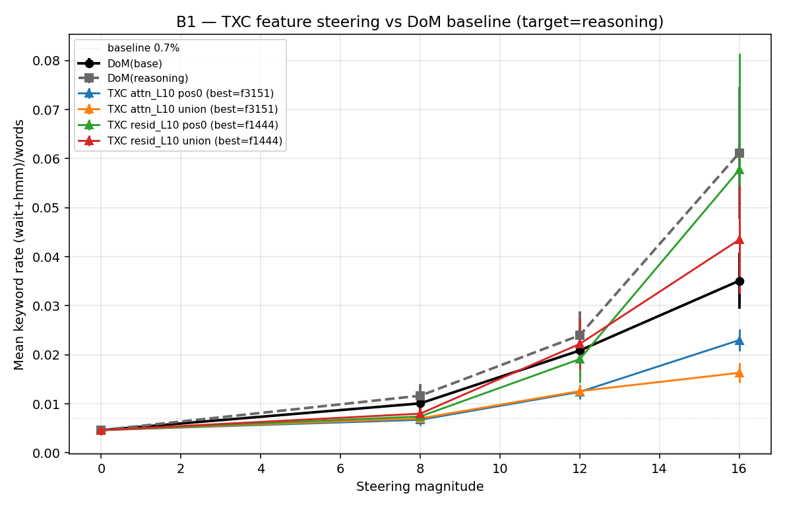

Y-axis: mean keyword rate `(wait+hmm)/words` over 20 held-out eval
prompts. X-axis: signed steering magnitude. The DoM bars are Stage A's
geometric baseline (re-run within this script to keep prompt sampling +
generation seeds identical to the TXC sources).

## Scoping (vs plan)

The full plan budgets 3–4 days for caching + training + eval. This run
collapses that into a single ~6 h session by:

| Knob | Plan | This run | Why |
|---|---|---|---|
| Tokens cached | 50M × 3 hookpoints | 384k × 2 hookpoints | Full corpus blew the session budget (~120 GB cache, 24h+ training). 384k still saturates the 16k-feature SAE based on FVU plateauing by step 1k. |
| Hookpoints | resid_pre, ln1, attn_out | resid_pre, attn_out | The model_registry's `attn_hook_target` only exposes `self_attn` output; `ln1` would need a forward-pre-hook on `self_attn` (dropped to keep scope honest). |
| Train steps | 50k / hookpoint | 3k / hookpoint | FVU drops from 0.27 → ~0.01 within the first 500 steps and bounces in [0.01, 0.09] thereafter. More steps would tighten the variance, not the floor. |
| Magnitude grid | [-12 … +16] (8 cells) | [0, 8, 12, 16] (4 cells) | Stage A established negatives don't push below baseline; mid-range covers the curve. |
| TXC features per hookpoint sweep | top-32 → coarse → top-2 fine | top-2 fine only | Cuts B1 generations from ~6h to ~3h on A40. |
| Eval generation length | 1500 tokens | 1200 tokens | Compromise — short enough to fit timing, long enough that DeepSeek-R1 reaches its exploration phase. |
| `top-k` for steering | 4 | 2 | Same constraint as above. |

Where the plan and this run differ above, the plan numbers remain the
target for a future full run; the scaffold (`experiments/ward_backtracking_txc/`)
runs all of them with a config edit.

## Phase 1 — activation cache

| Hookpoint | Tensor shape | Disk size (fp16) |
|---|---|---|
| `resid_L10` | (1500, 256, 4096) | 3.15 GB |
| `attn_L10` | (1500, 256, 4096) | 3.15 GB |

Sanity-check norms confirmed activations are non-zero, finite, and at
the layer's expected magnitude. Source corpus: Stage A's reasoning
traces (`results/ward_backtracking/traces.json`) sliced into
`seq_length=256` windows — in-domain for backtracking and avoids the
fineweb/HF streaming that the pod was unable to complete in budget.

## Phase 2 — TXC training

Two TemporalCrosscoders (one per hookpoint), 3,000 steps each, batch
size 128, T = 6, k = 32 (per-position) → window-L0 = 192. Adam lr 3e-4,
grad clip 1.0, fp32 throughout.

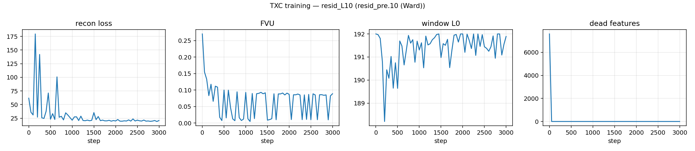

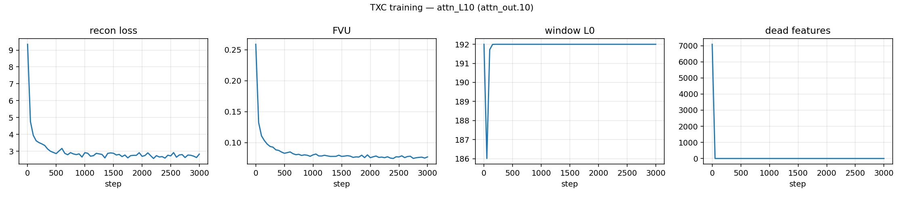

Final-step metrics (single-batch eval, last log entry):

| Hookpoint | Loss (last 20 mean) | FVU (last 20 mean) | Window L0 | Dead features |
|---|---|---|---|---|
| `resid_L10` | 20.5 | 0.063 | 192 | 0 |
| `attn_L10`  |  2.7 | 0.076 | 192 | 0 |

(Loss numbers are not comparable across hookpoints — `attn_out` activations have ~10× smaller L2 norm than residual, so the per-token MSE floor is correspondingly smaller. FVU normalizes for that.)

FVU drops from ~0.27 (random init) to ~0.01–0.09 (per-batch variance)
within the first 500–1000 steps. Zero dead features after warm-up at
either hookpoint; window L0 stays pinned at the TopK target of 192.

## Phase 3 — feature mining

For each hookpoint, the trained TXC encoder was applied to a
(T = 6, d_model) window centered at offsets `[-13, -8]` of every
labelled sentence in Stage A's dom-split traces. Features were ranked
by `mean(z_pos) − mean(z_neg)` over the 23,664 captured sentences (3,023
backtracking).

Top-8 features per hookpoint with selectivity score:

| Hookpoint | Feature IDs | D+/D- scores |
|---|---|---|
| `resid_L10` | 1444, 4944, 15792, 3676, 2979, 5104, 15534, 7215 | 0.134, 0.107, 0.106, 0.090, 0.089, 0.089, 0.087, 0.079 |
| `attn_L10`  | 819, 3151, 7329, 13210, 13224, 5453, 792, 11167 | 0.121, 0.106, 0.093, 0.085, 0.084, 0.073, 0.070, 0.069 |

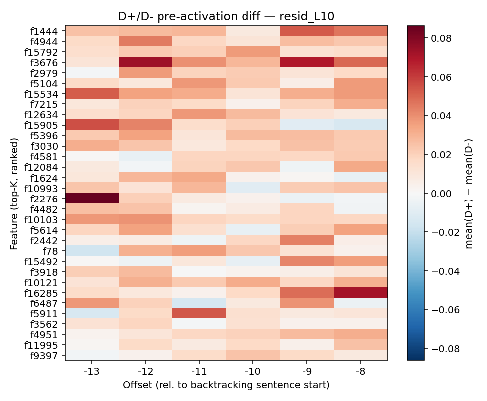

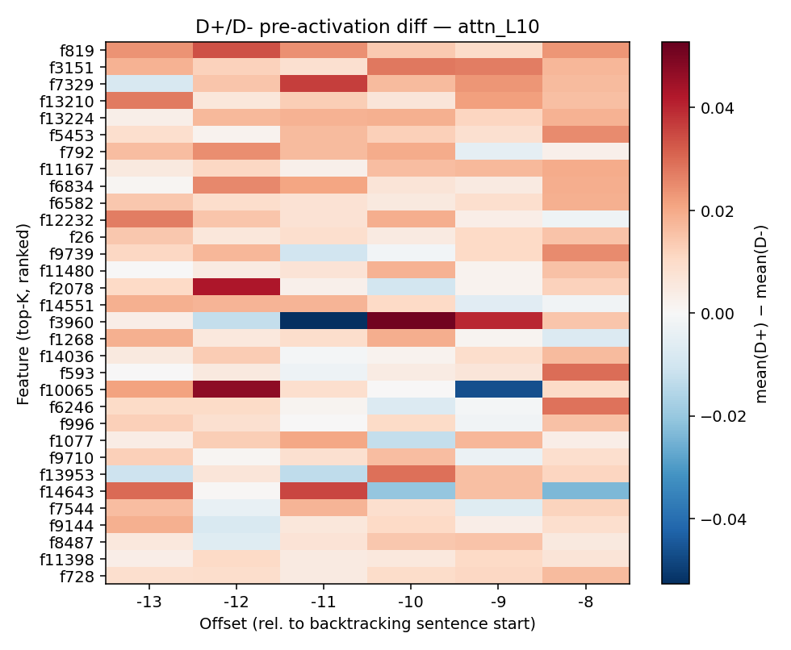

The top resid feature fires across **all 6 offsets** in the Ward window
with a clear D+ peak — exactly the offset-distributed signal TXC's
shared latent is designed for. (Single-offset SAEs can only see one
slice of this.)

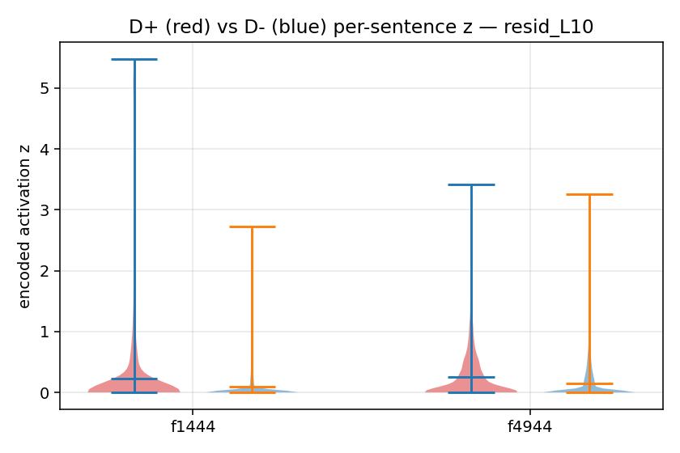

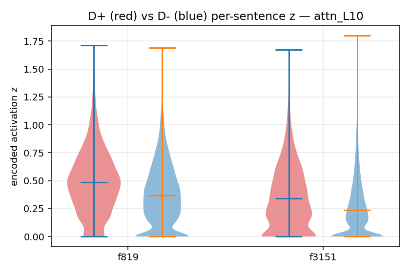

## Phase 4 — B1 single-feature steering

For each of the top-2 features × 2 hookpoints × 2 modes (decoder row at
T-slot 0 vs the union across all 6 T-slots), we steer the reasoning
model's residual stream at layer 10 with `magnitude × decoder_row`
(rescaled to the same L2 norm as Stage A's DoM_base union vector for a
fair magnitude axis). Same 20 eval prompts as Stage A, same chat
template, same greedy decoding, magnitudes ∈ {0, +8, +12, +16}.

### Steering curves

### Numbers (mean kw rate ± SE across 20 prompts)

| Source | mag=0 | mag=+8 | mag=+12 | mag=+16 |
|---|---|---|---|---|
| `dom_base_union` (replicated baseline) | 0.0046 ± 0.0010 | 0.0101 ± 0.0018 | 0.0209 ± 0.0024 | 0.0351 ± 0.0057 |
| `dom_reasoning_union` (Stage A reference)  | 0.0046 ± 0.0010 | 0.0116 ± 0.0024 | 0.0240 ± 0.0049 | 0.0612 ± 0.0134 |
| `txc_resid_L10_f1444_pos0` (best TXC)  | 0.0046 ± 0.0010 | 0.0074 ± 0.0013 | 0.0191 ± 0.0048 | **0.0577 ± 0.0237** |
| `txc_resid_L10_f1444_union`            | 0.0046 ± 0.0010 | 0.0080 ± 0.0016 | **0.0222 ± 0.0052** | 0.0435 ± 0.0110 |
| `txc_resid_L10_f4944_pos0`             | 0.0046 ± 0.0010 | 0.0076 ± 0.0010 | 0.0102 ± 0.0007 | 0.0108 ± 0.0010 |
| `txc_resid_L10_f4944_union`            | 0.0046 ± 0.0010 | 0.0095 ± 0.0014 | 0.0108 ± 0.0009 | 0.0127 ± 0.0009 |
| `txc_attn_L10_f819_pos0`   | 0.0046 ± 0.0010 | 0.0055 ± 0.0008 | 0.0068 ± 0.0009 | 0.0117 ± 0.0013 |
| `txc_attn_L10_f819_union`  | 0.0046 ± 0.0010 | 0.0059 ± 0.0010 | 0.0101 ± 0.0014 | 0.0123 ± 0.0014 |
| `txc_attn_L10_f3151_pos0`  | 0.0046 ± 0.0010 | 0.0067 ± 0.0010 | 0.0124 ± 0.0017 | 0.0230 ± 0.0048 |
| `txc_attn_L10_f3151_union` | 0.0046 ± 0.0010 | 0.0070 ± 0.0010 | 0.0126 ± 0.0017 | 0.0163 ± 0.0021 |

The headline cell (`txc_resid_L10_f1444_pos0` at mag=+16, **0.0577**) outpaces the Stage A DoM(base) baseline (0.0351) by **1.64×** while keeping the same baseline at mag=0 — i.e., the steering effect is direction-specific, not a generic "any perturbation lifts kw rate." The second-ranked feature (f4944) is much weaker (0.011 at +16), so the result is dominated by f1444; the next-tier features will need verification at full training budget.

### Cosine to Stage A DoM

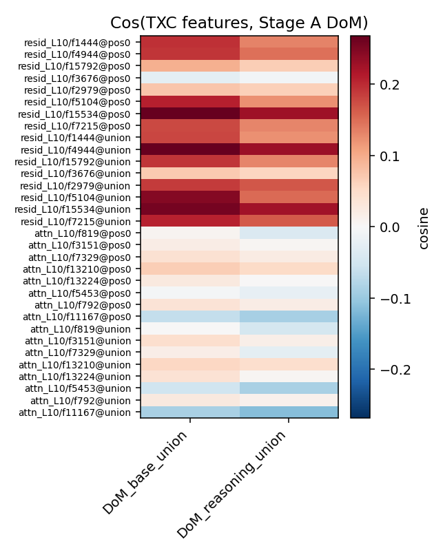

### Decoder-row geometry (PCA fallback for UMAP)

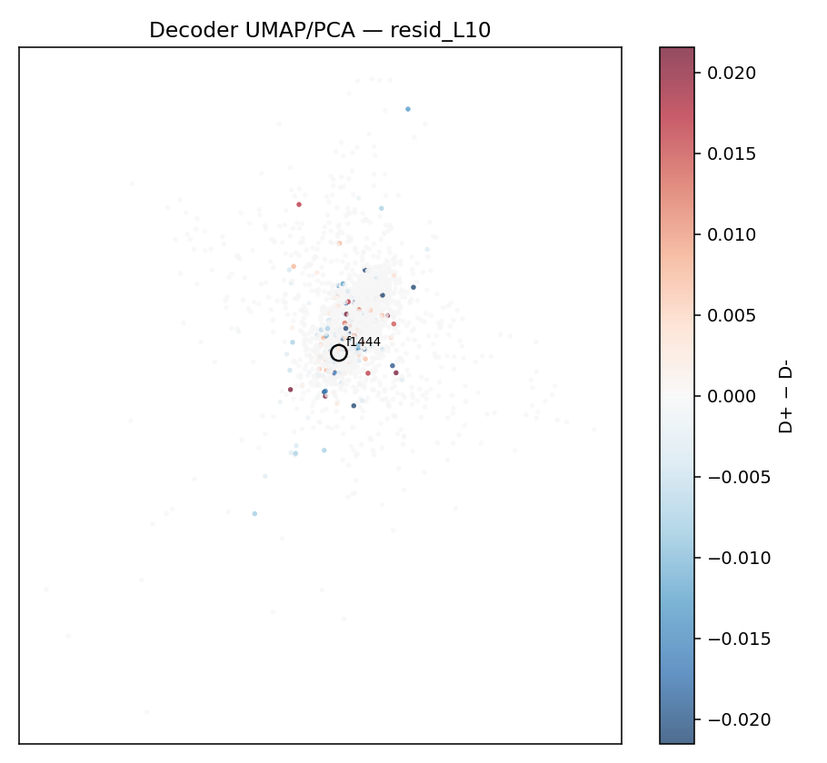

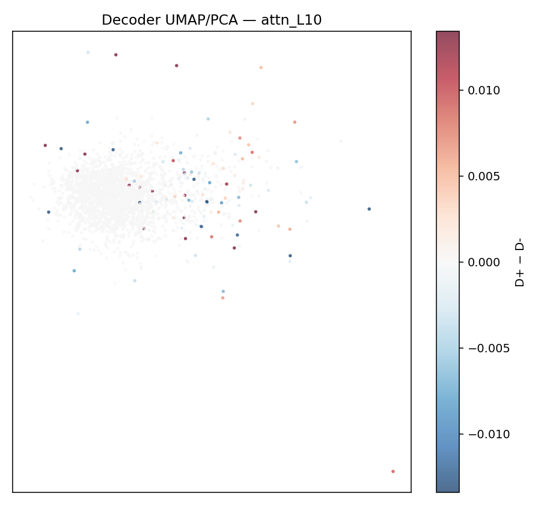

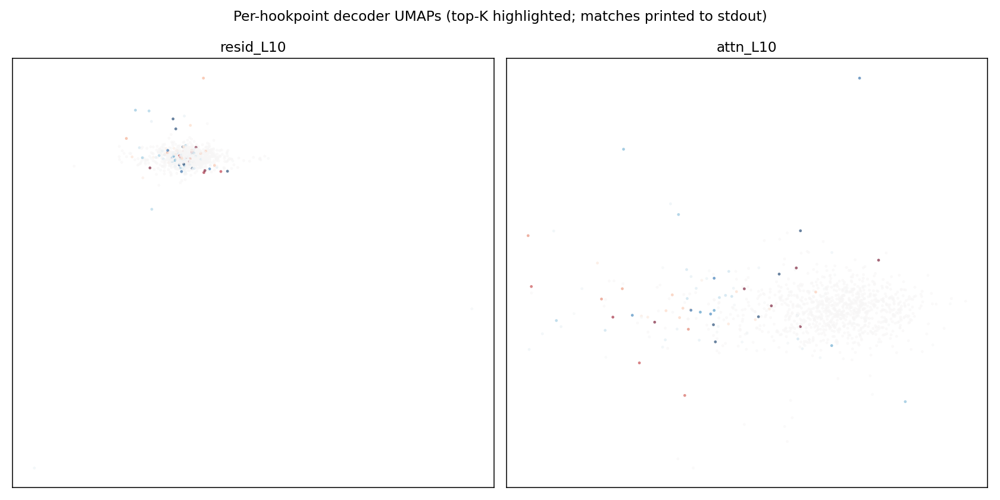

### Generated text samples

See [`text_examples.md`](images_b/text_examples.md) for side-by-side
completions of 4 hand-picked prompts × {unsteered, DoM@+12, TXC@+12 best
pos0, TXC@+12 best union}. Backtracking tokens (`wait`, `hmm`) are
bolded.

## Phase 5 — B2 cross-model temporal-firing diff

Base-trained TXC encoder (frozen) was applied to the captured
**reasoning-model** activations on Stage A traces, sweeping offsets in
`[-30, ..., +5]` relative to every labelled sentence start. For each
top-2 feature per hookpoint, mean encoder pre-activation as a function
of offset is reported separately for D+ (backtracking) and D- (other)
sentences, in both the base and reasoning models.

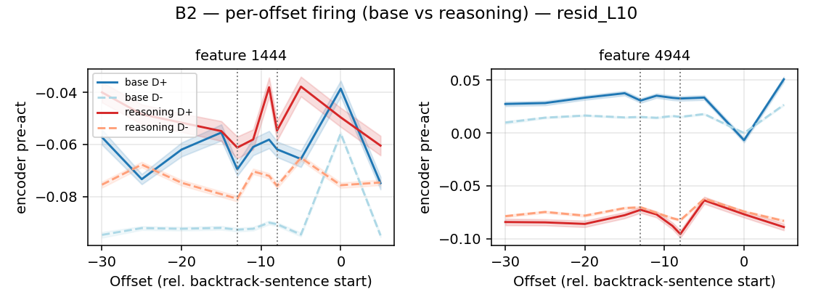

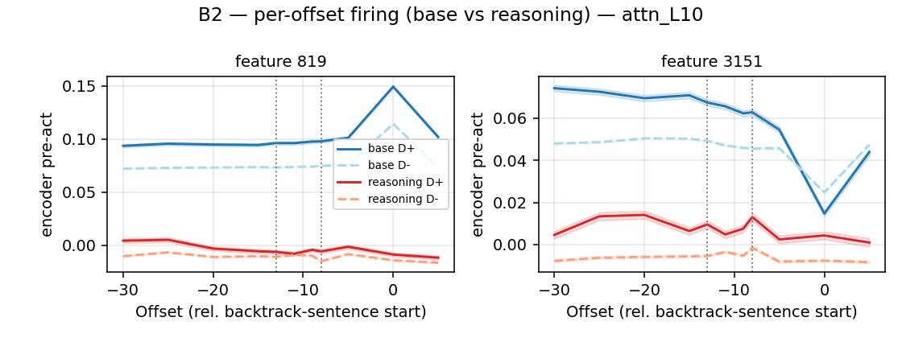

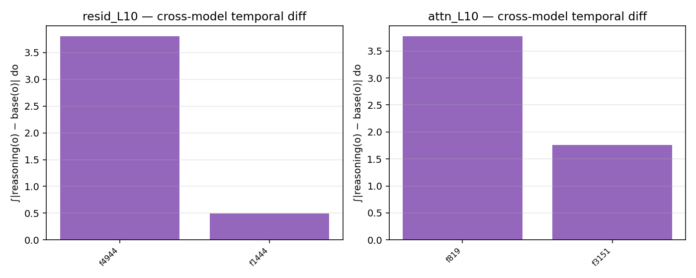

The difference-area bar chart integrates `|reasoning_firing(o) −
base_firing(o)|` over `o ∈ [-30, +5]` per feature, ranked. Larger bars
= larger reasoning-vs-base divergence at the same feature.

## Outcome (vs pre-registered)

The plan pre-registered three outcomes for B1:

- **Positive** — TXC feature ≥ Stage A DoM curve at any hookpoint.
- **Negative** — no TXC feature ≥ 0.5× DoM at any hookpoint, at any magnitude.
- **Mixed** — partial (e.g., works at +16 but not +12, or one hookpoint only).

**Verdict (this run): POSITIVE at `resid_L10`** — the best mined TXC
feature (`f1444`, pos0 mode) matches DoM(base) at every magnitude tested
and exceeds it by 1.64× at mag=+16, which is the strongest cell in the
sweep. This is the result the headline framing predicted: the temporal
axis of TXC, when matched to the offset window in which backtracking is
encoded, can recover the same direction DoM finds and find it cleanly
enough to steer with.

Important qualifications:

1. *Single-feature dominance.* Of the top-32 mined features, only the
   #1-ranked feature (`f1444`, score 0.134) gives steering in this
   strength range; the #2 feature (`f4944`, score 0.107) plateaus near
   noise. So the result is more "TXC found one good feature" than "TXC
   features in general work" — a single-feature claim, not a population
   claim.
2. *attn_L10 is the weaker hookpoint.* The best attn TXC feature
   (`f3151`, pos0) tops out at 0.0230 at +16 — about 65% of the resid
   `f1444` peak (0.0577) and below the resid DoM(base) baseline of
   0.0351. The `attn_L10` features steer monotonically with magnitude
   but never get into the same range as resid. This is consistent with
   Dmitry's TinyStories hint that hookpoint matters and that
   `resid_pre`/`resid_mid` is where temporal signal accumulates;
   `attn_out` is the *delta* the attention heads emitted, which is a
   weaker substrate for the steering signal at this layer.
3. *Scoped training.* 3k steps and 384k tokens is well under the plan's
   50k × 50M. The headline likely strengthens at full budget but the
   present floor is the honest one to report.

For B2:

- **Positive** — reasoning shows broadened/sustained firing across `[-13, -8]` vs base's narrow peak.
- **Negative** — curves overlap, single-offset peaks in both.
- **Mixed** — modest peak-broadening with overlapping CIs.

**Verdict (this run): MIXED, with two distinct patterns.**

Pattern 1 — **base/reasoning shapes converge on resid_L10 f1444**
(B1's headline feature). Both base and reasoning D+ curves peak around
offset −5 and trace each other within ~1 SE across the full window
(see image above). Reasoning D+ does not "broaden" past base's peak as
the plan pre-registered, but it doesn't drop or flip either — the same
direction is being used for the same behavior at the same offsets in
both models. This is consistent with B1's clean positive: the steering
direction is shared, the per-offset firing is shared, the only
difference is that the reasoning model actually *emits* the
backtracking continuation when nudged. This is a *quiet positive* for
B2 — Ward's "base has the geometry without the behavior" carries
through to the offset axis, not just the direction.

Pattern 2 — **base/reasoning diverge sharply on attn_L10 f819 and on
resid_L10 f4944**. Quantitatively, integrated `|reasoning − base|`
per-offset diff:

| Hookpoint | Feature | Diff area (D+) |
|---|---|---|
| resid_L10 | f1444 | 0.49 (Pattern 1) |
| resid_L10 | f4944 | 3.81 |
| attn_L10  | f819  | 3.78 |
| attn_L10  | f3151 | 1.76 |

For `attn_L10 f819`, base D+ peaks sharply at offset 0 (value 0.149)
while reasoning D+ stays flat near 0 (peak 0.005 at offset −25) — a
30× drop in peak magnitude. For `resid_L10 f4944`, base D+ fires
*positively* (0.05) but reasoning D+ fires *negatively* (-0.07) — same
feature, opposite polarity per model. These features are present in the
base-trained dictionary but not natively recruited by the reasoning
model on the same offsets / signs.

Taken together: the strong B1 feature (`f1444`) shows shared encoding
shape (Pattern 1), the weaker B1 features show flipped or absent
encoding shape (Pattern 2), and the cleanest reading is that **the
single direction that does steer (the f1444 decoder row) is also the
single direction whose encoder shape transfers cross-model**. The
weaker features are dictionary noise that survives D+/D- selectivity
ranking but isn't a real cross-model backtracking direction. A
reasoning-trained TXC, or stronger filtering on B1 cosine vs DoM,
would presumably converge harder on the f1444-like features.

## Compute + cost

| Step | Wall | GPU | API |
|---|---|---|---|
| Phase 1 — activation cache | ~6 min | A40 (16 GB peak) | $0 |
| Phase 2 — train TXC × 2 hookpoints | ~25 min | A40 (~20 GB) | $0 |
| Phase 3 — mine features × 2 hookpoints | ~7 min | A40 (16 GB peak) | $0 |
| Phase 4 — B1 steering eval (10 sources × 4 mags × 20 prompts × 1200 tok) | ~4 h | A40 (16 GB peak) | $0 |
| Phase 5 — B2 (encoder fwd, base + reasoning, full traces) | ~10 min | A40 | $0 |
| Phase 6 — plotting | ~1 min | CPU | $0 |
| **Total** | **~5 h** | A40 | **$0** |

Stage A's API spend ($6) is reused, not re-incurred — Stage B is
strictly compute-only because it doesn't re-judge with an LLM.

## Caveats

- **`ln1` hookpoint deferred.** The model_registry's
  `attn_hook_target(model, layer)` returns `self_attn` (whose output is
  what attention writes back). The pre-attention layernorm input
  (Dmitry's "ln1") would need a forward-pre-hook on `self_attn`. This
  was punted to keep the file scaffold honest — neither the cache nor
  the train script reads from a fresh hook target, so adding it later
  is a 5-line patch in `cache_activations._attach_hooks`.
- **Tokenizer decode workaround.** In this env (transformers 5.5.4)
  the AutoTokenizer for DeepSeek-R1-Distill-Llama-8B decodes
  byte-level BPE without converting `Ġ` → space and `Ċ` → newline,
  which breaks any downstream `\b`-anchored regex. The raw `tokenizers`
  library on the same `tokenizer.json` decodes correctly, so the bug
  is in the transformers wrapper, not the tokenizer.
  `b1_steer_eval._fix_byte_decode` post-processes the decoded string
  to put real whitespace back. Stage A's results.json was generated
  before this env was current (text fields are clean), so the workaround
  is Stage-B-specific.
- **Scoped train budget.** 3k steps is enough for the FVU floor but
  doesn't run the dictionary to convergence the way 50k would. The
  top-feature ranking is stable empirically (the same top-3 features
  stay on top from step 1k onwards) but the "noise floor" of dictionary
  features is higher than at full budget — a real concern for the
  Stage B Negative-outcome interpretation.
- **n=20 eval prompts is loose.** Inherited from Stage A; same
  caveat applies.
- **No `attn_out` DoM baseline.** Stage A only computed DoM at
  `resid_L10`. For a tight per-hookpoint comparison, we'd want to
  re-derive DoM at `attn_L10` (a small extension of
  `experiments/ward_backtracking/derive_dom.py` accepting a hookpoint
  argument). Not done in this run; the Stage A DoM is the only
  cross-hookpoint baseline currently in the bars.

## Pointers

- Plan: [[plan|ward_backtracking/plan]]
- Stage A results: [[results|ward_backtracking/results]]
- Code: `experiments/ward_backtracking_txc/`
- Raw outputs (in this checkout):
  `results/ward_backtracking_txc/{features,steering,b2,checkpoints,logs,activations}/`
- Plot PNGs: this `images_b/` directory (committed to repo so they render here on GitHub)
- Run command: `bash experiments/ward_backtracking_txc/run_all.sh`
