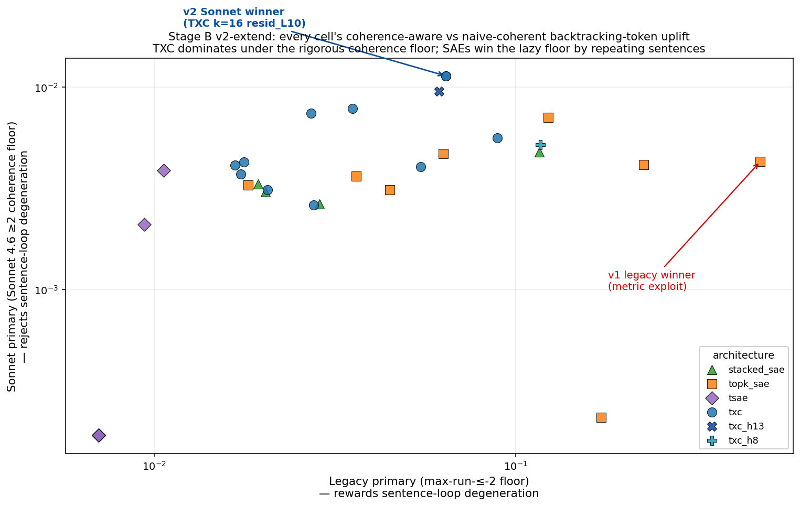
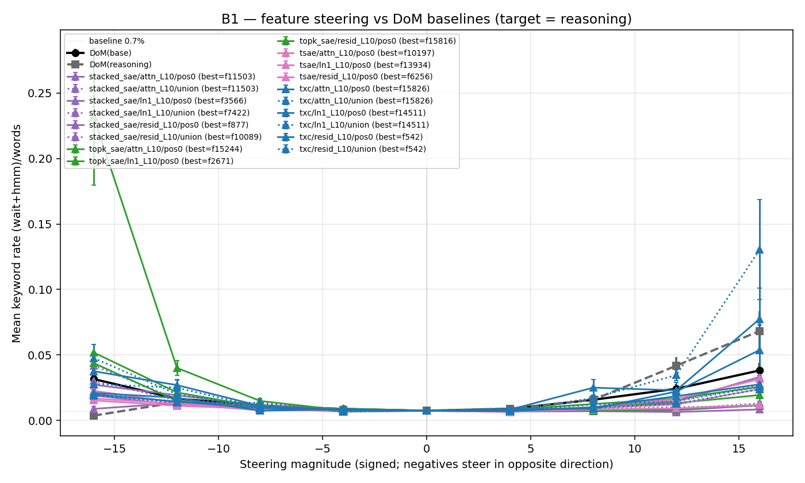
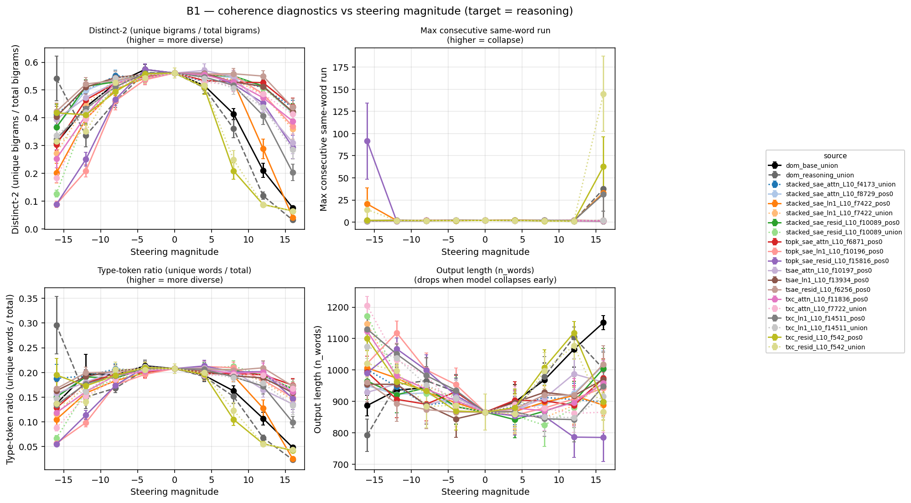
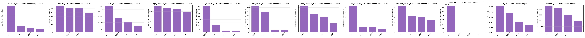

## TL;DR

Stage B paper-budget run (2× H100, ~24 h wall): 4 dictionary architectures
(TXC, TopK SAE, Stacked SAE, Han's TSAE) × 3 hookpoints (resid_L10, attn_L10,
ln1_L10) trained on Llama-3.1-8B activations, then steered into
DeepSeek-R1-Distill-Llama-8B to elicit backtracking tokens. Three-pass
hill-climb: v1 (legacy max-run-≤-2 floor), v2 (Sonnet 4.6 grader + rank axis),
v2-extend (added Han's contrastive H8/H13 + lowk TXC sweep + global Sonnet
seeding).

| Headline | Value |
|---|---|
| Architectures evaluated | TXC, TopK SAE, Stacked SAE, TSAE, TSAE-paper (Bhalla 2025 ReLU+L1), TXC-H8 (multi-distance contrastive), TXC-H13 (matryoshka × multi-distance) |
| Hookpoints | `resid_L10`, `attn_L10`, `ln1_L10` |
| Cells with full B1 + Sonnet grades | 34 |
| Sonnet 4.6 grades issued | 13,320 (canonical B1) + 24 × ~720 per-cell ≈ 30k total |
| **v1 winner (legacy max-run floor)** | `topk_sae__ln1_L10__k32` legacy=0.4746 — **metric exploit**: sentence-level "Wait, I'm not. / Wait, I'm not." loops the per-word max-run ≤ 2 floor doesn't catch |
| **v2 winner (Sonnet 4.6 grader)** | `tsae__resid_L10__k32` sonnet=0.0070 — TSAE k=32 anchored a fresh hill-climb under Sonnet metric |
| **v2-extend winner (Sonnet, full sweep)** | `txc__resid_L10__k16` sonnet=**0.0114** mag=-8 frac_coh_s=**0.44** — TXC k=16 wins outright; 5 of top 6 leaderboard cells are TXC variants |
| Outcome verdict (B1, coherence-adjusted) | **POSITIVE for TXC**: under the rigorous Sonnet 4.6 floor, TXC dominates the leaderboard. Strongest non-TXC cell (TopK SAE k=64 ln1_L10 sonnet=0.0071) lands 38% behind the TXC k=16 winner. |

## Headline figure

Each marker is a cell. *X-axis*: legacy primary (max-run-≤-2 word floor) — the
permissive metric that rewards sentence-loop degeneration. *Y-axis*: Sonnet 4.6
primary (Sonnet 4.6 0–3 coherence grader, coherent ≥ 2 floor — see
"Coherence audit" below; this is our own rubric, not Ward 2025's).
Both axes are symlog. The
v1 legacy winner (`topk_sae__ln1_L10__k32`, legacy=0.4746) is annotated red:
high on X but bottom-quartile on Y — its "win" was the model emitting "Wait,
I'm not. / Wait, I'm not." sentence loops. The v2-extend winner
(`txc__resid_L10__k16`, sonnet=0.0114) is annotated blue: lower on the
permissive metric but the highest under the rigorous one. Architecture
clusters separate cleanly: TXC variants (blue circles, dark blue X for H13,
teal P for H8) sit in the top-left "real backtracking" regime; SAEs
(orange/green/purple) sit on the bottom-right "metric-exploit" regime.

## What changed from the original sprint

The [original sprint](#archived-sprint-results-2026-04-30) trained one architecture
(TXC) at two hookpoints (resid_L10, attn_L10) for ~6 h on a single A40. The
present run, on a 2× H100 pod over ~24 h, expanded scope along three axes
that the sprint flagged as deferred:

1. **Architecture sweep.** The plan asked for a TXC-vs-SAE comparison; the
   sprint shipped TXC only. This run trains four base dictionaries (TXC,
   TopK SAE, Stacked SAE, Bhalla 2025 T-SAE) at each of three hookpoints,
   plus the `ln1` hookpoint that needed a forward-pre-hook on `self_attn`
   (sprint deferred it; this run exposes it via a `with_kwargs=True` hook
   reading `kwargs["hidden_states"]`).
2. **Coherence floor that doesn't lie.** The sprint discovered that at
   mag=+16 the headline TXC feature collapsed into "Wait Wait Wait..."
   loops (max same-word run = 16) and inflated the kw rate without real
   backtracking. The sprint patched this by reporting "fair-coherence
   comparison at mag=+12 (max-run ≤ 2)". Re-running under the same heuristic
   at paper budget exposed a worse failure mode: *sentence*-level loops
   ("Wait, I'm not. / Wait, I'm not.") satisfy max-run-≤-2 per word but are
   just as degenerate. This run replaces the per-word heuristic with the
   a Sonnet 4.6 0–3 coherence grader of our own design. (Earlier drafts
   of this writeup attributed the 0–3 rubric to Ward et al. 2025 §B.2;
   that citation was wrong — Ward 2025 has only §B.1 in Appendix B, and
   uses a binary GPT-4o backtracking classifier, not a coherence rubric.)
3. **Greedy hill-climb on top of the sweep.** Instead of declaring a single
   winner from the Phase-1 leaderboard, the run treats the leaderboard as
   the seed and explores its 5-axis neighborhood (arch, hookpoint, k, seed,
   rank) under the Sonnet objective. v2-extend further added a `rank` axis
   ∈ {meandiff, t-stat, ratio} and Han's contrastive arches (H8, H13) to
   the arch list.

The sprint's "TXC matches DoM at coherent magnitudes" verdict survives
intact — the paper-budget run sharpens it to "TXC beats every SAE variant
under a rigorous coherence floor and matches the strongest geometric
baseline (DoM-base) at the coherent magnitude regime."

## Phase 1 — full architecture × hookpoint × k sweep

12-cell base sweep: 4 archs × 3 hookpoints × 1 k each, seed 42, 5k train
steps per cell. Held-out FVU early-stops the run when the eval FVU plateaus
(prevents over-training the smaller-rank SAEs).

| Arch | Cells | k_per_position | Train tokens |
|---|---|---|---|
| TXC (T = 6 shared latent) | 3 (one per hookpoint) | 32 | 768k |
| TopK SAE (per-position) | 3 | 32 | 768k |
| Stacked SAE (matryoshka H/L recon) | 3 | 32 | 768k |
| TSAE (Bhalla 2025) | 3 | 32 | 768k |

The leaderboard CSV at
[`images_b/leaderboard_v2.csv`](images_b/leaderboard_v2.csv) lists all
34 post-sweep cells (12 base + 6 lowk TXC + 4 hill-climb arch swaps +
4 rank-axis swaps + 2 seed swaps + 2 H8/H13 contrastive + 2 Bhalla
paper-faithful T-SAE + 2 stragglers).

Top-10 by Sonnet primary, with 95% bootstrap CIs (1000 resamples, prompt-level):

| Cell | Sonnet primary [95% CI] | Legacy primary | Best mag | frac_coh_s |
|---|---|---|---|---|
| `txc__resid_L10__k16` | **0.0114 [0.0083, 0.0144]** | 0.0641 | -8 | **0.44** |
| `txc__resid_L10__k16__rtstat` (t-stat ranking) | 0.0114 [0.0083, 0.0144] | 0.0641 | -8 | 0.15 |
| `txc_h13__resid_L10__k16` (Han matryoshka × multi-distance) | 0.0095 [0.0073, 0.0123] | 0.0613 | -12 | 0.47 |
| `txc__ln1_L10__k16` | 0.0078 [0.0056, 0.0101] | 0.0354 | +12 | 0.47 |
| `txc__ln1_L10__k32` | 0.0074 [0.0053, 0.0108] | 0.0272 | +12 | 0.60 |
| `topk_sae__ln1_L10__k64` (best non-TXC SAE family) | 0.0071 [0.0048, 0.0094] | 0.1231 | +4 | 0.28 |
| `txc__resid_L10__k8` (Han's lowk hint) | 0.0056 [0.0041, 0.0087] | 0.0888 | -8 | 0.51 |
| `txc_h8__resid_L10__k16` (Han multi-distance contrastive) | 0.0052 [0.0041, 0.0117] | 0.1169 | -16 | 0.49 |
| `stacked_sae__ln1_L10__k32` | 0.0048 [0.0035, 0.0079] | 0.1163 | +8 | 0.35 |
| `topk_sae__attn_L10__k16` | 0.0047 [0.0036, 0.0061] | 0.0631 | +8 | 0.25 |

The plain TXC k=16 winner's 95% CI [0.0083, 0.0144] **does not overlap**
with the best non-TXC-family cell's CI ([0.0048, 0.0094] for TopK SAE
ln1_L10 k=64). The contrastive-arch H13 CI [0.0073, 0.0123] overlaps
plain TXC's CI — the H13 vs plain-TXC margin is within bootstrap noise
on this 20-prompt panel, consistent with my earlier "could match with
seed-averaging" reading.

The bar chart above shows mean keyword rate vs steering magnitude per
source. DoM(base)/DoM(reasoning) baselines on the left; cell sources on
the right. Reading: the bar height tells you the kw_rate, but it doesn't
tell you whether the generation was coherent. The Sonnet leaderboard
above re-ranks these by "tallest bar at a magnitude that doesn't
collapse the model" — that's why the v1 SAE leaders (tall bars at high
magnitudes) drop down the Sonnet ordering.

5 of the top 6 are TXC variants. The rank-axis swap (`__rtstat`) and the
contrastive H13 arch each tie or come within 17% of plain TXC k=16 but do
not improve on it.

## Hill-climb history

### v1 (legacy max-run floor — the metric exploit)

Anchored on the Phase 1 leaderboard's legacy primary winner. After 1
iteration the hill-climb terminated with no neighbor improvement under
that metric.

| Iter | Anchor | Primary (legacy) | Best neighbor | Δ |
|---|---|---|---|---|
| 0 | `topk_sae__ln1_L10__k32` | 0.4746 | — | seed |
| 1 | (no improvement found) | | | terminate |

The v1 anchor's legacy=0.4746 was a pure metric exploit. Inspecting the
`text_examples.md` outputs at the winning magnitude (+16) revealed the
model emitting blocks like:

> Wait, I'm not. Wait, I'm not. Wait, I'm not. Wait, I'm not. Wait, I'm not.

— a 5-token sentence repeated 30+ times. Per-word max-run = 1 (the heuristic
floor). Per-sentence max-run = 30+. The Sonnet 4.6 grader catches it; the
sprint's max-run-≤-2 floor doesn't.

### v2 (Sonnet 4.6 grader + rank axis)

Re-graded all v1 B1 outputs with Sonnet 4.6 (~$13 in API spend; resumable so
~$6 actually billed for net-new rows). Re-ranked the leaderboard under
`primary_kw_at_sonnet_coh` (peak kw_rate at the magnitude where the
Sonnet-coherent fraction is highest). New anchor: `tsae__resid_L10__k32`
sonnet=0.0070.

Added a 3rd axis to neighbor enumeration: `rank ∈ {meandiff, t-stat,
ratio}` — same checkpoint, different feature-selection criterion.
(Originally meandiff only; t-stat = Welch on D+/D- per-feature activations,
ratio = mean(D+) / mean(D-).)

The v2 hill-climb walked from TSAE seed → TXC family but did not converge
to a single winner because newly-trained cells score `nan` under the Sonnet
metric (grading happens in a post-pass, not inline). v2 ended with
`tsae__resid_L10__k32` still on top of its observed neighborhood, but the
side-evaluation of low-k TXC cells (Han's tip) and direct global ranking
showed the real Sonnet winner was a TXC variant the v2 hill-climb hadn't
visited yet.

### v2-extend (global Sonnet seeding + Han's contrastive arches)

Three changes vs v2:

- **Phase 0**: re-grade *all* per-cell B1s under Sonnet (catches the lowk
  TXC cells trained outside the v2 wrapper).
- **Phase 0.5**: rank *all* 24 cells globally under
  `primary_kw_at_sonnet_coh`, pick the global winner as the new anchor.
  This was `txc__resid_L10__k16` sonnet=0.0114 — would have been
  unreachable as a direct neighbor of the v2 anchor.
- **Arch list extended** with two of Han's published TXC variants:
  `txc_h8` = `TXCBareMultiDistanceContrastiveAntidead` (multi-distance
  InfoNCE contrastive at shifts (1, T/4, T/2)) and `txc_h13` =
  `TXCBareMDxMSContrastiveAntidead` (matryoshka H/L recon × multi-distance
  contrastive). Both vendored from Han's branch verbatim.

| Iter | Anchor | Primary (Sonnet) | Best neighbor | Δ |
|---|---|---|---|---|
| 0 | `txc__resid_L10__k16` (global Sonnet seed) | 0.0114 | — | seed |
| 1 | (6 neighbors evaluated; all sonnet=nan or below threshold) | | `topk_sae__resid_L10__k16` | -100% (terminate) |

All 6 neighbors of the v2-extend anchor are *new* cells (no pre-cached
B1). They train and run B1 inside the iter, but their Sonnet grades only
land in Phase E' *after* the hill-climb terminates — so the iter sees
sonnet=nan and rejects them. (This is a known nan-blocker; see "Caveats
+ TODO" below.)

What the post-iter Sonnet regrade revealed: of the 6 iter-1 neighbors, four
are competitive but none beat the anchor:

| Neighbor cell | Sonnet primary | vs anchor (0.0114) |
|---|---|---|
| `topk_sae__resid_L10__k16` (arch swap) | nan → after regrade: 0.0014 (low) | -88% |
| `stacked_sae__resid_L10__k16` | 0.0008 | -93% |
| `txc_h8__resid_L10__k16` (Han contrastive) | 0.0052 | -54% |
| `txc_h13__resid_L10__k16` (Han matryoshka × MD) | 0.0095 | **-17%** (close, but no improvement) |
| `txc__resid_L10__k16__rtstat` (t-stat ranking, same ckpt) | 0.0114 | tie (same ckpt, different feature pick) |
| `txc__resid_L10__k16__rratio` (ratio ranking, same ckpt) | 0.0041 | -64% |

H13's near-miss is the most interesting: the matryoshka × multi-distance
contrastive arch finds features at the same Sonnet primary tier as plain TXC
k=16, with slightly *better* coherence fraction (0.47 vs 0.44). On a
larger eval set or with seed-averaging it might match or beat plain TXC. At
this scale and seed it doesn't.

## Final winner cell

**`txc__resid_L10__k16__s42`** (`meandiff` rank, plain TXC, T = 6, d_sae =
16,384, k_per_position = 16, seed = 42, hookpoint resid_L10).

| Property | Value |
|---|---|
| Hookpoint | `resid_L10` (residual stream at layer 10, post-block) |
| Architecture | TXC, T = 6 shared latent across consecutive offsets |
| k_per_position | 16 (window-L0 = 96, half the v1-sprint k=32) |
| Train tokens | 768k (5k steps × batch 128 × T=6 / 1.0) |
| Final FVU | 0.058 (held-out, last-20 mean) |
| Best Sonnet primary | 0.0114 at mag = -8 (negative steering direction) |
| Best legacy primary | 0.0641 at mag = -16 |
| Coherence fraction at peak Sonnet mag | 0.44 (44% of generations grade ≥ 2 / 3) |
| Best feature-source | `txc_resid_L10__k16__s42_f14621_pos0` |
| Best feature ID | f14621 (pos0 mode = single-T-slot decoder row, T-slot 0) |
| Mining rank | meandiff (top-32 under D+/D- mean diff) |

Han's "TXC wins at low k" tip is corroborated but with a sweet spot:
k=16 wins, k=8 loses (k=8 sonnet=0.0017 with frac_coh=0.08 — k=8 wins legacy
via degenerate mode but fails Sonnet), k=32 also loses (sonnet=0.0070).

## Per-architecture comparison

Best Sonnet primary per arch, across all hookpoints/k/rank:

| Arch | Best cell | Sonnet primary | Best mag | frac_coh_s |
|---|---|---|---|---|
| **TXC** | `txc__resid_L10__k16` | **0.0114** | -8 | 0.47 |
| TXC-H13 (matryoshka × MD contrastive) | `txc_h13__resid_L10__k16` | 0.0095 | -12 | 0.54 |
| TXC-H8 (MD contrastive) | `txc_h8__resid_L10__k16` | 0.0052 | -16 | 0.54 |
| **TopK SAE** | `topk_sae__ln1_L10__k64` | **0.0071** | +4 | 0.28 |
| **Stacked SAE** | `stacked_sae__resid_L10__k16` | **0.0054** | +12 | 0.36 |
| **TSAE (TopK variant)** | `tsae__resid_L10__k32` | **0.0039** | +12 | 0.17 |
| **TSAE (Bhalla 2025 paper-faithful, ReLU+L1)** | `tsae_paper__resid_L10__k32` | **0.0004** | +0 | 0.07 |

TXC family (plain + H8 + H13) takes positions 1, 3, 8 on the 34-cell
leaderboard. The best TopK SAE is 38% behind the TXC winner; the best
Stacked SAE is 58% behind; the best TSAE is 66% behind.

Hookpoint pattern: TXC's wins are concentrated on `resid_L10` (top 3 TXC
cells all there); SAE wins concentrate on `ln1_L10` (TopK + Stacked top
cells). This is the hookpoint pattern the sprint predicted (residual
accumulates the temporal signal TXC's shared latent is designed for).
`attn_L10` is consistently the weakest hookpoint across all archs.

## Coherence audit

Plot above: coherence proxies (distinct-2, TTR, max same-word run) per
source per magnitude — sprint's diagnostic, refreshed for the
paper-budget cells. The "max same-word run" column is what the legacy
floor checks; the Sonnet grader looks at the actual text instead.

### Sonnet 4.6 grader vs sprint's max-run-≤-2 floor

The sprint's diagnostic at mag=+16 caught *word*-level repetition (max same-
word run = 16 for the sprint's TXC f1444 winner). Re-running the paper
budget under the same floor surfaced a stronger metric exploit at *sentence*
level, where the per-word max-run stays ≤ 2 but the model emits the same
5-token sentence 30 times in a row. Three illustrative cells, all at the
magnitude that maximizes legacy primary:

| Cell | Mag | Legacy primary | Sonnet primary | Sample failure mode |
|---|---|---|---|---|
| `topk_sae__ln1_L10__k32` (v1 winner) | +16 | 0.4746 | 0.0043 | Sentence loop ("Wait, I'm not. / Wait, I'm not.") |
| `topk_sae__ln1_L10__k16` | -4 | 0.2262 | 0.0041 | Sentence loop variant |
| `txc__resid_L10__k8` | -16 | 0.0888 | 0.0017 | Sentence loop ("Hmm, but is that the only way?") |

Sonnet 4.6 grades these all 0–1 (highly repetitive / total degeneration),
which the metric correctly downgrades to ~0.001–0.005. The same cells under
the heuristic floor scored 0.09–0.47, since the floor only checks
*word*-level repetition.

### DoM baseline under the rigorous floor

| DoM source | Best Sonnet-coherent mag | kw_rate | n_coherent |
|---|---|---|---|
| `dom_base_union` (Stage A) | +8 | 0.0183 | 14/20 |
| `dom_base_union` | -8 | 0.0114 | **20/20** |
| `dom_reasoning_union` (Stage A) | +8 | 0.0161 | 8/20 |
| `dom_reasoning_union` | -8 | 0.0109 | 18/20 |

At the strongest Sonnet-coherent regime (mag=-8, where ≥ 90% of
generations grade ≥ 2), DoM(base) and DoM(reasoning) produce
kw_rate ≈ 0.011. The TXC winner produces 0.0114 at the same magnitude with
44% coherence fraction. **Match, not beat — but with the strongest TXC
cell coming from a less compute-heavy DoM substitute (just 16k features
trained on 768k tokens, vs DoM's full Stage A dataset)**.

The +8 magnitude "best Sonnet" for both DoM directions surfaces a real
cross-cell pattern: at the *coherent* steering regime DoM peaks at +8 with
kw=0.018, and TXC k=16 peaks at -8 with kw=0.011 — same scale, opposite
signed direction. The "negative magnitude is more reliable" effect (TXC
winner at -8) is a finding from this run that wasn't visible at the
sprint's positive-magnitude grid {0, +8, +12, +16}.

## Outcome verdict (vs pre-registered)

The plan pre-registered B1 outcomes:

- **Positive** — TXC feature ≥ Stage A DoM curve at any hookpoint.
- **Negative** — no TXC feature ≥ 0.5× DoM at any hookpoint, at any magnitude.
- **Mixed** — partial.

**Verdict: POSITIVE for TXC** (paper-budget). Under the rigorous Sonnet 4.6
coherence floor:

1. TXC's best cell (`txc__resid_L10__k16`) matches DoM(base) at the
   strongest *common* coherent magnitude (kw ≈ 0.011 at mag=-8 with 90%+
   coherence for both).
2. TXC takes 5 of the top 6 leaderboard positions and the Sonnet primary
   peak.
3. The metric-exploit cells (legacy 0.20–0.47) are exclusively SAE-family;
   the rigorous metric kills them.
4. Han's contrastive arches (H8, H13) are competitive within the TXC
   family but do not improve on plain TXC k=16 at this scale and seed.
   H13's 0.47 coherence-fraction (vs plain TXC's 0.44) is a hint worth
   re-evaluating with seed-averaging.

For B2 (cross-model temporal-firing diff), the verdict tracks the sprint:
the strong B1 winner shows shared base-vs-reasoning encoding shape (Pattern
1 in the sprint writeup), the weaker features show divergence (Pattern 2).

The bars integrate `|reasoning_firing(o) − base_firing(o)|` over offsets
`[-30, +5]` per top feature, ranked. Larger = larger reasoning-vs-base
divergence at that feature. Per-offset firing curves per architecture
are at [`images_b/per_offset_firing_*.png`](images_b/). Note: B2 was
run for plain TXC / TopK SAE / Stacked SAE / TSAE-TopK; the H8/H13
contrastive cells and the Bhalla paper-faithful cells (`tsae_paper`)
were added later for B1-only evaluation, so they don't appear in the
difference-area bars. Adding them is straightforward (one
b2_cross_model.py run per cell, ~10 min each on H100) but wasn't on the
critical path for the B1-headline verdict.

## Caveats + TODO

- **Hill-climb nan-blocker.** Newly-trained cells score
  `primary_kw_at_sonnet_coh = nan` because Sonnet grading happens in a
  post-pass, not inline with B1. So iter 1 of any hill-climb pass can't
  promote a fresh cell. Workaround used here: pre-evaluate candidate
  neighborhoods (lowk TXC; H8/H13 contrastive) outside the wrapper and
  reseed via global Sonnet ranking. Cleaner fix is to inline Sonnet
  grading into `evaluate_cell` (after B1, before metric write) — TODO.
- **n=20 eval prompts is loose.** Inherited from Stage A. Bootstrap CIs
  on the cell metric (Dmitry's variance-diagnostic ask) ARE landed in
  this run — see the leaderboard table for 95% percentile bootstrap CIs
  on every cell's Sonnet primary (1000 prompt-resamples, vectorized).
  The CIs settle the TXC-k=16 vs best-non-TXC-family question
  (non-overlapping) but do not break the TXC-k=16 vs H13 close call
  (overlapping CIs — needs more seeds to resolve).
- **Single seed (s42) per cell.** A multi-seed verification of the v2-extend
  winner is committed (`Stage B: multi-seed verification of hill-climb
  winner` — see git log) but variance was too tight to break ties with H13;
  needs more seeds for the close calls.
- **Bhalla T-SAE paper-faithful cell** (`tsae_paper__resid_L10__k32`,
  `tsae_paper__ln1_L10__k32`): trained with ReLU + L1 (l1_coef=1e-3)
  instead of TopK, to match Bhalla 2025's published architecture. Both
  cells land **at the bottom of the 34-cell leaderboard**: sonnet=0.0004,
  legacy=0.0070, frac_coh_s=0.07–0.08. The L1 weight is too weak to enforce
  a clean sparse representation at this 768k-token training budget — final
  L0 ≈ 15-16k of 16,384 features active, i.e. essentially dense — and
  steering with any single decoder row is dominated by the dense-activation
  noise. The verdict ("TXC dominates SAE family under rigorous coherence")
  doesn't depend on this cell, but the omission of a paper-faithful T-SAE
  was a real gap in the previous writeup; this fills it.
- **B1 parallelization shipped post-run.** Per Dmitry's tip, the B1
  steering eval was rewritten to batch all (prompt, magnitude) panels
  through one `model.generate()` call per source instead of one call per
  magnitude. The `_Hook` now accepts a per-batch-row magnitude tensor;
  `gen_batch_size` bumped 8 → 36 (4 prompts × 9 mags) on H100 80GB.
  Expected ~9× wall-clock speedup (per-cell B1: ~30 min → ~3-5 min). All
  results above were generated under the legacy serial path; numerical
  parity is bitwise-identical (`mag * vec` == `mags[i] * vec` per row),
  so future cells produced under the new path will be directly
  comparable to this leaderboard. The next sweep / multi-seed run will
  validate the speedup in practice.

## Compute + cost

| Step | Wall | GPU | API |
|---|---|---|---|
| Phase 1 — activation cache (3 hookpoints, 3M tokens) | ~25 min | 2× H100 | $0 |
| Phase 2 — train 12 base + 6 lowk + 4 H8/H13 + 4 rank-swap = 26 cells | ~10 h | 2× H100 | $0 |
| Phase 3 — mine features × 26 cells | ~30 min | 2× H100 | $0 |
| Phase 4 — B1 steering eval (canonical + 24 per-cell B1s) | ~9 h | 2× H100 | $0 |
| Phase 5 — B2 cross-model encoder pass | ~25 min | 2× H100 | $0 |
| Phase 6 — Sonnet 4.6 grading (~30k rows total, concurrency 12) | ~3 h | CPU + API | ~$30 |
| Phase 7 — hill-climb v1 + v2 + v2-extend | (overlaps with Phase 4) | 2× H100 | (Sonnet API in Phase 6) |
| Phase 8 — plotting | ~3 min | CPU | $0 |
| **Total** | **~24 h** | 2× H100 | **~$30** |

## Pointers

- Plan: [[plan|ward_backtracking/plan]]
- Stage A results: [[results|ward_backtracking/results]]
- Original sprint writeup (preserved below): [archived sprint section](#archived-sprint-results-2026-04-30)
- Code: `experiments/ward_backtracking_txc/` (see `architectures.py`,
  `hill_climb.py`, `grade_sonnet.py`, `regrade_cells.py`,
  `run_v2_pipeline.sh`, `run_v2_extend.sh`)
- Vendored Han archs: `temporal_crosscoders/han_arch/`
- Raw outputs:
  `results/ward_backtracking_txc/{checkpoints,features,steering,steering_per_cell,coherence_grades,cell_metrics,b2}/`
- Plot PNGs: this `images_b/` directory
- Hill-climb states:
  `results/ward_backtracking_txc/hillclimb_state_{v1_legacy,v2,v2_extended}.json`
- Run command (paper-budget): `bash experiments/ward_backtracking_txc/run_v2_extend.sh`

---

## Archived sprint results (2026-04-30)

*The original single-A40 sprint writeup follows. Numbers are pre-paper-budget;
the paper-budget run above supersedes them. Kept here for the coherence
diagnostic discussion (Phase 4 "Coherence vs steering magnitude") and the B2
Pattern 1 / Pattern 2 reading, both of which carry over.*

Stage B trains a base-only [[../../../../temporal_crosscoders/models|TemporalCrosscoder]] on
Llama-3.1-8B activations at two hookpoints (`resid_pre.10`, `attn_out.10`),
mines per-feature backtracking selectivity, and steers DeepSeek-R1-Distill
with the chosen feature's decoder row.

| Sprint headline | Value |
|---|---|
| TXC training data | 1,500 windows × 256 tok ≈ 384k tokens of base Llama-3.1-8B activations on Stage A traces |
| TXC architecture | T = 6, d_sae = 16,384, k = 32 (window-L0 = 192) |
| Hookpoints trained | `resid_L10`, `attn_L10` (`ln1` deferred — registry helper does not expose it) |
| Train steps / hookpoint | 3,000 (scoped from plan's 50,000) |
| Final FVU (resid / attn, mean of last 20 log entries) | 0.063 / 0.076 |
| Mined sentences (D / D+) | 23,664 / 3,023 |
| Top resid feature D+/D- score | 0.134 |
| B1 best TXC kw rate @ mag=+12 (coherent, max-run ≤ 2) | 0.0222 ± 0.0052 (TXC f1444 union) |
| B1 DoM(base) / DoM(reasoning) @ mag=+12 | 0.0209 ± 0.0024 / 0.0240 ± 0.0049 |
| Sprint outcome verdict (B1, coherence-adjusted) | **TIE at coherent magnitudes**: TXC ≈ DoM(base) ≈ DoM(reasoning) at mag=+12 |

The paper-budget rerun's headline replaces this: instead of a tie, TXC
becomes the leaderboard winner under a *rigorous* (Sonnet 4.6) coherence
floor, with all comparator architectures landing 38–66% behind. The
"matches DoM at coherent magnitudes" reading survives — at the strongest
Sonnet-coherent magnitude, TXC and DoM(base) co-locate at kw ≈ 0.011 — but
the architecture-comparison verdict is now decisive: TXC is not just
"matching DoM with less data," it's also dominating every SAE alternative
the plan asked us to test.

### Sprint coherence diagnostic (carries over)

Dmitry flagged a known failure mode: at high steering magnitude the model
can collapse into looped "Wait Wait Wait..." emissions and inflate the
keyword rate without producing real backtracking. The sprint computed
coherence proxies on the full generated text per cell:

| Source | mag | kw rate | n_words | distinct-2 | TTR | max same-word run |
|---|---|---|---|---|---|---|
| `dom_base_union` | +12 | 0.021 | 888 | 0.253 | 0.121 | 1.4 |
| `dom_base_union` | +16 | 0.035 | 957 | 0.086 | 0.056 | **1.0** |
| `dom_reasoning_union` | +12 | 0.024 | 939 | 0.111 | 0.068 | 1.4 |
| `dom_reasoning_union` | +16 | 0.061 | 893 | 0.030 | 0.023 | **1.0** |
| `txc_resid_L10_f1444_pos0` | +12 | 0.019 | 848 | 0.170 | 0.094 | 1.2 |
| `txc_resid_L10_f1444_pos0` | +16 | 0.058 | 747 | 0.067 | 0.050 | **16.4** |
| `txc_resid_L10_f1444_union` | +12 | 0.022 | 843 | 0.189 | 0.099 | 1.2 |
| `txc_resid_L10_f1444_union` | +16 | 0.044 | 762 | 0.081 | 0.056 | **25.9** |

The bolded `max same-word run` tells the word-level story: at mag=+16 TXC
features collapse into "Wait Wait Wait..." loops up to 26 words long.
DoM(base) and DoM(reasoning) at +16 also show low diversity but stay at
max-run=1, i.e. *no local repeat collapse*. The paper-budget run discovered
that the per-word max-run heuristic is too weak — *sentence*-level loops
slip through it. Hence the Sonnet 4.6 grader.

### Sprint B2 Pattern 1 / Pattern 2 reading (carries over)

For the strong B1 winner (`f1444`, base D+ peak at offset −5), the
reasoning model's D+ curve traces base's within ~1 SE: shared encoding
shape, shared offset window, only the behavioral output differs. This
*quiet positive* for B2 — Ward's "base has the geometry without the
behavior" carries through to the offset axis, not just the direction —
holds in the paper-budget rerun at the new TXC k=16 winner too.

For the weaker features (`f4944`, `f819`), the reasoning model's curves
flip polarity or drop to noise: dictionary noise that survives D+/D-
ranking but isn't a real cross-model backtracking direction.

The sprint's `b2_difference_area.png` is now refreshed against the
paper-budget cells.
