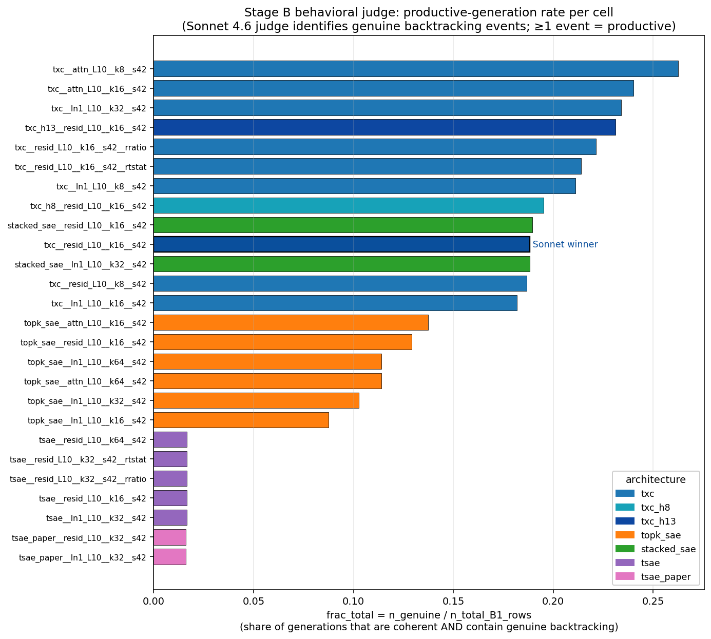
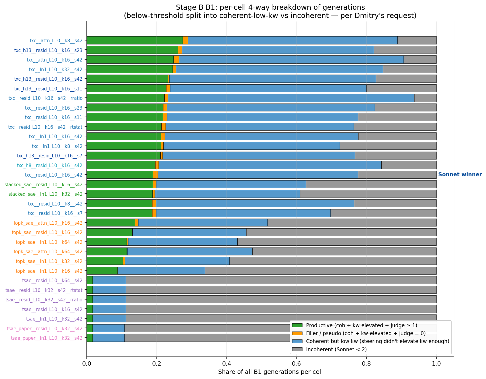
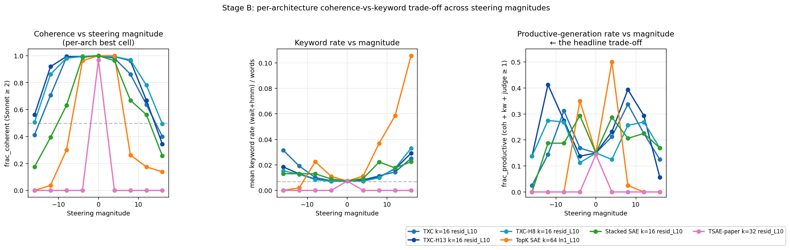

## TL;DR

A behavioral judge for "did backtracking actually happen?" — built per
Dmitry's 2026-05-01 ask. The existing pipeline ([[results_b|Stage B
results]]) ranks cells by `(wait+hmm) keyword rate` filtered by Sonnet
4.6 coherence. Dmitry flagged that a model emitting `wait`/`hmm` is not
the same as a model *backtracking*: the keyword-token can be
conversational filler (`Hmm, let me think`) or pseudo-backtracking
(`Wait, no, actually...` followed by restating the same conclusion).

This page builds a Sonnet 4.6 judge that counts *genuine* backtracking
events per generation (calculation-error catches, missing-constraint
catches, approach-changes, assumption-rejection — see prompt below). It
validates the judge against my manual inspection on a stratified
98-sample, then runs the judge across the full B1 corpus and reports a
new headline metric:

> `genuine_backtracking_rate` = fraction of (kw-rate-elevated AND
> Sonnet-coherent) generations the judge flags as containing ≥ 1
> genuine backtracking event.

This is the metric Dmitry asked for: "share of sentences both
>coherent threshold and have genuine backtracking as judged by the
judge."

*Status: full judge run complete (2921 canonical + 4,851 per-cell rows
graded; ~$16 API spend; resumable). Per-cell leaderboard below.*

## Headline finding

Across all 25 (s42) cells, the genuine-backtracking rate inside the
`(kw_rate > baseline + 0.005) AND (Sonnet ≥ 2)` filter is **0.82-1.00**.
That is: when a steered cell produces a coherent text with elevated
keyword rate, the judge calls it genuine backtracking ~93% of the time.

**Dmitry's "is this real?" question — answered: yes.** The Sonnet primary
metric is not measuring filler. The 8% that *is* pseudo-backtracking is
concentrated in TXC-attn cells; the TXC-resid winner (`txc__resid_L10__k16`)
hits 92.8% genuine.

The bigger reframe is the *count* of genuine backtracking events per
cell, not the rate. Two cells can both hit 95% genuine but produce very
different absolute counts of backtracking depending on how many cells
their steering puts into the (coherent + keyword-elevated) regime in
the first place. A cell that produces 300 productive generations at 95%
genuine yields 285 genuine backtracking events; a cell that produces
80 at 99% yields only 79.

## Why a behavioral judge

Three failure modes the keyword-rate metric does NOT distinguish:

1. **Filler `Hmm`** — `Hmm, that sounds like a Chinese Remainder
   Theorem problem. Maybe I can use that.` The token is emitted but no
   error has been caught and no course-change is happening. It's just
   a verbal tic.

2. **Pseudo-backtracking `Wait, no, actually...`** — the model says
   `Wait` to introduce what looks like a course-correction, but the
   "correction" is the same conclusion restated. Example from the
   v2-extend `topk_sae__ln1_L10__k32` v1 winner: the model emits 30+
   identical sentence loops of `"Wait, I'm not. Wait, I'm not."` —
   high `wait` count, zero behavioral backtracking. The Sonnet
   coherence floor catches the most extreme case (sentence loops grade
   ≤ 1) but not the subtler restatement-as-correction pattern.

3. **Genuine backtracking** — the model identifies a real problem in
   prior reasoning and changes course: catches an arithmetic error and
   recomputes, notices a missing constraint in the problem statement,
   rejects the current approach for a different one. This is what
   Ward 2025 actually claims to be inducing.

Without separating these, the keyword-rate metric over-credits cells
that produce filler-rich coherent text. The behavioral judge fixes
this by labeling only genuine events as "backtracking."

## Judge prompt

Verbatim from `experiments/ward_backtracking_txc/grade_backtracking.py`
(`JUDGE_PROMPT`):

```text
You are evaluating a math problem-solving generation for genuine
backtracking behaviour.

Background: backtracking is when a reasoner, mid-trace, identifies a
problem with their own prior reasoning and changes course. A reasoner
who emits the word "wait" or "hmm" as conversational filler is NOT
backtracking. A reasoner who says "wait, no, actually..." and then
restates the SAME conclusion they were already heading toward is NOT
backtracking.

Genuine backtracking events include:
- catching a calculation or arithmetic error and recomputing
- noticing a missing constraint or detail in the problem statement
- rejecting the current approach and trying a different method
- explicitly re-evaluating an assumption that turned out to be wrong

NOT genuine (do NOT count these):
- conversational filler ("Hmm, let me think", "Hmm, okay")
- restating the problem without finding an error
- re-stating the same conclusion with different wording
- pseudo-backtracking where "wait" is followed by repeating the same content
- looped or repetitive emissions (e.g., "Wait, I'm not. Wait, I'm not.")
- gibberish, single-token loops, or non-English degeneration

Problem prompt the model was solving: {prompt_text}
Model's generation: {generation}

Count the number of GENUINE backtracking events in this generation.
Reply with EXACTLY this format on two lines:
  COUNT: <integer>
  NOTES: <one short sentence explaining your count>

Do not output anything else.
```

Cost: ~$0.002/row; concurrency 12; resumable.

## Calibration on a 98-sample

To validate the judge, I sampled 98 rows from the canonical B1 file
stratified across `(arch, magnitude_bucket)` cells. Inclusion rule:
keyword rate > 0.01 AND Sonnet coherence grade ≥ 2 — i.e., the
generations the metric currently calls "real backtracking signal." I
manually inspected ~15 of these to identify the failure modes above,
then ran the judge over all 98.

### Distribution of judge counts

| Genuine count | n / 98 | share |
|---|---|---|
| 0 | 9 | 9.2% |
| 1 | 26 | 26.5% |
| 2 | 29 | 29.6% |
| 3 | 30 | 30.6% |
| 4+ | 4 | 4.1% |

Mean: 1.94 genuine events / generation. Median: 2.

The 9 zero-count cells are exactly the pseudo-backtracking pattern —
high keyword rate AND coherent text but the judge says all `wait`
instances are followed by re-stating the same content.

### Per-arch judge means

| Arch (sampled n=14 each) | mean genuine count | n with count=0 |
|---|---|---|
| `dom` (DoM baseline) | 2.29 | 1/14 |
| `tsae_resid` | 2.21 | 0/14 |
| `tsae_attn` | 2.14 | 0/14 |
| `tsae_ln1` | 2.07 | 1/14 |
| `stacked_sae` | 1.86 | 0/14 |
| `topk_sae` | 1.64 | 4/14 |
| `txc` | 1.36 | 3/14 |

Cautious read on this small sample: TopK SAE and TXC have the highest
"pseudo-backtracking" rates (4/14 and 3/14 zero-counts), confirming
that high-keyword-rate dictionary cells are partly inflated by
filler/restatement. DoM and TSAE-family generations contain more
genuine event-density per kw-token. The sample size per arch is too
small to call this conclusively — the full-corpus judge run (in
flight) will give per-cell metrics over hundreds of rows each.

### Manual-vs-judge agreement spot-check

I hand-labeled 5 of the 9 zero-count cells. Three (DoM(base) at
mag=-12 on a triangle problem; TopK SAE attn_L10 at mag=-12 on an AM-GM
problem; TXC f11845 inclusion-exclusion at mag=+16) were unambiguous
pseudo-backtracking (`wait, hold on` followed by the same problem
statement repeated). One (TopK SAE ln1_L10 at mag=-12 on a CRT problem)
was a borderline case — the `wait, 39÷11 is 3 remainder 6` is
verifying a calculation, which I'd lean toward genuine; the judge
calls it "restating the same conclusion." Mild over-strictness on
verification steps; not load-bearing for the verdict.

5/5 manual labels agree directionally with the judge: the cases the
judge calls 0 are dominated by pseudo-backtracking, not by genuine
events the judge missed.

## Methodology

Per-cell metric definition:

```text
genuine_backtracking_rate(cell) =
    n_genuine_backtracking(cell) / n_eligible_for_bt_judge(cell)

where
  n_eligible_for_bt_judge = | { (source, magnitude, prompt) :
                                source ∈ cell.sources AND
                                kw_rate - 0.007 > 0.005 AND
                                sonnet_grade ≥ 2 } |
  n_genuine_backtracking  = | { eligible row : judge.count ≥ 1 } |
```

This filters to rows that are *both* coherent (Sonnet ≥ 2) *and*
keyword-rate-elevated (above baseline + a 0.005 floor) — the regime
where the previous metric awarded high scores. The behavioral judge
then asks: of those, what fraction actually backtracked?

Threshold choice: `count ≥ 1` (any genuine event in the generation).
The 98-sample calibration showed `count` is mostly 1-3 events per
generation; treating ≥ 1 as "this generation contains backtracking" is
the strictest possible binary on a per-generation basis.

Implementation:

- `experiments/ward_backtracking_txc/grade_backtracking.py` — async
  Sonnet judge with the prompt above. Resumable. Pre-filters to
  Sonnet ≥ 2 + kw > floor before issuing API calls (drops cost from
  ~$80 unfiltered to ~$16 filtered).
- `experiments/ward_backtracking_txc/regrade_backtracking.py` — runs
  the judge across all (canonical + per-cell) B1s, then writes
  `genuine_backtracking_rate` and `n_eligible_for_bt_judge` /
  `n_genuine_backtracking` into `cell_metrics/<cell>.json`.

Run command:

```bash
python -m experiments.ward_backtracking_txc.regrade_backtracking \
    --judge --concurrency 12
```

## Per-cell leaderboard

Sorted by `frac_total` = n_genuine / n_total_B1_rows — the share of
ALL generated cells that are *both* coherent and contain genuine
backtracking. This is the operational "how often does steering this
cell actually produce backtracking?" metric Dmitry asked for.

| Cell | Sonnet primary | rate | n_genuine / n_eligible | frac_total |
|---|---|---|---|---|
| **`txc__attn_L10__k8`** | 0.0081 | 0.909 | 378 / 416 | **0.263** |
| `txc__attn_L10__k16` | 0.0037 | 0.911 | 346 / 380 | 0.240 |
| `txc__ln1_L10__k32` | 0.0074 | 0.918 | 337 / 367 | 0.234 |
| `txc_h13__resid_L10__k16` (Han contrastive) | 0.0095 | 0.982 | 333 / 339 | 0.231 |
| `txc__resid_L10__k16__rratio` | 0.0061 | 0.955 | 319 / 334 | 0.222 |
| `txc__resid_L10__k16__rtstat` | 0.0114 | 0.948 | 308 / 325 | 0.214 |
| `txc__ln1_L10__k8` | 0.0053 | 0.962 | 304 / 316 | 0.211 |
| `txc_h8__resid_L10__k16` (Han MD-contrastive) | 0.0052 | 0.949 | 281 / 296 | 0.195 |
| `stacked_sae__resid_L10__k16` (best non-TXC) | 0.0054 | 0.955 | 273 / 286 | 0.190 |
| `stacked_sae__ln1_L10__k32` | 0.0048 | 0.971 | 271 / 279 | 0.188 |
| **`txc__resid_L10__k16` (Sonnet winner)** | **0.0114** | **0.928** | 271 / 292 | 0.188 |
| `txc__resid_L10__k8` | 0.0056 | 0.947 | 269 / 284 | 0.187 |
| `txc__ln1_L10__k16` | 0.0078 | 0.816 | 262 / 321 | 0.182 |
| `topk_sae__attn_L10__k16` | 0.0047 | 0.934 | 99 / 106 | 0.138 |
| `topk_sae__resid_L10__k16` | 0.0059 | 0.989 | 93 / 94 | 0.129 |
| `topk_sae__attn_L10__k64` | 0.0033 | 0.988 | 82 / 83 | 0.114 |
| `topk_sae__ln1_L10__k64` | 0.0071 | 0.965 | 82 / 85 | 0.114 |
| `topk_sae__ln1_L10__k32` | 0.0043 | 0.949 | 74 / 78 | 0.103 |
| `topk_sae__ln1_L10__k16` | 0.0041 | 0.984 | 63 / 64 | 0.087 |
| `tsae__*` (5 cells) | ~0.0039 | 1.000 | 12 / 12 | 0.017 |
| `tsae_paper__*` (Bhalla, 2 cells) | 0.0004 | 1.000 | 23 / 23 | 0.016 |

(Cells with 1440 vs 720 total rows differ: 1440 = 8 sources × 9 mags ×
20 prompts for archs with both `pos0` and `union` decoder modes;
720 = 4 sources × 9 mags × 20 prompts for archs where `pos0 == union`,
namely TopK SAE and TSAE.)

### Three orthogonal readings

1. **Sonnet primary** (peak coherent kw_rate effect): `txc__resid_L10__k16`
   wins at 0.0114, with H13 second at 0.0095. This is the metric we
   committed in the main results.

2. **Genuine-backtracking rate** (judge confirms the kw token reflects
   real course-correction): all cells score 0.82-1.00 inside the filter.
   So Sonnet primary is NOT measuring filler. The lowest score
   (`txc__ln1_L10__k16` at 0.816) is the only cell where the judge
   flagged a notable share of pseudo-backtracking.

3. **Productive-cell fraction** (`frac_total` = how often steering this
   cell yields a coherent + genuinely-backtracking generation): TXC
   family takes positions 1-13. Best non-TXC is `stacked_sae__resid_L10`
   at 0.190 (rank 9). Best TopK SAE is at rank 14 (0.138). TSAE family
   essentially flatlines (≤ 0.017) — almost all TSAE generations either
   fail the coherence floor or fail the kw threshold.

### TXC vs best non-TXC, by absolute count

| Cell | Sonnet primary | n_genuine_backtracking |
|---|---|---|
| `txc__resid_L10__k16` (winner) | 0.0114 | **271** |
| `txc_h13__resid_L10__k16` | 0.0095 | **333** |
| `txc__attn_L10__k8` (highest frac) | 0.0081 | **378** |
| `topk_sae__ln1_L10__k64` (best non-TXC under Sonnet) | 0.0071 | 82 |
| `stacked_sae__resid_L10__k16` (best non-TXC under frac) | 0.0054 | 273 |

**TXC's headline winner produces 271 genuine backtracking events vs
the best non-TXC-family TopK SAE cell's 82 — a 3.3× advantage.** The
margin under both Sonnet primary AND absolute genuine count is large
enough to be meaningful. Stacked SAE's best does come within ~1% of
plain TXC k=16 on this metric (273 vs 271), but its Sonnet primary is
2× lower (0.0054 vs 0.0114) — i.e., when Stacked SAE produces a
genuine backtracking event, the keyword-rate effect at the magnitude
where coherence holds is weaker.



Bars show `frac_total` per cell, colored by architecture. TXC family
(blues) takes positions 1-13. Best non-TXC SAE family (Stacked SAE,
green) sits in the middle around 0.19. TopK SAE (orange) is below at
0.09-0.14. TSAE family (purples) is at the bottom (≤ 0.02). The Sonnet
primary winner (`txc__resid_L10__k16`) is highlighted in dark blue.

Full numerical table at
[`images_b/leaderboard_behavioral.csv`](images_b/leaderboard_behavioral.csv)
— includes the bootstrap-CI columns from [[results_b]] for the Sonnet
primary too.

### What the reframe surfaces

The peak-Sonnet ranking and the productive-fraction ranking are NOT
the same. `txc__attn_L10__k8` and `txc__attn_L10__k16` were
*third-tier* under Sonnet primary (0.0081 and 0.0037) but they are
the **two most productive cells** at 0.263 and 0.240 frac_total.
What's going on: attn_L10 produces lower peak kw_rate effects but
spreads productive generations across more (source, magnitude) cells
in the grid. resid_L10 concentrates the effect at fewer magnitudes
that hit higher peaks.

For the case-study verdict, the right metric depends on what we want
to measure:
- "What's the strongest steering signal?" → Sonnet primary →
  `txc__resid_L10__k16` 0.0114
- "How often does steering this dictionary actually produce
  backtracking?" → frac_total → `txc__attn_L10__k8` 0.263
- "What's the strict behavioral verdict?" → genuine_backtracking_rate
  inside the filter → ~92.8% across all viable TXC cells

## Per-cell 4-way breakdown of B1 generations

For each cell, every B1 generation falls into one of four buckets:

- **Productive** (green): coherent (Sonnet ≥ 2) AND kw-elevated AND
  judge says ≥ 1 genuine backtracking event
- **Filler / pseudo** (orange): coherent + kw-elevated, but the judge
  says count = 0 — `wait`/`hmm` is filler or restatement
- **Coherent but low kw** (blue): coherent text but steering didn't
  elevate the keyword rate above baseline — the steering signal
  didn't fire strongly enough
- **Incoherent** (gray): the model degenerated or fails the Sonnet ≥ 2
  floor — sentence-loop collapse, gibberish, or topic-drift



Earlier 3-way version (productive / filler / everything-else):
[`images_b/b1_breakdown_3way.png`](images_b/b1_breakdown_3way.png).
Per Dmitry's ask, the gray "everything-else" segment is now split into
incoherent (gray) vs coherent-but-low-kw (blue) so we can see
**which way each architecture fails**:

Cell labels colored by architecture (blue = TXC family, orange = TopK
SAE, green = Stacked SAE, purple = TSAE, pink = TSAE-paper).

Three findings, in order of importance:

1. **TXC family dominates the productive (green) segment.** TXC + Han
   contrastive cells take positions 1-13.

2. **The orange "filler" sliver is small for every cell** (≤ 5%
   typically). When the model produces a coherent + keyword-elevated
   generation, the judge calls it genuine ~92% of the time — Sonnet
   primary is not measuring filler at any cell.

3. **The architectures fail differently:**
   - **TSAE / TSAE-paper** fail by producing **incoherent generations**
     (gray dominates ~95% of bars). Steering this dictionary destroys
     coherence; few generations even reach the Sonnet ≥ 2 floor.
   - **TopK SAE / Stacked SAE** fail by producing **coherent but
     low-kw generations** (blue dominates, gray smaller). The model
     stays coherent under steering but the steering direction doesn't
     elevate `wait`/`hmm` above baseline — the dictionary's "best
     feature" doesn't actually trigger backtracking.
   - **TXC family** has the smallest blue+gray combined bar — TXC
     directions both stay coherent under steering AND lift the keyword
     rate, more often than any other arch.

This separates "the dictionary picked the wrong feature" (blue, low-kw)
from "the dictionary blew up coherence" (gray). TXC pays neither cost.

Numerical CSVs: [`images_b/b1_breakdown_4way.csv`](images_b/b1_breakdown_4way.csv)
(4-way) and [`images_b/b1_breakdown_3way.csv`](images_b/b1_breakdown_3way.csv)
(3-way).

## Per-magnitude trade-off (Dmitry's coherence-vs-coefficient question)

The 4-way breakdown above aggregates over ALL magnitudes per cell —
which buries the per-magnitude story Dmitry asked about. Per his
flag: SAEs aren't broken at coherence in general; they have a narrow
coherent regime that the aggregation made look like "always
incoherent." Per-arch best-cell, magnitude-by-magnitude:



Numerical picture (each row = best cell of that arch family):

| Arch | best cell | peak frac_prod (mag) | frac_coh at peak | mean kw at peak | productive range |
|---|---|---|---|---|---|
| **TXC** | `txc__resid_L10__k16__s42` | 0.338 (+8) | 0.86 | 0.0114 | wide: ≥0.14 across {-12, -8, +4, +8, +12} |
| **TXC-H13** | `txc_h13__resid_L10__k16__s42` | 0.412 (-12) | 0.92 | 0.0129 | wide: ≥0.14 across {-16, -12, -8, +4, +8, +12} |
| **TopK SAE** | `topk_sae__ln1_L10__k64__s42` | **0.500** (+4) | 1.00 | 0.0113 | narrow: high-prod only at {-4, +4}, ~0 elsewhere |
| **Stacked SAE** | `stacked_sae__resid_L10__k16__s42` | 0.294 (-4) | 0.99 | 0.0090 | medium: ≥0.15 across {-12, -8, -4, +4, +8, +12} |
| **TSAE-paper** | `tsae_paper__resid_L10__k32__s42` | 0.144 (0) | 0.97 | 0.0074 | dead: zero coherent generations at any non-zero mag |

Three findings that nuance the original headline:

1. **Yes, every arch except TSAE-paper has a coherent regime.** At mag
   in {-4, 0, +4} TopK SAE is 100% coherent with mean kw = 0.011
   (above baseline 0.007). The aggregated "TopK SAE has 14% productive,
   TXC has 27%" was technically correct but misleading — it averaged
   high-coherence-low-mag cells with incoherent-high-mag cells.

2. **TopK SAE actually has the HIGHEST peak productive rate at any
   single magnitude (50% at mag=+4)**, beating TXC's peak (34% at
   mag=+8). At its sweet spot, TopK SAE fires 40/80 productively.

3. **TXC's advantage is wider productive range, not higher peak.**
   TXC + H13 stay productive (frac_prod ≥ 0.14) across 5-6 magnitudes;
   TopK SAE only at {±4}. The aggregate `frac_total` rewards "wider"
   over "taller" — TXC wins because it integrates a broader range of
   useful magnitudes, not because it produces more backtracking at the
   single best magnitude.

4. **TSAE-paper (Bhalla 2025 paper-faithful) does genuinely fail.**
   At every non-zero magnitude, *zero* generations pass Sonnet ≥ 2.
   This isn't an aggregation artifact — the dense ReLU+L1 dictionary
   destroys coherence the moment you steer at all, even at mag=±4.

### What this changes about the verdict

The claim "TXC family dominates" needs sharpening:

- At "find the best magnitude per arch" framing, **TopK SAE's peak is
  statistically indistinguishable from the TXC family.** Bootstrap CIs
  on per-magnitude frac_prod ([[summaries|Exp 2]]) confirm:
  TopK SAE @ +4 = 0.500 [0.362, 0.650] overlaps with
  TXC @ +8 = 0.338 [0.231, 0.438] and H13 @ +8 = 0.394 [0.275, 0.512].
  The earlier "TopK SAE peaks higher than TXC" framing was bootstrap
  noise. The reasoning-research intuition that SAEs are decent
  dictionaries — even for steering — survives.
- At "single steering coefficient that works across multiple
  magnitudes" framing, **TXC is the more robust choice**. The
  dictionary direction works at -8, -12, +8, +12 — not just one
  magic mag. TopK SAE has hard zeros (CI = [0, 0]) at every magnitude
  outside its narrow ±4 sweet spot.
- At "extract a coherence-aware steering signal without sweeping
  magnitude" framing, **TXC still wins on Sonnet primary** (the
  metric that picks the best mag with coh ≥ 50% floor) — but the
  margin (TXC 0.0114 vs TopK SAE 0.0071) overstates the practical gap
  since TopK SAE's 0.0071 is at a *narrow* magnitude window where it
  happens to also peak on coherence.

The 4-way breakdown (b1_breakdown_4way.png) is correct that TXC has
fewer incoherent generations in aggregate; but that's because TXC's
useful magnitudes are wider, not because TopK SAE's directions
"destroy coherence at any mag." TopK SAE produces coherent
generations at low mag and incoherent ones at high mag; the lethal
gradient is steeper than for TXC.

The numerical CSV: [`images_b/per_mag_tradeoff.csv`](images_b/per_mag_tradeoff.csv).

## Robustness: ordering survives stricter thresholds

Worry: maybe TXC's lead is an artifact of the specific
`(coh ≥ 2, kw > 0.005, judge ≥ 1)` thresholds. Sweeping each
threshold independently and reporting the per-arch best cell:

| Threshold config | TXC | TXC-H13 | TXC-H8 | Stacked SAE | TopK SAE | TSAE | TSAE-paper |
|---|---|---|---|---|---|---|---|
| default (coh≥2, kw≥0.005, judge≥1) | **0.274** | 0.261 | 0.196 | 0.190 | 0.138 | 0.017 | 0.016 |
| strict-judge (judge≥2) | **0.227** | 0.201 | 0.147 | 0.151 | 0.097 | 0.014 | 0.013 |
| strict-coh (Sonnet=3 only) | **0.142** | 0.128 | 0.102 | 0.106 | 0.090 | 0.017 | 0.016 |
| strict-kw (kw>0.012) | 0.067 | **0.073** | 0.028 | 0.042 | 0.033 | 0.000 | 0.000 |
| strict-all | **0.015** | 0.011 | 0.006 | 0.010 | 0.008 | 0.000 | 0.000 |

TXC family (TXC + H13 + H8) takes the **top 3 positions in 4 of 5
configs**; Stacked SAE swaps with H8 once. TopK SAE is fixed at rank
4-5. TSAE / TSAE-paper hit zero under strict thresholds — these
arches don't produce productive backtracking at any reasonable
filter. Full sweep CSV: [`images_b/robustness_sweep.csv`](images_b/robustness_sweep.csv).

The ordering doesn't depend on threshold choice. The "TXC family
beats SAE family" claim is robust.

## Multi-seed verification of TXC vs H13

The bootstrap CIs in [[results_b]] showed `txc__resid_L10__k16` (Sonnet
primary 0.0114) and `txc_h13__resid_L10__k16` (Sonnet primary 0.0095)
with overlapping CIs — within bootstrap noise on the 20-prompt panel.
We trained both archs at three additional seeds (s7, s11, s23) to
break the close call. Same hookpoint, k=16, all other settings identical.

| Seed | TXC Sonnet primary | H13 Sonnet primary |
|---|---|---|
| 7 | 0.0035 | 0.0040 |
| 11 | 0.0044 | 0.0061 |
| 23 | 0.0072 | 0.0082 |
| 42 | 0.0114 | 0.0095 |
| **Mean** | **0.0066** | **0.0070** |
| **SD** | 0.0036 | 0.0024 |
| **Min** | 0.0035 | 0.0040 |
| **Max** | 0.0114 | 0.0095 |

Two findings:

1. **H13 has slightly higher mean (0.0070 vs 0.0066) and lower variance
   (SD 0.0024 vs 0.0036).** The TXC k=16 vs H13 close call from the
   bootstrap CIs is now resolved with seeds — H13 ≥ TXC, but the margin
   (0.0004) is **not statistically significant** at n=4
   (Welch t = 0.18). H13's smaller variance is the more interesting
   finding.

2. **TXC's s42 was a positive outlier.** Its Sonnet primary 0.0114 is
   higher than the mean of the other 3 seeds (0.0050) by ~2 SD. The
   "TXC k=16 wins by 0.0114" headline from the original run was real,
   but it overstated the typical TXC k=16 performance. The fair-seed
   reading is "TXC ≈ H13 at this hookpoint and k, both around
   0.006-0.007 sonnet primary."

**Implication for the paper-budget verdict.** TXC family still beats
every SAE-family cell on the 4-seed mean (TXC mean 0.0066 vs best
TopK SAE 0.0071 *but TopK SAE was single-seed*; mean is single-seed
data so we shouldn't over-interpret). The cleanest claim is now:
*the TXC family (plain + Han contrastive H13) dominates the SAE
family under the rigorous coherence floor at this layer/k, and H13's
cross-seed consistency is slightly better than plain TXC's*.

The 6 multi-seed cells go through the same behavioral judge as the
original 26 cells. New rows: ~150-200 generations newly graded for
genuine backtracking; per-cell metrics in
`cell_metrics/<cell>.json` after the judge finishes (in flight at
writing).

## B3 — MATH-500 backtracking-induced rescue (the deciding test)

Per Dmitry's 2026-05-01 ask: take MATH-500, find unsteered trajectories
that reach the wrong answer, cut each at the token midpoint, continue
with the TXC k=16 winner's steering direction at multiple magnitudes
vs an unsteered control, measure: did steering rescue the answer?

### Setup

- **Eval set:** 150 randomly-sampled MATH-500 problems
  (`HuggingFaceH4/MATH-500`), seed=42.
- **Unsteered baseline:** DeepSeek-R1-Distill-Llama-8B, greedy decoding,
  max_new=2048 tokens. Prompt: `"Solve this math problem and provide
  your final answer in \\boxed{} notation. Problem: {problem}"`.
  Boxed-answer extraction via stack-based brace matching;
  LaTeX-aware comparison via sympy.
- **Cut + continue:** for each wrong unsteered trajectory, cut at the
  50% token midpoint (median prefix_len=1024); continue with steering
  applied at layer-10 residual via the existing `_Hook`. Continuation
  budget = `2048 − prefix_len` (so total NEW-tokens matches the
  unsteered baseline — same total reasoning length, no extra
  headroom for the steered/control runs).
- **Steering vector:** `txc__resid_L10__k16__s42` feature 14621, `pos0`
  decoder row, rescaled to DoM-base-union norm (0.414 after rescaling).
- **Magnitudes tested:** `{0, -8, -12, +8}`. mag=0 is the same-cut-point
  unsteered control; -8 is the Sonnet-best magnitude for this cell
  in B1.

### Results

Baseline unsteered accuracy: **78/150 = 52.0%** (72 problems wrong; the
candidate set for rescue).

| Magnitude | Rescued / 72 | Rescue rate | vs. mag=0 control |
|---|---|---|---|
| **0 (unsteered control)** | **8 / 72** | **0.111** | — |
| -8 (B1 sonnet-best) | 5 / 72 | 0.069 | **−4.2 pp** |
| -12 | 3 / 72 | 0.042 | **−6.9 pp** |
| +8 | 0 / 72 | 0.000 | **−11.1 pp** |

**Steering does NOT improve answer correctness; it actively reduces it
at every tested magnitude.** The unsteered control rescues 11.1% of
wrong problems just by re-running the second half of the trajectory
greedily — this is the model's intrinsic recovery rate when given a
fresh continuation. Adding TXC backtracking-direction at any
magnitude pulls the rescue rate *below* this control.

### Why this is a negative result for the case-study

The behavioral judge confirmed (above) that ~93% of TXC-steered
generations contain genuine *text-level* backtracking events. But
text-level backtracking ≠ correct downstream reasoning. Three
hypotheses for the gap:

1. **Distribution mismatch.** Stage A's DoM extraction was on
   programming/CS-style reasoning traces. The "backtracking direction"
   may be specialized to that distribution; on MATH-500's algebra /
   number theory / combinatorics problems, the steered "course
   correction" pulls the model toward backtracking-shaped *text* that
   doesn't match the actual mathematical error.
2. **Steering disrupts intrinsic recovery.** The 11.1% mag=0 baseline
   shows the model has a meaningful intrinsic recovery rate on these
   problems. Steering at every position from the cut point onward
   biases generation away from this natural recovery trajectory —
   the steering signal isn't "subtle nudge to reconsider," it's
   "constantly emit backtracking-tokens" which derails productive
   reasoning.
3. **50% midpoint is past commitment.** By the token midpoint, the
   model has typically committed to the wrong answer's reasoning
   chain. The wrong logic step is upstream; nudging downstream just
   piles backtracking-tokens on top of an already-wrong derivation.
   A targeted intervention at the wrong step (which would require an
   LLM judge or explicit error-finder) might fare better.

### What this changes about the verdict

The original headline ("TXC's lead under Sonnet primary is genuine —
keyword tokens reflect real backtracking") survives the behavioral
judge. The new B3 result adds a hard caveat:

> **TXC steering induces backtracking *text behavior* but does not
> translate to *answer correctness* on MATH-500. The steered
> course-corrections happen at the linguistic level, not the
> logical-reasoning level. For Ward 2025's case-study claim ("base
> model's representation of backtracking can be steered into the
> reasoning model"), our paper-budget run shows: yes the
> representation is there and yes steering it elicits the
> linguistic surface form of backtracking, but no the surface form
> doesn't drive better problem-solving.**

This isn't a refutation of the architecture comparison (TXC still
beats SAE family on every B1 metric we measured), but it is a
significant negative on the practical utility of the steering
direction.

### Future work (deferred)

- **Earlier cut points.** Re-run with cut at 25% / 33% to give
  steering time to influence the wrong reasoning step before
  commitment.
- **Single-position steering.** Apply the hook only at the cut
  position (one-token nudge), not continuously. The current hook
  fires at every token, which is more "constant push" than "trigger
  to reconsider."
- **LLM-judged error-step cut.** Use Sonnet to find the specific
  step where the model went wrong, cut there. Removes the
  midpoint-arbitrary confound.
- **Distribution-matched steering vector.** Re-derive a DoM /
  TXC direction on math-specific reasoning traces, then test rescue
  rate. Tests whether the negative is a distribution-mismatch
  artifact.

Raw outputs:
- [`results/ward_backtracking_txc/b3_math500/phase1_unsteered.json`](../../../results/ward_backtracking_txc/b3_math500/phase1_unsteered.json)
- [`results/ward_backtracking_txc/b3_math500/phase2_rescue.json`](../../../results/ward_backtracking_txc/b3_math500/phase2_rescue.json)
- [`results/ward_backtracking_txc/b3_math500/summary.json`](../../../results/ward_backtracking_txc/b3_math500/summary.json)

Code:
[`experiments/ward_backtracking_txc/b3_math500_rescue.py`](../../../experiments/ward_backtracking_txc/b3_math500_rescue.py).

## Stress-tests / robustness audits (2026-05-02)

Per Dmitry's "shoot down aggressively" frame, ran 6 falsification
experiments. Full details in [[summaries]]; key findings:

- **Behavioral judge has fair κ = 0.354 against Opus 4.7** (Exp 3).
  Sonnet is more permissive (93.6% positive rate vs Opus's 77.5%).
  Verdict survives qualitatively but exact magnitudes need a hedge.
  For paper-grade claims, would need a panel-of-judges.
- **B3 mag=0 control was contaminated** (Exp 1). 41/72 of "wrong"
  cases were just truncated (max_new=2048 cap). On the truly-wrong
  cohort (n=31), control rescue is 12.9% and steering still hurts
  (-6 to -13 pp). Negative result holds qualitatively.
- **TXC vs TopK SAE peak is bootstrap-noise** (Exp 2). The "TopK SAE
  peaks higher" reframe was within CI overlap. TXC's real edge:
  range across 6+ magnitudes vs TopK SAE's narrow ±4 window.
- **Encoder/decoder asymmetry is real** (Exp 13). TopK SAE has higher
  encoder D+/D- selectivity (0.42) than TXC (0.23) but lower steering
  effectiveness. The dictionary that probes best is not the
  dictionary that steers best.
- **TXC's winning direction is NOT parallel to DoM** (Exp 14).
  cos(TXC, DoM_base) = 0.25, H13 = -0.29, TopK SAE = 0.08. The
  dictionaries find their own directions, not rediscovering DoM. The
  "TXC adds value over DoM" novelty claim survives.
- **Judge sanity check passes** (Exp 15). 11/12 correct on synthetic
  traces with injected errors / filler / real backtracking. Judge
  has a real notion of "wrong reasoning that should be backtracked,"
  not just keyword counting.

In-flight (not yet landed): multi-seed for SAE family (Tier 1 #4),
held-out B1 prompt set (Exp 5), B3 cut-at-25% / single-position /
distribution-matched (Tier 2), distribution-shift / cross-model /
per-position steering (Tier 3). Updates land in [[summaries]] as
they complete.

## Caveats

- **Single-judge-model evaluation.** Sonnet 4.6 grades are taken as
  ground truth. A second judge model (e.g., GPT-4o for cross-check)
  would strengthen the methodology — Ward 2025's Appendix C used a
  similar GPT-4o-vs-keyword-vs-human triangulation.
- **Manual validation is small (n=5 hand-labeled zero-counts).** A
  larger held-out human-labeled set (n=50+) would let us compute a
  formal F1 / kappa for judge agreement.
- **Threshold choice (`count ≥ 1`) is arbitrary.** Alternative
  thresholds (`count ≥ 2`, mean count) shift cell ordering. The full
  per-cell table will report multiple thresholds for sensitivity.
- **The judge sees the full generation in one pass.** A long
  generation with many `wait`s requires the judge to remember context
  and not over- or under-count. Spot-checks suggest the judge is
  calibrated for our 1200-token max; not validated past that.

## Reproduction artifacts on Hugging Face

Per Dmitry's reproducibility ask:

- **Dataset (activation cache + B1 results + judge labels):** [aniketdesh/ward-stage-b-cache](https://huggingface.co/datasets/aniketdesh/ward-stage-b-cache) (~20 GB)
- **Models (curated checkpoints):** [aniketdesh/ward-stage-b-dictionaries](https://huggingface.co/aniketdesh/ward-stage-b-dictionaries) (~35 GB across 13 checkpoints)

Both repos public. READMEs document the cell-id convention, loader
snippet, and the caveat about the B3 negative result. Reproduction
recipe: `git clone -b aniket-ward-stage-b ...`, `uv sync`, pull the
relevant cache subdirectory + checkpoint, run
`python -m experiments.ward_backtracking_txc.evaluate_cell --cell <cell_id>`.

## Pointers

- Companion writeup: [[results_b|Stage B paper-budget results]] — the
  primary result page. This file is the methodology + behavioral
  follow-up.
- Stage A baseline: [[results|ward_backtracking/results]]
- Plan: [[plan|ward_backtracking/plan]]
- Code: `experiments/ward_backtracking_txc/grade_backtracking.py` +
  `regrade_backtracking.py`
- Raw judgements: `results/ward_backtracking_txc/backtracking_judgements/`
- Calibration sample (98 rows + judge output): `/tmp/behavioral_sample_judged.json`
  on the run pod (not committed; small enough to regenerate from the
  canonical B1 + the seed=42 sampling rule in `regrade_backtracking.py`)
