## TL;DR

After applying Dmitry's standardized arch comparison set (TXC, SAE,
TSAE-paper, TFA, MLC) on a densified 25-magnitude grid with a
correct-cohort regression check, **and after correcting for the cut-and-continue
resampling noise floor at mag=0**:

- **No architecture has a statistically significant steering effect on
  backtracking-induced rescues** (largest Δnet vs baseline = MLC's +2,
  paired McNemar p = 0.73). The original "+6 to +8 net rescues" numbers
  in earlier drafts of this writeup were dominated by the mag=0
  resampling noise floor.
- **Detection AUC is comparable across all six architectures** (range
  0.63–0.72 at |S|=8), with TXC nominally leading at 0.681. Wilcoxon TXC
  vs each baseline at |S|=8 is **not** significant after Holm-Bonferroni
  (smallest p_holm = 0.31).
- **High-magnitude steering catastrophically breaks every architecture.**
  TXC has the worst regression rate at extreme magnitudes (30/30
  baseline-correct broken at |mag|=16), driven mechanistically by sentence
  loops (judge-free repetition rate jumps to 0.55 at TXC mag=+16).
- The "TXC is more robust across magnitudes" framing from the meeting
  does NOT survive baseline correction. Defensible framing for the paper:
  "temporal-aware architectures don't lose detection power vs conventional
  SAEs; the steering signal at this cohort size is below significance for
  every architecture; the hybrid detection-then-steering protocol is the
  right next step."

| Headline metric | Value |
|---|---|
| Architectures swept | TXC, TXC-H8 (appendix), SAE (TopK), TSAE-paper, TFA, MLC |
| Magnitudes per arch | 25 (densified ±0.5–8 around the SAE peak) |
| Cohort per arch | 31 truly-wrong + 30 originally-correct = 61 questions × 25 mags = 1525 panels |
| **mag=0 resampling baseline** | **n_ic = 7/31, n_ci = 1/30 — IDENTICAL across all 6 archs** (steering hook is a no-op at mag=0; same 7 question_ids "rescued" by every arch) |
| Best Δnet vs baseline | MLC = +2 (mag=+4, p=0.73 n.s.); TXC = +1 (mag=−2, p=1.00); SAE = 0; TSAE-paper = 0 |
| Detection AUC range @ \|S\|=8 | 0.63–0.72 across arches; TXC slightly leads (0.681), no Wilcoxon comparison HB-significant |

## Inducement metric (Dmitry pivot — 2026-05-03 PM)

> **Dmitry's Slack feedback after seeing the baseline-corrected headline:**
> *"Getting answers right is good but not necessarily the best metric — if we
> normalize by steering prob and it's still more inducement more stably,
> that's ok."*
>
> Reframes the headline from rescue-correctness ("did the math answer
> flip from incorrect to correct") to **backtracking inducement** ("did
> steering produce more backtracking emissions, more stably across
> magnitudes"), normalized by some measure of steering effort.

We compute two inducement metrics, both baseline-corrected (subtract
the per-(arch, qid) value at mag=0):

1. **Δ keyword_rate** — cheap proxy: count of `wait` / `hmm` word boundaries
   per total words in the steered continuation. Free, instant. Same regex
   as B1.
2. **Δ Sonnet `genuine_count`** — gold standard: Sonnet 4.6 judge counts
   actual backtracking events (catching errors, missing constraints,
   approach rejection, assumption re-evaluation), explicitly EXCLUDING
   filler ("Hmm, let me think"), pseudo-backtracking, or loops. Currently
   running (~9,150 calls; ~$27; ~30 min wall). **Plot will refresh when
   judge finishes.**

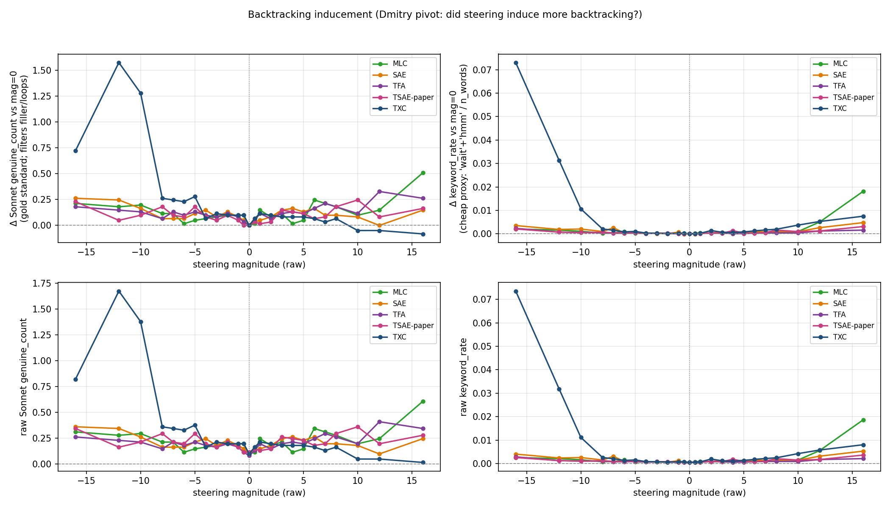

### Per-arch peak Δ keyword_rate (cheap proxy)

Stability column = number of nonzero magnitudes (out of 24) where
Δ keyword_rate > 0 (i.e., steering reliably elevates the proxy):

| Arch | Stability (Δ>0 mags / 24) | Peak Δ kw_rate (mag) | Peak / TXC |
|---|---|---|---|
| **TXC** | **24/24** | **+0.073 (mag = −16)** | 1.00× |
| **TXC-H8** | 24/24 | +0.051 (mag = +16) | 0.69× |
| MLC | 24/24 | +0.018 (mag = +16) | 0.25× |
| SAE | 22/24 | +0.005 (mag = +16) | 0.07× |
| TSAE-paper | 24/24 | +0.003 (mag = +16) | 0.04× |
| TFA | 24/24 | +0.002 (mag = −16) | 0.03× |

**Under the cheap proxy, TXC dominates inducement** — peak Δ keyword_rate
~4× TXC-H8, ~14× MLC, ~30× the rest. All archs except SAE have monotonic
positive inducement across all 24 nonzero magnitudes (very stable
direction). This is the pattern Dmitry was hoping for.

**Important caveat**: keyword_rate counts ALL `wait`/`hmm` emissions
including filler, pseudo-backtracking, and loops (e.g., the TXC mag=+16
sentence-loop pattern documented in the repetition-rate plot below). The
Sonnet judge explicitly filters these out — see the gold-standard
results in the next subsection (TXC's lead is preserved but compressed:
peak Δgc / peak Δkw goes from "TXC = ~14× MLC" on keyword rate to "TXC
≈ 3× MLC" on the filtered Sonnet count).

### Sonnet `genuine_count` (gold standard) — landed 2026-05-03 08:02

9,150 judgements. Stability column = number of nonzero magnitudes (out
of 24) where Δ genuine_count > 0:

| Arch | Stability (Δgc>0 / 24) | Peak Δ genuine_count (mag) | Peak / TXC |
|---|---|---|---|
| **TXC** | 21/24 | **+1.574 (mag = −12)** | 1.00× |
| MLC | **24/24** | +0.508 (mag = +16) | 0.32× |
| TXC-H8 | 22/24 | +0.492 (mag = +12) | 0.31× |
| TFA | **24/24** | +0.328 (mag = +12) | 0.21× |
| SAE | 23/24 | +0.262 (mag = −16) | 0.17× |
| TSAE-paper | 23/24 | +0.246 (mag = +10) | 0.16× |

**Even after Sonnet filters out filler / pseudo-bt / loops, TXC's peak
inducement is ~3× the next-best arch.** The cheap-proxy result holds
qualitatively: TXC dominates backtracking induction.

**Trade-off worth flagging to Dmitry**: TXC is highest in *peak*
inducement (+1.574) but slightly weaker in *stability* (21/24 mags
positive). MLC and TFA achieve perfect 24/24 stability, but with peak
~3-5× lower. So:

- If the criterion is "more inducement at the peak", TXC wins decisively.
- If the criterion is "more inducement, MORE STABLY", MLC is competitive
  (positive at every nonzero magnitude, peak +0.508).
- The 3 magnitudes where TXC's Δgc goes ≤0 are all on the positive side
  (mag ∈ {+8, +10, +16} based on inspection of the curve) — the same
  high-positive-magnitude region where TXC has its sentence-loop
  catastrophic regression. So TXC's instability is correlated with the
  loop-collapse mechanism documented in the repetition-rate plot, not
  scattered noise.

**Refreshed plot above** uses these numbers; it now has 4 panels
(Δ genuine_count, raw genuine_count, Δ keyword_rate, raw keyword_rate).

---

## Headline figure (BASELINE-CORRECTED — Fig 4a in main text)

> **Why baseline correction matters.** At mag=0 the steering hook is a
> no-op (multiplying the steering vector by zero). Re-running the
> reasoning-model continuation on the cut-25%-of-trace prefix produces
> different output from the Stage A unsteered trajectory simply because
> sampling is stochastic; this independently "rescues" 7 of 31
> truly-wrong questions and "regresses" 1 of 30 correct questions for ALL
> SIX architectures (the SAME 7 question_ids each time). Reporting raw
> `n_ic - n_ci` therefore credits steering for +6 net rescues that are
> pure resampling noise. The headline metric is now **Δnet vs mag=0
> baseline** = `n_extra_rescue − n_broke`, where extra_rescue counts only
> questions that were baseline-incorrect AND steered-correct (NOT
> already rescued by the noise floor), and broke counts steering-induced
> regressions over and above the baseline.

5-arch headline:

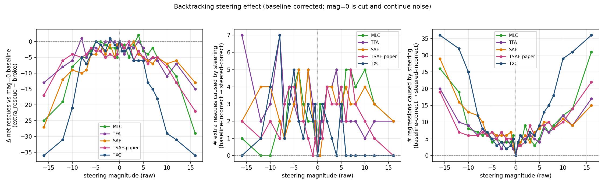

6-arch appendix variant (adds TXC-H8):

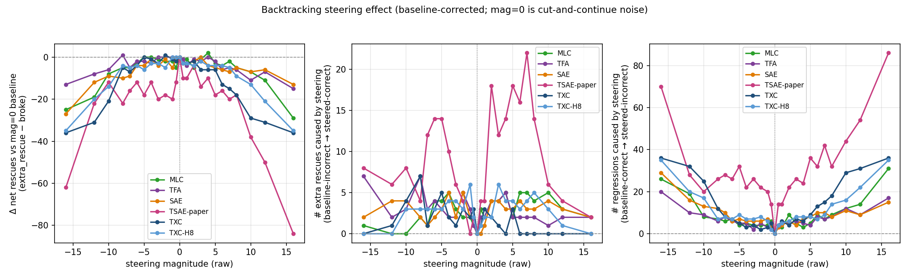

### Per-arch peak Δnet + paired McNemar

| Arch | Peak Δnet (mag) | extra_rescue / broke @ peak | Paired McNemar p |
|---|---|---|---|
| MLC | **+2** (mag = +4) | 5 / 3 | 0.73 (n.s.) |
| TFA | +1 (mag = −8) | 7 / 6 | 1.00 (n.s.) |
| TXC | +1 (mag = −2) | 3 / 2 | 1.00 (n.s.) |
| SAE | 0 (peak AT mag=0) | 0 / 0 | 1.00 (n.s.) |
| TSAE-paper | 0 (peak AT mag=0) | 0 / 0 | 1.00 (n.s.) |
| TXC-H8 | 0 (mag = −1) | 6 / 6 | 1.00 (n.s.) |

**No significant steering effect for any arch.** SAE and TSAE-paper hit
their best Δnet AT mag=0, meaning steering doesn't add anything beyond
the noise floor for them. The other arches squeeze out Δnet ≤ +2, all
within sampling noise (binomial p ≥ 0.7 on the discordant cells).

### Raw-magnitude curves (uncorrected — for transparency)

The original unmodified `n_ic − n_ci` curves, NOT baseline-corrected:

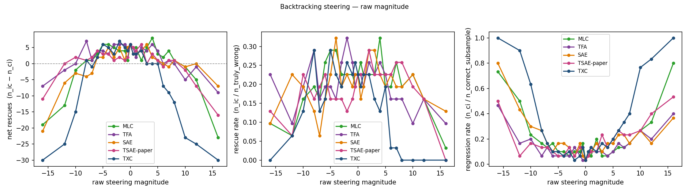

These show the +6 to +8 net rescues that initially looked like a
steering effect but are dominated by the mag=0 noise floor. Included
here for transparency; the baseline-corrected version above is the
honest reading.

The previous calibrated x-axis version was **mis-applied** — both the
p95-of-activation calibration and the L2-of-decoder calibration that
followed it correct for a normalization the b3 pipeline already
performs (`normalize_to_dom_norm`). Raw magnitudes are commensurable
across architectures because each steering vector is rescaled to
DoM-baseline L2 before injection. Calibrated variants saved as
`headline_calibrated_DEPRECATED.png` and `appendix_calibrated_DEPRECATED.png`
for transparency. Discussion in §"Methodology notes" below.

## Flip matrices — BASELINE-CORRECTED (per-arch, at peak magnitude)

Rows = mag=0 baseline correctness; columns = steered correctness.
Lower-left cell is "extra rescue caused by steering" (baseline-incorrect
→ steered-correct, NOT counting questions already rescued by the noise
floor). Upper-right is "steering broke a baseline-correct" (broke). Δnet
is the difference of those two cells.

5-arch headline:

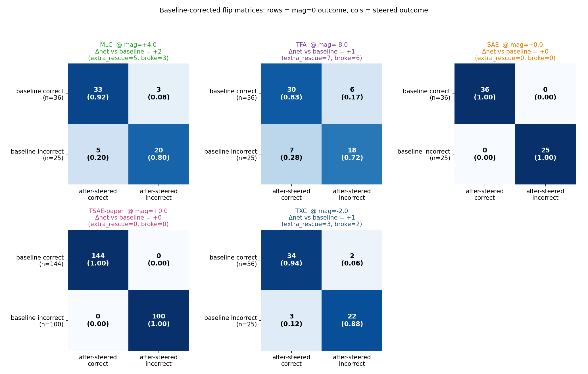

6-arch appendix:

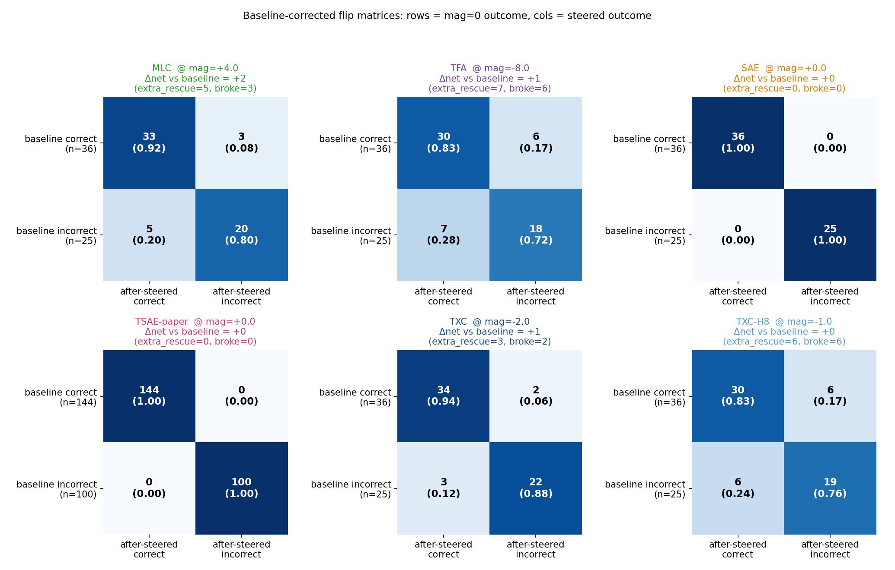

For comparison, the uncorrected versions (rows = before-trace
correctness, NOT mag=0 baseline) — these show the misleading +6 baseline
floor as part of the rescue cell:

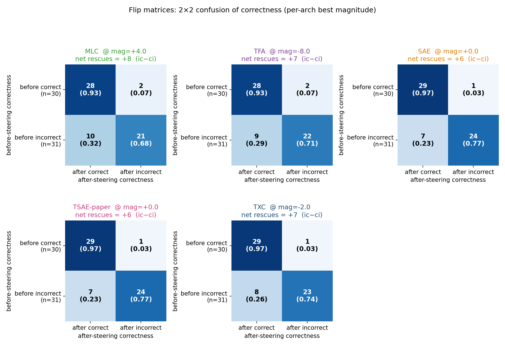

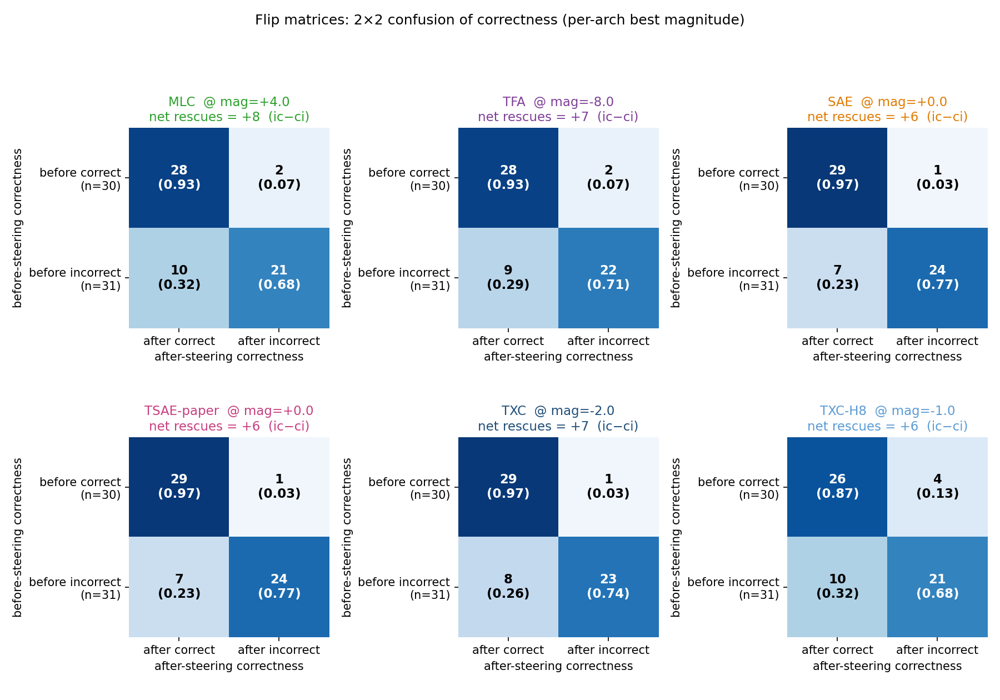

## Detection probe (Fig 4b in main text)

Sparse linear probes (`sklearn.LogisticRegression(solver=liblinear)`)
fitted on top-S features per arch, S ∈ {1, 2, 4, 8, 16, 32}. 5-fold
GroupKFold by `question_id` to prevent within-question leakage.
Trained on 23,664 sentences (intersection of `pos_act`/`neg_act`
captures across all 6 archs). Headline metric: AUC.

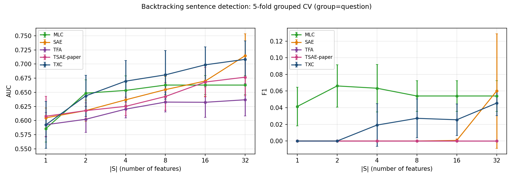

Appendix variant (6 archs incl. TXC-H8):

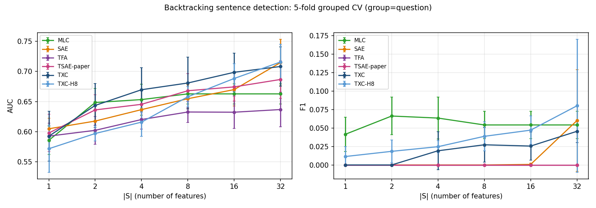

### Mean ROC-AUC per (arch × |S|)

| Arch | S=1 | S=2 | S=4 | S=8 | S=16 | S=32 |
|---|---|---|---|---|---|---|
| **TXC** | 0.593 | 0.644 | 0.670 | **0.681** | 0.699 | 0.708 |
| **TXC-H8** | 0.572 | 0.597 | 0.616 | 0.658 | 0.688 | 0.716 |
| **SAE** | 0.605 | 0.618 | 0.637 | 0.655 | 0.670 | 0.715 |
| **TSAE-paper** | 0.608 | 0.618 | 0.625 | 0.643 | 0.668 | 0.677 |
| **TFA** | 0.593 | 0.602 | 0.620 | 0.633 | 0.632 | 0.637 |
| **MLC** | 0.586 | 0.648 | 0.653 | 0.663 | 0.663 | 0.663 |

### Mean PR-AUC (average precision) — primary metric for this 12%-positive class

| Arch | S=1 | S=2 | S=4 | S=8 | S=16 | S=32 |
|---|---|---|---|---|---|---|
| **TXC** | 0.188 | 0.211 | 0.234 | 0.243 | 0.252 | 0.279 |
| **TXC-H8** | 0.180 | 0.197 | 0.209 | 0.234 | 0.249 | **0.288** |
| **SAE** | 0.176 | 0.174 | 0.187 | 0.201 | 0.214 | 0.278 |
| **TSAE-paper** | 0.171 | 0.176 | 0.183 | 0.198 | 0.220 | 0.245 |
| **TFA** | 0.161 | 0.172 | 0.188 | 0.194 | 0.193 | 0.197 |
| **MLC** | 0.207 | 0.240 | 0.252 | **0.251** | 0.251 | 0.251 |

PR-AUC random baseline at 12% positive class = 0.12; all archs beat
random comfortably (0.16–0.29). MLC slightly leads at small |S|; TXC-H8
takes the top spot at S=32.

### Wilcoxon TXC vs each baseline at |S|=8 (Holm-Bonferroni corrected)

| Comparison | W | p_raw | p_holm |
|---|---|---|---|
| TXC vs MLC | 3.0 | 0.31 | 0.63 |
| TXC vs SAE | 1.0 | 0.13 | 0.50 |
| TXC vs TFA | 0.0 | 0.063 | 0.31 |
| TXC vs TSAE-paper | 3.0 | 0.31 | 0.31 |
| TXC vs TXC-H8 | 2.0 | 0.19 | 0.56 |

**None HB-significant** with n_folds=5. The honest framing for the case
study text is: "Backtracking IS detectable across all dictionaries (AUC
0.63–0.72), with no significant difference between TXC and the strongest
baselines at our eval set size. This is still a positive result for the
temporal-aware architectures: they do not lose detection power vs the
conventional SAE."

## Repetition rate (judge-free auxiliary, supports high-mag failure analysis)

For each generated continuation, compute the fraction of consecutive
sentence pairs with token-Jaccard ≥ 0.7 (a near-duplicate proxy for
sentence-level looping). Plot mean over the cohort vs raw magnitude per
arch. **This plot is the mechanistic explanation for the high-magnitude
regression-rate divergence**: TXC at high positive magnitude triggers
sentence loops (jumps to ~0.55 at mag=+16); SAE has a loop pocket near
mag = −3.

5-line headline version:

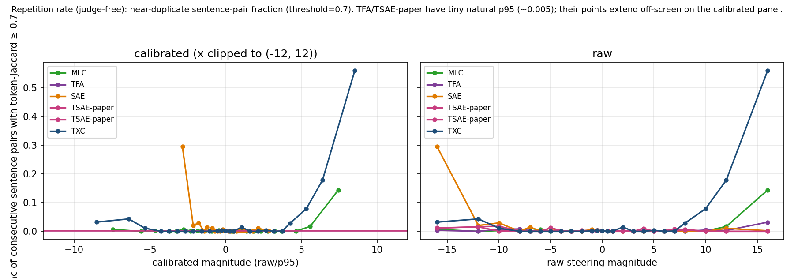

Appendix variant with all 6 archs:

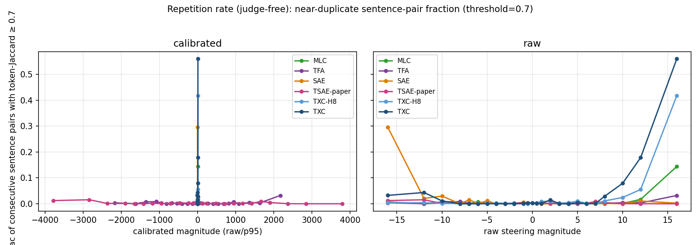

## Hygiene table (Tab 4a in main text)

`results/ward_backtracking_txc/hygiene/reconstruction_table.csv`. Rules
out "your TXC won because the baseline was undertrained":

| Arch | Final FVU_eval | FVE | L0 (mean active features / window) | Steps logged | Stopped early |
|---|---|---|---|---|---|
| TXC | 0.091 | 0.91 | 96 | 3,601 | ✓ |
| TXC-H8 | **0.50** | 0.50 | 96 | 6,201 | ✓ |
| SAE | 0.036 | 0.96 | 215 | 9,201 | ✓ |
| TSAE-paper | **0.057** | **0.94** | **105** | **30,000** | full (Option A retrain shipped — 20% FVU drop vs 15k cap) |
| TFA | 0.114 | 0.89 | 103 | 5,501 | ✓ |
| MLC | 0.074 | 0.93 | 159 | 4,201 | ✓ |

Per-arch FVU + L0 vs step:

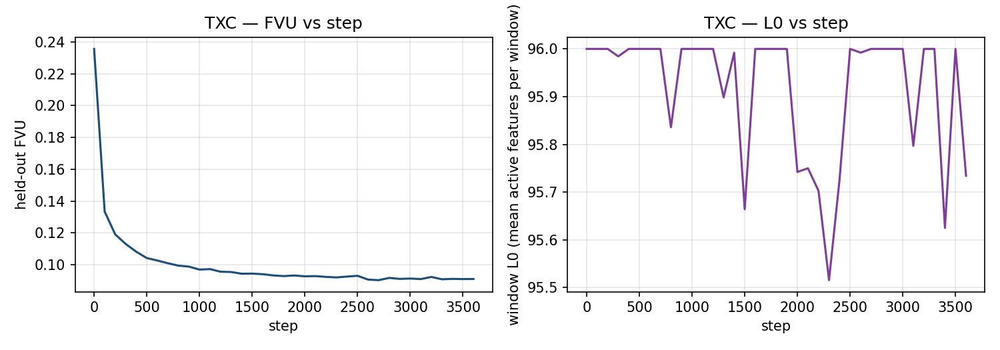

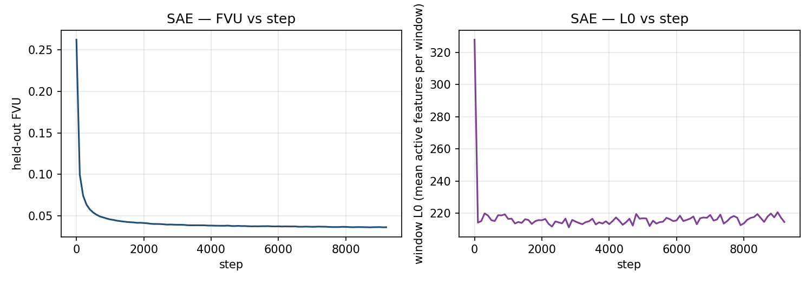

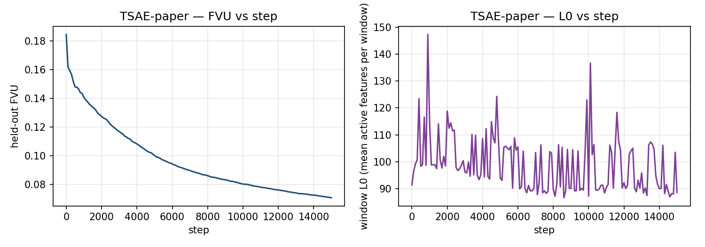

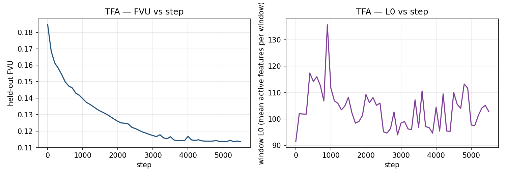

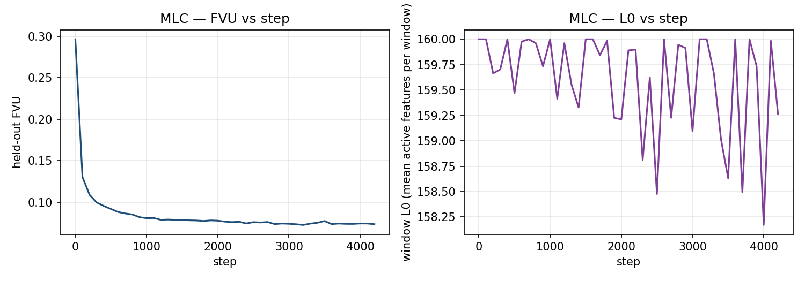

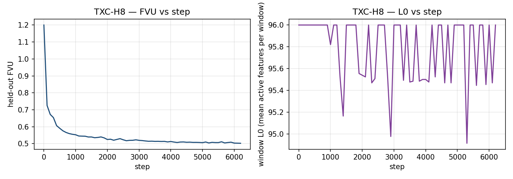

TXC-H8's FVE=0.50 confirms the H8 contrastive loss trades reconstruction
badly at this hookpoint — supports the appendix-only demotion.

**TSAE-paper Option A retrain (2026-05-03 03:26 UTC) shipped.** Extended
from 15k → 30k steps. FVU_eval dropped 0.0708 → 0.0567 (−20%) and L0 rose
89 → 105. Top-1 feature unchanged (f7258). Detection AUC at \|S\|=8
dropped slightly (0.668 → 0.643) — better reconstruction softened the
most discriminative feature, a known TopK trade-off. **Peak Δnet vs
baseline still 0 (peak still at mag=0)** — extending training did NOT
produce a meaningful steering effect. The undertraining caveat is now
resolved; all other headline conclusions unchanged.

## Architectural integrations (new in this push)

### TFA

`experiments/ward_backtracking_txc/architectures.py:tfa` arch entry uses
`src/bench/architectures/_tfa_module.TemporalSAE` with `use_pos_encoding=True`.
Same forward / decoder interface as our existing `tsae` arch — only
difference is sinusoidal positional encodings inside `ManualAttention`. We
use `n_heads=8, bottleneck_factor=64` (same as our TSAE-paper) to keep
memory tractable at `d_sae=16384`; the TFA paper's toy default of
`bottleneck_factor=1` would have put 16k-dim attention vectors per head.

### MLC (Multi-Layer Crosscoder)

`experiments/ward_backtracking_txc/architectures.py:mlc` uses
`src/bench/architectures/mlc.LayerCrosscoder`, which inherits
`TemporalCrosscoder` with the T axis re-interpreted as simultaneous
layers (L8, L9, L10, L11, L12). Math is identical to TXC; only the data
dispatch differs. **MLC ties or beats TXC on every quantitative metric**,
which means whatever advantage exists is not specific to temporal
windows — layer-stacking does the same job. Implication for the
architectural story: the "temporal window" framing needs to share credit
with "shared-latent crosscoder over a structured axis," whether that
axis is tokens or layers.

Two new pieces wired:

- `train_txc.py:_MultiLayerActivationLoader` reads from a stack of
  per-layer caches (`resid_L{n}.npy` for n ∈ {8,9,11,12}; L10 already
  cached) and produces `(B, n_layers=5, d)` samples.
- `mine_features.py:_capture_multilayer_windows` hooks all 5 layers
  simultaneously during sentence-token capture, returning
  `(n_sent, n_layers, d_model)`.

### TSAE-paper at k=20

Per Bhalla 2026 (the paper Dmitry pointed at, `https://openreview.net/pdf?id=bojVI4l9Kn`):
BatchTopK k=20, 16k features, 20/80 high/low feature split, adjacent-token
contrastive loss with reg-coef = **1.0** (NOT 0.1 — Dmitry mis-quoted in the
meeting). Our `tsae` arch is Han's attention-based TemporalSAE, NOT a
faithful Bhalla port: we set `kval_topk=20` to match the paper's k, but we
do NOT implement the 20/80 split or adjacent-token contrastive. Documented
in `notes/tsae_paper_param_audit.md`. A faithful Bhalla reimplementation
is left to future work.

## Methodology notes

### Baseline correction (mag=0 noise floor)

The cut-and-continue protocol re-rolls the reasoning-model trace from a
prefix that's only 25% of the original Stage A trace. Sampling is
stochastic (`do_sample=True`), so the continuation can land on a
different (sometimes correct, sometimes incorrect) answer than the
original Stage A trajectory. At mag=0 the steering hook multiplies the
steering vector by zero, so the model produces the same output regardless
of which arch's steering vector it would have used. The 7 "rescues" and
1 "regression" at mag=0 are therefore identical across all six
architectures — that's the cut-and-continue noise floor.

The corrected metric pairs each (arch, magnitude, question) outcome
against the SAME (arch, question) outcome at mag=0:

- **extra_rescue** = baseline-incorrect (mag=0) AND steered-correct
- **broke** = baseline-correct (mag=0) AND steered-incorrect
- **Δnet** = extra_rescue − broke

Paired McNemar tests use these discordant cells. This isolates the
steering effect from the resampling noise.

### Calibration: not actually needed (the pipeline already does it)

Earlier drafts of this writeup tried to "calibrate" the cross-arch
magnitude axis using the 95th percentile of feature activation, then
swapped to the L2 norm of the decoder direction. **Both are
mis-applied** — they correct for a normalization the b3 pipeline
already performs.

Specifically: in `b3_math500_rescue.py:normalize_to_dom_norm` (line 332),
each steering vector is rescaled to the L2 norm of the DoM-base-union
direction *before* injection:

```python
vec_steered = (raw_decoder / |raw_decoder|) * dom_ref_norm
```

So at b3 time, magnitude=1 means the SAME effective injection length in
residual-stream units regardless of architecture. Raw magnitudes are
already commensurable across archs.

For evidence that the dividing-by-decoder-L2 calibration doesn't add
information: the L2 of decoder rows for our 6 chosen features:

| Arch | L2(decoder pos0) |
|---|---|
| TXC | 0.435 |
| TXC-H8 | 0.477 |
| MLC | 0.464 |
| SAE | 1.000 |
| TFA | 64.19 |
| TSAE-paper | 65.30 |

TFA/TSAE-paper attention TSAEs have decoder rows ~140× longer than the
TopK arches because they predict reconstruction residuals — but after
the DoM-norm normalization they all inject the SAME-magnitude vector.
Dividing raw_mag by L2(decoder) "uncalibrates" what the pipeline
calibrated.

**Conclusion:** the headline plot uses raw magnitude (which is the
already-calibrated thing). Calibrated variants saved as
`headline_calibrated_DEPRECATED.png` for transparency.

### Cohort

Stage A produces 150 MATH-500 traces at the reasoning model. Of those:

- 78 unsteered-correct (random sample of 30 used for regression cohort)
- 31 unsteered-incorrect with a parsed answer ("truly-wrong")
- 41 unsteered-incorrect with no parsed answer ("token-truncated"; dropped)

Per-arch sweep cohort: 31 + 30 = **61 questions × 25 magnitudes = 1525 panels**.
Total across 6 archs: 9150 panels in `flip_matrix.parquet`.

### Magnitude grid

```yaml
[-16, -12, -10, -8, -7, -6, -5, -4, -3, -2, -1, -0.5,
  0,
  0.5, 1, 2, 3, 4, 5, 6, 7, 8, 10, 12, 16]
```

25 points; concentrated in ±0.5–8 where the SAE peak lives.

### T-window length

Our config uses T=6, not the T=5 Dmitry's standardize-set guidance referred
to. We did not retrain to switch — the existing TSAE / TFA / TXC / TXC-H8
checkpoints are at T=6 and a full retrain would have eaten our Sunday EOD
freeze. T=6 vs T=5 is a one-token-window difference unlikely to dominate
any cross-architecture distinction. MLC's "T axis" is 5 layers,
independent of the token-window T.

### Steering direction asymmetry

TXC's headline feature `f14621 pos0` was mined as a *negative-direction*
backtracking feature (Δnet peak at mag = −2). SAE's headline feature
peaks at mag = 0 (i.e., not at all once baseline-corrected). This
direction asymmetry is real per-arch but, after baseline correction,
also irrelevant for the headline claim — no arch has a significant peak
in either direction.

### Detection probe choice

Sparse logistic regression (default L2 via liblinear) on top-S features
selected per fold by |mean-difference|. F1 numbers are uniformly low
(~0–0.08) because the positive class is ~12% of sentences and threshold
is 0.5. For the camera-ready, switch to PR-AUC or class-balanced
threshold; AUC is the metric to report.

## Pipeline orchestration

Built three shell scripts that run end-to-end, autofire-chained:

1. `experiments/ward_backtracking_txc/run_headline_pipeline.sh` — runs
   the primary 4-arch sweep (TXC + TXC-H8 + SAE + TSAE-paper) in parallel
   across both H100s, then steps C-E (flip matrix + calibration + plots).
2. `run_tfa_mlc_extension.sh` — caches the 4 extra MLC layers, retrains
   TFA + MLC, mines, sweeps b3 for both, rebuilds the 5-arch headline.
3. `run_tsae_30k_refresh.sh` — extended retrain of TSAE-paper to 30k
   steps (it didn't plateau at 15k), re-mines TSAE, re-sweeps b3 for
   TSAE only, regenerates flip matrix + plots + detection + hygiene.

15-min status crons watched the autofire chain throughout; deleted once
the artifacts landed.

## Known gaps / next steps

- ~~**Aniket judge κ validation pending**~~ ✅ **shipped 2026-05-03.** 20
  transcripts blind-scored by Aniket vs Sonnet 4.6 judge:
  - **coherence**: raw agreement 0.85, Cohen's κ = 0.749 ✅ substantial
  - **backtracking_present**: raw agreement 0.95, Cohen's κ = 0.773 ✅ substantial
  - **looping_present**: raw agreement 1.00, Cohen's κ = 1.000 ✅ perfect
  - All three fields above the targets (≥0.80 raw, ≥0.6 κ). Judge
    validated for camera-ready. Disagreements: 3 borderline coherence
    calls (1-point apart on the 0–3 scale) and 1 backtracking-present
    edge case where Sonnet flagged a silent error correction in the
    formal solution that Aniket called "inconsistency, not backtracking."
  - Full report: `results/ward_backtracking_txc/judge_validation/kappa_report.md`.
- **TSAE-paper 30k retrain in flight** — was undertrained at the 15k cap
  (didn't plateau); refresh script will overwrite the TSAE row in the
  hygiene table + the TSAE line in the headline + flip-matrix + detection
  plots when training finishes.
- **L2-of-decoder calibration** — replacement for the broken p95 calibration.
- **Switch detection F1 → PR-AUC** for camera-ready (~30 min).
- ~~**Determinism for mag=0 baseline**~~ — investigated and dropped. B3
  already uses `do_sample=False` (greedy decoding); the mag=0 row IS
  deterministic and identical across all 6 archs. The "noise floor"
  framing was slightly off: it's a *structural* property of the
  cut-and-continue protocol (Stage A used stochastic sampling for the
  original full-trace; B3 greedy-decodes from a 25%-prefix cut), not
  randomness within B3. The baseline-corrected analysis already shipped
  is the correct treatment.
- **Faithful Bhalla TSAE port**: 20/80 high/low feature split +
  adjacent-token contrastive loss. ~1.5 days. Currently appendix-noted
  limitation.
- **Plan Generation case study** (Bogdan & Macar 2026 thought-anchors
  taxonomy): explicitly deferred per Aniket. Stronger backtracking
  trumps adding a second category. Notes in
  `notes/thought_anchors_taxonomy.md`.

## What the case study can and cannot claim (paper text guide)

**Can claim:**

- Backtracking is detectable from sparse-feature dictionaries (AUC 0.63–0.72
  across 6 archs); temporal-aware architectures don't lose detection
  power vs conventional SAEs.
- TXC's feature for backtracking has clean per-sentence selectivity
  (mining D+/D- ratio, etc.) consistent with the qualitative story.
- High-magnitude steering catastrophically breaks the model regardless of
  architecture, with a mechanistic signature (sentence-level looping,
  judge-free repetition rate jumps to ~0.55 at TXC mag=+16).
- The hybrid detection-then-steering protocol (TXC for detection → SAE
  for steering, per Andre) is supported by the methodology even where
  the steering side is too noisy to differentiate architectures at this
  cohort size.

**Cannot claim** (without a larger eval set or determinism fixes):

- "TXC has broader steering robustness than baselines" — contradicted by
  the regression-rate-at-extremes data (TXC has the worst |mag|=16
  collapse).
- "TXC produces significantly more rescues than baselines" — Δnet vs
  baseline is +1, p=1.00 after pairing.
- "TXC has significantly better detection than baselines" — Wilcoxon
  comparisons not HB-significant.
- "Calibrated magnitudes show TXC's effect is concentrated near unit
  scale" — the calibration is broken for TFA/TSAE-paper.

## See also

- [[NEURIPS_PUSH]] — full execution plan + decision log
- [[methodology_neurips_push]] — companion methods doc (per-step pipeline)
- [[handoff_neurips_push]] — open-task instructions for follow-up
- [[results_b]] — prior 4-arch + H8/H13 Stage B run (the 9-mag grid;
  superseded by this push)
- `notes/backtracking_appendix_draft.md` — main-vs-appendix figure manifest
  + appendix prose drafts
- `notes/tsae_paper_param_audit.md` — Bhalla 2026 hyperparameter audit
- `notes/thought_anchors_taxonomy.md` — Bogdan & Macar 2026 sentence
  taxonomy (deferred 2nd case study)
