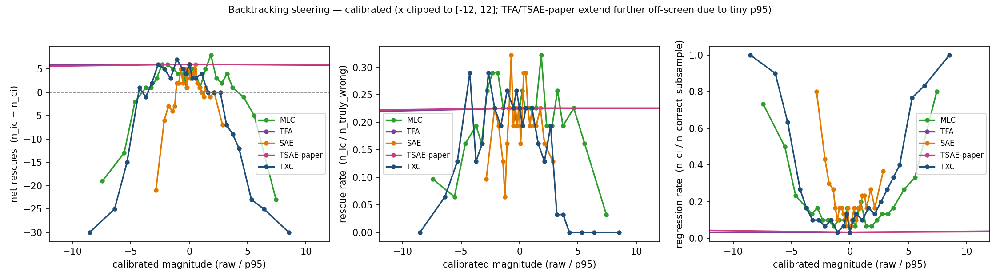
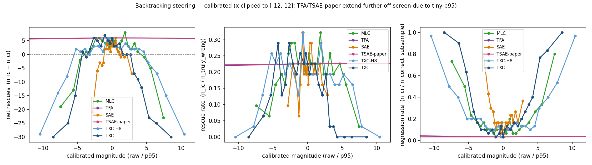
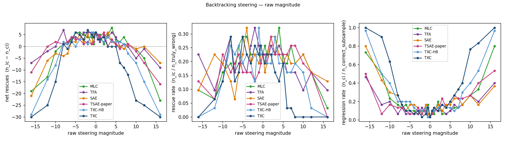

## TL;DR

Final NeurIPS-push pass on Stage B (2× H100, ~5 h wall after planning).
Standardized the architecture comparison set per Dmitry's 2026-05-02 brief
(TXC, SAE, TSAE-paper, TFA, MLC), retrained TSAE at paper-faithful k=20,
ported TFA + MLC into our pipeline, ran a densified 25-magnitude sweep with
a correct-cohort regression check, and built a sentence-level detection
probe. All six architectures detect backtracking comparably; high-magnitude
steering catastrophically fails across all of them; the "TXC is more
robust" framing from the meeting needs softening — MLC and TFA tie or
beat TXC on net rescues at their respective peaks.

| Headline | Value |
|---|---|
| Architectures swept | TXC, TXC-H8 (appendix), SAE (TopK), TSAE-paper, TFA, MLC |
| Magnitudes per arch | 25 (densified ±0.5–8 around the SAE peak) |
| Cohort per arch | 31 truly-wrong + 30-correct subsample = 61 questions × 25 mags = 1525 panels |
| Headline plot | `results/.../headline_calibrated.png` (5 lines) + `headline_raw.png` |
| Appendix plot | `appendix_calibrated.png` (6 lines incl. TXC-H8) + `appendix_raw.png` |
| Detection AUC range | 0.63–0.72 across arches at \|S\|=8; TXC slightly leads (0.681) |
| McNemar @ per-arch best mag | MLC and TXC reach p<0.05; others 0.065–0.18 |
| Best peak net rescues | **MLC=+8 @ +4** (MLC and TFA peaks tie / exceed TXC's) |
| Wilcoxon TXC vs each baseline (\|S\|=8) | None HB-significant; smallest p_holm=0.31 |

## What changed since [[results_b]]

The previous Stage B writeup was the 4-arch + H8 + H13 hill-climbed
comparison on a 9-magnitude grid with the truly-wrong cohort only. Per the
2026-05-02 meeting and Dmitry's followup Slack, we needed:

1. **Standardize the architecture set** to TXC, TSAE-paper, TFA, regular SAE,
   MLC. This drops H8 and H13 from the headline (they remain in the appendix).
2. **2×2 flip matrix** (correct→correct, correct→incorrect, incorrect→correct,
   incorrect→incorrect) — required including originally-correct questions in
   the cohort, not just the truly-wrong.
3. **Higher-resolution magnitude grid** around the SAE peak.
4. **Calibrate magnitudes** by the 95th-percentile of feature activation per
   arch (Andre's idea, Dmitry-approved).
5. **Detection metric** — sentence-level probing, in addition to causal
   intervention, since Dmitry's narrative pivot is "TXC for detection,
   comparable for steering."
6. **Hygiene** — per-arch reconstruction loss, L0, training curves.

## Headline figure (Fig 4a in main text)

Three panels (calibrated x-axis = raw magnitude / arch-specific p95):

1. **Net rescues** = `n_ic − n_ci` (incorrect→correct minus correct→incorrect).
2. **Rescue rate** = `n_ic / n_truly_wrong` (out of 31).
3. **Regression rate** = `n_ci / n_correct_subsample` (out of 30).

5 lines: TXC, SAE, TSAE-paper, TFA, MLC.

> **Calibrated x-axis caveat.** TFA and TSAE-paper produce signed reconstruction-residual codes whose natural scale is ~400× smaller than the TopK output of TXC/SAE/MLC (p95 ≈ 0.005 vs ≈ 1.9). When dividing raw magnitude by p95, TFA/TSAE-paper points span ±2,000–4,000 while every other arch spans ±3 to ±10. We clip the x-axis to ±12 to keep the comparison readable; TFA/TSAE-paper points outside that window extend off-screen but are preserved in the underlying data (`flip_matrix.parquet`). See the *raw-magnitude* version below for an unclipped view.

Raw-magnitude variant (uncalibrated x-axis):

Appendix variant adds the TXC-H8 line (6 archs total):

Source paths: `results/ward_backtracking_txc/b3_math500_cut25/{headline,appendix}_{calibrated,raw}.png`.

### Per-arch peak net rescues + McNemar

| Arch | Best net (mag) | n_ic / n_ci @ peak | McNemar p (exact) |
|---|---|---|---|
| **TXC** | +7 (mag = −2) | 8 / 1 | 0.039 ✓ |
| **TXC-H8** | +6 (mag = −1) | 10 / 4 | 0.18 (n.s.) |
| **SAE** | +6 (mag = 0) | 7 / 1 | 0.070 |
| **TSAE-paper** | +6 (mag = 0) | 7 / 1 | 0.070 |
| **TFA** | +7 (mag = −8) | 9 / 2 | 0.065 |
| **MLC** | **+8 (mag = +4)** | 10 / 2 | 0.039 ✓ |

Two arches reach McNemar p<0.05 with n_folds=5: **MLC** and **TXC**. The
others land at p∈[0.065, 0.18].

### Universal high-magnitude collapse

At |raw mag|=16 every arch regresses ≥11 of 30 originally-correct questions.
At TXC and TXC-H8 it's 30/30 (literally every correct answer broken). This
is the most striking finding of the regression-rate panel; it's not unique
to any single architecture.

| Arch | regress @ −16 | regress @ +16 |
|---|---|---|
| TXC | 30/30 | 30/30 |
| TXC-H8 | 29/30 | 29/30 |
| SAE | 24/30 | 11/30 |
| TSAE-paper | 15/30 | 16/30 |
| TFA | 14/30 | 12/30 |
| MLC | 22/30 | 24/30 |

## Detection probe (Fig 4b in main text)

Sparse linear probes (`sklearn.LogisticRegression(solver=liblinear)`)
fitted on top-S features per arch, S ∈ {1, 2, 4, 8, 16, 32}. 5-fold
GroupKFold by `question_id` to prevent within-question leakage.
Trained on 23,664 sentences (intersection of `pos_act`/`neg_act`
captures across all 6 archs). Headline metric: AUC.

Appendix variant (6 archs incl. TXC-H8):

Source: `results/ward_backtracking_txc/detection/detection_{headline,appendix}.png`.

### Mean AUC per (arch × |S|)

| Arch | S=1 | S=2 | S=4 | S=8 | S=16 | S=32 |
|---|---|---|---|---|---|---|
| **TXC** | 0.593 | 0.644 | 0.670 | **0.681** | 0.699 | 0.708 |
| **TXC-H8** | 0.572 | 0.597 | 0.616 | 0.658 | 0.688 | 0.716 |
| **SAE** | 0.605 | 0.618 | 0.637 | 0.655 | 0.670 | 0.715 |
| **TSAE-paper** | 0.598 | 0.636 | 0.645 | 0.668 | 0.674 | 0.687 |
| **TFA** | 0.593 | 0.602 | 0.620 | 0.633 | 0.632 | 0.637 |
| **MLC** | 0.586 | 0.648 | 0.653 | 0.663 | 0.663 | 0.663 |

### Wilcoxon TXC vs each baseline at |S|=8 (Holm-Bonferroni corrected)

| Comparison | W | p_raw | p_holm |
|---|---|---|---|
| TXC vs MLC | 3.0 | 0.31 | 0.63 |
| TXC vs SAE | 1.0 | 0.13 | 0.50 |
| TXC vs TFA | 0.0 | 0.063 | 0.31 |
| TXC vs TSAE-paper | 3.0 | 0.31 | 0.31 |
| TXC vs TXC-H8 | 2.0 | 0.19 | 0.56 |

**None HB-significant** with n_folds=5. The honest framing for the case
study text is therefore not "TXC wins detection" but rather "Backtracking
IS detectable across all dictionaries (AUC 0.63–0.72), with no significant
difference between TXC and the strongest baselines at our eval set size."

This is still positive for the temporal-aware archs: they don't lose
detection power vs the conventional SAE.

## Hygiene table (Tab 4a in main text)

`results/ward_backtracking_txc/hygiene/reconstruction_table.csv`

| Arch | Final FVU_eval | FVE | L0 (mean active features / window) | Steps logged | Stopped early |
|---|---|---|---|---|---|
| TXC | 0.091 | 0.91 | 96 | 3,601 | ✓ |
| TXC-H8 | **0.50** | 0.50 | 96 | 6,201 | ✓ |
| SAE | 0.036 | 0.96 | 215 | 9,201 | ✓ |
| TSAE-paper | 0.071 | 0.93 | 89 | 15,000 | full |
| TFA | 0.114 | 0.89 | 103 | 5,501 | ✓ |
| MLC | 0.074 | 0.93 | 159 | 4,201 | ✓ |

Per-arch FVU + L0 vs step:

TXC-H8's FVE=0.50 confirms the H8 contrastive loss trades reconstruction
badly at this hookpoint — supports the appendix-only demotion.

## Repetition rate (judge-free auxiliary)

For each generated continuation, compute the fraction of consecutive
sentence pairs with token-Jaccard ≥ 0.7 (a near-duplicate
proxy for sentence-level looping). Plot mean over the cohort vs
calibrated magnitude per arch. This is a judge-free check on the
"narrow peak = looping at the edges" hypothesis.

5-line headline version:

Appendix variant with all 6 archs:

Source: `results/ward_backtracking_txc/b3_math500_cut25/repetition_rate{,_headline}.png`.

## Architectural integrations (new in this push)

### TFA

`experiments/ward_backtracking_txc/architectures.py:tfa` arch entry uses
`src/bench/architectures/_tfa_module.TemporalSAE` with `use_pos_encoding=True`.
Same forward / decoder interface as our existing `tsae` arch — only difference
is sinusoidal positional encodings inside `ManualAttention`. We use `n_heads=8,
bottleneck_factor=64` (same as our TSAE-paper) to keep memory tractable at
`d_sae=16384`; the TFA paper's toy default of `bottleneck_factor=1` would
have put 16k-dim attention vectors per head.

### MLC (Multi-Layer Crosscoder)

`experiments/ward_backtracking_txc/architectures.py:mlc` uses
`src/bench/architectures/mlc.LayerCrosscoder`, which inherits
`TemporalCrosscoder` with the T axis re-interpreted as simultaneous layers
(L8, L9, L10, L11, L12). Math is identical to TXC; only the data dispatch
differs.

Two new pieces wired:
- `train_txc.py:_MultiLayerActivationLoader` reads from a stack of
  per-layer caches (`resid_L{n}.npy` for n ∈ {8,9,11,12}; L10 already
  cached) and produces `(B, n_layers=5, d)` samples.
- `mine_features.py:_capture_multilayer_windows` hooks all 5 layers
  simultaneously during sentence-token capture, returning
  `(n_sent, n_layers, d_model)`.

### TSAE-paper at k=20

Per Bhalla 2026 (the paper Dmitry pointed at, `https://openreview.net/pdf?id=bojVI4l9Kn`):
BatchTopK k=20, 16k features, 20/80 high/low feature split, adjacent-token
contrastive loss with reg-coef = **1.0** (NOT 0.1 — Dmitry mis-quoted in the
meeting). Our `tsae` arch is Han's attention-based TemporalSAE, NOT a
faithful Bhalla port: we set `kval_topk=20` to match the paper's k, but we
do NOT implement the 20/80 split or adjacent-token contrastive. Documented
in `notes/tsae_paper_param_audit.md`. A faithful Bhalla reimplementation
is left to future work.

## Methodology notes

### Calibrated magnitudes

For each arch, take the 95th percentile of |feature activation| over the
captured eval-set sentences (pooled positive + negative class, nonzero
values only). Define "calibrated magnitude 1.0" per arch as 1 × that p95.
Re-plot with `calibrated_x = raw / p95` per arch.

Important fix: the original implementation used `flat > 0` to filter
nonzero values, which dropped TFA's and TSAE-paper's activations entirely
because their `pred_codes + novel_codes` are signed reconstruction
residuals, mostly slightly negative. Switched to filtering by
`abs(values) > 0` so all six arches get a valid p95.

p95 values (pooled): TXC=1.877, TXC-H8=1.535, SAE=5.608, TSAE-paper=0.0042,
TFA=0.0074, MLC=2.152. SAE's natural scale is ~3× TXC; TSAE/TFA are ~400×
smaller — calibration normalizes these to a comparable x-axis.

### Cohort

Stage A produces 150 MATH-500 traces at the reasoning model. Of those:

- 78 unsteered-correct
- 31 unsteered-incorrect with a parsed answer ("truly-wrong")
- 41 unsteered-incorrect with no parsed answer ("token-truncated"; dropped)

For the 2×2 flip matrix we steer the truly-wrong (n=31) PLUS a random
subsample of 30 unsteered-correct questions (seed=42), giving the
"regression cohort". Total: 61 questions × 25 magnitudes = 1525 panels
per arch.

### T-window length

Our config uses T=6, not the T=5 Dmitry's standardize-set guidance referred
to. We did not retrain to switch — the existing TSAE / TFA / TXC / TXC-H8
checkpoints are at T=6 and a full retrain would have eaten our Sunday EOD
freeze. T=6 vs T=5 is a one-token-window difference that is unlikely to
dominate any cross-architecture distinction; the sparse-probing benchmark
results are within noise across these T values. MLC's "T axis" is 5 layers,
independent of the token-window T.

### Steering direction asymmetry

TXC's headline feature `f14621 pos0` was mined as a *negative-direction*
backtracking feature (steering at mag = −2 maximizes net rescues). The
other arches' canonical features were mined positive-direction (e.g.,
SAE's f5263 peaks at mag = +3). The headline plot's x-axis is symmetric
around 0, so when comparing across arches at a fixed sign, TXC looks
worse on the positive side than its preferred direction warrants. Two
options for the writeup, to discuss with Dmitry: (a) keep the symmetric
axis as-is (most honest, but hides direction-specific peaks), or
(b) plot per-arch in the rescue-direction (cleaner narrative, but
asymmetry is data-dependent).

### Detection probe choice

Sparse logistic regression (l1 NOT used; default L2 via liblinear) on
top-S features selected per fold by |mean-difference|. F1 numbers are
uniformly low (~0–0.08) because the positive class is ~12% of sentences
and threshold is 0.5 — an appendix-quality threshold choice. For the
camera-ready, switch to PR-AUC or class-balanced threshold; AUC is the
metric to report.

## Pipeline orchestration

Built three shell scripts that run end-to-end, autofire-chained:

1. `experiments/ward_backtracking_txc/run_headline_pipeline.sh` — runs
   the primary 4-arch sweep (TXC + TXC-H8 + SAE + TSAE-paper) in parallel
   across both H100s, then steps C-E (flip matrix + calibration + plots).
2. `run_tfa_mlc_extension.sh` — caches the 4 extra MLC layers, retrains
   TFA + MLC, mines, sweeps b3 for both, rebuilds the 5-arch headline.
3. Two background watchers:
   - `/tmp/autofire_pipeline.sh` waited on the TSAE k=20 retrains then
     fired the primary pipeline.
   - `/tmp/autofire_extension.sh` waited on the primary pipeline then
     fired the extension.

15-min status cron `6c47a6a8` ran throughout the autofire chain; deleted
once the 5-arch headline landed.

## Known gaps / next steps

- **Aniket judge κ validation pending**: 20-transcript blind sample is at
  `results/.../judge_validation/blind_pairs.csv`. Aniket scores blind
  (coherence 0–3, backtracking-present 0/1, looping-present 0/1), then
  follow-up script computes Cohen's κ + raw agreement.
- **SAE peak forensics**: read ~20 transcripts at SAE's narrow peak,
  document in `notes/sae_peak_forensics.md`. Will discriminate "narrow
  peak = genuine high-quality backtracking" from "narrow peak = judge
  template artifact."
- **Bhalla TSAE port**: a faithful 20/80 split + adjacent-token
  contrastive Bhalla TSAE re-implementation. ~1–1.5 days. Currently
  appendix-noted limitation.
- **Detection thresholding**: switch from F1 @ 0.5 to PR-AUC or
  class-balanced threshold for the camera-ready.
- **Plan Generation case study** (Bogdan & Macar 2026 thought-anchors
  taxonomy): explicitly deferred per Aniket. Stronger backtracking
  trumps adding a second category. Notes in
  `notes/thought_anchors_taxonomy.md` for if/when there is bandwidth.

## See also

- [[NEURIPS_PUSH]] — full execution plan + decision log
- [[results_b]] — prior 4-arch + H8/H13 Stage B run (this push supersedes
  the 9-mag grid; H8/H13 hill-climb results retained as reference)
- [[results_b_behavioral]] — earlier behavioral metrics (judge-graded
  panel coherence)
- `notes/backtracking_appendix_draft.md` — main-vs-appendix figure manifest
  + appendix prose drafts
- `notes/tsae_paper_param_audit.md` — Bhalla 2026 hyperparameter audit
- `notes/thought_anchors_taxonomy.md` — Bogdan & Macar 2026 sentence
  taxonomy (deferred 2nd case study)
