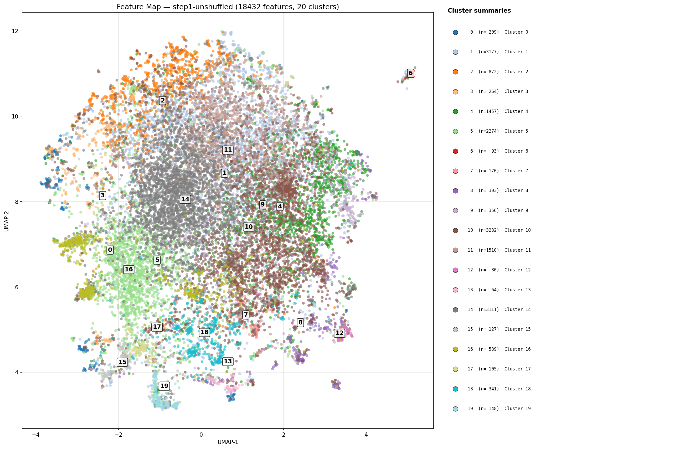
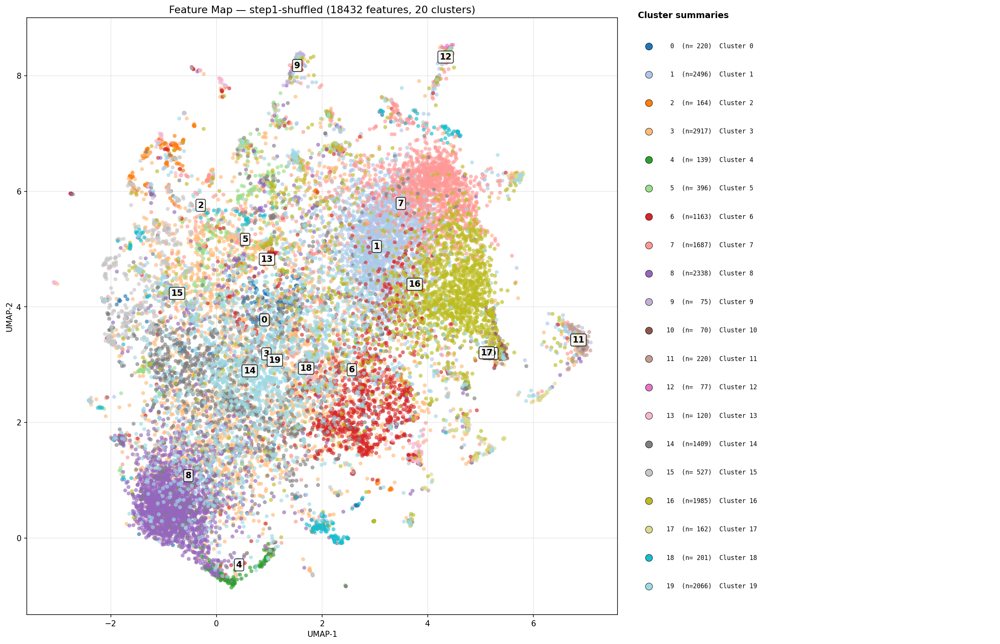
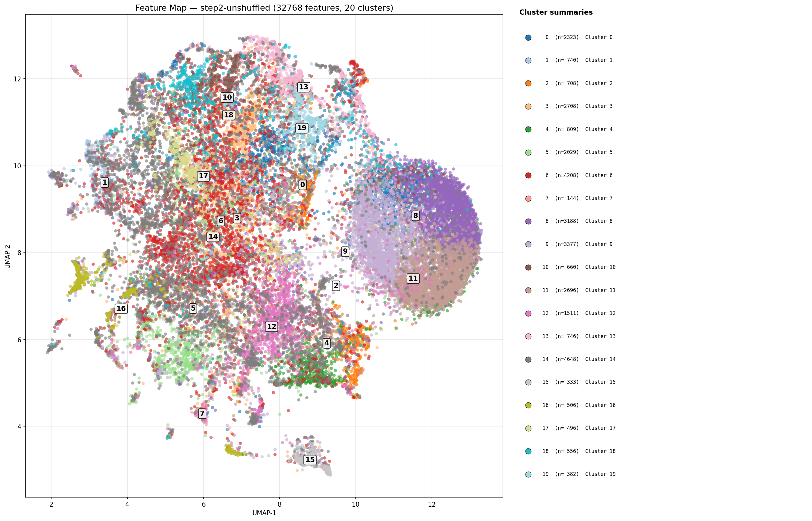
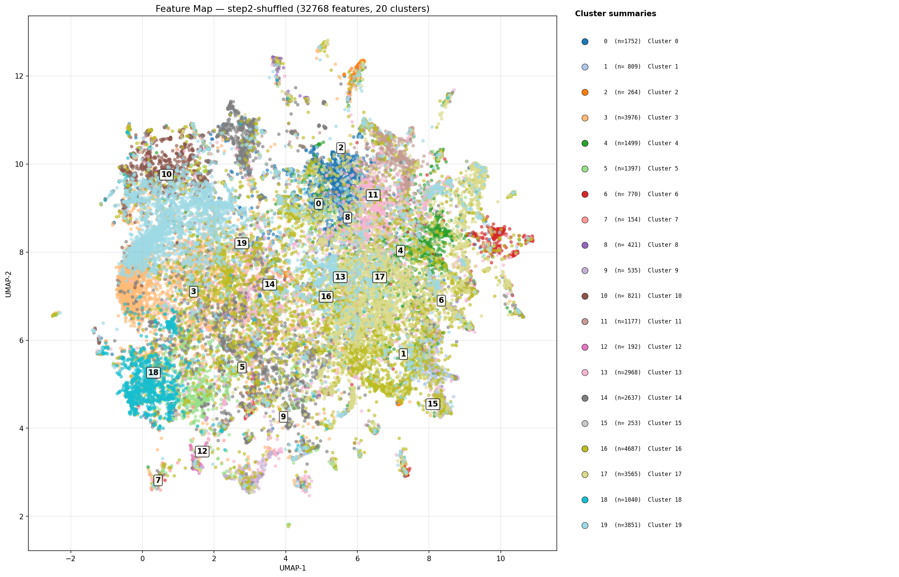

## Sprint Feature Geometry Results — Temporal Crosscoder Decoder Clustering

First experimental results from the NeurIPS/ICML exploration sprint.
Tests whether the temporal crosscoder (TXCDRv2) discovers genuinely
temporal feature structure by comparing decoder direction geometry
across shuffled and unshuffled conditions on two (model, dataset) pairs.

### Research question

Does the TXCDR's feature geometry — the clustering pattern of its
learned decoder directions — depend on temporal structure in the data,
or is it an architectural artifact of the shared-latent window?

### Experimental setup

**2x2 design:**

| | unshuffled (natural order) | shuffled (temporal order destroyed) |
|---|---|---|
| **Gemma 2B + FineWeb** (web text) | replication of [[nlp_feature_map\|Andre's feature map result]] | temporal control |
| **DeepSeek-R1-Distill-8B + GSM8K** (reasoning traces) | extension to thinking model | temporal control |

**Architecture:** TXCDRv2 (crosscoder) with k=100, T=5 window, 8x
expansion factor.

**Subject models:**
- `gemma-2-2b` — d_model=2304, d_sae=18,432, layer 13 (mid-residual),
  24,000 FineWeb sequences × 32 tokens, forward-mode activation caching.
- `deepseek-r1-distill-llama-8b` — d_model=4096, d_sae=32,768, layer 12
  (~37% depth), 1,000 GSM8K reasoning traces × 1,024 generated tokens,
  generate-mode activation caching with `<think>` prompt template.

**Shuffle control:** `shuffle_within_sequence=True` randomly permutes the
token order within each T-token window before feeding it to the
architecture. Destroys local temporal structure while preserving per-token
marginal distributions. Applied at data-load time so both training and
evaluation see the same shuffled data.

**Baselines trained alongside (same sweeps):** TopKSAE (single-token),
Stacked SAE T=5 (independent per-position SAEs).

**Clustering pipeline:** decoder directions (d_sae vectors of dimension
d_model) averaged across T positions, L2-normalized → PCA to 50
components → UMAP to 2D (cosine metric, n_neighbors=15) → KMeans with 20
clusters. Same pipeline as Andre's original analysis.

**Autointerp:** top 30 features per checkpoint labeled via Claude Haiku
4.5 with one-sentence explanations. Scoring disabled (HypotheSAEs
fidelity scoring is the paper-version TODO).

### Results — feature map plots

#### Step 1: Gemma 2B + FineWeb

**Unshuffled:**

[Interactive HTML (hover for feature labels)](../../reports/step1-gemma-replication/feature_map_step1-unshuffled.html)

- Moderately structured connected mass with peripheral islands.
- Three megaclusters (1, 10, 14, each ~3k features) dominate the core,
  absorbing ~52% of all features.
- Some visible separation at periphery (cluster 2, 6, 12).
- PCA explained variance: 7.3% at 50 components.

**Shuffled:**

[Interactive HTML (hover for feature labels)](../../reports/step1-gemma-replication/feature_map_step1-shuffled.html)

- Similar overall shape — connected mass with peripheral islands.
- Cluster sizes more uniform (largest: 2,917 vs 3,232 unshuffled).
- No dramatic geometric change from unshuffled.
- PCA explained variance: 6.8%.

**Interpretation:** shuffling had a *smaller* effect on Gemma+FineWeb
than on DeepSeek, but it's not zero. The unshuffled megacluster 10
(n=3,232) has no shuffled analogue of that size, and the overall cluster
concentration drops. FineWeb at 32-token windows has *some* local
temporal structure (it's still natural language), just much less than
multi-step reasoning traces. This is not a null result — it's a weaker
temporal signal, consistent with **temporal sensitivity scaling with the
temporal richness of the data.**

#### Step 2: DeepSeek-R1-Distill + GSM8K reasoning traces

**Unshuffled:**

[Interactive HTML (hover for feature labels)](../../reports/step2-deepseek-reasoning/feature_map_step2-unshuffled.html)

- **Visibly more structured** than Step 1. Clear separated sub-structures.
- Large dense island on the right (cluster 6, n=4,208) well-separated
  from the main mass. Another dense region (clusters 9, 14) overlaps it.
- Left side has fragmented, elongated arms with visible gaps between
  cluster groups.
- Much more geometric structure than either Gemma condition.
- PCA explained variance: 8.7%.

**Shuffled:**

[Interactive HTML (hover for feature labels)](../../reports/step2-deepseek-reasoning/feature_map_step2-shuffled.html)

- **Noticeably more diffuse.** The large separated island on the right is
  gone.
- Embedding is a connected archipelago — internal texture but no dramatic
  cluster separation.
- Dominant clusters are spatially smeared rather than forming distinct
  islands.
- PCA explained variance: 8.9%.

**Interpretation:** the unshuffled condition has clearer cluster
separation that *partially dissolves* under shuffling — the direction the
temporal-structure hypothesis predicts. But the contrast is not as
dramatic as a full "structure → uniform cloud" collapse, and UMAP
embeddings are seed-dependent. **Quantitative metrics (silhouette score,
cluster entropy) are needed before calling this effect robust.** The
visual evidence is suggestive, not conclusive.

**Critical control needed:** if a TopKSAE baseline trained on the same
DeepSeek data also shows the isolated right-side island, the structure
is a property of the data/layer, not TXCDR's temporal inductive bias.
TopKSAE checkpoints exist from the same sweep — running feature_map on
them is the gate before scaling autointerp.

### NMSE results (from the sweep)

Reconstruction loss across all conditions (10,000 training steps per
architecture, single seed):

| arch | Gemma unshuf | Gemma shuf | DeepSeek unshuf | DeepSeek shuf |
|---|---|---|---|---|
| TopKSAE | 0.0202 | 0.0203 | 0.2089 | 0.2088 |
| Stacked T=5 | 0.0574 | 0.0205 | 0.2124 | 0.2117 |
| TXCDR T=5 | 0.0737 | 0.0323 | *not yet checked* | *not yet checked* |

**TopKSAE** is invariant to shuffling (expected — single token, no
window). Both multi-token architectures showed NMSE inversion on Gemma
(shuffled *better* than unshuffled), likely a short-sequence artifact at
seq_len=32; this gap disappears on DeepSeek at seq_len=1024.

NMSE is secondary to the feature geometry result for the sprint thesis
("qualitatively different features" rather than "lower reconstruction
loss").

### Headline finding (provisional — pending quantitative validation)

The cross-model contrast is the main result:

1. **Temporal sensitivity scales with temporal richness of the data.**
   FineWeb (web text, 32-token windows) shows a weak shuffle effect.
   GSM8K reasoning traces (1024-token `<think>` blocks) show a stronger
   one. This is not a binary "architectural vs temporal" — it's a
   gradient, with more temporally structured data producing more
   temporally sensitive features.

2. **On reasoning traces (DeepSeek+GSM8K):** TXCDR feature geometry has
   visibly clearer cluster separation unshuffled than shuffled. The large
   island in the unshuffled plot partially dissolves under shuffling.

3. **The temporal crosscoder's value proposition is data-dependent.** It
   discovers richer, more organized features when the data contains
   genuine multi-token temporal patterns, and the temporal nature of
   those features is verifiable via the shuffle control.

**Caveats:** (a) visual UMAP differences are seed-dependent — need
silhouette scores / cluster entropy to make this robust; (b) the
TopKSAE control on DeepSeek hasn't been run yet — if SAE shows the
same island, the structure is data-driven, not architecture-driven.

### Open questions

1. **What are the features in the large isolated DeepSeek-unshuffled
   cluster?** Only 30 of 32,768 features have Claude labels. Scaling
   autointerp to ~5,000 features would give enough coverage to label
   every major cluster. Cost: ~$20 on Claude Haiku. Do the separated
   clusters correspond to reasoning-specific concepts (backtracking, case
   analysis, arithmetic steps, `Wait,`/`Hmm` rethinking tokens)?

2. **Is the shuffle effect quantifiable?** Visual comparison suggests
   partial dissolution. Silhouette scores, cluster entropy, and temporal
   MI curves would give numerical evidence. All three are already
   implemented in `src/shared/temporal_metrics.py` but weren't computed
   for these runs (the `encode()` method isn't wired on the current
   ArchSpec — see [[SPRINT_PIPELINE]] section 9).

3. **What does the SAE baseline look like on DeepSeek?** Andre showed
   SAE-vs-TXCDR on Gemma. The same comparison on DeepSeek would confirm
   that the geometric structure is TXCDR-specific, not just a property of
   richer data. TopKSAE checkpoints exist from the sweep — running
   feature_map on them is one sbatch command.

4. **Does more training help?** The current sweeps used 10,000 steps. The
   Stacked SAE NMSE anomaly on Gemma (shuffled much better than
   unshuffled) suggests possible under-training on correlated data. A
   longer 30,000-step run might change the geometry and NMSE picture.

5. **Deeper or shallower layers?** Current runs use mid-residual layers
   (Gemma L13, DeepSeek L12). Andre also cached L25 (Gemma) and L24
   (DeepSeek). Do later layers show more or less temporal structure?

6. **Venhoff et al. reasoning behavior taxonomy.** Their dataset labels
   reasoning traces with ~10-20 behavior categories (backtracking,
   uncertainty estimation, case analysis). Do the TXCDR cluster
   boundaries align with those categories? Requires integrating their
   annotation pipeline.

7. **2×3 extension — Gemma+Stack as the H3 rule-out cell.** The current
   2-cell comparison varies model, data, and inference mode
   simultaneously. Adding Gemma+Stack (forward mode) isolates the
   data-modality axis within a single model. Pre-registration with
   hypotheses, metrics, and predicted orderings in
   [[sprint_coding_dataset_plan]].

### Files

**Feature maps (step 1 — Gemma + FineWeb):**
- `reports/step1-gemma-replication/feature_map_step1-unshuffled.png`
- `reports/step1-gemma-replication/feature_map_step1-unshuffled.html`
- `reports/step1-gemma-replication/feature_map_step1-shuffled.png`
- `reports/step1-gemma-replication/feature_map_step1-shuffled.html`
- `reports/step1-gemma-replication/autointerp/step1-unshuffled/feat_*.json`
- `reports/step1-gemma-replication/autointerp/step1-shuffled/feat_*.json`

**Feature maps (step 2 — DeepSeek + GSM8K):**
- `reports/step2-deepseek-reasoning/feature_map_step2-unshuffled.png`
- `reports/step2-deepseek-reasoning/feature_map_step2-unshuffled.html`
- `reports/step2-deepseek-reasoning/feature_map_step2-shuffled.png`
- `reports/step2-deepseek-reasoning/feature_map_step2-shuffled.html`
- `reports/step2-deepseek-reasoning/autointerp/step2-unshuffled/feat_*.json`
- `reports/step2-deepseek-reasoning/autointerp/step2-shuffled/feat_*.json`

**Sweep results:**
- `results/nlp/step1-unshuffled/results_*.json`
- `results/nlp/step1-shuffled/results_*.json`
- `results/nlp/step2-unshuffled/results_*.json`
- `results/nlp/step2-shuffled/results_*.json`

**Checkpoints (on Trillium $SCRATCH only):**
- `results/nlp/step{1,2}-{un,}shuffled/ckpts/crosscoder__*.pt`
- `results/nlp/step{1,2}-{un,}shuffled/ckpts/topk_sae__*.pt`
- `results/nlp/step{1,2}-{un,}shuffled/ckpts/stacked_sae__*.pt`

**Cached activations (on Trillium $SCRATCH only):**
- `data/cached_activations/gemma-2-2b/fineweb/` (14 GB)
- `data/cached_activations/deepseek-r1-distill-llama-8b/gsm8k/` (32 GB)

**Pipeline docs:** [[SPRINT_PIPELINE]]
