## Bill's uncoupled HMM (three-arch + HMM-denoising benches)

Mathematical specification of the data generation pipeline used by Bill's
synthetic benchmark on `origin/bill-benchmarking-synthetic`. Source code:
`src/temporal_bench/data/markov.py`, `src/temporal_bench/data/pipeline.py`,
`src/temporal_bench/data/toy_model.py`. Both of Bill's benches share the
same factorial-2-state-Markov structure; they differ only in (i) number of
features, (ii) per-feature ρ, and (iii) emission noise. This doc is the
companion to [[Synthetic-Benchmark-Report]] (Bill's empirical writeup) and
the parallel `docs/dmitry/case_studies/coupled_features/hmm_spec.md` for
Han's coupled-features bench.

The model the SAE/TXC sees is `x_t ∈ R^{d_model}` for `t = 1, …, T`. The
generator produces `n_features` *independent* 2-state Markov chains,
optionally adds emission noise, samples per-firing magnitudes, and embeds
into `d_model` via a fixed random feature dictionary. Unlike Han's exp 1c3
there is **no coupling matrix** — every feature is its own observable, and
the only "feature recovery" axis is decoder cosine vs the `n_features`
dictionary directions.

## The two bench variants

Bill ran two related sweeps with different parameter choices:

| field | three-arch (Fig 5/6/7) | HMM denoising (Fig 8/9) |
|---|---|---|
| script | `scripts/run_three_arch_sweep.py` | `scripts/run_hmm_denoising_sweep.py` |
| n_features | 128 | 40 |
| d_model | 256 | 80 |
| d_sae | 128 (= n_features) | 80 (= 2 × n_features) |
| π | 0.05 | 0.15 |
| ρ | shared, swept ∈ {0.0, 0.6, 0.9} | heterogeneous: 10 features each at {0.1, 0.4, 0.7, 0.95} |
| emissions | deterministic (`p_A=0, p_B=1`) | stochastic (`p_A=0, p_B=0.625`) |
| T (window) | swept ∈ {2, 5} | swept ∈ {2, 3, 4, 5, 6, 8, 10, 12} |
| k (per-token) | swept ∈ {2, 5, 10, 25} | swept ∈ {1, 3, 5} |
| seed | 42 | 42 |

> **Discrepancy note.** Bill's writeup ([[Synthetic-Benchmark-Report]],
> Setups section) lists `n_features=40, d_model=80, π=0.15` under the
> three-arch sweep heading, but the actual `run_three_arch_sweep.py` script
> uses 128 / 256 / 0.05, and `results/three_arch_sweep/sweep_results.json`
> was generated with those values. The 40 / 80 / 0.15 numbers describe the
> HMM denoising sweep. We treat the script defaults as authoritative.

## Step 1 — `n_features` independent 2-state Markov chains

For each `k ∈ {1, …, n_features}`, the binary chain `h_k(t) ∈ {0, 1}` evolves
as a 2-state Markov chain *independent of all other chains*. The chains use
the same `(π, ρ)` parameterization as Han's exp 1c3 (pi-rho convention,
which is equivalent to the reset-process `λ = 1−ρ, p = π` in Han's code).

The per-chain 2×2 transition matrix (rows = `from`, cols = `to`,
`0 = off, 1 = on`) is:

```
T = [[1 − β,  β  ],     where  β = π (1 − ρ)         [P(off→on)]
     [1 − α,  α  ]]            α = ρ (1 − π) + π     [P(on→on)]
```

Implementation in `src/temporal_bench/data/markov.py::pi_rho_to_transition`.
Initial distribution = stationary, i.e. `P(h_k(0) = 1) = π`.

The chains are independent, so the joint hidden state lives in
`{0, 1}^{n_features}` with joint transition matrix
`T_joint = ⊗_k T_k`. The joint chain is never materialised — chains are
sampled component-wise.

### Three-arch sweep: shared ρ across all features

For `ρ ∈ {0.0, 0.6, 0.9}` and `π = 0.05`, the three transition matrices
the sweep cycles through:

**ρ = 0.0** (i.i.d. baseline): `α = 0.05, β = 0.05`

```
T = [[0.95, 0.05],
     [0.95, 0.05]]
```

**ρ = 0.6**: `α = 0.62, β = 0.02`

```
T = [[0.98, 0.02],
     [0.38, 0.62]]
```

**ρ = 0.9**: `α = 0.905, β = 0.005`

```
T = [[0.995, 0.005],
     [0.095, 0.905]]
```

All 128 chains share the same matrix in any given run.

A 10-feature × 64-step sample at the three ρ values, drawn from the
actual generator (`generate_markov_support`):

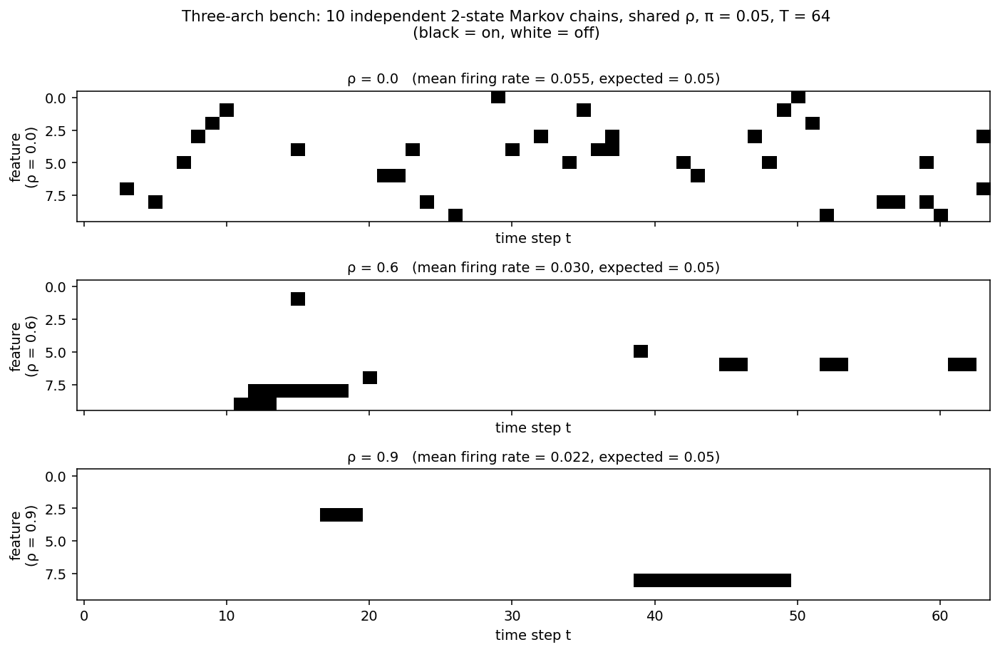

ρ = 0.0 looks like scattered iid Bernoulli salt-and-pepper. ρ = 0.6 has
visible clumping (typical run length ≈ 1/(1−α) ≈ 2.6 steps once on).
ρ = 0.9 has only a couple of long runs across all 10 chains in a 64-step
window — typical run length ≈ 10 steps. The reported "mean firing rate"
in each panel is the empirical fraction of "on" cells; expected from
stationary is `π = 0.05` (small-sample noise around that).

### HMM denoising sweep: heterogeneous per-feature ρ

The 40 features are partitioned into 4 groups of 10, one ρ per group:
`ρ ∈ {0.1, 0.4, 0.7, 0.95}`. Shared `π = 0.15`.

Per-group transition matrices:

| group | ρ | α = ρ(1−π) + π | β = π(1−ρ) | T |
|---|---:|---:|---:|---|
| A | 0.10 | 0.235 | 0.135 | `[[0.865, 0.135], [0.765, 0.235]]` |
| B | 0.40 | 0.49 | 0.09 | `[[0.91, 0.09], [0.51, 0.49]]` |
| C | 0.70 | 0.745 | 0.045 | `[[0.955, 0.045], [0.255, 0.745]]` |
| D | 0.95 | 0.9575 | 0.0075 | `[[0.9925, 0.0075], [0.0425, 0.9575]]` |

Implementation: `generate_markov_support_hetero` in
`src/temporal_bench/data/markov.py`.

40-chain sample (10 per group) at T = 64 from the actual
`generate_markov_support_hetero` generator:

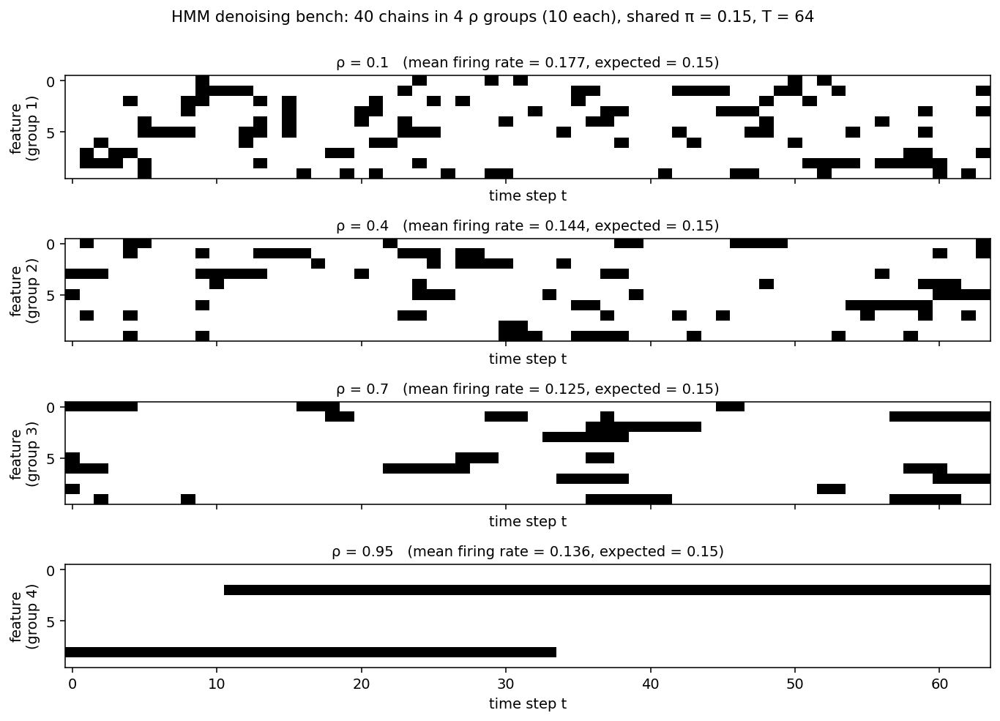

The four panels make the role of ρ visually clear: the ρ = 0.95 group
(group 4) has only 2 of 10 chains turn on at all in a 64-step window,
but each fires for ~30 steps continuously — the temporal information
density per "event" is enormous. The ρ = 0.1 group (group 1) is dense
salt-and-pepper at the same expected firing rate (mean ≈ 0.15) — the
*same* total information content, but it's spread out over short
events. A position-independent encoder gets the same per-token signal
in both panels; a window encoder of length T = 8 sees ~7-8 hidden-on
tokens of evidence per "on" event in group 4 vs basically 1 per event
in group 1.

## Step 2 — Observed support (deterministic vs stochastic emission)

Define the observed support `s_k(t) ∈ {0, 1}` per feature. There are two
cases.

### Three-arch: `s = h` (deterministic)

`p_A = 0, p_B = 1`, so the observation equals the hidden state directly
(no emission noise). The Markov chains are observed perfectly.

### HMM denoising: stochastic emission with asymmetric noise

`p_A = 0, p_B = 0.625` per emission, so

```
s_k(t) | h_k(t) = 0  ~  Bernoulli(0)        =  always 0
s_k(t) | h_k(t) = 1  ~  Bernoulli(0.625)    =  fires with prob 0.625
```

This is **asymmetric noise**: false negatives only (an "on" hidden state
fires its emission only 62.5% of the time), no false positives. Bill's
writeup describes this as "γ ≈ 0.59 noise" but the mechanism is
specifically a missed-detection process, not a symmetric flip.

A single-chain 200-step sample showing the missed-detection structure:

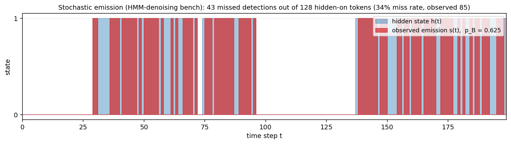

Blue = hidden state `h(t)`; red = observed `s(t)`. Anywhere the hidden
state is on, the observed emission flickers at 62.5% per step.
Approximately one-third of hidden-on tokens are missed (the blue-only
slivers between red blocks). A per-token model sees only the red signal
— hence the per-token denoising floor.

The per-token denoising floor is bounded by this rate: any
position-independent encoder cannot exceed
`corr(s, h) ≤ √p_B = √0.625 ≈ 0.79`. Bill measures the actual floor
empirically as `0.77`. TXC crossing this floor — to ratio = 1.15 at T=12 —
is the headline of the HMM denoising bench.

The implementation is `emit(h, p_A, p_B, generator)` in
`src/temporal_bench/data/markov.py`.

## Step 3 — Per-firing magnitudes

When `s_k(t) = 1`, the magnitude is sampled independently:

```
a_{k,t} ~ Normal(magnitude_mean, magnitude_std²)
```

Defaults: `magnitude_mean = 1.0`, `magnitude_std = 0.15` — concentrated
around 1.0. The signed activation is `act_{k,t} = s_k(t) · a_{k,t}`,
clipped at zero (in practice all magnitudes are ≥ 0 since the std is small
relative to the mean).

Implementation: `ToyModel.embed` in `src/temporal_bench/data/toy_model.py`.

## Step 4 — Embed into `d_model`-dim activations

Fix `n_features` unit-norm random directions
`f_k ∈ R^{d_model}, k = 1, …, n_features`, generated once at
`ToyModel.__init__` time as random Gaussian rows then normalised. They are
**not** re-orthogonalized — at the bench scales (`n_features = 40` or
`128`, `d_model = 80` or `256`) random Gaussians are near-orthogonal
anyway.

The observation passed to the SAE / TXC is the linear superposition:

```
x(t) = Σ_{k=1}^{n_features} act_{k,t} · f_k         ∈ R^{d_model}
```

In matrix form, `x = activations @ F.T` where `activations` is `(T, n_features)`
and `F` is `(n_features, d_model)`.

## Step 5 — Ground truth for evaluation: just `f_k`

Unlike Han's exp 1c3, there is **no coupling matrix**, so there is no
distinction between "local" emission features and "global" hidden features.
The single ground-truth set is just the dictionary directions
`f_1, …, f_{n_features}`. Bill's reported metric is feature-recovery AUC
under decoder cosine matching:

```
AUC = mean_k  max_atom  | cos(decoder_atom, f_k) |
```

evaluated as a 0–1 threshold sweep on cosine similarity.

For the HMM denoising bench, Bill additionally reports the *denoising
ratio*:

```
denoising_ratio = corr(latents, hidden h) / corr(latents, observed s)
```

This compares how well the latents track the hidden Markov state vs the
noisy observation. > 1 means the latents track the true hidden state
better than the noisy emissions they were given — i.e. real denoising.
The per-token denoising floor pins this ratio at `gamma ≈ 0.77` for any
position-independent encoder; only TXC's window encoder crosses it.

## Why ρ matters operationally (uncoupled case)

In Bill's bench the only structure to recover is each feature's own
trajectory, and ρ controls how persistent that trajectory is. Two limits:

- **ρ = 0**: every step is i.i.d. Bernoulli(π) per feature. There is no
  temporal correlation to pool, and a per-token SAE has access to all the
  signal there is — the temporal axis is purely noise. (This is the
  closest analog to "the SAE has no temporal advantage to lose"; in this
  regime regular SAE typically *beats* TXC because TXC pays a cost for
  per-position decoders without gaining anything.)
- **ρ = 0.9**: each feature is very persistent — typical run length
  ≈ 1 / (1 − α) ≈ 10 steps. A window encoder of length T can amortize
  reads across multiple tokens of the same hidden state. With deterministic
  emissions (three-arch), this advantage manifests at low k where TopK
  sparsity bottlenecks per-token recovery. With stochastic emissions (HMM
  denoising), the advantage compounds — pooling reads denoise the missed
  detections, and TXC crosses the per-token floor.

## Summary diagram

```
          ┌─────────────────────────┐  n_features independent 2-state
          │   h_k(t), k = 1..n_feat  │  Markov chains with shared π
          │   ∈ {0,1}^{n_feat × T}   │  (or per-feature ρ in HMM denoising)
          └────────────┬────────────┘
                       │
                p_A, p_B emission probs
                (deterministic in three-arch;
                 stochastic in HMM denoising)
                       │
                       ▼
          ┌─────────────────────────┐  s_k(t) ∈ {0, 1}
          │   s_k(t),                │  observed support
          │   ∈ {0,1}^{n_feat × T}   │
          └────────────┬────────────┘
                       │
                independent magnitude per (k, t):
                a_{k,t} ~ Normal(μ=1.0, σ=0.15)
                       │
                       ▼
          ┌─────────────────────────┐  act_{k,t} = s_k(t) · a_{k,t}
          │   act_{k,t}              │  real, ≥ 0
          └────────────┬────────────┘
                       │
                fixed embedding F = (f_1, …, f_{n_feat}) ∈ R^{n_feat × d_model}
                       │
                       ▼
          ┌─────────────────────────┐  x(t) = Σ_k act_{k,t} · f_k
          │   x(t) ∈ R^{d_model}     │  the observation the model sees
          └─────────────────────────┘

Ground truth for eval:
  features =  f_k,  k = 1..n_feat     (n_features dictionary directions)
  hidden   =  h_k(t)                   (only used for denoising-ratio metric)
```

## What changes vs Han's coupled HMM

The hidden chains and the per-chain transition mechanics are **identical**
between Bill and Han. Three things differ:

1. **No OR-coupling.** In Bill's setup `n_features` is the same as the
   number of features the model has to recover — each Markov chain is its
   own observable. In Han's setup K=10 hidden chains drive M=20 emissions
   through a binary OR coupling matrix C, so there's a hidden-feature
   layer separated from the observable layer.
2. **No local/global split.** Bill has just one ground-truth direction
   set (the `n_features` dictionary directions). Han has two (emission
   `f_m` for "local" and the coupling-induced `h_feat_k` for "global").
3. **One-to-one feature ↔ embedding direction.** Bill's `n_features`
   directions are sampled directly from random Gaussians (no
   `orthogonalize`-style step); each feature's observation is a clean
   linear projection through one direction. Han uses an explicit
   `orthogonalize` call on the M=20 emission features.

This is why Bill's bench is the cleaner test of "TXC vs SAE compression
trade" but a poor test of "TXC's ability to reveal hidden structure" —
there's no hidden structure to reveal.

## Empirical results from this HMM

This section pulls the relevant sweep figures into one place so the
reader can see what the HMM actually produces under different model
architectures.

### Three-arch sweep (Fig 5–7)

Single-arch ground truth = the `n_features` dictionary directions, so
the only metric is **plain feature-recovery AUC**. There is no
local-vs-global split — Bill's bench has no coupling matrix. Bill's
three figures from the original sweep (regular SAE / Stacked SAE / TXCDR
at d_sae = n_features = 128, k_pos ∈ {2, 5, 10, 25}, T ∈ {2, 5}, single seed):

**ΔAUC vs regular SAE, by (k, T) for each ρ:**

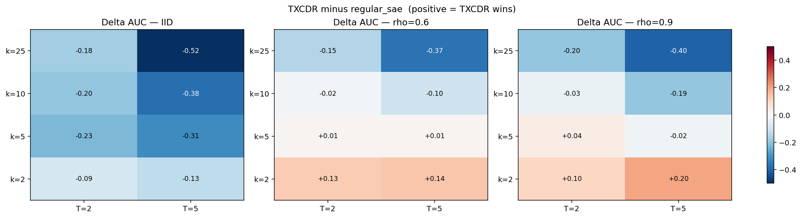

TXCDR's only material win over regular SAE is at low k (k=2) and high ρ
(ρ ≥ 0.6); elsewhere regular SAE wins, often substantially. The mean
across all 24 cells: regular_sae 0.910 > txcdr 0.790 > stacked_sae 0.559.

**ΔAUC vs Stacked SAE:**

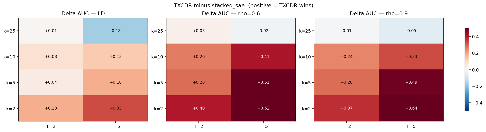

TXCDR beats Stacked SAE almost everywhere (ΔAUC up to +0.64), and the
gap is large across the entire (k, ρ) grid — not regime-specific. This
is the "structural" gap (TXCDR's shared-latent encoder vs Stacked's
per-position TopK on T-times less per-slot data).

**ΔAUC vs ρ at fixed (k, T):**

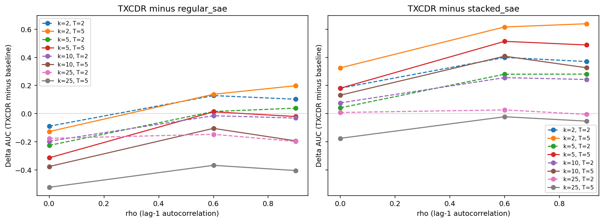

Direct view of the rho-dependence: TXC's win grows with ρ at low k,
flips sign at high k.

**AUC and NMSE vs k:**

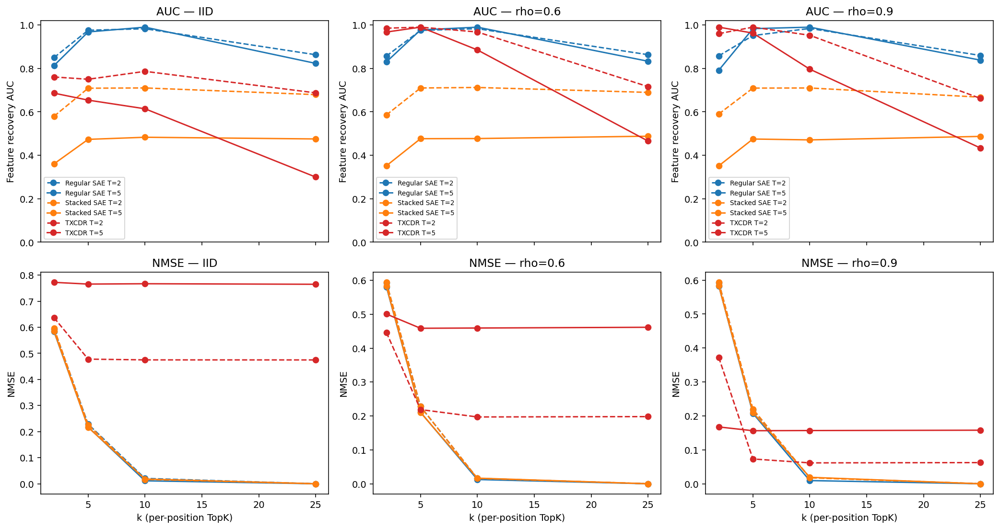

The AUC story (top row) and the NMSE story (bottom row) tell different
things — TXCDR's NMSE is always worst (it sacrifices token-level
reconstruction for cross-position information sharing), but its AUC
beats regular SAE in the right regime.

### Three-arch re-run with Han's recipe (2026-05-05)

Same DataConfig, but all four arches at `d_sae = 8 × d_in = 2048` (Han's
locked expansion) and Han's locked TXCs (`txc_base`, `txc_pro / H8`)
swapped in for plain TXCDR. Single seed, k_pos = 20, n_steps = 10k.
Result: at this dictionary width, regular SAE catches up to TXC-base
(ΔAUC ≈ +0.02 across all ρ), while Stacked SAE remains broken.

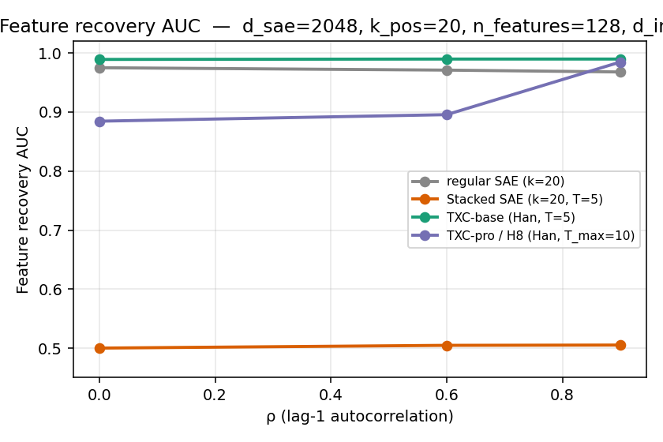

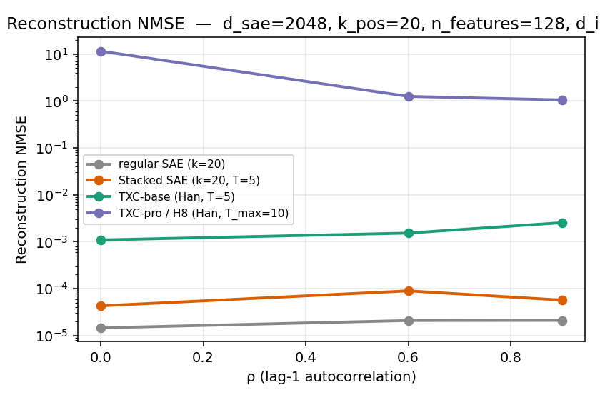

Full writeup: [[../../../docs/dmitry/results/han_three_arch_summary]].

### ρ × k sweep at d_sae = 2048 (2026-05-05)

Sweeping per-token k_pos ∈ {1, 2, 5, 10} × ρ ∈ {0.0, 0.6, 0.9} for four
arches (regular_sae, plain TXCDR T=2, plain TXCDR T=5, TXC-pro / H8). 48
cells, single seed. Reveals where TXC's win lives:

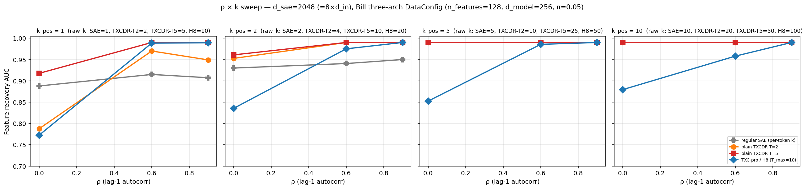

Key findings:

- Almost everyone saturates at AUC = 0.99 by k_pos = 5 across every ρ.
  The "TXC vs SAE big AUC gap" Bill saw at d_sae = 128 essentially
  disappears at d_sae = 2048.
- TXC's win over regular SAE survives **only at k_pos = 1**: TXCDR-T5
  hits 0.990 at ρ ≥ 0.6 vs regular SAE 0.91-0.92 (Δ ≈ +0.08).
- TXC-pro / H8 *fails* at ρ = 0.0 — AUC stuck at 0.77-0.88 across all
  k_pos when there's no temporal structure. The matryoshka prefix +
  multi-distance contrastive InfoNCE wastes capacity on a
  "temporally-smooth features" prior that the data doesn't have.

ΔAUC vs regular SAE, same data:

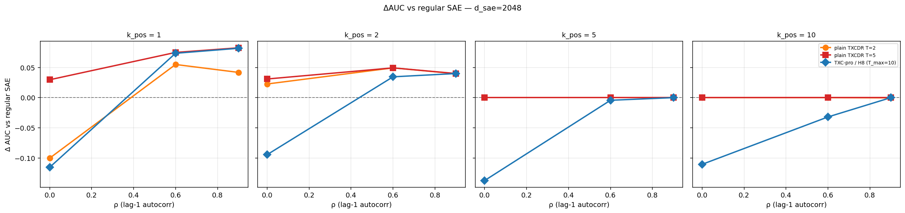

Full writeup: [[../../../docs/dmitry/results/rho_k_sweep_summary]].

### HMM denoising sweep (Fig 8–9)

The asymmetric-emission bench (`p_B = 0.625`, heterogeneous per-feature
ρ). Key metric is the **denoising ratio** = `corr(latents, hidden) /
corr(latents, observed)`. Any per-token model is bounded above by
≈ 0.77 (the observed/hidden correlation given the emission noise);
crossing 1.0 means the latents track the hidden state better than the
noisy observation.

**Global vs local correlation at fixed T = 4:**

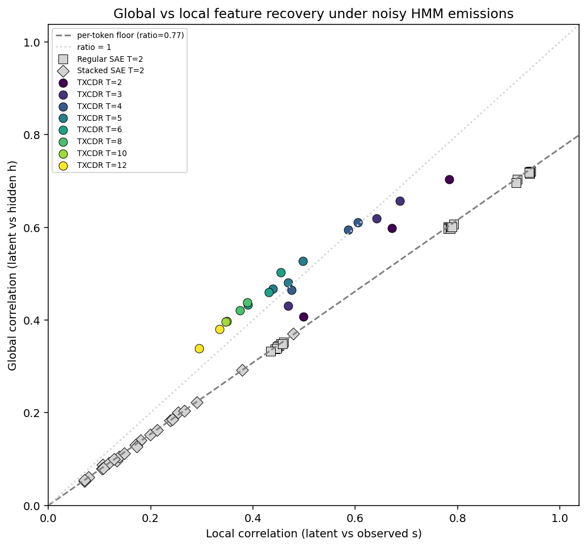

Each point is one feature: x-axis = correlation of best-match latent
with the observed support `s`, y-axis = correlation with the hidden
state `h`. Per-token models (regular SAE, Stacked SAE) cluster on the
y = γ·x line (the per-token denoising floor). TXCDR points sit *above*
this line — its latents track the hidden state more than the noisy
observation.

**Denoising ratio (Pearson corr) vs T:**

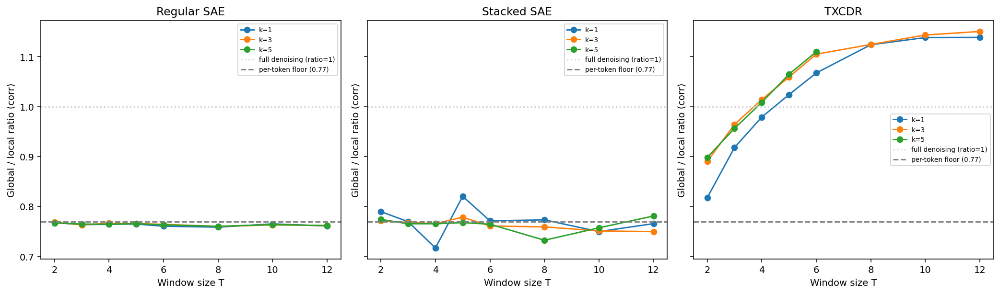

The headline of the bench: TXCDR is the **only** architecture that
crosses the per-token denoising floor of 0.77, and the gap grows with
T. Both regular SAE and Stacked SAE pin at the floor across all (T, k)
— consistent with both being position-independent.

**Same metric using R² instead of correlation:**

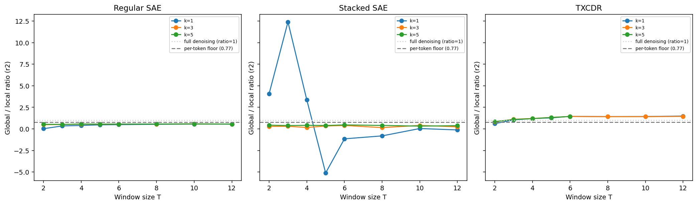

Same picture: TXCDR climbs with T, baselines plateau.

## Code map

- `src/temporal_bench/data/markov.py`
  - `pi_rho_to_transition(π, ρ) → (α, β)` — converts to per-chain transition probabilities.
  - `generate_markov_support(n_features, T, π, ρ, n_seq)` — shared-ρ chain sampling (three-arch).
  - `generate_markov_support_hetero(rhos, T, π, n_seq)` — per-feature ρ chain sampling (HMM denoising).
  - `emit(h, p_A, p_B)` — applies stochastic emission noise.
- `src/temporal_bench/data/pipeline.py`
  - `DataPipeline._generate_hmm` — orchestrates support → emit → embed for one ρ.
  - `DataPipeline.sample_windows` — draws `(B, T, d)` window batches from cached chains.
  - `DataPipeline.eval_data_with_support` — also returns `(s, h)` for the denoising metric.
- `src/temporal_bench/data/toy_model.py`
  - `ToyModel.__init__` — samples the fixed `(n_features, d_model)` direction matrix.
  - `ToyModel.embed(s, μ, σ)` — magnitude sampling + linear projection.
- `scripts/run_three_arch_sweep.py` — three-arch (Fig 5/6/7) configuration.
- `scripts/run_hmm_denoising_sweep.py` — HMM denoising (Fig 8/9) configuration.

## Related

- [[Synthetic-Benchmark-Report]] — Bill's empirical writeup with per-cell tables and figures.
- [[../../dmitry/case_studies/coupled_features/hmm_spec]] — companion spec doc for Han's coupled HMM (the "with coupling" version of this).
- [[../../dmitry/results/rho_k_sweep_summary]] — Han-recipe re-run on this bench at d_sae=2048.
