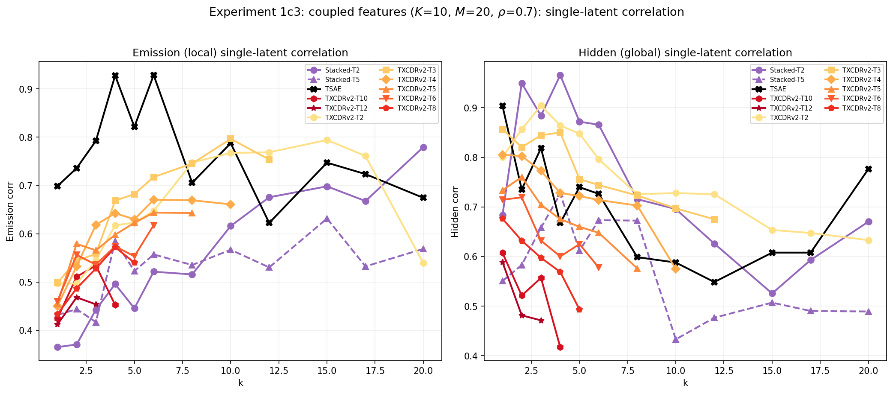
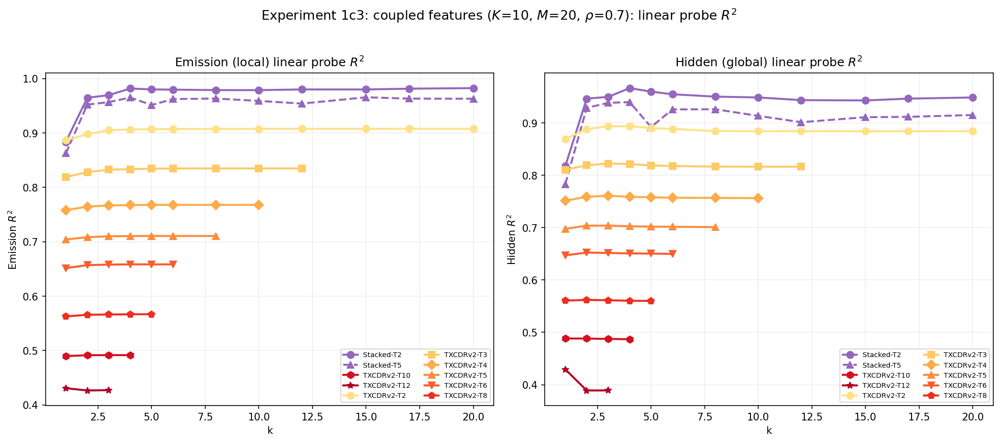
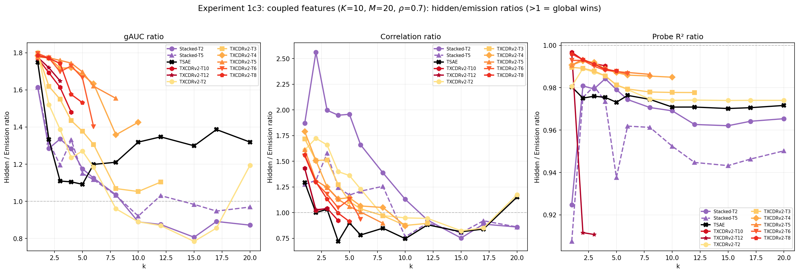
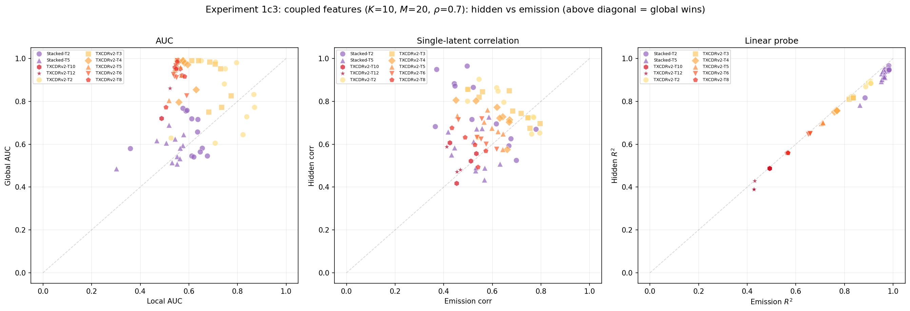
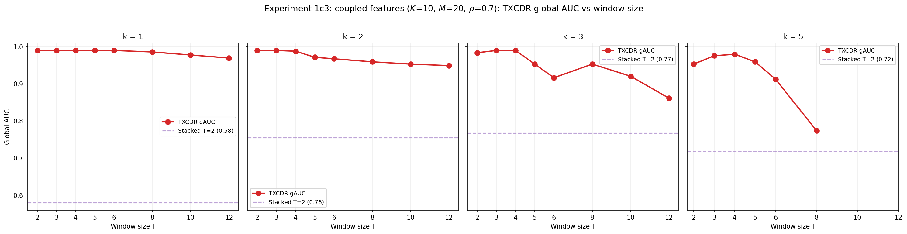

## T-SAE on coupled-features: replicating Han's exp 1c3 with paper-faithful T-SAE added

Replicates [Han's Phase 3 / Experiment 1c3](https://github.com/chainik1125/temp_xc/blob/han/docs/han/research_logs/phase3_coupled_features/2026-04-07-experiment1c3-coupled-features.md) (local vs global feature recovery on toy coupled-features data) and adds **paper-faithful T-SAE** (`TemporalMatryoshkaBatchTopKSAE`, Ye et al. 2025) to the architecture comparison.

### Setup (matches Han's exp 1c3)

- **Data**: 10 hidden Markov chains drive 20 emissions through a binary OR-coupling matrix (n_parents=2). Hidden ON-prob π=0.05, persistence ρ=0.7. d=256, T=64 sequence length, 2500 sequences.
- **Architectures**: Stacked SAE T={2,5}, TXCDRv2 T={2..12}, **+ T-SAE (paper-faithful, Matryoshka BatchTopK + temporal InfoNCE)**.
- **Sparsity sweep**: k ∈ {1, 2, 3, 4, 5, 6, 8, 10, 12, 15, 17, 20}.
- **Three metrics**: decoder AUC against emission (eAUC) and hidden (gAUC) directions; single-latent Pearson correlation against per-token target; linear probe R² over full latent vector.

### Headline finding

**T-SAE has a strikingly different shape from both TXCDR and Stacked across the k sweep.**

The right panel (global / hidden AUC) shows three clean regimes:

- **k=1–5 (low sparsity)**: TXCDR T=2 wins, gAUC ≈ 0.95-0.99. T-SAE second at 0.85-0.95. Stacked last at 0.58-0.76.
- **k=6-8 (crossover)**: TXCDR drops sharply; T-SAE pulls even.
- **k≥10 (high sparsity)**: **T-SAE dominates.** TXCDR collapses to 0.63 by k=20; T-SAE stays pinned at ~0.89.

### Per-k gAUC table (4 representative archs)

| k | Stacked-T2 | **TSAE** | TXCDR-T2 | TXCDR-T5 |
|---|---|---|---|---|
| 1 | 0.580 | **0.949** | 0.990 | 0.990 |
| 2 | 0.755 | 0.909 | **0.990** | 0.971 |
| 3 | 0.767 | 0.924 | **0.984** | 0.953 |
| 5 | 0.718 | 0.854 | **0.953** | 0.959 |
| 6 | 0.716 | **0.929** | 0.882 | 0.922 |
| 8 | 0.657 | **0.899** | 0.833 | 0.804 |
| 10 | 0.582 | **0.896** | 0.773 | — |
| 12 | 0.565 | **0.895** | 0.729 | — |
| 15 | 0.545 | **0.892** | 0.645 | — |
| 17 | 0.545 | **0.891** | 0.606 | — |
| 20 | 0.541 | **0.895** | 0.629 | — |

### Single-latent correlation

T-SAE's hidden-state correlation pattern is similar to TXCDR's at low k but stays higher at high k. Single-latent activations track hidden states reasonably well across the entire range.

### Linear probe R²

The probe R² for hidden vs emission is **near 1.0 for every architecture across all k**. This reproduces Han's original finding ("probe ratio is ≈ 1 for all models") — the latent representations contain enough information for a linear classifier to read out hidden states whether or not the model explicitly aligns features to those directions.

### All three ratios vs k

Confirms Han's view that **gAUC is the most discriminative metric for this setting** — the corr ratio is noisy, the probe ratio is ~1 for everyone, and the gAUC cleanly separates the architectures.

### Hidden vs emission scatter (3 metrics)

T-SAE's points cluster in the **upper-left** of the AUC scatter — high hidden AUC at moderate emission AUC. This is the "captures global structure even at the cost of some local resolution" regime; it's qualitatively closest to TXCDR T=2 at low k, but T-SAE *retains* this position throughout the k range while TXCDR slides toward Stacked SAE's region.

### gAUC vs window size T

T-SAE doesn't have a window parameter (it's per-token), so it appears as a horizontal reference line across all T. This visualizes that **T-SAE's hidden-state recovery doesn't require a window encoder at all** — its temporal contrastive loss + matryoshka prefix structure is enough.

### What this says

The Phase 6.3 RLHF [steering investigation](../rlhf/notes/t20_steering_investigation.md) found that T=20 SAEs *don't* develop steerable concept directions on real text data. This Phase 3 toy result is the **complementary positive case**: on data where global structure is built into the generation process by construction, **T-SAE recovers that structure as cleanly as the best window arch and far more robustly to sparsity choice**.

The two findings together suggest T-SAE's strength is exactly where it's designed to shine: when there's *real* hidden structure that's temporally consistent, the architecture extracts it well. The mechanism is:

- Window encoders see one window at a time but their decoders distribute reconstruction across T positions, so the per-position decoder atom carries only ~1/T of the concept signal — strong at low k where the dominant features survive TopK, weak at high k where the active set is diluted.
- T-SAE's contrastive loss pulls high-level (smooth-over-time) features into the matryoshka prefix (the "high-level" group). These prefix features survive at any k because they're the lowest-numbered, and the InfoNCE objective specifically trains them to be temporally consistent — exactly the structure of the hidden Markov chains.

### Mechanism corollary: why T-SAE flattens vs TXCDR collapses

At low k (≤ 5), TXCDR's T-window encoder forces the model to find features that are coherent across T tokens — which is structurally aligned with hidden states. TopK keeps only the strongest, and the strongest are the global features.

At high k (≥ 10), TXCDR's TopK budget admits more features, and the *bonus* features it activates are local emission-feature features (since with more capacity, the model can afford to represent emissions individually rather than via composite hidden-state features). The hidden-state-aligned features are still there but no longer dominate the active set.

T-SAE's matryoshka structure side-steps this. The "high-level" prefix latents (smaller subset) are *guaranteed* to be active in the BatchTopK because they're trained against a lower per-prefix budget. So at any k, those features are in the active set. They don't get displaced as k grows.

### Caveats

1. **Toy data only.** The coupled-features generative process is a clean test of "can the architecture recover ground-truth global structure?" Real text data may not have this clean structure, and the [steering investigation](../rlhf/notes/t20_steering_investigation.md) shows that probing-friendly features ≠ steering-friendly features.
2. **Single seed.** Han's original ran seed=42 only; we matched. No replication-based variance.
3. **Architecture comparison is k-aligned, not budget-aligned.** TXCDR with k_eff = k * T at T=12, k=20 would have k_eff=240 > d_sae=40, so those entries are missing. T-SAE doesn't have this constraint (per-token encoder). The range comparison at k > 8 has fewer competing TXCDR variants.

### Files

- Source: `experiments/phase3_coupled/run_exp1c3_tsae.py` — T-SAE training + 3 metrics, merges into the existing JSON.
- Plot: `experiments/phase3_coupled/plot_exp1c3.py` — adds T-SAE STYLE entry, otherwise unchanged from Han's original.
- Results: `experiments/phase3_coupled/results/experiment1c3_coupled/denoising_results.json` (with TSAE entries appended).
- Plots: `experiments/phase3_coupled/results/experiment1c3_coupled/exp1c3_{auc,corr,probe,ratios,scatter,gauc_vs_T,auc_vs_k,gauc_gap}.png`.

Run on a40_txc_1: 75.6 min for 12 k values × 30k training steps + metric eval.
