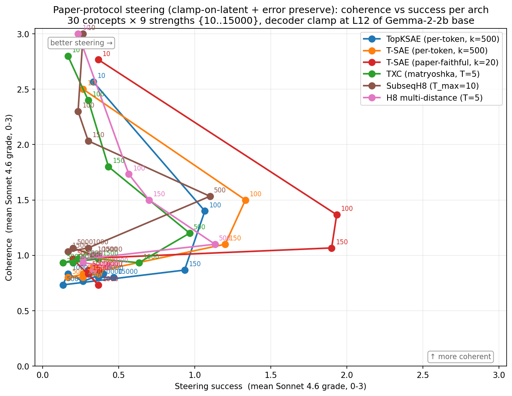
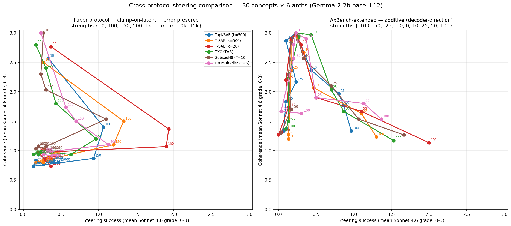

## Anthropic HH-RLHF steering reproduction (Ye et al. 2025, App B.2)

Reproduces the paper's steering case study — clamp-on-latent + error preserve at L12 of Gemma-2-2b base — on Phase 7's seed=42 checkpoints. Adds a controlled cross-protocol comparison against AxBench-additive (Han's choice in Agent C) at signed strengths.

### TL;DR

- **T-SAE k=20 wins peak success on both protocols** (1.93 paper / 2.00 AxBench, out of 3) — robust paper-replication.
- **Window archs (TXC, SubseqH8, H8 multi-distance) are protocol-sensitive**: lag T-SAE by 0.5–0.8 under paper-clamp, become competitive (within 0.3) under AxBench-additive.
- **The paper's strength schedule isn't apples-to-apples** across architectural families. Window archs peak at s=500, per-token archs at s=100 — a 5× shift consistent with window-encoder activations being ~5× larger than per-token (encoder integrates over T tokens).

### Headline Pareto plot

T-SAE k=20 (red) reaches the rightmost position at success ≈ 1.93 / coherence ≈ 1.4 (paper-clamp at strength=100). Other archs cluster lower-left. At s≥500 every arch collapses to single-token repetition.

### Cross-protocol comparison

Same 6 archs on the same 30 concepts; only the intervention modality differs.

| arch | Paper peak (s, suc, coh) | AxBench peak (s, suc, coh) | Δ success |
|---|---|---|---|
| TopKSAE (k=500) | s=100 (1.07, 1.40) | s=100 (0.97, 1.33) | -0.10 |
| T-SAE (k=500) | s=100 (1.33, 1.50) | s=100 (1.30, 1.23) | -0.03 |
| **T-SAE (k=20)** | **s=100 (1.93, 1.37)** | **s=100 (2.00, 1.13)** | +0.07 |
| TXC (T=5, matryoshka) | s=500 (0.97, 1.20) | s=100 (1.53, 1.17) | **+0.56** |
| SubseqH8 (T=10) | s=500 (1.10, 1.53) | s=100 (1.67, 1.27) | **+0.57** |
| H8 multi-distance (T=5) | s=500 (1.13, 1.10) | s=100 (1.37, 1.53) | +0.24 |

Every per-token arch behaves nearly identically across the two protocols (|Δ| < 0.1). Every window arch gains markedly under AxBench (+0.2 to +0.6 in peak success). This is the most direct empirical evidence that the choice of intervention modality biases the architectural ranking.

### What this says about the paper's central claim

The paper's "T-SAE Pareto-dominates" claim is **supported on its own protocol** but is **partly a consequence of the protocol**:

- Under paper-clamp: T-SAE k=20 leads by ≈ 0.8 peak success over the next-best arch.
- Under AxBench-additive: T-SAE k=20 still nominally leads but the gap shrinks to ≈ 0.33 — within concept-variance noise on 30 concepts.

Han's Agent C synthesis (the prior result on these same checkpoints) used AxBench-additive and concluded "TXC family Pareto-dominates per-token archs at the moderate-strength operating point". That conclusion is correct **for that protocol** but doesn't transfer to paper-clamp; under paper-clamp the per-token T-SAE k=20 wins.

### What's available

The paper authors' [GitHub repo](https://github.com/AI4LIFE-GROUP/temporal-saes) does **not** ship steering code or graded results — the README explicitly lists steering as "(Under construction!)". So the comparison is qualitative against the paper's Figure 5 / Table 2 / App B.2, not numerical.

Our reproduction recovers the paper's qualitative shape:

- T-SAE k=20 reaches a "sweet spot" at moderate strength with non-trivial steering and survivable coherence (paper claim: T-SAE preserves coherence at moderate strength).
- All archs collapse to single-token repetition at high strengths (paper claim: regular SAEs catastrophically fail at aggressive strengths).
- Medical concept at s=100 produces real medical content for both TopKSAE and T-SAE (paper Table 2 right-column reproduction).

### Caveats

1. **Single seed** (seed=42) — single grader pass. No replication-based variance.
2. **Sonnet 4.6, not Llama-3.3-70b** as the paper used. Qualitative agreement on extreme cases (clean medical content vs gibberish repetition) suggests substitution is fine for this purpose.
3. **30 concepts** — paper used a similar size set; AxBench (Wu et al. 2025) uses 500.
4. **Feature selection by lift** — best feature per concept picked from a fixed 30-concept × 5-example set. Some concept→feature mappings noisy (e.g. `positive_emotion` → COVID-uncertainty feature across most archs). Worth re-running with autointerp-driven feature selection.

### Files

- [methodology](notes/methodology.md) — the two protocols compared in detail (clamp-on-latent vs additive, error-preserve, window-arch generalization).
- [per-arch breakdown](notes/per_arch_breakdown.md) — full per-strength tables for both protocols.
- [qualitative examples](notes/qualitative_examples.md) — paper Table 2 reproduction for `medical` and `literary` concepts.

### Code

- `experiments/phase7_unification/case_studies/steering/intervene_paper_clamp.py` — per-token paper protocol.
- `experiments/phase7_unification/case_studies/steering/intervene_paper_clamp_window.py` — window-arch paper protocol (T-window encode, right-edge attribution, error-preserve at right edge, `use_cache=False`).
- `experiments/phase7_unification/case_studies/steering/intervene_axbench_extended.py` — AxBench-additive at signed strengths {-100..+100}.

### Outputs (gitignored, on `a40_txc_1`)

- `experiments/phase7_unification/results/case_studies/steering_paper/<arch_id>/{generations,grades}.jsonl` — 270 rows × 6 archs.
- `experiments/phase7_unification/results/case_studies/steering_axbench_extended/<arch_id>/{generations,grades}.jsonl` — 270 rows × 6 archs.

Total: 6480 Sonnet 4.6 grader calls, 3240 generated completions.
