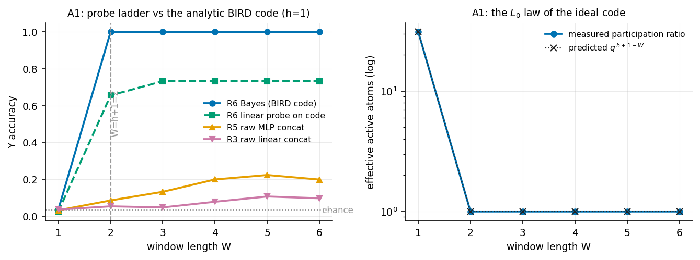
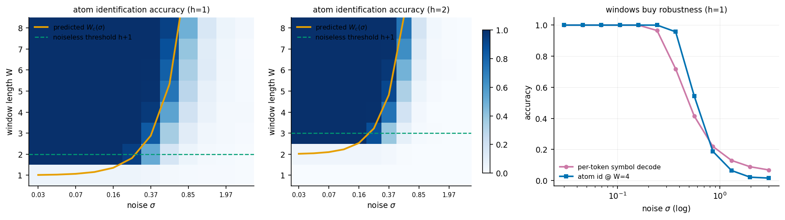
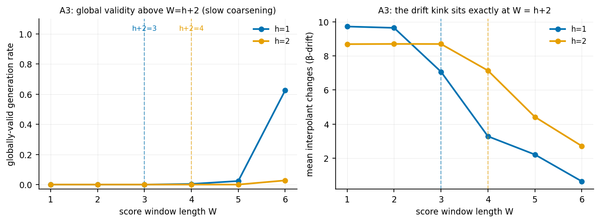
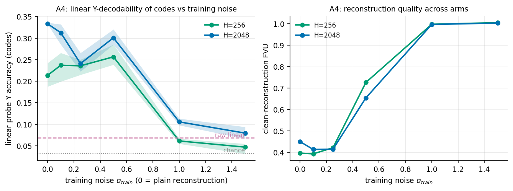
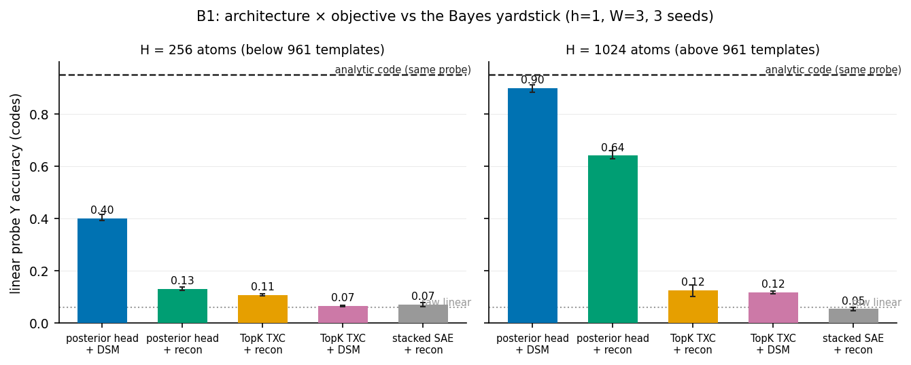
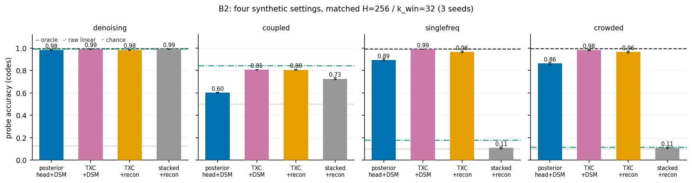

## BIRD posterior codes on the polynomial clock: first experimental pass (A1–A4)

Companion results for [[2026-08-10_bird_temporal_codes]]. All four Phase-A
experiments ran in parallel on Modal (one CPU container + two L4s + one A10G;
total paid GPU/CPU time under four minutes, i.e. pennies). Code:
`experiments/bird_clock/` (runners `a1_codes.py` … `a4_objective.py`, harness
`modal_app.py`, plots `make_plots.py`); raw JSONs in
`experiments/bird_clock/results/`; a persistent copy lives in the Modal
volume `bird-clock-results`.

Scoreboard, one line per experiment:

- **A1 — confirmed, exactly.** Entropy and L0 laws hold to numerical
  precision; the Bayes code steps from zero-information to perfect at
  W = h+1 while every raw-window probe rung stays far below.
- **A2 — confirmed.** Sharp phase boundary; the predicted frontier
  $W_c(\sigma) = h + 2\sigma^2(h{+}1)\ln q$ tracks the measured 50% crossing;
  windows demonstrably buy noise robustness over per-token decoding.
- **A3 — transition location confirmed; magnitude kinetically arrested.**
  Chimeric exactly for $W \le h{+}1$ (both h); the drift kink sits exactly at
  $W = h{+}2$; but full global validity coarsens slowly — the parallel local
  score has *stable domain-wall defects*.
- **A4 — headline prediction not confirmed as stated; mechanism refined.**
  Plain reconstruction already produces substantially Y-informative codes
  (optimization bias breaks the degeneracy the theory calls a tie);
  moderate noise helps only modestly and only below the memorization
  capacity; large noise kills training at this budget.

### Setup

Polynomial clock (`src/v6_colored_sources/polynomial_clock.py`): q = 31,
d = 64, observation noise σ = 0.1 unless stated; h = 1 (M = 961 atoms) and
h = 2 (M = 29,791). The BIRD code is
$z_\beta = \mathrm{softmax}(\langle\Phi_\beta^{\mathrm{win}}, x_{\mathrm{win}}\rangle/\sigma^2)$
over the full atom bank, templates at absolute times.

One implementation gotcha worth recording: the docstring of
`enumerate_coefficient_grid` claims base-q digits with the least-significant
digit at column 0, but `torch.cartesian_prod` varies the **last** column
fastest; atom indices must weight column k by $q^{h-k}$. (Y-marginals read
from the grid are unaffected; raw index comparisons are.)

### A1 — the analytic code vs the probe ladder (h=1, n=1536 episodes)



| W | R6 Bayes | R6 lin (code) | R5 raw MLP | R3 raw lin | PR (pred $q^{h+1-W}$) | S (pred) |
| --- | --- | --- | --- | --- | --- | --- |
| 1 | 0.037 | 0.025 | 0.032 | 0.036 | 31.00 (31) | 3.434 (3.434 = ln 31) |
| 2 | **1.000** | 0.656 | 0.085 | 0.053 | 1.00 (1) | 0.000 (0) |
| 3–6 | 1.000 | 0.732 | 0.13–0.22 | 0.05–0.11 | 1.00 (1) | 0.000 (0) |

- **The entropy and L0 laws hold with equality**: participation ratio 31.00
  vs predicted 31; entropy ln 31 to four significant figures; a step to
  one-hot at exactly W = h+1. The BIRD "large-dataset" entropy formula is
  exact here, as derived.
- **The information ceiling of the screen is not the information.** The
  ladder's R5 (MLP on concatenated raw windows) reaches only 0.09–0.22 while
  the Bayes decoder sits at 1.000 from W = 2: a generic MLP probe at this
  sample size cannot represent mod-q Lagrange interpolation. On tasks with
  finite-field structure the screen's "information ceiling" rung badly
  underestimates available information — the analytic R6 rung is the honest
  ceiling and costs nothing.
- **Flat one-hot codes are linearly readable but not linearly *learnable*
  at this sample size.** R6_lin plateaus at ~0.73: with 961 atoms and ~1.2k
  training windows, most atoms are seen ≤ 2 times, so the probe cannot learn
  weights for unseen atoms — even though the Y-marginal is a *fixed known*
  linear function of the code. This is the sample-complexity cost of flat
  template codes and a concrete argument for factored/structured codes
  (proposal §3.2's coset-dictionary remark).

### A2 — the (W, σ) phase diagram



- Sharp identifiability threshold at W = h+1 for both h (id accuracy jumps
  0.05 → 1.00 at W = 2 for h=1; 0.04 → 1.00 at W = 3 for h=2), with exact
  coset entropies below it (h=2: S = 6.87 = 2 ln 31 at W=1, 3.43 = ln 31 at
  W=2).
- The **predicted frontier $W_c(\sigma) = h + 2\sigma^2(h{+}1)\ln q$ tracks
  the measured 50% crossing** through the mid-noise decade (e.g. h=1,
  σ = 0.37: predicted 2.9, observed crossing between W=2 at 0.51 and W=3 at
  0.84; σ = 0.56: predicted 5.3, observed ~4–5). At very large σ the
  frontier leaves the measured W range, as it must.
- **Windows buy robustness**: at σ = 0.56 per-token symbol decoding is at
  0.41 while atom identification at W=8 is at 0.93; at σ = 0.85, 0.22 vs
  0.49. The temporal code survives noise that destroys the local code —
  the regime the proposal identified as the cleanest demonstration that
  windows buy robustness, not just information. (At still larger σ the
  advantage inverts slightly at small W — the union bound over 961 atoms
  costs more than symbol-level guessing — visible in the third panel.)

### A3 — creativity: generation with a W-local score (q=31, T_gen=12, n=256)



| h | W≤h+1 (validity / drift) | W=h+2 | W=h+3 | W=h+4 |
| --- | --- | --- | --- | --- |
| 1 | 0.000 / 9.7 | 0.000 / 7.1 | 0.004 / 3.3 | 0.023 / 2.2 (W=6: 0.625 / 0.6) |
| 2 | 0.000 / 8.7 | 0.000 / 7.1 | 0.000 / 4.4 | 0.027 / 2.7 |

- **The chimeric phase is exactly where derived**: validity is identically 0
  and drift is maximal for all $W \le h{+}1$, in both h — and local window
  consistency is trivially 1.0 there, confirming that length-≤(h+1) windows
  constrain generation not at all.
- **The transition location is exactly $W = h{+}2$** in the drift order
  parameter: the β-drift is flat through $W = h{+}1$ and kinks down at
  precisely $W = h{+}2$ for both h (h=1: 9.7 → 7.1 at W=3; h=2:
  8.7 → 7.1 at W=4). Equivalently, local consistency first *falls below* 1
  at $W = h{+}2$ — the constraint becomes active exactly one step after
  identifiability, as the overlap argument requires.
- **Full global validity is kinetically arrested.** Above the transition the
  sampler settles into locally-inconsistent defect states (domain walls
  between polynomial domains); slower annealing does not remove them (they
  are stable fixed points of the parallel update — majority-vote-CA
  physics, not quench rate), while a stochastic dwell at intermediate σ
  anneals some out (implemented; toy-scale W=4 validity 0.16 → 0.55). At
  q=31 coarsening is slower than at q=7; validity reaches 0.625 only at
  W=6 (h=1). **Interpretation**: "locally consistent ⇒ globally valid" is
  an equilibrium statement; finite-time reverse diffusion remains creative
  *kinetically* even where equilibrium forbids chimeras. This is a genuine
  addition to the ELS Thm-4.1 picture and worth a dedicated study
  (defect density vs dwell time/σ-schedule — Kibble-Zurek-style scaling).

### A4 — denoising vs reconstruction at matched architecture (h=1, W=3)



Arms: TopK window autoencoder (Linear → TopK(4) → Linear), H ∈ {256, 2048}
(templates for W=3: $q^2 = 961$), σ_train ∈ {0…1.5}, 3 seeds, 2.5k steps.
References: raw-window linear probe 0.068, raw MLP 0.108, chance 0.032.

- **The predicted monotone rise of Y-decodability with σ_train did not
  materialize.** Codes are substantially Y-informative already at
  σ_train = 0 (0.21 at H=256, 0.33 at H=2048 — 3–5× the raw-window linear
  probe), drift slightly up to σ_train = 0.5 at H=256 (0.214 → 0.257,
  seed ranges overlap), and collapse at σ_train ≥ 1.0 where training fails
  outright (clean FVU ≈ 1.0 — the model reverts to predicting the mean at
  this step budget).
- **Diagnosis, honestly.** The proposal's §3.5 says reconstruction is
  *degenerate* between the product code and the bound code — a tie, not a
  preference for the product code. The experiment shows the tie is broken
  by optimization/architecture bias toward partial binding even at
  σ_train = 0: a TopK *window* encoder with enough atoms happily learns
  window-template atoms (the FreqBench P5 memorization route — note
  H = 2048 > 961 templates, and the H=2048 arm is the more Y-informative
  at σ_train = 0, consistent with template memorization doing the work).
  Two further confounds: the linear probe on flat codes has the A1
  sample-complexity ceiling (~0.73 even for the *ideal* one-hot code), and
  the high-σ arms are undertrained rather than unbound.
- **What would test §3.5 properly** (queued as A4′): (i) an architecture
  where the product code is reachable — explicitly stacked per-position
  encoders vs the window encoder, same budget; (ii) H well below the
  template count so memorization can't substitute for structure;
  (iii) longer training with a σ-ladder (anneal σ_train down) instead of
  fixed large σ; (iv) evaluate with the Bayes-matched readout
  (nearest-template / marginal argmax) instead of a learned probe, removing
  the sample-complexity ceiling.

### B1 — architecture × objective, scored against the Bayes yardstick



Same-day follow-up (`b1_arms.py`, `b1_refs.py`, `modal_b1.py`; 11 parallel
containers, ~8 min of L4 time). Five arms × H ∈ {256, 1024} × 3 seeds, 8k
steps, 4× the probe budget of A4 (which lifts the analytic code's
matched-readout reference to 0.951, nearly eliminating A1's
sample-complexity ceiling). References: raw linear 0.059, raw MLP 0.612,
Bayes marginal 1.000, chance 0.032.

| arm | H=256 acc (gap closed) | H=1024 acc (gap closed) |
| --- | --- | --- |
| **posterior head + DSM** | **0.400 (38%)** | **0.899 (94%)** |
| posterior head + recon | 0.131 (8%) | 0.640 (65%) |
| TopK TXC + recon | 0.107 (5%) | 0.125 (7%) |
| TopK TXC + DSM | 0.065 (1%) | 0.117 (7%) |
| stacked SAE + recon | 0.070 (1%) | 0.053 (0%) |

- **The Bayes-form architecture trained with DSM closes 94% of the gap**
  (0.899 vs analytic 0.951) where the TopK TXC closes 7% at the same
  capacity, data, steps, and probe. The full 2×2 shows it is the
  *combination* that works: DSM on the TopK architecture does nothing (hard
  TopK codes cannot represent the soft posterior mean the denoising target
  requires — its H=256 DSM arm even fails to train, FVU 0.74), and the
  posterior head without DSM loses 25–30 points. Architecture supplies the
  representable solution; the objective pulls training to it.
- **Sparsity emerges without a penalty.** The head's participation ratio
  drops from ~198 (recon) to ~16 (DSM) at H=1024 — DSM concentrates the
  code an order of magnitude toward the ideal one-hot, with no sparsity
  term in the loss. The learned temperature floor settles at τ₀ ≈ 0.21–0.39,
  well above σ_obs² = 0.01: trained heads prefer softer posteriors than the
  analytic limit.
- **The stacked SAE sits exactly at zero gap closed** at both capacities —
  the product-code control behaves precisely as the additive-readout theory
  requires.
- **Caveats, stated plainly**: the posterior head is a strong-inductive-bias
  arm (it is *given* the Bayes functional form, and the DSM arms are told σ
  at training time); the TXC's k = 4 was not tuned (the framework itself
  prescribes k = 1 above threshold — worth an ablation); TXC conversion is
  sensitive to overcapacity margin (A4's H = 2048 ≈ 2.1× templates reached
  0.33; here H = 1024 ≈ 1.07× reaches only 0.13); single task configuration
  (h=1, W=3, σ_obs=0.1); and the flat head cannot tile 961 templates with
  256 units — the factored-head variant (B1′) is the designed fix.

### B2 — the technique across four synthetic settings



Same-day generalization test (`b2_settings.py` / `b2_arms.py` /
`modal_b2.py`; 20 parallel containers): the four settings reuse the
FreqBench generators verbatim (denoising = "dc", singlefreq =
"multifreq_circle" with the periodogram oracle), Aniket's coupled-feature
HMM from `src/data_generation/` (λ=0.3, p=0.4 so chains are balanced with
~3-token correlation time), and a reimplementation of the sprint's 3-lane
superposition whose per-lane oracle reproduces the sprint's 0.995 exactly.
Budgets follow FreqBench conventions (H = 256 total, window L0 = 32 for
TopK arms); on `crowded` the head automatically becomes the **factored**
head (three softmax banks). 3 seeds; probe = per-label linear.

| arm | denoising | coupled | singlefreq | crowded (3 lanes) |
| --- | --- | --- | --- | --- |
| posterior head + DSM | 0.982 | **0.601 (collapse)** | 0.893 | 0.863 (factored) |
| TXC + DSM | **0.990** | 0.805 | **0.989** | **0.981** |
| TXC + recon | 0.983 | 0.805 | 0.965 | 0.964 |
| stacked SAE + recon | 0.990 | 0.725 | 0.109 | 0.109 |
| raw linear / oracle | 0.992 / 0.996 | 0.842 / — | 0.178 / 0.993 | 0.114 / 0.995 |

Three findings, and they reorganize the headline:

- **The objective result generalizes; the architecture result does not.**
  TXC+DSM ≥ TXC+recon in every setting, with disjoint seed ranges on both
  tone tasks (singlefreq 0.989 vs 0.965; crowded 0.981 vs 0.964) — and
  DSM-TXC's 0.981 on crowded exceeds the sprint's spectral crosscoder
  (0.96) on its own superposition task at the same H and k (caveat:
  6k vs 4k steps and a different probe budget — softly comparable). Per
  the novelty check, the objective claim was also the most defensible one;
  B2 makes it the headline: **swap reconstruction for DSM in whatever
  architecture you already have.**
- **The discrete-template posterior head wins only where the data is a
  discrete template bank.** On the clock (B1) it closed 94% of the Bayes
  gap; on continuous tone manifolds it pays for one-hot geometry (0.89 /
  0.86 with near-hard assignments, participation ≈ 1–2, vs TXC's
  distributed k=32 codes tiling phase), and on the compositional coupled
  task the *flat* head collapses outright to the base rate (participation
  1.0, FVU 1.0) — the superposition failure predicted in the
  interpretability discussion, observed in the wild. The factored head
  rescues crowded (0.86, lanes balanced) but a 10-chain coupled analogue
  needs K-bank factorization (queued as B2′).
- **Controls behave**: everything ties on denoising (mean-pool suffices —
  no red flag for any arm); stacked SAE at chance on both order-critical
  tasks; coupled shows all H=256/k=32 codes losing to the raw-window probe
  (0.81 < 0.84) — representation compression costs information there,
  independent of architecture.

**Frequency-band split** (per-class accuracies from the `b2b_*` re-run;
low = sub-Rayleigh velocities {1,2,4} with $f < 1/W$, high =
{24,32,40,50}):

| arm | singlefreq low / high | crowded low / high |
| --- | --- | --- |
| TXC + DSM | **0.972** / 1.000 | **0.954** / 1.000 |
| TXC + recon | 0.907 / 1.000 | 0.905 / 1.000 |
| posterior head + DSM | 0.695 / 1.000 | 0.703 / 0.979 |

Every arm saturates on fast tones; **the entire DSM gain is a sub-Rayleigh
low-band gain, in both the single-tone and superposed settings.** This
directly addresses the FreqBench sprint's open question #3 (mechanism of
the low-frequency dip): a substantial part of the dip is an *objective*
artifact that denoising training removes at fixed window length — the
σ-ladder repeatedly pays the model for slow structure, which is exactly
what survives large noise (the $W_c(\sigma)$ mechanism). The posterior
head's deficit concentrates in the same band.

Note the k confound between B1 (k=4) and B2 (k_win=32) when comparing
TXC+DSM across the two: on the clock DSM did not help the TXC at k=4;
whether it helps at k=32 on the clock is an open cell.

### B3 — atom recovery: interpretability vs fidelity (PREREGISTERED)

Motivation (Dmitry): the fear that DSM trades interpretability for probe
fidelity. The synthetic settings have ground-truth generative structure, so
this is directly measurable: score the *same trained models* on probe
accuracy AND decoder-atom recovery, with random-init baselines and
firing-weighted variants. Code: `b3_atoms.py` / `modal_b3.py` (weights
saved to the volume). Metrics: clock — template purity/coverage vs the 961
ground-truth windows; circle tasks — in-plane energy fraction
(1 − noise-atom-ness) and task-tone concentration; coupled —
norm-weighted cosine to emission/hidden directions.

**Predictions, logged before the run (2026-08-10):**

- P1 (clock): template purity `txc_dsm` > `txc_recon` at matched k;
  `head_dsm` highest of all.
- P2 (circle tasks): in-plane energy fraction rises under DSM — noise
  atoms are worthless to a denoiser.
- P3 (circle tasks): firing-weighted tone concentration rises under DSM.
- P4 (coupled): emission/hidden purity under DSM ≥ reconstruction.
- P5 (joint): probe accuracy simultaneously ≥ — fidelity and
  interpretability move together, not against each other. If instead
  purity drops while accuracy rises, the interpretability-for-fidelity
  trade is real and the method needs rethinking before LLM work.
- Also closes the open cell: `txc_dsm_k32` vs `txc_recon_k32` on the
  clock (does DSM help the TXC at the B2 sparsity on the B1 task?).

**Results** (13 jobs, 2 seeds each; random-init baselines: clock purity
0.24, in-plane 0.25/0.10, tone 0.21, coupled purities 0.27/0.23):

| setting | metric | recon | DSM | verdict |
| --- | --- | --- | --- | --- |
| clock k=4 | template purity (fw) | 0.308 (0.523) | 0.354 (0.589) | P1 ✓ |
| clock k=32 | template purity (fw) | 0.314 (0.345) | **0.510 (0.685)** | P1 ✓✓ |
| clock | head_dsm purity (fw) | — | **0.770 (0.881)** | P1 ✓ (highest) |
| singlefreq | in-plane (fw) | 0.276 (0.316) | **0.560** (0.390) | P2 ✓ |
| crowded | in-plane (fw) | 0.412 (0.445) | **0.763** (0.500) | P2 ✓ |
| singlefreq | tone conc. (fw) | 0.446 (0.495) | **0.674** (0.466) | P3 ✓ pop / ~ fw |
| crowded | tone conc. (fw) | 0.634 (0.660) | **0.882** (0.714) | P3 ✓ |
| coupled | emission purity (fw) | 0.362 (0.499) | 0.305 (0.454) | P4 ✗ |
| coupled | hidden purity (fw) | 0.380 (0.681) | 0.309 (0.681) | P4 ✗ / fw tie |

Probe accuracies from the same models: singlefreq 0.984 vs 0.923, crowded
0.973 vs 0.934, denoising 0.992 vs 0.981 (DSM higher in all three);
coupled 0.799 vs 0.802 (tie); clock flat at both k (probe-limited — the
1.5k-sample flat-code ceiling of A1, not an information statement).

**Verdict on the preregistration:**

- **P5 — the headline: the feared interpretability-for-fidelity trade did
  not occur anywhere.** In no comparison did probe accuracy rise while
  atom purity fell. On the tone tasks both rose together; on the clock
  purity rose strongly at flat accuracy; on coupled both were flat-to-
  slightly-down together.
- **P1, P2 confirmed; P3 confirmed in population, mixed firing-weighted.**
  The pattern is informative: DSM's dominant interpretability effect is
  **eliminating the junk tail** (population in-plane doubles — recon's
  atom population is barely above the random baseline on singlefreq),
  while the busiest atoms were already the good ones under recon (the
  sprint's busy-atom finding) — so firing-weighted gains are modest. DSM
  cleans the dictionary more than it sharpens its head.
- **P4 falsified — the honest caveat for LLM transfer.** On the coupled
  HMM (quasi-discrete on/off emissions), DSM slightly *degraded* atom
  purity at tied accuracy. Gaussian corruption is a scale-graded prior;
  it mismatches binary-event structure. If LLM features are strongly
  discrete-event-like, this is the failure mode to watch; if
  superposition interference is the dominant "noise" (approximately
  Gaussian by CLT), the tone-task results are the better model.
- The k=32 clock cell closes the B1/B2 confound in an unexpected
  direction: DSM at k=32 does not lift clock probe accuracy (probe-
  limited) but **doubles template purity** — the objective's benefit
  shows up in the weights even when the probe can't see it.
- `head_dsm` on the clock is the best of both worlds (purity 0.77/0.88
  fw, accuracy 0.743) — on genuinely discrete-template data the posterior
  head dominates both axes.

### Verdict for the proposal

The analytic content of the BIRD correspondence (§3.1–§3.4) is confirmed
outright, twice over with exact numerics (A1, A2) and once as a located
transition with new kinetics on top (A3). The objective-level claim (§3.5)
survives as a degeneracy statement but its experimental cash-out was naive:
*reconstruction does not forbid binding — it merely fails to require it* —
and TopK window architectures volunteer partial binding on their own (A4).
B1 then delivers the constructive result: the Bayes-form posterior head
trained with DSM closes 94% of the Bayes gap where the TopK TXC closes 7%,
and neither ingredient works alone. Remaining follow-ups: **B1′**
(factored heads for superposition + entmax sparsity + template-recovery
diagnostic), **A4′** (objective test at memorization-proof capacity), and
**A3′** (defect kinetics).

### Reproduction

```bash
uvx modal run --detach experiments/bird_clock/modal_app.py   # all four, parallel
uvx modal volume ls bird-clock-results                        # results persist server-side
PYTHONPATH=src uv run --no-sync python experiments/bird_clock/make_plots.py
```

The run is connection-dropout-proof: `--detach` keeps the app alive without
a client, each function commits its JSON to the volume before returning, and
`results/call_ids.json` records the function-call IDs. (This pass actually
exercised the property: the local client died with a Modal client bug after
three of four functions returned; the fourth completed server-side and all
four JSONs were recovered from the volume.)
