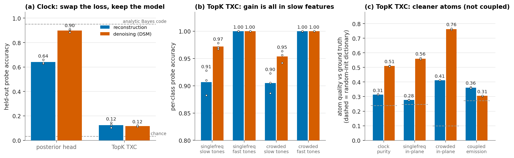
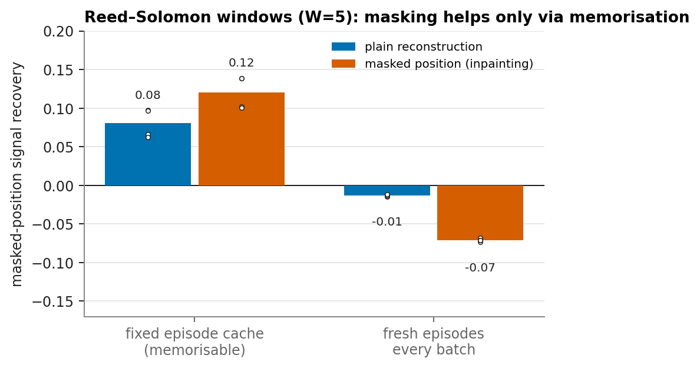
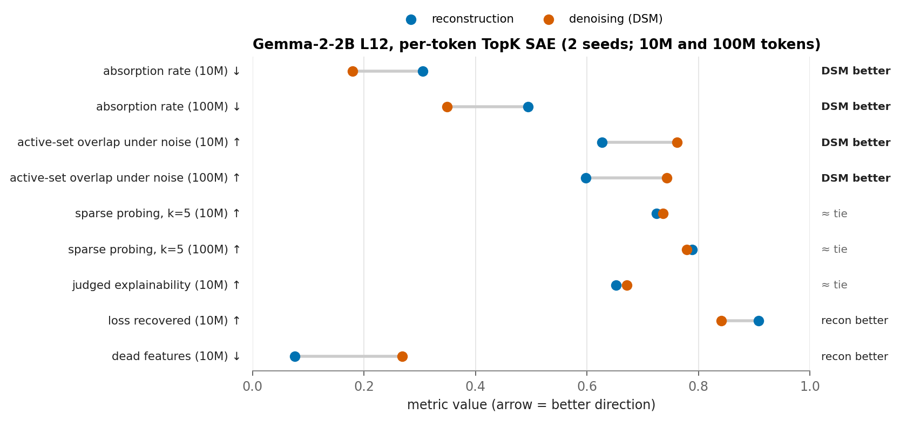
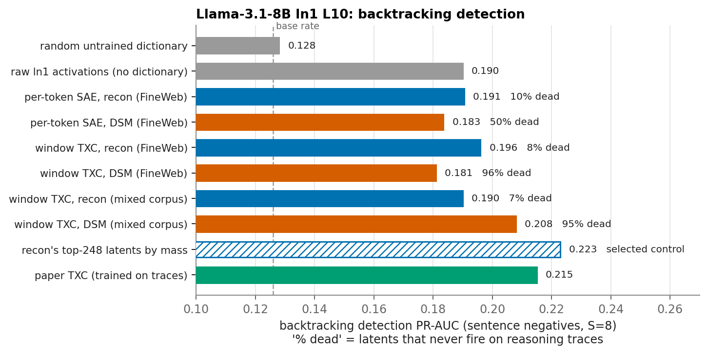
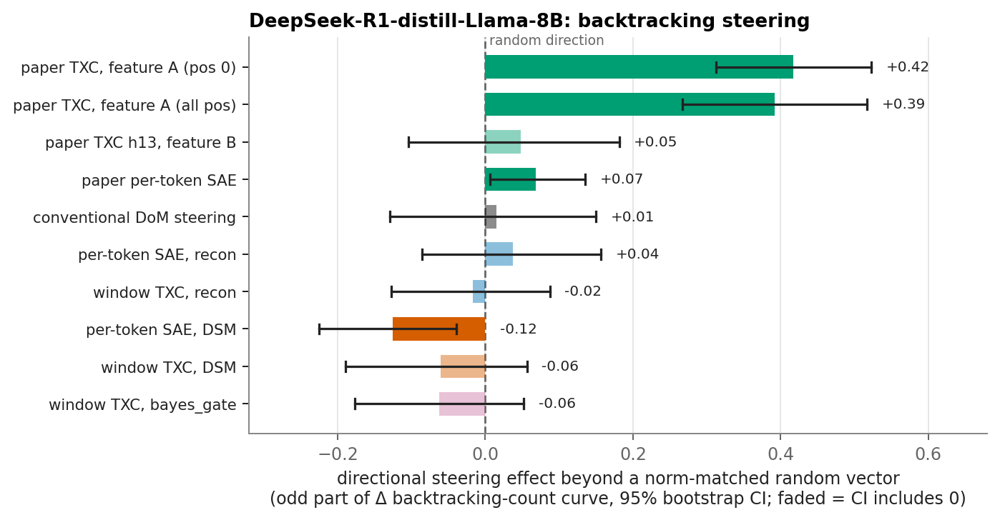

## Denoising objectives for sparse dictionaries: summary of the diffusion-txc arc

**What we did.** Between 2026-08-10 and 08-13 we tested one change to how
sparse dictionaries (per-token SAEs and temporal crosscoders, TXCs) are
trained: replace the reconstruction loss ‖f(x) − x‖² with a *denoising*
(denoising-score-matching, DSM) loss ‖f(x + σε) − x‖², with σ drawn
log-uniformly from 0.05–1.0 × the activation RMS. The motivation was the
BIRD correspondence: the Bayes-optimal denoiser of windowed data is a
posterior code over the generating structure, so a denoising objective
should pay a dictionary for binding features across positions, which plain
reconstruction does not require. We tested it first on synthetic data with
known ground truth, then on three LLM settings: per-token SAE quality on
Gemma-2-2B, backtracking *detection* on Llama-3.1-8B, and backtracking
*steering* on DeepSeek-R1-Distill-Llama-8B. A side experiment tried a
masking (inpainting) variant on Reed–Solomon windows. Everything below is
small-budget (2–3 seeds synthetic, 1–2 seeds on LLMs).

**Bottom line.** The objective clearly works on synthetic data and gives
real structural gains on LLM SAEs (less absorption, more robust features).
It did not improve behavioural detection or steering, and DSM dictionaries
collapse when evaluated off their training distribution. The one ablation
never run is a non-Gaussian, interference-shaped corruption.

### 1. Synthetic data: it works

**(a)** On the polynomial clock, a Bayes-form posterior head trained with
DSM reaches 0.90 accuracy against an analytic optimum of 0.95. The same
head trained with reconstruction reaches 0.64; this is 94% vs 65% of the
Bayes gap closed, from the loss swap alone (at H=256: 0.13 → 0.40). The
code also becomes ~12× sparser with no sparsity penalty. On a TopK TXC the
swap does nothing at this task, because hard TopK codes cannot represent
the soft posterior. **(b)** In the TopK TXC across four FreqBench-style
settings, DSM ≥ reconstruction everywhere, and the whole gain is on slow
(sub-Rayleigh) tones: 0.97 vs 0.91 and 0.95 vs 0.90. **(c)** Pre-registered
atom-recovery test: DSM roughly doubles atom quality versus ground truth,
mostly by removing a junk tail of noise atoms. Purity and accuracy never
traded off. The exception is the coupled HMM (on/off emissions), where DSM
slightly *lowers* purity. That was the first hint that Gaussian corruption
fits discrete-event structure poorly. Details:
[[2026-08-10_bird_clock_results]].

### 2. Masked-position TXC on Reed–Solomon windows: no basin flip

The idea was that masking one position should force lane-trajectory atoms,
which can fill a masked share by interpolation, over memorised
fingerprints. No configuration found lane-trajectory atoms (0% in all 23
cells). Masking improved imputation only when training reused a fixed
episode cache. With fresh episodes every batch, no arm learned the task at
this budget. The apparent gain was memorisation. Details:
`experiments/dtxc_e1/README.md`.

### 3. Gemma-2-2B per-token SAE: structural gains, fidelity costs

These are identical TopK SAEs (16k latents, k=40) that differ only in the
loss. DSM cuts feature absorption by 29–42% and raises the overlap of
active features under input noise from 0.60–0.63 to 0.74–0.76. Both gains
hold at 10M and 100M tokens. Sparse probing and judged explainability are
ties. The price is reconstruction: loss recovered falls from 0.91 to 0.84
and 3.5× more features are dead. Matryoshka SAEs cut absorption by 90% on
the same site, so this is real but not the best absorption fix. Details:
`experiments/diffusion_txc/topk_vs_topkdiff/README.md`.

### 4. Llama-3.1-8B backtracking detection: no added information

On the paper's c7 detection protocol, no FineWeb-trained dictionary beats
raw activations, under either objective. DSM dictionaries are 50–96% dead
on reasoning traces, against 7–10% for reconstruction. Training the window
TXC on a mixed corpus lifts DSM to the level of the paper TXC (0.208 vs
0.215). But a selected control dissolves this: reconstruction's top 248
latents by mass score 0.223. DSM acts as a label-free pruning of a core
that reconstruction already has, and it adds no information. Fold spread is
about ±0.03, so gaps under 0.02 are not resolved. Details:
[[2026-08-11_backtracking_detection_dsm]].

### 5. Backtracking steering on R1-Distill: only the paper's TXC steers

Each bar is the directional (odd-in-α) part of the steering curve minus
that of a norm-matched random direction. This control nullifies
conventional difference-of-means steering (+0.01). None of our recon or DSM
dictionaries gives a directional handle. The per-token DSM bar's negative
value is uninformative: only 3.7% of its latents are alive at this site,
and its mined sign is inverted. The paper's trace-trained TXC keeps
**+0.42 [+0.31, +0.52]**, the strongest causal result of the arc. A
"denoise-after-steer" projection destroyed generation under both
objectives. Details: [[2026-08-11_backtracking_steering_dsm]].

### What survives, and what to read next

- **Results that stand regardless of the verdict:** the random-direction
  steering control (it strengthens the paper's TXC claim), the covering-law
  transfer theory ([[2026-08-12_bird_transfer_theory]]), JumpReLU as the
  MMSE limit ([[2026-08-11_jumprelu_mmse_note]]), and the synthetic results
  above.
- **The single open ablation:** a corruption model shaped like
  superposition interference instead of isotropic Gaussian noise. Run it
  before reviving the objective.
- **Verdict and audit:** [[2026-08-13_dsm_postmortem]] and
  [[2026-08-12_arc_review]]. The follow-on proposal, which uses diffusion
  for code inference under a frozen decoder rather than as a training loss,
  is answered in [[2026-08-13_dsm_txc_proposal_response]].

Figures are regenerated by `experiments/diffusion_txc/make_summary_figs.py`.
Detection values are transcribed from the detection doc, because their
JSONs live on the Modal volume `diffusion-txc`.
