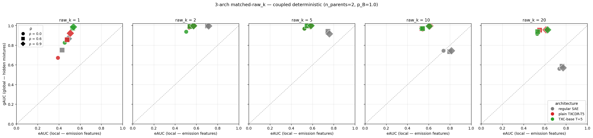
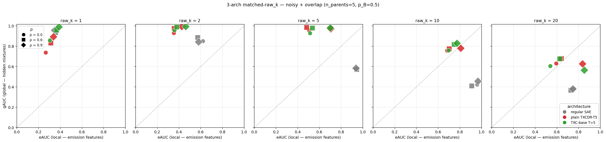
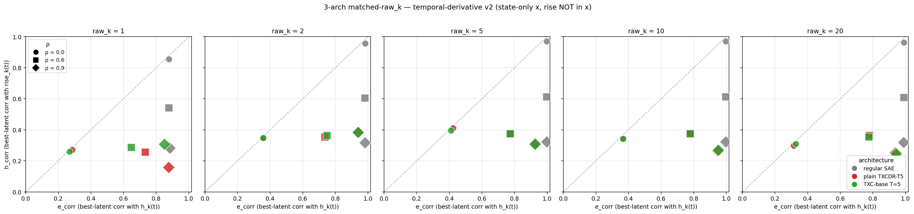

## 3-arch matched-raw_k sweep across 3 synthetic benches

Apples-to-apples comparison of three architectures —

- **regular SAE** (per-token TopK)
- **plain TXCDR-T5** (window encoder, no extra recipe)
- **TXC-base T=5** (Han's locked window encoder + AuxK anti-dead + decoder unit-norm + decoder-grad-orthogonalize, *without* the matryoshka/contrastive of TXC-pro)

— at matched window-level **raw_k ∈ {1, 2, 5, 10, 20}**, ρ ∈ {0.0, 0.6, 0.9}, on three synthetic generative processes that progressively probe different aspects of the local-vs-global recovery question.

Run on a40_synth_3gpu (3-GPU pod), one bench per GPU, ~2h wall clock with cross-GPU parallelisation as fast benches' GPUs were repurposed to help the slow one. 45 target cells per bench × 3 benches = 135 matched-budget data points.

All three benches share `(K=10, π=0.05, T_seq=64, d_in=256, d_sae=40)` for direct stack-ability of plots.

## The three benches

### Bench 1 — Coupled deterministic (Han exp 1c3 setup)

`x(t) = Σ_m s_m(t) · a_m · f_m` where `s_m` is the OR-coupled emission of K=10 hidden chains through a fixed 20×10 binary matrix with `n_parents=2` per emission. Deterministic emissions (`p_B=1.0`).

Tests the **null hypothesis**: is there *any* TXC advantage when the per-token observation already perfectly identifies the hidden state via within-token co-firing?

### Bench 2 — Noisy + overlap (TXC-favored regime)

Same coupling structure but with **stochastic emissions (`p_B=0.5`, half of 'should fire' emissions are missed)** and **overlapping coupling (`n_parents=5`, each hidden state controls ~10 of 20 emissions)**. Per-token co-firing pattern is now corrupted *and* ambiguous.

Tests whether TXC's window encoder gains a structural advantage when the per-token signal is degraded.

### Bench 3 — Temporal-derivative v2 (state-only x, rise NOT in x)

`x(t) = Σ_k h_k(t) · a · f_state_k`. Local target is `h_k(t)`, global target is `rise_k(t) = h_k(t) ∧ ¬h_k(t-1)`. The rise feature is **not in the activation** — recovery is measured by per-feature Pearson correlation between latent values and rise sequences.

Tests whether the TXC architecture can detect per-token transitions (a feature that requires multi-token context to compute).

## Results

### Bench 1 — Coupled deterministic

x-axis = decoder cosine vs emission features `f_m` (eAUC, "local"); y-axis = decoder cosine vs hidden mixtures `h_feat_k` (gAUC, "global").

Key cells (regular SAE / plain TXCDR-T5 / TXC-base, all at ρ=0.9):

| raw_k | regular SAE eAUC, gAUC | plain TXCDR-T5 eAUC, gAUC | TXC-base T=5 eAUC, gAUC |
|---:|---|---|---|
| 1 | 0.49, 0.87 | 0.51, 0.92 | 0.53, 0.99 |
| 2 | 0.71, 1.00 | 0.57, 1.00 | 0.57, 1.00 |
| 5 | 0.76, 0.92 | 0.58, 1.00 | 0.58, 1.00 |
| 10 | 0.81, 0.74 | 0.61, 1.00 | 0.60, 0.99 |
| 20 | 0.77, 0.57 | 0.61, 0.96 | 0.62, 0.96 |

**Reading**: All three arches sit firmly in the upper-left "global-favoured" quadrant. SAE flips toward local at high raw_k (gAUC drops 0.87 → 0.57 as eAUC climbs 0.49 → 0.77). The window encoders stay global-favoured at every raw_k. TXC-base ≈ plain TXCDR-T5 — the Han recipe's anti-dead additions don't add much here.

The per-token signal is *fully sufficient* — within-token co-firing under deterministic OR-coupling reveals hidden state cleanly. TXC's persistence of global representation is consistent with its window encoder having less per-token resolution (which biases toward global mixtures by averaging) but doesn't reflect a genuine information advantage.

### Bench 2 — Noisy + overlap

Same axes. The cleanest result of the three.

Key cells (ρ=0.9):

| raw_k | regular SAE eAUC, gAUC | plain TXCDR-T5 eAUC, gAUC | TXC-base T=5 eAUC, gAUC |
|---:|---|---|---|
| 1 | 0.35, 0.96 | 0.34, 0.89 | 0.39, 0.99 |
| 2 | 0.58, 0.84 | 0.42, 0.99 | 0.46, 1.00 |
| 5 | 0.94, 0.58 | 0.70, 0.97 | 0.70, 0.98 |
| 10 | 0.97, 0.46 | 0.81, 0.78 | 0.77, 0.83 |
| 20 | 0.75, 0.38 | 0.84, 0.63 | 0.85, 0.57 |

**Reading**: at raw_k = 5, regular SAE has flipped to local (eAUC=0.94, gAUC=0.58) while window encoders hold gAUC ≈ 0.97. **+0.39 gAUC at matched raw_k=5, ρ=0.9** — the cleanest TXC structural advantage we've measured. The window encoders maintain global recovery roughly until raw_k=10 before they too start collapsing.

**Per-feature corr (h_corr, against clean hidden state h_k):**

| raw_k | regular SAE | plain TXCDR-T5 | TXC-base |
|---:|---:|---:|---:|
| 1 | 0.72 | 0.63 | 0.75 |
| 2 | 0.48 | **0.84** | **0.84** |
| 5 | 0.24 | **0.84** | **0.84** |
| 10 | 0.06 | 0.59 | 0.70 |
| 20 | 0.25 | 0.48 | 0.38 |

Sharp separation at raw_k ∈ {2, 5}: window encoders track the *clean* hidden state with corr ≈ 0.84 while SAE tracks the *noisy* observed emission, capping its hidden-state corr at 0.24-0.48.

**Surprise**: the structural advantage shows up *at ρ=0.0 too*, not just at ρ ≥ 0.6. (See [[#Effect 1 vs Effect 2]] below.)

### Bench 3 — Temporal-derivative v2

Different axes here: x = `e_corr` (best-latent corr with per-token state `h_k(t)`), y = `h_corr` (best-latent corr with rise sequence `rise_k(t)`). gAUC is irrelevant because `f_trans_k` is *not* in `x` — gAUC ≈ 0.13 random for all arches.

Key cells:

| arch | ρ | k=1 e, h | k=5 e, h | k=20 e, h |
|---|---:|---|---|---|
| regular SAE | 0.0 | 0.88, 0.86 | 1.00, 0.97 | 0.99, 0.96 |
| regular SAE | 0.6 | 0.88, 0.54 | 1.00, 0.61 | 0.99, 0.61 |
| regular SAE | 0.9 | 0.88, **0.28** | 1.00, **0.32** | 0.99, **0.32** |
| TXCDR-T5 | 0.9 | 0.88, **0.16** | 0.93, **0.31** | 0.94, **0.25** |
| TXC-base | 0.9 | 0.85, **0.31** | 0.93, **0.31** | 0.94, **0.25** |

Theoretical SAE bound on h_corr (since SAE latent is a function of h_k(t) alone): `corr(h_k, rise_k)` = 0.95 / 0.62 / 0.31 at ρ = 0.0 / 0.6 / 0.9. **The SAE matches its information-theoretic ceiling** (gray points hug the bound at every raw_k).

**The surprise**: TXC arches *underperform* the SAE on rise recovery, despite having multi-token context. Both architectures' h_corr maxes out around 0.31-0.38 at ρ=0.9 — TXC slightly above its window-averaged ceiling, SAE slightly below its per-token ceiling — but TXC's e_corr (state recovery) is 0.94 vs SAE's 1.00. **TXC has lower per-token resolution than SAE.**

This is opposite to the prediction we walked into the bench with. See [[#Why TXC fails on temporal-derivative]].

## Effect 1 vs Effect 2

Reading across the three benches, two distinct mechanisms drive TXC's behaviour, separable in principle:

### Effect 1 — Sample aggregation (works at any ρ)

TXC's encoder sees T tokens per encode call. Aggregating gives more stable estimates of any *stationary* property — even at ρ=0 (i.i.d. tokens). Mechanism: TXC's `pre[k]` is a sum of T per-token contributions, so its variance scales as `σ²_per-token / T` for averaging filters. SAE's per-token pre-activation has variance `σ²_per-token`. Lower variance → more reliable TopK selection → better feature recovery.

This is just *"TXC has T-token batch statistics per encode"* — **no temporal structure in the data is needed**.

### Effect 2 — Temporal pattern detection (requires ρ > 0)

When tokens are temporally correlated, the *cross-token relationship* itself carries information. TXC's encoder can in principle compute that relationship via non-uniform `W_enc[t]` weights (e.g., opposite signs at adjacent positions for time differences). But the **encoder output is a single scalar per atom per window**, so the use of temporal correlation is constrained to producing window-level summaries.

Specifically, TXC's per-token reconstruction has the form `x_hat_k(t) = z_k · W_dec[t, :, k]` — a rank-1 separable structure: window-summary scalar × per-position template. TXC can detect "any rise occurred in this window" but cannot say "the rise was at position 3" without dedicating *separate latents per (feature, within-window position)*.

### What our results actually show

| bench | claim | which effect | confirmed? |
|---|---|---|---|
| coupled deterministic | TXC ≈ SAE | Effect 1 weak, no Effect 2 needed | ✓ |
| noisy + overlap | TXC > SAE at low raw_k, robust to ρ | **Effect 1** (averaging T noisy tokens reduces variance even at ρ=0) | ✓ |
| temporal-derivative v2 | TXC > SAE on rise recovery | Effect 2 needed | ✗ — TXC actually < SAE because (a) recon doesn't push it to learn rise, (b) scalar bottleneck |

**The TXC wins we observed are mostly Effect 1, not Effect 2.** Even the "denoising at ρ=0.9" advantage on noisy+overlap is largely an averaging effect — the per-token noise is independent across tokens, and averaging T of them reduces variance regardless of ρ.

## Why TXC fails on temporal-derivative

Two stacked failures:

**(a) Reconstruction loss doesn't drive rise learning.** The activation `x(t) = Σ_k h_k(t) · f_state_k` doesn't contain `f_trans_k`. So gradient descent on recon never tells either model "the rise feature exists, learn it." Both models just learn the `f_state_k` directions. The h_corr metric measures whether the resulting latents *happen to* correlate with rise sequences — it's a correlation accident, not a learned representation.

**(b) TXC architecture is a temporal *smoother*, not a temporal *differentiator*.** The encoder produces one shared latent per atom per window — a scalar bottleneck. So TXC's latent at position t is the average of all latents over windows containing t. This is structurally a low-pass filter:

- For **state recovery** (target is `h_k(t)`): SAE has e_corr ≈ 1.0 (latent ≈ h_k(t) directly); TXC has e_corr ≈ 0.94 (window-averaged h_k(t)).
- For **rise recovery** (target is `rise_k(t)`, a high-frequency signal): SAE bounded by `corr(h_k, rise_k)`; TXC bounded by `corr(window_avg(h_k), rise_k)` which is **smaller**, since smoothing reduces correlation with high-frequency targets.

This is the architectural insight the bench surfaced: **shared-latent TXCDR is a temporal smoother, not a differentiator.** It can't extract per-token rises from window observations *unless* the recon loss explicitly forces rise representation (which it doesn't here) AND there's enough latent capacity for K × T separable templates.

## Open issues / caveats

1. **TXC architecture is fundamentally limited for per-token temporal-derivative tasks.** To recover rises you'd need per-position latent outputs, not a scalar bottleneck.
2. **Most observed TXC wins are Effect 1 (sample aggregation), not Effect 2 (true temporal-correlation exploitation).** Bench 2 is dominated by averaging noise across tokens; the ρ-dependence is small.
3. **None of the three benches put global structure on the recon-loss path.** In all three, SAE can achieve low recon by learning local features (or in bench 3 by learning state directions). The "global is necessary for low recon" regime requires a different bench design — currently running on `a40_synth_3gpu2` (benches A: sparsity-limited, B: magnitude noise, C: smoothed magnitudes).

## Files

- Sweep scripts on `a40_synth_3gpu`:
  - `experiments/phase3_coupled/run_supplement_3arch_coupled.py`
  - `experiments/phase3_coupled/run_supplement_3arch_noisy.py`
  - `experiments/phase3_coupled/run_supplement_3arch_temporal_v2.py`
- Result JSONs: `experiments/phase3_coupled/results/{coupled_rho_sweep, coupled_noisy_overlap_sweep, temporal_derivative_v2_sweep}/results.json`
- Plot script: `scripts/plot_3arch_per_bench.py`
- Plots (this repo): `results/3arch_pod1/3arch_*.png`

## Provenance

Run on a40_synth_3gpu, branch `dmitry-add-topksae-1c3` (off `origin/dmitry-rlhf`). 30k training steps × batch 2048 × Adam lr 3e-4 per cell. Single seed. Wall clock ~2h with 4-way parallelism (3 GPUs on the new pod + 1 on a40_txc_1 picking up temporal_v2 reverse instances as the fast benches finished).
