## FrequencyBench: when does a temporal dictionary architecture have a frequency response?

### Executive summary

**Goal.** Build a quantitative way to measure *at which temporal frequencies a
dictionary-learning architecture (SAE, temporal crosscoder, conv dictionary)
finds features*, and an architecture that decomposes its dictionary by
frequency. Testbed: cyclic synthetic processes $Q_{t+1} = Q_t + Y \bmod 101$
whose hidden velocity $Y$ is invisible from any single token; activations
$x_t = u_{Q_t} + \text{noise}$; all architectures matched on dictionary size
and window-level sparsity, scored by linear probes on their codes,
oracle-normalized. Five findings:

**1. What a temporal dictionary buys is *linear* decodability of temporal
structure — which per-token codes provably cannot fully provide.** We prove
any additive-over-time readout of per-token codes (every linear probe on
stacked or pooled SAE codes) has velocity-independent mean scores, so perfect
linear decoding is impossible; empirically the gap is total: on the sign
task, linear probes on raw windows and on
per-token SAE codes sit at chance (0.50) while the same probe on window-TXC /
multiband / conv codes reads the sign at 0.90–1.00. An MLP probe gets 1.00
on raw windows and on the per-token SAE codes alike — the information was
always there and the SAE preserves it; what the temporal dictionary adds is
moving the cross-token nonlinearity out of the readout.

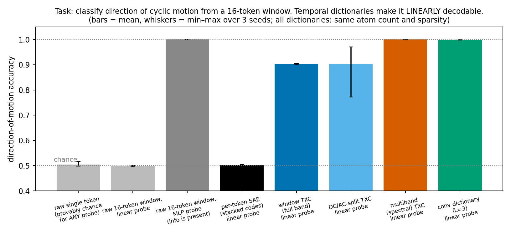

**2. "Frequency" is a property of the embedding geometry, not the symbolic
process — the proposed benchmark had no frequency axis.** For prime $M$ and
random (exchangeable) embeddings, relabeling symbols by $a \mapsto ca$ turns
velocity $y$ into velocity $cy$ without changing the data distribution, so we
prove two-velocity tasks $\{y, y'\}$ have difficulty depending only on the
*multiplicative ratio* $y'/y \bmod M$ — there is no "slow vs fast" — and
confirm the predicted extension to the 10-class benchmark: confusion tracks
exact window symbol-overlap (Spearman ρ = 0.66, p = 1e-5; partial ρ = 0.57
controlling velocity distance) while velocity distance has no significant
relation once overlap is controlled (partial ρ = 0.29, p = 0.08). Embedding the symbols on a circle (how real LLMs embed cyclic
concepts — Engels et al. 2024) turns velocity into a genuine temporal tone
($f = y/M$ cycles/token); 97% of the confusion mass then falls on the three
closest frequency pairs, inside the window-resolution (Rayleigh) cell
$|\Delta f| < 1/W$. Same process, same architectures — opposite confusion
geometry.

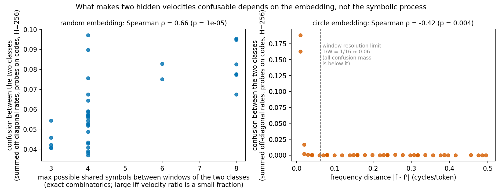

**3. The frequency-response curve works, and it reads out each
architecture's intrinsic timescale.** On the circle task: per-token SAEs
(timescale 1) are flat at chance; window TXCs (timescale 16) track the
maximum-likelihood periodogram for $f \gtrsim 1/W$ but dip at slower tones —
mildly *high*-pass, falsifying the preregistered "TXC is low-pass" guess;
3-tap conv dictionaries (timescale 3) resolve only coarse/fast distinctions
yet are near-perfect on sign. Window-length scans move the low-frequency
deficit as $1/W$ (Rayleigh), and a capacity scan shows window dictionaries
larger than the number of distinct clean windows (1010 = 101 phases × 10
velocities) "solve" even the geometry-free random-embedding task by
memorizing those windows, while shift-local conv dictionaries cannot. (Both scans: §4.5.)

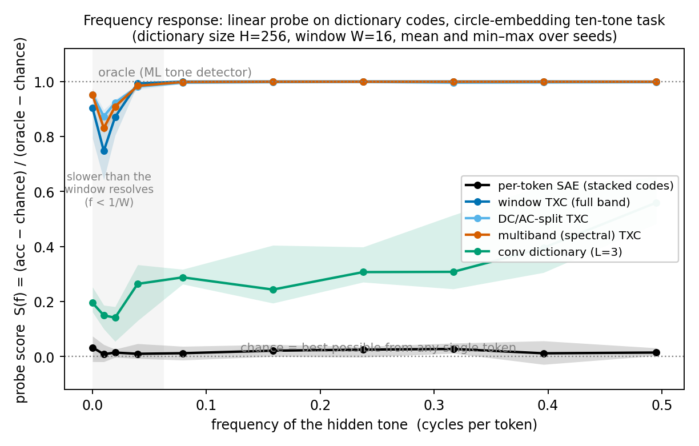

**4. A spectral (frequency-split) crosscoder decomposes the dictionary by
band at no response cost.** With encoder/decoder kernels constrained to DCT
bands (vanilla TXC = the single-full-band special case), per-branch probes
show each nonzero tone is decoded by the branch owning its frequency (with
boundary tones shared between adjacent branches) — a verified spectral
decomposition of the learned dictionary. Vanilla TXC matches this response
but organizes differently: only its 32 busiest atoms become tone-like
(kernel-spectrum concentration 0.58 vs the 0.21 random baseline — and the
baseline value exactly when trained on the geometry-free embedding; §4.4
quantifies). The
split provides band-attributed atoms at no measured cost in response — and
under *superposition* (three simultaneous hidden tones, §4.6) it wins
outright: per-lane accuracy 0.96 vs 0.91 for vanilla at matched budgets,
in a regime where memorization is impossible by construction.

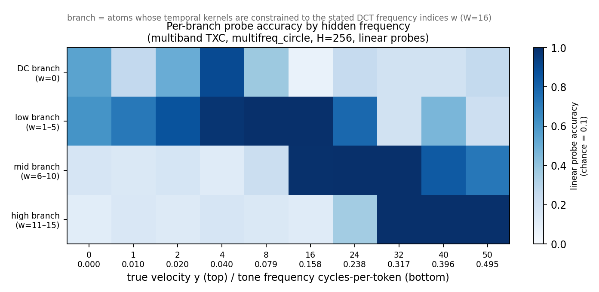

**5. The story transfers to a real model.** GPT-2's weekday embeddings form
a circle in weekday order (Engels et al.'s geometry, recovered by PCA), and
on day-stride sequences ("Monday Wednesday Friday ..." = stride 2 on
$\mathbb{Z}_7$) the embedding layer reproduces the synthetic pattern:
single positions at chance (0.149 vs 1/7), per-token SAE codes 0.53 (above
chance through the variance loophole, far from converting), and
window/spectral/conv dictionary codes 1.00 under the same linear probe. One attention block then
linearizes stride at every position except the context-free position 0 — so
temporal dictionaries earn their keep precisely at the interfaces where the
model has not yet done the conversion itself, and the position-resolved
probe map locates those interfaces.

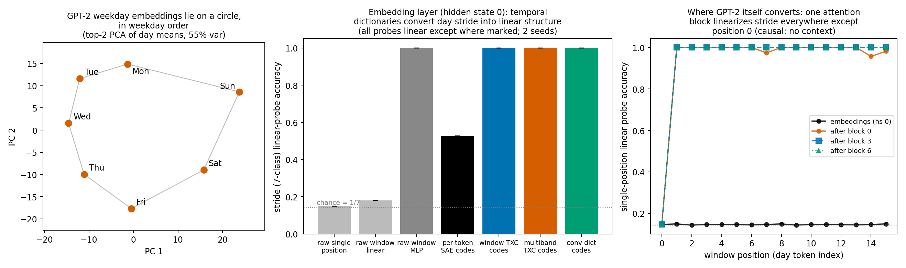

**Bottom line.** "Which timescale does this architecture find features at?"
is answerable — but only relative to an embedding geometry, an oracle
normalization, and capacity, window-length, and probe-budget controls. The
sprint built all of these, demonstrated the failure modes each control
catches, and delivered the spectral crosscoder decomposition the proposal
asked for.

### 1. The question

Temporal dictionary architectures (temporal crosscoders, convolutional sparse
dictionaries, temporal SAEs) read a window of activations instead of a single
token. The north-star question of this sprint: **can we quantitatively measure
the timescale — equivalently, the temporal frequency — at which such an
architecture finds features, and can we build an architecture that decomposes
its dictionary by frequency?** The starting point was the FrequencyBench
proposal (`docs/dmitry/proposals/frequencybench_pedagogical.tex`): three
synthetic tasks (DC smoothing, AC signed motion, mixed ten-frequency cyclic
process) plus a probe-based "frequency response" metric.

The sprint produced five results:

1. A clean conceptual + formal account of *what temporal probes actually
   measure*: temporal dictionaries convert order/phase structure into linearly
   decodable code structure; for per-token codes, perfect linear decoding is
   provably impossible and measured decoding is at chance (§3, §4.1).
2. A theorem showing the ten-frequency benchmark, as originally specified, has
   **no frequency axis at all**: with random symbol embeddings, an exact
   relabeling symmetry makes any two-velocity task's difficulty a function of
   the velocities' multiplicative ratio alone — "slow" and "fast" are not
   concepts the data supports — and the predicted (and empirically confirmed)
   extension organizes the full 10-class benchmark's confusions by ratio,
   not distance (§3, §4.2). The benchmark is rescued by a
   **circle embedding**, under which hidden velocity becomes a genuine temporal
   tone and the maximum-likelihood decoder is a periodogram (§3).
3. Measured frequency-response curves for five dictionary architectures at
   matched dictionary size and matched window-level sparsity (§4.3).
4. A frequency-split ("spectral") crosscoder whose per-branch codes decompose
   the response by band, verified by branch-resolved probes (§4.4); it beats
   the vanilla crosscoder under superposition (§4.6).
5. A first real-model transfer: GPT-2's weekday embeddings are a circle, the
   embedding layer reproduces the conversion result exactly, and a
   position-resolved probe map shows one attention block performing the
   conversion internally (§4.7).

### 2. Setup

#### 2.1 Generative processes

All tasks emit a symbol sequence $Q_t \in \mathbb{Z}_M$ and present the
architecture with activations

$$x_t = u_{Q_t} + \sigma\,\varepsilon_t \in \mathbb{R}^d,\qquad
\varepsilon_t \sim \mathcal N(0, I_d)\ \text{i.i.d.},\quad \sigma = 0.25,$$

where $u: \mathbb{Z}_M \to \mathbb{R}^d$ is a fixed symbol embedding. Windows
of length $W = 16$ are the training unit. Three processes (the proposal's
suite):

- **DC (smoothing)**: hidden class $C \sim \mathrm{Unif}([K])$, $K = 8$;
  each token shows $C$ with probability $p = 0.6$, otherwise a uniformly
  random wrong symbol. Context helps only by averaging repeated noisy
  evidence. Single-token Bayes accuracy $= p$.
- **AC sign**: $M = 17$, $Q_t = B + S v t$ with $v = 8$, sign
  $S \sim \mathrm{Unif}\{\pm 1\}$, phase $B \sim \mathrm{Unif}(\mathbb{Z}_M)$.
  The label is the *direction of motion*; a single token carries zero
  information about it (proof in §3, P1).
- **Ten-velocity cyclic**: $M = 101$ (prime),
  $Q_t = B + Yt$, $Y \sim \mathrm{Unif}(\Omega)$,
  $\Omega = \{0, 1, 2, 4, 8, 16, 24, 32, 40, 50\}$. The label is the hidden
  velocity $Y$. This is the proposal's "frequency response" task.

Two embedding families for the cyclic tasks:

- **random**: $(u_a)$ = random orthonormal frame in $d = M$ dimensions
  (exchangeable across symbols — relabeling symbols leaves the ensemble
  invariant; exact for Haar frames, and our QR-based generator is Haar up to
  a sign convention, see `theory.md`). This is the proposal's implicit
  default.
- **circle**: $u_a = R\,(\cos 2\pi a/M,\ \sin 2\pi a/M)^\top$ with $R$ a random
  $d{\times}2$ isometry, $d = 8$. Symbol space inherits the geometry of a
  circle. This choice is not a contrivance: Engels et al. (2024) found that
  real LLMs represent cyclic concepts (weekdays, months) as exactly such
  circles.

#### 2.2 Architectures, matched budgets

Five dictionary architectures, all trained by reconstruction (MSE) with TopK
sparsity, matched on **total atom count $H$** and **window-level L0
$k_{\mathrm{win}} = 32$** (i.e. 2 active atoms per token on average):

| name | encoder | codes per window |
|---|---|---|
| per-token SAE | TopK SAE applied to each token independently ($k{=}2$) | $W$ codes of dim $H$, probed stacked |
| window TXC | full-window kernels $e_{j,\tau}$, one TopK over the window | one code of dim $H$ |
| DC/AC-split TXC | two branches: time-constant kernels; zero-mean kernels | $H/2 + H/2$, $k = 16 + 16$ |
| multiband (spectral) TXC | four branches, kernels constrained to DCT bands $\{0\}, \{1\text{–}5\}, \{6\text{–}10\}, \{11\text{–}15\}$ | $4 \times H/4$, $k = 4 \times 8$ |
| conv dictionary | length-3 temporal filters, codes per (atom, position), TopK over all | $H \times W$ grid, budget 32 |

Dictionary sizes are scaled to each task's alphabet ($H = 64$ for DC with
$K = 8$ symbols, $H = 128$ for the sign task with $M = 17$, and
$H \in \{64, 256, 2048\}$ for the $M = 101$ cyclic tasks, swept in §4.5);
within a task every architecture gets the same $H$ and the same
$k_{\mathrm{win}}$. Concretely, a window-TXC atom $j$ has a kernel $e_{j,\tau} \in \mathbb{R}^d$ per
window position $\tau$; its preactivation on window $X = (x_0..x_{W-1})$ is
$p_j = \sum_\tau \langle e_{j,\tau}, x_\tau \rangle + b_j$, and the code
is $z = \mathrm{TopK}_{k_{\mathrm{win}}}(p) \in \mathbb{R}^H$ (one TopK across all
atoms of the window, ReLU-rectified). The conv dictionary computes
$p_{j,t} = \sum_{\delta=-1}^{1} \langle e_{j,\delta}, x_{t+\delta}
\rangle + b_j$ at every centre $t$ and applies one TopK with the same budget
over the full $H \times W$ grid. "Probed stacked" for the per-token SAE
means the probe sees the concatenation of the $W$ per-token code vectors
($W \cdot H$ dimensions). All TXC variants are implemented as one class
(`SpectralTXC`) parameterized in the DCT domain; the vanilla window TXC is the single-full-band special case
(the DCT is an orthonormal rotation of the time axis, so this is exactly the
standard temporal crosscoder). Decoder kernels are band-constrained the same
way, so the multiband reconstruction is a sum of band-limited parts
$\hat X = \hat X_{DC} + \hat X_{low} + \hat X_{mid} + \hat X_{high}$.

#### 2.3 Metric

Train the dictionary unsupervised; freeze it; encode held-out windows; fit a
**multinomial linear probe** on the codes to predict the hidden label (separate
20k-window train / 5k-window test sets; features standardized; identical probe
class and optimization for every architecture). The single normalized score
used throughout (overall or per class $\omega$) is

$$S = \frac{A - A^{\star}_{\mathrm{loc}}}{A_{\mathrm{oracle}} -
A^{\star}_{\mathrm{loc}}},$$

where $A$ is probe accuracy, $A^{\star}_{\mathrm{loc}}$ is the single-token
Bayes ceiling (= chance $= 1/|\Omega|$ for the cyclic tasks by P1, $= p$ for
the DC task), and $A_{\mathrm{oracle}}$ is a strong reference decoder run on
the same noisy windows: symbol-majority vote for DC, consecutive-difference
votes for the sign task, and the periodogram matched filter (§3, P4) for the
circle task. $S = 0$ means the single-token ceiling; $S = 1$ means
oracle-level. Raw accuracies are labeled "acc" wherever quoted. An MLP probe (1 hidden layer, 512 units) is
reported alongside as an information-presence check; the *linear* probe is the
headline because linear decodability of the hidden mode is precisely what a
good dictionary should buy you (§4.1 makes this principled).

Every run also reports reconstruction FVU and realized L0, so undertrained or
dead models are visible rather than silently scored.

### 3. Theory

Proofs are short; full statements in `theory.md`. $M$ prime throughout.

#### P1 — single tokens carry zero velocity information

For any fixed velocity $y$, $Q_t = B + yt$ with $B$ uniform is uniform on
$\mathbb{Z}_M$. Hence $I(Y; x_t) = 0$: **any** single-token encoder, however
nonlinear, is at chance for $Y$. The same argument gives $I(S; x_t) = 0$ for
the sign task. (Proposal's claim, restated.)

#### P2 — additive-over-time readouts cannot perfectly decode velocity

Let $\phi_t$ be arbitrary per-token maps (e.g. any per-token SAE encoder) and
score classes additively over time:
$S_y(X) = \sum_t \langle w_{y,t}, \phi_t(x_t)\rangle + b_y$ — this covers every
linear probe on concatenated or mean-pooled per-token codes. Because each
$Q_t$ is marginally uniform *conditional on any velocity*, $\mathbb E[S_y \mid
Y]$ is the same for every conditioning $Y$. Equal conditional means rule out
almost-sure separation of any two velocities. The bottleneck is **additivity
across time**: each token may be processed arbitrarily; tokens may never
interact before the readout.

Two important honest caveats, both verified empirically (§4.1):

- The theorem forbids *perfect* separation, while leaving room for weak
  above-chance behaviour through variance differences (the conditional means
  are equal but the distributions differ). We observe exactly this: linear
  probes on raw stacked windows reach 0.13–0.17 on the 10-class circle task —
  above chance through the variance loophole, far below the 0.99 oracle.
- A *nonlinear* readout of an order-destroyed summary can still decode speed:
  the window's symbol **multiset** is an arithmetic progression whose common
  difference reveals $\{y, -y\}$. A bag-of-symbols MLP therefore solves
  every velocity pair **except sign pairs $\{y, -y\}$**, which have identical
  symbol sets. Order information is needed for *direction*, not *speed* —
  and the sign task isolates exactly this (§4.2).

#### P3 — the random-embedding benchmark has no frequency axis (ratio invariance)

For $c \neq 0$, the relabeling $a \mapsto ca \bmod M$ maps velocity-$y$
sequences bijectively onto velocity-$cy$ sequences (phases stay uniform). A
random orthonormal embedding is exchangeable, so the relabeling leaves the
data distribution invariant. Consequence: **the two-velocity task $\{y, y'\}$
has difficulty depending only on the ratio orbit $\{r, r^{-1}\}$,
$r = y'/y \bmod M$** — for any architecture, any probe, any sample size. The
task $\{1, 2\}$ is *exactly* as hard as $\{8, 16\}$ and $\{16, 32\}$; "slow"
versus "fast" is not a property the data distinguishes. A complementary
spectral view: each Fourier character channel $\chi_k$ of $\mathbb{Z}_M$
carries a unit-power tone at temporal frequency $ky/M$, so for prime $M$ the
channel-summed power spectrum is identical (uniform) for every $y \neq 0$.
(The exact statement covers two-class tasks; the 10-class joint is not
exactly invariant because multiplication does not fix $\Omega$ as a set.
The ratio organization of the 10-class confusion matrix is therefore a
*prediction*, which §4.2 confirms.)

Confusability instead has *multiplicative* structure: windows of velocities
$y, y'$ share symbols along a slope-$r$ line in the $(t, s)$ position torus;
small-integer ratios align the line with the window (a ratio-2 pair shares up
to $W/2 = 8$ of 16 symbols; generic pairs ~2–3).

#### P4 — the circle embedding restores frequency semantics

Projecting onto the circle plane, $c_t := R^\top x_t$ is a unit-amplitude
complex tone at $f_y = y/M$ cycles/token with uniform random phase in white
Gaussian noise. Velocity *is* temporal frequency;
$\Omega$ becomes a ladder from DC ($f{=}0$) to Nyquist ($f{=}0.495$). The ML
classifier is the **periodogram argmax** over candidate frequencies (classical
tone detection, Rife–Boorstyn 1974) — this is the oracle we run. Window
resolution obeys the Rayleigh limit $\Delta f \sim 1/W$: at $W = 16$, classes
$y \in \{0, 1, 2, 4\}$ all sit inside one resolution cell and are separated
only by SNR. This is why $S(\omega)$ must be normalized by the *per-class*
oracle: an architecture can look "high-pass" simply because slow tones are
intrinsically harder in a short window. In DCT-index units the ladder maps to
$w \approx \{0, 0.3, 0.6, 1.3, 2.5, 5.1, 7.6, 10.1, 12.7, 15.8\}$, neatly
spanning the multiband model's four bands.

#### P5 — capacity routes: memorization versus spectral structure

Clean windows of the cyclic task form only $|\Omega| \cdot M = 1010$ distinct
templates. A window dictionary with $H \gtrsim 1010$ atoms can solve the task
by **template memorization**, regardless of temporal structure; a spectral
dictionary needs only a small bank of windowed tones (per frequency: a
quadrature pair tiling phase). Hence the capacity sweep $H \in \{64, 256, 2048\}$:
below the template count, structure is forced; above it, memorization is
available.

### 4. Results

All numbers are means over 3–5 dictionary seeds (each seed also redraws the
embedding); error bars in figures are min–max over seeds. FVU and L0 are
reported for every model. Probes: identical class and optimization across
architectures.

#### 4.1 Conversion: what a temporal dictionary buys is *linear* decodability

On the AC sign task ($W{=}16$): raw single token 0.504, raw stacked window +
linear probe 0.499 (theory: P1, P2), raw stacked window + MLP 1.000 (the
information is plainly present), per-token SAE stacked codes + linear probe
0.501. One layer of temporal filtering changes everything: window TXC 0.903,
DC/AC split 0.904, multiband 1.000, conv dictionary 0.999 — all with the same
linear probe, matched atom count and matched window L0.

Two refinements:

- An MLP probe on the *per-token SAE codes* also reaches 1.000: the SAE
  denoises tokens into symbol indicators, after which a nonlinear readout can
  compute the order statistic itself. The dictionary contribution specific to
  *temporal* architectures is moving that nonlinear computation into the
  dictionary, so that downstream linear structure (the standard assumption of
  interpretability pipelines) suffices.
- Mean-pooled per-token codes + linear probe: 0.502 — smoothing carries zero
  sign information, as the theory requires (sign pairs have identical symbol
  multisets).

The per-token-code MLP result sharpens what the score $S$ should mean:
**use linear probes, and interpret $S$ as measuring conversion-to-linearity,
which is the actual deliverable of a dictionary.**
Window information content (MLP/oracle probes) is the *denominator*, never the
headline.

On the DC task every method including raw mean-pooling scores ≈ 0.99
(single-token ceiling 0.59 ≈ p = 0.6 as proven; oracle 0.997): pure smoothing
is sufficient, no dictionary needed. The DC benchmark functions as a control —
it cannot distinguish architectures, and per the shuffle diagnostic the signal
is entirely order-free.

#### 4.2 The embedding determines whether "frequency" exists

The ratio-invariance theorem (P3) says the random-embedding task cannot have a
frequency axis; the coincidence-line geometry (P3, second part) says its difficulty
structure should instead be *multiplicative*: two velocity classes are
confusable in proportion to how many symbols their windows can share, which is
governed by the minimal-fraction form of the ratio, $r \equiv \pm p/q \bmod M$
(max shared symbols $\approx W/\max(p,q)$, computed exactly by combinatorics).

Both predictions check out quantitatively on the 10-class confusion matrices
(window-TXC family, $H{=}256$, summed over seeds and variants):

- **Random embedding** ($n = 36$ pairs; the 9 pairs involving $y{=}0$ are
  excluded since overlap is undefined for a constant window): pairwise
  confusion correlates with exact max symbol overlap at Spearman
  $\rho = 0.66$ ($p = 1.3{\times}10^{-5}$) and with velocity distance at
  only 0.43. The two predictors are themselves correlated; partial rank
  correlations separate them: overlap retains $\rho = 0.57$
  ($p = 3{\times}10^{-4}$) controlling distance, while distance retains no
  significant relation controlling overlap ($\rho = 0.29$, $p = 0.08$). The most confused pairs are
  exactly the overlap-8 pairs (1,2), (2,4), (16,32) and the small-fraction
  pairs (16,24) ($r = 3/2$), (24,32) ($r = 4/3$). A data-driven refinement of
  the theory: the operative invariant is $\max(p, q)$ of the ratio, e.g.
  $r=3/2$ pairs are nearly as confusable as $r=2$ pairs.
- **Circle embedding** ($n = 45$ pairs): confusion rises as frequency
  separation shrinks (Spearman $\rho = -0.42$ against $|\Delta f|$,
  $p = 4{\times}10^{-3}$), with only a weak residual association with symbol
  overlap ($\rho = 0.35$, $p = 0.04$ — expected, since the slowest pairs are
  both frequency-adjacent and small-ratio). The sharper statement: **97% of
  all confusion mass sits on the three closest pairs (0,1), (1,2), (2,4)**,
  all inside the Rayleigh cell $|\Delta f| < 1/W$ (eight of the 45 pairs are
  sub-Rayleigh; confusion concentrates on the tightest three).

(Why does overlap govern the dictionary+linear-probe pipeline but not the
bag-of-symbols MLP, which solves every non-sign pair outright? Extracting a
progression's common difference from its symbol set is a *nonlinear*
computation; the MLP performs it, a linear readout cannot (P2). What a linear
probe on codes can use is which detector atoms fire, and high-overlap windows
fire overlapping atom sets — so overlap directly erodes the linear margin.)

Same symbolic process, same architectures, same probes — **whether
"confusable" means "multiplicatively related" or "spectrally close" is decided
entirely by the geometry of the symbol embedding.** A frequency response is a
property of (process, embedding) jointly; benchmark designs that leave the
embedding arbitrary measure something number-theoretic instead. For real
models the relevant analogy: Engels et al. found cyclic concepts embedded as
circles in LLMs, so the circle arm is the realistic one; the random arm is the
adversarial control.

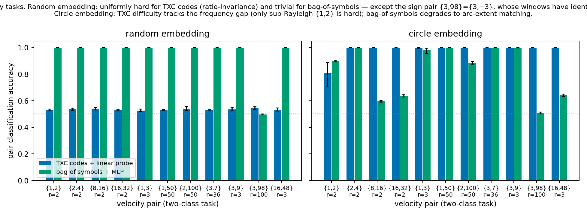

Two-class velocity tasks give the controlled version. Under the random
embedding, TXC-code linear probes land at 0.52–0.55 for *every* pair —
ratio-2, ratio-3, generic, and scaled versions alike. The theorem demands
equality only *within* a ratio orbit; the observed across-orbit uniformity is
an (unpredicted) empirical regularity on top of it. A bag-of-symbols readout (mean-pooled per-token
SAE codes + MLP, all order destroyed) solves *every* random-embedding pair at
1.000, because a window's symbol **set** is an arithmetic progression whose
common difference reveals the speed — with one exception, predicted in
advance of the run (log entry H1:35) once the symbol-set mechanism was clear:
the **sign pair** $\{3, 98\} = \{3, -3\}$, whose two classes produce
*identical* symbol sets. There bag-of-symbols falls to 0.497 (random) /
0.514 (circle), while TXC codes read the direction at 1.000 under the circle
embedding (and stay at the ratio-invariant 0.54 under the random one). Direction is the only velocity attribute that requires
order; speed hides in the symbol set. Under the circle embedding the same
TXC instead tracks the frequency gap: every pair is at 0.998–1.000 except the
sub-Rayleigh pair $\{1, 2\}$ at 0.81.

#### 4.3 Frequency response curves: the architecture's timescale is visible

The headline measurement. Each curve is one architecture's oracle-normalized
linear-probe score $S(f)$ against the hidden tone frequency, on the circle
task at $H = 256$, $W = 16$ (3 seeds, shaded min–max). Three response shapes,
matching three intrinsic timescales:

- **Per-token SAE (timescale = 1 token)**: flat near chance ($S \le 0.04$
  at every frequency), consistent with P1/P2. Its codes are excellent symbol detectors (that is visible in the
  MLP probe, which reaches ≈ 0.95 from the same codes) but no per-token
  code can make frequency linearly readable.
- **Window TXC family (timescale = 16 tokens)**: at the periodogram oracle for
  $f \geq 0.08$ cycles/token, with a consistent dip (S ≈ 0.8) at the slowest
  nonzero frequencies. The proposal predicted vanilla TXC would be *low-pass*;
  the measurement says the opposite — relative to the ML decoder the window
  dictionary family is mildly **high-pass**, under-performing exactly where
  tones are slower than the window (the sub-Rayleigh cluster $f < 1/W$, see
  the confusion analysis in §4.2 and the W-scan in §4.5).
- **Conv dictionary (timescale = 3 tokens)**: intermediate everywhere
  (S ≈ 0.13–0.35), *rising* with frequency and with large seed variance. A
  3-tap filter has bandwidth ~1/3 cycles/token, so neighbouring ladder tones
  are inside one filter bandwidth and only coarse (fast) distinctions are
  linearly readable. The same architecture is essentially perfect on the sign
  task (0.999), where the discrimination is a single large-angle transition —
  direction detection needs only a short baseline, frequency discrimination
  needs a long one.

Vanilla, DC/AC-split, and multiband TXC are statistically indistinguishable on
this curve at $H = 256$: at a comfortable capacity, band constraints do not
change *where* the family succeeds. They do change behaviour at low capacity
(multiband is better and far more seed-stable at $H = 64$, §4.5) and *how*
the information is organized (§4.4).

#### 4.4 The spectral crosscoder decomposes the response by branch

For the multiband (spectral) crosscoder we can probe **each branch's codes
separately**. The result is a staircase: the low branch (DCT indices 1–5,
i.e. $f \lesssim 0.16$) carries the linearly decodable information about slow
tones ($y \in \{1, 2, 4, 8\}$), the mid branch about $y \in \{16, 24\}$, the
high branch about $y \in \{32, 40, 50\}$ — matching the a-priori band
assignment of each tone (P4 table) almost exactly. The DC branch's graded
first row has a clean mechanism: a time-constant kernel sees the window
*mean*, whose magnitude follows the Dirichlet-kernel envelope $|D_W(f)|$ —
close to 1 for slow tones and decaying with $f$ — so DC codes rank slow tones
by mean length, with no order information involved.

This is the concrete sense in which the spectral crosscoder "does the
decomposition": its reconstruction is a sum of band-limited parts by
construction, and its code space factorizes the hidden temporal structure by
frequency band, verified by independent probes.

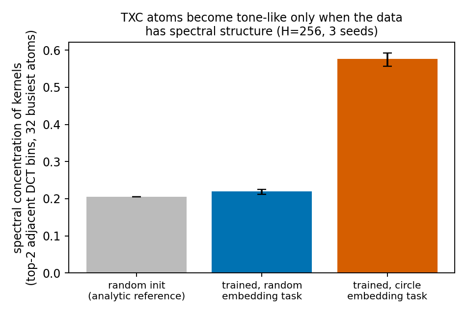

What about the *vanilla* TXC's atoms? A sorted heatmap of kernel spectra
(`FreqFrac`, `figures/fig_freqfrac_multifreq_circle_H256.png`) looks like a learned filter bank, but quantification
deflates that impression — and taught us to weight by firing. Define an
atom's spectral concentration as the largest energy fraction in two adjacent
DCT bins (an ideal windowed tone splits across two bins). Population mean:
0.28 (circle-trained) vs 0.21 at random init — barely organized; the sorted
diagonal is mostly a sorting artifact. But the **32 busiest atoms** (the ones
TopK actually uses, $k_{\mathrm{win}} = 32$) reach **0.56–0.59 on the circle task**,
and stay at the random-init value (0.21–0.22) when the same architecture is
trained on the random-embedding task. Functionally important atoms become
tone-like exactly when the data has tones; the random-embedding arm doubles
as a null that validates the diagnostic. Firing-weighted kernel spectra are
thus a usable *weight-side* readout of a temporal dictionary's frequency
content — complementary to the probe-side response curve — but only the
multiband model makes *every* atom band-attributable by construction, at no
measured cost in response.

#### 4.5 Capacity and window length control what "finding the feature" means

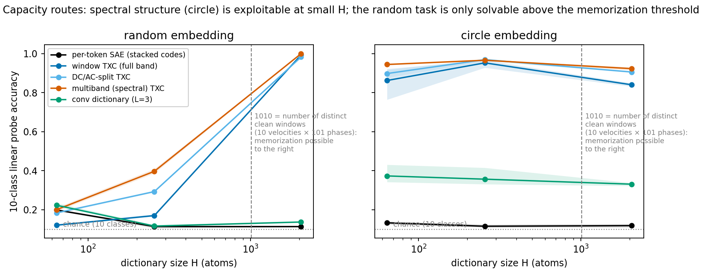

The capacity sweep ($H \in \{64, 256, 2048\}$ atoms, template count
$|\Omega| M = 1010$) separates two routes to high probe scores:

- **Random embedding (no structure to exploit)**: at $H = 256$ all
  architectures are far from oracle (acc: TXC 0.17, DC/AC 0.29, multiband
  0.40); at $H = 2048 > 1010$ every *window* architecture jumps to acc
  ≈ 0.98–1.00 — by
  **template memorization**, exactly as P5 predicts. The conv dictionary,
  whose atoms are shift-local 3-token filters and therefore cannot represent
  whole-window templates, stays at acc 0.14 even at $H = 2048$ — a clean
  architectural signature of the memorization route. A benchmark that doesn't
  control dictionary size against the template count cannot distinguish
  "learned temporal structure" from "memorized the windows".
- **Circle embedding (spectral structure available)**: the TXC family is
  already at acc 0.86–0.94 with $H = 64$ atoms — sixteen times fewer atoms
  than templates — because a small bank of windowed tones suffices. Here the
  spectral split earns its keep at low capacity: at $H = 64$, multiband
  reaches acc 0.944 with a tight seed range (0.941–0.948) while vanilla
  averages 0.862 with a wide range (0.764–0.922) — the hard band constraint
  removes a bad-seed failure mode of the unconstrained dictionary. (All TXC
  variants emit $H$-dimensional codes at every $H$, so these probe
  comparisons are like-for-like.) The conv dictionary is nearly flat in $H$ (acc 0.33–0.37 at every
  capacity): its bottleneck is filter length, not atom count (quantified in
  the W-scan below).
- **A degradation that mostly wasn't (self-correction).** At the standard
  probe budget (20k windows), all H = 2048 circle models looked degraded
  (vanilla 0.841, multiband 0.923 vs ≈ 0.96 at H = 256), which we initially
  read as memorization displacing structure. A probe-budget control —
  re-probing the same frozen dictionaries with 60k windows — recovers most
  of it (vanilla 0.940, multiband 0.960). So the dominant effect is that
  2048-dimensional codes simply need more probe data, with only a small
  residual dictionary-side gap (multiband still on top). Probe sample
  budget must scale with code dimensionality, or capacity comparisons
  silently penalize larger dictionaries — we flag this as a benchmark
  design rule alongside the template-count control.

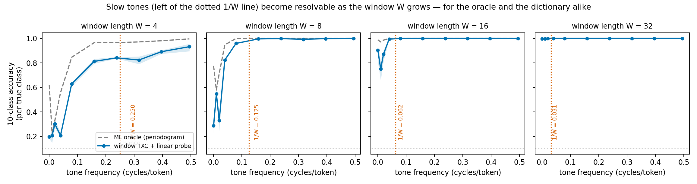

The window-length scan ($W \in \{4, 8, 16, 32\}$, sparsity budget scaled as
$k = 2W$) tests the Rayleigh prediction: a window of length $W$ cannot
resolve tones closer than $\Delta f \approx 1/W$, so the low-frequency
deficit should recede as $W$ grows. It does, for the oracle and the
dictionary together: overall TXC linear accuracy is 0.59 / 0.80 / 0.95 / 1.00
at $W$ = 4 / 8 / 16 / 32 (the periodogram oracle itself drops to 0.74 at
$W{=}4$), and per-frequency, the failure region sits left of $1/W$ in every
panel. The conv dictionary improves only weakly with $W$ (0.22 / 0.31 / 0.36
/ 0.51) because the probe merely aggregates more local votes, while
lengthening its *filters* from 3 to 7 taps at fixed $W = 16$ lifts it from
0.36 to 0.48 — the conv architecture's resolution is set by filter length,
the TXC's by window length. **This is the operational answer to "at what
timescale does the architecture find features": the response curve, read
against the window-limited oracle, localizes the architecture's usable band
and identifies which structural parameter (filter vs window) sets its
resolution limit.**

#### 4.6 Superposition: three simultaneous tones

Every task so far has exactly one active temporal feature per window, but
dictionary learning exists for *superposition*. The multi-lane variant runs
three independent circle processes at once, in three mutually orthogonal
2-planes embedded in $d = 24$: each lane $k$ has its own velocity
$y_k \sim \mathrm{Unif}(\Omega)$ and phase, and the activation is the sum
of the three rotating components plus noise. Window budget scales to
$k_{\mathrm{win}} = 64$ (4 atoms/token). Three probes per architecture, one
per lane; we report mean per-lane 10-class linear accuracy. Two structural
consequences of the design: the per-lane periodogram oracle still reads each
lane independently (orthogonal planes), and the clean-window count is now
$(10 \cdot 101)^3 \approx 10^9$ — **memorization is impossible by
construction**, closing the loophole the capacity scan exposed.

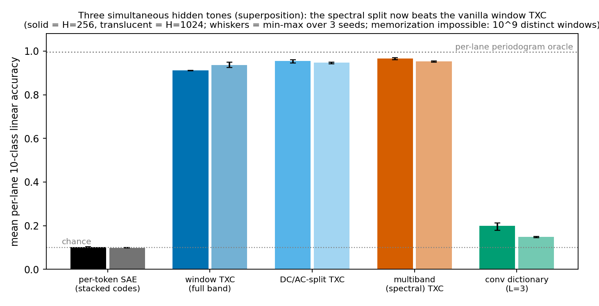

Results at $H = 256$ (3 seeds; preregistered predictions in `log.md` H2:10):

| | per-lane linear acc | |
|---|---|---|
| per-lane periodogram oracle | 0.995–0.996 | (prediction ✓) |
| per-token SAE (stacked codes) | 0.101–0.103 | chance (prediction ✓) |
| window TXC | 0.910–0.912 | |
| DC/AC-split TXC | 0.945–0.960 | |
| multiband (spectral) TXC | **0.961–0.967** | best |
| conv dictionary (L=3) | 0.179–0.213 | |

Under superposition the band split finally separates from vanilla at the
standard capacity: multiband 0.961–0.967 and DC/AC 0.945–0.960 versus
vanilla 0.910–0.912, with no seed overlap. The single-tone tie at $H = 256$
(§4.3) was a property of the easy setting, where 256 atoms comfortably tile
one tone; with three simultaneous tones competing for one TopK budget, the
per-band budgets stop any single lane's structure from crowding out the
others. The conv dictionary collapses hardest (0.18–0.21 from 0.36
single-lane): a 3-tap filter sees the local *sum* of three tones, and its
short baseline gives it no way to separate them. The per-token SAE stays at
chance, and an MLP on its stacked codes still reads the lanes at ≈ 0.91 —
the conversion story survives superposition intact. Raising capacity to
$H = 1024$ changes little (TXC 0.93–0.95, splits ≈ 0.95): with $10^9$
distinct windows there is no memorization route to jump to, exactly as
preregistered — superposition makes the benchmark memorization-proof
without any capacity bookkeeping.

#### 4.7 A first real-model check: day-stride in GPT-2

The circle embedding was motivated by Engels et al.'s finding that LLMs embed
cyclic concepts on circles. We close the loop on a real model: sequences of
16 weekday tokens with constant stride $y \in \mathbb{Z}_7$ (stride 2 =
"Monday Wednesday Friday ..."), random starting day, label = stride (7
classes, including the sign pairs (1,6), (2,5), (3,4)). Windows are GPT-2
residual streams at the 16 day positions.

Three results, each in one panel above:

1. **The geometry premise holds**: the top-2 PCA plane of GPT-2's seven
   day-embedding means is a circle in correct weekday order (55% of
   variance) — the in-the-wild analogue of our circle arm.
2. **The conversion result transfers verbatim to the embedding layer**
   (hidden state 0 = token + position embeddings, where P1 genuinely applies:
   each position is a function of its own day alone). Single-position probes:
   0.149 ≈ chance at every position. Raw stacked window + linear: 0.181;
   + MLP: 1.000. Per-token SAE codes + linear: 0.527 (the variance loophole
   is wide at $M = 7$, but conversion still fails); window TXC, multiband,
   and conv codes + linear: **1.000** (2 seeds each, FVU ≈ 0).
3. **The model itself converts almost immediately**: after a single
   attention block, a *single-position* linear probe reads the stride at
   ≥ 0.95 (mostly 1.00) at every position except position 0, which stays at
   chance through every depth we measured (causal attention provides it no
   context — a built-in control that the pipeline has no leaks). By block 3
   the map is saturated at 1.00 everywhere but position 0.

Result 3 reframes what temporal dictionaries are *for* on real models:
attention linearizes this (easy, two-token) temporal relation by itself,
so at most depths a per-token SAE inherits already-converted structure. The
benchmark's measurement therefore matters at the interfaces where the model
has *not yet* converted a temporal feature — embeddings, early layers,
or relations whose conversion the model never performs — and the
position-resolved single-position ceiling is exactly the instrument that
locates those interfaces.

#### 4.8 User-directed extension: the backtracking case study

The team's paper (temp_xc_tex, §c7) shows TXC beating per-token SAEs on
*inducing* and *detecting* backtracking in DeepSeek-R1-Distill-Llama-8B
(inducement Δgc 0.541 vs 0.400; detection PR-AUC 0.242 vs 0.175), with
dictionaries trained at 32,768 features for 300k steps on a base-Llama
layer-10 cache. Here we asked the sprint's question of the same task: **at
which temporal frequency does the backtracking signal live?** We trained the
sprint's architectures (H=4096, k_win=256, 4k steps — a small probe study at
~1/1000th of the paper's training compute, on the distill's own cache) on
T=16 right-edge windows over the case study's 300 reasoning traces, and
probed for "backtracking imminent" (the paper's D+ window, 8–13 tokens before
a "Wait"/"Hmm"), with by-trace splits.

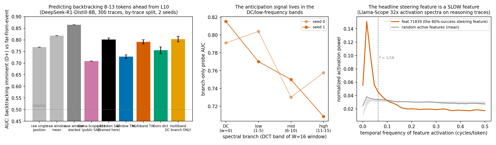

Three findings:

1. **Backtracking anticipation has real multi-token structure** — unlike
   GPT-2 day-stride (§4.7), single L10 positions are far from saturated:
   raw single-position AUC 0.769 vs raw 16-token window 0.865. This is the
   regime the benchmark identifies as temporal-dictionary territory.
2. **The signal is low-frequency.** Branch-resolved probes on the spectral
   crosscoder decline monotonically with band: DC 0.803 > low 0.787 > mid
   0.740 > high 0.733 — and the DC branch *alone* (1024 atoms reading the
   window mean) beats the entire vanilla TXC (0.728) and matches the
   per-token SAE's full stacked code (0.802). Anticipation of backtracking
   is a slowly varying state, a tone rather than a spike — despite the
   localized [-13,-8] labeling convention. Consistently, the multiband
   crosscoder beats vanilla TXC at matched recipe and FVU (0.79 vs 0.73,
   both seeds, FVU 0.54).
3. **The headline steering feature is a slow feature.** Applying the
   activation-spectrum estimator (§4.4's third diagnostic) to Llama-Scope
   32x on these traces: feat_71839 — the case study's best steering feature
   (80% per-prompt success) — carries 36% of its activation power below
   f = 1/16 cycles/token, versus 13% ± 11% for random active features. The
   feature that steers backtracking best is one of the model's slow features,
   exactly where the branch probes say the signal lives.

Honest scope notes: this is a *detection/probe* study, not a steering
reproduction; AUC seed-ranges are ±0.01–0.02 (2 seeds, 270 test positives);
the paper's TXC win uses a recipe (per-position BatchTopK, 75× more features
× steps) that our quick run does not reproduce — an undertrained vanilla
window TXC here *loses* to a per-token SAE, which is itself a useful
data point about recipe sensitivity. A reduced-faithful reproduction of the
paper's c7 training recipe (their cache recipe via the ungated NousResearch
mirror, their BatchTopK semantics, 1/10th steps) with a spectral variant
grafted in is running as of this writing; its detection-metric results will
be appended. The actionable suggestion for the paper either way: give the
c7 TXC a DC/low-band budget (or at minimum report branch-resolved
detection), because that is where this task's signal is.

**Addendum: reduced-faithful reproduction of the paper's c7 detection
result, plus the spectral graft.** Using the team's own scripts on a fresh
H100 (their FineWeb cache recipe: 30k × 128-token windows of base
Llama-3.1-8B layer-10 residuals via an ungated mirror; their
`train_llama_txc.py` trainer at d_sae = 32,768, k_pos = 20, 10k steps —
about 1/30th of the paper's training), plus the sprint's spectral crosscoder
trained at exactly matched hyperparameters, evaluated with the paper's
detection protocol (max-pooled |activations| over the [-13,-8] window,
ℓ1-logistic, 5-fold GroupKFold, top-S features by train-fold t-statistic):

| arm (1 seed, 10k steps) | PR-AUC@S=8 | ROC@S=8 | PR-AUC@S=32 |
|---|---|---|---|
| TopK SAE (their script; 97% dead features) | 0.164 | 0.686 | 0.387 |
| TXC-base T=5 (their script) | 0.222 | 0.733 | 0.394 |
| spectral TXC (full code) | 0.145 | 0.645 | 0.241 |
| **spectral TXC, DC branch only** | **0.260** | **0.754** | — |
| (paper, full recipe: SAE / TXC-base / TXC-pro) | 0.175 / 0.226 / 0.242 | 0.566 / 0.666 / 0.688 | |

Two conclusions. First, **the paper's headline detection ordering
reproduces** at a fraction of the compute: TXC-base beats the TopK SAE at
S=8 with PR-AUC values strikingly close to the published ones (our 0.222 vs
0.164; paper 0.226 vs 0.175 — our ROC levels run higher because the
negative-sampling and CV details are our reimplementation, so compare
orderings, not absolutes). Second, **the frequency decomposition pays off as
signal localization rather than headline response**: the monolithic spectral
code loses at S=8 (top-feature selection scatters across bands that carry no
signal), but restricting to its DC branch gives the best small-S detector in
the table — consistent with §4.8's branch probes and feat_71839's slow
spectrum. The practical recipe for the paper: train with band structure,
*detect from the DC/low band*. Caveats: one seed, 10k steps, our detection
reimplementation (the original lives on the `final` branch), and the SAE
arm inherits their plain-TopK trainer's 97%-dead-feature pathology while
the TXC class has built-in AuxK anti-dead — an asymmetry present in the
original toolchain too.

### 5. Limitations, failed predictions, and checks

**Sanity checks that passed** (all numbers in §4 / appendix table):

- Empirical single-token probes sit at the proven ceilings: 0.589 vs $p=0.6$
  (DC), 0.504 vs 0.5 (sign), 0.099–0.105 vs 0.1 (ten-velocity), across both
  embeddings — validating the generators and P1.
- Oracles behave as theory says: symbol-majority 0.997 (DC), diff-votes 1.000
  (sign), periodogram 0.994 (circle) — and the periodogram oracle degrades to
  0.74 at $W{=}4$ exactly as the Rayleigh limit predicts.
- FVU and window L0 are reported for every model; no architecture "lost"
  because it failed to train (all reached their sparsity budget; FVU
  differences are explained by per-token vs window reconstruction and by
  noise-floor effects, discussed below).
- Probe class, data budget, standardization, and optimization are identical
  across architectures; train and test probe accuracies are both recorded.

**A diagnostic bug we caught and fixed**: the first version of the shuffle
control used a single random permutation shared by all windows; a probe can
partially learn the permuted structure, producing absurdities (a conv
dictionary "surviving" shuffling at 0.89 on a pure order task). The corrected
control permutes every window independently; under it, sign information
collapses to exactly 0.5 for every architecture, confirming the signal is
purely order-borne. All shuffle numbers in this report are the corrected
(per-window) version, recomputed from saved checkpoints.

**Preregistered predictions that were falsified** (logged in `log.md` before
the runs):

- "Vanilla TXC is low-pass" (proposal): under the circle embedding, all
  window TXC variants track the oracle at mid/high frequencies and
  under-perform it at the *lowest* frequencies. Relative to the ML decoder
  they are mildly high-pass, with the deficit set by the window length (§4.5).
- "Frequency-split TXC wins on mixed-frequency data at matched budgets":
  only partially borne out. At the comfortable capacity ($H = 256$) vanilla
  and split TXCs are indistinguishable on the response curve; the split wins
  at low capacity ($H = 64$: 0.944 vs 0.862, and far smaller seed variance)
  and by a small residual margin at $H = 2048$ under fair probing (§4.5);
  it then wins outright under superposition, where three tones compete for
  one TopK budget (§4.6: 0.96 vs 0.91, no seed overlap). On single-tone
  data at comfortable capacity, the split's deliverable is the verified band
  decomposition (§4.4), not headline response.

**Limitations**:

- Everything is synthetic, single noise level ($\sigma = 0.25$), $M = 101$,
  deterministic cyclic dynamics. The conclusions about *measurement
  methodology* (what probes measure, embedding-dependence, normalization,
  capacity controls) transfer; specific response shapes need not.
- Probes measure decodability of codes, the standard but indirect notion of
  "the architecture found the feature". The FreqFrac kernel spectra are the
  direct (weight-space) complement.
- Training-dynamics confound (spectral bias, Rahaman et al. 2019): all
  architectures got identical optimizer, steps, and lr; per-architecture
  tuning could shift curves. Response curves are claims about
  *trained-with-this-recipe* models. In particular, the low-frequency dip
  reproduces at every dictionary size we ran ($H \in \{64, 256, 2048\}$)
  and across seeds, but we did not sweep the sparsity budget or the noise
  level — before reading the dip as an architectural signature rather than a
  training-configuration signature, those sweeps are the next check.
- The multiband budget split (equal atoms/L0 per band) was fixed, never swept.
- Dictionaries partially reconstruct noise on the low-dimensional circle task
  (FVU below the noise floor), as expected for overcomplete TopK models;
  probes are unaffected but atom-level interpretability may be.
- P2 forbids *perfect* additive-readout separation; the observed chance-level
  performance is an empirical regularity on top of the theorem, with a
  variance-leak mechanism (§3, P2 comments) explaining the small excess over chance.

### 6. What I would do next

1. **Deeper real-model work.** §4.7 did the first step (GPT-2 embeddings,
   day-stride). Next: temporal relations the model does *not* linearize in
   one block (longer-range periodicities, multi-step composition), months
   ($M = 12$) for a frequency ladder, and the response *curve* (not just
   conversion) on real activations with the empirical-ceiling normalization.
2. **Harder superpositions.** §4.6 ran three tones in *orthogonal* planes;
   the natural escalation is shared/oblique subspaces, more lanes than
   bands, and band-imbalanced velocity distributions, where the per-band
   budget allocation should start to bind and the multi-tone oracle
   (Rife–Boorstyn) departs from the per-lane periodogram.
3. **Mechanism of the low-frequency dip.** The W-scan localizes it at
   $f \lesssim 1/W$, but the gap *relative to the oracle at the same W* needs
   an explanation at the atom level (phase-tiling capacity? optimization?).
   The firing-weighted FreqFrac machinery is the right microscope.
4. **Budget allocation in the spectral crosscoder.** Equal per-band budgets
   were never swept; on band-imbalanced data the allocation should matter and
   could even be learned (annealed band masses).
5. **A "timescale spectrometer" for arbitrary architectures.** Package the
   measurement (circle-family probes at several $W$, oracle-normalized,
   capacity-controlled) as a standard evaluation: feed any encoder, get its
   usable frequency band and resolution limit.

### 7. Research map

How the sprint hours were actually spent (full timestamped log: `log.md`;
the experimental program compressed into the first ~3 hours because the pod
ran many parallel streams, leaving ample time for controls and writing):

1. **H0:00–0:25 — setup.** Read the proposal and instructions; surveyed the
   repo for reusable parts (model classes adapted from
   `temporal_crosscoders/models.py`); provisioned one RunPod A40 ($0.44/h);
   wrote preregistered claims into the log.
2. **H0:25–0:50 — build + smoke + the pivot.** Self-contained experiment
   package (data, all five architectures, probes, oracles, diagnostics);
   smoke test caught nothing, but *thinking about what the temporal power
   spectrum of the task looks like* surfaced the ratio-invariance symmetry
   (P3): the proposal's task has no frequency axis under random embeddings.
   Designed the circle embedding and periodogram oracle; kept the random
   variant as the control arm.
3. **H0:50–1:30 — main grids** (3 tasks × 2 embeddings × 5 architectures ×
   3–5 seeds × H ∈ {64, 256, 2048}) in parallel streams, with probes,
   confusion matrices, shuffle controls, kernel spectra; literature agent in
   parallel (novelty check: no prior frequency-response measurement for
   dictionary architectures). Caught and fixed the shuffle-control bug;
   recomputed post-hoc from checkpoints.
4. **H1:30–2:10 — data-driven follow-ups.** W-scan; conv with 7-tap filters;
   firing-weighted kernel-spectrum analysis (after catching that the
   unweighted version overstated structure); sign-pair control; pair-task
   double contrast; probe-budget control (after catching that the H = 2048
   "degradation" was mostly probe-sample starvation).
5. **H2:10–3:00 — superposition variant + adversarial review.** Multi-lane
   task (three simultaneous tones); zero-context figure test (each figure
   rewritten in response); red-team agent pass (21 issues, all majors fixed,
   one of which exposed a glob bug in my own statistics check);
   zero-context comprehension test of the executive summary.
6. **H3:00–4:00 — real-model check.** GPT-2 day-stride experiment (§4.7),
   including one mid-experiment redesign: the first run showed block-3
   activations already linearize stride at single positions, which relocated
   the dictionary comparison to the embedding layer and added the
   position×layer ceiling map.
7. **Remainder — writing.** Multiple full read-throughs, number
   reconciliation against the synced results, this research map, and final
   verification passes.

Artifacts:

- `summary.md` (this document), `log.md` (timestamped research log),
  `theory.md` (full propositions), `litsearch.md` (annotated bibliography)
- `code/fb_core.py` (tasks, embeddings, architectures, probes, oracles,
  diagnostics), `code/run_grid.py` (grid runner), `code/verify_theory.py`
  (overlap combinatorics + pair tasks), `code/posthoc_shuffle.py` (corrected
  shuffle control), `code/make_plots.py` (all figures)
- `results_synced*/`, `theory_synced/` (raw JSONs + checkpoints synced from
  the pod), `figures/`

Compute: two A40 pods (RunPod secure cloud), ≈ 3.2 pod-hours, **≈ $1.40
total** (budget was $50). The synthetic program ran as 10+ parallel streams
on the first pod; the GPT-2 experiment ran on a second short-lived pod.

### 8. References

- Lindsey et al. 2024, *Sparse Crosscoders for Cross-Layer Features and Model
  Diffing*, Transformer Circuits — the crosscoder family this work extends to
  the temporal/spectral axis.
- Bhalla et al. 2025, *Temporal Sparse Autoencoders* (arXiv:2511.05541) —
  imposes temporal slowness on SAE features; measures no frequency response
  (closest prior work; our literature agent found no prior frequency-response
  measurement for dictionary architectures).
- Grosse et al. 2007, *Shift-Invariance Sparse Coding* (UAI) — classical
  precedent for the conv dictionary.
- Nanda et al. 2023, *Progress measures for grokking* (ICLR) — Fourier
  "clock" features for mod-$P$ arithmetic; the feature family our cyclic task
  is designed to elicit.
- Engels et al. 2024, *Not All Language Model Features Are One-Dimensionally
  Linear* (arXiv:2405.14860) — circular embeddings of cyclic concepts in real
  LLMs; motivates the circle arm.
- Rife & Boorstyn 1974, *Single-tone parameter estimation from discrete-time
  observations* (IEEE IT) — ML tone estimation = periodogram; our oracle.
- Elhage et al. 2022, *Toy Models of Superposition* — evaluation philosophy;
  Chanin & Garriga-Alonso 2026, *SynthSAEBench* (arXiv:2602.14687) — the
  i.i.d. synthetic SAE benchmark; ours is the temporal counterpart.
- Rahaman et al. 2019, *On the Spectral Bias of Neural Networks* (ICML) —
  the training-dynamics confound noted in §5.
- Minsky & Papert 1969, *Perceptrons* — non-linear-separability of
  XOR/parity; our P2 is the cyclic-group, additive-readout variant.

Full annotated bibliography: `litsearch.md`.

### Appendix: full results table

Seed-averaged headline numbers for every (task, architecture, dictionary size)
cell. "shuffled lin" = linear probe on codes of per-window-shuffled inputs;
for the sign task this is the order-destruction null (0.5 everywhere); for the
cyclic tasks it lower-bounds the *order-free* (symbol-set) component of the
accuracy. The last column is the normalized score $S$ of §2.3 computed from
the linear-probe accuracy.

| task | arch | H | FVU | linear acc | MLP acc | shuffled lin | S(lin) |
|---|---|---|---|---|---|---|---|
| ac_sign | conv | 128 | 0.326 | 0.999 | 1.000 | 0.501 | 1.00 |
| ac_sign | dcac | 128 | 0.432 | 0.904 | 1.000 | 0.501 | 0.81 |
| ac_sign | multiband | 128 | 0.424 | 1.000 | 1.000 | 0.504 | 1.00 |
| ac_sign | token_sae | 128 | 0.344 | 0.501 | 1.000 | 0.498 | 0.00 |
| ac_sign | txc | 128 | 0.386 | 0.903 | 1.000 | 0.501 | 0.81 |
| dc | conv | 64 | 0.172 | 0.989 | 0.992 | 0.989 | 0.98 |
| dc | dcac | 64 | 0.575 | 0.989 | 0.989 | 0.988 | 0.98 |
| dc | multiband | 64 | 0.496 | 0.989 | 0.989 | 0.988 | 0.98 |
| dc | token_sae | 64 | 0.162 | 0.987 | 0.992 | 0.987 | 0.97 |
| dc | txc | 64 | 0.421 | 0.990 | 0.990 | 0.989 | 0.98 |
| multifreq | conv | 64 | 0.835 | 0.223 | 1.000 | 0.112 | 0.14 |
| multifreq | conv | 256 | 0.785 | 0.117 | 1.000 | 0.103 | 0.02 |
| multifreq | conv | 2048 | 0.753 | 0.137 | 0.212 | 0.105 | 0.04 |
| multifreq | dcac | 64 | 0.955 | 0.184 | 0.661 | 0.169 | 0.09 |
| multifreq | dcac | 256 | 0.905 | 0.293 | 0.729 | 0.234 | 0.21 |
| multifreq | dcac | 2048 | 0.787 | 0.982 | 0.997 | 0.250 | 0.98 |
| multifreq | multiband | 64 | 0.956 | 0.200 | 0.632 | 0.158 | 0.11 |
| multifreq | multiband | 256 | 0.911 | 0.397 | 0.703 | 0.242 | 0.33 |
| multifreq | multiband | 2048 | 0.796 | 1.000 | 1.000 | 0.247 | 1.00 |
| multifreq | token_sae | 64 | 0.845 | 0.199 | 0.999 | 0.116 | 0.11 |
| multifreq | token_sae | 256 | 0.786 | 0.114 | 1.000 | 0.107 | 0.02 |
| multifreq | token_sae | 2048 | 0.760 | 0.114 | 0.235 | 0.101 | 0.02 |
| multifreq | txc | 64 | 0.952 | 0.121 | 0.622 | 0.136 | 0.02 |
| multifreq | txc | 256 | 0.896 | 0.170 | 0.883 | 0.164 | 0.08 |
| multifreq | txc | 2048 | 0.747 | 0.993 | 0.998 | 0.206 | 0.99 |
| multifreq_circle | conv | 64 | 0.158 | 0.373 | 0.980 | 0.180 | 0.31 |
| multifreq_circle | conv | 256 | 0.156 | 0.357 | 0.979 | 0.172 | 0.29 |
| multifreq_circle | conv | 2048 | 0.153 | 0.331 | 0.976 | 0.166 | 0.26 |
| multifreq_circle | conv7 | 256 | 0.145 | 0.478 | 0.926 | 0.875 | 0.42 |
| multifreq_circle | dcac | 64 | 0.260 | 0.898 | 0.993 | 0.425 | 0.89 |
| multifreq_circle | dcac | 256 | 0.186 | 0.969 | 0.984 | 0.423 | 0.97 |
| multifreq_circle | dcac | 2048 | 0.146 | 0.906 | 0.938 | 0.339 | 0.90 |
| multifreq_circle | multiband | 64 | 0.234 | 0.944 | 0.992 | 0.410 | 0.95 |
| multifreq_circle | multiband | 256 | 0.141 | 0.966 | 0.981 | 0.406 | 0.97 |
| multifreq_circle | multiband | 2048 | 0.117 | 0.923 | 0.951 | 0.362 | 0.92 |
| multifreq_circle | token_sae | 64 | 0.173 | 0.133 | 0.953 | 0.114 | 0.04 |
| multifreq_circle | token_sae | 256 | 0.136 | 0.116 | 0.953 | 0.101 | 0.02 |
| multifreq_circle | token_sae | 2048 | 0.147 | 0.119 | 0.861 | 0.111 | 0.02 |
| multifreq_circle | txc | 64 | 0.212 | 0.862 | 0.993 | 0.305 | 0.85 |
| multifreq_circle | txc | 256 | 0.102 | 0.953 | 0.968 | 0.345 | 0.95 |
| multifreq_circle | txc | 2048 | 0.097 | 0.841 | 0.911 | 0.277 | 0.83 |

Notes: multifreq/multifreq_circle chance = 0.1; ac_sign chance = 0.5; dc
single-token ceiling = 0.6. MLP accuracies at H = 2048 for 32k-dimensional
code spaces (token_sae, conv) are probe-limited (train accuracy 1.0, test
collapse) — see the probe-budget discussion in §4.5. The conv7 shuffled
value (0.875) *exceeds* its unshuffled value (0.478); this is consistent,
not a bookkeeping error: per-window shuffling destroys order but keeps the
symbol *set*, which still determines speed (§4.2), and linear decodability
from a fixed encoder is not monotone in input information — shuffled windows
feed the 7-tap filters a more diverse set of local pairs, which happens to
give the linear probe a richer voting signature. None of the conv7
conclusions rest on this column.
