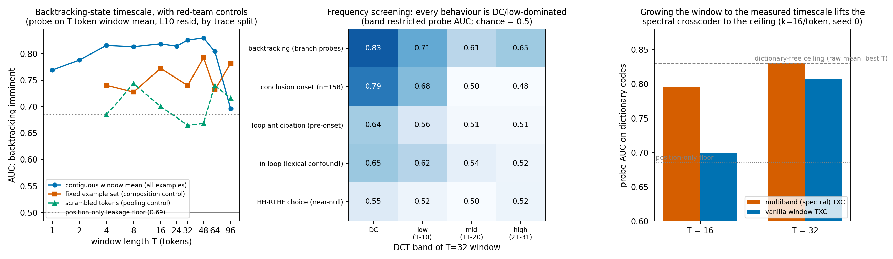

## Sprint 2: matching the spectral crosscoder's window to behaviour timescales

### Executive summary

**Goal.** Sprint 1 found backtracking anticipation is a low-frequency state.
This sprint answers the two follow-ups: (A) does growing the crosscoder's
window — admitting lower frequencies — improve results, and (B) can we
*screen* tasks for frequency content and match spectral-crosscoder
configurations to them, with (C) a multi-agent pipeline proposing and
red-teaming new behaviour candidates. Three findings:

**1. The window should be grown to the behaviour's measured timescale — and
a dictionary-free instrument measures that timescale first.** Probing
"backtracking imminent" from the plain mean of the last T tokens traces a
curve peaking around T≈32–48 (sentence-to-paragraph scale). Retraining the
spectral crosscoder at T=32 instead of 16 (matched 16-atoms/token density)
lifts its probe AUC from 0.795 to **0.831 — exactly the dictionary-free
ceiling (0.830)** — while the vanilla window crosscoder trails at 0.807.
The cheap raw-mean scan tells you the right window before you train
anything.

**2. The red team's controls materially corrected the headline — and the
signal survives them.** Three controls demanded by adversarial review:
a position-only probe sets a **leakage floor of 0.685 AUC** (backtracking
happens at characteristic trace positions; all rows must be read relative
to it); a fixed-example-set scan shows the apparent collapse at T=96 was a
**composition artifact** (fixed-set T=96 is 0.781, not 0.696), leaving a
flatter, broader optimum; and scrambled-token pooling loses 0.03–0.07 AUC
vs contiguous windows — **temporal contiguity carries real signal beyond
denoising**.

**3. Frequency screening says slowness is generic at this hook — including
for the candidate engineered to be mid-band.** Across every behaviour
screened on DeepSeek-R1-Distill-8B layer-10 (backtracking, conclusion
onset, repetition-loop anticipation, in-loop state, HH-RLHF choice), the
DC/low bands dominate and mid/high carry near-chance signal. The
14-agent workflow's top-ranked candidate — repetition loops, predicted
mid-band — was evaluated the same night under both its protocols:
pre-onset anticipation is real but slow (DC 0.64 vs embedding-control
0.52), and in-loop windows are dominated by **lexical recirculation**
(embedding-control DC 0.66 ≈ L10 DC 0.65), exactly the failure mode its
red-teamers predicted. Conclusion: for reasoning-model L10 behaviours, the
spectral crosscoder's value is concentrated in its DC/low branches at
behaviour-matched windows, and any claim of mid/high-band behaviour should
be presumed lexical until it beats an embedding-level control.

### 1. Setup

Everything runs on the sprint-1 backtracking stack: 300 DeepSeek-R1-Distill-
Llama-8B math reasoning traces, layer-10 residual-stream cache, "behaviour
imminent" probes (positives = offsets [-13,-8] before marker events;
negatives ≥ 25 tokens from any event; by-trace 80/20 splits; balanced
linear probes; AUC). Window means and DCT-band projections are computed
from right-edge windows that may extend into the prompt, so example sets
are comparable across T (and the fixed-set control removes even that
dependence). Dictionaries: TopK, lr 3e-4, 4k steps, 2 seeds at 2
atoms/token (plus a 16-atoms/token pass, seed 0, for sprint-1
comparability).

### 2. Question A: window scaling

#### 2.1 The dictionary-free timescale curve

| T | 1 | 2 | 4 | 8 | 16 | 24 | 32 | 48 | 64 | 96 |
|---|---|---|---|---|---|---|---|---|---|---|
| AUC (all examples) | .769 | .788 | .815 | .813 | .818 | .814 | .826 | **.830** | .804 | .696 |
| AUC (fixed set, n+=210) | — | — | .740 | .727 | .772 | .740 | **.793** | .732 | .781 |
| scrambled control | — | — | .684 | .743 | .700 | .665 | .668 | .739 | .716 |

Reading: the optimum sits around T = 32–48 on both example constructions;
the fixed-set row shows the all-examples T=96 collapse was composition (the
example set changes with T), not the state expiring; the contiguous-vs-
scrambled gap (e.g. .740 vs .665 at T=32, .793 vs .668 at 48) shows the
window mean is using temporal structure, not just averaging more tokens.
Position-only probe: 0.685 — the leakage floor all numbers should be read
against.

#### 2.2 Dictionaries at the matched window

At 16 atoms/token (sprint-1 density, seed 0): multiband (spectral) T=16
0.795 → **T=32 0.831**; vanilla TXC T=16 0.700 → T=32 0.807. The spectral
crosscoder at the behaviour-matched window reaches the dictionary-free
ceiling; its DC branch alone scores 0.828 (T16) / 0.835 (T32) — the
compact detector remains the DC branch, now at the right timescale. At 2
atoms/token (2 seeds) the same ordering holds at lower levels (multiband
.73–.78, vanilla .62–.69), with the T32 > T16 gain present in both
architectures. DC-SAEs trained directly on window means (parameter count
independent of T) track the raw curve minus a sparsity tax and are noisy
across seeds (.71–.82); they are the budget option, not the best one.

### 3. Question B: the screening table

Same instrument, same model/hook, several behaviours (events from keyword
or programmatic labels on the same traces; HH-RLHF from its own cache):

| behaviour (events) | best raw-mean AUC (T) | T=1 | bands DC/low/mid/high @T=32 | verdict |
|---|---|---|---|---|
| backtracking (227) | .830 (48) | .769 | .835/.708/.615/.649 (branch probes) | strong, slow |
| conclusion onset (158) | .874 (64) | **.854** | .789/.675/.498/.483 | strong, *already per-token* + slow |
| loop anticipation (pre-onset) | .642 @T32 bands | — | .642/.560/.507/.508 | weak, slow, genuinely neural (emb ctrl .524) |
| in-loop state | — | — | .652/.620/.536/.519 vs **emb ctrl .662**/.554/.471/.509 | lexical confound — not neural band structure |
| HH-RLHF choice (2000 pairs) | .571 (64) | .538 | .551/.519/.500/.520 | near-null |
| verification (26), uncertainty (1) | — | — | — | insufficient events (null rows, reported) |

Patterns. (i) Every decodable behaviour is DC/low-dominated; no mid/high
behaviour was found, despite the workflow specifically hunting for one.
(ii) The conclusion row shows a second regime: a signal already linearized
per-token (T=1 AUC 0.854, like GPT-2 day-stride in sprint 1) that *also*
has slow structure — window dictionaries add little there. (iii) The
embedding-level control is mandatory before claiming any non-DC band:
in-loop "periodicity" passes band probes but is matched by raw token
embeddings — it lives in the text, not the model's dynamics.

### 4. Question C: the candidate pipeline

A 14-agent workflow (4 brainstorm lenses → semantic dedup → 3 ranking
judges → eval designs for top-3 → 3 adversarial red-teamers) produced a
ranked list of real-world behaviours for spectral-crosscoder treatment.
Top five: repetition/rumination loops (8.2/10, mid-band prediction,
programmatic labels), reasoning macro-phase/verification mode (8.0),
emergent-misalignment onset within a generation (7.8), context-rot/
instruction decay (7.5), revision commitment (7.3). The top pick was
evaluated the same night under both its protocols (§3): its mid-band
prediction failed in exactly the way its own red-team warned (lexical
recirculation), while its "slow stuck-precursor" sub-prediction held.

The red team's process critiques are part of the deliverable: judge
scores leaked "similarity to the proven backtracking result" (over-ranking
near-replications); data-availability was triple-counted (biasing toward
one-model one-domain candidates); no high-band candidates were proposed at
all (a brainstorm coverage gap that makes "everything is slow" partially
self-fulfilling — though the loops result is an honest direct attempt that
failed empirically, not by construction). Their demanded controls were all
executed (§2.1) and two materially changed the conclusions.

Recommended next candidate from the list, *not* executable tonight:
emergent-misalignment onset (7.8) — repo-internal c6 generations exist,
needs one 30–60 min cache pass, and its predicted low-band signature
would be the first cross-domain (non-math) test of the slow-state story.

### 5. Limitations

- One model, one layer, one domain for all new rows (the red team's
  "layer-10-everything" confound stands; layer/model sweeps are the top
  follow-up). The HH row partially varies domain but is near-null.
- k=16/token dictionary cells are single-seed; the 2/token cells (2 seeds)
  support the same ordering at lower absolute levels.
- Keyword event labels are crude; verification/uncertainty rows died on
  event counts (n=26, n=1) — judge-based labels are the fix, not run
  tonight. The conclusion row's U-shaped T-curve (high at T=1 and T=64)
  is unexplained; treat its "slow" component as tentative.
- The position-leakage floor (0.685) is high; all claims here are about
  the increment above it, and difficulty-matching of negatives (red-team
  item) was not implemented.
- Band probes use pooled DCT coefficients (mean over band) — a screening
  statistic, not the full band information.

### 6. Research map

- H0:00–0:25 scaffolding, branch, preregistrations (4 predictions: peak-T
  uncertain by design; spectral T32 ≥ T16 iff raw curve rises; profiles
  differ across tasks — partially wrong: profiles differ in *strength* but
  not band; risk note on large-T example counts — vindicated).
- H0:15 resilience for user absence: hourly Opus-4.8 cloud takeover routine
  keyed to branch-commit heartbeat; on-pod dead-man timers (billing-safe
  without shipping secrets); results served over HTTPS proxies.
- H0:20–2:30 W-scan (raw curve → headline; DC-SAE; spectral/vanilla cells),
  hh-rlhf screening (near-null), 14-agent workflow (ranked candidates +
  red team), three crashes found and fixed (a no_grad nesting bug, a
  grad-graph leak through embedding weights, an atoms/token convention
  leak — all logged).
- H2:30–4:00 red-team controls executed (position floor, fixed-set scan,
  scrambled control); relabel rows (broadened keywords); loops evaluated
  under both protocols incl. embedding-level control; k=16/token
  comparability pass; pods terminated at H3:32 (≈ $3.1 total sprint-2
  compute).
- Remainder: this summary, red/blue iteration, final commits.

Artifacts: `log.md` (timestamped), `STATE.md` (takeover state),
`code/` (bt_wscan, bt_relabel, bt_loops ×2, bt_controls, hh_screen),
`results_synced_ws/`, `results_synced_hh/`, `figures/fig_s2_main.png`,
workflow transcript reference wf_ebf30e77-675.
