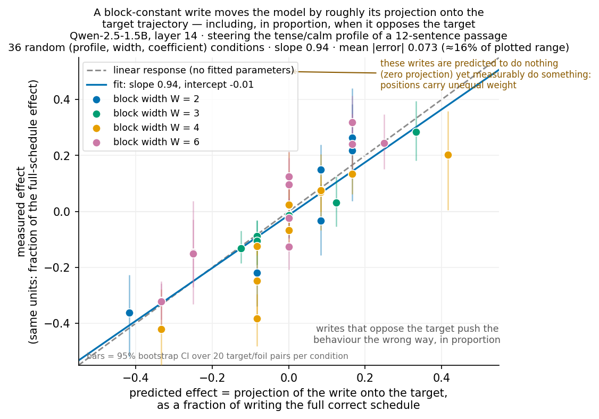
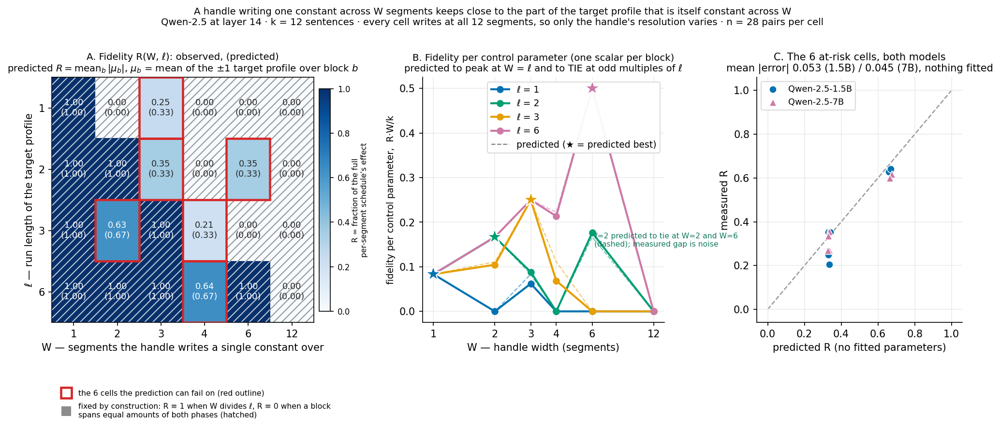
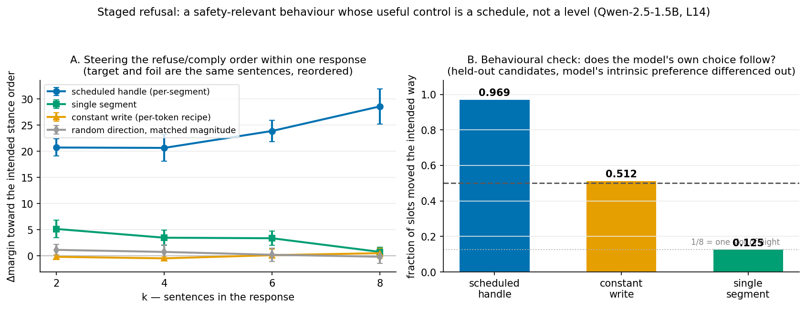
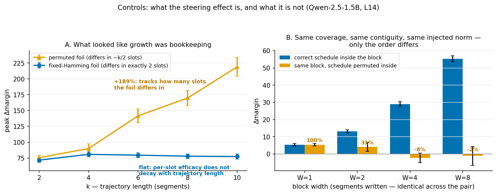
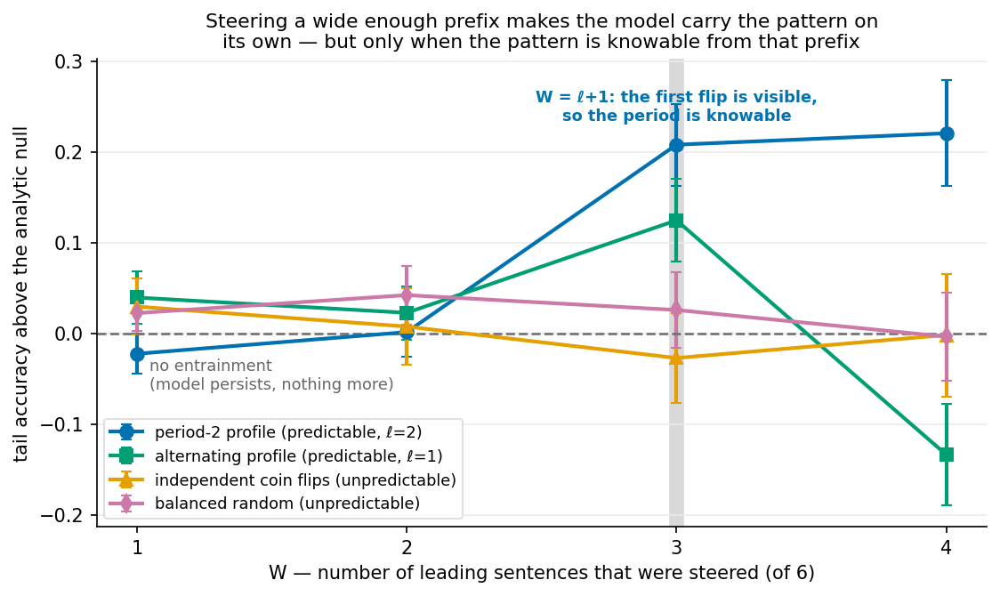

## Steering a shape, not a level: what the width of a steering handle buys

*10-hour sprint, 2026-07-24 21:58 → 2026-07-25 07:58 PDT. Qwen-2.5-1.5B-Instruct and
Qwen-2.5-7B-Instruct, layer 14, difference-of-means directions, Modal A10G, ~$14.*

## Executive summary

A steering vector added at a token position sets a **level** — more refusing, calmer,
more French, everywhere at once. Much of what we want to control has a **shape**:
answer the safe part of a request and decline the step that crosses the line; bring an
escalating exchange back down. This sprint measures what a steering handle spanning W
positions buys over one acting at a single position, on tasks where the target and its
foil are **the same sentences in a different order**, so a constant write is inert by
construction and only shape is under test.

**1. A steering write moves the model by exactly its projection onto the target
trajectory — including when it opposes the target.** Give a handle a resolution limit
(one constant per block of W segments) and it can only deliver the part of the target
that survives averaging inside those blocks. Sampling 36 random combinations of
profile, block width and block coefficients gives predictions spanning −0.42 to +0.42
with nothing fitted; the measured effects track them with **slope 0.94, intercept
−0.01, R² 0.77, mean absolute error 0.073**. Thirteen of those conditions predict a
*negative* effect, and the model duly moves the wrong way in proportion — the part of
the claim that could most easily have failed.

- 

**2. So the useful handle width is the target's own timescale.** Once the response is
linear, the achievable fraction for a square-wave target of run length ℓ is fixed by
arithmetic, and the resulting (W, ℓ) grid is reproduced to a mean error of **0.053**
(1.5B) and **0.045** (7B) over its six at-risk cells — the other 18 are algebraic
identities and serve as plumbing checks. Reading it as control cost: fidelity per
control parameter is maximised at W ≈ ℓ, where full fidelity costs `k/ℓ` parameters
rather than k. Fidelity is **not monotone in W**, since a wider handle wins when it
aligns with whole runs and collapses when it straddles them, so "wide enough to match
the timescale" is the right summary of window size rather than "wider is better".

- 

**3. It transfers to a behaviour with safety shape: the order of declining and helping
within one response.** The scheduled handle moves the model's own choice the intended
way on **96.9%** of slots against **51.2%** for the same direction at constant
strength (dose 0.5 of the mean residual norm, 160 slots; 93.8% at dose 0.35). That
51.2% is the constant write's expected value rather than a malfunction: it pushes every
slot toward declining, so it is right on exactly the half of slots meant to decline.
A random direction at matched magnitude does nothing.

- 

**4. The effect is the order, not the mass.** Permuting the schedule inside a block,
holding coverage, contiguity and total injected norm fixed, collapses the effect from
+55.3 to −1.2 at W=8 (dose 0.35 of the mean residual norm; *n = 28*). This rules out
any "you simply added more push" reading. It is also what a linear response predicts —
a random within-block permutation matches about half the slots and nets zero — so it is
a check the design passes rather than a mechanism it reveals.

- 

**Three of the claims we started the night with did not survive their own controls** —
growth with trajectory length, our first window sweep, and superadditivity. Each, and
the weaker claim that replaced it, is in *What we corrected* below.

## What problem this is, and why it is interesting

Activation steering is usually described as pushing a model along a direction: find a
refusal direction, add α times it, get more refusal. That fits a **level**. The
interesting safety cases are not levels. "Refuse everything" is not the useful refusal
control; "answer the safe part and decline the specific step that crosses the line" is.
"Be calmer" is not the useful de-escalation control; "come down over the next four
turns" is. Those targets are shapes over time, and their good and bad versions are
frequently built from the same material in a different arrangement.

That observation makes a clean design available. If target and foil are **permutations
of one another**, every bag-of-segments statistic is identical between them, so a
constant write — what a per-token steering vector applies when used across a span —
cannot separate them except by accident. Whatever does separate them is acting on
arrangement. This is what makes the constant-write arm a genuine null rather than a
weak baseline, and it is used throughout.

The prior context is a temporal-crosscoder project whose steering claim had not
appeared in natural-language behaviours: on ordered generation (days of the week,
counting), a single direction *broadcast* at every position matched or beat a
per-position schedule, because those behaviours ride a shared contextual mode that a
broadcast reinforces everywhere. The tasks here are built to remove that mode.

## The experiments

**The resolution family (findings 1 and 2).** Profiles are square waves of run length
ℓ ∈ {1,2,3,6} at k=12; ℓ=4 is excluded because it leaves a DC component at k=12, which
would reintroduce the broadcastable mode the design exists to remove. Two handle
classes: the full per-segment template, and a block-constant handle writing one scalar
per block of W. Coverage is pinned at all 12 segments in every cell, so nothing here
can be a coverage effect; every cell in a row injects the same total norm; and
normalising by the full-template effect on the *same* eval pairs divides out both the
extensivity of the metric and per-pair variation in target-foil distance. Those three
properties are why this design replaced our first one.

What the grid actually contains matters for reading the fit. Of 24 cells, 18 are
algebraic identities: 9 where W divides ℓ, making the block-constant write
byte-identical to the full template (R ≡ 1), and 9 where every block straddles equal
halves, so the coefficient is exactly zero and no vector is written (Δ ≡ 0). They are
worth running — the zero-write cells are a real plumbing test, and all 18 pass — but
the law was never at risk on them. The six informative cells carry the result. One of
them is also the only visible departure from linearity: ℓ=3, W=4 undershoots at 1.9σ.

Because the predicted fraction follows from linearity by algebra, this grid measures
**how linear the steering response is in the schedule** — and six cells at two distinct
predicted values is a thin basis for that. Square waves are the reason: every block mean
is a simple rational, so no choice of W, ℓ, phase or k spreads the predictions (checked
on CPU — k=24 buys 12 at-risk cells still spanning only {1/6, 1/3, 2/3}).

**The linearity test (finding 1)** removes that limitation by dropping square waves. For
any balanced profile and *any* block-constant coefficient vector, linearity predicts an
effect equal to the projection of the write onto the target, which takes a continuum of
values and goes negative whenever the write opposes the target. Sampling 36 random
(profile, width, coefficient) conditions at k=12, each normalised against the
full-schedule effect on the same eval pairs, gives 12 distinct predictions spanning
−0.42 to +0.42 and the regression above. It is the same claim as the grid, tested with
about six times the leverage. Two caveats: R² = 0.77 with 26 of 36 bootstrap intervals
covering the prediction, so there is real excess scatter beyond sampling noise, and the
phase sweep found two cells at the same predicted 0.333 landing at 0.145 and 0.676 with
non-overlapping intervals — position-dependent heterogeneity that linearity in the
schedule alone does not capture.

**Declining and helping in order (finding 3).** About 40 template-generated requests
about the user's own property, a 12-sentence declination bank and a 12-sentence
content-free procedural bank, each split into disjoint halves so the direction is fit
on one half and evaluated on the other. Prompts go through the chat template. Target
and foil place the identical drawn sentences in different orders. Four arms: scheduled,
constant, single-segment, and a random direction at matched magnitude. The behavioural
metric avoids a free-text classifier: at each sentence boundary the model scores two
held-out candidates, one declining and one helping, and we measure whether steering
shifts that choice the intended way with the model's intrinsic preference differenced
out.

Two limits belong with this result. The direction separates *sentences that decline*
from *sentences that help*; its cosine with a prompt-level refusal direction is 0.108,
above the 0.026 expected for unrelated directions in 1536 dimensions but explaining
about 1% of variance. On the criterion registered before the run, that makes it a
**declination-register** direction rather than the refusal *decision* direction, so we
name it that way. Second, the model's dynamics here are strongly asymmetric: a seeded
refusal is abandoned almost at once (P(help | just declined) = 0.87) while compliance
is nearly absorbing (P(decline | just helped) = 0.026). Steering *into* declining
mid-response is the direction that would matter for recovery, and it is the hard one.

**Entrainment, and why it is not a finding.** We steered the first W of six sentences,
released, and scored the *unsteered* tail, asking whether a wide enough prefix lets the
model carry a predictable pattern on by itself. A period-2 profile does exceed its null
at W=3 (+0.208 ± 0.045) and W=4 (+0.221 ± 0.058), which is the predicted threshold
W\* = ℓ+1, and both unpredictable families sit at their nulls at every width
(|t| ≤ 1.3, *n = 48 generations per cell*). We are not reporting it as a result,
because the raw accuracies do not support the story the normalised ones tell: for that
family they run 0.578, 0.502, 0.542, 0.221 while the nulls run 0.600, 0.500, 0.333,
0.000, so the apparent jump at W=4 comes from the null falling to zero rather than from
the model doing better. The alternating family also disagrees with the period-2 one,
showing its excess at W=3 instead of the predicted W=2 and reversing at W=4.

What the experiment did produce is a null worth keeping. With **balanced** profiles the
correct reference is **0.400**, not 0.500: a French-heavy steered prefix forces an
English-heavy tail by construction, so a model that merely persists in the last steered
language scores *below* chance. A first version read that as a failure; the analytic
null shows the measurements were sitting exactly on it. Switching to i.i.d. profiles
restores a true 0.500 null, and those measurements sit on it too (0.470–0.528 against
0.496–0.501). Anyone scoring a windowed-steering experiment against a naive 0.5 will
conclude a working model is broken.

- 

**Controls (finding 4).** Fixed-Hamming foils; per-position marginals with a
superadditivity index; within-block schedule scrambling; contiguous versus scattered
writes at matched coverage; and an SVD of the per-position template matrix.

## What we corrected, and how

Three claims were retracted or rescoped during the sprint, each by a control run
against our own result.

- **"Grows with trajectory length" → "constant in length."** The margin sums log-probs
  over all k segments and a permuted foil differs in ~k/2 slots, so a constant per-slot
  effect produces a linear-in-k curve mechanically. With fixed-Hamming foils the curve
  is flat from k=4 on (+80.8, +79.6, +78.0, +77.5; k=2 sits lower at +71.8). The same
  normalisation turns the staged refusal sweep (+20.7 → +28.6) into a per-differing-slot
  *decline* of 10.4 → 7.0. Constant-in-length is still a real property, and it is what
  we claim.
- **"Improves with window size" (first version) → coverage.** Writing m consecutive
  blocks of width W occupies one contiguous span of mW segments, so that grid varied
  coverage. Across the ten distinct conditions with coverage ≥ 2, Δ per covered slot
  spans 17.6–23.7 for language and 7.1–8.4 for intensity with no trend in how the
  segments are grouped into knobs, while Δ itself tracks coverage closely. The
  matched-coverage contrast between contiguous and scattered writes shows no difference
  we can resolve (+18.94 ± 2.40 vs +17.42 ± 2.81 at 1.5B, +16.76 vs +13.79 at 7B;
  *n = 28*) — underpowered rather than proven equal.
- **"A wide knob is superadditive" → dose curvature.** A block appeared worth more than
  its parts (S = +3.6 at W=4), but the standard error we quoted was that of Δ(block)
  alone and ignored the uncertainty in the subtracted marginals; treating them as
  independent puts t at 1.6–1.7 rather than 2.6–2.8, so the effect is not distinguishable
  from zero. A single power law in the number of written segments, `Δ ∝ N^1.27`,
  reproduces the whole curve with no window term, and the normalisation we used made the
  widest point 1.00 by construction. The within-block scramble cannot rescue it: a linear
  response already predicts a scrambled schedule nets zero.

One further claim was scoped rather than retracted. The per-position template is
**rank-1** (σ₁ = 89% of the energy) — one direction with an externally supplied sign
schedule. Everything here is therefore about the *form of the control signal*: **a
schedule beats a level**. Whether a temporal dictionary beats a per-token one needs
trained dictionaries and is the main thing this sprint does not answer.

**Graded amplitude control** did not survive its pre-registered gate: five urgency
levels fail to project onto the direction in order (L1 −5.06, L2 −7.35, L4 +3.49,
L5 +2.94), so we report sign scheduling only, and a sign-only handle already accounts
for the effect (binary +15.0 vs graded +11.8). The handle is cleanly bidirectional:
flipping the schedule drives the margin from +11.8 to −16.2.

## Map of the work

Code, all runnable as `modal run <path>`, in
`experiments/temporal_screen/trajectory_steering/`:

| file | what it does |
| --- | --- |
| `linfit_modal.py` | the linearity regression across a continuum of predictions — finding 1 |
| `lsweep_modal.py` | the (W, ℓ) resolution family — finding 2 |
| `stance_modal.py` | declining/helping order, teacher-forced, four arms |
| `stance_gen_modal.py` | menu-constrained behavioural metric + three-way pre-check |
| `controls_modal.py` | fixed-Hamming foils, SVD rank, calibrated stance shift |
| `convex_modal.py` | per-position marginals, superadditivity, schedule scrambling |
| `round2_modal.py` | phase sweep, stance fixed-Hamming, span-vs-dose, direction identity |
| `span2_modal.py` | span vs adjacency with the sign-composition confound removed |
| `entrain2_modal.py` | entrainment with analytic nulls |
| `graded_modal.py` | graded amplitude with a monotonicity gate |
| `dict_modal.py` | window-spanning vs per-token dictionaries — written, not run (Modal capacity) |
| `wsweep_modal.py` | the retracted coverage sweep, kept for the record |

Results in `results/temporal_screen/*.json`, figures in
`plots/2026-07-24_trajectory_steering/`, plotting scripts in `scripts/plot_*.py`.
Process notes including every dead end in the order it happened are in [[log]]; the
task-design theory is in [[theory]]; the behaviour census and the literature bridge in
[[real_behaviors]]; and the adversarial audit that forced the retractions in
[[review_audit]].

## Limitations

- **Two models, one layer, one language pair, one intensity axis.** The linearity
  result replicates across 1.5B and 7B at layer 14; layer and attribute generality are
  untested.
- **Difference-of-means directions, not trained dictionaries.** This is the largest
  gap, and it bounds every claim to control-signal *form*.
- **Teacher-forced margins carry most of the evidence.** The behavioural results are
  smaller-n. One generation harness was rebuilt mid-sprint after its classifier proved
  artifact-prone, and the rebuilt version returned a degenerate metric (every arm at
  exactly 0.500, because a model that always prefers one class scores half of a balanced
  profile); the 96.9% figure comes from the calibrated candidate-choice metric instead,
  and free-generation stance remains unmeasured.
- **Doses are large.** Peaks sit at 0.35–0.5 of the mean residual norm, and steered free
  generation at those doses is code-mixed rather than fluent, so behavioural claims are
  about attribute identity per slot rather than text quality.
- **Every arm peaks at the top of its dose grid**, so absolute magnitudes are lower
  bounds rather than optima.
- **Linearity holds on average, with real scatter around it.** Only 26 of 36 bootstrap
  intervals cover their prediction, and the phase sweep found two conditions sharing a
  predicted 0.333 that landed at 0.145 and 0.676 with non-overlapping intervals. Where a
  write lands matters beyond how it projects onto the target, and we have not
  characterised that.

## What we would do next

Train a temporal crosscoder and an L0/width-matched per-token SAE on one activation
cache and rerun the resolution family with decoder rows in place of the
difference-of-means direction. That single experiment converts "a schedule beats a
level" into a statement about dictionaries, which is the claim the wider project needs.
Then sweep layers and a third attribute to test whether `W* ≈ ℓ` holds generally, and
build the multi-turn version of the stance task, where the timescale is set by the
conversation rather than by us.
