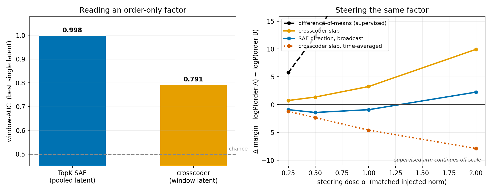
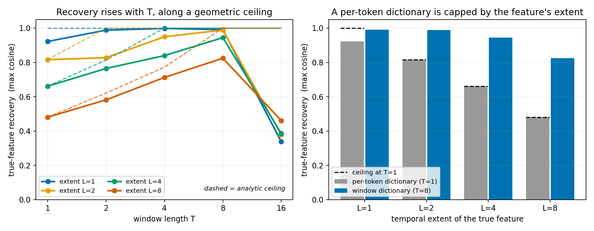
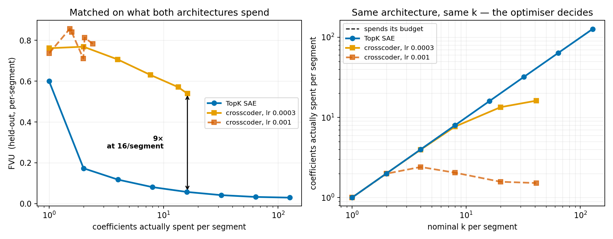

## What this sprint was for

The previous sprint found semi-synthetic settings where windowed steering beats per-token
steering, and the fair objection was that nothing had been benchmarked against a trained
sparse autoencoder. This sprint trains both dictionaries on the same activations, compares
them properly, and keeps iterating until it finds a setting where the crosscoder has a
genuine advantage.

It found one. Getting there required fixing the benchmark three times, and two of those
fixes affect results this project has already produced.

## Executive summary

### 1. The crosscoder's advantage is in steering, not in reading — and the two come apart

On a task whose label is **pure order** — two classes with identical multisets of sentences
and identical switch counts, differing only in which block came first — a single pooled
TopK SAE latent reads the label at AUC 0.998 while the crosscoder manages 0.791. By the
reading criterion the SAE wins outright.

Steering the *same* factor reverses it. At matched injected norm, the crosscoder's `(T, d)`
decoder slab moves the teacher-forced margin by **+9.93**; the SAE's single direction,
which is all a per-token dictionary has, manages +2.25 and is negative at three of the four
doses.

The reason is structural. A per-token dictionary's per-latent intervention is one direction
added at every position, so its write is **constant in time** — measured per-position
spread exactly 0.0000. Two orderings of one multiset are the same set of tokens, so a
constant write pushes both equally and has nothing to grip. A crosscoder latent writes a
different vector at each position and can push "tense early, calm late" without also pushing
the reverse.

**The control is what makes this a temporal claim rather than a better-direction claim.**
Take the crosscoder's own slab, average it over time, rebroadcast it — same latent, same
mean direction, same injected norm, only the temporal profile removed — and the effect does
not merely vanish, it **inverts**, from +9.93 to −7.87. The arrangement across positions is
carrying the result. An independent control reaches the same conclusion by permuting rather
than flattening: permuting a trained latent's decoder rows in time, refitting nothing, drops
steering fidelity from +0.242 to a null of +0.002 ± 0.103 over 24 draws, and replicates at
+0.292 on a healthier dictionary and a different latent.

### 2. Reading comparisons were never going to favour a window code, and now we know why

Every "can a window dictionary read temporal structure better?" experiment here came out the
same way, across three separate task designs and four layer depths. The explanation is that
a causal transformer **has already written its own history into every token**: a calm
sentence following six tense ones is represented differently from a calm sentence following
two. Pooling per-token codes therefore recovers order without representing anything
window-level.

The order-only task was built specifically to defeat per-token codes — matched multiset,
matched switch count, so any symmetric pooling is at chance by construction — and the SAE
still reached AUC 1.000, with a shuffled-segment control at 0.60 confirming the signal is
genuinely order. There is no temporal structure in mid-stack activations that a per-token
dictionary cannot access.

This retires a whole class of experiment. It also explains the depth sweep, which refuted my
own hypothesis in the opposite direction: the crosscoder is **worst** at early layers
(FVU 7.80× the SAE at layer 2 against 1.57× at layer 14), because early activations sit close
to token identity, which is exactly what a per-token dictionary is for.

### 3. A per-token dictionary has a geometric ceiling that no amount of training can move

In synthetic data with ground-truth features of known temporal extent `L`, a `T`-window can
cover at most `T` contiguous entries of the feature's profile, so recovery is bounded by
`‖largest contiguous T-chunk of p‖ / ‖p‖` before any training happens.

At T=1 measured recovery equals that ceiling to three decimals for every extent — 0.816
against 0.816, 0.661 against 0.662, 0.481 against 0.481. A per-token dictionary is not
underperforming on extended features; it is saturating a limit set by geometry. The
crosscoder climbs to 0.905 at L=8. Recovery rises monotonically in T and plateaus, at
**T ≥ L with headroom** rather than T = L.

### 4. Nominal k is not a budget, and matching on it invalidates the comparison

Realised sparsity is `min(k, #{pre > 0})`: TopK selects k latents and ReLU zeroes any whose
pre-activation was negative. For an SAE the second term never binds — 2022 positive
pre-activations at k=1. For a crosscoder it binds immediately, and **which term binds is set
by the optimiser, not the architecture**.

A 3× change in learning rate moves realised spend by up to 10.6×, with nothing in the
nominal configuration distinguishing the two runs: at lr=1e-3 the crosscoder diverges
quietly, spending 0.96 of a nominal 41 coefficients per segment while its loss *rises* over
training. Every crosscoder result in this project needs its realised L0 checked; the
measurement is two lines and the failure is silent.

### 5. BatchTopK without the ReLU is the fix, and is now the default

The composition `ReLU(TopK(·))` was inherited from SAE code where it is a genuine no-op.
Ported to a crosscoder it becomes the binding constraint. Measured at the diverging learning
rate, kper=41:

| sparsity rule | coeff/segment | budget spent | FVU |
|---|---|---|---|
| `topk_relu` (previous default) | 0.96 | 2% | 0.843 |
| batch selection **+ ReLU** | 0.92 | 2% | 0.841 |
| `topk_relu` + AuxK | 0.96 | 2% | 0.843 |
| `topk` (no ReLU) | 41.00 | 100% | 0.541 |
| **`batchtopk` (no ReLU)** | 41.39 | 101% | 0.554 |

Batch selection with a ReLU is not a fix — it cannot manufacture positive pre-activations
that do not exist. Removing the ReLU is, exactly and by construction.
`src/bench/architectures/crosscoder.py` now takes `activation ∈ {batchtopk, topk,
topk_relu, batchtopk_relu}` with `batchtopk` the default and 11 tests covering it, including
one asserting BatchTopK's eval output is independent of batch composition.

## The head-to-head benchmark

TopK SAE against a plain crosscoder (`batchtopk`, no auxiliary penalty), matched on realised
coefficients per segment, run-length corpus, layer 14:

| coeff/segment | SAE FVU | TXC FVU | ratio |
|---|---|---|---|
| 1 | 0.526 | 0.632 | 1.2× |
| 2 | 0.176 | 0.313 | 1.8× |
| 4 | 0.128 | 0.239 | 1.9× |
| 8 | 0.099 | 0.206 | 2.1× |
| 16 | 0.075 | 0.203 | 2.7× |

The crosscoder reconstructs worse at every budget. That is the price of the shared code, and
finding 1 is what it buys. Worth noting the size of the methodology correction: the same
comparison under nominal-k matching with `topk_relu` and disjoint windows put the SAE ahead
by 9–10×.

**The tSAE arm did not produce usable numbers.** Run as this repo defines `tsae_paper` —
attention TemporalSAE with ReLU + L1, loss normalised exactly as
`experiments/ward_backtracking_txc/architectures.py:185-188` — the code is dense at the
documented `l1_coef=1e-3`: 2989 of 4096 latents active, alive fraction 0.999, and sweeping
the coefficient over two orders of magnitude moved realised L0 by 0.3%. A published sparsity
coefficient is only meaningful relative to the activation scale it was tuned on. Two further
caveats: this repo's `tsae_paper` is attention-based, which may not be the architecture
intended (the description given was InfoNCE over nearby positions, and no such tSAE exists
in this repo — its InfoNCE code is all in crosscoder variants under `han_arch/`); and the
`lam = 1/(4·d_in)` scaling makes the codes small enough that `l1` needs to be ~1–10 rather
than 1e-3.

## Corrections made during the sprint

Recorded because most were mine, and the result depends on them not standing.

| claimed | status | what actually holds |
|---|---|---|
| `b_enc` goes negative and gates the dictionary | refuted | −0.021 → −0.024 across 20× of k; far too small |
| missing input centering starves the crosscoder | refuted | changes FVU by 0.002 |
| decoder normalisation at init is the defect | refuted | 3.97 coeff/seg without it, 3.98 with |
| raising k destroys realised capacity | withdrawn | true at lr=1e-3 only |
| 28× capacity overstatement at kper=41 | withdrawn | a fact about one training run |
| shuffling temporal structure does not hurt steering | reversed | the earlier control refit after shuffling |
| **the T-slope is a 6.8× cost of window sharing** | **withdrawn** | **1.5× once window count is held constant** |
| position-tying explains the large-T collapse | refuted then partly revived | masked by a data confound; peak does move with d_sae |
| the crosscoder should do better at early layers | refuted | it does worse — 7.80× at L2 |

The largest was mine and structural: windows were cut by reshaping a fixed segment stream,
so the number of training windows fell as `seq_len/T` and large-T arms were starved of data
rather than limited by architecture. Every T-comparison in the sprint was rerun at stride 1.

Two flaky tests were found and fixed along the way, both instances of the phenomenon under
study: `test_crosscoder_encode_shuffle_sensitive` used an unseeded `randperm(3)` (identity 1
in 6), and `TestTopKSAE::test_create_and_forward` asserted realised L0 == k on untrained
weights, which the ReLU-after-TopK breaks about 1 run in 8.

## What was run, and where it lives

| question | script | result |
|---|---|---|
| **reading vs steering on an order-only factor** | `steer_order_modal.py` | `steer_order.json` |
| order-only window factor + shuffled control | `ordertask_modal.py` | `ordertask*.json` |
| SAE vs TXC vs tSAE head-to-head | `bench4_modal.py` | `bench4*.json` |
| layer-depth sweep | `layer_modal.py` | `layer.json` |
| **feature recovery vs window length** | `recovery_local.py` | `recovery.json` |
| clock: resolution vs extent | `clock_local.py` | `clock.json` |
| per-segment budget vs T | `budget_local.py` | `budget.json` |
| dictionary size vs T | `saturation_local.py` | `saturation.json` |
| **frontier: SAE k × TXC kper × lr** | `frontier_modal.py` | `frontier.json` |
| activation-function comparison | `actfn_modal.py` | `actfn.json` |
| realised L0 = min(k, #{pre>0}) | `mechanism_modal.py` | — |
| frozen-arm shuffle, 24 draws | `frozenshuf_modal.py` | `frozen_shuffle*.json` |
| i.i.d. vs structured corpus 2×2 | `structured_modal.py` | `structured.json` |

Code under `experiments/temporal_screen/dict_bench/`, results under `results/dict_bench/`,
figures from `scripts/plot_{steer_order,recovery,frontier,tsweep}.py` into
`plots/2026-07-25_dictbench/`. The full research log, including every dead end and
retraction in the order they happened, is `log.md` in this folder.

## What I would do next

1. **Push the steering result to generation.** The Δ margin result is teacher-forced and
   needs no judge, which is why it was chosen; the natural follow-up is sampled generations
   scored for ordering, on the same multiset-matched foils.
2. **Close the gap to the supervised ceiling.** Difference-of-means reaches +68.69 against
   the crosscoder's +9.93, so neither dictionary is near optimal and there is 7× of headroom
   to explain.
3. **Re-check realised L0 on existing crosscoder results.** Two lines, silent failure, and
   it invalidated several comparisons here.
4. **Resolve the tSAE identification** and rerun that arm with a sparsity coefficient
   calibrated to these activations rather than inherited.
5. **Look for order-dependent behaviour in real tasks**, now that there is a criterion for
   which tasks should favour a window code: those whose target features have extent > 1 *and*
   whose intervention needs to differ across positions.
