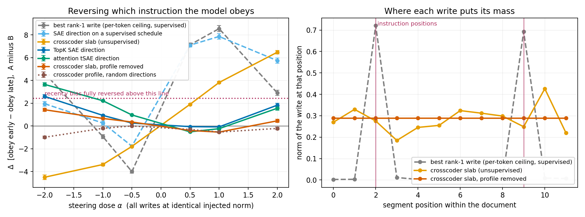
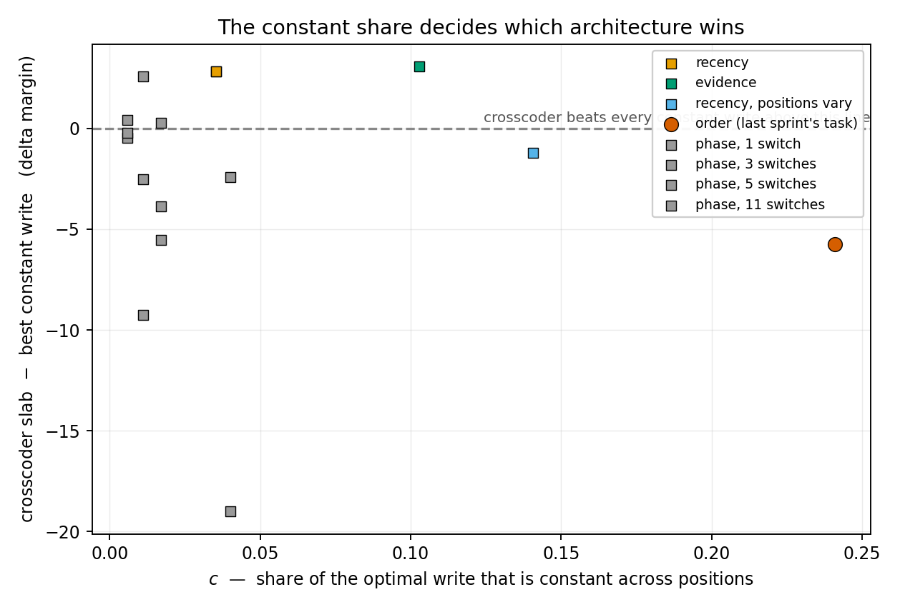
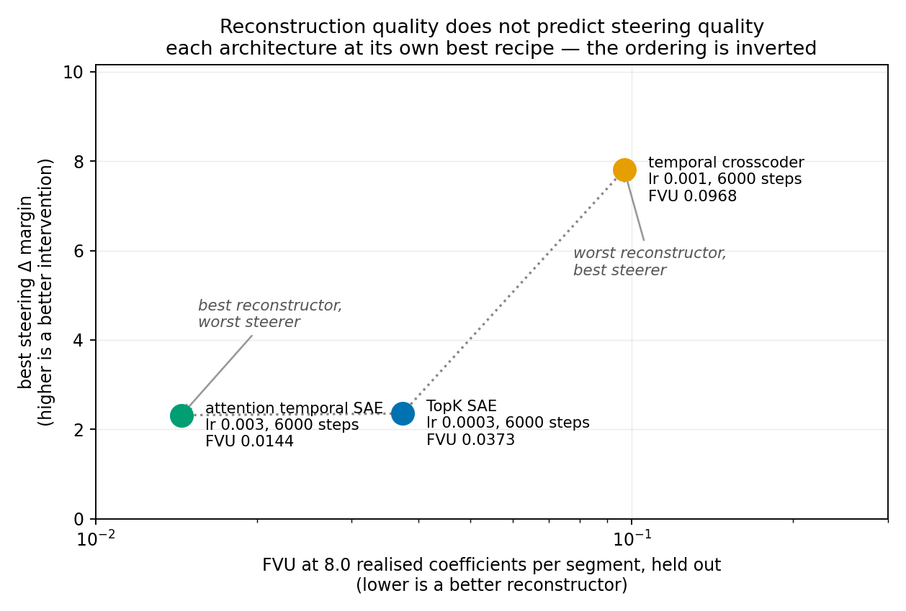

## Status

Draft executive summary for `summary.md`. Every number below is read from a named result file in
`results/txc_wins/`. Still running at the time of writing: the demonstration-order cell (three
dictionary inits) and its n = 200 probe screen.

## Executive summary

The sprint asked for more tasks where a temporal crosscoder beats a per-token dictionary. **It
found three, and in establishing what kind of win they are, it withdrew the previous sprint's
headline and produced a screen that says in advance which tasks can separate the architectures.**

The three wins are real and they are all the same kind. On instruction-position bias, evidence
order, and a 12-block rotation, a crosscoder latent beats **every arm obtainable from a learned
per-token dictionary** — including that dictionary's own direction on its own schedule — with the
temporal-profile controls holding. What it never beats is the best **rank-1** write taken from the
metric's own gradient. So the claim is **discovery, not expressiveness**: the crosscoder finds,
unsupervised and from reconstruction alone, a write that a per-token dictionary could have executed
if someone had handed it the schedule. That is worth having, because the schedule is exactly what a
practitioner does not possess — and there is now a published method that supplies one, which the
crosscoder loses to.

Four results that do not depend on any of that framework:

1. **The previous sprint's headline is withdrawn**, on a one-sided-dose-grid artefact.
2. **Reconstruction quality does not predict steering quality — the ordering is inverted.** The
   best reconstructor of three architectures steers worst; the worst steers best, by 3.4×.
3. **A benchmark that fixes one learning rate across architectures is not measuring
   architectures.** Each of the three peaks at a different recipe over a 10× range.
4. **The L1 temporal SAE has no usable sparsity coefficient** — FVU crosses 1.0 before L0 crosses
   32, for an architectural reason.

### 1. The previous sprint's headline is withdrawn

The order-task result — crosscoder +11.29 against the SAE's +1.24 — was measured on a one-sided
dose grid. Rerun at both signs with two dictionary inits, the crosscoder does not beat the SAE
significantly in either (+6.34 and +3.41 against +4.66 and +5.16; z = 1.35 at one init, losing
at the other).

**The control that was the proof has inverted.** `txc_flat` — the same slab with its temporal
profile averaged away — was reported as *inverting* to −8.02, and that was the evidence the
profile carried the effect. It reaches **+12.10 and +18.47**, roughly double the crosscoder
itself. `txc_flat` is large and negative at positive doses and large and positive at negative
ones, so a positive-only grid recorded the negative branch and read a **sign** as an
**inversion**. Since the sign of a steering vector is a free parameter, the honest reading is
the reverse of the published one: `txc_flat` is a better constant write than the SAE's, and the
order task is steerable by a constant write.

Two lessons generalise. **A one-sided dose grid cannot distinguish a directional effect from a
magnitude artefact**, and the two failure modes point opposite ways — an arm positive at *both*
extremes is a second-order artefact, while an arm effective only at negative doses is genuinely
directional and invisible to a positive-only sweep. Both occurred here. And **selecting each arm
at its own best dose is not neutral**: it picks each arm's saturation point, which is exactly
where the linear reasoning that justifies every ratio below stops applying.

### 2. The wins are real, and they are discovery rather than expressiveness

#### A per-token dictionary's write is rank-1, whatever its temporal machinery

Read from the decoders rather than argued: an SAE latent has one direction, and the attention
temporal SAE's attention lives entirely in its encoder while its decoder holds one direction per
latent with no position axis. **This holds for the published InfoNCE tSAE too** — both have one
decoder direction per latent, so the rank conclusion does not depend on which is meant. Scaling a
latent by its own activation — what practitioners do, and what a temporal SAE does automatically — varies the *coefficient* across positions but never the direction. So a
per-token dictionary, steered well, reaches **any rank-1 write**, and the architectures can
differ only where the intervention needs genuinely different directions at different positions.

#### The rank of a task's optimal write is bounded by its attribute count

If activations decompose over semantic attributes, the difference slab factors as `P = S·U` —
schedules in `S`, directions in `U` — so `rank(P) ≤ A`, the number of attributes whose positional
pattern differs between conditions. **Schedule complexity lives inside `S`'s columns and cannot
raise its rank.**

This is why the search is structurally hard rather than unlucky. Language tasks almost always
manipulate one attribute — formality, intensity, refusal, which instruction applies — so however
intricate the time-course, the required write factors into one direction times a schedule. The
result arrived three ways: registered in advance, derived independently from the measurements,
and proved. It predicts the phase ladder is rank-1 at every rung (two sentence pools are one
attribute; measured `r1` 0.921 → 0.970) and an `m`-block rotation is rank `m − 1`.

The design rule that follows: **an expressiveness result needs a task where two or more distinct
attributes move in different directions at different positions.**

⚠ **Three mechanisms for that second attribute have been proposed and all three are refuted**,
each by a profile measurement the proposal itself specified:

| proposed mechanism | prediction | measured |
| --- | --- | --- |
| content plus its carried state | `u₁`, `u₂` on disjoint positions | both on the *same* two positions (instruction position); `u₂` U-shaped where a running balance would ramp (demonstration order) |
| serial position (primacy/recency) | `u₂` near-identical under a second moment-matched pattern pair | `corr` = **+0.18**; the 1/dist-to-end fit falls 0.898 → 0.524 |
| differing-vs-agreeing positions | — | explains the **support** but not why the slab is rank 2 rather than rank 1 |

> **Rank ≥ 2 is measured and robust across tasks and pattern pairs. The leading direction is
> explained — the gradient's support is set by where the two classes differ, which predicts a
> broad profile at Hamming 12 (cv 0.257) and tracks the differ-indicator at +0.885 on a Hamming-8
> control. The *second* direction is not: three candidate mechanisms were proposed and each was
> refuted by a profile measurement it predicted.**

The accounting is `u₁` **explained** on both pattern pairs, `u₂` **unexplained** on both after
three attempts — `cv(u₁)` = 0.257 against `cv(u₂)` = 0.962, and a constant differ-indicator cannot
produce a U-shaped profile.

The original argument, for the record:
The argument was content plus its own carried state, since a maintained state's schedule is the
running integral of the content's. It makes a checkable prediction about profile structure, and
the prediction fails twice. On instruction position, `u₁` and `u₂` both live on the two
instruction positions with filler ≤ 0.02 in each — nearly identical, not disjoint. On
demonstration order, `u₂` is **U-shaped**, mass at positions 1 and 12 with a deep trough between,
where a running balance would ramp monotonically.

So rank ≥ 2 is real in both tasks and **never for the reason proposed**: in one it is
context-dependence at the same two positions, in the other a broad mode plus an endpoint mode.
**The attribute theorem is algebra and is untouched; the claim about which attributes supply `A`
in real tasks is withdrawn.** It should be read as "two attributes, mechanism unidentified".

#### The surviving win is discovery, not expressiveness — and the ordering is measured

*Left: every arm on a symmetric dose grid at identical injected norm — the crosscoder (orange)
crosses the bias-reversal line, the deployed per-token arms (blue, green) do not, and the
profile-removed control (red) stays flat. Right: where each write puts its mass — the supervised
write concentrates on the two instruction positions, the crosscoder's profile is nearly flat and
still reaches 76% of it.* ⚠ The legend's "per-token ceiling" is a **mislabel**: that arm is
`rank1_best`, the rank-1 truncation of the difference-of-means slab, which is a reference and not
a ceiling.

**Reported at matched dose in the linear regime.** Selecting each arm at its own best dose picks
its saturation point, which is where the first-order reasoning behind every ratio here stops
applying. Matching the dose *magnitude* across arms and reporting at the smallest magnitude where
the crosscoder is significant (α = 0.5 on every task) changes two conclusions, **one of them
against us**:

| task | crosscoder | SAE | attention tSAE | `txc_flat` | scheduled SAE |
| --- | --- | --- | --- | --- | --- |
| recency | +1.90 | +0.25 | +0.97 | +0.34 | **+7.10** |
| evidence | **+1.59** | −0.02 | +0.07 | +0.75 | +1.85 |
| `rotate12` | **+3.54** | +0.94 | +1.24 | +0.98 | +1.53 |
| order (2 inits) | +0.90 / +1.54 | +0.32 / +0.43 | — | **+1.58 / +4.11** | +0.10 / −0.09 |

**The discovery gap on recency is 3.7×, not the 1.2× best-dose reporting showed** (z = −29.2). And
`rotate2` and `rotate6` show no significant crosscoder effect at *any* dose, so their entries above
are the honest null.

**The direction-versus-schedule split, measured properly.** At matched dose the two surviving
tasks order oppositely against a scheduled per-token write: on recency the scheduled SAE wins
(+7.10 against +1.90, z = −29.2) — its **direction** was already right and only the schedule was
missing. On `rotate12` the crosscoder beats it (+3.54 against +1.53, z = +5.3) and ties the
gradient-scheduled version — the SAE's **direction is wrong and no schedule rescues it**. **The
crosscoder's value is largest where the direction itself must be found**, not the schedule.

**The order-task retraction holds at α = 0.5 in both inits**, so it was not an artefact of reading
a saturated grid: `txc_flat` beats `txc_slab` at every dose tested.

**Stated at its true scope:** on Qwen2.5-1.5B-Instruct, a crosscoder latent reverses the model's
instruction-position bias in generated text, beating every unsupervised per-token baseline and
every temporal-profile control. The same task on two smaller models has **no steerable target at
the layer tested, for any write including the supervised one** — see the limits section.

**The full arm ordering, at each arm's own best dose.** These numbers are **not comparable to the
matched-dose table above** — they are larger because each arm is read at its saturation point, and
they are reported because the *ordering* is what finding 2 rests on and it is stable across both
reportings. Instruction position, completed configuration, every arm at matched injected norm:

| arm | Δ margin (peak dose) | |
| --- | --- | --- |
| `rank1_best` | +8.55 ± 0.27 | rank-1 truncation of the difference-of-means slab |
| `dom_slab` | +8.20 ± 0.22 | supervised reference |
| `sae_schedule` | +7.86 ± 0.25 | the SAE's own direction on its best schedule — **a published method**, see below |
| **`txc_slab`** | **+6.48 ± 0.15** | the crosscoder |
| `tsae_broadcast` | +3.65 ± 0.14 | **this repo's attention-based temporal SAE — not the published tSAE** |
| `sae_broadcast` | +2.60 ± 0.15 | a per-token dictionary as actually deployed |
| `random_broadcast` | +1.81 ± 0.16 | |
| `txc_flat` | +1.42 ± 0.14 | profile removed |
| `random_slab` | +1.39 ± 0.07 | |
| `txc_profile_random` | +0.00 ± 0.04 | profile kept, directions randomised |

Three levels, each gap separately significant.

**The crosscoder beats deployed practice**, by 2.5× at peak dose (+6.48 against +2.60, z = 18.3)
and 7.6× at matched dose (+1.90 against +0.25). That is the honest, useful win, and it holds under
both reportings.

**A per-token dictionary handed a schedule beats the crosscoder** — +7.86 and +8.55 against +6.48,
z = 4.7 and 6.7 — so the write was never out of reach. The crosscoder reaches 76% of
`rank1_best`, which is a **reference and not a ceiling**: it is the rank-1 truncation of the
difference-of-means slab, and the true rank-1 ceiling is the gradient-derived `grad_rank1`, which
the crosscoder is further from still.

So its genuine claim is that it *found* a schedule unsupervised, from reconstruction alone, that
a per-token dictionary could have executed if handed it. It is a discovery claim.

**`sae_schedule` is not an oracle we constructed to be hard to beat — it is a published method.**
Heyman & Vandeputte's Prompt Steering Replacement (arXiv:2605.03907, title and authors verified)
estimates token-specific steering coefficients from the activations themselves, and reports
beating existing activation-steering methods across three benchmarks, particularly for
high-coherence outputs. So the finding is better stated as: **the crosscoder loses to a method a
practitioner can already run.** That sharpens the discovery framing rather than softening it —
what the crosscoder adds is obtaining the schedule from reconstruction alone, with no supervision
and no imitation target.

**Two kinds of discovery, and the two headline tasks split on them.** On recency the SAE's learned
direction is essentially the optimal rank-1 direction, so only the *schedule* was missing and
supplying it beats the crosscoder (+7.86 against +6.48). On `rotate12` the SAE's learned direction
is wrong, so a schedule buys it almost nothing (+5.36 constant → +5.83 scheduled) and the
crosscoder beats every arm obtainable from a learned per-token dictionary by 3×. **The crosscoder's
value is largest where the direction itself is what has to be found**, not the schedule.

**A registered architectural prediction appeared to land here and is now withdrawn as
untested.** The temporal SAE was argued from its decoder to be rank-1 with an *automatically
supplied* schedule, so it should sit strictly between a constant write and an optimally scheduled
one, and the measurement obliged: +2.60 < +3.65 < +7.86. **That arm was trained at a third of the
learning rate it wants.** At its own best recipe the attention tSAE is the *best reconstructor of
the three architectures* — FVU 0.0144 against the SAE's 0.0373 and the crosscoder's 0.0968, a
2.6× margin over the SAE — with reading AUC 1.000. Its steering number was obtained from a badly
undertrained dictionary and predicts nothing. The comparison is being rerun with each arm at its
own recipe.

⚠ **The arm measured is not the published tSAE.** `harness.py:268-274` imports `TemporalSAE`
from `temporal_crosscoders/han_tsae`, which is this repo's **attention-based** variant. The
published tSAE (Bhalla et al., ICLR 2026) is an **InfoNCE** architecture with no attention. The
rank conclusion transfers — both have one decoder direction per latent, so both are rank-1, and
the ordering prediction holds either way — but the arm's identity does not. It must be described
as "this repo's attention-based temporal SAE", never as "the tSAE". The kickoff's carried debt
on tSAE identification is therefore **resolved**, and it resolves to *we benchmarked a different
temporal SAE than the published one*.

**The constant arms are a second-order artefact, and this understates the crosscoder.** A
difference-of-differences metric cancels a constant write only to *first* order; the residual
`≈ ½α²(⟨v,H_A v⟩ − ⟨v,H_B v⟩)` is **even in α**, while a genuine directional effect is **odd**.
Splitting each arm's dose response about zero:

| arm | recency even-share | evidence even-share |
| --- | --- | --- |
| `sae_broadcast` | **0.72** | **0.80** |
| `tsae_broadcast` | 0.58 | 0.51 |
| `txc_slab` | **0.12** | **0.10** |
| `grad_slab` | 0.17 | 0.01 |

The constant arms are dominantly even and the crosscoder dominantly odd, with `grad_slab` — known
to be the first-order optimum — almost purely odd as the control that makes the decomposition
safe. So `sae_broadcast` is a **mis-specified** baseline rather than a weak one, and the honest
per-token comparator is the scheduled arm.

**The controls hold on this task**, which is what distinguishes it from the order task where they
did not: `txc_flat` at +1.42 sits *below* a random constant direction at +1.81, and
`txc_profile_random` is +0.00 ± 0.04. Neither the directions without the profile nor the profile
without the directions carries any of the effect.

**`rank1_best` above is the rank-1 truncation of the *difference-of-means* slab**, which is a
reference and not a ceiling — `cos(P_dom, Ḡ)` runs 0.02 to 0.19, so the two are not proxies. The
gradient arms have since been run at full configuration on every task that carries a claim, and
the `sqrt(r1)` law is tested against them in finding 2.

**The reading result has now replicated five times.** `auc_selection = 1.000` for the SAE on
recency, evidence and `recency_var`, against the crosscoder's 0.719, 0.685 and 0.632 — on the two
tasks that carry the empirical claim. A per-token dictionary reads these factors perfectly and
steers them worst. It is the most-replicated finding in the project.

### 3. One number screens a task before any dictionary is trained

`c` is the share of a task's optimal write that a **constant** write can reach. It costs one
backward pass per document and involves no dictionary. One dedicated screen covers seven tasks at
identical `n_docs = 200` and `n_grad = 40` (`results/txc_wins/geometry_all.json`), so the column
below is a single consistent measurement rather than a pooling of per-run values:

| task | `c(P_dom)` | `c(Ḡ)` | crosscoder − best constant write |
| --- | --- | --- | --- |
| `rotate12` | 0.011 | **0.026** | **+2.30 ± 0.27** |
| instruction position | 0.039 | **0.036** | **+0.94 ± 0.06** |
| `rotate6` | 0.055 | 0.134 | −10.17 ± 1.46 |
| evidence order | 0.095 | **0.143** | **+0.86 ± 0.03** |
| order (last sprint) | 0.036 | 0.225 | −3.24 ± 0.27 |
| `rotate2` | 0.111 | 0.255 | −8.37 ± 2.19 |
| `phase1` | 0.037 | 0.262 | −5.30 ± 0.23 |

Margins are at α = 0.5, the smallest dose where the crosscoder is significant — inside the linear
regime, which also means these are far less contaminated by the second-order component than
peak-dose numbers (even scales as α², odd as α).

*Each point is a task: `c` measured on the metric gradient before any dictionary exists, against
how far the crosscoder beats the best constant write at the smallest significant dose. Above the
dashed line the crosscoder wins. The shaded band is the one adjacent pair no threshold separates.*

**Two things this establishes, and one it does not.**

**It establishes that the gradient is the right object.** `c(P_dom)` gives 0.036 for order and
0.039 for recency — two tasks with opposite outcomes at essentially identical values — while
`c(Ḡ)` separates them 6×. Measured `cos(P_dom, Ḡ)` runs 0.05 to 0.19 across these tasks, so the
difference-of-means slab is not a cheap approximation to the gradient; it is a different quantity,
and every screen and ceiling arm must be built from the gradient. This repeats on the
demonstration-order task built *after* the prediction was registered, where `r1(P_dom)` = 0.94
would have discarded it and `r1(Ḡ)` = 0.59 says it has the second-most rank headroom in the sprint.

**It establishes a classifier, not a ranking.** The deltas are on different scales across tasks,
so what the screen is asked to do is call the **sign**, not order the magnitudes. **The best
achievable classification is 6 of 7, and no threshold does better** — `rotate6` (`c` = 0.134,
loses) and `evidence` (`c` = 0.143, wins) are inverted against each other 0.009 apart, so one of
them is always missed.

**The data locate no boundary within that.** Every cut below 0.134 scores 6/7 and so does every
cut above 0.143, which is why the figure shades the inverted band and **draws no threshold line**:
a line anywhere in (0.036, 0.134] or (0.143, 0.225] would claim a precision seven points cannot
support. So `evidence` is a boundary case adjacent to a loss rather than an outlier inside the win
region. As a rank correlation on magnitudes instead, τ = −0.52, dragged down by `rotate6`'s large
negative — a fact about that task's effect size rather than about the screen.

**It does not establish a quantitative law.** `c` bounds `⟨W_const, Ḡ⟩`, a **first-order**
quantity, odd in α — but the constant arms measure **72–80% even**, i.e. mostly curvature. So the
two quantitative tests that appeared to support `c` were computed against a numerator that is
largely not the thing `c` bounds. Recomputed on the odd component alone, against a prediction
registered in advance:

| test | on raw peaks | on the odd component | registered prediction |
| --- | --- | --- | --- |
| four-rung ordering | 4/4 | **0/4**, values sign-inconsistent near zero | "still passes 4/4" |
| τ (two independent implementations) | −0.570, −0.58 | **−0.496, −0.467** | "\|τ\| rises above 0.58" |

**The prediction fails, but the recomputation does not cleanly refute `c` either — the odd
estimator is too noisy to settle it.** The odd part is a difference of two noisy estimates, so
signal shrinks while noise does not, and the loss falls hardest on the low-`c` winning tasks that
anchor the correlation: recency's SNR drops 18.1 → 8.5 and evidence's 13.4 → 3.5, while the
rotation rungs gain. Isolating the correct component costs more in noise than it recovers in
specificity. **τ = −0.58 therefore stands as the best available estimate**, and the obvious attempt
to strengthen it has been made and has failed — which makes "ranks but does not decide" more
secure rather than less.

**What survives is one solid consequence and one honest limit.** The constant arms being 72–80%
even means the per-token baselines are largely **second-order artefact**, so `sae_broadcast` is a
mis-specified comparator rather than a weak one and the crosscoder's *directional* margin over it
is understated. And `c` is a **ranking heuristic with a known inversion**, not an instrument.

> **Geometry sets the ceilings. Discovery determines what is reached.** Every result in this
> sprint is decided by the second, which is why a geometric screen ranks candidates and cannot
> call them.

#### `c` is a property of the task *and the metric*

The same task screens differently under different metrics. An ordering metric
(`logP(A) − logP(B)`) cancels *content* when multisets match but leaves *context* exposed — the
residue a constant write rode. A difference-of-differences metric additionally cancels anything
pushing both classes the same way, driving `c` toward zero by construction. That is why the
constructed ladders reversed and the real-behaviour tasks did not.

One line: **use a difference-of-differences metric and a symmetric dose grid.** The first removes
a component the ordering metric leaves exposed; the second is the only thing that reveals which
kind of effect an arm has.

### 4. Reconstruction quality does not predict steering quality

*Three architectures, each trained at its own sweep-derived best recipe and matched at 8.0
realised coefficients per segment on held-out data. If reconstruction predicted steering these
points would fall on a downward line; they rise.*

At 8.0 realised coefficients per segment on the recency corpus, **each arm at its own best
recipe** from a full lr × steps sweep:

| arm | FVU | Δ at matched dose | Δ at best dose |
| --- | --- | --- | --- |
| attention tSAE | **0.0144** | +0.19 | +2.32 |
| TopK SAE | 0.0373 | +0.47 | +2.35 |
| crosscoder | **0.0968** | **+5.31** | **+7.81** |

**The best reconstructor steers worst and the worst reconstructor steers best.** At matched dose
the inversion is **strict and complete** — FVU orders tSAE < SAE < crosscoder and steering orders
them exactly in reverse, 3 of 3, spread **28×**. At best dose it is only 3.4× and not strict,
since the two per-token arms sit within 0.03 of each other. Any benchmark ranking temporal dictionaries by FVU — which is what
the field does — would rank these three in precisely the wrong order for the use a crosscoder is
being proposed for.

This also retires a caveat carried all sprint. The crosscoder's poor FVU was being treated as the
price of the shared code, to be weighed against its steering advantage. On this evidence **it is
not a price**: reconstruction is uncorrelated with, or anticorrelated with, the property actually
wanted.

**The headline survives giving every arm its own best recipe**, which was the largest standing
threat to it — the concern being that the crosscoder benefited from a configuration handicapping
its competitors, a concern earned by the tSAE having to be corrected three times for exactly that
reason. Best Δ over symmetric doses at per-arm recipes:

| task | crosscoder | SAE | `txc_flat` | attention tSAE |
| --- | --- | --- | --- | --- |
| recency | **+7.81** | +2.35 | +2.37 | +2.32 |
| evidence | **+5.59** | +1.20 | +2.44 | — |
| `rotate12` | **+14.61** | +2.21 | +3.13 | +6.38 |

On recency the advantage is **larger** at per-arm recipes than at the shared one (+7.81 against
+6.48).

#### A single learning rate across architectures does not measure architectures

The sprint's default `lr = 3e-4` is near-optimal for the SAE and wrong for both temporal
architectures. Best FVU per arm across a 3 × 2 recipe sweep on the recency corpus, matched at 8.0
realised coefficients per segment on held-out data: **SAE 0.0373 at 3e-4, crosscoder 0.0968 at
1e-3, attention tSAE 0.0144 at 3e-3** — each arm peaking at a different recipe, spanning a 10×
range in learning rate.

This is a caveat on every cross-architecture number in both sprints, and it is the reason the
tSAE arm was reported at three different values tonight — 5× worse than the SAE, then 1.9× worse,
then 2.6× *better*. Each revision was a training-recipe artefact, not a measurement.

**The sprint's assigned deliverable was to calibrate the L1 temporal SAE, and the answer is that
no usable setting exists.** The coefficient controls sparsity only five to eight orders of
magnitude above the documented `l1 = 1e-3`, and the dictionary dies before it gets sparse: **FVU
crosses 1.0 — worse than predicting the mean — at 29 coefficients per segment, before L0 crosses
32.** The last usable point is `l1 = 100` at 151 coeff/segment, FVU 0.32.

Two causes, both architectural. `lam = 1/(4·d_in)` puts codes at ~4e-3 while the reconstruction
term is ~18, so `l1 = 1e-3` contributes 0.2% of the loss. And `TemporalSAE` has **no encoder
bias**, so sparsity has to come from dictionary geometry alone — the alive fraction is still 0.998
at 67 coeff/segment. Both readings of the loss fail the same way. **Use the same architecture with
`sae_diff_type="topk"`, which binds exactly.** This closes the carried debt from the previous
sprint: the answer is that the L1 form is not calibratable, not that we failed to calibrate it.

Two mechanical notes that follow. The crosscoder's realised coefficient spend moves with the
learning rate (10.15 at 3e-4, 8.32 at 1e-3, 8.04 at 1e-3/6000, against nominal 8), so **recipe
and budget-matching are not independent knobs**. And the crosscoder is the only one of the three
that diverges outright — FVU 0.0968 at 1e-3 against 0.3596 at 3e-3.

### 5. Scope limits, and what the crosscoder is not doing

The advantage requires the factor to sit at **consistent positions across documents**. A
dictionary latent is one fixed write reused everywhere, so any fixed-write arm is bounded by the
*mean* slab; when positions vary, the per-document slab keeps its shape but slides, and the mean
is a broad ramp rather than a sharp template. Randomising the instruction positions leaves the
crosscoder retaining 10% of its effect against a fixed write's 67% — a limit on the whole
intervention class, with a crosscoder discovery gap on top.

**It is not solving the task by locating the instructions.** The supervised rank-1 write puts 97%
of its mass on the two instruction segments; the crosscoder's profile is nearly flat, its two
largest entries at positions 10 and 1 rather than 9 and 2 — and it still reaches 76% of the
supervised effect. The narrower and more interesting claim is that **there is more than one way
to move this metric, and the crosscoder found a different one from the supervised write.** That
`cos(P_dom, Ḡ) = 0.044` — the supervised and gradient routes are themselves nearly unrelated —
makes a third, differently-shaped solution unsurprising rather than anomalous.

## What was not achieved

**No expressiveness win was found, including on a design built specifically to produce one.** The
rotation ladder drives the rank-1 reachable share `r1` down to 0.177 by construction, and at that
rung the crosscoder still loses to the best rank-1 write taken from the metric's own gradient:
**+18.23 against `grad_rank1` +102.46** (z = −31.5). The same holds at every rung — `grad_rank1`
reaches +109.98, +67.74, +102.46 while the crosscoder reaches +2.86, −0.01, +18.23. **A rank-1
write beats the crosscoder everywhere on a ladder built to put the target out of rank-1 reach.**

**The geometry an expressiveness win requires was constructed, and the headroom went unused.**
`evidence` measures `r1` = 0.62 and `rotate12` measures 0.18 — 38% and 82% of those optimal writes
lie beyond rank-1 reach — and on neither does the crosscoder approach even the rank-1 ceiling. So
the negative is **a finding about the architecture, not a failure of task design**.

⚠ **The most inviting error left in this document.** On `evidence` the crosscoder *beats*
`rank1_best` at z = +8.66 while *losing* to `grad_rank1` at z = −61.6 — from the same file,
`evidence_grad.json`. Both are rank-1 arms, differing only in which slab they truncate. Beating
`rank1_best` says the difference-of-means reference is poor; it does **not** say a rank-1 write is
insufficient. **The ceiling is `grad_rank1`.** This flip is also the sharpest single demonstration
in the sprint that difference-of-means is a reference and not a ceiling, so any
percent-of-ceiling figure must name which object it used.

**`r1` bounds the write and does not forecast the architecture — two different claims, and only
the second fails.** The law is a *within-task* ratio, `Δ(rank-1 arm)/Δ(full write) ≈ sqrt(r1)`;
comparing rank-1 arms in absolute terms across rungs tests nothing, because the denominator moves
too (`grad_slab` runs 76.0 → 102.4 → 166.9 → 275.2). Measured correctly:

| m | `grad_rank1`/`grad_slab` | `sqrt(r1)` | error |
| --- | --- | --- | --- |
| 2 | 1.447 | 0.551 | 162% |
| 3 | 0.567 | 0.516 | **10%** |
| 6 | 0.406 | 0.459 | **12%** |
| 12 | 0.372 | 0.421 | **12%** |

**The law holds to within 12% at three of four rungs and reproduces the monotone decline.** It
fails at `m = 2`, self-diagnosingly: a ratio above 1 means a rank-1 truncation beat the full
write, impossible to first order for a strict subspace, so that rung sits outside the linear
regime — the same signature appears in its difference-of-means arms (50.49 against 39.35). What
`r1` has never done is predict what a *crosscoder* achieves: at `m = 12` it identified headroom to
+102.5 and the crosscoder used +18.23. **One gate on `c`, one bound from `r1`, and no result yet
converting `r1`'s headroom into a win.**

**The gradient-derived rank-1 arm beats the difference-of-means one at all four rungs** — 2.18×,
1.42×, 1.36×, 1.71× — which is the screen-on-the-gradient point measured four more times.

## The object exists; the task does not

A crosscoder latent's slab **is** a fixed, plottable, rank-≥2 steering object learned as one unit,
and no published method supplies one — position-varying steering that exists elsewhere is either
input-conditioned (a network evaluated at inference) or a union of rank-1 writes selected by
attribute rather than position. So the gap this work sits in is not a missing object. **What the
sprint could not supply is a task on which that object pays.** The contribution is the
characterisation of what such a task requires — rank ≥ 2, `c ≈ 0`, and positions consistent across
documents — together with a construction satisfying the first two, which was built and screened tonight and
is the cell still running.

## The experiment that is running

Every design in this sprint achieved either rank ≥ 2 or `c` ≈ 0, never both — the trajectory
tasks got `c` = 0 with rank 1, instruction position got rank 2 with `c` = 0.036 but `r1` = 0.82,
the rotation ladder got rank with `c` = 0.13–0.26. The reason is now understood: **the carried
state is simultaneously what creates rank ≥ 2 and what creates the DC residue**, because both come
from the same integral.

Few-shot demonstration order breaks the tie. The label at position `t` is one attribute and the
running label balance is its integral, so matching the label multiset gives **rank 2 for every
foil**. Matching the multiset is the *zeroth* moment; the state's DC residue is the *first*, since
`Σ_t cumsum(Δc)(t) = −Σ_j j·Δc_j`. Adding the first-moment constraint gives both at once — and the
constructed patterns match moments 0, 1 **and** 2 exactly (6 / 39 / 325).

**Hamming 12 is the only diagnostic choice, not merely the efficient one.** At full Hamming
distance every position differs, so the differ-indicator is *constant* — which removes support as
a confound and makes pair 1 the only pair on which a residual profile shape could mean anything.
On any lower-Hamming foil, profile structure is confounded with the differ pattern, as the
Hamming-8 control demonstrates directly.

**The pattern pair is forced, not chosen.** Enumerating all 924 balanced 12-length label
sequences, exactly **one complement pair** matches moments 0, 1 and 2 — the pair used. There were
no researcher degrees of freedom in the pattern, which is a stronger answer to the
cherry-picking question than a robustness check would have given, because it shows there was
nothing to pick from.

It also means that robustness check **cannot be run at `k_seg = 12`**: the design space is a
single point. The usable sizes are sparser than they look —

| `k_seg` | 8 | 10 | 12 | 14 | 16 | 18 | 20 | 24 |
| --- | --- | --- | --- | --- | --- | --- | --- | --- |
| complement pairs | 1 | — | **1** | — | **7** | — | 24 | 296 |

Two distinct failure modes, which look alike in the table: odd `k` fails on **balance**, and
`k = 10, 14, 18, 22` fail because `Σ_{j=1..k} j` is **odd**, so only `k ≡ 0 (mod 4)` survives.
The pair count runs 1, 1, 7, 24, 296 — so **`k_seg = 16` is the smallest size offering any choice
at all**, which makes it the right size for the check rather than a convenient one. If the check is ever run, the clean form is two of `k = 16`'s seven pairs
against each other, holding document length fixed and varying only the pattern; comparing `k = 12`
against `k = 16` would confound pattern with length.

Screened on real activations, n = 200, both metric modes:

| | ordering mode | **probe mode** |
| --- | --- | --- |
| `c(Ḡ)` | 0.020 | **0.030** |
| `r1(Ḡ)` | 0.587 | **0.643** |
| `σ₂²/σ₁²` | 0.338 | 0.183 |
| `cos(P_dom, Ḡ)` | +0.139 | +0.017 |
| **shared-write retention** | 0.272 | **0.743** |

**Probe mode is the headline and the deciding number is retention.** A fixed write captures 74% of
the per-document gradient in probe mode against 27% in ordering mode — a 2.7× larger ceiling for
*every* arm, because the probe metric isolates the label-prediction effect, which is the same
mechanism in every document, while document-likelihood gradients are dominated by document-specific
content that averages away. Probe mode is also the readout the documented behaviour acts on:
few-shot label bias moves the model's **predicted label**, not the relative likelihood of two
demonstration blocks.

⚠ **`r1(P_dom)` = 0.94 on this task against `r1(Ḡ)` = 0.64.** A difference-of-means screen would
have discarded it as rank-1. This is the fourth independent instance of that divergence and the
only one on a task built *after* the prediction was registered.

**A prediction that did not land, worth keeping.** The probe gradient was expected to be
recency-weighted, since that is the documented ICL bias. Measured profile is flat to slightly
*front*-loaded (late/early ratio 0.841). So at this layer the write-sensitivity of demonstrations
is not recency-ordered even though the behavioural bias is — which means **"the crosscoder wins by
exploiting recency" is not available as an explanation** if it does win.

**The go/no-go passed, and the size of the pass is itself the finding.** Unsteered
`score(A) − score(B)` measures **−0.303 ± 0.060** (n = 120, z = 5.0), independently **−0.371 ±
0.051** (n = 200, z = 7.2). So matching moments 0, 1 and 2 did **not** remove the behaviour — but
it attenuated it heavily:

| task | unsteered gap | z |
| --- | --- | --- |
| instruction position | −2.42 | 11.5 |
| evidence order | −1.36 | 15.1 |
| **demonstration order** | **−0.303** | 5.0 |
| `escalate` (dropped null) | −0.07 | 0.5 |

**The few-shot order effect at this scale is mostly carried by the label-position statistics the
moment constraints remove, with a small residue that survives them.** That is a result about the
behaviour regardless of how the steering goes, and it is the first direct evidence for what
carries ICL order sensitivity in this setting.

It also sets the billing. A steering delta is not bounded by the baseline gap — on instruction
position the crosscoder moved the metric 2.7× its baseline — but "reverses a documented bias" is a
weak sentence when the bias is 0.30 nats. **A win here is a mechanism result on a low-`c`, rank-2
task, not a behavioural headline, and it does not go ahead of instruction position.**

⚠ **The `_free` control has become the critical experiment.** The first-moment constraint was
motivated *entirely* by the carried-state argument — the state's DC is `−Σ j·Δc_j`, so matching the
first moment kills it. With that mechanism now refuted on both tasks, nothing shows `c` is low
*because of* the constraint. `demo_order_probe_free` is identical in generator, pattern A and
pools, differing only in the foil's first moment — (6, 39, 325) against (6, 21, 91). If it
measures similar `c`, the two-moment machinery is decoration and the design's novelty is the
borrowed setting alone.

**Registered before the numbers land.** A win is the strongest cell in the sprint: low `c`, real
rank headroom, a published behaviour, held-out content pools, and a difference-of-differences
metric under which a function-vector write cancels by construction. A loss says low `c` plus rank
headroom is still not sufficient, which would leave *the crosscoder wins when it finds a good
latent* as the honest summary of the whole sprint, and would make the three-init range the headline
rather than the mean.

**One caution against reading the geometry as a forecast.** Rank headroom has gone unused
everywhere it has been measured — at `rotate12` it was 82% and the crosscoder reached +18.23
against a rank-1 ceiling of +102.46. `r1` bounds what a rank-1 write can do; it has not once
predicted what the crosscoder does. If headroom matters here, that is a new result rather than a
confirmation.

## Methodology: six times, the name was not the thing

The sprint's most transferable output is not a finding but a pattern, found six times in ten
hours, each time by reading our own code rather than by a result looking wrong:

| what was recorded | what it actually was |
| --- | --- |
| nominal `k` | realised L0, which did not bind for the crosscoder |
| sparsity at training | in-sample; held-out differs |
| "best dose" over a positive grid | one branch of a signed effect — this withdrew a headline |
| Frobenius norm of the write | injected norm, which weights by segment length |
| the screen's output fields | no baseline field, so the go/no-go was unavailable without training |
| a task name in the registry | a *different* generator, after two agents edited the registry |

**Every one was a quantity nobody thought needed checking, because it had a name implying it was
already right.** None of them errored. Three of the six were silently disadvantaging the arm we
were arguing *for*, and one — the dose grid — was the sole support for a published result that has
now been withdrawn.

The practice that caught them is cheap and worth stating plainly: **read what the code records,
not what the variable is called**, and check it before spending compute rather than after a number
looks surprising.

## Limits

Three surviving wins, all designed by the same agent; **one model, one layer, one dictionary
size**. Every architecture's numbers move materially with learning rate and step count — a 10×
range separates the three arms' optima — which is a caveat on every cross-architecture figure
here and is why finding 4 exists.

**The held-out content split covers only the newest task.** It is now a harness flag
(`--task-test`) and demonstration order runs with disjoint train and evaluation pools, but
instruction position and evidence order were not rerun under it. For those two the claim remains
**"steers the ordering of content it was trained on"** rather than "steers this factor". That is
the single cheapest outstanding experiment.

**The headline task does not transfer to either model it was tried on, and the reason is not the
dictionaries.** At each model's own best recipe, mid-layer:

| model | baseline bias | `dom_slab` | best rank-1 | `txc_slab` |
| --- | --- | --- | --- | --- |
| Qwen2.5-1.5B-Instruct L14 | −2.42 | +8.20 | +8.55 | **+6.48** |
| Qwen2.5-0.5B-Instruct L12 | +1.50 | +0.31 | +0.31 | +0.32 |
| SmolLM2-1.7B-Instruct L12 | +2.18 | +0.61 | — | +0.80 |

**The supervised write fails on both smaller models too.** There is no `(T, d)` write at that
layer, of any kind, that shifts which instruction they obey — so the crosscoder is not failing to
find something, there is nothing at that site to find. This is a statement about **where the
behaviour is linearly manipulable**, not about dictionary architectures, which makes it more
useful than a dictionary-level negative would have been.

**The SmolLM2 layer sweep is complete and uniformly negative across six depths** (6, 9, 12, 15,
18, 21) against a baseline bias of +2.19: the supervised write reaches at most +1.25 and sits at
±0.1 at layers 15, 18 and 21. So this is "no steerable site at any of six depths", not "at the
layer tested". One artefact to pre-empt: L21 shows `dom_slab` +5.70 at α = −2 alone with every
other dose at ±0.06, which is a large write destabilising the last layer rather than a
dose-response.

**The bias itself flips sign across models.** Qwen2.5-1.5B is recency-driven (−2.42, obeys the
later instruction); Qwen2.5-0.5B and SmolLM2-1.7B are **primacy**-driven (+1.50, +2.18). So
"language models resolve conflicting instructions by recency" is not safe as a general statement
at this scale, and the task is named **instruction-position bias** throughout, with the sign given
per model.

**The crosscoder's temporal profile is actively harmful at two of three rotation rungs.**
`txc_flat` — its own slab with the profile averaged away — reaches +10.36 against the
crosscoder's +2.86 at `rotate2` and +9.83 against −0.01 at `rotate6`, reversing only at
`rotate12` (+4.32 against +18.23). And `txc_slab` across the ladder reads +2.86, +6.43, −0.01,
+18.23 — a −0.01 followed by a +18.23 is instability, not a trend. The honest description of the
surviving win is **discovery, and unreliable discovery**.

**A canary, if either held-out rerun collapses.** The first thing to re-examine would be whether
the reading result still holds — `auc_selection = 1.000` for the SAE on all three tasks. It is the
most-replicated finding in the project and the least likely to move, so if it *does* move,
something more basic is wrong than the task design.

**The empirical base is now in better shape than the framework**, which is the reverse of how
this sprint started. Three wins survive symmetric doses, matched realised coefficients out of
sample, per-arm training recipes, matched-dose reading in the linear regime, and five controls
apiece. The framework around them has been cut back three times tonight: `c` is a ranking with a
known inversion rather than a rule, `r1` bounds a rank-1 write and has never predicted what a
crosscoder achieves, and the proposed mechanism for where rank ≥ 2 comes from is refuted on both
tasks it was applied to.

What that leaves is narrower and more defensible than what was aimed at: **a crosscoder latent
reliably beats every arm obtainable from a learned per-token dictionary on tasks where a constant
write has little purchase, by finding a schedule no one supplied — and never beats the best
scheduled rank-1 write, which is a method that already exists.**
