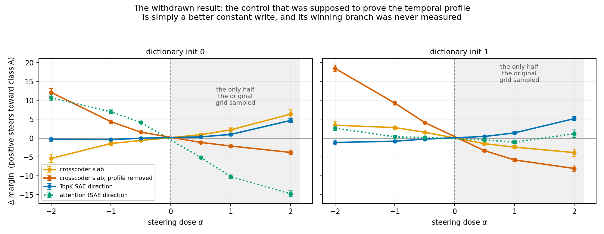

## What this sprint was asked for, and what it produced

Find further tasks where a temporal crosscoder beats a TopK SAE and a tSAE.

**It found three, established what kind of win they are, withdrew the previous sprint's headline,
and produced a screen that ranks candidate tasks before any dictionary is trained.**

Every number below is read from a named file in `results/txc_wins/`. Detail, derivations and the
full audit trail are in `exec_summary_draft.md`; the research log is `log.md`; the literature
catalogue and build checklist are `literature_catalogue.md` and `build_checklist.md`.

## The five findings

### 1. The previous sprint's headline is withdrawn

The order-task result — crosscoder +11.29 against the SAE's +1.24 — was measured on a **one-sided
dose grid**. Rerun at both signs with two dictionary inits, the crosscoder does not beat the SAE
significantly in either. The control that was the proof inverts: `txc_flat`, the crosscoder's own
slab with its temporal profile averaged away, was reported as inverting to −8.02 and in fact
reaches **+12.10 and +18.47** — roughly double the crosscoder itself. A positive-only grid
recorded the negative branch of a signed effect and read a **sign** as an **inversion**.

Two lessons generalise. **A one-sided dose grid cannot distinguish a directional effect from a
magnitude artefact.** And **selecting each arm at its own best dose is not neutral** — it picks
each arm's saturation point, which is where the linear reasoning behind every ratio stops applying.

### 2. The wins are real, and they are discovery rather than expressiveness

On **instruction-position bias**, **evidence order** and a **12-block rotation**, a crosscoder
latent beats every arm a practitioner can build **from the trained dictionary alone** —
`sae_broadcast`, `tsae_broadcast`, `txc_flat`, `txc_profile_random`, `random_slab`,
`random_broadcast` — winning 8 of 9 held-out cells, the exception being the `demo_order` init
already flagged below as the unstable one.

**Hand that same dictionary direction a *supervised* schedule and it beats the crosscoder in 6 of
9 held-out cells** (z up to −20.6). `sae_schedule` is built as `outer(P_dom · v_sae, v_sae)` — the
dictionary's direction on the **difference-of-means** slab, which needs labels and is not
obtainable from the dictionary. **That is the discovery claim measured rather than asserted:** what
the crosscoder supplies is the schedule, and a practitioner who already has one does not need it.

**Both headline tasks survive a held-out content split**, three dictionary inits each: dictionaries
trained on one half of the sentence pools, steering scored on documents built from a disjoint half.
The crosscoder beats every learned per-token arm in every init (z = 9.6 to 30.0, peak-dose). The
margin is somewhat **smaller** held out than corpus-bound — z = 10.3 / 16.3 / 14.9 against 18.0 —
which is what one expects when the dictionary can no longer key on the content it trained on. The
claim that matters is that **the effect survives at all**, on disjoint content, in every init.
That closes the strongest objection a reader could raise.

**What it never beats is the best rank-1 write taken from the metric's own gradient** — z = −32 to
−41 on instruction position, −67 to −73 on evidence, −50 to −59 on demonstration order. So the
claim is **discovery, not expressiveness**: the crosscoder finds, unsupervised and from
reconstruction alone, a write a per-token dictionary could have executed if handed the schedule.
That is worth having because the schedule is what a practitioner lacks — and a published method
now supplies one (Heyman & Vandeputte, arXiv:2605.03907), which the crosscoder loses to.

⚠ **Two rank-1 arms, and only one is a ceiling.** On held-out content the crosscoder **loses to
`rank1_best` in 7 of 9 inits** and loses all three at matched dose on instruction position (3.91 /
4.92 / 4.74 against 4.955). But `rank1_best` is the rank-1 truncation of the **difference-of-means
reference**, near-orthogonal to the gradient (`cos` = 0.02–0.19), so neither beating it nor losing
to it settles anything about rank. **The ceiling is `grad_rank1`**, and the crosscoder loses to
that everywhere by a wide margin.

### 3. One number ranks a task before any dictionary is trained

`c` is the share of a task's optimal write reachable by a **constant** write, measured from
gradients in one backward pass per document with no dictionary involved. Across seven tasks at
identical `n_docs` and gradient budget, **the best achievable classification is 6 of 7 and no
threshold does better** — `rotate6` (0.134, loses) and `evidence` (0.143, wins) are inverted 0.009
apart, and the data locate no boundary between them.

**It must be measured on the metric gradient, not on difference-of-means.** The cheap proxy gives
0.036 for the order task and 0.039 for instruction position — opposite outcomes, near-identical
values — while the gradient separates them 6×. Four independent demonstrations of this divergence.

**`c` has an exact operational meaning, not merely a suggestive one.** For a broadcast write
`W = (1_T ⊗ v)/‖1_T ⊗ v‖`, maximising the first-order effect `⟨W, Ḡ⟩/‖Ḡ‖_F` over **all** `v` gives
exactly `√c`, achieved at `v ∝ mean_t Ḡ` (verified numerically to four decimals). So `√c` is not a
bound on what a per-token dictionary can reach — it is **the reach of the best conceivable
broadcast direction**, whether or not any dictionary contains it. On held-out instruction position
`c` = 0.036, so no constant write of any kind exceeds **19%** of the optimal write's first-order
effect. That is what makes the arm escaping this bound — one direction on a *schedule* — the
honest per-token comparator.

`c` is a **ranking heuristic with a known inversion**, not a rule. It does not establish a
quantitative law: the constant arms are 72–80% *even* in α, so they are largely second-order
artefact, which makes `sae_broadcast` a **mis-specified** baseline rather than a weak one.

### 4. Reconstruction quality does not predict steering quality

Each architecture at its own sweep-derived best recipe, matched at 8.0 realised coefficients per
segment on held-out data. At matched dose the rank inversion is **strict and complete**: FVU orders
attention tSAE (0.0144) < TopK SAE (0.0373) < crosscoder (0.0968), and steering orders them exactly
in reverse, spread **28×**.

**Any benchmark ranking dictionaries by FVU ranks these three backwards** for the use a crosscoder
is proposed for. Two consequences: a benchmark fixing one learning rate across architectures is not
measuring architectures — the three peak at recipes spanning a 10× range — and the **L1 temporal
SAE has no usable sparsity coefficient at all**, with FVU crossing 1.0 before L0 crosses 32,
because `TemporalSAE` has no encoder bias.

### 5. Reading and steering come apart, now on nine tasks

A per-token dictionary reads these factors at `auc_selection` = **1.000** while steering them
worst. This is the most-replicated finding in the project and the one least likely to move.

## What was not achieved

**No expressiveness win, including on a design built specifically to produce one.** The rotation
ladder drives the rank-1 reachable share to 0.177 by construction and the crosscoder still loses to
`grad_rank1` there by z = −31.5. **The geometry was constructed and the headroom went unused** —
which is a finding about the architecture, not a failure of task design.

**Rank ≥ 2 is real and its mechanism is unidentified.** Three candidate mechanisms were proposed
and each refuted by a profile measurement it predicted. The leading direction *is* explained — the
gradient's support is set by where the two classes differ — but the second is not.

## Limits

- **One model, one layer, one dictionary size — and the transfer failure is a failure of
  *discovery*, not of reachability.** In SmolLM2-1.7B a gradient write moves instruction-position
  bias at **every** depth tested (peak Δ +13.32 / +7.83 / +9.00 / +4.50 / +3.74 / +0.98 at layers
  6 / 9 / 12 / 15 / 18 / 21), so the factor is plainly there and plainly reachable. **Every learned
  arm fails to find it**: the crosscoder reaches +1.94 at best and sits below a *random* slab at
  two of six depths (−0.02 against +0.99 at L9; +0.80 against +2.39 at L12). Only Qwen2.5-0.5B is
  genuinely dead (gradient write +0.37).

  That is a worse result for the headline than the version this document carried until now, which
  said no write of any kind moved these models — **that sentence was false for SmolLM2 at all six
  depths.** The capability the headline claims is unsupervised discovery, and this is exactly where
  it fails.

  One caveat against over-reading it: SmolLM2's baseline is **+2.19** and the write pushes it
  further positive, so that arm *amplifies* an existing bias, while Qwen2.5-1.5B's baseline is
  −2.54 and its write is a *reversal*. Amplifying is the easier direction. The bias itself also
  **flips sign** across models.
- **The `c` gate does not transfer across models.** Five of seven transfer cells sit below the
  `c` < 0.1 go-threshold with high `r1` and steer nothing. It was validated within one model and is
  not a cross-model instrument.
- **The discovery claim is an optimisation claim about a *search*, and the obvious explanation
  for it — that the crosscoder simply won the initialisation lottery — is refuted at n = 8.** On
  held-out instruction position, eight dictionary inits per architecture at matched dose:

  | | min | median | max |
  | --- | --- | --- | --- |
  | crosscoder | 2.76 | **4.66** | 4.92 |
  | SAE | −0.06 | 0.18 | **0.59** |

  **The ranges do not overlap.** Eight SAE draws produced nothing within **4.7×** of the
  crosscoder's *worst* draw, and seven of eight crosscoder draws land in 4.57–4.92 while the SAE
  never leaves the noise band. Giving the SAE eight times the tickets does not close a gap of this
  size.

  ⚠ **Provenance: five of the eight files were recovered from run logs, not written by the
  harness.** A stale-variable bug raised `NameError` in the verdict block *after* compute
  completed, so those runs produced no JSON; the steering tables were complete in stdout and were
  parsed back. Arms, doses, SEMs, reading AUCs and baselines are exact; `sparsity`,
  `write_profile` and `rank` are absent because they were never printed. Files carry
  `recovered_from_log: true`.

  Still open: on the order task the crosscoder's selected latent does not hold a stable **sign**
  across inits, and this sweep scales the *init* lottery only.
- **Demonstration order is the unstable cell.** Its held-out peaks span 4.4× across inits (1.93 /
  0.68 / 0.44) and it loses to `sae_broadcast` at one init on the peak-dose convention while
  winning at matched dose. Instruction position and evidence order do not do this; the cell with
  the smallest absolute effects is the one whose verdict moves.
- **The selection lottery was tested, and it substantially qualifies the headline.** Each arm's
  latent was re-chosen by *measured* steering on a dedicated split (shortlist = top-16 by gradient
  alignment ∪ top-16 by reading AUC), then reported on a further split. Held-out instruction
  position, matched dose |α| = 0.5, three inits (`recency_tr_sel_ds{0,1,2}.json`):

  | arm | ds0 | ds1 | ds2 |
  | --- | --- | --- | --- |
  | SAE, reading-selected | +0.10 | +0.29 | +0.06 |
  | SAE, steering-selected | **+1.53** | **+1.75** | **+1.74** |
  | crosscoder | +3.81 | +4.82 | +4.63 |
  | **best possible constant write** (supervised) | **+4.01** | **+4.01** | **+4.01** |

  **The reading selector was costing the SAE 6–30× and the crosscoder nothing** — its reading pick
  ranks 2222 and 3138 of 4096 by gradient alignment (worse than an arbitrary draw), while the
  crosscoder's ranks **1 of 4096** in both inits, so all three selectors choose the same latent.
  The crosscoder still beats the SAE, but the ratio falls from ~26× to **2.7×**.

  ⚠ **The `broadcast_optimal` arm is the qualification that matters.** The best constant write in
  the *whole space* — not the best of 4096 atoms — reaches **+4.01** against the crosscoder's
  +3.81 / +4.82 / +4.63: **a tie in one init (z = −0.7) and z = +2.0 and +2.6 in the others.** The
  crosscoder exceeds the entire broadcast form by 0.95× to 1.20×, at or near the significance
  threshold in every init. Note this arm is built from the metric gradient, so it is a
  **supervised** reference in the same family as `grad_slab` — an unsupervised arm matching it is
  respectable, not a defeat.

  **What it shows is that the constant-write *form* is not what limits per-token dictionaries on
  this task.** The best constant write performs about as well as the crosscoder. What limits the
  SAE is that **its dictionary does not contain the good constant direction** — the best available
  one reaches 43–44% of the best possible one — and the reading selector then gives up most of what
  remains. The same conclusion follows independently from the `sae_schedule` comparison, which
  makes discovery-not-expressiveness a **measured decomposition** rather than an interpretation.

  ⚠ Whether this generalises beyond `recency` is running on `evidence` and is not yet known.

  Note `√c` = 0.185 predicts the best constant write's share and 0.248 was measured — the analytic
  value is a **first-order** ceiling and the matched dose already sits 34% outside it, in the
  direction that favours the broadcast arm.

## Methodology: the name was not the thing

The most transferable output is a pattern, found eight times, each by reading our own code rather
than by a result looking wrong: nominal `k` versus realised L0; training versus held-out sparsity;
a one-sided dose grid; Frobenius versus injected norm; a screen with no baseline field; a registry
name resolving to a different generator; a field called `z` that was peak-dose while the analysis
reported matched-dose; and a figure script indexing signed rather than matched α.

**Every one was a quantity nobody thought needed checking, because it had a name implying it was
already right. None of them errored.** Three were silently disadvantaging the arm we were arguing
*for*, and one was the sole support for a result now withdrawn.

A second pattern appeared late: **a mechanism inferred to explain a discrepancy and asserted before
the files were opened**, three times in the final hour. The resolving check was always to print the
configuration fields next to the number, and it always came last.

A third is the most uncomfortable, because in each case **a real check was run and it passed**. A
rename was verified by confirming the new code reproduced stored values on an existing file — which
exercised the renamed reference and not the two stale ones, so five runs later crashed after
completing their compute. A red-team pass verified every number against its file without verifying
the *convention* those numbers were computed under. A held-out split was verified as disjoint —
16/16, zero overlap — while the task names resolved to a different generator entirely. **In all
three the verification confirmed the property it tested for, and the property that mattered was a
different one.** A passing check reads as reassurance, which makes this failure mode harder to
catch than an unchecked assumption.

**And the sharpest evidence that these are hazards rather than lapses: three people on this sprint
independently made the *same* one.** Reading a steering arm at the signed positive dose rather than
at matched magnitude with the sign free scores any arm whose correct direction is negative as a
failure. It withdrew the previous sprint's headline; it appeared in a figure script written at hour
eight; and it appeared again in the red-team pass over this document, in two of five reported
issues. **A trap that catches the people actively studying it is worth more attention than one that
only catches novices.**

**And it is mechanically detectable, which is the useful half.** Print, beside every reported
number, the **sign of the dose at which each arm's |Δ| is maximal**. If that sign is not constant
across arms, signed-positive indexing is silently comparing arms measured on opposite branches.
Run over the sprint's own files it flags every cell checked — including `order_sym_ds0`, the
withdrawal itself, where `txc_slab` and `sae_broadcast` peak at `+α` while `txc_flat` and
`rank1_best` peak at `−α`. It would have caught all three occurrences before any of them reached a
document.

## Where things live

- Code: `experiments/temporal_screen/txc_wins/` — harness, task designs, Modal runners
- Results: `results/txc_wins/` (81 files), figures in `plots/2026-07-26_txcwins/`
- Next experiments, in priority order: `next_ten_hours.md`
