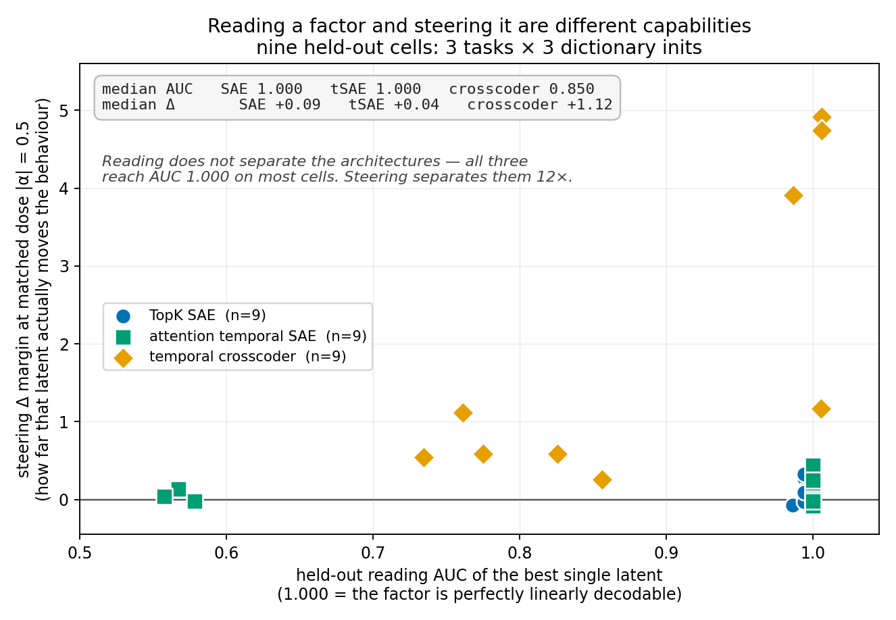
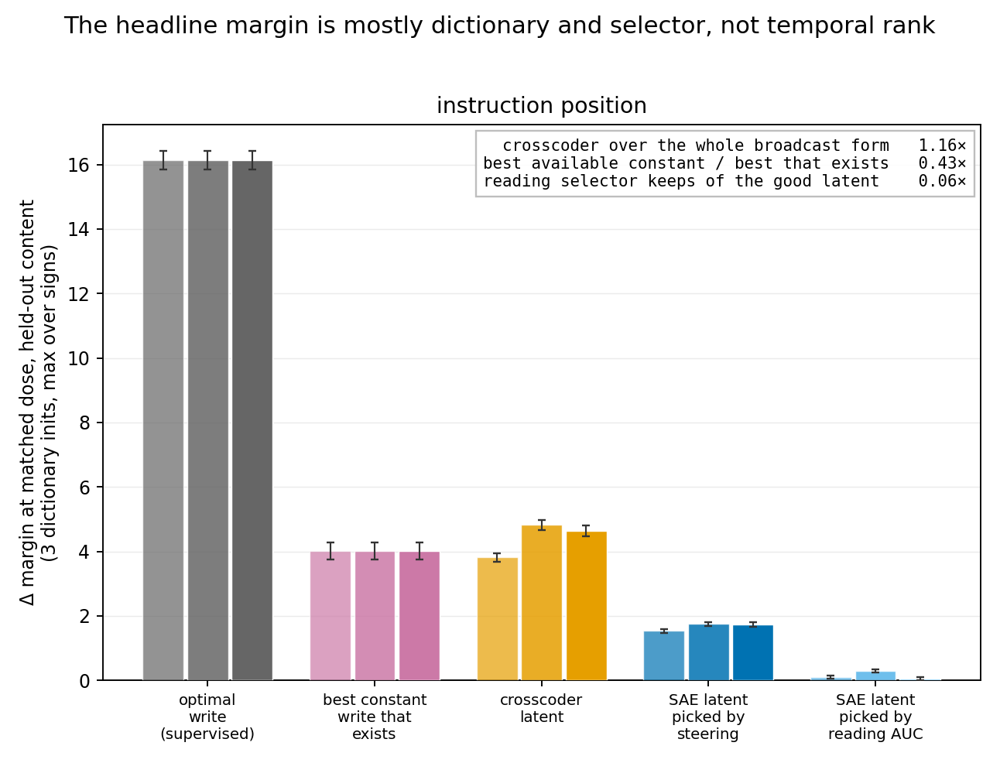

## What this sprint was asked for, and what it produced

Find further tasks where a temporal crosscoder beats a TopK SAE and a tSAE.

**It found three, established what kind of win they are, withdrew the previous sprint's headline,
and produced a screen that ranks candidate tasks before any dictionary is trained.**

Every number below is read from a named file in `results/txc_wins/`. Detail, derivations and the
full audit trail are in `exec_summary_draft.md`; the research log is `log.md`; the literature
catalogue and build checklist are `literature_catalogue.md` and `build_checklist.md`.

## The five findings

### 1. The previous sprint's headline is withdrawn


The order-task result — crosscoder +11.29 against the SAE's +1.24 — was measured on a **one-sided
dose grid**. Rerun at both signs with two dictionary inits, the crosscoder does not beat the SAE
significantly in either. The control that was the proof inverts: `txc_flat`, the crosscoder's own
slab with its temporal profile averaged away, was reported as inverting to −8.02 and in fact
reaches **+12.10 and +18.47** — roughly double the crosscoder itself. A positive-only grid
recorded the negative branch of a signed effect and read a **sign** as an **inversion**.

Two lessons generalise. **A one-sided dose grid cannot distinguish a directional effect from a
magnitude artefact.** And **selecting each arm at its own best dose is not neutral** — it picks
each arm's saturation point, which is where the linear reasoning behind every ratio stops applying.

### 2. The wins are real, and they are discovery rather than expressiveness


On **instruction-position bias**, **evidence order** and a **12-block rotation**, a crosscoder
latent beats every arm a practitioner can build **from the trained dictionary alone** —
`sae_broadcast`, `tsae_broadcast`, `txc_flat`, `txc_profile_random`, `random_slab`,
`random_broadcast` — winning **7 of 9** held-out cells on either dose convention. The exceptions
differ by convention: at peak dose `demo_order` ds1 and ds2; at matched dose `demo_order` ds2 and
**evidence ds1**, where the crosscoder measures +0.545 against `random_broadcast`'s +0.549 — a tie
with a random constant write. Evidence order is therefore not uniformly clean either.

**Hand that same dictionary direction a *supervised* schedule and it beats the crosscoder in 6 of
9 held-out cells** (z up to −20.6). `sae_schedule` is built as `outer(P_dom · v_sae, v_sae)` — the
dictionary's direction on the **difference-of-means** slab, which needs labels and is not
obtainable from the dictionary. **That is the discovery claim measured rather than asserted:** what
the crosscoder supplies is the schedule, and a practitioner who already has one does not need it.

**Both headline tasks survive a held-out content split**, three dictionary inits each: dictionaries
trained on one half of the sentence pools, steering scored on documents built from a disjoint half.
The crosscoder beats every learned per-token arm in every init (z = 9.6 to 30.0, peak-dose). The
margin is somewhat **smaller** held out than corpus-bound — z = 10.3 / 16.3 / 14.9 against 18.0 —
which is what one expects when the dictionary can no longer key on the content it trained on. The
claim that matters is that **the effect survives at all**, on disjoint content, in every init.
That closes the strongest objection a reader could raise.

**What it never beats is the best rank-1 write taken from the metric's own gradient** — z = −32 to
−41 on instruction position, −67 to −73 on evidence, −50 to −59 on demonstration order.

So the claim is **discovery, not expressiveness** — and both halves are now measured separately.
Against arms a practitioner can build from a learned dictionary it wins convincingly and under a
steering-based selector (z = +15 to +18, three inits, held-out). Against the **best constant write
that exists** it is behind on **six of seven tasks**, including two ladders built to make constant
writes bad. **The temporal form is not where the margin comes from.** What the crosscoder supplies
is a write found unsupervised from reconstruction alone that a per-token dictionary could have
executed if handed the schedule — and a published method now supplies exactly that schedule
(Heyman & Vandeputte, arXiv:2605.03907), which the crosscoder loses to.

⚠ **Two rank-1 arms, and only one is a ceiling.** On held-out content the crosscoder **loses to
`rank1_best` in 7 of 9 inits** and loses all three at matched dose on instruction position (3.91 /
4.92 / 4.74 against 4.955). But `rank1_best` is the rank-1 truncation of the **difference-of-means
reference**, near-orthogonal to the gradient (`cos` = 0.02–0.19), so neither beating it nor losing
to it settles anything about rank. **The ceiling is `grad_rank1`**, and the crosscoder loses to
that everywhere by a wide margin.

### 3. One number ranks a task before any dictionary is trained


`c` is the share of a task's optimal write reachable by a **constant** write, measured from
gradients in one backward pass per document with no dictionary involved. Across seven tasks at
identical `n_docs` and gradient budget, **the best achievable classification is 6 of 7 and no
threshold does better** — `rotate6` (0.134, loses) and `evidence` (0.143, wins) are inverted 0.009
apart, and the data locate no boundary between them.

**It must be measured on the metric gradient, not on difference-of-means.** The cheap proxy gives
0.036 for the order task and 0.039 for instruction position — opposite outcomes, near-identical
values — while the gradient separates them 6×. Four independent demonstrations of this divergence.

**`c` has an exact operational meaning, not merely a suggestive one.** For a broadcast write
`W = (1_T ⊗ v)/‖1_T ⊗ v‖`, maximising the first-order effect `⟨W, Ḡ⟩/‖Ḡ‖_F` over **all** `v` gives
exactly `√c`, achieved at `v ∝ mean_t Ḡ` (verified numerically to four decimals). So `√c` is not a
bound on what a per-token dictionary can reach — it is **the reach of the best conceivable
broadcast direction**, whether or not any dictionary contains it. On held-out instruction position `c` = 0.0343
(`recency_tr_ho_ds0`; the 0.0365 reported elsewhere is the corpus-bound run), so no constant write
of any kind exceeds **18.5%** of the optimal write's first-order
effect. That is what makes the arm escaping this bound — one direction on a *schedule* — the
honest per-token comparator.

**What `c` does and does not do, stated once.** It bounds what a *constant* write can reach, and
that bound is confirmed — 4/4 on the four-rung ordering test against `sae_broadcast`/`grad_slab`,
the arm it actually describes, and it retro-predicts eight executed experiments across two sprints.
It is a **ranking heuristic with a known inversion**, not a rule. What it does **not** do is
forecast what a crosscoder achieves; neither does `r1`. **Geometry sets the ceilings, and nothing
measured in this sprint predicts which ceiling gets reached.** It does not establish a
quantitative law: the constant arms are 72–80% *even* in α, so they are largely second-order
artefact, which makes `sae_broadcast` a **mis-specified** baseline rather than a weak one.

**A third axis the screen does not model at all, found post-sprint.** `c` and `r1` both describe
the **mean** optimal write. **Shared-write retention** describes whether the *per-document* optimal
writes agree with each other — and nothing in the framework touches it. Every argument in it ("a
constant write cancels against a contrast", "the mode has nothing to grip") is about what a
constant or rank-1 write can express *on average*. A task can have a perfectly well-shaped average
write that **no single fixed slab reproduces per document**, and a dictionary latent is exactly one
fixed write reused everywhere.

Retrieved-document position is the demonstration: `c` = 0.045–0.069 with `r1` ≈ 0.5 — the best
shape statistics anything has screened, low constant share *and* genuine rank ≥ 2 together, which
no construct in this sprint achieved — and **retention at 1.8–2.1× its noise floor** against
prompt injection's 10–13×. **The screen predicts the right thing about the wrong quantity there.**

Since the two compound, the steerable signal goes roughly as **`baseline × retention`**: ~9.1 for
prompt injection against ~0.17 for retrieved-document position, a 50× gap larger than either
factor alone.

### 4. Reconstruction quality does not predict steering quality


Each architecture at its own sweep-derived best recipe, matched at 8.0 realised coefficients per
segment on held-out data. At matched dose the rank inversion is **strict and complete**: FVU orders
attention tSAE (0.0144) < TopK SAE (0.0373) < crosscoder (0.0968), and steering orders them exactly
in reverse, spread **28×**.

**Any benchmark ranking dictionaries by FVU ranks these three backwards** for the use a crosscoder
is proposed for. Two consequences: a benchmark fixing one learning rate across architectures is not
measuring architectures — the three peak at recipes spanning a 10× range — and the **L1 temporal
SAE has no usable sparsity coefficient at all**, with FVU crossing 1.0 before L0 crosses 32,
because `TemporalSAE` has no encoder bias.

### 5. Reading and steering come apart, now on nine tasks



*Nine held-out cells — three tasks × three dictionary inits — with all three architectures on
content the dictionaries never trained on. Reading is the best single latent's held-out AUC;
steering is that latent's effect at matched dose with the sign free.*

| | median reading AUC | median steering Δ |
| --- | --- | --- |
| TopK SAE | **1.000** | +0.09 |
| attention temporal SAE | **1.000** | +0.04 |
| temporal crosscoder | 0.850 | **+1.12** |

**Reading does not separate the architectures — all three reach AUC 1.000 on most cells. Steering
separates them 12×.** Both per-token architectures decode these factors perfectly and move them by
about a tenth of a nat; the crosscoder decodes them no better and moves them an order of magnitude
further. This is the most-replicated finding in the project and the one least likely to move.

⚠ These cells are **reading-selected**, so by the selection result in Limits they understate every
arm — including the crosscoder. The dissociation is a statement about the latent a reading-based
selector picks, which is what deployed practice picks.

## What was not achieved

**No expressiveness win, and it is now excluded by measurement across seven tasks rather than
inferred from one.** `broadcast_optimal` is the best constant direction in the whole space, so it
bounds what the crosscoder's *temporal form* can buy. Ratio is crosscoder / that ceiling, at
**matched dose, medians across available inits** (`rotate12` and instruction position have three,
the rest one), held-out content where the task has a held-out variant:



| task | `r1` | `c` | ratio | z | txc / optimal |
| --- | --- | --- | --- | --- | --- |
| 12-block rotation | 0.177 | 0.033 | 0.86 | −2.1 | 0.101 |
| 6-block rotation | 0.210 | 0.102 | 0.19 | −19.3 | 0.075 |
| 2-block rotation | 0.304 | 0.163 | 0.09 | −18.6 | 0.054 |
| order (withdrawn headline) | 0.478 | 0.241 | 0.17 | −11.5 | 0.074 |
| phase-11 | 0.562 | 0.050 | 0.39 | −8.0 | 0.061 |
| evidence order | 0.595 | 0.156 | 0.28 | −78.1 | 0.154 |
| **instruction position** | 0.850 | 0.034 | **1.16** | **+2.0** | **0.287** |

**The crosscoder clears the best conceivable constant write on one task of seven — the sprint's own
headline — by 16%, at z = +2.0.** On the other six it loses, at z from −2.1 to −78. That range spans
the sprint's entire design space, `r1` 0.177–0.850 and `c` 0.033–0.241, **including two ladders
built specifically to make constant writes bad**.

**The controlled pair is the sharpest part.** `rotate12` and instruction position have essentially
identical `c` (0.033 vs 0.034) and `r1` differing **4.8×** — and the rank-designed cell is the one
that *loses*.

⚠ **Neither statistic predicts this ratio, and `c` cannot**, because it is inside the ratio's
definition. To first order the best constant write attains `√c·‖Ḡ‖` and the crosscoder attains
`cos(P_txc, Ḡ)·‖Ḡ‖`, so

```text
ratio = cos(P_txc, Ḡ) / √c
```

The correlation of `1/√c` against `c` over these seven `c` values is **−0.937** — a pure algebraic
artefact — while the measured ratio-vs-`c` correlation is **−0.749**. **The measurement is weaker
than the artefact**, so the real across-task variation *attenuates* `c`'s apparent predictive power
rather than creating it. `c` is not the surviving screen on this evidence; it is the denominator.

**Removing it recovers where the variation actually lives.** Alignment `cos(P_txc, Ḡ)` spans
**5.9×** across the seven tasks, and the one the crosscoder wins has the **highest** alignment
(0.214 against a 0.087 median) *and* the **highest** `r1` — the least rank headroom of the seven.
`rotate12`, with near-identical `c` and 4.8× more headroom, loses because its alignment is 1.4×
worse.

**The non-circular statement** (alignment is derived from the ratio, so "the outcome tracks
alignment" would be circular): the outcome **decomposes** into a part knowable before training —
`√c`, pure geometry — and a part not knowable in advance — how well the learned latent happens to
align with the gradient. **All the interesting variation is in the second.**

Instruction position is also the outlier on share of the optimal write: **0.287 against 0.054–0.164
everywhere else**. Whatever makes the headline work is specific to that cell.

⚠ Three qualifiers. `broadcast_optimal` is gradient-derived and **supervised** — no per-token
dictionary reaches that line (the steering-selected SAE gets 0.14–0.43 of it), so this is not "an
SAE beats the crosscoder". **Four of seven cells are one init**, and they are the ones with the most
extreme ratios, so their *ordering* is soft even though all four sit far below 1. And `order` and
the rotations are **ordering mode** while instruction position and evidence are **probe mode** — the
ratio is dimensionless and formed within a run, which is why it shares an axis at all.

**Rank ≥ 2 is real and what supplies the second direction is unidentified.** Three candidate
mechanisms were proposed and each refuted by a profile measurement it predicted. The *leading*
direction is explained — the gradient's support is set by where the two classes differ — but the
second is not. (A separate set of three mechanisms was proposed and withdrawn for a different
question, why discovery fails on SmolLM2; see Limits.)

## Limits

- **One model, one layer, one dictionary size — and the transfer failure is a failure of
  *discovery*, not of reachability.** In SmolLM2-1.7B a gradient write moves instruction-position
  bias at **every** depth tested (peak Δ +13.32 / +7.83 / +9.00 / +4.50 / +3.74 / +0.98 at layers
  6 / 9 / 12 / 15 / 18 / 21), so the factor is plainly there and plainly reachable. **Every learned
  arm fails to find it**: the crosscoder reaches +1.94 at best and sits below a *random* slab at
  two of six depths (−0.02 against +0.99 at L9; +0.80 against +2.39 at L12). Only Qwen2.5-0.5B is
  genuinely dead (gradient write +0.37).

  That is a worse result for the headline than the version this document carried until now, which
  said no write of any kind moved these models — **that sentence was false for SmolLM2 at all six
  depths.** The capability the headline claims is unsupervised discovery, and this is exactly where
  it fails.

  **The obvious confound is closed.** Those transfer runs used one learning rate for all arms at
  2000 steps, against the per-arm 6000-step recipes every headline uses — which finding 4 says is
  not a fair comparison. Rerun at SmolLM2 L6 with per-arm recipes, three inits, the crosscoder gets
  **worse** (+1.01 / +0.92 / +0.88 against +1.94), so the scope limit stands at the correct recipe.

  One caveat against over-reading it: SmolLM2's baseline is **+2.19** and the write pushes it
  further positive, so that arm *amplifies* an existing bias, while Qwen2.5-1.5B's baseline is
  −2.54 and its write is a *reversal*. Amplifying is the easier direction. The bias itself also
  **flips sign** across models.

  **The SmolLM2 failure splits cleanly by which slab an arm is derived from**, three inits at
  per-arm recipes (`recency_smolL6_rec_ds{0,1,2}.json`):

  | derived from `Ḡ` | | derived from `P_dom` | | learned | |
  | --- | --- | --- | --- | --- | --- |
  | `grad_slab` | +13.38 | `dom_slab` | +1.27 | `txc_slab` | +0.88–1.01 |
  | `grad_rank1` | +12.45 | `rank1_best` | +0.93 | `sae_broadcast` | +0.82–1.25 |
  | `broadcast_optimal` | **+3.87** | | | `random_slab` | +1.01 |

  **Its held-out reading AUC is 1.000 in all three inits while it reaches 0.07 of the optimal
  write** — reading the factor perfectly and steering it barely at all.

  ⚠ **The stronger version of that sentence does not survive its own convention.** Against
  `random_slab` the crosscoder loses or ties at **peak** dose (0.92 / 1.01 / 0.88 against 1.01) and
  **beats it in all three inits at matched dose** (against 0.79), because the two arms peak on
  opposite branches — the crosscoder at `α = +0.5`, the random slab at `α = −1.0`. Matched dose is
  this document's primary convention, so **"no better than noise" is withdrawn**; what stands is
  that it reaches a third of what a plain constant write reaches and an eighth of the optimum.

  **`broadcast_optimal` = +3.87 is the number that makes this a discovery failure.** A single
  constant direction, chosen with knowledge of the gradient, works four times better than what the
  crosscoder found unsupervised. So the SmolLM2 negative is not "nothing simple works here".

  **The split is an observation about this cell, and no mechanism is attached to it.** The
  `Ḡ`/`P_dom` ratio is **10.5×** at SmolLM2 L6 against **1.2× corpus-bound and 3.2× held-out** on
  Qwen2.5-1.5B — a clear separation, not an absence. But the tempting reading, that learned
  dictionaries track `P_dom` rather than `Ḡ`, **does not survive the full set**: across 45 cells
  carrying all three arms, `corr(txc_slab, dom_slab)` = +0.78 against `corr(txc_slab, grad_slab)`
  = +0.76, and the two slabs' own effects are **+0.99 correlated**, so the two hypotheses are not
  separable by this route. The largest discrepancies also run the wrong way — on `rotate12`,
  `txc_slab` +18.23 against `dom_slab` +133.60.

  **Normalised against the optimal write, SmolLM2 is a quantitatively worse cell, not a
  mechanistically different one:**

  | share of `grad_slab` | SmolLM2 L6 | Qwen2.5-1.5B L14 |
  | --- | --- | --- |
  | `broadcast_optimal` | 0.29 | 0.25 |
  | `sae_broadcast` | 0.06–0.09 | 0.16–0.18 |
  | `txc_slab` | **0.07–0.08** | **0.24–0.30** |

  The constant-write **ceiling is the same fraction in both models**. What differs is how much of it
  the learned arms reach — roughly 2–4×.

  **Three mechanisms were proposed for this null tonight and all three were withdrawn**:
  `cos(P_dom, Ḡ)` (refuted at 0.0535 against 0.0523 — indistinguishable); dictionary-tracks-`P_dom`
  (refuted by a 45-cell correlation, +0.78 against +0.76 with the two slabs' own effects +0.99
  correlated); and a `cos(v_sae, u₁(·))` account that passed a pre-registered test and was still
  wrong, because it used a stored `random_cos_baseline` field defined as `1/√(T·d)` — correct for
  the *slab* cosine it was written for, wrong for a cosine between unit vectors in `ℝᵈ`, where
  chance is `√(2/πd)`. At the correct baseline the alignment is 1.45× chance rather than 4×, both
  models sit *below* chance against `u₁(P_dom)`, and the arm-level version of the same question —
  `sae_schedule_grad`, the SAE's own direction given the gradient's schedule — has **overlapping**
  ranges across the two models (0.13–0.32 against 0.22–0.44), which the account requires it not to.

  **No mechanism is established.**

- **Discovery appears to transfer to a larger model, on a thin and internally split cell.**
  Qwen2.5-3B-Instruct at L18 (the same 0.50 depth fraction as Qwen2.5-1.5B's L14), **two inits**,
  matched dose: the crosscoder reaches **+34.75 / +33.83** against `grad_slab` +39.20 — **0.886 /
  0.863 of the optimal write**, three times its share on the 1.5B model (0.29) and an order of
  magnitude above SmolLM2 (0.07). It beats `random_slab` (+4.42) in both and matches the
  *supervised* `dom_slab` (+34.19) unsupervised in both, which is the best-supported part.

  ⚠ **The verdict splits between the two inits and splits on convention.** At matched dose it beats
  `sae_broadcast` in both (+15.88, +20.88); at peak dose it **ties in ds1** (+33.83 against +34.10),
  and the stored `win` flag — which is peak-based — is **False** there. So this is *discovery works
  at 3B in one init of two on the win criterion*, not a clean positive. Two inits is thin for a cell
  whose verdict flips between them: it is the unstable cell of the transfer set, as demonstration
  order is of the task set.

  **The negatives are far better replicated than this positive** — 0.5B and SmolLM2 have three inits
  each, `win = False` in all six. So "scale is not the axis" cannot rest on this cell. What it does
  establish is that the two failures are **not** simply evidence that 1.5B is special.

  ⚠ **And the form result holds here too**: `broadcast_optimal` reaches **+41.69**, which is
  **1.063× `grad_slab`** and above the crosscoder in both inits. That is now **seven of eight**
  tasks-and-models where the crosscoder does not exceed the best constant write. (A constant write
  exceeding the full optimal write means this cell sits outside the first-order regime the ratio
  assumes, so the 1.063 should be read as "at least as good", not as a violation.)
- **The `c` gate does not transfer across models.** Five of seven transfer cells sit below the
  `c` < 0.1 go-threshold with high `r1` and steer nothing. It was validated within one model and is
  not a cross-model instrument.
- **The discovery claim is an optimisation claim about a *search*, and the obvious explanation
  for it — that the crosscoder simply won the initialisation lottery — is refuted at n = 8.** On
  held-out instruction position, eight dictionary inits per architecture at matched dose:

  | | min | median | max |
  | --- | --- | --- | --- |
  | crosscoder | 2.76 | **4.66** | 4.92 |
  | SAE | −0.06 | 0.18 | **0.59** |

  **The ranges do not overlap.** The closest SAE draw is still **4.7×** below the
  crosscoder's *worst* draw (0.590 against 2.760), and six of eight crosscoder draws land in 4.57–4.92 while the SAE never
  leaves the noise band. Giving the SAE eight times the tickets does not close a gap of this
  size.

  ⚠ **Provenance: five of the eight files were recovered from run logs, not written by the
  harness.** A stale-variable bug raised `NameError` in the verdict block *after* compute
  completed, so those runs produced no JSON; the steering tables were complete in stdout and were
  parsed back. Arms, doses, SEMs, reading AUCs and baselines are exact; `sparsity`,
  `write_profile` and `rank` are absent because they were never printed. Files carry
  `recovered_from_log: true`.

  Still open: on the order task the crosscoder's selected latent does not hold a stable **sign**
  across inits, and this sweep scales the *init* lottery only.
- **Demonstration order is the unstable cell.** Its held-out peaks span 4.4× across inits (1.93 /
  0.68 / 0.44) and it loses to `sae_broadcast` at one init on the peak-dose convention while
  winning at matched dose. Instruction position and evidence order do not do this; the cell with
  the smallest absolute effects is the one whose verdict moves.
- **The selection lottery was tested, and it substantially qualifies the headline.** Each arm's
  latent was re-chosen by *measured* steering on a dedicated split (shortlist = top-16 by gradient
  alignment ∪ top-16 by reading AUC), then reported on a further split. Held-out instruction
  position, matched dose |α| = 0.5, three inits (`recency_tr_sel_ds{0,1,2}.json`):

  | arm | ds0 | ds1 | ds2 |
  | --- | --- | --- | --- |
  | SAE, reading-selected | +0.10 | +0.29 | +0.06 |
  | SAE, steering-selected | **+1.53** | **+1.75** | **+1.74** |
  | crosscoder | +3.81 | +4.82 | +4.63 |
  | **best possible constant write** (supervised) | **+4.01** | **+4.01** | **+4.01** |

  **The reading selector is badly wrong for both architectures, and which one it penalises more is
  task-dependent.** On instruction position it cost the SAE 6–30× and the crosscoder **nothing** —
  that cell's reading pick is already its best latent, which is why the headline z = +15 to +18 is
  robust to the selector. But that is the exception. On `rotate12` the selector cost the
  **crosscoder** 3.2–3.5× (+3.36 → +10.63) and on `rotate6` **6.5×** (+0.84 → +5.42) — more than it
  cost the SAE in both. Across 13 runs the median reading-pick rank is SAE 1866 and crosscoder 714
  of 4096: the crosscoder is better on average and nowhere near rank 1, and on `rotate2` and
  `rotate6` the SAE's pick is the better of the two.

  So the recommendation is not "select by steering for per-token dictionaries" but **select by
  measured steering for every architecture on every task** — precisely because which arm the
  reading selector hurts more cannot be predicted.

  ⚠ **This makes every reading-selected number in this document a lower bound.** All results
  predating the selection experiment — including the rotation and phase ladders as reported above —
  understate **both** arms, by 1.2× to 12× depending on the cell. The seven-task `broadcast_optimal`
  sweep is unaffected, since it used steering selection for every arm on every cell.

  ⚠ **The `broadcast_optimal` arm is the qualification that matters.** The best constant write in
  the *whole space* — not the best of 4096 atoms — reaches **+4.01** against the crosscoder's
  +3.81 / +4.82 / +4.63: **a tie in one init (z = −0.7) and z = +2.0 and +2.6 in the others.** The
  crosscoder exceeds the entire broadcast form by 0.95× to 1.20×, at or near the significance
  threshold in every init. Note this arm is built from the metric gradient, so it is a
  **supervised** reference in the same family as `grad_slab` — an unsupervised arm matching it is
  respectable, not a defeat.

  **What it shows is that the constant-write *form* is not what limits per-token dictionaries on
  this task.** The best constant write performs about as well as the crosscoder. What limits the
  SAE is that **its dictionary does not contain the good constant direction** — the best available
  one reaches 43–44% of the best possible one — and the reading selector then gives up most of what
  remains. The same conclusion follows independently from the `sae_schedule` comparison, which
  makes discovery-not-expressiveness a **measured decomposition** rather than an interpretation.

  ⚠ Whether this generalises beyond `recency` is running on `evidence` and is not yet known.

  Note `√c` = 0.185 predicts the best constant write's share and 0.248 was measured — the analytic
  value is a **first-order** ceiling and the matched dose already sits 34% outside it, in the
  direction that favours the broadcast arm.

## Post-sprint: the screen on published benchmarks

The sprint's tasks are constructs. **Instruction-position bias is not prompt injection** — it is
two hand-written formatting instructions at the same privilege level, positions swapped, which is
in the behaviour family Wu et al. (ICLR 2025, arXiv:2410.09102) study but is not their task. Their
benchmark is StruQ's, and it is public.

**The screen is training-free and costs about two minutes per task**, which changes the economics
of task selection entirely: screen broadly, spend GPU only where it says go. Two published
benchmarks have been screened so far.

### Prompt injection — StruQ

Qwen2.5-1.5B-Instruct L14, `n_docs` = 200, `n_grad` = 24, filtered run
(`results/txc_wins/geometry_struq_filtered.json`):

| attack | unsteered baseline | `c(Ḡ)` | `r1(Ḡ)` | `c(P_dom)` | `cos(P_dom, Ḡ)` |
| --- | --- | --- | --- | --- | --- |
| naive | +10.01 (z = 24.0) | 0.123 | 0.846 | 0.083 | −0.004 |
| ignore | +11.37 (z = 23.5) | 0.129 | 0.816 | 0.083 | −0.002 |
| `completion_real` | **+19.67** (z = 18.1) | 0.130 | 0.945 | 0.049 | −0.002 |

**The behaviour is strongly present**, and `completion_real` measures ~2× the other two — the
attack ladder orders as StruQ reports it, which is independent evidence the adapter is faithful
rather than merely self-consistent.

**The difference-of-means proxy would have given the opposite screening decision on all three
attacks.** `c(P_dom)` = 0.049–0.083 sits *below* the `c < 0.1` go-threshold while `c(Ḡ)` =
0.123–0.130 sits above it, and `cos(P_dom, Ḡ)` is −0.004 to −0.002 against a 0.0074 random
baseline — orthogonal to within noise. **This is the fifth independent demonstration that the two
slabs are different quantities and the first on a published benchmark rather than one of our own
constructs.**

Four of the 208 items carry an **empty `output`** field, which breaks `cont2` and degrades
`completion_real`'s forged response. Rerun on the filtered 204 moved `c` by at most **0.005** and
changed nothing qualitative; the table above is the filtered run
(`results/txc_wins/geometry_struq_filtered.json`).

⚠ `c` ≈ 0.13 falls inside the band containing the gate's only known inversion (`rotate6` at 0.134
loses, evidence at 0.143 wins), so the screen does not decide this task. **The full arm set is
running as a registered test of the screen itself**, with the prediction that the crosscoder loses
to the best constant write at a ratio of 0.2–0.4, and the explicit alternative that a win there
gives the gate a second inversion and moves the boundary.

Two further observations from that cell. **The SAE reads the injection factor at 0.632** against
the attention tSAE's **0.976** on the same activations — so the factor is readable at this layer
and it is the TopK basis specifically that fails. And the reading/steering dissociation therefore
**does not transfer here**: on prompt injection a per-token dictionary is not reading well and
steering badly, it is failing at both, which changes what a crosscoder win would mean.

### Retrieved-document position — Liu et al

The matched foil **ships with the benchmark**: the same ten documents with the gold document at
positions 0, 4 and 9, verified across all 2655 items — exact multiset match, a single 10-cycle
permutation, Hamming 10/10. Rank = k − cycles = **9, the maximum at k = 10**, on every item, and
the segmentation is one retrieved document per span with no splitting rule to justify
(`results/txc_wins/geometry_litm.json`):

| pair | baseline | z | `c(Ḡ)` | `r1(Ḡ)` | `σ₂²/σ₁²` | retention (× floor) |
| --- | --- | --- | --- | --- | --- | --- |
| gold@0 vs @9 | +1.21 | 4.5 | 0.069 | 0.545 | 0.565 | 0.126 (1.8×) |
| gold@0 vs @4 | +1.20 | 4.8 | 0.068 | **0.489** | **0.741** | 0.150 (2.1×) |
| gold@4 vs @9 | +0.01 | **0.1** | 0.045 | 0.538 | 0.641 | 0.146 (2.1×) |

**The best shape statistics anything has screened** — low `c` *and* genuine rank ≥ 2 together,
which no construct in this sprint achieved — **on a task that may be unsteerable for an unrelated
reason.** See the retention discussion in finding 3.

**Liu's U-shape does not reproduce.** Position 0 beats positions 4 and 9 by an identical amount
while 4 and 9 are **indistinguishable** (z = 0.1). That is monotone **primacy**, not the
beginning-and-end advantage the paper reports, so this is *a primacy task built from Liu's data*
rather than Liu's task. Two readings are available and this run cannot separate them: a 1.5B may
lack the end-recovery Liu measured at GPT-3.5/Claude scale, or teacher-forced
`logP(gold) − logP(distractor)` may not track generated-answer accuracy.

⚠ **`c` = 0.045 on the gold@4-vs-@9 cell is the lowest any published benchmark has screened — on a
cell with no behaviour at all.** Reading geometry before the baseline would have produced a
headline from a null. The baseline-first rule was written for exactly this and this is the first
time it fired.

## Methodology: the name was not the thing

The most transferable output is a pattern, found eight times, each by reading our own code rather
than by a result looking wrong: nominal `k` versus realised L0; training versus held-out sparsity;
a one-sided dose grid; Frobenius versus injected norm; a screen with no baseline field; a registry
name resolving to a different generator; a field called `z` that was peak-dose while the analysis
reported matched-dose; and a figure script indexing signed rather than matched α.

**Every one was a quantity nobody thought needed checking, because it had a name implying it was
already right. None of them errored.** Three were silently disadvantaging the arm we were arguing
*for*, and one was the sole support for a result now withdrawn.

A second pattern appeared late: **a mechanism inferred to explain a discrepancy and asserted before
the files were opened** — six times by the end, of which the last three were caught before
shipping rather than after. **The rate of bad hypotheses did not fall; the discipline changed.**
The most instructive was the last: a pre-registered test with a stated falsifier, which *passed*
and was still wrong, because it measured against a stored `random_cos_baseline` field whose name
matched the quantity and whose definition did not — `1/√(T·d)`, correct for the slab cosine it was
written for, wrong by 2.8× for a cosine in `ℝᵈ`. **A passing pre-registered test is not protection
when the yardstick is borrowed.** The resolving check was always to print the
configuration fields next to the number, and it always came last.

A third is the most uncomfortable, because in each case **a real check was run and it passed**. A
rename was verified by confirming the new code reproduced stored values on an existing file — which
exercised the renamed reference and not the two stale ones, so five runs later crashed after
completing their compute. A red-team pass verified every number against its file without verifying
the *convention* those numbers were computed under. A held-out split was verified as disjoint —
16/16, zero overlap — while the task names resolved to a different generator entirely. **In all
three the verification confirmed the property it tested for, and the property that mattered was a
different one.** A passing check reads as reassurance, which makes this failure mode harder to
catch than an unchecked assumption.

A fourth instance, post-sprint, is the same shape in a *query* rather than a check. A corpus-wide
claim — "the pattern holds across ~71 files" — was computed over the 71 files carrying a
**different field** than the one being claimed about, out of 98 that carry the relevant one.
**The population described was not the population searched**, and the claim it produced (that a
per-token dictionary had never failed to read a factor) was false by six files. The scoped claim
in the document was correct throughout; only the generalisation drawn from it was wrong.

**A third class, mechanical and separate from both**: **derived counts go stale whenever runs land
and nothing recomputes them.** The result-file count was wrong three times in one night (77 → 81 →
114), the detector's cell counts drifted as new runs arrived, and a "wins 8 of 9" tally was correct
when written and 7 of 9 by the time it shipped. None of these is a reasoning error and none would
be caught by checking the reasoning. **A single recompute-derived-counts step before shipping
catches all of them**, and its absence accounted for three of the seven issues in the final review
pass.

**And the sharpest evidence that these are hazards rather than lapses: three people on this sprint
independently made the *same* one.** Reading a steering arm at the signed positive dose rather than
at matched magnitude with the sign free scores any arm whose correct direction is negative as a
failure. It withdrew the previous sprint's headline; it appeared in a figure script written at hour
eight; and it appeared again in the red-team pass over this document, in two of five reported
issues. **A trap that catches the people actively studying it is worth more attention than one that
only catches novices.**

**And it is mechanically detectable — but not in the form first proposed here.** "Flag any cell
where arms peak on different branches" fires on **79 of 86** symmetric-grid cells: almost every cell
has some arm peaking on the minus branch, so it cries wolf and would be ignored. The discriminating
test is whether the **verdict** changes — crosscoder minus best constant arm, read at signed `+α`
against sign-free matched magnitude. That is `scripts/peak_sign_flags.py`, and it gives the number
worth quoting:

> **Twenty-seven of 79 flagged cells — 34% — change verdict on the dose convention alone.**
> Not the effect size. The verdict.

It flags `order_sym_ds0`, the withdrawal cell (+0.57 signed against −3.24 sign-free). **And it flags
two of the three headline cells**: `recency_tr_sel_ds0` at −3.26 against +2.28 and
`recency_tr_sel_ds2` at −3.61 against +2.89, with only ds1 stable.

**So the headline is convention-dependent too.** It survives because the sign-free convention is the
correct one and this sprint established that on independent grounds — but under signed-positive
indexing the headline would have inverted in two inits of three. That makes the withdrawal in
finding 1 not a one-off blunder but **the same trap, catching the result we kept as well as the one
we dropped.**

## Where things live

- Code: `experiments/temporal_screen/txc_wins/` — harness, task designs, Modal runners
- Results: `results/txc_wins/` (114 files), figures in `plots/2026-07-26_txcwins/`
- Next experiments, in priority order: `next_ten_hours.md`
