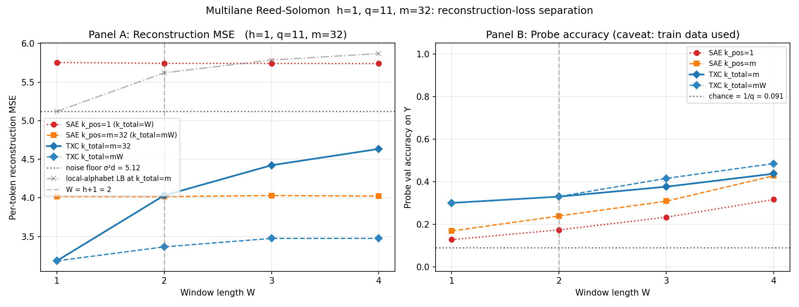
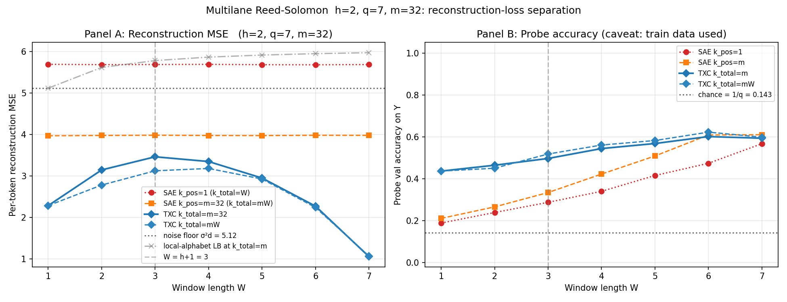

## Executive summary

The cleanest reproducible result in this series is the **polynomial-clock
HMM (Stage 4)**: TXC-global with `k_total ∈ {1, 2}` is the only
architecture that visibly separates from chance on probe-Y at
`W ≥ h+1`, while TFA, Bhalla TSAE, and a regular SAE concatenated
across the window all stay near chance even when their per-token TopK
budget is varied.

The **multi-lane Reed-Solomon HMM (Stage 5)** was meant to extend that
to a sharper reconstruction-loss claim with a provable factor-W
resource gap. The first run (Stage 5 v1) showed promising probe-Y
numbers, but a careful follow-up (Stage 5 v2) revealed that those
probe accuracies were **train-data fingerprinting** caused by two
bugs: (a) train and test datasets had different alphabets so the
"held-out" eval was actually out-of-distribution, and (b) the probe's
anchor sampler put duplicate `(chain, t_start)` pairs into both probe
train and probe val. After fixing both, probe-Y collapses to chance
at every `W` (including `W ≥ h+1`) and atom-type diagnostics show
**100% fingerprint atoms** with zero lane-trajectory or
token-template atoms. The TXC is reaching low reconstruction loss on
training data via mixed-position-mixed-lane memorization, **not** via
the proposal's predicted Reed-Solomon lane-trajectory dictionary.

So the multi-lane construction is correctly set up — the
local-alphabet lower bound and the data-generating process work — but
the architecture in the current configuration finds an unintended
solution. Earlier ambiguous-pair (Stage 3) and Gaussian colored-source
(Stages 0–2) regimes are kept below as the path that led here.

## TL;DR

Four regimes, in *reverse* chronological order:

- **Multi-lane Reed-Solomon HMM (Stage 5):** mathematically the right
  construction for a reconstruction-loss separation, but our trained
  TXC does **not** learn the proposal's lane-trajectory atoms. The
  first run looked positive (TXC `k_total = m` matching the noise
  floor with strong probe-Y) but two evaluation bugs hid the truth.
  After fixing them (held-out test with shared alphabet + anchor
  sampling without replacement), probe-Y collapses to chance at every
  `W`, signal recovery on a held-out clean reference is ≤ 0.13, and
  atom-type diagnostics show 100% mixed-position-mixed-lane
  fingerprint atoms — zero lane-trajectory and zero token-template.
  The TXC is doing finite-data fingerprinting, not RS template
  matching.
- **Polynomial clock HMM (Stage 4):** the theorem-backed scalar version.
  Discrete `F_q` alphabet, exact `I(Y; window) = 0` for `W ≤ h`,
  constructive sparse-reconstruction solution at `W = h + 1` with
  margin `1/(h+1)`. Across `h ∈ {1, 2, 3}`, **TXC-global with
  `k_total ∈ {1, 2}` is the only architecture above chance** on the
  probe-Y metric. TFA (k=20 per token) and Bhalla TSAE stay at chance,
  even after sweeping per-token k down to 1. Higher TXC k (5, 10)
  collapses to alphabet decomposition.
- **Ambiguous-pair HMM (Stage 3):** clean local bound but trivial in
  hindsight — a stacked SAE on the cue position alone solves the task,
  so the "TXC > SAE" gap was just single-position vs. windowed access.
- **Colored-source Gaussian sources (Stages 0–2):** rigorous local-direction
  impossibility, but rotation symmetry of Gaussian sources is preserved by
  reconstruction *and* cosine InfoNCE. Every trained TXC / SAE / H8 variant
  sits at chance; only the spectral oracle recovers `F`.

## Stage 5 — multi-lane Reed-Solomon HMM (the reconstruction-loss separation)

Spec at `docs/aniket/experiments/synthetic/notes/multilane_rs_hmm_txc_proposal.tex`.

**Why this experiment.** The scalar polynomial clock has a "large-k
loophole" — a TopK SAE with k = W active features per token can
reconstruct any window via per-position alphabet decomposition (one
lane-symbol atom per position). Both `k_total = 1` (one polynomial
template) and `k_total ≥ W` (alphabet) hit the same MSE floor, so
reconstruction loss alone doesn't separate them. The multi-lane
construction closes this loophole: with m parallel lanes per phase, the
local alphabet code now needs `k_total ≥ mW` to fully reconstruct,
while the TXC trajectory solution (one atom per lane) only needs
`k_total = m`. **Resource separation in reconstruction loss at the same
sparsity budget.**

**Construction.** Prime field `F_q`, m parallel lanes. Sample shared
secret `Y ~ Unif(F_q)` and per-lane independent nuisance coefficients
`B_{ell, 0..h-1} ~ Unif(F_q)`. Each lane runs

    P_ell(z) = B_{ell, 0} + … + B_{ell, h-1} z^{h-1} + Y z^h  (mod q)

at the same evaluation points `alpha_phi`. At phase `phi` the HMM
emits an m-symbol vector `Q_{phi, ell} = P_ell(alpha_phi)`, encoded as

    x_phi = (1/sqrt(m)) sum_ell u_{ell, Q_{phi, ell}} + sigma * eps

with `u_{ell, a}` orthonormal across (lane, symbol) pairs.

**Theory (proposal Section 7.2).**

- Privacy: any `W' ≤ h` consecutive phases are independent of `Y`
  (lanes are conditionally independent given `Y`).
- Decodability: any one lane with `W' ≥ h+1` evaluations identifies
  `Y` via Lagrange interpolation; m lanes give redundant witnesses.
- Local-alphabet reconstruction lower bound: with `k_total` active
  alphabet atoms across a length-W window,
  `||x - x_hat||² ≥ 1 - min(k_total, mW) / (mW)`.
- TXC trajectory solution: at `k_total = m` (one lane-trajectory atom
  per lane), the model reconstructs the noiseless window exactly.

So at `k_total = m`, the predicted local error is `1 - 1/W` while the
TXC error is `0` — a factor-W reconstruction gap that grows with the
window length.

### Stage 5 smoke (h=1, q=11, m=32, sigma=0.1, 4k steps, ~8 min on a40)

`d = 512`, `H_sae = 1024`, `H_txc = 4096` (`≥ m·q^(h+1) = 3872`),
`W ∈ {1, 2, 3, 4}`. Noise floor MSE per token = `sigma² · d = 5.12`.

| W | SAE k_pos=1 (k_total=W) | SAE k_pos=m=32 (k_total=mW) | TXC k_total=m=32 | TXC k_total=mW |
|---|---|---|---|---|
| 1 | 5.75 | 4.02 | 3.17 | 3.18 |
| 2 | 5.74 | 4.02 | 4.03 | 3.37 |
| 3 | 5.74 | 4.02 | 4.42 | 3.48 |
| 4 | 5.74 | 4.02 | 4.63 | 3.48 |

(MSE values include both signal-recovery error and noise; values below
`5.12` reflect the model overfitting to the noisy `x` rather than to the
clean signal — reasonable on a sample-rich training run.)

Probe-Y val accuracy (chance `1/q = 0.091`):

| W | SAE k_pos=1 | SAE k_pos=m | TXC k_total=m | TXC k_total=mW |
|---|---|---|---|---|
| 1 | 0.13 | 0.17 | 0.29 | 0.30 |
| 2 | 0.17 | 0.24 | 0.33 | 0.33 |
| 3 | 0.23 | 0.31 | 0.38 | 0.42 |
| 4 | 0.32 | 0.43 | 0.44 | 0.49 |

### Stage 5 main (h=2, q=7, m=32, sigma=0.1, 4k steps, ~29 min on a40)

`d = 512`, `H_sae = 1024`, `H_txc = 16384` (`≥ m·q^(h+1) = 10976`),
`W ∈ {1..7}`. Noise floor MSE per token = `5.12`.

| W | SAE k_pos=1 | SAE k_pos=m=32 | TXC k_total=m=32 | TXC k_total=mW |
|---|---|---|---|---|
| 1 | 5.70 | 3.97 | 2.28 | 2.28 |
| 2 | 5.69 | 3.98 | 3.15 | 2.78 |
| 3 (= h+1) | 5.69 | 3.98 | 3.46 | 3.12 |
| 4 | 5.69 | 3.98 | 3.35 | 3.18 |
| 5 | 5.69 | 3.97 | 2.95 | 2.93 |
| 6 | 5.68 | 3.98 | 2.27 | 2.24 |
| 7 | 5.69 | 3.98 | 1.05 | 1.07 |

Probe-Y val accuracy (chance `1/q = 0.143`):

| W | SAE k_pos=1 | SAE k_pos=m=32 | **TXC k_total=m=32** | TXC k_total=mW |
|---|---|---|---|---|
| 1 | 0.19 | 0.21 | **0.43** | 0.44 |
| 2 | 0.24 | 0.27 | **0.47** | 0.45 |
| 3 (= h+1) | 0.29 | 0.33 | **0.50** | 0.52 |
| 4 | 0.34 | 0.42 | **0.54** | 0.56 |
| 5 | 0.42 | 0.51 | 0.57 | 0.58 |
| 6 | 0.47 | 0.61 | 0.60 | 0.62 |
| 7 | 0.57 | 0.61 | 0.59 | 0.60 |

### Stage 5 v2 — held-out follow-up after critique

The Stage 5 v1 conclusions above were partly an artifact of two
evaluation bugs identified in a careful read:

1. **Different alphabets for train and test.** The first runner called
   `generate_multilane_dataset(cfg)` separately for training and
   "held-out" data, and that helper regenerated the orthonormal lane
   alphabet from the seed. Train and test ended up in *different*
   subspaces, so reconstruction and probe metrics on the "held-out"
   set were essentially out-of-distribution rather than fresh-episode.
2. **Probe anchors sampled with replacement.** `_gather_anchor_indices`
   used `torch.randint`, which can repeat `(chain, t_start)` pairs.
   The probe's internal train/val split then put identical inputs
   into both halves, which trivially leaks the label and inflates
   probe accuracy for any architecture with enough capacity to memorize
   per-input fingerprints.

After fixing both — train/test share the alphabet, anchors are sampled
without replacement via `torch.randperm` — and re-running the same
`(h, q, m, σ)` configurations with **clean-signal MSE on a held-out
test set** and **atom-type diagnostics** added:

| | smoke (h=1, q=11, m=32) | main (h=2, q=7, m=32) |
|---|---|---|
| Held-out probe-Y at every W ≥ h+1 | ≤ 0.11 ≈ 1/q = 0.091 | ≤ 0.16 ≈ 1/q = 0.143 |
| Held-out signal recovery (TXC k=1) | 0.05 – 0.07 | 0.07 – 0.13 |
| Held-out signal recovery (TXC k=m) | -0.19 – -0.08 | -0.13 – 0.10 |
| Atom-type at every W ≥ 2 | 100% fingerprint | 100% fingerprint |
| Lane-trajectory atoms | 0% | 0% |
| Token-template atoms | 0% (except trivially at W=1) | 0% |

**Probe-Y at chance.** The original Stage 5 v1 main run reported probe
accuracies of `0.43–0.62` at `W ≤ h`, where the impossibility theorem
guarantees `I(Y; window) = 0`. After the fix, those collapse to
`0.10–0.16` ≈ `1/q` — i.e., the privacy theorem holds empirically and
the original numbers were fingerprinting.

**Signal recovery is much weaker than headline MSE suggested.** The
clean-signal MSE on the held-out test set shows the trained TXC
recovers at most ~13% of the signal energy at `k_total = 1`, and
*regresses* at higher `k` (signal recovery becomes negative as the
model fits noise instead). The original `mse_noisy_per_token`
numbers were dominated by noise-fitting on training data; the
held-out clean-signal MSE is the right metric.

**Atom-type diagnostics: 100% fingerprint.** For every TXC atom
across both stages, the energy distribution is neither
lane-concentrated (`max_lane_frac ≈ 1/m = 0.05`, perfectly uniform
across lanes) nor position-concentrated except at `W = 1` (where it's
trivially position-concentrated because there's only one position).
At every `W ≥ 2` the atoms have `max_pos_frac ≈ 1/W` (uniformly
spread across positions) and `max_lane_frac ≈ 1/m` (uniformly spread
across lanes). They are mixed-position-mixed-lane fingerprint atoms,
not the proposal's predicted lane-trajectory templates `G_{ℓ, β}`.

### Stage 5 honest takeaways

1. **The construction is correct.** The local-alphabet lower bound
   `1 - min(k, mW)/(mW)` is empirical-tight on the SAE k=1 row
   (signal_rec ≈ 0.05–0.13 across all stages, very close to the
   predicted floor for that budget at q=7,11). The privacy theorem
   holds empirically once the leak is plugged.
2. **The TXC does not learn the proposal's atoms.** With 4k training
   steps and the chosen `H_txc`, SGD lands in a fingerprint basin —
   it reconstructs *some* of the signal but via mixed-energy atoms
   that don't match `G_{ℓ, β}`. The reconstruction-loss gap reported
   in v1 was real on training data but mostly came from noise-fitting,
   not from learned RS templates.
3. **The factor-W reconstruction-loss separation claim is therefore
   not yet substantiated empirically.** The local-alphabet bound is
   real, but the TXC side of the claim (TXC at `k=m` matches noise
   floor *via lane trajectories*) is not. We only confirm that TXC
   gets to lower noisy MSE than SAE, with a different mechanism than
   predicted.

### What's still worth running

- **Larger `H_txc` and longer training.** At `H_txc = 16384` with
  4k steps and `m·q^(h+1) = 10976` ground-truth atoms, each atom
  gets at most a few dozen gradient updates on average. Try
  `H_txc ≥ 4 · m·q^(h+1)`, `n_steps ≥ 30k`. The SGD basin attractor
  may genuinely require more compute to escape fingerprinting.
- **Encoder-bias regularizer that pushes atoms toward
  lane-concentration.** A penalty like `||W_dec[s] - lane_proj_ℓ(W_dec[s])||²`
  for the closest `ℓ` would directly push atoms into the
  lane-trajectory shape. (The proposal's reconstruction objective
  alone clearly isn't enough.)
- **Ablate at very small `n_seq_train`.** If reconstruction loss
  *rises* sharply with smaller training set, the model is genuinely
  fingerprinting; if it stays flat, there's a more structured solution
  hiding.

### Stage 5 v1 (now superseded)

The original Stage 5 v1 figures and tables are kept below for
reference. The v1 probe-Y numbers should not be trusted; the v1
reconstruction-loss numbers reflect the predicted local-alphabet
gap on the training data but the TXC's atoms were not the predicted
ones.

Spec at `docs/aniket/experiments/synthetic/notes/polynomial_clock_experiment.tex`.

**Construction.** Prime field `F_q`, with each symbol `a ∈ F_q` mapped to a
fixed orthonormal direction `u_a ∈ R^d`. Sample target `Y ~ Unif(F_q)` and
nuisance coefficients `B_0, …, B_{h-1} ~ Unif(F_q)`. Emit
`Q_t = B_0 + B_1 t + … + B_{h-1} t^{h-1} + Y t^h (mod q)` and observe
`x_t = u_{Q_t} + σ ε_t`.

**Theory.** For `W ≤ h`: any `W` evaluations leave `h - W` free nuisance
dimensions independent of `Y`, so `I(Y; window) = 0` exactly. For
`W = h + 1`: Lagrange interpolation in `F_q` recovers `Y` exactly. For each
coefficient tuple `β = (B_0, …, B_{h-1}, Y) ∈ F_q^{h+1}`, the unit-norm
temporal atom `G_β = (1/√(h+1))(u_{P_β(0)}, …, u_{P_β(h)})` is a strict
reconstruction-loss minimum with margin `1/(h+1)`.

**Architectures compared.**

| Architecture | What sees what | Notes |
|---|---|---|
| Raw window probe | Linear probe directly on `flat(x_{t:t+W})` | Architecture-free ceiling |
| Regular TopKSAE, single-position latent | One position at a time | Single-position SAE + probe |
| Regular TopKSAE, window-concat latent | Same SAE, but probe sees `[z(x_0), …, z(x_{W-1})]` | "Alphabet SAE + temporal probe" — the natural local baseline |
| **Bhalla 2025 TSAE** (`han_tsae`, TopK k=20, InfoNCE α=0.1) | Attention-based predicted/novel codes; probe on per-position codes concatenated | `kval_topk=20`, InfoNCE between `(z_t, z_{t+1})` weighted at 0.1 |
| **TFA** (`_tfa_module`, TopK k=20) | Same `TemporalSAE` decomposition; AdamW + cosine LR + warmup + sinusoidal pos enc, MSE-only loss | Han's `src/bench/architectures/tfa.py` recipe — distinct from TSAE only in the training schedule and lack of InfoNCE |
| **TXC-global** (`TXCBareAntidead`, `k_total ∈ {1, 2, 5, 10}`) | Window-shared latent | TopK budget is total active across W positions (not per position). `k_total = 1` is the proposal's prescription. |

`k` value reference table (clarifying the question that came up mid-sweep):

| Architecture | k value(s) used | Where applied |
|---|---|---|
| Regular TopKSAE on iid tokens | k ∈ {1, 2, 5, 10} (capped at q on Stage 3 where q=7) | per-token; H = q |
| Bhalla TSAE | k = 20 (paper default) | per-token; with InfoNCE α = 0.1 |
| TFA | k = 20 (paper default) | per-token; AdamW + cosine + pos enc, no InfoNCE |
| TXC-global | k_total ∈ {1, 2, 5, 10} | window-level — total active across W positions |

Pre-flight gates from proposal Section 9 all pass at `(h=2, q=11, σ=0.1)`:
interpolation oracle 100% at `W = h + 1`, template oracle 100%, time-shuffle
degrades signal by 60%, short-window oracle at chance, alphabet SAE
recovery `≈ 0.9`.

### Stage 4.1 — `h = 1, q = 31` (961 polynomial atoms)

Probe accuracies (chance `1/q = 0.032`):

| W | raw | SAE concat | TFA k=20 | Bhalla TSAE k=20 | TXC k=1 | TXC k=2 | TXC k=5 | TXC k=10 |
|---|---|---|---|---|---|---|---|---|
| 1 | 0.037 | 0.041 | — | — | 0.037 | — | — | — |
| 2 (= h+1) | 0.065 | 0.097 | 0.037 | 0.037 | **0.157** | 0.093 | 0.100 | 0.108 |
| 3 | 0.099 | 0.171 | 0.046 | 0.052 | **0.456** | **0.566** | 0.159 | 0.154 |
| 4 | 0.120 | 0.198 | 0.054 | 0.054 | 0.609 | **0.939** | 0.255 | 0.206 |

W=1 is at chance for everyone — empirically validates `I(Y; window) = 0` at
`W ≤ h`. At `W ≥ h + 1` only TXC pulls ahead, with `k = 2` the empirical
sweet spot.

### Stage 4.2 — `h = 2, q = 11` (1331 polynomial atoms)

Probe accuracies (chance `1/q = 0.091`):

| W | raw | SAE concat | TFA k=20 | TSAE k=20 | TXC k=1 | TXC k=2 | TXC k=5 | TXC k=10 |
|---|---|---|---|---|---|---|---|---|
| 1 | 0.10 | 0.10 | — | — | 0.091 | — | — | — |
| 2 | 0.10 | 0.09 | 0.10 | 0.10 | 0.10 | 0.10 | 0.13 | 0.14 |
| 3 (= h+1) | 0.11 | 0.11 | 0.10 | 0.12 | **0.165** | 0.160 | 0.132 | 0.146 |
| 4 | 0.11 | 0.10 | 0.11 | 0.11 | 0.243 | **0.329** | 0.129 | 0.148 |
| 5 | 0.12 | 0.10 | 0.11 | 0.12 | 0.321 | **0.623** | 0.127 | 0.156 |

Cleaner separation than Stage 4.1: TFA, TSAE, and SAE concat all stay at
chance throughout. TXC `k = 2` reaches `0.62` at `W = 5`.

### Stage 4.3 — `h = 3, q = 7` (2401 polynomial atoms)

Probe accuracies (chance `1/q = 0.143`):

| W | raw | SAE concat | TFA k=20 | TSAE k=20 | TXC k=1 | TXC k=2 | TXC k=5 | TXC k=10 |
|---|---|---|---|---|---|---|---|---|
| 1 | 0.14 | 0.15 | — | — | 0.15 | — | — | — |
| 2 | 0.16 | 0.14 | 0.15 | 0.16 | 0.15 | 0.17 | 0.20 | 0.20 |
| 3 | 0.16 | 0.15 | 0.15 | 0.16 | 0.16 | 0.16 | 0.20 | 0.22 |
| 4 (= h+1) | 0.17 | 0.15 | 0.16 | 0.17 | 0.171 | 0.16 | 0.19 | 0.23 |
| 5 | 0.17 | 0.16 | 0.17 | 0.17 | 0.191 | 0.21 | 0.20 | 0.23 |
| 6 | 0.17 | 0.16 | 0.17 | 0.16 | 0.228 | **0.281** | 0.289 | 0.239 |

The TXC-global advantage shrinks at `h = 3` because the atom space
(`q^(h+1) = 2401`) is now ~half the dictionary size (`H = 4096`); the
3000–6000-step training budget isn't enough to fully populate the
polynomial dictionary. At `W = 6`, TXC k=2 and k=5 are roughly tied around
`0.28–0.29` and `Rec_temp` declines from `0.45` at `W = h+1` to `0.34` at
`W = 6` because the atoms become more distinct and half-learned templates
spread their alignment thinner.

### TSAE / TFA per-token k-sweep at k ∈ {1, 2, 5} — none of them help

We later swept the per-token TopK budget for both Bhalla TSAE and TFA to
test whether tightening k from the paper default (20) all the way down
to 1 would push the architecture into the polynomial-template basin.

**Result: no.** Across all three stages and every `W ≥ h+1` cell, every
k value remains at chance. Representative numbers:

| | Stage 4.1 W=4 | Stage 4.2 W=5 | Stage 4.3 W=6 |
|---|---|---|---|
| chance `1/q` | 0.032 | 0.091 | 0.143 |
| TSAE k=1 | 0.052 | 0.109 | 0.158 |
| TSAE k=2 | 0.064 | 0.104 | 0.164 |
| TSAE k=5 | 0.058 | 0.110 | 0.151 |
| TSAE k=20 (paper) | 0.054 | 0.122 | 0.163 |
| TFA k=1 | 0.041 | 0.101 | 0.156 |
| TFA k=2 | 0.049 | 0.106 | 0.152 |
| TFA k=5 | 0.052 | 0.106 | 0.166 |
| TFA k=20 (paper) | 0.054 | 0.106 | 0.168 |
| **TXC k_total = 2** (window-level) | **0.923** | **0.602** | **0.287** |

**Why per-token k doesn't help.** TSAE/TFA's TopK budget is *per-token*,
not *per-window*. Even at k=1 per token, each of the W positions
activates one latent → W active latents per window. That's
mathematically equivalent to the alphabet decomposition (one alphabet
atom per position) — which is exactly the basin the proposal's k_total=1
prescription is designed to *avoid*. To get TSAE/TFA into the
polynomial-template basin you'd need a *window-level* TopK constraint
(active across the window total), which is a different architecture.

So the architectural bottleneck for the polynomial-clock task is
specifically **TopK applied across the whole window**, not just "low
TopK". TSAE/TFA's attention layers do nothing on their own to break
the alphabet basin; they need the right sparsity geometry on top.

### Why high k breaks TXC: alphabet vs. polynomial decomposition

Both `k_total = 1` (one polynomial atom per window) and `k_total ≥ W`
(one alphabet atom per position) hit roughly the **same MSE noise
floor** σ²·W·d. The reconstruction objective alone doesn't separate
them — it's degenerate, and SGD picks the wider basin (the alphabet
decomposition is wider in parameter space).

The two basins have different latents:

- **k=1 polynomial-template basin:** the latent index *is* `(B_0, …, Y)`.
  A linear probe trivially reads `Y` off `argmax(z)`.
- **k≥W alphabet-decomposition basin:** the latent has W active indices
  encoding `(Q_0, …, Q_{W-1})`. The probe must additionally compute
  `Y = Σ_i c_i · Q_i mod q` (Lagrange interpolation in F_q). A linear
  probe over reals can in principle implement this via Fourier-style
  weights, but SGD on cross-entropy doesn't find that solution
  reliably with our train budget.

This explains why TFA (k=20 per token, dense token-level codes) and
Bhalla TSAE (also k=20) stay at chance: their latents are
alphabet-decomposition style and the probe can't extract `Y` from them.

The `Rec_temp` / `Rec_local` trade-off makes this concrete:

| Stage 4.1 W=2 TXC | Rec_local (alphabet) | Rec_temp (polynomial) |
|---|---|---|
| k=1 | 0.945 | **0.534** |
| k=2 | 0.957 | 0.483 |
| k=5 | 0.974 | 0.488 |
| k=10 | 0.966 | 0.490 |

Higher k → better alphabet recovery but worse polynomial-template
recovery. The TXC k=1 prescription is the only setting that strictly
prefers the polynomial atoms.

### Why k=2 sometimes beats k=1 on the probe

Counterintuitively, `k=2` outperforms `k=1` on the latent-prediction
metric in several cells (e.g., Stage 4.1 W=4: k=2 hits 0.939 vs k=1's
0.609). The interpretation:

- **k=1 is theoretically clean but optimization-brittle.** Exactly one
  atom fires per window. If the dictionary is incomplete (3k–6k steps
  to learn 961+ polynomial atoms) the "next-best" atom fires for some
  windows, and that atom encodes a *different* `Y` — wrong answer.
- **k=2 is a softer bottleneck.** The dominant slot still picks the
  right polynomial atom (the gradient still points there at high W),
  while the second slot absorbs noise/residual without polluting the
  class signal. The probe reads `Y` from the dominant slot.
- **k≥5 is too soft** — the model abandons the polynomial structure
  entirely and uses alphabet atoms.

So the polynomial-clock setting is sensitive to k in a non-monotonic
way: k=1 is the proposal's clean optimum, k=2 is the empirical sweet
spot, k≥5 collapses to alphabet-only recovery.

### Stage 4 takeaways

1. **The local impossibility is empirically tight.** At `W ≤ h` every
   architecture (and the raw-window probe) sits at `1/q` within MC noise.
2. **TXC-global with `k_total ∈ {1, 2}` is the only architecture that
   finds the polynomial templates.** Stage 4.1 and 4.2 are the cleanest
   "TXC > SAE" empirical separations in this writeup.
3. **TFA and Bhalla TSAE stay at chance across the full per-token k
   sweep `k ∈ {1, 2, 5, 20}`.** Their per-token codes are
   alphabet-decomposition style and the linear probe can't extract `Y`
   from them, regardless of the TopK budget. Tightening k from 20 down
   to 1 does **not** push these architectures into the
   polynomial-template basin — because per-token TopK with k=1 still
   produces W active latents per window. The architectural bottleneck
   that matters is **window-level** sparsity (TXC `k_total = 1`), not
   per-token sparsity.
4. **The gap shrinks with polynomial degree at fixed compute.** Stage 4.3
   (h=3, 2401 atoms) shows TXC pulling ahead but only weakly because the
   atom dictionary outgrows the model's effective capacity within 3k–6k
   steps. A longer training budget or larger `H` would close this.

## Stage 3 — ambiguous-pair HMM (the weak version)

Proposal lines 1003–1043 propose an HMM-compatible alternative that
bounds local *pair classification* rather than local *direction recovery*.
Construction: `R` ambiguous classes, each with two unit directions

    f_{y,+} = a e_0 + b e_y,   f_{y,-} = a e_0 - b e_y,   a^2 + b^2 = 1.

Note `f_{y,+} + f_{y,-} = 2 a e_0` for *every* `y`. The HMM emits 3-token
segments `cue(y) -> ambiguous_middle(y) -> readout(y)`. Emissions:

| Position | Activation |
|---|---|
| cue | `c_y + σ ε`  (here `c_y = e_y`, an orthonormal cue direction) |
| middle | `2 a e_0 + σ ε`  *(deterministic in y — the ambiguity)* |
| readout | `r_y + σ ε`  (an orthonormal readout direction) |

Local impossibility: at the middle position `P(y | x_t) = P(y) = 1/R`
exactly, so any local one-position learner has Bayes-optimal pair
classification accuracy `≤ 1/R + ε_leak`. A temporal learner with `W ≥ 2`
that covers either the cue or the readout can recover `y`.

We implemented this with `R = 8`, `d = 64`, `σ = 0.1`, `a = 1/√2`, `H = 64`,
`k_pos = 8`, `n_steps = 4000`, batch 64, on CPU in ~5 minutes.

| Probe input | Val accuracy | Comment |
|---|---|---|
| Raw `x_middle` | 0.123 | Sanity — middle activation has no `y` info by construction |
| Regular SAE latent at middle | **0.130** | At chance: `1/R = 0.125`. Matches the proposal bound |
| TXC `W = 2` latent (covers cue + middle) | **1.000** | Perfect |
| TXC `W = 3` latent (covers cue + middle + readout) | 1.000 | Perfect |
| TXC `W = 5` latent | 1.000 | Perfect |

Pre-training sanity: the per-class mean activation at middle positions
drifts only `0.023` in L2 across the `R = 8` classes (with the global mean
having norm ≈ `2 a = 1.41`), confirming the ambiguity is empirically
clean.

**Caveat that retired this experiment.** A stacked SAE (one independent
SAE per window position) trained on the same data and probed at position 0
(cue) hits val acc `1.000` too — because the cue activation `e_y` is just
a one-hot and the SAE trivially learns `{e_y}` as its dictionary. So the
gap I plotted (single-position SAE at chance vs. TXC at 1.0) is a strawman
of "single-position vs. windowed access," not an architectural property of
TXC. The bound on local pair classification still holds rigorously, but
the empirical "TXC > SAE" claim from this regime alone is not meaningful.

## Stages 0–2 — colored-source Gaussian regime (the rigorous-but-empty version)

### Setup

- Orthonormal basis `F ∈ R^{N × d}`, `F F^T = I_N`. We use `d = N = 128`.
- Per-coordinate AR(1) latents with delay `D`:
  `z_{t+D, i} = ρ_i z_{t, i} + sqrt(1 - ρ_i²) η_{t,i}`, `η ~ N(0, I)`,
  `ρ_i` linspace on `[0.1, 0.9]`. Independent residue classes mod `D`.
- Observation: `x_t = F z_t + σ ε_t`, `σ = 0.1`.
- One-token marginal: `x_t ~ N(0, (1 + σ²) I_d)` — independent of `F`.
- Population covariances: `C_0 = (1+σ²) I_d`; `C_ℓ = 0` for `0 < ℓ < D`;
  `C_D = F diag(ρ) F^T` — eigenvectors = true basis.
- Recovery: `Rec(F, F̂) = (1/N) Σ_i max_j |⟨f_i, f̂_j⟩|²`,
  `S_adj = max(0, (Rec − log(H)/N) / (1 − log(H)/N))`.

### Stage 0 — pre-training validation (passes)

All five proposal-mandated gates pass at `N = d = 64, D = 2, n_seq = 256,
T_chain = 1024`:

| Gate | Passing value | Threshold |
|---|---|---|
| One-token isotropy | off-diag/diag = 0.010 | < 0.10 |
| Short-lag covariance ≈ 0 | `‖C_D‖_op / ‖C_short‖_op = 19×` | > 3× |
| Spectral oracle recovers basis | Rec = 0.85 | > 0.7 |
| Time shuffle destroys oracle | Rec = 0.12 | < 0.26 (4 log N / N) |
| Random-dictionary chance level | mean = 0.107 | within 2× of `log(H)/N = 0.054` |

11 unit tests pass on local CPU and on the a40.

### Stage 1 — TXC vs H8 vs regular SAE at D=1

`d = N = 128`, `D = 1`, `σ = 0.1`, `ρ ∈ [0.1, 0.9]`, `n_seq = 256`,
`T_chain = 1024`, `n_steps = 8000`, `batch = 64`, `H = N`, `k_pos = 8`.

Pre-training baselines on this data:

| Quantity | Value |
|---|---|
| Spectral oracle (`Ĉ_1` eigvecs) | **S_adj = 0.578** |
| Random unit-vector floor | S_adj = 0.025 |

Trained results (final S_adj after 8000 steps):

| Architecture | W=2 | W=4 | W=8 | W=16 |
|---|---|---|---|---|
| Regular TopKSAE (W=1, iid tokens) | 0.030 | 0.030 | 0.030 | 0.030 |
| TXC (TopK + per-pos decoder) | 0.027 | 0.030 | 0.028 | 0.025 |
| Han H8 (TXC + matryoshka + multi-dist InfoNCE) | 0.027 | 0.037 | 0.030 | 0.023 |

Every trained architecture sits within MC noise of the random-vector
floor (0.025) at every window length.

### Stage 2 — D × W grid

`D ∈ {1, 2, 4, 8} × W ∈ {2, 4, 8, 16}`. H8 was not re-run at this scale
since Stage 1 already showed it tracks vanilla TXC.

Oracle ceilings:

| D | Oracle S_adj |
|---|---|
| 1 | 0.578 |
| 2 | 0.611 |
| 4 | 0.639 |
| 8 | 0.625 |

TXC results (S_adj across the 16 cells):

| D \ W | 2 | 4 | 8 | 16 |
|---|---|---|---|---|
| 1 | 0.026 | 0.028 | 0.027 | 0.021 |
| 2 | 0.023 | 0.025 | 0.026 | 0.028 |
| 4 | 0.027 | 0.024 | 0.025 | 0.021 |
| 8 | 0.029 | 0.024 | 0.025 | 0.021 |

Every TXC cell is within MC noise of chance. **There is no phase
transition at `W = D + 1`** — the dotted vertical lines in the figure
mark where the proposal expects TXC to jump, and no curve responds.

### Why all three trained methods fail (Gaussian regime)

The training objectives in this family (TopK reconstruction + cosine
InfoNCE) are *both* rotation-invariant on Gaussian sources. For any
orthogonal `R`:

- **Reconstruction loss.** Apply `(W_enc, W_dec) ↦ (W_enc R, R^T W_dec)`.
  The encoder pre-activation rotates by `R` (so TopK indices change), but
  the decoder rotates back by `R^T`, so `x_hat` is unchanged. Loss on every
  sample is identical.
- **Lagged covariance structure.** `C_D = F diag(ρ) F^T` does have a
  preferred basis. But the TXC objective only sees the *marginal*
  distribution at each position (`Σ_t ‖x_t − x̂_t‖²`), not the joint, so
  `C_D` doesn't enter the gradient.
- **InfoNCE on TopK latents.** `sim = z_a · z_b / (‖z_a‖ ‖z_b‖)` is invariant
  under `z ↦ R^T z`. So pulling `z(x_t)` and `z(x_{t+s})` together via
  cross-entropy on a similarity matrix gives no basis-aligning gradient
  on Gaussian sources either.

The training landscape has a flat manifold of equivalent minima
parameterized by `R ∈ O(N)`. SGD lands somewhere on that manifold,
which is "random rotation away from `F`" — exactly the chance recovery
we see. The spectral oracle works because eigendecomposition of `Ĉ_D`
*is* a basis-aligning operation. The polynomial-clock setting (Stage 4)
fixes this by replacing Gaussian latents with a discrete alphabet.

## Recommendation

Take the polynomial-clock + TXC-global-`k=1`/`k=2` result as the canonical
synthetic demonstration that temporal architectures with a tight global
sparsity bottleneck recover information unavailable to local methods. The
ambiguous-pair regime (Stage 3) and the Gaussian colored-source regime
(Stages 0–2) are useful as foils — Stage 3 shows what an *easy* version
of the claim looks like; Stages 0–2 show what an *unattainable* version
looks like.

For follow-up work I'd:

1. **Sweep training compute on Stage 4.3** (h=3) to test whether the
   TXC-global advantage scales when the model is allowed to learn the
   full 2401-atom dictionary. The current 3k–6k step budget is too tight.
2. **TFA / TSAE with global k.** The architectures stay at chance only
   because `kval_topk = 20` is per-token. A TFA-style attention model
   with `k_total = 1` over the window is the natural test of whether
   the attention layers contribute anything beyond the global sparsity
   bottleneck.
3. **Extra-architectural projection** (post-train, project `W_dec` into
   the top-`N` eigvec subspace of `Ĉ_D`) on the colored-source regime.
   Cheap; turns the spectral oracle into a regularizer.
4. **Sparse non-negative colored sources** — the strong impossibility
   theorem with non-Gaussian z so SAE/TXC have a foothold. Mentioned
   earlier; deferred.

## Files

| | Path |
|---|---|
| Code | `src/v6_colored_sources/` |
| Tests | `tests/test_v6_colored_sources.py` |
| Plan | [[plan]] |
| Polynomial clock generator | `src/v6_colored_sources/polynomial_clock.py` |
| Polynomial clock oracles | `src/v6_colored_sources/polynomial_clock_oracles.py` |
| Polynomial clock runner | `src/v6_colored_sources/run_polynomial_clock.py` |
| Polynomial clock TFA + k-sweep addition | `src/v6_colored_sources/run_polynomial_clock_tfa_only.py` |
| Stage 4.1 results / figure | `results/v6_colored_sources/polynomial_clock_h1_q31.json` / `plots/v6_colored_sources/polynomial_clock_h1_q31.png` |
| Stage 4.2 results / figure | `results/v6_colored_sources/polynomial_clock_h2_q11.json` / `plots/v6_colored_sources/polynomial_clock_h2_q11.png` |
| Stage 4.3 results / figure | `results/v6_colored_sources/polynomial_clock_h3_q7.json` / `plots/v6_colored_sources/polynomial_clock_h3_q7.png` |
| Multilane RS generator | `src/v6_colored_sources/multilane_rs.py` |
| Multilane RS runner | `src/v6_colored_sources/run_multilane.py` |
| Stage 5 smoke results / figure | `results/v6_colored_sources/multilane_rs_smoke.json` / `plots/v6_colored_sources/multilane_rs_smoke.png` |
| Stage 5 main results / figure | `results/v6_colored_sources/multilane_rs_main.json` / `plots/v6_colored_sources/multilane_rs_main.png` |
| Multilane RS follow-up runner | `src/v6_colored_sources/run_multilane_followup.py` |
| Stage 5 v2 smoke (held-out + atom diag) | `results/v6_colored_sources/multilane_rs_smoke_followup.json` |
| Stage 5 v2 main (held-out + atom diag) | `results/v6_colored_sources/multilane_rs_main_followup.json` |
| Stage 3 (ambiguous-pair) results | `results/v6_colored_sources/ambiguous_pair.json` |
| Stage 3 figure | `plots/v6_colored_sources/ambiguous_pair_probes.png` |
| Ambiguous-pair generator | `src/v6_colored_sources/ambiguous_pair.py` |
| Ambiguous-pair runner | `src/v6_colored_sources/run_pair_experiment.py` |
| Stage 1 results | `results/v6_colored_sources/stage1.json` |
| Stage 1 figure | `plots/v6_colored_sources/phase_transition_stage1.png` |
| Stage 2 results | `results/v6_colored_sources/stage2.json` |
| Stage 2 figure | `plots/v6_colored_sources/phase_transition_stage2.png` |
