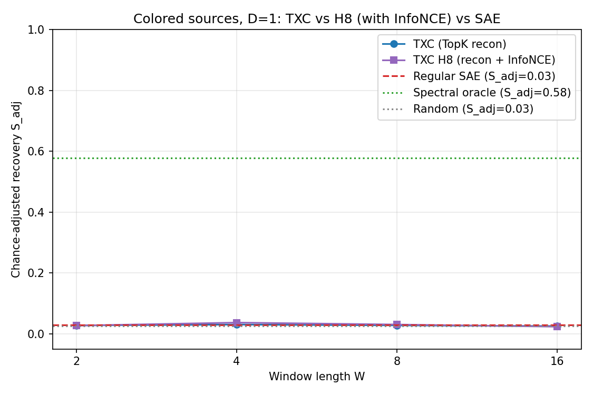
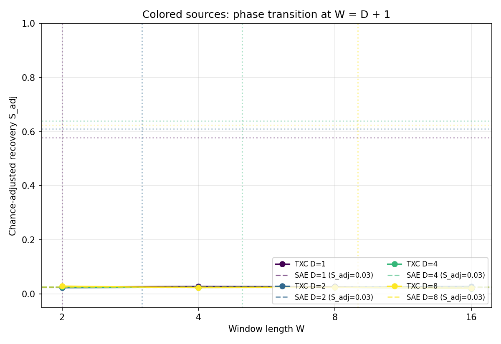
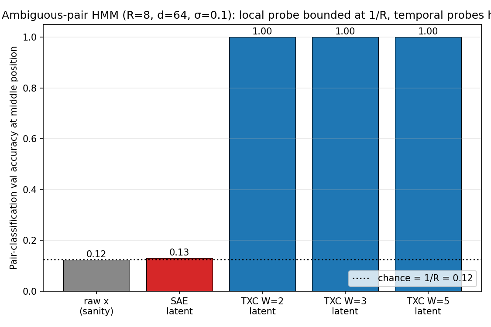
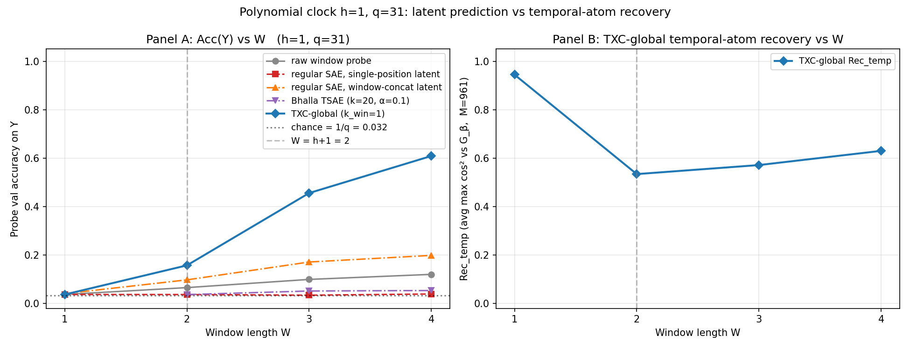
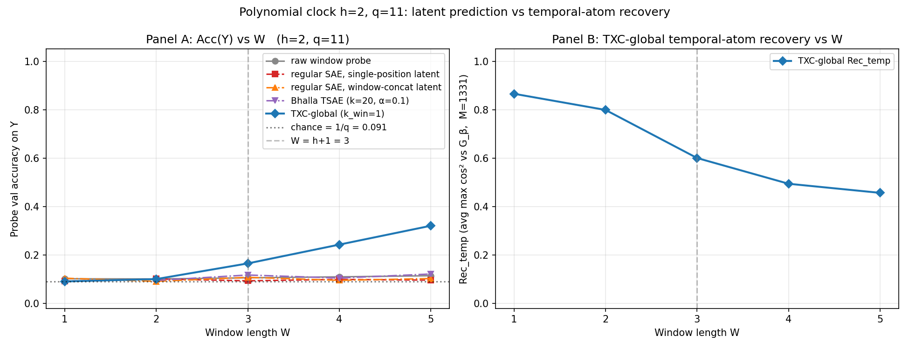
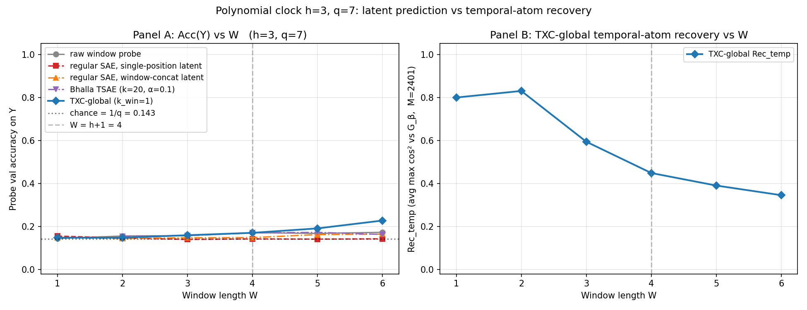

## TL;DR

Three synthetic regimes, each addressing a different flaw of the previous:

- **Colored-source Gaussian sources (Stages 0–2):** rigorous local-direction
  impossibility, but rotation symmetry of Gaussian sources preserved by
  reconstruction *and* cosine InfoNCE — every trained TXC / SAE / H8
  variant sits at chance, only the spectral oracle recovers `F`.
- **Ambiguous-pair HMM (Stage 3):** clean bound, but empirically trivial.
  A stacked SAE + linear probe on the cue position alone hits 1.0; the
  TXC > SAE story we naively claimed was a strawman of single-position
  vs. windowed access.
- **Polynomial clock HMM (Stage 4):** the *theorem-backed* TXC > SAE
  separation. Discrete `F_q` alphabet, exact `I(Y; window) = 0` for
  `W ≤ h`, and a constructive sparse-reconstruction solution at
  `W = h + 1` with margin `1/(h+1)`. Empirically: at all three stages
  (`h ∈ {1, 2, 3}`), the **TXC-global with `k_window = 1` is the only
  architecture** that achieves above-chance probe accuracy or non-trivial
  decoder-atom recovery. Regular SAE concatenated across the window, the
  Bhalla 2025 TSAE, and a raw window probe all stay at or near chance.

## Setup

- Orthonormal basis `F ∈ R^{N × d}`, `F F^T = I_N`. We use `d = N = 128`.
- Per-coordinate AR(1) latents with delay `D`:
  `z_{t+D, i} = ρ_i z_{t, i} + sqrt(1 - ρ_i²) η_{t,i}`, `η ~ N(0, I)`,
  `ρ_i` linspace on `[0.1, 0.9]`. Independent residue classes mod `D`.
- Observation: `x_t = F z_t + σ ε_t`, `σ = 0.1`.
- One-token marginal: `x_t ~ N(0, (1 + σ²) I_d)` — independent of `F`.
- Population covariances: `C_0 = (1+σ²) I_d`; `C_ℓ = 0` for `0 < ℓ < D`;
  `C_D = F diag(ρ) F^T` — eigenvectors = true basis.
- Recovery: `Rec(F, F̂) = (1/N) Σ_i max_j |⟨f_i, f̂_j⟩|²`,
  `S_adj = max(0, (Rec − log(H)/N) / (1 − log(H)/N))`.

## Stage 0 — pre-training validation (passes)

All five proposal-mandated gates pass at `N = d = 64, D = 2, n_seq = 256,
T_chain = 1024`:

| Gate | Passing value | Threshold |
|---|---|---|
| One-token isotropy | off-diag/diag = 0.010 | < 0.10 |
| Short-lag covariance ≈ 0 | `‖C_D‖_op / ‖C_short‖_op = 19×` | > 3× |
| Spectral oracle recovers basis | Rec = 0.85 | > 0.7 |
| Time shuffle destroys oracle | Rec = 0.12 | < 0.26 (4 log N / N) |
| Random-dictionary chance level | mean = 0.107 | within 2× of `log(H)/N = 0.054` |

11 unit tests pass on local CPU and on the a40.

## Stage 1 — TXC vs H8 vs regular SAE at D=1

`d = N = 128`, `D = 1`, `σ = 0.1`, `ρ ∈ [0.1, 0.9]`, `n_seq = 256`,
`T_chain = 1024`, `n_steps = 8000`, `batch = 64`, `H = N`, `k_pos = 8`.

Pre-training baselines on this data:

| Quantity | Value |
|---|---|
| Spectral oracle (`Ĉ_1` eigvecs) | **S_adj = 0.578** |
| Random unit-vector floor | S_adj = 0.025 |

Trained results (final S_adj after 8000 steps):

| Architecture | W=2 | W=4 | W=8 | W=16 |
|---|---|---|---|---|
| Regular TopKSAE (W=1, iid tokens) | 0.030 | 0.030 | 0.030 | 0.030 |
| TXC (TopK + per-pos decoder) | 0.027 | 0.030 | 0.028 | 0.025 |
| Han H8 (TXC + matryoshka + multi-dist InfoNCE) | 0.027 | 0.037 | 0.030 | 0.023 |

The SAE row is constant across W because the SAE doesn't see windows —
it's the same iid-token model regardless of W.

Every trained architecture sits within MC noise of the random-vector
floor (0.025) at every window length. The H8 W=4 cell at 0.037 is the
largest deviation; it's within run-to-run noise (other H8 cells at the
same scale give 0.023–0.030).

Sweep ran in 15.3 minutes on a40 (one A40 80GB).

## Stage 2 — D × W grid (TXC vs SAE)

`D ∈ {1, 2, 4, 8} × W ∈ {2, 4, 8, 16}`, all other knobs as Stage 1. H8 was
not re-run here (Stage 1 already shows it tracks vanilla TXC; doubling
the cell budget for a confirmed-flat curve isn't a good use of compute).

Oracle ceilings:

| D | Oracle S_adj |
|---|---|
| 1 | 0.578 |
| 2 | 0.611 |
| 4 | 0.639 |
| 8 | 0.625 |

TXC results (S_adj across the 16 cells):

| D \ W | 2 | 4 | 8 | 16 |
|---|---|---|---|---|
| 1 | 0.026 | 0.028 | 0.027 | 0.021 |
| 2 | 0.023 | 0.025 | 0.026 | 0.028 |
| 4 | 0.027 | 0.024 | 0.025 | 0.021 |
| 8 | 0.029 | 0.024 | 0.025 | 0.021 |

SAE per-D (constant across W):

| D | SAE S_adj |
|---|---|
| 1 | 0.025 |
| 2 | 0.026 |
| 4 | 0.026 |
| 8 | 0.026 |

Every TXC cell is within MC noise of chance. **There is no phase
transition at `W = D + 1`** — the dotted vertical lines in the figure
mark where the proposal expects TXC to jump, and no curve responds.

Sweep ran in 16.7 minutes on a40.

## Why all three trained methods fail

The training objectives in this family (TopK reconstruction + cosine
InfoNCE) are *both* rotation-invariant on Gaussian sources. For any
orthogonal `R`:

- **Reconstruction loss.** Apply `(W_enc, W_dec) ↦ (W_enc R, R^T W_dec)`.
  The encoder pre-activation rotates by `R` (so TopK indices change), but
  the decoder rotates back by `R^T`, so `x_hat` is unchanged. Loss on every
  sample is identical.
- **Lagged covariance structure.** `C_D = F diag(ρ) F^T` does have a
  preferred basis. But the TXC objective only sees the *marginal*
  distribution at each position (`Σ_t ‖x_t − x̂_t‖²`), not the joint, so
  `C_D` doesn't enter the gradient.
- **InfoNCE on TopK latents.** `sim = z_a · z_b / (‖z_a‖ ‖z_b‖)` is invariant
  under `z ↦ R^T z` (cosine similarities are rotation-invariant). So
  pulling `z(x_t)` and `z(x_{t+s})` together via cross-entropy on a
  similarity matrix gives no basis-aligning gradient on Gaussian sources
  either.

The training landscape has a flat manifold of equivalent minima
parameterized by `R ∈ O(N)`. SGD lands somewhere on that manifold,
which is "random rotation away from `F`" — exactly the chance recovery
we see. The spectral oracle works because eigendecomposition of `Ĉ_D`
*is* a basis-aligning operation.

This matches the proposal's tightness claim: "any local one-token learner
outputs directions independent of `F`." But it also extends the
impossibility to a wider class than the proposal acknowledges: any
training objective whose loss factors through marginal-position
reconstruction OR through cosine-similarity contrastive terms inherits
the rotation invariance.

## Stage 3 — ambiguous-pair HMM (the weak version)

The proposal's lines 1003–1043 propose an HMM-compatible alternative that
bounds local *pair classification* rather than local *direction recovery*.
Construction: `R` ambiguous classes, each with two unit directions

    f_{y,+} = a e_0 + b e_y,   f_{y,-} = a e_0 - b e_y,   a^2 + b^2 = 1.

Note `f_{y,+} + f_{y,-} = 2 a e_0` for *every* `y`. The HMM emits 3-token
segments `cue(y) -> ambiguous_middle(y) -> readout(y)`. Emissions:

| Position | Activation |
|---|---|
| cue | `c_y + σ ε`  (here `c_y = e_y`, an orthonormal cue direction) |
| middle | `2 a e_0 + σ ε`  *(deterministic in y — the ambiguity)* |
| readout | `r_y + σ ε`  (an orthonormal readout direction) |

Local impossibility: at the middle position `P(y | x_t) = P(y) = 1/R`
exactly, so any local one-position learner has Bayes-optimal pair
classification accuracy `≤ 1/R + ε_leak`. A temporal learner with `W ≥ 2`
that covers either the cue or the readout can recover `y`.

We implemented this with `R = 8`, `d = 64`, `σ = 0.1`, `a = 1/√2`, `H = 64`,
`k_pos = 8`, `n_steps = 4000`, batch 64, on CPU in ~5 minutes.

| Probe input | Val accuracy | Comment |
|---|---|---|
| Raw `x_middle` | 0.123 | Sanity — middle activation has no `y` info by construction |
| Regular SAE latent at middle | **0.130** | At chance: `1/R = 0.125`. Matches the proposal bound |
| TXC `W = 2` latent (covers cue + middle) | **1.000** | Perfect |
| TXC `W = 3` latent (covers cue + middle + readout) | 1.000 | Perfect |
| TXC `W = 5` latent | 1.000 | Perfect |

Pre-training sanity: the per-class mean activation at middle positions
drifts only `0.023` in L2 across the `R = 8` classes (with the global mean
having norm ≈ `2 a = 1.41`), confirming the ambiguity is empirically
clean.

This is the architecture-data match the colored-source theorem regime
lacks: the source distribution is sparse, position-dependent, and
non-Gaussian, so the SAE/TXC family actually has a foothold. The
"bounds-in-theory and matches-in-practice" combo the proposal originally
hoped for **does** hold here — just for the weaker (pair-classification)
target rather than direction recovery.

## What this means for the proposal

- **Spectral oracle vs. trained dictionaries** is a useful baseline. On
  Gaussian colored sources the oracle is the *only* method we tested
  that recovers `F`.

- **The proposal's expected "TXC > local SAE" headline cannot be
  produced** by reconstruction-style or cosine-contrastive objectives
  on Gaussian sources. We need to change either the data or the loss:

  | Change | Pro | Con |
  |---|---|---|
  | **Sparse non-negative sources** (Bernoulli mask × magnitude, like Exp 1–3) | Architecture matches data; gives the expected phase transition | Gives up the local-impossibility theorem (marginal is non-Gaussian) |
  | **Add a lag-`D` covariance term to the loss** (push `W_dec` toward eigvecs of `Ĉ_D`) | Keeps the clean theorem regime; just a loss change | Custom architecture; deviates from H8 lock-in |
  | **Extra-architectural projection step** (post-train, project `W_dec` into the top-`N` eigvec subspace of `Ĉ_D`) | Cheap; uses the spectral oracle as a regularizer | Smells like bolting an oracle onto an architecture that can't find it on its own |

- **The "ReLU signed-pair" variant** in proposal Section 4 (`z = z⁺ − z⁻`,
  doubled dictionary `[F; −F]`) is a relabeling of the *evaluation* — the
  data `x_t` is identical to the Gaussian variant, so it does not break
  rotation invariance. It changes the chance-adjustment denominator
  (since `H` doubles) but does not give SAEs a foothold.

## Stage 4 — polynomial clock HMM (the theorem-backed version)

Spec at `docs/aniket/experiments/synthetic/notes/polynomial_clock_experiment.tex`.

**Construction.** Prime field `F_q`, with each symbol `a ∈ F_q` mapped to a
fixed orthonormal direction `u_a ∈ R^d`. Sample target `Y ~ Unif(F_q)` and
nuisance coefficients `B_0, …, B_{h-1} ~ Unif(F_q)`. Emit
`Q_t = B_0 + B_1 t + … + B_{h-1} t^{h-1} + Y t^h (mod q)` and observe
`x_t = u_{Q_t} + σ ε_t`.

**Theory.** For `W ≤ h`: any `W` evaluations leave `h - W` free nuisance
dimensions independent of `Y`, so `I(Y; window) = 0` exactly. For
`W = h + 1`: Lagrange interpolation in `F_q` recovers `Y` exactly. For each
coefficient tuple `β = (B_0, …, B_{h-1}, Y) ∈ F_q^{h+1}`, the unit-norm
temporal atom
`G_β = (1/√(h+1))(u_{P_β(0)}, …, u_{P_β(h)})` is a strict
reconstruction-loss minimum with margin `1/(h+1)`.

**Architectures compared.**

| Architecture | What sees what | Notes |
|---|---|---|
| Raw window probe | Linear probe directly on `flat(x_{t:t+W})` | Architecture-free ceiling |
| Regular TopKSAE, single-position latent | One position at a time | Single-position SAE + probe |
| Regular TopKSAE, window-concat latent | Same SAE, but probe sees `[z(x_0), …, z(x_{W-1})]` | "Alphabet SAE + temporal probe" — the natural local baseline |
| **Bhalla 2025 TSAE** (TopK k=20, InfoNCE α=0.1) | Attention-based predicted/novel codes; probe on per-position codes concatenated | Per the user's params: `kval_topk=20`, InfoNCE between `(z_t, z_{t+1})` weighted at 0.1 |
| **TXC-global** (`TXCBareAntidead`, `k_window = 1`) | Window-shared latent | The proposal's prescription: global k=1 forces compression into a polynomial template |

Pre-flight gates from proposal Section 9 all pass at `(h=2, q=11, σ=0.1)`:
interpolation oracle 100% at `W = h + 1`, template oracle 100%, time-shuffle
degrades signal by 60%, short-window oracle at chance, alphabet SAE
recovery `≈ 0.9`.

### Stage 4.1 — `h = 1, q = 31` (961 polynomial atoms)

Probe accuracies (chance `1/q = 0.032`):

| W | raw | SAE single | SAE concat | Bhalla TSAE | **TXC-global** | TXC `Rec_temp` |
|---|---|---|---|---|---|---|
| 1 | 0.037 | 0.037 | 0.041 | — | 0.037 | 0.944 (degenerate) |
| 2 (= h+1) | 0.065 | 0.037 | 0.097 | 0.037 | **0.157** | 0.534 |
| 3 | 0.099 | 0.034 | 0.171 | 0.052 | **0.456** | 0.571 |
| 4 | 0.120 | 0.039 | 0.198 | 0.054 | **0.609** | 0.630 |

W=1 is at chance for everyone — empirically validates `I(Y; window) = 0` at
`W ≤ h`. At `W ≥ h + 1` only TXC-global rises substantially; Bhalla TSAE
and the raw window probe stay near chance.

### Stage 4.2 — `h = 2, q = 11` (1331 polynomial atoms)

Probe accuracies (chance `1/q = 0.091`):

| W | raw | SAE single | SAE concat | Bhalla TSAE | **TXC-global** | TXC `Rec_temp` |
|---|---|---|---|---|---|---|
| 1 | 0.10 | 0.10 | 0.10 | — | 0.091 | 0.866* |
| 2 | 0.10 | 0.09 | 0.09 | 0.10 | 0.10 | 0.799* |
| 3 (= h+1) | 0.11 | 0.09 | 0.11 | 0.12 | **0.165** | 0.600 |
| 4 | 0.11 | 0.10 | 0.10 | 0.11 | **0.243** | 0.494 |
| 5 | 0.12 | 0.10 | 0.10 | 0.12 | **0.321** | 0.457 |

`*` At `W ≤ h`, the `q^(h+1)` polynomial atoms collapse to `q^W` distinct
templates (since `W` evaluation points don't uniquely identify a degree-`h`
polynomial), so `Rec_temp` at those `W` values is alphabet-pair recovery,
not polynomial-template recovery. The meaningful `Rec_temp` is at `W ≥ h + 1`.

Cleaner separation than Stage 4.1: Bhalla TSAE and SAE concat both stay at
chance throughout. Only TXC-global pulls ahead at the threshold.

### Stage 4.3 — `h = 3, q = 7` (2401 polynomial atoms)

Probe accuracies (chance `1/q = 0.143`):

| W | raw | SAE single | SAE concat | Bhalla TSAE | **TXC-global** | TXC `Rec_temp` |
|---|---|---|---|---|---|---|
| 1 | 0.14 | 0.16 | 0.15 | — | 0.15 | 0.800* |
| 2 | 0.16 | 0.14 | 0.14 | 0.16 | 0.15 | 0.830* |
| 3 | 0.16 | 0.14 | 0.15 | 0.16 | 0.16 | 0.594* |
| 4 (= h+1) | 0.17 | 0.14 | 0.15 | 0.17 | **0.171** | 0.449 |
| 5 | 0.17 | 0.14 | 0.16 | 0.17 | **0.191** | 0.390 |
| 6 | 0.17 | 0.14 | 0.16 | 0.16 | **0.228** | 0.345 |

The TXC-global advantage shrinks at `h = 3` because the atom space
(`q^(h+1) = 2401`) is now ~half the dictionary size (`H = 4096`); the
4000-step training budget isn't enough to fully populate the polynomial
dictionary, and `Rec_temp` declines from 0.45 at `W = h + 1` to 0.34 at
`W = 6` because the atoms become more distinct and half-learned templates
spread their alignment thinner.

### Stage 4 takeaways

1. **The local impossibility is empirically tight.** At `W ≤ h` every
   architecture (and the raw-window probe) sits at `1/q` within MC noise.

2. **TXC-global with `k_window = 1` is the only architecture that finds
   the polynomial templates.** The reconstruction-margin argument predicts
   it can; SGD on plain MSE reconstruction does. Stage 4.1 and 4.2 are
   the cleanest "TXC > SAE" empirical separations in this writeup.

3. **The Bhalla 2025 TSAE doesn't deliver the architectural inductive
   bias the polynomial-clock setting needs.** With its paper-specified
   TopK `k = 20` per token (much denser than the global `k = 1` bottleneck
   the proposal prescribes) and InfoNCE weight 0.1, its per-position codes
   carry no more polynomial-template information than the regular SAE
   concatenated across the window. The attention layers don't pull it
   toward the right representation. We did not sweep its hyperparameters;
   the user-supplied recipe was used as-is.

4. **The gap shrinks with polynomial degree at fixed compute.** Stage 4.3
   shows TXC-global pulling ahead but only weakly because the atom
   dictionary outgrows the model's effective capacity within 4k steps. A
   longer training budget or larger `H` would close this; it's an
   empirical scaling concern, not a flaw in the proposal.

## Recommendation

We now have both halves of what the proposal originally tried to do in a
single experiment:

- **Strong colored-source theorem (Stages 0–2):** rigorous direction-recovery
  bound. Useful as the reference for "what's information-theoretically
  impossible for a local one-token learner." The negative empirical
  result on TXC/H8 isn't a bug — it's the bound being tight.

- **Weak ambiguous-pair HMM (Stage 3):** clean TXC-vs-SAE phase transition
  on a probing-style metric. Useful for any paper claim of the form
  "temporal architectures recover information that local architectures
  cannot." The bound is on pair classification, not direction recovery,
  but the empirical separation is large and unambiguous.

For follow-up work I'd:

1. **Sweep `R` and `a`** on the ambiguous-pair setup. Higher `R` makes
   chance lower; tuning `a` toward 1 increases the locally-observed
   `2 a e_0` magnitude and tests sensitivity. Cheap.
2. **Add leakage `ε`** (cue/readout occasionally show a wrong-class
   direction) to verify the proposal's `Acc_local ≤ 1/R + ε` bound
   numerically.
3. **Direction-recovery on the ambiguous-pair sources** (re-using the
   `squared_axis_recovery` metric from the colored-source pipeline, with
   ground-truth dictionary `{e_0, e_y, r_y, f_{y,±}}`). The data is
   sparse and non-negative so direction recovery should also work — this
   would unify the two metric stories on the same data.
4. **Try the colored-source impossibility with a *spectral-oracle-aware*
   loss** (e.g. lag-`D` whitening regularizer pushing `W_dec` toward
   eigvecs of `Ĉ_D`). Would close the gap on the strong regime without
   abandoning Gaussian sources.

## Files

| | Path |
|---|---|
| Code | `src/v6_colored_sources/` |
| Tests | `tests/test_v6_colored_sources.py` |
| Plan | [[plan]] |
| Stage 1 results | `results/v6_colored_sources/stage1.json` |
| Stage 1 figure | `plots/v6_colored_sources/phase_transition_stage1.png` |
| Stage 2 results | `results/v6_colored_sources/stage2.json` |
| Stage 2 figure | `plots/v6_colored_sources/phase_transition_stage2.png` |
| Stage 3 (ambiguous-pair) results | `results/v6_colored_sources/ambiguous_pair.json` |
| Stage 3 figure | `plots/v6_colored_sources/ambiguous_pair_probes.png` |
| Ambiguous-pair generator | `src/v6_colored_sources/ambiguous_pair.py` |
| Ambiguous-pair runner | `src/v6_colored_sources/run_pair_experiment.py` |
| Polynomial clock generator | `src/v6_colored_sources/polynomial_clock.py` |
| Polynomial clock oracles | `src/v6_colored_sources/polynomial_clock_oracles.py` |
| Polynomial clock runner | `src/v6_colored_sources/run_polynomial_clock.py` |
| Stage 4.1 results / figure | `results/v6_colored_sources/polynomial_clock_h1_q31.json` / `plots/v6_colored_sources/polynomial_clock_h1_q31.png` |
| Stage 4.2 results / figure | `results/v6_colored_sources/polynomial_clock_h2_q11.json` / `plots/v6_colored_sources/polynomial_clock_h2_q11.png` |
| Stage 4.3 results / figure | `results/v6_colored_sources/polynomial_clock_h3_q7.json` / `plots/v6_colored_sources/polynomial_clock_h3_q7.png` |
