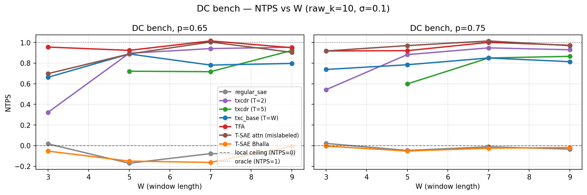
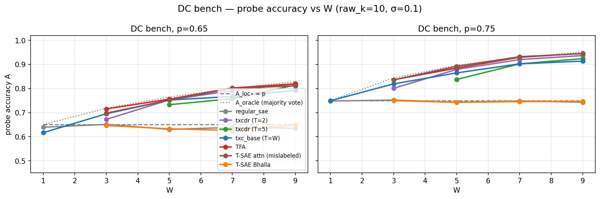
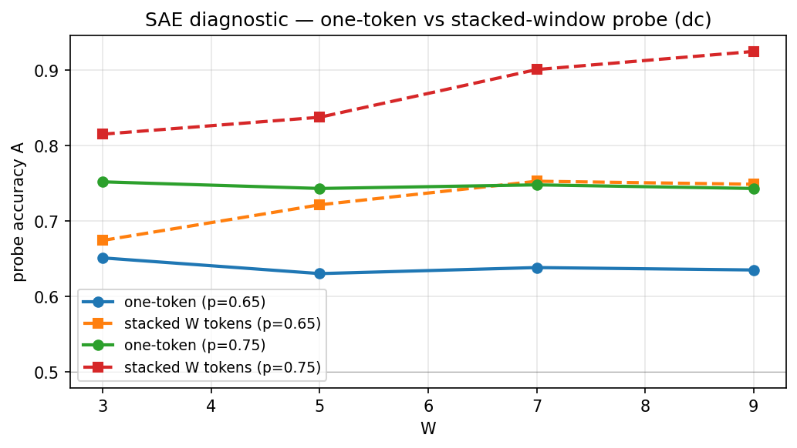
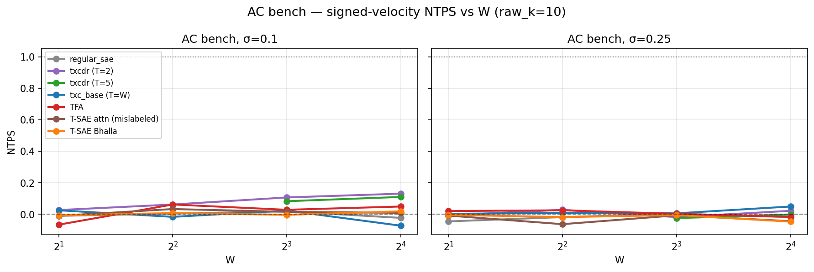
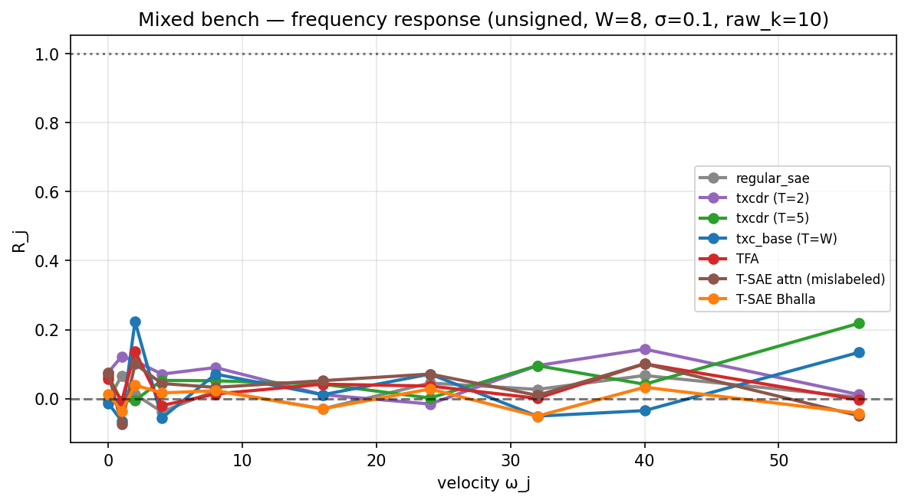
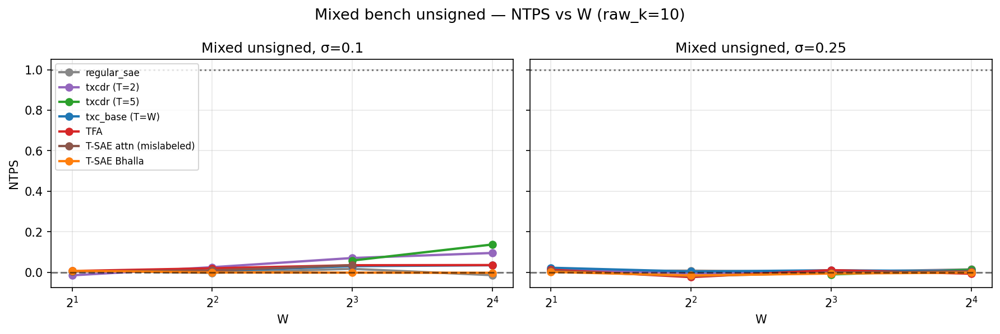
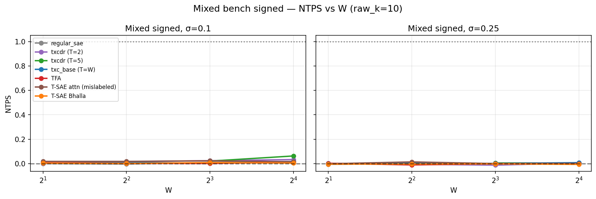

## Overview

FrequencyBench, the 3-part synthetic suite from `frequencybench_proposal.tex`, run on 4 A40 pods (12 GPUs total). Headline metric **NTPS = (A − A_loc⋆) / (A_oracle − A_loc⋆)**: linear-probe accuracy normalized between the proven one-token Bayes ceiling and the symbolic temporal oracle.

Seven architectures swept:

| Arch | Type | Train recipe |
|---|---|---|
| `regular_sae` | per-token TopK SAE | Adam + MSE |
| `txcdr_t2` | T=2 temporal crosscoder, slid across W | Adam + MSE |
| `txcdr_t5` | T=5 temporal crosscoder, slid across W | Adam + MSE |
| `txc_base` | T=W joint-window TopK with AuxK | Adam + MSE + AuxK |
| `tfa` | Han's TFA: TemporalSAE with causal attention + sinusoidal posenc | AdamW + cosine + MSE |
| `tsae_attn` | TemporalSAE-with-attention + InfoNCE 0.1 (NOT Bhalla) | Adam + MSE + InfoNCE 0.1 |
| `tsae_bhalla` | **Per-token linear SAE, BatchTopK, InfoNCE between adjacent tokens** (the actual Bhalla et al. 2025 architecture from arxiv 2511.05541) | Adam + MSE + InfoNCE 0.1, decoder-grad-orthogonalize |

`tsae_attn` is a hybrid that emerged from misreading Han's vendored `train_tsae` recipe — kept as a comparison row. The **proper Bhalla T-SAE** (`tsae_bhalla`) uses no attention; per the paper, all temporal coupling is training-time only, and at inference each token is encoded independently.

## Pod allocation

| Pod | Bench | Cells |
|---|---|---|
| `a40_synth_3gpu` (synth1) | DC + helper for mixed-{u,s} | 290 + helper |
| `a40_synth_3gpu2` (synth2) | AC | 280 |
| `a40_synth_3gpu3` (pod-3) | Mixed unsigned (Ω₁₀) | 220 |
| `a40_synth_3gpu4` (pod-4) | Mixed signed (Ω₂₀±) | 220 |

Total ≈ 1010 cells (after the v1 trim of σ=0 and p ∈ {0.55, 0.75}, plus dropping `tsae_attn` from mixed-{u,s} after we discovered the architecture mismatch — those `tsae_attn` rows survive from the first run).

## Headline findings

The 3 benches give 3 different answers — and the proposal's central question gets a sharp answer.

### Bench 1 (DC): smoothing works as predicted

**The DC bench separates per-token from windowed architectures cleanly:**

Two clear groups at NTPS ≈ 0 vs NTPS ≈ 0.7-1.0:

- Group A (sit at the proven local ceiling, NTPS ≈ 0): `regular_sae`, **`tsae_bhalla`** — both are per-token at inference, neither can beat the Bayes ceiling on a single-token probe.
- Group B (climb toward oracle as W grows): `txc_base`, `txcdr_t2`, `txcdr_t5`, `tfa`, `tsae_attn` — all have window-level information at inference.
- `tfa` and `tsae_attn` (the attention-augmented archs) hit NTPS ≈ 1.0 at W ≥ 5 — they reach the majority-vote oracle.

This confirms the proposal's pre-registered prediction: *"Single-token SAE: Accuracy near the local ceiling p; no improvement with W."* The proper Bhalla T-SAE behaves as the proposal expects of a single-token arch (because at inference it IS a single-token arch — the temporal coupling lives only in the training contrastive term).

#### A vs W with reference lines (raw reading)

#### SAE diagnostic: one-token vs stacked-window probe

The stacked-window probe (probe sees concatenated z(x_0), …, z(x_{W-1})) lifts SAE accuracy toward oracle. As predicted: this is the *probe* doing the temporal computation, not the architecture.

### Bench 2 (AC): every architecture fails

**Sharp negative result. None of the 7 archs recover signed velocity at any W or σ.**

All architectures cluster near NTPS = 0 (i.e., A ≈ 0.5 = chance). The oracle is 1.0 (two adjacent phases analytically determine the sign), but no architecture finds it. txcdr_t2 and txcdr_t5 inch up to NTPS ≈ 0.1 at the largest W under low noise — barely above chance.

This is the proposal's *critical test* and it falsifies a strong reading of "TXC/TFA do temporal filtering": they do not. The smoothing capability (which DC rewards) does not generalize to order-sensitive AC structure.

Why none of them work:

- Per-token archs (regular_sae, tsae_bhalla) cannot recover signed velocity from a single token — proven.
- Window-pooled archs (txc_base, txcdr_t2/t5) take a TopK code over a joint window; the proposal's prediction *"Should be weak or unstable. If it learns genuine AC filters, it should rise sharply above chance for W ≥ 2"* lands on the "weak" branch.
- Attention archs (tfa, tsae_attn) have causal attention over prior tokens — a theoretically sufficient mechanism — but at d_sae=40 with raw_k=10, the architecture/probe combination doesn't recover the signal. The probe is linear; the underlying decoding (adjacent phase difference modulo M) requires a comparison between token codes, which a linear probe over a per-position-mean code cannot do.

### Bench 3 (Mixed): frequency response is flat near zero

**Same story across the 10-velocity ladder — no architecture has a meaningful frequency response curve.**

R_j ≈ 0 for all velocities and all archs. The bench was designed so a temporal filter would show R_j > 0 on its preferred frequencies (a smoother peaks at ω=0; a high-pass filter peaks at large ω). What we see instead: **flat curves**.

#### Mixed NTPS vs W

NTPS climbs slightly with W for some windowed archs (txc_base, txcdr) but never approaches oracle. The signed variant (Ω₂₀±) is even harder.

## Bottom line

> "Does the architecture use temporal context?"

- **DC: Yes, when there's a temporal axis to use** (txc_base / txcdr / tfa / tsae_attn climb to oracle). The mechanism is sample aggregation; the proper Bhalla T-SAE — which is per-token at inference — sits at local ceiling, as the paper would predict.
- **AC: No.** No architecture recovers signed motion. They do not act as multi-token filters in the proposal's sense.
- **Mixed: No.** Frequency response curves are flat. No architecture shows a peaked response at any ω.

The two strong negative results (AC, mixed) cleanly falsify the strong claim that TXC / TFA / T-SAE do genuine temporal filtering on this synthetic data at this capacity (d_sae=40, raw_k ≤ 20, 10k training steps). They aggregate; they do not filter.

## Sweep dimensions

| bench | W | secondary | RAW_K | archs |
|---|---|---|---|---|
| DC | 1, 3, 5, 7, 9 | p ∈ {0.65, 0.75}, σ = 0.1 | 1, 2, 5, 10, 20 | 7 |
| AC | 1, 2, 4, 8, 16 | σ ∈ {0.1, 0.25} | 1, 2, 5, 10, 20 | 7 |
| Mixed unsigned | 2, 4, 8, 16 | σ ∈ {0.1, 0.25}, M=127, Ω₁₀ | 1, 2, 5, 10, 20 | 6 (no tsae_attn) |
| Mixed signed | 2, 4, 8, 16 | σ ∈ {0.1, 0.25}, M=127, Ω₂₀± | 1, 2, 5, 10, 20 | 6 (no tsae_attn) |

`txcdr_t5` skipped at W < 5; `txcdr_t2`/`tfa`/`tsae_attn`/`tsae_bhalla` skipped at W = 1.

TOTAL_STEPS = 10000, batch_size = 2048, lr = 3e-4, bench HIDDEN_DIM = 256, DICT_WIDTH = 40. Linear probe = sklearn `LogisticRegression(solver="lbfgs", multi_class="auto", max_iter=1000, C=1.0)` after `StandardScaler`. Train/eval split: 1250/1250 sequences per cell.

## Caveats

- **Capacity**: d_sae = 40, raw_k ≤ 20. The Bhalla paper used much larger dictionaries (16384). It's plausible the AC/mixed negative result reflects insufficient capacity rather than architectural inability — needs a wider sweep.
- **Probe class**: linear logistic. The proposal's stacked-window diagnostic notes that *"A nonlinear or symbolic probe can solve the task, so probe class must be reported."* We report linear-only.
- **Training duration**: 10k steps (vs the original 30k templates). Convergence at W=16 with attention archs may be incomplete.
- **σ sweep trimmed**: σ=0 sanity rows dropped, σ=0.05 dropped on AC/mixed, p ∈ {0.55, 0.75} dropped on DC, signed mixed kept (run on dedicated pod-4).
- **`tsae_attn` is not Bhalla T-SAE.** It's a TFA-style TemporalSAE-with-attention trained with InfoNCE — the architecture I accidentally created when first reading Han's vendored `train_tsae` recipe. Kept as a comparison; the actual Bhalla T-SAE is `tsae_bhalla`.

## Source paths

- Drivers: `experiments/phase3_coupled/run_freq_bench_{dc,ac,mixed,mixed_signed}.py` on each pod.
- Shared library: `experiments/phase3_coupled/freq_bench_lib.py` (data gen, oracles, probe, FreqFrac, FTR utilities).
- Architectures + train recipes: `experiments/phase3_coupled/freq_bench_archs.py` (vendored TemporalSAE for TFA/T-SAE attn, plus TSAEBhalla class for the proper Bhalla 2025 T-SAE).
- Local mirror: `results/2026-05-06_freq_bench/{synth1_dc,synth2_ac,pod3_mixed,pod4_mixed_signed,synth1_mixed_signed,synth1_mixed_unsigned.json}`.
- Plot script: `results/2026-05-06_freq_bench/make_plots.py`.

## Follow-ups

- **Wider d_sae** sweep (256, 1024, 4096) to test the capacity hypothesis on AC and mixed.
- **Nonlinear probe** (small MLP) on the same caches to separate "architecture has the info but linear probe can't read it" from "architecture lacks the info."
- **AC-split TXC**: implement a 2-tap convolutional encoder explicitly designed to detect adjacent phase differences, predicted by the proposal to win on AC.
- **Spectral diagnostic**: compute FreqFrac of W_enc per atom on the trained models (already implemented in `freq_bench_lib.freqfrac`); aggregate over high-usage atoms.
- **σ=0 sanity rows**: skipped here for compute; should be added back to verify the noiseless oracle is hit by the TXC archs (not just approached).
