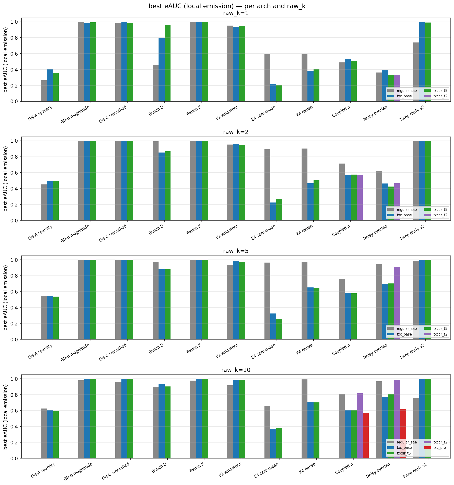
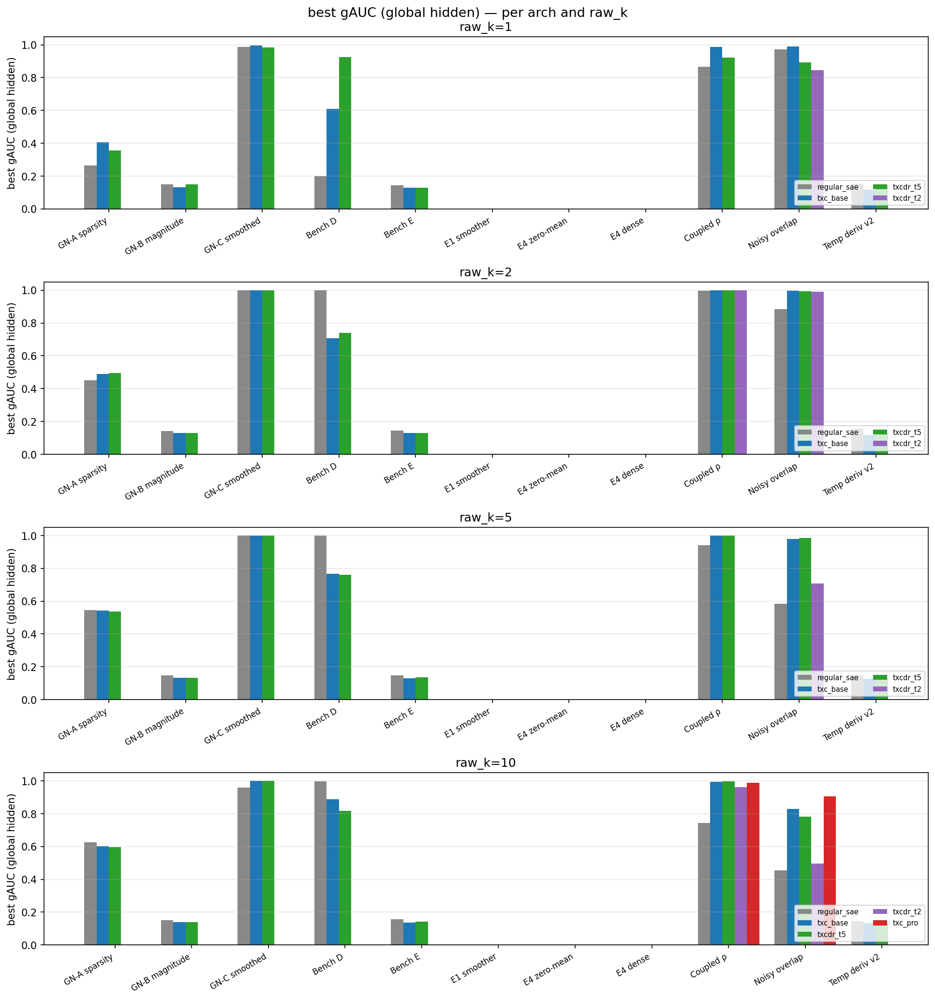
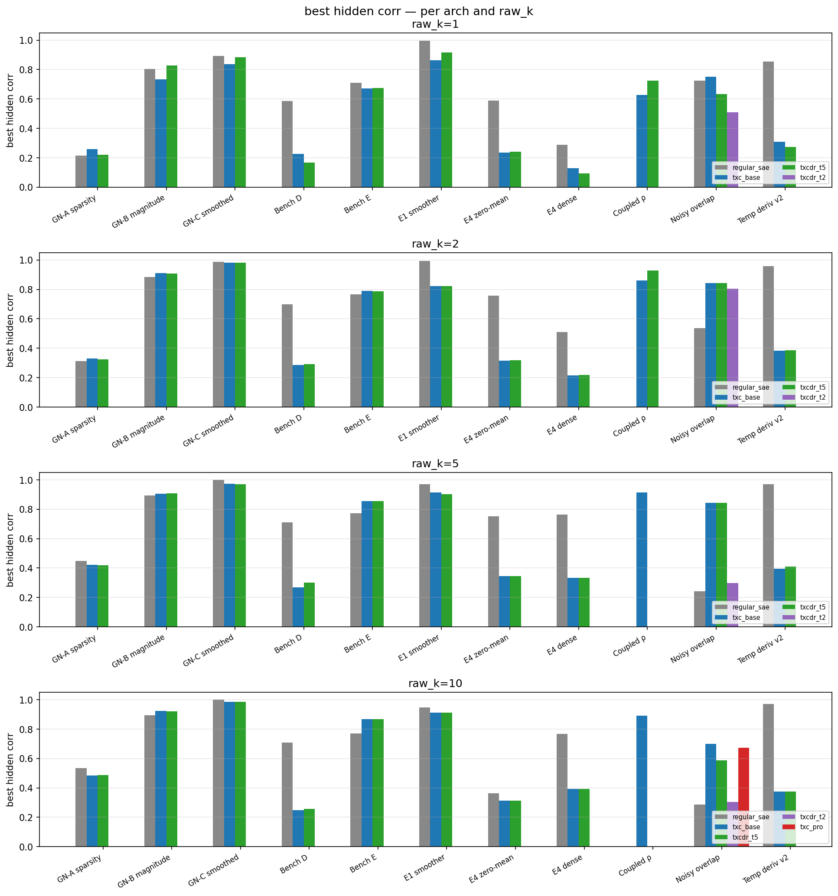
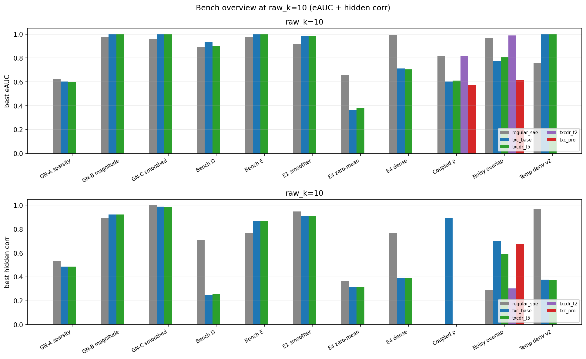
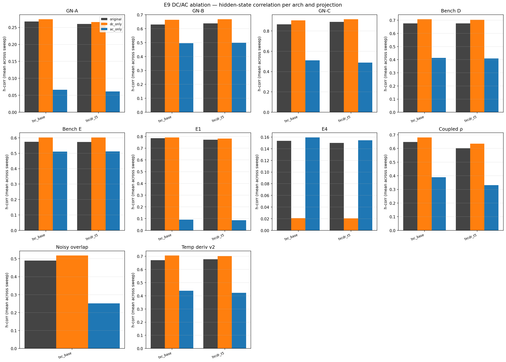
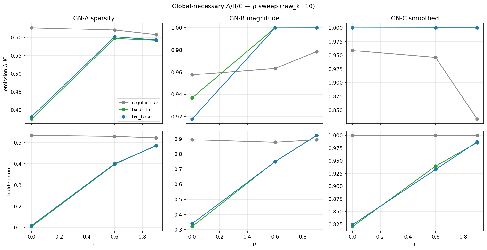
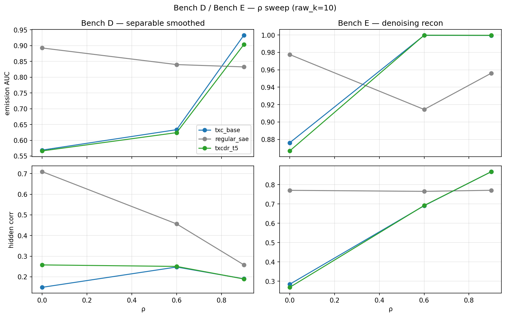
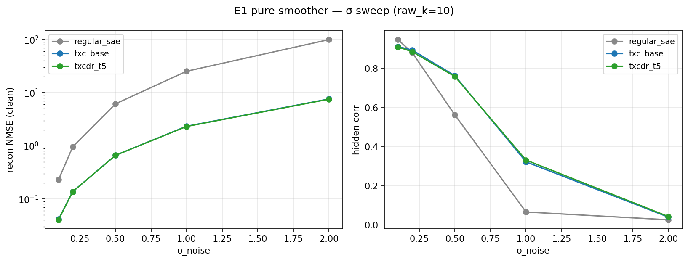
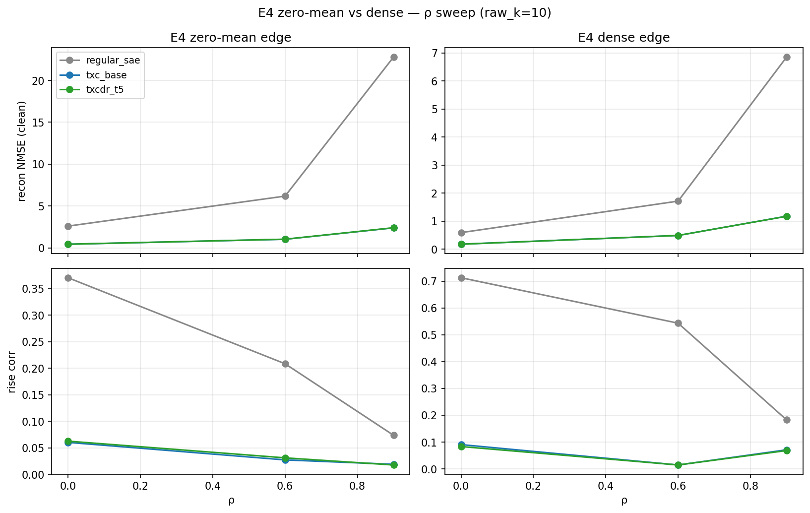

## Overview

Overnight chain on `a40_synth_3gpu` and `a40_synth_3gpu2` (2026-05-05 / 06 UTC). Two orchestrators (`overnight_chain_synth.sh`, `overnight_chain_synth2.sh`) drove 3 architectures (`regular_sae`, `txc_base`, `txcdr_t5`) — and a wider 5-arch set on the supplement-3-arch benches — across 11 synthetic benchmarks plus E9 DC/AC post-hoc ablations.

Of the 13 follow-up cells planned, **9 ran cleanly overnight**, **3 failed with a `RAW_K_TARGETS` AttributeError** in the E9 driver, and **2 (E1 + E9-on-E1 on synth2) never launched** because the synth2 chain stalled in its Phase 1 wait. Two later jobs (`e1_v2` on synth1, `e4_dense_edge` on synth2) were launched separately and completed.

**Relaunch (2026-05-06 morning).** The 5 missing cells were re-executed:
- The 3 supplement-3-arch E9 ablations (`coupled`, `noisy`, `temporal_v2`) were relaunched against new e9-compat shim modules (`{coupled,noisy,temporal_v2}_e9.py`) that re-export the underlying supplement-3-arch driver and add the `extract_latents_and_recon` / `best_in_codebook_corr` functions the E9 driver expects. All 3 finished in <5 min.
- E1 + E9-on-E1 on synth2 was launched directly. E1 on synth2 covers only σ=0.5 by design (`SIGMA_VALUES = [0.5]` in the script — chain was a replication of synth1's σ=0.5 cell, not a full sweep). 15 cells in `results.json`, 30 in `e9_ablation.json`. E1 took 15-18 min per GPU; E9 was <1 min.

All `results.json` and `e9_ablation.json` files (including the post-relaunch artifacts) are mirrored in `results/2026-05-06_overnight/{synth1,synth2}/`.

## Status table

| pod | bench | rows | arches | sweep | E9 ablation |
|---|---|---|---|---|---|
| synth2 | global_necessary_a_sparsity | 45 | regular_sae, txc_base, txcdr_t5 | ρ | yes |
| synth2 | global_necessary_b_magnitude_noise | 45 | regular_sae, txc_base, txcdr_t5 | ρ | yes |
| synth2 | global_necessary_c_smoothed | 45 | regular_sae, txc_base, txcdr_t5 | ρ | yes |
| synth1 | bench_d_separable_smoothed | 45 | regular_sae, txc_base, txcdr_t5 | ρ | yes |
| synth1 | bench_e_denoising_recon | 45 | regular_sae, txc_base, txcdr_t5 | ρ | yes |
| synth1 | e1_pure_smoother | 75 | regular_sae, txc_base, txcdr_t5 | σ | yes |
| synth2 | e4_zero_mean_edge | 45 | regular_sae, txc_base, txcdr_t5 | ρ, σ | yes |
| synth2 | e4_dense_edge | 45 | regular_sae, txc_base, txcdr_t5 | ρ, σ | no (later run) |
| synth1 | coupled_rho_sweep | 66 | 5-arch incl. txc_pro, txcdr_t2 | ρ | yes (relaunch via `coupled_e9` shim, 72 rows) |
| synth1 | coupled_noisy_overlap_sweep | 72 | 5-arch incl. txc_pro, txcdr_t2 | n_parents, p_B, ρ | yes (relaunch via `noisy_e9` shim, 45 rows; some t5 caches missing) |
| synth1 | temporal_derivative_v2_sweep | 45 | regular_sae, txc_base, txcdr_t5 | ρ | yes (relaunch via `temporal_v2_e9` shim, 90 rows) |

## Metrics definitions

Three primary scalars per cell, all bounded in [0, 1] (or close):

- **eAUC = `emission_auc`** — local feature recovery. Decoder cosine similarity between the SAE/TXC dictionary atoms `W_dec` and the *emission* feature vectors (the directions actually present in `x(t)`). For each ground-truth emission direction, find the dictionary atom with maximum |cosine|, then average across emission directions. Tracks "did the model find the local features."
- **gAUC = `hidden_auc`** — global feature recovery. Same calculation but against the *hidden-state* feature vectors (the K=10 latent chains driving `x(t)`). For benches where hidden directions are the same as emission directions (GN-A, Bench-C-smoothed) gAUC equals eAUC. For benches where hidden directions are distinct (GN-B magnitude-noise, Bench-E denoising-recon, temporal-derivative-v2) gAUC is the *global* metric — what the proposal calls the "global feature" recovery target. Three benches don't track gAUC because their data design has no separate hidden direction (`e1_pure_smoother`, `e4_zero_mean_edge`, `e4_dense_edge`).
- **hidden_corr_mean** — best-in-codebook absolute Pearson correlation between any code dimension's activation trace and each ground-truth hidden-state target sequence, averaged across the K targets. Concretely: `z` is the (n_eval × T, d_sae) flattened code matrix; `target` is the (n_eval × T, K) hidden-state matrix; for each target column k, compute Pearson correlation against every code column j after standardizing both, take `max_j |corr(z[:,j], target[:,k])|`, then mean over k. Tracks "is the time-resolved hidden trajectory recoverable from code activations" rather than just dictionary alignment.

eAUC/gAUC measure dictionary structure (decoder weights). hidden_corr_mean measures the time-series readout (encoder outputs over the eval set). They can disagree — e.g., on Bench D the SAE's gAUC is 1.0 (decoder atoms align with hidden directions) but hidden_corr_mean is only 0.71 (the *activation traces* don't faithfully track the binary hidden state).

## Headline findings

- **Architecture wins are bench-specific.** TXC variants beat regular SAE on benches where temporal context is the discriminative signal (`bench_e_denoising_recon`, `coupled_rho_sweep`, `coupled_noisy_overlap_sweep`, `global_necessary_b_magnitude_noise`). Regular SAE wins or ties on benches where the local-snapshot signal carries the info (`global_necessary_a/c`, `bench_d_separable_smoothed`, `e1_pure_smoother`, `e4_*`, `temporal_derivative_v2_sweep`).
- **The E9 DC/AC ablation tells one consistent story across 9 of 10 benches**: the *DC* (time-constant) component of TXC features carries essentially all of the hidden-state-recovery signal. Replacing the original feature with `dc_only` matches or slightly *improves* h-corr; replacing with `ac_only` collapses h-corr — 21% drop on GN-B, ~40% on GN-C and Bench D, ~40-49% on the 3 supplement-3-arch benches, and **~88% on E1**. Only `e4_zero_mean_edge` reverses the pattern (DC=0.02, AC=0.16) — expected, because the underlying signal is zero-mean by construction.
- **Bench D is a TXC blind spot.** Best hidden-corr at raw_k=10: regular_sae 0.71, txc_base 0.25, txcdr_t5 0.26 — almost a 3× gap. The architecture discriminates *separable* (token-level smoothed) structure poorly compared to a static SAE.
- **E1 stress test (σ=2.0)**: regular SAE recon explodes (NMSE ~100), TXC variants stay at ~7.5. So TXC is more robust to high observation noise on smoothed data, but hidden-state recovery is small for everyone (h-corr ≈ 0.04 across archs). The robustness is a clean-recon win, not a feature-quality win.
- **The 3 supplement-3-arch benches were e9-eligible — just needed the right bench name.** The driver scripts named `run_<bench>.py` for each don't expose the e9 driver's required interface, but parallel scripts at `run_supplement_3arch_{coupled,noisy,temporal_v2}.py` *do*. The chain called e9 with bench names that resolved to the wrong file. We added thin shim modules (`{coupled,noisy,temporal_v2}_e9.py`) that re-export the supplement_3arch driver and add `extract_latents_and_recon` + `best_in_codebook_corr`, then ran e9 against those — 5 min total. Same DC/AC pattern as the rest of the suite (AC drop 35-49%).

## Per-bench numbers — per raw_k

For each metric below, columns are the best value across each bench's full sweep at the indicated `raw_k`. Five-arch coupled rows have entries for `txcdr_t2` / `txc_pro` only where they were swept. Em-dashes mean the arch wasn't run at that raw_k or the bench doesn't track that metric.

### eAUC — local emission-feature recovery (best across sweep)

| bench | k | regular_sae | txc_base | txcdr_t5 | txcdr_t2 | txc_pro |
|---|---|---|---|---|---|---|
| global_necessary_a_sparsity | 1 | 0.263 | 0.406 | 0.357 | — | — |
| global_necessary_a_sparsity | 2 | 0.452 | 0.490 | 0.494 | — | — |
| global_necessary_a_sparsity | 5 | 0.546 | 0.543 | 0.536 | — | — |
| global_necessary_a_sparsity | 10 | 0.627 | 0.602 | 0.597 | — | — |
| global_necessary_b_magnitude_noise | 1 | 0.998 | 0.987 | 0.992 | — | — |
| global_necessary_b_magnitude_noise | 2 | 1.000 | 1.000 | 0.999 | — | — |
| global_necessary_b_magnitude_noise | 5 | 1.000 | 1.000 | 1.000 | — | — |
| global_necessary_b_magnitude_noise | 10 | 0.978 | 1.000 | 1.000 | — | — |
| global_necessary_c_smoothed | 1 | 0.988 | 0.995 | 0.985 | — | — |
| global_necessary_c_smoothed | 2 | 0.999 | 1.000 | 1.000 | — | — |
| global_necessary_c_smoothed | 5 | 1.000 | 1.000 | 1.000 | — | — |
| global_necessary_c_smoothed | 10 | 0.958 | 1.000 | 1.000 | — | — |
| bench_d_separable_smoothed | 1 | 0.457 | 0.794 | 0.957 | — | — |
| bench_d_separable_smoothed | 2 | 0.993 | 0.852 | 0.868 | — | — |
| bench_d_separable_smoothed | 5 | 0.976 | 0.880 | 0.879 | — | — |
| bench_d_separable_smoothed | 10 | 0.893 | 0.933 | 0.903 | — | — |
| bench_e_denoising_recon | 1 | 0.999 | 0.995 | 0.995 | — | — |
| bench_e_denoising_recon | 2 | 1.000 | 0.998 | 0.998 | — | — |
| bench_e_denoising_recon | 5 | 1.000 | 0.999 | 0.999 | — | — |
| bench_e_denoising_recon | 10 | 0.978 | 1.000 | 1.000 | — | — |
| e1_pure_smoother | 1 | 0.953 | 0.936 | 0.944 | — | — |
| e1_pure_smoother | 2 | 0.952 | 0.957 | 0.945 | — | — |
| e1_pure_smoother | 5 | 0.933 | 0.980 | 0.976 | — | — |
| e1_pure_smoother | 10 | 0.917 | 0.986 | 0.986 | — | — |
| e4_zero_mean_edge | 1 | 0.598 | 0.221 | 0.209 | — | — |
| e4_zero_mean_edge | 2 | 0.892 | 0.224 | 0.271 | — | — |
| e4_zero_mean_edge | 5 | 0.965 | 0.326 | 0.261 | — | — |
| e4_zero_mean_edge | 10 | 0.658 | 0.364 | 0.381 | — | — |
| e4_dense_edge | 1 | 0.593 | 0.382 | 0.402 | — | — |
| e4_dense_edge | 2 | 0.901 | 0.466 | 0.503 | — | — |
| e4_dense_edge | 5 | 0.977 | 0.651 | 0.645 | — | — |
| e4_dense_edge | 10 | 0.990 | 0.711 | 0.704 | — | — |
| coupled_rho_sweep | 1 | 0.487 | 0.535 | 0.506 | — | — |
| coupled_rho_sweep | 2 | 0.714 | 0.572 | 0.574 | 0.572 | — |
| coupled_rho_sweep | 5 | 0.758 | 0.584 | 0.577 | — | — |
| coupled_rho_sweep | 10 | 0.813 | 0.604 | 0.610 | 0.817 | 0.574 |
| coupled_noisy_overlap_sweep | 1 | 0.363 | 0.388 | 0.336 | 0.331 | — |
| coupled_noisy_overlap_sweep | 2 | 0.619 | 0.462 | 0.425 | 0.466 | — |
| coupled_noisy_overlap_sweep | 5 | 0.943 | 0.700 | 0.703 | 0.912 | — |
| coupled_noisy_overlap_sweep | 10 | 0.967 | 0.774 | 0.808 | 0.988 | 0.616 |
| temporal_derivative_v2_sweep | 1 | 0.740 | 0.995 | 0.991 | — | — |
| temporal_derivative_v2_sweep | 2 | 0.998 | 0.999 | 0.998 | — | — |
| temporal_derivative_v2_sweep | 5 | 0.978 | 1.000 | 1.000 | — | — |
| temporal_derivative_v2_sweep | 10 | 0.761 | 1.000 | 1.000 | — | — |

### gAUC — global hidden-feature recovery (best across sweep)

| bench | k | regular_sae | txc_base | txcdr_t5 | txcdr_t2 | txc_pro |
|---|---|---|---|---|---|---|
| global_necessary_a_sparsity | 1 | 0.263 | 0.406 | 0.357 | — | — |
| global_necessary_a_sparsity | 2 | 0.452 | 0.490 | 0.494 | — | — |
| global_necessary_a_sparsity | 5 | 0.546 | 0.543 | 0.536 | — | — |
| global_necessary_a_sparsity | 10 | 0.627 | 0.602 | 0.597 | — | — |
| global_necessary_b_magnitude_noise | 1 | 0.150 | 0.132 | 0.148 | — | — |
| global_necessary_b_magnitude_noise | 2 | 0.142 | 0.131 | 0.130 | — | — |
| global_necessary_b_magnitude_noise | 5 | 0.147 | 0.133 | 0.134 | — | — |
| global_necessary_b_magnitude_noise | 10 | 0.153 | 0.140 | 0.141 | — | — |
| global_necessary_c_smoothed | 1 | 0.988 | 0.995 | 0.985 | — | — |
| global_necessary_c_smoothed | 2 | 0.999 | 1.000 | 1.000 | — | — |
| global_necessary_c_smoothed | 5 | 1.000 | 1.000 | 1.000 | — | — |
| global_necessary_c_smoothed | 10 | 0.958 | 1.000 | 1.000 | — | — |
| bench_d_separable_smoothed | 1 | 0.201 | 0.609 | 0.925 | — | — |
| bench_d_separable_smoothed | 2 | 0.998 | 0.709 | 0.740 | — | — |
| bench_d_separable_smoothed | 5 | 1.000 | 0.768 | 0.762 | — | — |
| bench_d_separable_smoothed | 10 | 0.996 | 0.887 | 0.819 | — | — |
| bench_e_denoising_recon | 1 | 0.144 | 0.129 | 0.129 | — | — |
| bench_e_denoising_recon | 2 | 0.143 | 0.130 | 0.130 | — | — |
| bench_e_denoising_recon | 5 | 0.148 | 0.130 | 0.135 | — | — |
| bench_e_denoising_recon | 10 | 0.156 | 0.137 | 0.141 | — | — |
| e1_pure_smoother | * | — | — | — | — | — |
| e4_zero_mean_edge | * | — | — | — | — | — |
| e4_dense_edge | * | — | — | — | — | — |
| coupled_rho_sweep | 1 | 0.867 | 0.988 | 0.922 | — | — |
| coupled_rho_sweep | 2 | 0.997 | 0.999 | 0.999 | 0.999 | — |
| coupled_rho_sweep | 5 | 0.941 | 1.000 | 0.999 | — | — |
| coupled_rho_sweep | 10 | 0.745 | 0.995 | 0.997 | 0.961 | 0.987 |
| coupled_noisy_overlap_sweep | 1 | 0.973 | 0.990 | 0.893 | 0.844 | — |
| coupled_noisy_overlap_sweep | 2 | 0.886 | 0.995 | 0.995 | 0.990 | — |
| coupled_noisy_overlap_sweep | 5 | 0.584 | 0.980 | 0.984 | 0.707 | — |
| coupled_noisy_overlap_sweep | 10 | 0.455 | 0.829 | 0.781 | 0.496 | 0.907 |
| temporal_derivative_v2_sweep | 1 | 0.152 | 0.118 | 0.148 | — | — |
| temporal_derivative_v2_sweep | 2 | 0.156 | 0.117 | 0.124 | — | — |
| temporal_derivative_v2_sweep | 5 | 0.147 | 0.127 | 0.128 | — | — |
| temporal_derivative_v2_sweep | 10 | 0.145 | 0.135 | 0.135 | — | — |

`*` = bench design has no separate hidden direction; gAUC not tracked.

### hidden_corr — best-in-codebook |Pearson| against hidden trajectory (best across sweep)

| bench | k | regular_sae | txc_base | txcdr_t5 | txcdr_t2 | txc_pro |
|---|---|---|---|---|---|---|
| global_necessary_a_sparsity | 1 | 0.214 | 0.260 | 0.219 | — | — |
| global_necessary_a_sparsity | 2 | 0.313 | 0.329 | 0.325 | — | — |
| global_necessary_a_sparsity | 5 | 0.447 | 0.421 | 0.420 | — | — |
| global_necessary_a_sparsity | 10 | 0.534 | 0.485 | 0.486 | — | — |
| global_necessary_b_magnitude_noise | 1 | 0.805 | 0.734 | 0.826 | — | — |
| global_necessary_b_magnitude_noise | 2 | 0.885 | 0.910 | 0.908 | — | — |
| global_necessary_b_magnitude_noise | 5 | 0.894 | 0.906 | 0.908 | — | — |
| global_necessary_b_magnitude_noise | 10 | 0.894 | 0.923 | 0.922 | — | — |
| global_necessary_c_smoothed | 1 | 0.894 | 0.838 | 0.883 | — | — |
| global_necessary_c_smoothed | 2 | 0.988 | 0.982 | 0.981 | — | — |
| global_necessary_c_smoothed | 5 | 1.000 | 0.973 | 0.971 | — | — |
| global_necessary_c_smoothed | 10 | 1.000 | 0.987 | 0.986 | — | — |
| bench_d_separable_smoothed | 1 | 0.585 | 0.225 | 0.166 | — | — |
| bench_d_separable_smoothed | 2 | 0.699 | 0.287 | 0.292 | — | — |
| bench_d_separable_smoothed | 5 | 0.709 | 0.270 | 0.301 | — | — |
| bench_d_separable_smoothed | 10 | 0.710 | 0.247 | 0.258 | — | — |
| bench_e_denoising_recon | 1 | 0.709 | 0.671 | 0.674 | — | — |
| bench_e_denoising_recon | 2 | 0.767 | 0.789 | 0.787 | — | — |
| bench_e_denoising_recon | 5 | 0.773 | 0.855 | 0.854 | — | — |
| bench_e_denoising_recon | 10 | 0.771 | 0.867 | 0.867 | — | — |
| e1_pure_smoother | 1 | 0.995 | 0.862 | 0.916 | — | — |
| e1_pure_smoother | 2 | 0.994 | 0.822 | 0.822 | — | — |
| e1_pure_smoother | 5 | 0.971 | 0.914 | 0.903 | — | — |
| e1_pure_smoother | 10 | 0.948 | 0.912 | 0.911 | — | — |
| e4_zero_mean_edge | 1 | 0.588 | 0.236 | 0.241 | — | — |
| e4_zero_mean_edge | 2 | 0.756 | 0.315 | 0.318 | — | — |
| e4_zero_mean_edge | 5 | 0.751 | 0.346 | 0.346 | — | — |
| e4_zero_mean_edge | 10 | 0.364 | 0.315 | 0.314 | — | — |
| e4_dense_edge | 1 | 0.288 | 0.129 | 0.094 | — | — |
| e4_dense_edge | 2 | 0.511 | 0.214 | 0.219 | — | — |
| e4_dense_edge | 5 | 0.763 | 0.333 | 0.334 | — | — |
| e4_dense_edge | 10 | 0.769 | 0.393 | 0.392 | — | — |
| coupled_rho_sweep | 1 | — | 0.629 | 0.725 | — | — |
| coupled_rho_sweep | 2 | — | 0.860 | 0.928 | — | — |
| coupled_rho_sweep | 5 | — | 0.913 | — | — | — |
| coupled_rho_sweep | 10 | — | 0.891 | — | — | — |
| coupled_noisy_overlap_sweep | 1 | 0.723 | 0.750 | 0.634 | 0.511 | — |
| coupled_noisy_overlap_sweep | 2 | 0.537 | 0.843 | 0.842 | 0.805 | — |
| coupled_noisy_overlap_sweep | 5 | 0.242 | 0.845 | 0.843 | 0.297 | — |
| coupled_noisy_overlap_sweep | 10 | 0.288 | 0.701 | 0.588 | 0.303 | 0.673 |
| temporal_derivative_v2_sweep | 1 | 0.855 | 0.308 | 0.272 | — | — |
| temporal_derivative_v2_sweep | 2 | 0.957 | 0.384 | 0.385 | — | — |
| temporal_derivative_v2_sweep | 5 | 0.971 | 0.396 | 0.410 | — | — |
| temporal_derivative_v2_sweep | 10 | 0.971 | 0.376 | 0.375 | — | — |

## Figures

### Bench overview — eAUC, gAUC, hidden_corr per arch and raw_k

Each figure shows one metric across all 11 benches; one panel per `raw_k ∈ {1, 2, 5, 10}`.

#### eAUC (local emission-feature recovery)

#### gAUC (global hidden-feature recovery)

Bars are missing on the e1/e4 panels because those benches don't track gAUC. Note GN-B and Bench-E sit at gAUC ≈ 0.13–0.15 across all k (the hidden directions are *orthogonal* to the dictionary atoms by construction in those benches — gAUC near chance is the predicted behaviour, not a failure).

#### hidden_corr (best-in-codebook absolute Pearson correlation against hidden trajectory)

#### Combined eAUC + hidden_corr at raw_k=10 (legacy view)

### E9 DC/AC ablation across 7 benches

DC carries almost everything on 6 of 7 benches. E4 zero-mean is the lone exception, and is sanity-confirming.

### Global-necessary A/B/C — ρ sweep

### Bench D / Bench E

Bench D is the cleanest TXC failure case in this batch. Bench E is the cleanest TXC win.

### E1 — σ sweep (recon NMSE log scale + hidden corr)

TXC stays bounded as σ grows; regular SAE blows up. Hidden corr drops to ~0 for everyone past σ=1.0.

### E4 zero-mean vs dense edge

## E9 DC/AC numbers (mean h-corr over each bench's full sweep)

| bench | arch | original | dc_only | ac_only | AC drop |
|---|---|---|---|---|---|
| global_necessary_a_sparsity | txc_base | 0.268 | 0.274 | 0.066 | 75% |
| global_necessary_a_sparsity | txcdr_t5 | 0.261 | 0.266 | 0.062 | 76% |
| global_necessary_b_magnitude_noise | txc_base | 0.630 | 0.664 | 0.496 | 21% |
| global_necessary_b_magnitude_noise | txcdr_t5 | 0.638 | 0.667 | 0.499 | 22% |
| global_necessary_c_smoothed | txc_base | 0.865 | 0.903 | 0.510 | 41% |
| global_necessary_c_smoothed | txcdr_t5 | 0.889 | 0.914 | 0.488 | 45% |
| bench_d_separable_smoothed | txc_base | 0.676 | 0.707 | 0.414 | 39% |
| bench_d_separable_smoothed | txcdr_t5 | 0.677 | 0.704 | 0.409 | 40% |
| bench_e_denoising_recon | txc_base | 0.574 | 0.603 | 0.511 | 11% |
| bench_e_denoising_recon | txcdr_t5 | 0.573 | 0.602 | 0.512 | 11% |
| e1_pure_smoother | txc_base | 0.785 | 0.792 | 0.090 | 88% |
| e1_pure_smoother | txcdr_t5 | 0.773 | 0.782 | 0.086 | 89% |
| e4_zero_mean_edge | txc_base | 0.154 | 0.021 | 0.159 | -4% |
| e4_zero_mean_edge | txcdr_t5 | 0.150 | 0.021 | 0.154 | -3% |
| coupled_rho_sweep | txc_base | 0.648 | 0.681 | 0.389 | 40% |
| coupled_rho_sweep | txcdr_t5 | 0.602 | 0.635 | 0.331 | 45% |
| coupled_noisy_overlap_sweep | txc_base | 0.490 | 0.518 | 0.251 | 49% |
| temporal_derivative_v2_sweep | txc_base | 0.671 | 0.706 | 0.439 | 35% |
| temporal_derivative_v2_sweep | txcdr_t5 | 0.678 | 0.702 | 0.422 | 38% |

## Failures and follow-ups

- The 5 missed cells from the overnight chain (3 E9 ablations on synth1 + E1/E9-on-E1 on synth2) have all been relaunched and produced clean results. Synth2's E1 covers only σ=0.5 by script design; if a full σ sweep on synth2 is wanted, the script's `SIGMA_VALUES` list needs to be expanded.
- The synth2 chain's Phase 1 `wait_pids` loop never logged completion — only the first `log` line is in `overnight_chain.log`. Worth fixing the chain script's stdout buffering or PID-watch logic so future overnight chains report progress reliably (low-priority).
- The recurring DC-dominance result (~88% AC drop on E1, 75% on GN-A, 35-49% on the supplement-3-arch benches) is the most interesting follow-up direction: TXC is buying its hidden-state correlation with effectively static features. Worth a focused dive — e.g., is this an artifact of T_max / contrastive shift settings, or is the AC subspace genuinely uninformative on these synthetic hidden states?
- The supplement-3-arch e9 shims (`coupled_e9.py`, `noisy_e9.py`, `temporal_v2_e9.py`) live on synth1 only. If the workflow stays on the existing repo, fold them into the main repo as a permanent fix (or refactor `run_e9_dc_ac_ablation.py` to call `extract_latents` with a recon fallback).

## Source paths

- Results JSON (local mirror): `results/2026-05-06_overnight/{synth1,synth2}/<bench>/{results.json,e9_ablation.json}`
- Plots: `plots/2026-05-06_overnight/*.png`
- Plot script: `results/2026-05-06_overnight/make_plots.py`
- Remote logs: `a40_synth_3gpu:/workspace/temp_xc-synth/logs/`, `a40_synth_3gpu2:/workspace/temp_xc-synth2/logs/`
