# Temporal SAE / TXC master note, notation-clean rewrite

This is a **notation-clean rewrite** of the combined master note. The goals of this version are:

1. every important object gets a **shape / dimension** when it is introduced;
2. every reused symbol gets an explicit meaning in its local section;
3. I separate the three conceptually different things that were getting conflated:
   - the **ground-truth feature dictionary** used to generate data,
   - the **observed activation** fed into an SAE or TXC,
   - the **learned latent / temporal state** used by the model;
4. every time I define a genuine HMM family, I add a **state-diagram picture**.

This note is built on the temporal architecture note, the modular-addition gradient-dynamics note, and the reset-process / HMM note. It also corrects the notation around the static *Sparse but Wrong* base case. The paper most relevant to that zeroth-order section is:

- David Chanin and Adrià Garriga-Alonso, *Sparse but Wrong: Incorrect L0 Leads to Incorrect Features in Sparse Autoencoders*, arXiv:2508.16560.

---

## 0. Universal conventions

### 0.1 The spaces we move between

There are five different spaces in this note. Keeping them separate removes most of the ambiguity.

| object | shape | what it is |
|---|---:|---|
| true feature vector \(f_i\) | \(\mathbb{R}^d\) | one ground-truth feature direction in activation space |
| true feature matrix \(F=[f_1,\dots,f_g]\) | \(\mathbb{R}^{d\times g}\) | the whole ground-truth dictionary; column \(i\) is \(f_i\) |
| observation \(x_t\) | \(\mathbb{R}^d\) | the activation vector given to the SAE or TXC at token \(t\) |
| SAE latent \(a_t\) | \(\mathbb{R}^m\) | learned sparse code of a standard SAE |
| temporal driver / TXC latent \(g_t\) | \(\mathbb{R}^r\) | lower-rank temporal state in Proposal 3B / TXC |
| HMM hidden state \(z_t\) or \(h_t\) | discrete or continuous | latent Markov state used only in the data generator or Proposal 5 |

### 0.2 Global dimension conventions

I use the following symbols **consistently throughout this rewrite**.

| symbol | meaning |
|---|---|
| \(d\) | observation dimension, so \(x_t\in\mathbb R^d\) |
| \(g\) | number of **ground-truth** features in the generator |
| \(m\) | number of **learned SAE latents** |
| \(r\) | number of temporal driver latents in Proposal 3B / matched teacher dimension when explicitly stated |
| \(T\) | temporal **window length** used by the TXC |
| \(L\) | total sequence length when I need a full finite sequence |
| \(\chi\) | number of hidden states in a shared-chain HMM / Proposal 5 |
| \(P\) | a Markov transition matrix |
| \(\pi\) | stationary firing probability of a binary support process |
| \(\rho\) | lag-1 correlation of a binary support process |

Two important conventions:

1. **I reserve \(P\) for transition matrices.**  
   In earlier drafts, \(T\) was sometimes both “window length” and “transition operator.” That is gone.  
   If your original notation used \(T=T_1\oplus T_2\), in this rewrite I will write
   \[ P=P_1\oplus P_2 \]
   and reserve \(T\) for context-window length.

2. **Vectors in activation space are columns.**  
   So \(F=[f_1,\ldots,f_g]\in\mathbb R^{d\times g}\), and a generated activation is
   \[ x_t = F c_t, \qquad c_t\in\mathbb R^g. \]

### 0.3 What “orthogonal” means here

This was another source of ambiguity, so I will be explicit.

- “Orthogonal” means
  \[ f_i^\top f_j = 0 \qquad (i\neq j). \]
- “Orthonormal” means
  \[ f_i^\top f_j = \delta_{ij}. \]

Unless I explicitly say otherwise, the synthetic calculations below use **orthonormal** ground-truth features, because that makes projection and reconstruction formulas transparent.

### 0.4 How to read a synthetic generator

Whenever I write something like

\[ x_t = \sum_{i=1}^g s_{t,i} h_{t,i} f_i, \]

the objects are:

- \(f_i\in\mathbb R^d\): ground-truth feature directions,
- \(s_{t,i}\in\{0,1\}\): support bits telling us whether feature \(i\) is on,
- \(h_{t,i}\in\mathbb R_{\ge 0}\): amplitudes / magnitudes,
- \(x_t\in\mathbb R^d\): observed activation.

Matrix form:

\[ x_t = F(s_t\odot h_t),\qquad F=[f_1,\ldots,f_g]\in\mathbb R^{d\times g}, \]

where \(s_t,h_t\in\mathbb R^g\) and \(\odot\) is elementwise multiplication.

This is the clean way to read the Chanin toy model too: there is **not** a separate learned “embed layer” in the generator. The fixed matrix \(F\) *is* the true embedding / dictionary of ground-truth features.

### 0.5 Reset-process binary support notation

For a single binary support process \(s_t\in\{0,1\}\),

\[ \pi := \Pr(s_t=1),\qquad \rho := \mathrm{Corr}(s_t,s_{t+1}). \]

The centered process is

\[ \xi_t := s_t-\pi. \]

Its stationary covariance is

\[ C_\tau := \mathbb E[\xi_t\xi_{t+\tau}] = C_0\rho^{|\tau|}, \qquad C_0=\pi(1-\pi), \]

for the two-state reset / leaky-reset family.

Here is the state model for one such feature:

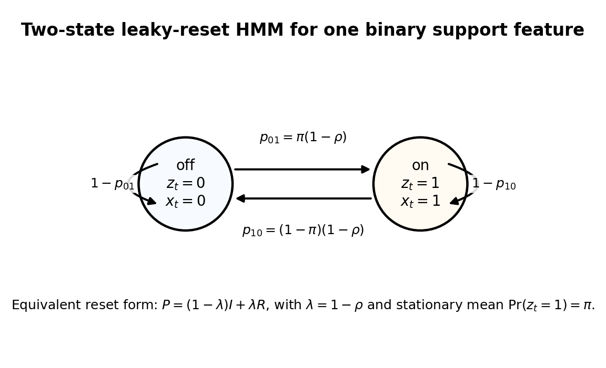

This picture is the generator behind Sections 2–4 whenever I talk about a single persistent binary feature.

---

## 1. Zeroth-order base case: the static Chanin toy

This is the “no time at all” benchmark. It is the correct base case for the whole temporal story.

### 1.1 Objects and dimensions

| symbol | shape | meaning |
|---|---:|---|
| \(f_i\) | \(\mathbb R^d\) | true feature \(i\) |
| \(F=[f_1,\dots,f_g]\) | \(\mathbb R^{d\times g}\) | true feature matrix |
| \(s\) | \(\{0,1\}^g\) | support pattern for one sample |
| \(h\) | \(\mathbb R_{\ge 0}^g\) | amplitudes / magnitudes |
| \(x\) | \(\mathbb R^d\) | synthetic activation fed to the SAE |
| \(m\) | integer | number of learned SAE latents |

To make the notation transparent, I will write the generator as

\[ x = F(s\odot h) = \sum_{i=1}^g s_i h_i f_i. \]

This is exactly the same information as “a set of feature embeddings \(f_i\) and a sparse support law.” It is just written in matrix form so the dimensions are obvious.

### 1.2 How this static toy sits inside the reset/HMM framework

There are two ways to view the static toy as a degenerate temporal model.

1. **Joint-support-pattern view.**  
   Let the hidden state be the entire support pattern \(a_t=s_t\in\{0,1\}^g\). Then define
   \[ \Pr(a_{t+1}=a') = q(a') \]
   independently of \(a_t\). This is the \(\lambda=1\) reset limit on the **joint support space**.

2. **Per-feature view.**  
   If the support law factorizes, then each \(s_{t,i}\) is just the \(\rho_i=0\) limit of the two-state reset process.

The first view is the right one for the full Chanin correlated-support toy. The second view is only correct when the support law factorizes across features.

A picture of the first view:

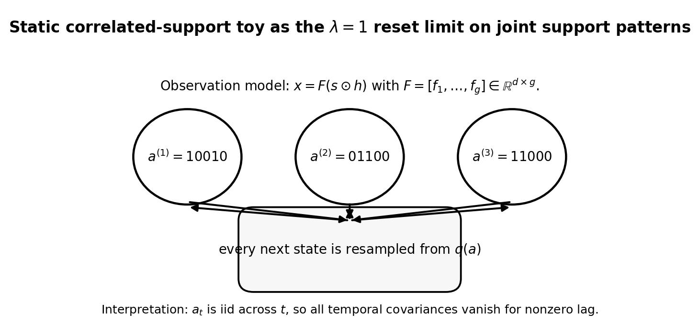

The important consequence is

\[ \mathrm{Cov}(s_{t,i},s_{t+\tau,j}) = 0 \qquad \text{for all } \tau\neq 0. \]

There is no temporal signal. Any temporal architecture can only reduce to a static one here.

### 1.3 Two-feature low-\(L0\) calculation

This is the first competition problem that matters.

#### Generator

Take two orthonormal true features

\[ f_1,f_2\in\mathbb R^d,\qquad f_1^\top f_2=0,\qquad \|f_1\|=\|f_2\|=1, \]

and four event types:

\[ x=0 \quad (P_0),\qquad x=\mu_1 f_1 \quad (P_1),\qquad x=\mu_2 f_2 \quad (P_2),\qquad x=\mu_1 f_1+\mu_2 f_2 \quad (P_{12}), \]

where \(P_0+P_1+P_2+P_{12}=1\), and \(\mu_1,\mu_2>0\) are scalar magnitudes.

> **Important:** here \(\mu_1,\mu_2\) are **scalars**, not dimensions and not SAE widths.

The true average support budget is

\[ L0_{\mathrm{true}} = P_1+P_2+2P_{12}. \]

So a Top-1 SAE is under-budget whenever \(L0_{\mathrm{true}}>1\).

#### Learned dictionary ansatz

Take a Top-1 tied SAE with unit-norm decoder directions

\[ \ell_2=f_2,\qquad \ell_1(\alpha)=\frac{\alpha f_1+(1-\alpha)f_2}{\sqrt{\alpha^2+(1-\alpha)^2}}, \qquad \frac12\le \alpha\le 1. \]

Interpretation:

- \(\alpha=1\): perfectly disentangled latent for \(f_1\),
- \(\alpha<1\): learned latent for \(f_1\) has mixed in some component of \(f_2\).

Because the SAE is tied and Top-1, reconstructing with active latent \(\ell\) means

\[ \hat x = (\ell^\top x)\ell. \]

#### Case A: only feature 1 fires

If \(x=\mu_1 f_1\), Top-1 picks \(\ell_1\), so

\[ \hat x = \frac{\mu_1\alpha}{\sqrt{\alpha^2+(1-\alpha)^2}}\ell_1 = \frac{\mu_1\alpha^2}{\alpha^2+(1-\alpha)^2}f_1 + \frac{\mu_1\alpha(1-\alpha)}{\alpha^2+(1-\alpha)^2}f_2. \]

Hence

\[ L_1(\alpha) = \|\mu_1f_1-\hat x\|_2^2 = \mu_1^2\frac{(1-\alpha)^2}{\alpha^2+(1-\alpha)^2}. \]

So mixing hurts single-feature-\(1\) samples.

#### Case B: only feature 2 fires

If \(x=\mu_2 f_2\), Top-1 picks \(\ell_2=f_2\), and

\[ L_2 = 0. \]

#### Case C: both features fire

If \(x=\mu_1f_1+\mu_2f_2\), then in the symmetric regime \(\alpha\ge 1/2\), Top-1 picks \(\ell_1\), so

\[ \hat x = \frac{\mu_1\alpha+\mu_2(1-\alpha)}{\alpha^2+(1-\alpha)^2} \big(\alpha f_1 + (1-\alpha)f_2\big). \]

A short calculation gives

\[ L_{12}(\alpha) = \frac{(\mu_1(1-\alpha)-\mu_2\alpha)^2}{\alpha^2+(1-\alpha)^2}. \]

This is the key term:

- if \(\alpha=1\), the latent only tracks \(f_1\) and misses the \(f_2\) part, so
  \[ L_{12}(1)=\mu_2^2; \]
- if \(\mu_1=\mu_2\) and \(\alpha=1/2\), then the mixed latent perfectly fits the co-firing event:
  \[ L_{12}(1/2)=0. \]

So static feature mixing is simply a loss-optimal way to compress co-firing structure when the latent budget is too small.

### 1.4 Expected loss and exact optimizer

In the equal-magnitude case \(\mu_1=\mu_2=\mu\), the expected reconstruction loss is

\[ \mathcal E(\alpha) = \mu^2\, \frac{P_1(1-\alpha)^2 + P_{12}(1-2\alpha)^2}{\alpha^2+(1-\alpha)^2}. \]

Differentiating gives

\[ \mathcal E'(\alpha) = 2\mu^2 \frac{P_1\alpha^2 - P_1\alpha + 2P_{12}\alpha - P_{12}} {(\alpha^2+(1-\alpha)^2)^2}. \]

Two consequences:

1. at the disentangled point \(\alpha=1\),
   \[ \mathcal E'(1)=2\mu^2P_{12}>0 \qquad\text{whenever } P_{12}>0, \]
   so the correct dictionary is not even a local minimum once the true features sometimes co-fire;

2. the exact stationary point is
   \[ \alpha^\star = \frac{P_1-2P_{12}+\sqrt{P_1^2+4P_{12}^2}}{2P_1}. \]

Interpretation:

- \(P_{12}=0 \Rightarrow \alpha^\star=1\): no mixing,
- \(P_{12}\ll P_1 \Rightarrow \alpha^\star\approx 1-P_{12}/P_1\): weak mixing,
- \(P_{12}\gg P_1 \Rightarrow \alpha^\star\to 1/2\): nearly equal mixture.

### 1.5 Tiny numerical example

Take

\[ P_1=P_2=0.25,\qquad P_{12}=0.30,\qquad P_0=0.20,\qquad \mu=1. \]

Then

\[ L0_{\mathrm{true}} = 0.25+0.25+2(0.30)=1.10, \]

so a Top-1 SAE is under-budget.

The exact optimizer is

\[ \alpha^\star = \frac{0.25-0.60+\sqrt{0.25^2+4(0.30)^2}}{0.50} = 0.60. \]

The loss at the disentangled dictionary is

\[ \mathcal E(1)=0.30, \]

while at the mixed optimum

\[ \mathcal E(0.60)=0.10. \]

So the wrong latent is **three times better in MSE** than the correct one.

### 1.6 Tiny theory-vs-experiment check

A small Monte Carlo simulation agrees with the theory curve. In the same example, the simulation gives approximately

- disentangled loss: \(0.299\),
- mixed-optimum loss: \(0.100\),

which matches the analytic values \(0.30\) and \(0.10\) to Monte Carlo error.

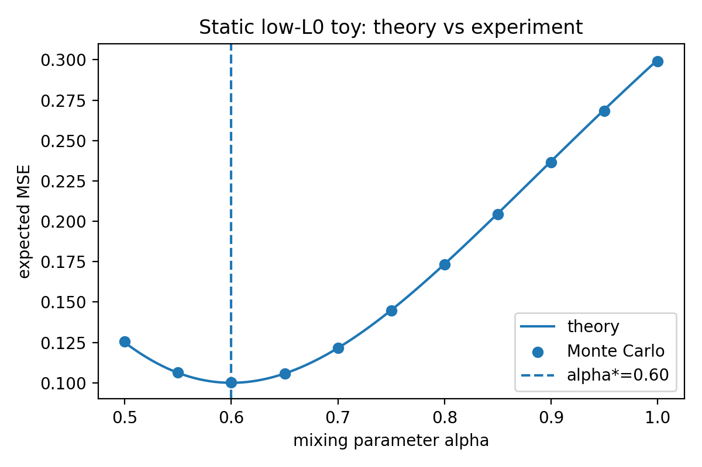

### 1.7 Pedagogical takeaway

The static Chanin toy is the correct **Level 0 benchmark**:

- it isolates **feature competition under an insufficient latent budget**;
- it has no temporal information at all;
- any temporal improvement above this level has to come from genuine cross-token information, not from the static hedging effect.

---

## 2. Regular SAE on persistent HMM / reset-process data

### 2.1 Objects and dimensions

| symbol | shape | meaning |
|---|---:|---|
| \(d_i\) | \(\mathbb R^d\) | true direction for feature \(i\) |
| \(s_{t,i}\) | \(\{0,1\}\) | binary support of feature \(i\) at token \(t\) |
| \(x_t\) | \(\mathbb R^d\) | observed activation |
| \(u_i\) | scalar | aligned local gain of learned latent \(i\) |
| \(h_{t,i}\) | scalar | learned latent activation after ReLU |
| \(\lambda_h\) | scalar | sparsity penalty coefficient |

The generator is

\[ x_t = \sum_{i=1}^g s_{t,i} d_i, \qquad d_i^\top d_j = \delta_{ij}, \]

with each \(s_{t,i}\) an independent copy of the two-state reset HMM from the picture above.

### 2.2 Aligned SAE reduction

In the monosemantic aligned basin for feature \(i\), set the learned decoder direction equal to the true one and take encoder vector \(e_i=d_i\). Put the bias at

\[ b_i=u_i-1. \]

Then

\[ e_i^\top x_t + b_i = s_{t,i}+u_i-1, \]

and the ReLU activation is

\[ h_{t,i} = \mathrm{ReLU}(s_{t,i}+u_i-1). \]

In the healthy regime \(0<u_i<1\),

- if \(s_{t,i}=0\), then \(h_{t,i}=0\),
- if \(s_{t,i}=1\), then \(h_{t,i}=u_i\).

So

\[ h_{t,i}=u_i s_{t,i}. \]

### 2.3 Population loss

The reconstruction error only appears on tokens where the feature is on, so

\[ \mathcal L_i = \pi_i\left[\frac12(1-u_i)^2 + \lambda_h u_i\right]. \]

This depends on the stationary one-time marginal

\[ \pi_i=\Pr(s_{t,i}=1), \]

but **not** on the persistence parameter \(\rho_i\).

That is the clean theorem for regular SAEs:

> A time-local SAE trained on single tokens from a stationary HMM is population-equivalent to training on iid samples from the stationary one-token marginal.

### 2.4 Exact full-batch GD

Differentiating gives

\[ \frac{\partial \mathcal L_i}{\partial u_i} = \pi_i(u_i-1+\lambda_h), \]

so gradient descent with learning rate \(\eta\) satisfies

\[ u_{i,n+1} = (1-\eta\pi_i)u_{i,n} + \eta\pi_i(1-\lambda_h). \]

Therefore

\[ u_{i,n} = (1-\lambda_h) + \big(u_{i,0}-(1-\lambda_h)\big)(1-\eta\pi_i)^n. \]

The fixed point is

\[ u_i^\star = 1-\lambda_h. \]

The learning speed is set by \(\eta\pi_i\), not by \(\rho_i\).

### 2.5 Tiny numerical example

Take

\[ \pi=0.2,\qquad \lambda_h=0.1,\qquad \eta=0.4,\qquad u_0=10^{-3}. \]

Then

\[ u_{n+1}=0.92u_n + 0.072. \]

After 20 full-batch steps,

\[ u_{20} = 0.9 + (10^{-3}-0.9)(0.92)^{20} \approx 0.730365. \]

This number should not change when \(\rho\) changes, as long as \(\pi\) is held fixed.

### 2.6 Tiny theory-vs-experiment check

**Full-batch learning curve**

| \(\rho\) | empirical \(\pi\) | \(u_{20}\) theory | \(u_{20}\) experiment | abs. error |
|---:|---:|---:|---:|---:|
| 0.0 | 0.200051 | 0.730365 | 0.730436 | \(7.2\times 10^{-5}\) |
| 0.5 | 0.200441 | 0.730365 | 0.730998 | \(6.3\times 10^{-4}\) |
| 0.8 | 0.199643 | 0.730365 | 0.729815 | \(5.5\times 10^{-4}\) |

**Contiguous-batch gradient noise**

For contiguous minibatches of size \(B\),

\[ \mathrm{Var}(\bar g_B) = \frac{(u-1+\lambda_h)^2\pi(1-\pi)}{B^2} \left[ B + 2\sum_{\tau=1}^{B-1}(B-\tau)\rho^\tau \right]. \]

Equivalently,

\[ B_{\mathrm{eff}} \approx B\frac{1-\rho}{1+\rho}. \]

Numerically, for \(u=0.3\) and \(B=32\):

| \(\rho\) | variance theory | variance experiment | abs. error |
|---:|---:|---:|---:|
| 0.0 | 0.001800 | 0.001803 | \(3\times 10^{-6}\) |
| 0.5 | 0.005175 | 0.005159 | \(1.6\times 10^{-5}\) |
| 0.8 | 0.013952 | 0.013919 | \(3.3\times 10^{-5}\) |

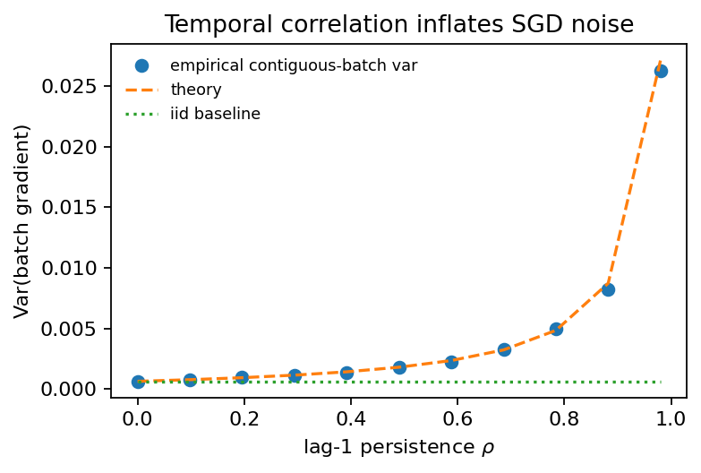

### 2.7 Pedagogical takeaway

For a regular SAE:

- the **population optimum** is blind to persistence;
- persistence only re-enters through **SGD noise** or through architectural changes that explicitly use time.

That is why temporal architectures matter: the standard SAE really does throw away the transition matrix at population level.

---

## 3. Proposal 3A and the simplest temporal XC

The first genuinely temporal model is the one-feature temporal filter.

### 3.1 Objects and dimensions

| symbol | shape | meaning |
|---|---:|---|
| \(s_t\) | \(\{0,1\}\) | one binary support bit |
| \(\xi_t=s_t-\pi\) | scalar | centered support |
| \(u\) | scalar | local gain |
| \(\beta\) | scalar | one-lag temporal-copy weight |
| \(h_t\) | scalar | local latent |
| \(\tilde h_t\) | scalar | temporally corrected latent |

The generator is still the same binary reset HMM from the picture in Section 0.5.

### 3.2 Proposal 3A: one temporal self-connection

The simplest temporal layer is

\[ h_t = u\xi_t,\qquad \tilde h_t = h_t + \beta h_{t-1}. \]

The target is the centered scalar \(\xi_t\). The population loss is

\[ \mathcal L(u,\beta) = \frac12\Big( C_0 - 2u(C_0+\beta C_1) +u^2(C_0+2\beta C_1+\beta^2C_0) \Big) +\lambda_h\pi u +\frac{\lambda_\beta}{2}\beta^2. \]

### 3.3 Solve the one-lag model

At fixed \(u\),

\[ \beta^\star(u) = \frac{u(1-u)C_1}{u^2C_0+\lambda_\beta}. \]

If \(\lambda_\beta=0\), this simplifies to

\[ \beta^\star = \frac{C_1}{C_0}\frac{1-u^\star}{u^\star} = \rho\frac{1-u^\star}{u^\star}. \]

So the temporal correction is directly proportional to persistence.

Plugging this back into the loss gives

\[ u^\star = 1-\frac{\lambda_h\pi}{C_0-C_1^2/C_0}. \]

For the reset family \(C_1=\rho C_0\), so

\[ u^\star = 1-\frac{\lambda_h\pi}{C_0(1-\rho^2)}. \]

Interpretation: persistence increases the value of temporal coupling, which in turn changes how much of the job is done locally versus through time.

### 3.4 Tiny numerical example

Take empirical moments from a long reset-process simulation:

\[ \pi=0.2,\qquad \rho\approx 0.706,\qquad C_0\approx 0.161285,\qquad C_1\approx 0.113829, \]

and choose

\[ \lambda_h=0.15,\qquad \lambda_\beta=0. \]

Then

\[ u^\star = 1-\frac{0.15\cdot 0.2}{C_0-C_1^2/C_0} \approx 0.629390, \]

and

\[ \beta^\star = \frac{C_1}{C_0}\frac{1-u^\star}{u^\star} \approx 0.415584. \]

So the model uses both a local term and a genuinely temporal term.

### 3.5 Simplest two-layer temporal XC

Now suppose the same scalar latent is read from two source layers:

\[ y_t^{(1)}=\xi_t,\qquad y_t^{(2)}=\xi_t. \]

Use scalar read-in weights \(c_1,c_2\), so the local read-in is

\[ h_t = (c_1+c_2)\xi_t = u\xi_t. \]

Then apply the same one-lag temporal correction

\[ \tilde h_t = h_t + \beta h_{t-1}. \]

If the two source-layer read-ins have \(L_2\) penalties \(\lambda_{e,1}\) and \(\lambda_{e,2}\), the best split at fixed total gain \(u=c_1+c_2\) is

\[ c_1^\star = \frac{\lambda_{e,2}}{\lambda_{e,1}+\lambda_{e,2}}u, \qquad c_2^\star = \frac{\lambda_{e,1}}{\lambda_{e,1}+\lambda_{e,2}}u. \]

So with equal penalties,

\[ c_1^\star=c_2^\star=\frac{u}{2}. \]

The effective encoder penalty is the harmonic-mean combination

\[ \lambda_{\mathrm{eff}} = \frac{\lambda_{e,1}\lambda_{e,2}}{\lambda_{e,1}+\lambda_{e,2}}. \]

With total decoder energy \(E_D\), the optimal local gain becomes

\[ u^\star_{\mathrm{XC}} = \frac{E_D(C_0-C_1^2/C_0)-\lambda_h\pi} {E_D(C_0-C_1^2/C_0)+\lambda_{\mathrm{eff}}}, \]

and the temporal weight is

\[ \beta^\star_{\mathrm{XC}} = \frac{C_1}{C_0}\frac{1-u^\star_{\mathrm{XC}}}{u^\star_{\mathrm{XC}}}. \]

### 3.6 Tiny theory-vs-experiment check

Using the same empirical moments, and in the XC taking

\[ E_D=2,\qquad \lambda_{e,1}=\lambda_{e,2}=0.2, \]

we get:

| model | \(u^\star\) theory | \(u^\star\) experiment | \(\beta^\star\) theory | \(\beta^\star\) experiment |
|---|---:|---:|---:|---:|
| Proposal 3A | 0.629390 | 0.629390 | 0.415584 | 0.415584 |
| 2-layer XC | 0.503618 | 0.503618 | 0.695626 | 0.695626 |

For the layer split:

| parameter | theory | experiment |
|---|---:|---:|
| \(c_1\) | 0.251809 | 0.251809 |
| \(c_2\) | 0.251809 | 0.251809 |

### 3.7 Pedagogical takeaway

This section is the first place where time enters the **objective**, not just SGD noise.

- Proposal 3A learns a true temporal filter.
- The simplest two-layer XC does not change the temporal formula much.
- What it adds is a **layer-allocation problem**, and that problem solves exactly.

---

## 4. Window-\(T\) temporal XC and observability

The one-lag model is only the first nontrivial truncation. The full windowed TXC is an exact Toeplitz Wiener-filter problem.

### 4.1 Objects and dimensions

| symbol | shape | meaning |
|---|---:|---|
| \(y_t^{(1)},y_t^{(2)}\) | scalars here | two source-layer observations of the same hidden scalar |
| \(c_{1,\tau},c_{2,\tau}\) | scalars | lag-\(\tau\) read-in weights for the two layers |
| \(\alpha_\tau\) | scalar | effective lag weight \(c_{1,\tau}+c_{2,\tau}\) |
| \(\alpha\) | \(\mathbb R^T\) | vector of effective lag weights |
| \(K_T\) | \(\mathbb R^{T\times T}\) | Toeplitz covariance matrix |
| \(\kappa_T\) | \(\mathbb R^T\) | covariance vector \((C_0,\ldots,C_{T-1})^\top\) |

I write \(\kappa_T\) rather than \(c_T\) in this rewrite to avoid confusing a covariance vector with the block label \(c\) used later in the direct-sum sections.

### 4.2 Generator and objective

Take two noisy copies of the same centered hidden scalar:

\[ y_t^{(1)} = \xi_t + \varepsilon_t^{(1)},\qquad y_t^{(2)} = \xi_t + \varepsilon_t^{(2)}, \]

with independent Gaussian noises of variances \(\sigma_1^2,\sigma_2^2\).

A window-\(T\) temporal XC forms

\[ h_t = \sum_{\tau=0}^{T-1} \big( c_{1,\tau}y_{t-\tau}^{(1)} + c_{2,\tau}y_{t-\tau}^{(2)} \big). \]

The centered population objective is

\[ \mathcal L_T(c) = \frac{E_D}{2}\Big(C_0 - 2k_T^\top c + c^\top \Sigma_T c\Big) + \frac12 c^\top \Lambda c, \]

where

\[ \kappa_T=(C_0,C_1,\ldots,C_{T-1})^\top\in\mathbb R^T, \qquad k_T=\begin{bmatrix}\kappa_T\\ \kappa_T\end{bmatrix}\in\mathbb R^{2T}, \]

and

\[ K_T=[C_{|i-j|}]_{i,j=0}^{T-1}\in\mathbb R^{T\times T}, \]

\[ \Sigma_T= \begin{bmatrix} K_T+\sigma_1^2 I_T & K_T\\ K_T & K_T+\sigma_2^2 I_T \end{bmatrix} \in \mathbb R^{2T\times 2T}. \]

### 4.3 Reduce the two-layer problem to one lag profile

Only the sum

\[ \alpha_\tau := c_{1,\tau}+c_{2,\tau} \]

carries signal. The optimal split at each lag is

\[ c_{1,\tau}^\star = \frac{r_2}{r_1+r_2}\alpha_\tau,\qquad c_{2,\tau}^\star = \frac{r_1}{r_1+r_2}\alpha_\tau, \]

where

\[ r_1 = E_D\sigma_1^2+\lambda_{e,1},\qquad r_2 = E_D\sigma_2^2+\lambda_{e,2}. \]

The effective scalar lag-profile problem is

\[ \mathcal L_T(\alpha) = \frac{E_D}{2}\Big(C_0 - 2\kappa_T^\top\alpha + \alpha^\top K_T\alpha\Big) + \frac{r_{\mathrm{eff}}}{2}\|\alpha\|_2^2, \]

with

\[ r_{\mathrm{eff}}=\frac{r_1r_2}{r_1+r_2}, \qquad \gamma_{\mathrm{eff}}=\frac{r_{\mathrm{eff}}}{E_D}. \]

Therefore the exact optimum is

\[ \alpha_T^\star = (K_T+\gamma_{\mathrm{eff}}I_T)^{-1}\kappa_T. \]

And full-batch GD is linear:

\[ \alpha_{n+1} = \alpha_n-\eta E_D\big((K_T+\gamma_{\mathrm{eff}}I_T)\alpha_n-\kappa_T\big). \]

### 4.4 Tiny worked case: \(T=2\)

For \(T=2\),

\[ K_2= \begin{bmatrix} C_0 & C_1\\ C_1 & C_0 \end{bmatrix}, \qquad \kappa_2= \begin{bmatrix} C_0\\ C_1 \end{bmatrix}. \]

So

\[ \alpha_2^\star = (K_2+\gamma I)^{-1}\kappa_2 = \frac{1}{(C_0+\gamma)^2-C_1^2} \begin{bmatrix} C_0(C_0+\gamma)-C_1^2\\ C_1\gamma \end{bmatrix}. \]

Interpretation:

- if \(\gamma=0\), then \(\alpha_2^\star=(1,0)\): the current token is enough;
- if \(\gamma>0\), the lag-1 term becomes useful.

### 4.5 Exact gain from increasing \(T\)

The minimum loss is

\[ \mathcal L_T^\star = \frac{E_D}{2}\Big(C_0-\kappa_T^\top(K_T+\gamma I_T)^{-1}\kappa_T\Big). \]

Moving from window \(T\) to \(T+1\), write the enlarged regularized covariance as

\[ K_{T+1}+\gamma I_{T+1} = \begin{bmatrix} Q_T & b_T\\ b_T^\top & C_0+\gamma \end{bmatrix}, \]

where \(Q_T=K_T+\gamma I_T\in\mathbb R^{T\times T}\) and \(b_T=(C_T,C_{T-1},\ldots,C_1)^\top\in\mathbb R^T\).  
Then the Schur-complement increment is

\[ \mathcal L_T^\star-\mathcal L_{T+1}^\star = \frac{E_D}{2} \frac{\big(C_T-b_T^\top Q_T^{-1}\kappa_T\big)^2} {C_0+\gamma-b_T^\top Q_T^{-1}b_T} \ge 0. \]

So larger windows can only help.

### 4.6 Tiny theory-vs-experiment check

Using a reset process with

\[ \pi=0.2,\qquad \rho=0.7,\qquad \sigma_1=0.4,\qquad \sigma_2=0.8,\qquad E_D=2,\qquad \lambda_{e,1}=\lambda_{e,2}=0.1, \]

the population optimum and empirical ridge-regression optimum agree:

| \(T\) | loss theory | loss experiment | \(\|\alpha_{\rm exp}-\alpha_{\rm th}\|_2\) |
|---:|---:|---:|---:|
| 1 | 0.080506 | 0.080442 | 0.000155 |
| 2 | 0.069216 | 0.069155 | 0.000851 |
| 4 | 0.067067 | 0.067009 | 0.001387 |

Selected lag weights:

| \(T\) | lag | \(\alpha_{\rm theory}\) | \(\alpha_{\rm experiment}\) | abs. error |
|---:|---:|---:|---:|---:|
| 2 | 0 | 0.429912 | 0.430243 | 0.000331 |
| 2 | 1 | 0.199948 | 0.199690 | 0.000258 |
| 4 | 0 | 0.416563 | 0.416725 | 0.000163 |
| 4 | 1 | 0.171256 | 0.171176 | 0.000080 |
| 4 | 2 | 0.071521 | 0.071443 | 0.000078 |
| 4 | 3 | 0.033723 | 0.033691 | 0.000032 |

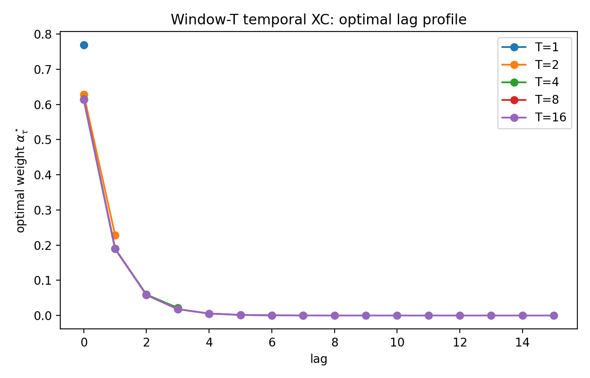

### 4.7 When bigger windows reveal genuinely new directions: observability

The previous subsection is still “one hidden scalar plus noise.” In that setting, bigger \(T\) only improves a filter.

To make bigger \(T\) reveal **new hidden directions**, we need local aliasing.

For this subsection only, I use the standard control-style convention:

- hidden state \(z_t\in\mathbb R^K\) is a \(K\)-dimensional one-hot state vector,
- transition matrix \(P\in\mathbb R^{K\times K}\),
- observation matrix \(B\in\mathbb R^{d_{\rm obs}\times K}\).

Then the \(T\)-step observability matrix is

\[ \mathcal O_T = \begin{bmatrix} B\\ BP\\ \vdots\\ BP^{T-1} \end{bmatrix} \in\mathbb R^{Td_{\rm obs}\times K}. \]

Interpretation:

- if \(\mathrm{rank}(\mathcal O_T)=\mathrm{rank}(B)\), then time only denoises;
- if \(\mathrm{rank}(\mathcal O_T)>\mathrm{rank}(B)\), then time reveals new hidden directions.

A locally aliased HMM looks like this:

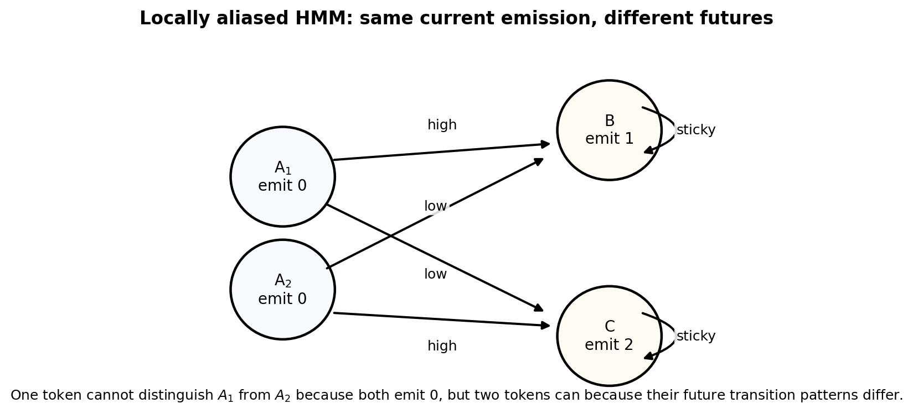

A tiny concrete example is

\[ B= \begin{bmatrix} 1 & 1 & 0\\ 0 & 0 & 1 \end{bmatrix}, \qquad P= \begin{bmatrix} 0.1 & 0.1 & 0.8\\ 0.8 & 0.1 & 0.1\\ 0.1 & 0.1 & 0.8 \end{bmatrix}. \]

Then

\[ \mathrm{rank}(B)=2,\qquad \mathrm{rank}(\mathcal O_2)=3. \]

So a two-token window reveals a hidden distinction that one token cannot.

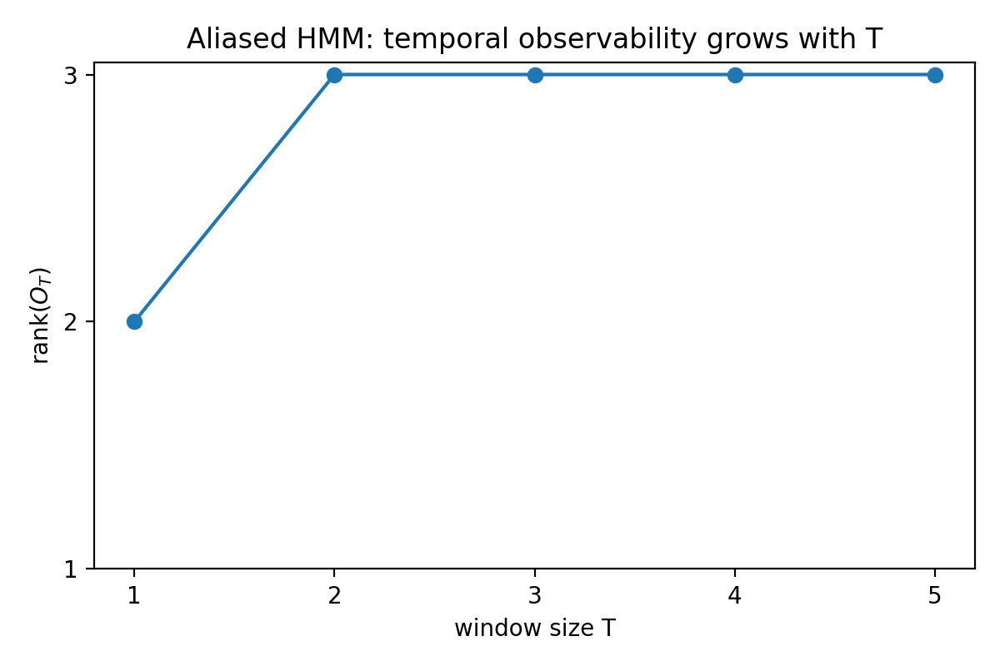

### 4.8 Pedagogical takeaway

Window size \(T\) does two different jobs:

1. in a one-hidden-scalar problem, it improves a Wiener filter;
2. in a locally aliased HMM, it reveals genuinely new hidden directions.

That distinction is the right answer to “what harder HMM should we use?”

---

## 5. Proposal 5: shared temporal chain with factorial SAE emissions

Proposal 5 is the first architecture matched to a **shared low-rank temporal mode**, not just per-feature self-persistence.

### 5.1 Objects and dimensions

| symbol | shape | meaning |
|---|---:|---|
| \(h_t\) | \(\{1,\ldots,\chi\}\) | shared hidden state at time \(t\) |
| \(P\) | \(\mathbb R^{\chi\times \chi}\) | hidden-state transition matrix |
| \(B\) | \([0,1]^{m\times\chi}\) | emission probabilities; \(B_{k,h}=\Pr(s_{t,k}=1\mid h_t=h)\) |
| \(\gamma_t^{(T)}\) | \(\Delta^{\chi-1}\) | posterior over hidden states from a window of length \(T\) |
| \(q_{t,k}^{(T)}\) | scalar | posterior support probability for feature \(k\) |
| \(r_k\) | scalar | aligned learned gain for feature \(k\) |
| \(Q_{k,T}\) | scalar | posterior-explained support energy |

Here is the state model:

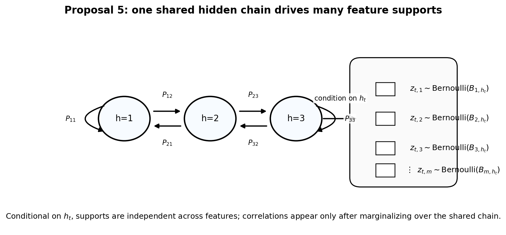

Conditional on \(h_t\), the feature supports are independent Bernoullis.

### 5.2 Posterior support statistic

The posterior support probability of feature \(k\) is

\[ q_{t,k}^{(T)} = \Pr(s_{t,k}=1\mid \mathcal F_t^{(T)}) = \sum_{h=1}^{\chi} B_{k,h}\,\gamma_t^{(T)}(h). \]

In the aligned orthogonal basin, reconstruct with

\[ \hat x_t = \sum_{k=1}^m r_k q_{t,k}^{(T)} d_k, \]

where \(d_k\in\mathbb R^d\) is the true direction for feature \(k\).

Define

\[ Q_{k,T}:=\mathbb E[(q_{t,k}^{(T)})^2]. \]

Then the population loss decouples by feature:

\[ \mathcal L_T(r) = \frac12\sum_k \pi_k - \sum_k Q_{k,T}r_k + \frac12\sum_k (Q_{k,T}+\lambda)r_k^2 + \lambda_s\sum_k \pi_k. \]

### 5.3 Exact gradient descent

The GD update for feature \(k\) is

\[ r_{k,n+1} = (1-\eta(Q_{k,T}+\lambda))r_{k,n} + \eta Q_{k,T}. \]

So the fixed point is

\[ r_{k,\star}^{(T)}=\frac{Q_{k,T}}{Q_{k,T}+\lambda}. \]

And

\[ Q_{k,T} = \pi_k - \mathbb E\big[\mathrm{Var}(s_{t,k}\mid \mathcal F_t^{(T)})\big]. \]

So \(Q_{k,T}\) is “how much of feature \(k\)’s support variance is explained by the temporal inference module.”

If the sigma-fields are nested as \(T\) grows, then

\[ Q_{k,T+1}-Q_{k,T} = \mathbb E\Big[\big(q_{t,k}^{(T+1)}-q_{t,k}^{(T)}\big)^2\Big] \ge 0. \]

So larger windows monotonically increase posterior-explained support energy.

### 5.4 Tiny numerical example

Take a binary hidden chain with persistence \(0.9\), with one noisy observation channel

\[ \Pr(y_t=1\mid h_t=1)=0.8,\qquad \Pr(y_t=1\mid h_t=0)=0.2, \]

and let the target support be \(s_t=h_t\). Then \(q_t^{(T)}=\Pr(h_t=1\mid y_{t-T+1:t})\) from exact filtering.

As \(T\) increases, \(Q_T=\mathbb E[q_t^2]\) increases, so the learned gain increases.

### 5.5 Tiny theory-vs-experiment check

With \(\lambda=0.1\) and 20 full-batch GD steps:

| \(T\) | \(Q_T\) | \(r_\star\) theory | \(r_{20}\) theory | \(r_{20}\) experiment | abs. error |
|---:|---:|---:|---:|---:|---:|
| 1 | 0.339451 | 0.772443 | 0.767038 | 0.766916 | 0.000122 |
| 3 | 0.375350 | 0.789628 | 0.786159 | 0.786508 | 0.000349 |
| 5 | 0.380171 | 0.791741 | 0.788476 | 0.788765 | 0.000289 |

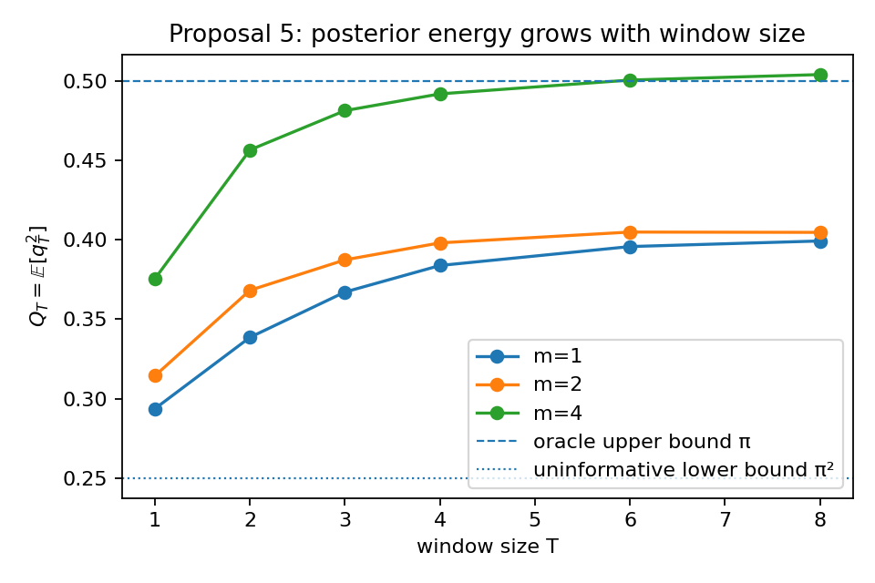

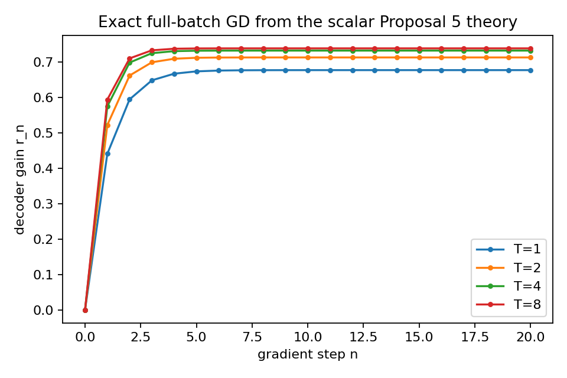

### 5.6 Pedagogical takeaway

Proposal 5 does not rank features by raw firing rate. It ranks them by

\[ Q_{k,T}=\mathbb E[(q_{t,k}^{(T)})^2]. \]

That is the quantity to watch when a shared temporal mode is disambiguating feature support.

---

## 6. Matched teacher processes and the Jordan-block family

The previous sections start from HMM supports. Now we flip the question:

> what process is a temporal XC *exactly matched to*?

The clean answer is a predictive-state / linear-Gaussian teacher.

### 6.1 Objects and dimensions

| symbol | shape | meaning |
|---|---:|---|
| \(z_t\) | \(\mathbb R^r\) | hidden continuous state |
| \(A\) | \(\mathbb R^{r\times r}\) | state transition matrix |
| \(x_t^{(1)},x_t^{(2)}\) | \(\mathbb R^{d_1},\mathbb R^{d_2}\) | source-layer observations |
| \(C_1,C_2\) | \(\mathbb R^{d_1\times r},\mathbb R^{d_2\times r}\) | source-layer readout matrices |
| \(y_t\) | \(\mathbb R^{d_y}\) | target to reconstruct |
| \(F\) | \(\mathbb R^{d_y\times r}\) | target readout matrix |

The teacher is

\[ z_{t+1}=Az_t+\xi_t,\qquad x_t^{(1)}=C_1z_t+\varepsilon_t^{(1)},\qquad x_t^{(2)}=C_2z_t+\varepsilon_t^{(2)},\qquad y_t=Fz_t+\zeta_t. \]

Because everything is jointly Gaussian, the Bayes-optimal MSE predictor from a length-\(T\) window is exactly linear.

### 6.2 Bayes-optimal linear predictor

Let \(Y_t\) be the stacked source-layer window. Then

\[ \hat y_t^\star = \Sigma_{yY}\Sigma_{YY}^{-1}Y_t. \]

So a temporal XC with enough width can realize the population optimum exactly by choosing

\[ W^\star = \Sigma_{zY}\Sigma_{YY}^{-1},\qquad D^\star = F. \]

This is why linear predictive-state teachers are the clean “optimal teacher” family for TXCs.

### 6.3 The Jordan-block teacher

The sharpest version is the \(r\)-dimensional Jordan block

\[ J_r(\rho)=\rho I_r + N, \]

where \(N\) is the nilpotent matrix with ones on the superdiagonal and zeros elsewhere. The teacher dynamics are

\[ z_{t+1}=J_r(\rho)z_t. \]

Take the simplest single-view observation

\[ s_t = e_1^\top z_t, \]

so only the first coordinate is directly observed.

#### What the hidden coordinates are

Write

\[ z_t= \begin{bmatrix} z_t^{(1)}\\ z_t^{(2)}\\ \vdots\\ z_t^{(r)} \end{bmatrix}. \]

Because the Jordan block shifts higher coordinates down one level each step, the deeper coordinates appear as discrete derivatives of the observed scalar stream.

If \(E\) is the forward-shift operator \((Es)_t=s_{t+1}\), then

\[ (E-\rho)^j s_t = z_t^{(j+1)}, \qquad j=0,1,\ldots,r-1. \]

So in the noiseless single-view case, a window of length \(T=r\) is enough to recover the full hidden state exactly.

### 6.4 Minimal useful window and multi-view scaling

For the single-view Jordan teacher, the minimal useful window is

\[ T_{\min}=r. \]

If you have \(q\) linearly independent instantaneous observation channels, the minimal useful window is the observability index of the pair \((A,C)\), and satisfies

\[ \left\lceil \frac{r}{q}\right\rceil \le T_{\min}\le r. \]

So two genuinely independent layers can reduce the needed window, but only if they contribute different instantaneous views.

### 6.5 Proposal 3A versus Proposal 3B

- Proposal 3A only does per-feature self-filtering. It helps when the hidden state is already locally visible and just needs denoising.
- Proposal 3B introduces a lower-rank temporal-driver state. That is much closer to the right inductive bias for Jordan teachers.
- To match the Jordan family **exactly**, Proposal 3B should allow cross-driver temporal mixing
  \[ g_{t+1}=Mg_t+Ua_t, \]
  with \(M\in\mathbb R^{r\times r}\), rather than only independent per-driver smoothing.

So the tensor-network / driver factorization helps here by giving the right **predictive-rank bottleneck**, but it does not beat the information-theoretic observability limit.

### 6.6 Tiny theory-vs-experiment check

Two useful summaries from the simulations are:

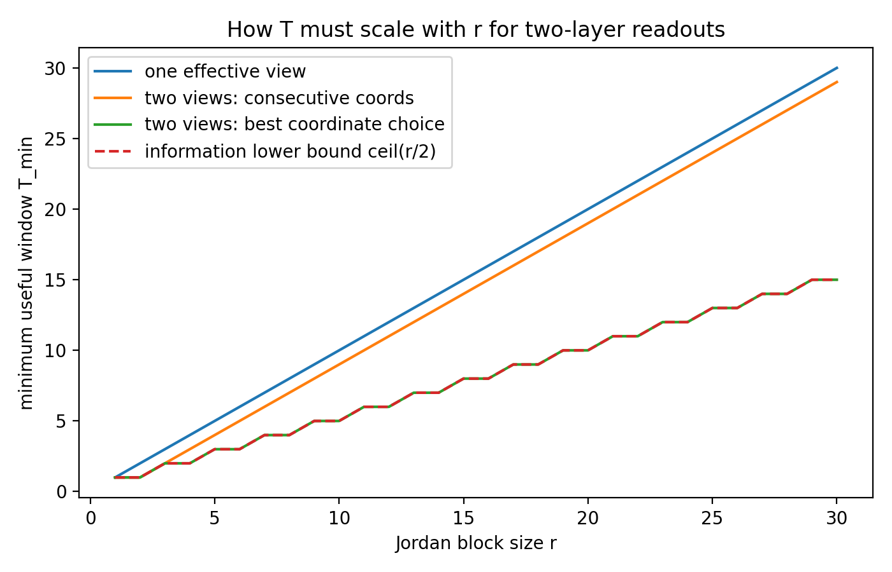

The qualitative law is simple:

- the noiseless information-theoretic threshold scales like \(T\sim r\) for a single local view;
- noise and conditioning determine how much larger than \(r\) you need to be in practice.

### 6.7 Pedagogical takeaway

The Jordan family is the cleanest exact benchmark where **time reveals hidden coordinates that do not exist in any single token**.

That makes it the right benchmark if we want TXCs to do more than denoise.

---

## 7. Direct sum of two leaky-reset processes

Now return to HMMs, but add a higher-level block choice.

### 7.1 Objects and dimensions

| symbol | shape | meaning |
|---|---:|---|
| \(c\) | \(\{1,2\}\) | sequence-level block label |
| \(P_1,P_2\) | square matrices | within-block transition matrices |
| \(P=P_1\oplus P_2\) | block-diagonal matrix | full transition operator |
| \(\eta_{1,t},\eta_{2,t}\) | simplices | within-block belief states |
| \(\omega_{1,t},\omega_{2,t}\) | scalars | posterior block weights, \(\omega_{1,t}+\omega_{2,t}=1\) |
| \(\eta_t\) | direct sum state | full belief state |
| \(U_t^{(T)}\) | integer | switch count in a length-\(T\) window |

The HMM/state model is:

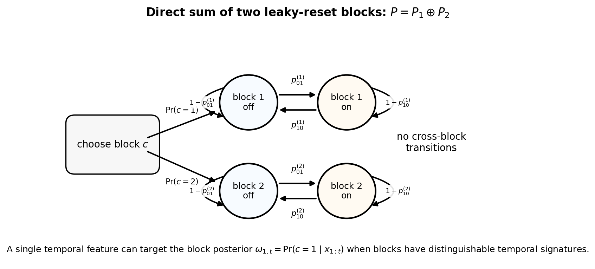

### 7.2 Belief-state decomposition

Because the two blocks do not mix,

\[ P=P_1\oplus P_2, \]

the belief state decomposes as

\[ \eta_t = \omega_{1,t}\eta_{1,t}\oplus \omega_{2,t}\eta_{2,t}. \]

So the genuinely nonlocal hidden variable is the **block posterior coefficient** \(\omega_{1,t}\).

This is the clean answer to your original question:

> yes, there is a limit where a single temporal feature can literally correspond to one latent coefficient of the belief state, namely the scalar block posterior \(\omega_{1,t}\).

### 7.3 Symmetric deterministic-emission benchmark

In the simplest symmetric benchmark:

- the two blocks have the same one-token marginal,
- but different persistence / switch statistics.

Then a window of length \(T\) is summarized by the switch count

\[ U_t^{(T)} = \#\{\tau\in\{t-T+2,\ldots,t\}: x_\tau\neq x_{\tau-1}\}. \]

The exact block posterior becomes logistic in this one scalar statistic:

\[ \omega_{1,t}^{(T)} = \sigma\big(\beta_0(T)+\beta_1 U_t^{(T)}\big). \]

So one scalar temporal statistic is sufficient, and one TXC feature can recover the belief-state coefficient up to an affine map or a sigmoid.

### 7.4 Linear TXC on the same benchmark

If the reconstruction target is linear in the block label, the best **linear** TXC feature is the centered switch-count mode.  
Write

- \(\sigma_{\mathrm w}^2\) for the within-block variance of that centered switch-count statistic,
- \(\Delta\) for the difference of its means between the two blocks,
- \(\kappa\) for the target-feature covariance with that statistic.

Then in the aligned scalar reduction, full-batch GD becomes

\[ \alpha_{n+1} = \bigl(1-\eta(\sigma_{\mathrm w}^2+n\Delta^2)\bigr)\alpha_n + \eta\kappa, \qquad n=T-1. \]

The useful window scale is

\[ T_{\mathrm{sig}}-1 \sim \frac{\sigma_{\mathrm w}^2}{\Delta^2}. \]

So the window needed to reliably recover the block posterior grows like an inverse square signal-to-noise ratio.

### 7.5 Tiny numerical example

In the symmetric binary-emission case, the posterior curves collapse neatly onto switch count:

A linear TXC then improves as the window grows:

And the corresponding full-batch GD trajectories follow the theory:

### 7.6 Pedagogical takeaway

This family is the first exact HMM benchmark where

- the right temporal feature is **not** a local support bit,
- it is a **belief-state coefficient**.

That makes it the right benchmark for the slogan  
**“one temporal feature = one posterior coefficient.”**

---

## 8. \(K\)-block direct sums: when one temporal feature is enough, and when it is not

The two-block benchmark generalizes in two qualitatively different ways.

### 8.1 Objects and dimensions

| symbol | shape | meaning |
|---|---:|---|
| \(c\) | \(\{1,\ldots,K\}\) | block label |
| \(\omega=(\omega_1,\ldots,\omega_K)\) | simplex point in \(\Delta^{K-1}\) | posterior over blocks |
| \(U\) | scalar or vector | temporal summary statistic(s) |
| \(M\) | integer | number of independent temporal channels |

State-model picture:

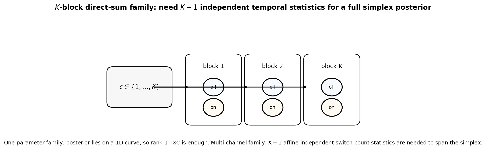

### 8.2 One-parameter \(K\)-block family: still rank 1

If blocks differ only by a single persistence parameter \(p_i\), then the sufficient statistic is still the scalar switch count \(U\), and the exact posterior is

\[ \omega_i(U)=\operatorname{softmax}_i(\alpha_i+\beta_i U). \]

Even though there are \(K\) blocks, the posterior simplex only traces out a **one-dimensional curve**.

So one scalar TXC feature is still enough.

This is why “more blocks” alone does **not** force a higher-dimensional temporal representation.

### 8.3 Genuine simplex family: need \(K-1\) independent signatures

To make the posterior genuinely \((K-1)\)-dimensional, we need \(K-1\) independent temporal statistics.

A clean matched construction is:

- use \(M\) independent temporal channels,
- give block \(i\) a switch-probability vector \(p_i\in(0,1)^M\),
- summarize a window by the count vector \(U\in\mathbb R^M\).

Then the posterior log-odds are affine in \(U\), and the informative linear rank is the affine rank of the set \(\{p_i\}\).

The first truly nontrivial case is

\[ K=3,\qquad M=2, \]

because that is the smallest setup where one scalar temporal feature is provably insufficient and the posterior actually fills a 2D simplex.

### 8.4 Tiny theory-vs-experiment checks

One-parameter family: the posterior lives on a 1D curve.

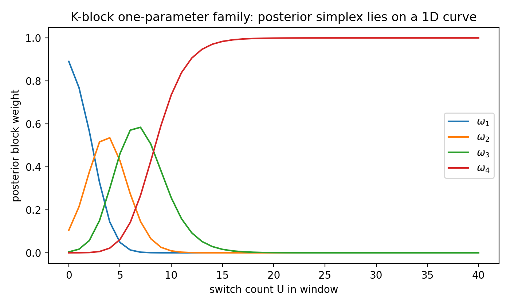

The informative singular values show the difference between the rank-1 family and the genuine simplex family.

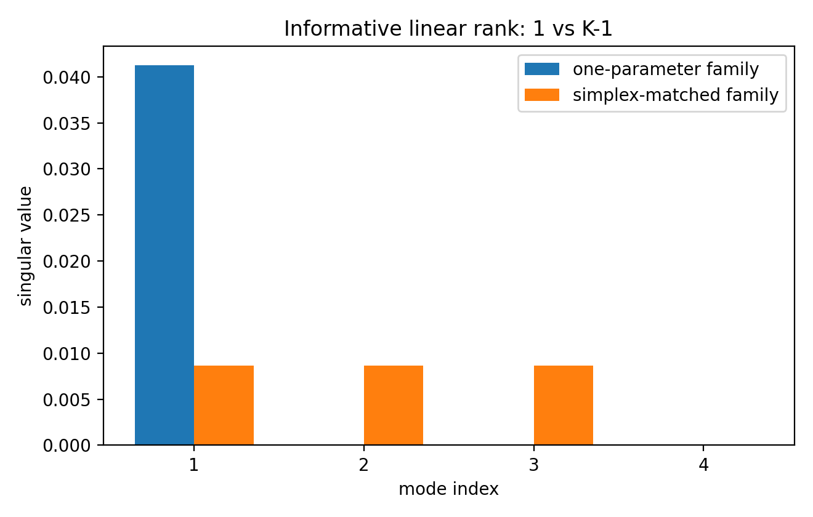

The useful window grows with \(K\) in the matched simplex construction.

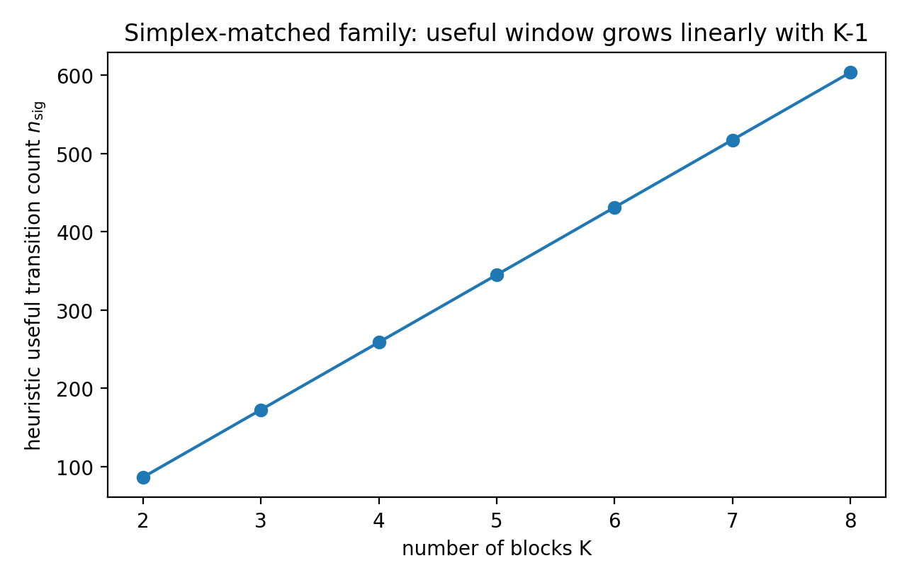

### 8.5 Pedagogical takeaway

There are really two different \(K\)-block stories:

1. **one-parameter family:** more blocks, but still one effective temporal statistic;
2. **simplex family:** \(K-1\) affine-independent temporal signatures, so \(K-1\) temporal features are structurally needed.

The second family is the right benchmark if you want temporal XC width to matter for structural reasons.

---

## 9. Global synthesis

Here is the clean map of what each benchmark is testing.

| level | benchmark | what makes it hard | what a temporal model can gain |
|---|---|---|---|
| 0 | static correlated-support / Chanin toy | co-firing under too-small \(L0\) | nothing temporal; only clarifies static feature hedging |
| 1 | regular SAE on reset HMM | persistence in supports | nothing at population level; only SGD-noise effects |
| 2 | Proposal 3A / one-lag XC | one hidden scalar with persistence | better temporal filtering |
| 3 | window-\(T\) XC | one hidden scalar plus noisy views | better Wiener filtering as \(T\) grows |
| 4 | aliased HMM / observability | hidden distinctions invisible in one token | genuinely new recoverable directions |
| 5 | Proposal 5 shared-chain HMM | cross-feature support patterns from one hidden mode | posterior-explained support energy |
| 6 | two-block direct sum | belief over blocks | a single TXC feature can recover a posterior coefficient |
| 7 | \(K\)-block simplex | high-dimensional posterior simplex | TXC width \(K-1\) becomes structurally necessary |

---

## 10. What I think is solved versus open

### 10.1 Essentially solved in the aligned / orthogonal basin

These are analytically clean:

- regular SAE on reset/HMM data;
- Proposal 3A one-feature temporal filter;
- simplest two-layer temporal XC;
- window-\(T\) TXC as Toeplitz Wiener filter;
- Proposal 5 gain dynamics in terms of \(Q_{k,T}\);
- Jordan-block observability benchmark;
- two-block and \(K\)-block direct-sum posterior benchmarks.

### 10.2 Still genuinely open

What remains hard is the first setting where **component assignment itself** changes because of time, not just denoising or gain-splitting:

- multiple ambiguous true features,
- finite-width latent budget,
- non-orthogonal / superposed decoder geometry,
- basin changes under ReLU / TopK,
- genuine competition among several temporal explanations.

That is where a temporal architecture could discover *different* features rather than just cleaner versions of the same ones.

---

## 11. Minimal notation glossary

This is the short glossary I wish had been at the front of the earlier draft.

| symbol | shape | meaning |
|---|---:|---|
| \(f_i\) | \(\mathbb R^d\) | true feature direction |
| \(F=[f_1,\dots,f_g]\) | \(\mathbb R^{d\times g}\) | true feature matrix |
| \(x_t\) | \(\mathbb R^d\) | observed activation |
| \(s_t\) | \(\{0,1\}^g\) or scalar | support bit/vector |
| \(h_t\) | varies | amplitude / local latent / hidden state, depending on section; always defined locally |
| \(a_t\) | \(\mathbb R^m\) | learned SAE latent code |
| \(g_t\) | \(\mathbb R^r\) | temporal driver state |
| \(P\) | square matrix | transition matrix |
| \(T\) | integer | TXC context-window length |
| \(\pi\) | scalar | stationary on-probability of a binary support |
| \(\rho\) | scalar | lag-1 correlation of a binary support |
| \(C_\tau\) | scalar | autocovariance \(\mathbb E[\xi_t\xi_{t+\tau}]\) |
| \(K_T\) | \(\mathbb R^{T\times T}\) | Toeplitz covariance matrix |
| \(\kappa_T\) | \(\mathbb R^T\) | covariance vector \((C_0,\ldots,C_{T-1})^\top\) |
| \(\omega_i\) | scalar | posterior probability / coefficient of block \(i\) |
| \(\gamma_t\) | simplex point | HMM posterior over hidden states |
| \(q_{t,k}^{(T)}\) | scalar | posterior support probability of feature \(k\) from a window |
| \(Q_{k,T}\) | scalar | posterior-explained support energy |

---

## 12. Source map

This note is the cleaned-up consolidation of the earlier working notes and the source architecture / reset-process writeups:

- temporal architecture note,
- modular-addition dynamics note,
- reset-process / HMM note,
- and the later working notes on the static Chanin base case, regular SAE, Proposal 3A / simplest TXC, window-\(T\) TXC, Proposal 5, Jordan teachers, and direct-sum belief-state benchmarks.

If I revise this again, the next useful step would be to apply the same notation discipline to the still-open multi-feature ambiguous temporal-competition setting.

