# Temporal SAE / TXC note — reorganized benchmark ladder

This version rewrites the earlier master note around the hierarchy you suggested:

1. **Exact solution for static Chanin-style SAEs.**
2. **Generalization to HMMs that only add temporal correlation.**
3. **Generalization to richer HMMs that reveal new latent information.**
4. **Continuous-state matched teachers (Jordan blocks) as a useful non-HMM analogue.**

The stylistic rule in this rewrite is:

- every benchmark starts with a **generator table** listing the objects and their dimensions;
- every genuinely temporal generator that is an HMM gets a **state diagram**;
- every benchmark has the same internal rhythm:
  1. referenced setup,
  2. pedagogical minimal example,
  3. exact solution,
  4. tiny numerical theory-vs-experiment check,
  5. takeaway.

## Global notation, dimensions, and Einstein translation

The single biggest source of ambiguity in earlier drafts was that I used symbols like \(f_i\) as **whole vectors**, while a physics reader often expects the subscripted object itself to be a scalar component. So here is the standing convention for the whole note.

### Index conventions

- activation-space indices: \(a,b=1,\dots,d\)
- true-feature indices: \(i,j=1,\dots,g\)
- learned-latent indices: \(\alpha,\beta=1,\dots,m\)
- temporal-driver indices: \(r,s=1,\dots,R\)
- HMM-state indices: \(u,v=1,\dots,\chi\)
- time index: \(t=1,\dots,L\)

Whenever I write \(f_i\) with **no activation index \(a\)**, I mean the **entire vector**
\[ f_i = (f_i^1,\dots,f_i^d)^\top \in \mathbb R^d. \]
The component form is \(f_i^a\). So:

- \(f_i\) = whole vector;
- \(f_i^a\) = \(a\)-th component of that vector.

Because everything lives in Euclidean spaces, I do **not** use upper/lower indices to distinguish covariant and contravariant objects; I only use Einstein summation as a compact bookkeeping device. So
\[ x = Fc \qquad\Longleftrightarrow\qquad x^a = F^a{}_i c^i = f_i^a c^i. \]

### Common objects

| current notation | shape | meaning | Einstein / component form |
|---|---:|---|---|
| \(f_i\) | \(\mathbb R^d\) | true feature vector \(i\) in activation space | \(f_i^a\) |
| \(F=[f_1,\dots,f_g]\) | \(\mathbb R^{d\times g}\) | true feature matrix / fixed embedding matrix | \(F^a{}_i=f_i^a\) |
| \(c\) | \(\mathbb R^g\) | true coefficient vector | \(c^i\) |
| \(x\) | \(\mathbb R^d\) | observed activation | \(x^a = F^a{}_i c^i\) |
| \(s\) | \(\{0,1\}^g\) | binary support vector | \(s^i\in\{0,1\}\) |
| \(h\) | \(\mathbb R_{\ge 0}^g\) | nonnegative amplitudes | \(h^i\) |
| \(c=s\odot h\) | \(\mathbb R^g\) | coefficient vector after support masking | \(c^i=s^i h^i\) |
| \(w_\alpha\) | \(\mathbb R^d\) | learned decoder column / learned latent direction | \(w_\alpha^a\) |
| \(W_{\mathrm{dec}}\) | \(\mathbb R^{d\times m}\) | learned decoder matrix | \((W_{\mathrm{dec}})^a{}_\alpha = w_\alpha^a\) |
| \(a\) | \(\mathbb R^m\) | learned latent code | \(a^\alpha\) |
| \(\hat x\) | \(\mathbb R^d\) | reconstruction | \(\hat x^a = (W_{\mathrm{dec}})^a{}_\alpha a^\alpha\) |
| \(P\) | square matrix | HMM transition matrix | \(P^u{}_v\) or \(P_{uv}\), depending on row/column convention |
| \(B\) | matrix | HMM emission / readout matrix | \(B^a{}_u\) or \(B_{au}\) |

### Two global conventions

1. **True features are columns of \(F\).**  
   If \(c_t\in\mathbb R^g\) is the ground-truth coefficient vector at time \(t\), then
   \[ x_t = Fc_t, \qquad\text{equivalently}\qquad x_t^a = F^a{}_i c_t^i. \]
   So yes: if you think of the toy model as having an “Embed layer” acting on the ground-truth features, that fixed embedding layer is exactly \(F\).

2. **“Orthogonal” always means orthogonal in activation space.**  
   Thus
   \[ f_i^\top f_j = 0 \quad\Longleftrightarrow\quad f_i^a f_j^a = 0 \qquad(i\neq j), \]
   and “orthonormal” means
   \[ f_i^\top f_j = \delta_{ij} \quad\Longleftrightarrow\quad f_i^a f_j^a = \delta_{ij}. \]

When later tables omit the “Einstein form” column, that is only because the new objects in that table are scalars, probabilities, or discrete states; all vector and matrix objects continue to follow the dictionary above.

---

## 1. Exact solution for static Chanin-style SAEs

### 1a. What the Chanin toy model actually is

The paper’s toy model is **not** intrinsically a two-feature model. The analytic theorem in the appendix is two-feature, but the generator used in the toy experiments already has:

- \(g\) true features,
- orthogonal true feature embeddings,
- a **correlated Bernoulli law** over the support vector \(s\),
- no temporal dependence between samples.

So the clean static generator is:

| object | shape | meaning | Einstein form |
|---|---:|---|---|
| \(s\) | \(\{0,1\}^g\) | binary support pattern for one sample | \(s^i\in\{0,1\}\) |
| \(h\) | \(\mathbb R_{\ge 0}^g\) | true amplitudes | \(h^i\) |
| \(c=s\odot h\) | \(\mathbb R^g\) | true coefficient vector | \(c^i=s^i h^i\) |
| \(F=[f_1,\dots,f_g]\) | \(\mathbb R^{d\times g}\) | fixed true embedding / feature dictionary | \(F^a{}_i=f_i^a\) |
| \(x=F(s\odot h)\) | \(\mathbb R^d\) | observed activation given to the SAE | \(x^a=F^a{}_i s^i h^i\) |

Equivalently,
\[ x = \sum_{i=1}^g s_i h_i f_i, \qquad\text{or}\qquad x^a = f_i^a s^i h^i. \]

So when the paper says “feature embeddings”, that is exactly the matrix \(F\) above: the true features live in coefficient space, and \(F\) maps them into activation space. This matches the paper’s toy setup: orthogonal feature embeddings are summed to form each activation, and the randomness enters through a correlated Bernoulli law on the support vector.

There is no time index in this benchmark. If we insist on viewing it as an HMM, the clean interpretation is:

- the hidden state is the **entire support pattern** \(s\in\{0,1\}^g\),
- at each sample we reset iid from the same distribution \(q(s)\),
- so this is the \(\lambda=1\) reset limit on the joint support-pattern state space.

That is why the static toy is the correct “zeroth-order” benchmark under the HMM ladder.

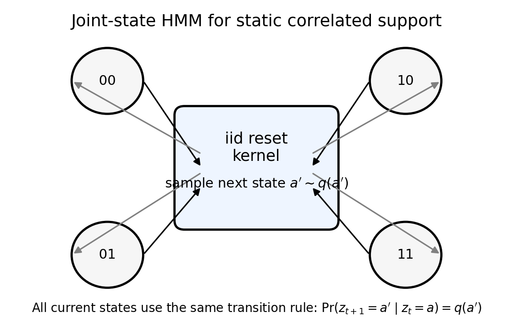

#### The true \(L0\) in the static toy

The true support budget is just the expected number of active true features:
\[ L0_{\mathrm{true}} = \mathbb E[\|s\|_0] = \sum_{S\subseteq\{1,\dots,g\}} q(S)\,|S| = \sum_{i=1}^g \Pr(s_i=1). \]

That last equality is just linearity of expectation:
\[ \|s\|_0 = \sum_{i=1}^g s_i, \qquad \mathbb E[\|s\|_0] = \sum_{i=1}^g \mathbb E[s_i] = \sum_{i=1}^g \Pr(s_i=1). \]

This is the general \(g\)-feature formula. The familiar two-feature shorthand
\[ L0_{\mathrm{true}} = P_1 + P_2 + 2P_{12} \]
is just the \(g=2\) special case, which I now unpack carefully.

### 1b. Pedagogical minimal example: two features, written slowly

Take two orthonormal true features
\[ f_1,f_2\in\mathbb R^d, \qquad f_i^\top f_j=\delta_{ij}, \qquad\text{equivalently}\qquad f_i^a f_j^a = \delta_{ij}. \]

The support vector is \(s=(s_1,s_2)\in\{0,1\}^2\). There are exactly four possible support patterns:

| support pattern \(s\) | event name | earlier shorthand | probability symbol used here | number of active true features |
|---|---|---|---:|---:|
| \((0,0)\) | neither fires | \(P_0\) | \(P_{00}\) | \(0\) |
| \((1,0)\) | only feature 1 fires | \(P_1\) | \(P_{10}\) | \(1\) |
| \((0,1)\) | only feature 2 fires | \(P_2\) | \(P_{01}\) | \(1\) |
| \((1,1)\) | both fire | \(P_{12}\) | \(P_{11}\) | \(2\) |

The four probabilities satisfy
\[ P_{00}+P_{10}+P_{01}+P_{11}=1. \]

If feature magnitudes are deterministic,
\[ h_1=\mu_1,\qquad h_2=\mu_2, \]
then the four possible activations are
\[ x=0,\qquad x=\mu_1 f_1,\qquad x=\mu_2 f_2,\qquad x=\mu_1 f_1+\mu_2 f_2. \]

Now the true \(L0\) is literally the expected number of active true features:
\[ L0_{\mathrm{true}} = 0\cdot P_{00} + 1\cdot P_{10} + 1\cdot P_{01} + 2\cdot P_{11} = P_{10}+P_{01}+2P_{11}. \]
If I revert to the earlier shorthand \(P_0,P_1,P_2,P_{12}\), this is exactly
\[ L0_{\mathrm{true}} = P_1 + P_2 + 2P_{12}. \]

So there is nothing mysterious about those \(P\)’s: they are just the four point masses of the two-bit support vector.

### 1c. Exact two-feature Top-1 solution

Now solve the first nontrivial SAE exactly.

#### SAE setup

Take a tied linear Top-1 SAE with two decoder columns. Keep one latent correct:
\[ w_2 = f_2. \]
Allow the other latent to mix feature 2 into feature 1:
\[ w_1(t)=\frac{f_1+t f_2}{\sqrt{1+t^2}}, \qquad t\ge 0. \]

In Einstein notation,
\[ w_1^a(t)=\frac{f_1^a+t f_2^a}{\sqrt{1+t^2}}, \qquad w_2^a=f_2^a. \]

Interpretation of \(t\):

- \(t=0\): disentangled, \(w_1=f_1\);
- \(t>0\): latent 1 hedges by adding a positive component of feature 2.

Because the SAE is tied and Top-1, if latent \(\alpha\) wins then the reconstruction is
\[ \hat x = (w_\alpha^\top x)\, w_\alpha, \qquad\text{or}\qquad \hat x^a = (w_{\alpha b}x^b)\,w_\alpha^a. \]

#### Case 1: only feature 1 fires

If \(x=\mu_1 f_1\), latent 1 wins and
\[ \hat x = \frac{\mu_1}{1+t^2}(f_1+t f_2). \]
So the error is
\[ x-\hat x = \mu_1\Big( \frac{t^2}{1+t^2}f_1 - \frac{t}{1+t^2}f_2 \Big), \]
and orthonormality gives
\[ L_{10}(t) = \|x-\hat x\|_2^2 = \mu_1^2\frac{t^2}{1+t^2}. \]

Mixing hurts isolated feature-1 examples.

#### Case 2: only feature 2 fires

If \(x=\mu_2 f_2\), latent 2 gives perfect reconstruction:
\[ L_{01}(t)=0. \]

#### Case 3: both features fire

If \(x=\mu_1 f_1+\mu_2 f_2\), then latent 1 has score
\[ w_1^\top x = \frac{\mu_1+t\mu_2}{\sqrt{1+t^2}}, \]
while latent 2 has score
\[ w_2^\top x=\mu_2. \]
In the symmetric case \(\mu_1=\mu_2\), any \(t>0\) already makes latent 1 win. More generally we simply restrict to the chamber where latent 1 wins, since that is the chamber relevant to the mixed optimum in the examples below.

Then
\[ \hat x = \frac{\mu_1+t\mu_2}{1+t^2}(f_1+t f_2), \]
so
\[ L_{11}(t) = \|x-\hat x\|_2^2 = \frac{(\mu_2-\mu_1 t)^2}{1+t^2}. \]

This is the crucial term: if \(t\approx \mu_2/\mu_1\), the mixed latent lines up with the co-firing direction.

#### Expected loss

The population loss is therefore
\[ \mathcal E_2(t) = P_{10}L_{10}(t)+P_{01}L_{01}(t)+P_{11}L_{11}(t), \]
i.e.
\[ \boxed{ \mathcal E_2(t) = \frac{ P_{10}\mu_1^2 t^2 + P_{11}(\mu_2-\mu_1 t)^2 }{ 1+t^2 }.} \]

Differentiating gives
\[ \mathcal E_2'(t) = \frac{2}{(1+t^2)^2} \Big[ P_{10}\mu_1^2 t + P_{11}\mu_1^2 t + P_{11}\mu_1\mu_2 t^2 - P_{11}\mu_1\mu_2 - P_{11}\mu_2^2 t \Big]. \]

So stationary points satisfy the quadratic equation
\[ \boxed{ P_{11}\mu_1\mu_2\, t^2 + \Big( P_{10}\mu_1^2 + P_{11}(\mu_1^2-\mu_2^2) \Big)t - P_{11}\mu_1\mu_2 = 0.} \]

The admissible root is
\[ \boxed{ t^\star = \frac{ -\Big(P_{10}\mu_1^2 + P_{11}(\mu_1^2-\mu_2^2)\Big) +\sqrt{ \Big(P_{10}\mu_1^2 + P_{11}(\mu_1^2-\mu_2^2)\Big)^2 +4P_{11}^2\mu_1^2\mu_2^2 } }{ 2P_{11}\mu_1\mu_2 }.} \]

In the equal-magnitude case \(\mu_1=\mu_2=\mu\), this simplifies to
\[ t^\star = \frac{-P_{10}+\sqrt{P_{10}^2+4P_{11}^2}}{2P_{11}}. \]

A useful local fact is
\[ \mathcal E_2'(0)=-2P_{11}\mu_1\mu_2. \]
So whenever co-firing occurs (\(P_{11}>0\)), the disentangled point \(t=0\) is **not** locally optimal. That is the clean analytic form of “low \(L0\) incentivizes mixing.”

#### Tiny numerical check

Take
\[ P_{00}=0.20,\qquad P_{10}=0.25,\qquad P_{01}=0.25,\qquad P_{11}=0.30, \qquad \mu_1=\mu_2=1. \]
Then
\[ L0_{\mathrm{true}} = 0.25+0.25+2(0.30)=1.10, \]
so a Top-1 SAE is indeed under-budget. The exact optimum is
\[ t^\star = \frac{-0.25+\sqrt{0.25^2+4(0.30)^2}}{0.60} = \frac{2}{3}. \]
The theory gives
\[ \mathcal E_2(0)=0.30, \qquad \mathcal E_2(t^\star)=0.10. \]
A Monte Carlo check gives approximately
\[ \mathcal E_{\mathrm{MC}}(t^\star)\approx 0.10007, \]
which matches the exact value.

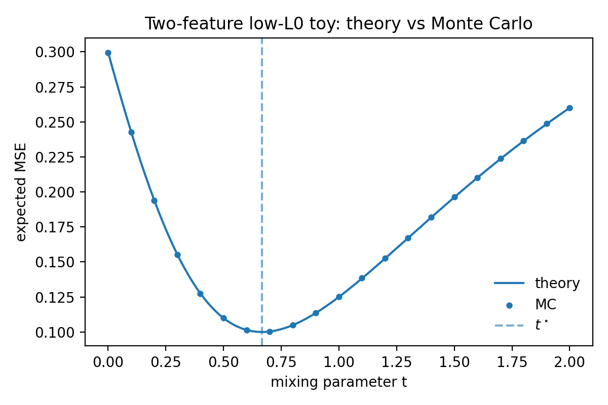

### 1d. Exact reduction for the full \(g\)-feature static problem

Now do the general \(g\)-feature case from first principles.

#### Generator

Let
\[ s\in\{0,1\}^g,\qquad q(s)=\Pr(S=s), \]
and take deterministic magnitudes \(\mu_i>0\) for clarity. Define
\[ D_\mu = \operatorname{diag}(\mu_1,\dots,\mu_g), \qquad c_s = D_\mu s\in\mathbb R^g, \qquad x_s = F c_s \in \mathbb R^d. \]

The only randomness is the iid draw of the support pattern \(s\) from \(q\). Correlations between true features live entirely inside the joint law \(q(s)\).

#### Exact reduction from activation space to coefficient space

Take a tied linear Top-1 SAE with unit decoder columns \(w_\alpha\in\mathbb R^d\), \(\alpha=1,\dots,m\). Decompose
\[ w_\alpha = F v_\alpha + w_{\alpha,\perp}, \qquad F^\top w_{\alpha,\perp}=0. \]
In components,
\[ w_\alpha^a = F^a{}_i v_\alpha^i + w_{\alpha,\perp}^a, \qquad F^a{}_i w_{\alpha,\perp}^a = 0. \]

Because every data point lies in \(\operatorname{span}(F)\), we have
\[ w_\alpha^\top x_s = v_\alpha^\top c_s, \]
so the orthogonal piece \(w_{\alpha,\perp}\) never helps scoring. But it does appear in the reconstruction
\[ \hat x = (w_\alpha^\top x_s)w_\alpha, \]
and therefore only adds extra squared error orthogonal to the data manifold. So at any optimum,
\[ w_{\alpha,\perp}=0. \]

This is important: **the full static SAE problem reduces exactly to coefficient space** \(\mathbb R^g\).

So from now on we work with coefficient-space decoder vectors
\[ v_\alpha\in\mathbb R^g,\qquad \|v_\alpha\|_2=1. \]

#### Exact population objective for Top-1

For a given sample \(c_s\), the Top-1 winner is
\[ \alpha^\star(s)=\arg\max_{\alpha} v_\alpha^\top c_s. \]
The reconstruction in coefficient space is
\[ \hat c_s = (v_{\alpha^\star(s)}^\top c_s)\, v_{\alpha^\star(s)}. \]
So the exact population MSE is
\[ \boxed{ \mathcal E_g(V) = \sum_{s\in\{0,1\}^g} q(s)\, \left\| c_s - (v_{\alpha^\star(s)}^\top c_s)\,v_{\alpha^\star(s)} \right\|_2^2, } \]
where \(V=(v_1,\dots,v_m)\).

Equivalently,
\[ \mathcal E_g(V) = \sum_s q(s)\Big( \|c_s\|_2^2 - (v_{\alpha^\star(s)}^\top c_s)^2 \Big). \]

This is already the exact solution of the population problem “as far as it can be written without choosing a support law”: all the complexity is now isolated in the winner map \(s\mapsto \alpha^\star(s)\).

#### Chamber decomposition: exact solution within a fixed winner pattern

Fix a chamber of parameter space where each support pattern \(s\) has a fixed winning latent \(\alpha^\star(s)\). Define the cluster
\[ \mathcal S_\alpha = \{s:\alpha^\star(s)=\alpha\}. \]
Then
\[ \mathcal E_g(V) = \sum_s q(s)\|c_s\|_2^2 - \sum_{\alpha=1}^m v_\alpha^\top \underbrace{\left( \sum_{s\in \mathcal S_\alpha} q(s)\, c_s c_s^\top \right)}_{M_\alpha} v_\alpha. \]

So within that chamber the objective is
\[ \boxed{ \mathcal E_g(V) = \mathrm{const} - \sum_{\alpha=1}^m v_\alpha^\top M_\alpha v_\alpha, } \]
with exact cluster moment matrices
\[ M_\alpha = \sum_{s\in\mathcal S_\alpha} q(s)\, c_s c_s^\top = D_\mu \left( \sum_{s\in\mathcal S_\alpha} q(s)\, s s^\top \right) D_\mu. \]

This gives three clean exact results.

1. **Within a chamber, the optimal decoder for latent \(\alpha\) is the top eigenvector of \(M_\alpha\).**

2. **The static Top-1 SAE is piecewise a spectral problem.**  
   Globally hard; locally exact.

3. **Full-batch gradient descent is piecewise power iteration.**  
   Since
   \[ \nabla_{v_\alpha}\mathcal E_g = -2 M_\alpha v_\alpha \]
   inside the chamber, discrete-time GD is
   \[ v_{\alpha,n+1}=v_{\alpha,n}+2\eta M_\alpha v_{\alpha,n}, \]
   followed by normalization if we enforce \(\|v_\alpha\|_2=1\). So the normalized update is exactly a power-method step for \(M_\alpha\).

In continuous time with a unit-norm constraint,
\[ \dot v_\alpha = 2\big(M_\alpha-\lambda_\alpha I\big)v_\alpha, \qquad \lambda_\alpha = v_\alpha^\top M_\alpha v_\alpha. \]
This is the exact gradient-flow equation on that chamber.

#### A globally exact subcase: one learned latent

If \(m=1\), there is no chamber ambiguity. Then
\[ \mathcal E_{g,m=1}(v) = \mathbb E[\|c\|_2^2] - v^\top \Sigma v, \qquad \Sigma=\mathbb E[cc^\top]. \]
So the global optimum is the top eigenvector of the coefficient second moment \(\Sigma\), and full-batch GD is literally the power method on \(\Sigma\).

Thus the most undercomplete static SAE is exactly PCA on the true-feature coefficient covariance.

That is the precise first-principles generalization of the two-feature toy.

### 1e. First genuinely \(g\)-feature family we can solve exactly: the star-hedging family

The two-feature toy proves that mixing happens. But the first \(g\)-feature family that matches the paper’s qualitative picture is the following.

#### Generator

Take \(g=n+1\) true orthonormal features
\[ f_0,f_1,\dots,f_n. \]
Feature \(0\) is a “shared” or “dense” feature. Features \(1,\dots,n\) are “unique” features. The support law has only four kinds of events:

| event | activation | probability |
|---|---|---:|
| empty | \(0\) | \(P_{\varnothing}\) |
| shared only | \(\nu f_0\) | \(P_0\) |
| unique \(i\) only | \(\mu f_i\) | \(P_1\) for each \(i=1,\dots,n\) |
| shared + unique \(i\) | \(\nu f_0+\mu f_i\) | \(P_{01}\) for each \(i=1,\dots,n\) |

with
\[ P_{\varnothing}+P_0+nP_1+nP_{01}=1. \]

The true \(L0\) is
\[ L0_{\mathrm{true}} = P_0+nP_1+2nP_{01}. \]

Now force the SAE to be one latent short: it has only \(m=n\) Top-1 latents. By symmetry the natural ansatz is
\[ w_i(t)=\frac{f_i+t f_0}{\sqrt{1+t^2}}, \qquad i=1,\dots,n. \]
So every unique latent is allowed to absorb some of the shared feature.

#### Exact loss

For a shared-only example, the loss is
\[ L_0(t)=\frac{\nu^2}{1+t^2}. \]
For a unique-only example, the loss is
\[ L_1(t)=\frac{\mu^2 t^2}{1+t^2}. \]
For a shared+unique example, the corresponding latent wins and
\[ L_{01}(t)=\frac{(\nu-\mu t)^2}{1+t^2}. \]

Therefore the exact expected loss is
\[ \boxed{ \mathcal E_{\star}(t) = \frac{ P_0\nu^2 + nP_1\mu^2 t^2 + nP_{01}(\nu-\mu t)^2 }{ 1+t^2 }.} \]

Differentiating gives
\[ \mathcal E_{\star}'(t) = -\frac{2}{(1+t^2)^2} \Big[ a(1-t^2)-Bt \Big], \]
where
\[ a=\mu\nu nP_{01}, \qquad B=\mu^2 n(P_1+P_{01})-\nu^2(P_0+nP_{01}). \]

So the exact stationary equation is
\[ \boxed{ a t^2 + B t - a = 0, } \]
hence
\[ \boxed{ t^\star = \frac{-B+\sqrt{B^2+4a^2}}{2a}. } \]

This yields two especially clean facts.

1. **Disentangled unique latents are never locally optimal once co-firing exists.**  
   Since
   \[ \mathcal E_{\star}'(0) = -2\mu\nu nP_{01}, \]
   any \(P_{01}>0\) pushes the optimum to \(t>0\).

2. **The under-budget SAE spreads the shared feature across many latents.**  
   The symmetry ansatz itself becomes the exact one-dimensional reduction, and the optimum is a positive shared component \(t^\star\) mixed into every unique latent.

This is the clean \(g\)-feature analytic version of the qualitative pattern seen in the paper’s 5-feature toy: one correlated feature gets copied into many learned latents when the SAE is resource-constrained.

#### Tiny numerical check

Take the first nontrivial paper-like case \(g=5\), i.e. \(n=4\), with
\[ \mu=\nu=1,\qquad P_0=0.05,\qquad P_1=0.05,\qquad P_{01}=0.10. \]
Then
\[ L0_{\mathrm{true}} = 0.05 + 4(0.05) + 2\cdot 4(0.10)=1.05. \]
The exact optimum is
\[ t^\star \approx 0.829926. \]
The theory predicts
\[ \mathcal E_\star(0)=0.45, \qquad \mathcal E_\star(t^\star)\approx 0.1180295. \]
A Monte Carlo check gives
\[ \mathcal E_{\star,\mathrm{MC}}(t^\star)\approx 0.1181252, \]
again matching theory to sampling error.

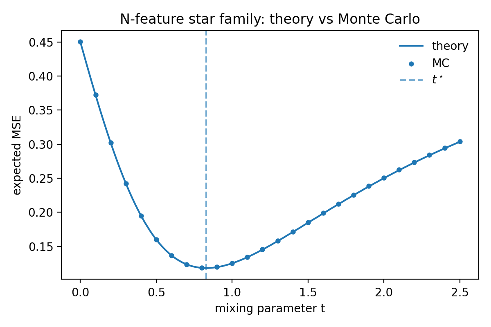

### 1f. What is exactly solved, and what is not, in the static case

The static \(g\)-feature toy is now solved to three different depths.

1. **Completely exactly:**  
   the one-latent case \(m=1\), where the optimum is the top eigenvector of the coefficient second moment \(\Sigma=\mathbb E[cc^\top]\).

2. **Exactly within any fixed Top-1 assignment chamber:**  
   the multi-latent case, where each latent follows power iteration on its cluster moment matrix \(M_\alpha\).

3. **Globally exactly for symmetric families:**  
   the two-feature family and the \(g\)-feature star family above, where symmetry reduces the optimization to one scalar \(t\).

What remains hard in the static problem is the genuinely global combinatorial step:
\[ \text{which support patterns } s \text{ should be assigned to which learned latent?} \]
That is the point where the problem becomes a sparse-dictionary analogue of hard clustering / vector quantization over the support-pattern space.

### 1g. Takeaway

The static Chanin-style benchmark should be thought of as:

- **data**: orthogonal true feature vectors \(f_i\) embedded by a fixed matrix \(F\),
- **randomness**: an iid correlated support law \(q(s)\),
- **pressure**: under a too-small latent budget, MSE rewards hedging against common co-firing patterns.

The general exact statement is:

> In the static Top-1 orthogonal-feature toy, the SAE solves a piecewise spectral problem on the coefficient-space second moments of the support-pattern clusters.

That is the right zeroth-order baseline to generalize before adding time.

---

## 2. Generalization to HMMs that only add temporal correlation

In the tables from here onward, I only add explicit Einstein forms when a new vector or matrix object appears. For scalar probabilities, scalar gains, and discrete HMM states, the component notation is either trivial or would only add clutter.

In this section we keep the latent ontology simple. The hidden variable is still essentially “feature \(i\) is on or off”, but now its support process is persistent across time.

### 2a. Common generator: the two-state leaky-reset / reset HMM

We start from the simplest temporally correlated support process.

| object | shape | what it is |
|---|---:|---|
| \(s_t\) | \(\{0,1\}\) | on/off support bit at time \(t\) |
| \(P\) | \(2\times 2\) | transition matrix of the binary Markov chain |
| \(\pi\) | scalar | stationary on-probability, \(\pi=\Pr(s_t=1)\) |
| \(\rho\) | scalar | lag-1 correlation of \(s_t\) |
| \(\xi_t=s_t-\pi\) | scalar | centered support process |
| \(C_\tau\) | scalar | autocovariance, \(C_\tau=\mathbb E[\xi_t\xi_{t+\tau}]\) |

In reset-process form,

\[ P = (1-\lambda)I+\lambda R, \]

with stationary distribution \(r=(\pi,1-\pi)\). Then

\[ \rho = 1-\lambda, \qquad C_\tau = C_0\rho^{|\tau|}, \qquad C_0=\pi(1-\pi). \]

The state diagram is:

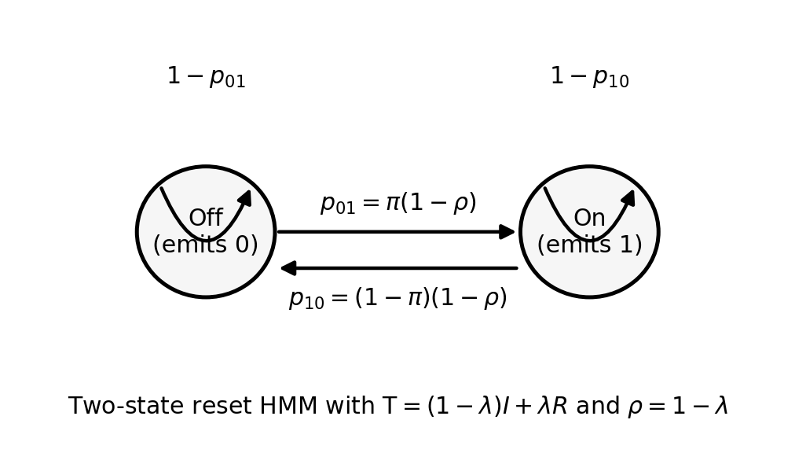

To connect this to an activation vector, the simplest orthogonal generator is

\[ x_t = \sum_{i=1}^g s_{t,i} f_i, \qquad f_i^\top f_j=\delta_{ij}, \]

where each \(s_{t,i}\) is an independent copy of the same two-state process (possibly with feature-specific \(\pi_i,\rho_i\)).

### 2b. Pedagogical minimal example: one persistent feature, one true direction

Before doing the architectures, reduce to the cleanest single-feature case:

| object | shape | meaning |
|---|---:|---|
| \(f\) | \(\mathbb R^d\) | one true orthonormal feature direction |
| \(s_t\) | \(\{0,1\}\) | persistent support bit |
| \(x_t=s_t f\) | \(\mathbb R^d\) | observed activation |
| \(u\) | scalar | learned local aligned gain |

Because \(f\) is orthonormal and there is only one feature, every aligned model reduces to a scalar problem. This is why the exact gradient-descent calculations close.

### 2c. Exact solution for a regular SAE

In the aligned monosemantic basin, choose the learned encoder and decoder to point along the true feature direction \(f\), and parameterize the effective local gain by \(u\in(0,1)\). Then the ReLU code is

\[ a_t = u\,s_t. \]

The population reconstruction+sparsity loss is

\[ \mathcal L_{\mathrm{SAE}}(u) = \pi\Big[\frac12(1-u)^2+\lambda_h u\Big], \]

where \(\lambda_h\) is the sparsity penalty.

The crucial fact is:

\[ \mathcal L_{\mathrm{SAE}}(u) \text{ depends on }\pi, \text{ but not on }\rho. \]

So a time-local SAE trained on single tokens is population-equivalent to training on iid samples from the stationary one-token marginal.

The gradient is

\[ \frac{\partial \mathcal L_{\mathrm{SAE}}}{\partial u} = \pi(u-1+\lambda_h), \]

hence full-batch gradient descent with learning rate \(\eta\) obeys

\[ u_{n+1} = (1-\eta\pi)u_n+\eta\pi(1-\lambda_h). \]

This has exact solution

\[ u_n = (1-\lambda_h)+\big(u_0-(1-\lambda_h)\big)(1-\eta\pi)^n, \]

and fixed point

\[ u^\star_{\mathrm{SAE}}=1-\lambda_h. \]

#### Tiny numerical check

Take

\[ \pi=0.2,\qquad \lambda_h=0.1,\qquad \eta=0.4,\qquad u_0=10^{-3}. \]

Then

\[ u_{n+1}=0.92u_n+0.072. \]

After 20 full-batch steps,

\[ u_{20} = 0.9+(10^{-3}-0.9)(0.92)^{20} \approx 0.730365. \]

Holding \(\pi\) fixed and varying \(\rho\) gives almost exactly the same trajectory, as predicted:

| \(\rho\) | empirical \(\pi\) | theory \(u_{20}\) | experiment \(u_{20}\) | abs. error |
|---:|---:|---:|---:|---:|
| 0.0 | 0.200051 | 0.730365 | 0.730436 | \(7.2\times 10^{-5}\) |
| 0.5 | 0.200441 | 0.730365 | 0.730998 | \(6.3\times 10^{-4}\) |
| 0.8 | 0.199643 | 0.730365 | 0.729815 | \(5.5\times 10^{-4}\) |

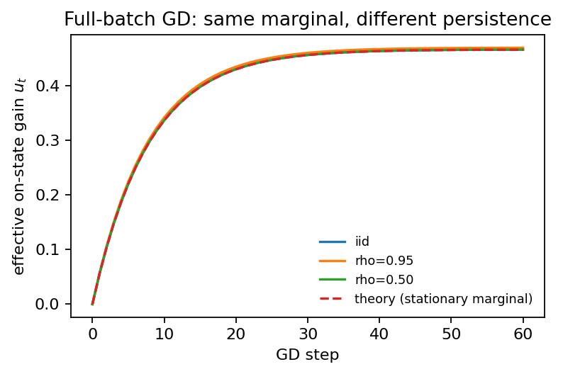

The only place persistence re-enters is through minibatch noise. For contiguous minibatches of size \(B\),

\[ \mathrm{Var}(\bar g_B) = \frac{(u-1+\lambda_h)^2\pi(1-\pi)}{B^2} \left[ B + 2\sum_{\tau=1}^{B-1}(B-\tau)\rho^\tau \right], \]

so the effective batch size is approximately

\[ B_{\mathrm{eff}}\approx B\frac{1-\rho}{1+\rho}. \]

This matches experiment too:

### 2d. Exact solution for Proposal 3A: a single temporal self-filter

Now we make the architecture genuinely temporal. We keep the same single hidden scalar \(\xi_t=s_t-\pi\), but allow the latent to read from the previous token.

| object | shape | meaning |
|---|---:|---|
| \(u\) | scalar | local gain |
| \(\beta\) | scalar | one-step temporal self-coupling |
| \(h_t=u\xi_t\) | scalar | local latent |
| \(\tilde h_t=h_t+\beta h_{t-1}\) | scalar | temporally corrected latent |

The centered target is \(\xi_t\). The population loss is

\[ \mathcal L_{3A}(u,\beta) = \frac12\Big( C_0 - 2u(C_0+\beta C_1) +u^2(C_0+2\beta C_1+\beta^2 C_0) \Big) +\lambda_h\pi u +\frac{\lambda_\beta}{2}\beta^2. \]

At fixed \(u\), the optimal temporal weight is

\[ \beta^\star(u) = \frac{u(1-u)C_1}{u^2C_0+\lambda_\beta}. \]

So with no explicit kernel penalty (\(\lambda_\beta=0\)),

\[ \beta^\star = \frac{C_1}{C_0}\frac{1-u^\star}{u^\star} = \rho\frac{1-u^\star}{u^\star}. \]

Plugging this back into the objective gives

\[ u^\star_{3A} = 1-\frac{\lambda_h\pi}{C_0-C_1^2/C_0}. \]

For the reset family \(C_1=\rho C_0\), this becomes

\[ u^\star_{3A} = 1-\frac{\lambda_h\pi}{C_0(1-\rho^2)}. \]

So unlike the regular SAE, the population optimum now depends explicitly on persistence.

#### Tiny numerical check

Take empirical moments from a long run of the reset HMM:

\[ \pi=0.2,\qquad \rho\approx 0.706,\qquad C_0\approx 0.161285,\qquad C_1\approx 0.113829, \]

and choose

\[ \lambda_h=0.15,\qquad \lambda_\beta=0. \]

Then

\[ u^\star_{3A} = 1-\frac{0.15\cdot 0.2}{C_0-C_1^2/C_0} \approx 0.629390, \]

and

\[ \beta^\star = \frac{C_1}{C_0}\frac{1-u^\star}{u^\star} \approx 0.415584. \]

This matches the direct numerical solve from the same moments.

### 2e. Exact solution for the simplest two-layer temporal XC

Now make the read-in multiview rather than single-view.

Suppose the same hidden scalar \(\xi_t\) is visible in two source layers:

\[ y_t^{(1)}=\xi_t,\qquad y_t^{(2)}=\xi_t. \]

We use scalar read-in weights \(c_1,c_2\), so the local read-in is

\[ h_t=(c_1+c_2)\xi_t=u\xi_t. \]

Then the same one-step temporal correction gives

\[ \tilde h_t=h_t+\beta h_{t-1}. \]

If the read-ins have \(L_2\) penalties \(\lambda_{e,1}\) and \(\lambda_{e,2}\), the exact optimal split at fixed total gain \(u=c_1+c_2\) is

\[ c_1^\star=\frac{\lambda_{e,2}}{\lambda_{e,1}+\lambda_{e,2}}u, \qquad c_2^\star=\frac{\lambda_{e,1}}{\lambda_{e,1}+\lambda_{e,2}}u. \]

So equal penalties imply

\[ c_1^\star=c_2^\star=u/2. \]

The two-layer read-in collapses to an effective ridge penalty

\[ \lambda_{\mathrm{eff}} = \frac{\lambda_{e,1}\lambda_{e,2}}{\lambda_{e,1}+\lambda_{e,2}}. \]

With total decoder energy \(E_D\), the optimal gain is

\[ u^\star_{\mathrm{XC}} = \frac{E_D(C_0-C_1^2/C_0)-\lambda_h\pi} {E_D(C_0-C_1^2/C_0)+\lambda_{\mathrm{eff}}}, \]

and

\[ \beta^\star_{\mathrm{XC}} = \frac{C_1}{C_0}\frac{1-u^\star_{\mathrm{XC}}}{u^\star_{\mathrm{XC}}}. \]

So the simplest two-layer TXC changes the exact solution in only one way: it introduces a **layer-allocation problem**, and that problem solves exactly.

#### Tiny numerical check

Using the same empirical moments and taking

\[ E_D=2,\qquad \lambda_{e,1}=\lambda_{e,2}=0.2, \]

we get:

| model | \(u^\star\) theory | \(u^\star\) experiment | \(\beta^\star\) theory | \(\beta^\star\) experiment |
|---|---:|---:|---:|---:|
| Proposal 3A | 0.629390 | 0.629390 | 0.415584 | 0.415584 |
| 2-layer TXC | 0.503618 | 0.503618 | 0.695626 | 0.695626 |

And the split is

| parameter | theory | experiment |
|---|---:|---:|
| \(c_1\) | 0.251809 | 0.251809 |
| \(c_2\) | 0.251809 | 0.251809 |

### 2f. Exact solution for a window-\(T\) temporal XC

The one-lag filter is only the first nontrivial truncation. The full windowed TXC is a regularized Wiener-filter / Toeplitz problem.

| object | shape | meaning |
|---|---:|---|
| \(y_t^{(1)},y_t^{(2)}\) | scalars here | two noisy source-layer views of the same hidden scalar |
| \(c_{1,\tau},c_{2,\tau}\) | scalars | lag-\(\tau\) read-in weights |
| \(\alpha_\tau=c_{1,\tau}+c_{2,\tau}\) | scalar | effective lag-\(\tau\) weight |
| \(\alpha\) | \(\mathbb R^T\) | full lag profile |
| \(K_T\) | \(\mathbb R^{T\times T}\) | Toeplitz covariance matrix \([C_{|i-j|}]\) |
| \(\kappa_T\) | \(\mathbb R^T\) | covariance vector \((C_0,\dots,C_{T-1})^\top\) |

Take two noisy copies of the same centered hidden scalar:

\[ y_t^{(1)}=\xi_t+\varepsilon_t^{(1)},\qquad y_t^{(2)}=\xi_t+\varepsilon_t^{(2)}, \]

with independent Gaussian noises of variances \(\sigma_1^2,\sigma_2^2\). A window-\(T\) TXC forms

\[ h_t = \sum_{\tau=0}^{T-1} \big(c_{1,\tau}y_{t-\tau}^{(1)}+c_{2,\tau}y_{t-\tau}^{(2)}\big). \]

After eliminating the read-in split, the exact scalar lag-profile problem is

\[ \mathcal L_T(\alpha) = \frac{E_D}{2}\Big(C_0 - 2\kappa_T^\top\alpha + \alpha^\top K_T\alpha\Big) + \frac{r_{\mathrm{eff}}}{2}\|\alpha\|_2^2, \]

where

\[ r_{\mathrm{eff}} = \frac{r_1r_2}{r_1+r_2}, \qquad r_1=E_D\sigma_1^2+\lambda_{e,1}, \qquad r_2=E_D\sigma_2^2+\lambda_{e,2}, \qquad \gamma_{\mathrm{eff}}=\frac{r_{\mathrm{eff}}}{E_D}. \]

Therefore the exact optimum is

\[ \alpha_T^\star = (K_T+\gamma_{\mathrm{eff}}I_T)^{-1}\kappa_T. \]

Full-batch gradient descent is linear:

\[ \alpha_{n+1} = \alpha_n-\eta E_D\big((K_T+\gamma_{\mathrm{eff}}I_T)\alpha_n-\kappa_T\big). \]

And the minimal loss is

\[ \mathcal L_T^\star = \frac{E_D}{2}\Big(C_0-\kappa_T^\top(K_T+\gamma_{\mathrm{eff}}I_T)^{-1}\kappa_T\Big). \]

The gain from increasing the window is exact and nonnegative. Writing

\[ K_{T+1}+\gamma I_{T+1} = \begin{bmatrix} Q_T & b_T\\ b_T^\top & C_0+\gamma \end{bmatrix}, \]

we get the Schur-complement identity

\[ \mathcal L_T^\star-\mathcal L_{T+1}^\star = \frac{E_D}{2} \frac{\big(C_T-b_T^\top Q_T^{-1}\kappa_T\big)^2} {C_0+\gamma-b_T^\top Q_T^{-1}b_T} \ge 0. \]

So larger windows can only help.

#### Tiny numerical check

Using a reset process with

\[ \pi=0.2,\qquad \rho=0.7,\qquad \sigma_1=0.4,\qquad \sigma_2=0.8,\qquad E_D=2,\qquad \lambda_{e,1}=\lambda_{e,2}=0.1, \]

the theory and empirical ridge regression optimum agree:

| \(T\) | loss theory | loss experiment | \(\|\alpha_{\rm exp}-\alpha_{\rm th}\|_2\) |
|---:|---:|---:|---:|
| 1 | 0.080506 | 0.080442 | 0.000155 |
| 2 | 0.069216 | 0.069155 | 0.000851 |
| 4 | 0.067067 | 0.067009 | 0.001387 |

Selected lag weights:

| \(T\) | lag | \(\alpha_{\rm theory}\) | \(\alpha_{\rm experiment}\) | abs. error |
|---:|---:|---:|---:|---:|
| 2 | 0 | 0.429912 | 0.430243 | 0.000331 |
| 2 | 1 | 0.199948 | 0.199690 | 0.000258 |
| 4 | 0 | 0.416563 | 0.416725 | 0.000163 |
| 4 | 1 | 0.171256 | 0.171176 | 0.000080 |
| 4 | 2 | 0.071521 | 0.071443 | 0.000078 |
| 4 | 3 | 0.033723 | 0.033691 | 0.000032 |

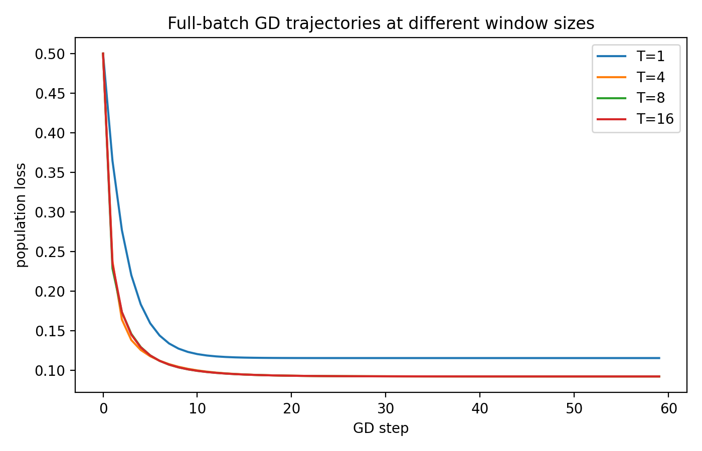

### 2g. Takeaway at the “simple HMM” level

At this level, the HMM only adds **persistence**. It does **not** create new hidden directions.

So the story is:

- regular SAE: population-blind to persistence;
- Proposal 3A: learns a true temporal filter;
- simplest two-layer TXC: same temporal filter plus an exactly solvable layer-allocation problem;
- window-\(T\) TXC: exact Toeplitz Wiener filter, where bigger \(T\) gives monotone denoising gains.

This level is about **filtering** and **denoising**, not about uncovering genuinely new latent information.

---

## 3. Generalization to richer HMMs

Now we move beyond “same hidden feature, just more persistent.” The right new question is:

> when does time reveal hidden information that a single token cannot reveal?

### 3a. The right structural notion: observability rank

For a finite-state HMM or state-space model, the useful object is the \(T\)-step observability matrix

\[ \mathcal O_T = \begin{bmatrix} B\\ BP\\ \vdots\\ BP^{T-1} \end{bmatrix}, \]

where

- \(P\in\mathbb R^{K\times K}\) is the transition matrix on \(K\) hidden states;
- \(B\in\mathbb R^{d_{\rm obs}\times K}\) maps hidden states to one-token observations.

Interpretation:

- if \(\operatorname{rank}(\mathcal O_T)=\operatorname{rank}(B)\), then a longer window only denoises;
- if \(\operatorname{rank}(\mathcal O_T)>\operatorname{rank}(B)\), then time reveals new hidden directions.

That is the clean dividing line between “simple HMMs” and “richer HMMs.”

### 3b. Pedagogical minimal example: a locally aliased HMM

Take a 3-state HMM in which two hidden states look identical locally.

| object | shape | meaning |
|---|---:|---|
| hidden state \(z_t\) | one-hot vector in \(\mathbb R^3\) | true hidden state |
| \(P\) | \(3\times 3\) | transition matrix |
| \(B\) | \(2\times 3\) | one-token observation matrix |
| \(x_t=Bz_t\) | \(\mathbb R^2\) | observed token-level representation |

A concrete example is

\[ B= \begin{bmatrix} 1 & 1 & 0\\ 0 & 0 & 1 \end{bmatrix}, \qquad P= \begin{bmatrix} 0.1 & 0.1 & 0.8\\ 0.8 & 0.1 & 0.1\\ 0.1 & 0.1 & 0.8 \end{bmatrix}. \]

States 1 and 2 are **locally aliased** because they have the same one-token observation.

The state diagram is:

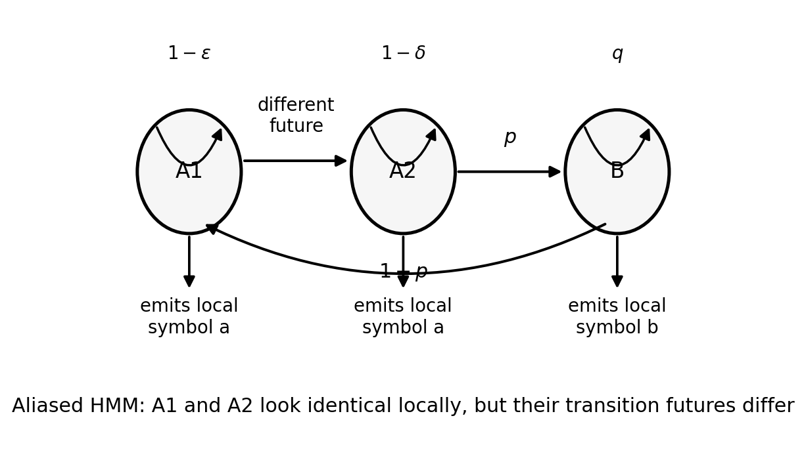

But the temporal futures of states 1 and 2 differ. Indeed,

\[ \operatorname{rank}(B)=2,\qquad \operatorname{rank}(\mathcal O_2)=3. \]

So a two-token window reveals a hidden distinction that one token cannot.

This is the first benchmark where a windowed TXC is not “just a denoiser.” It can uncover a direction that is **not present in the single-token observation space**.

#### Tiny numerical check

The observability-rank toy behaves exactly as expected:

### 3c. Exact solution for Proposal 5: a shared-chain HMM with factorial SAE emissions

Proposal 5 is the first architecture matched to a genuinely shared temporal mode.

| object | shape | meaning |
|---|---:|---|
| \(h_t\) | \(\{1,\dots,\chi\}\) | shared hidden state |
| \(P\) | \(\mathbb R^{\chi\times\chi}\) | hidden-state transition matrix |
| \(B\) | \([0,1]^{m\times\chi}\) | emission probabilities, \(B_{k,h}=\Pr(s_{t,k}=1\mid h_t=h)\) |
| \(\gamma_t^{(T)}\) | simplex point in \(\Delta^{\chi-1}\) | posterior over hidden states from a window of length \(T\) |
| \(q_{t,k}^{(T)}\) | scalar | posterior support probability of feature \(k\) |
| \(r_k\) | scalar | aligned learned reconstruction gain for feature \(k\) |

State diagram:

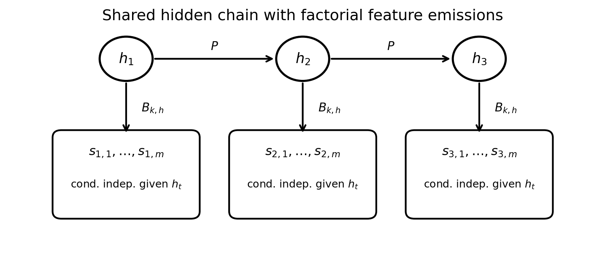

Conditioned on \(h_t\), the feature supports are independent Bernoullis. Marginal correlations appear because different features share the same hidden chain.

The posterior support probability of feature \(k\) is

\[ q_{t,k}^{(T)} = \Pr(s_{t,k}=1\mid \mathcal F_t^{(T)}) = \sum_{h=1}^{\chi} B_{k,h}\,\gamma_t^{(T)}(h). \]

In the aligned orthogonal basin, reconstruct with

\[ \hat x_t = \sum_{k=1}^m r_k q_{t,k}^{(T)} f_k. \]

Define the posterior-explained support energy

\[ Q_{k,T}:=\mathbb E[(q_{t,k}^{(T)})^2]. \]

Then the population loss decouples by feature:

\[ \mathcal L_{P5}(r) = \frac12\sum_k \pi_k - \sum_k Q_{k,T}r_k + \frac12\sum_k(Q_{k,T}+\lambda)r_k^2 + \lambda_s\sum_k \pi_k. \]

So full-batch gradient descent is exact:

\[ r_{k,n+1} = (1-\eta(Q_{k,T}+\lambda))r_{k,n}+\eta Q_{k,T}, \]

with fixed point

\[ r_{k,\star}^{(T)}=\frac{Q_{k,T}}{Q_{k,T}+\lambda}. \]

A very useful identity is

\[ Q_{k,T} = \pi_k-\mathbb E\!\left[\operatorname{Var}(s_{t,k}\mid \mathcal F_t^{(T)})\right]. \]

So \(Q_{k,T}\) is literally the amount of feature-\(k\) support variance explained by the temporal inference module.

As \(T\) grows, \(Q_{k,T}\) grows monotonically:

\[ Q_{k,T+1}-Q_{k,T} = \mathbb E\Big[\big(q_{t,k}^{(T+1)}-q_{t,k}^{(T)}\big)^2\Big]\ge 0. \]

#### Tiny numerical check

With a binary hidden chain, one noisy observation channel, and ridge \(\lambda=0.1\):

| \(T\) | \(Q_T\) | \(r_\star\) theory | \(r_{20}\) theory | \(r_{20}\) experiment | abs. error |
|---:|---:|---:|---:|---:|---:|
| 1 | 0.339451 | 0.772443 | 0.767038 | 0.766916 | 0.000122 |
| 3 | 0.375350 | 0.789628 | 0.786159 | 0.786508 | 0.000349 |
| 5 | 0.380171 | 0.791741 | 0.788476 | 0.788765 | 0.000289 |

### 3d. Exact solution for the direct sum of two leaky-reset blocks

This is the first HMM family where a single temporal feature can correspond directly to a **belief-state coefficient**.

| object | shape | meaning |
|---|---:|---|
| block label \(c\) | \(\{1,2\}\) | which block generated the sequence |
| \(P_1,P_2\) | square matrices | within-block transition operators |
| \(P=P_1\oplus P_2\) | block-diagonal matrix | full transition operator |
| \(\eta_{1,t},\eta_{2,t}\) | simplex points | within-block belief states |
| \(\omega_{1,t},\omega_{2,t}\) | scalars | posterior block weights, \(\omega_{1,t}+\omega_{2,t}=1\) |
| \(\eta_t\) | direct-sum state | full belief state |
| \(U_t^{(T)}\) | integer | switch count in a length-\(T\) window |

State diagram:

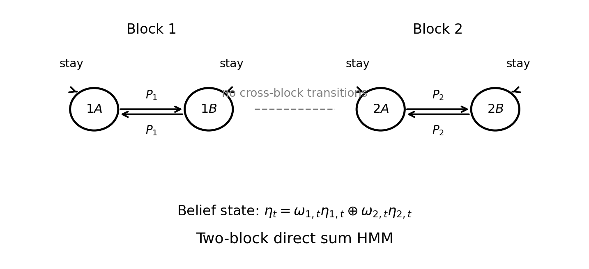

Because the two blocks do not mix,

\[ P=P_1\oplus P_2, \]

the belief state decomposes exactly as

\[ \eta_t=\omega_{1,t}\eta_{1,t}\oplus \omega_{2,t}\eta_{2,t}. \]

So the genuinely nonlocal hidden coordinate is the block posterior coefficient \(\omega_{1,t}\).

In the symmetric deterministic-emission benchmark, the exact posterior from a window depends only on the switch count

\[ U_t^{(T)} = \#\{\tau\in\{t-T+2,\dots,t\}:x_\tau\neq x_{\tau-1}\}. \]

The exact block posterior is logistic in this scalar sufficient statistic:

\[ \omega_{1,t}^{(T)} = \sigma\big(\beta_0(T)+\beta_1 U_t^{(T)}\big). \]

So one scalar temporal feature is enough to recover the belief-state coordinate up to an affine map or a sigmoid.

If the reconstruction target is linear in the block label, then the best **linear** TXC feature is the centered switch-count mode. Writing

- \(\sigma_{\mathrm w}^2\) for the within-block variance of that mode,
- \(\Delta\) for the between-block mean difference,
- \(\kappa\) for its covariance with the target,

full-batch GD is exact:

\[ \alpha_{n+1} = \big(1-\eta(\sigma_{\mathrm w}^2+n\Delta^2)\big)\alpha_n+\eta\kappa, \qquad n=T-1. \]

The useful window scale is

\[ T_{\mathrm{sig}}-1 \sim \frac{\sigma_{\mathrm w}^2}{\Delta^2}. \]

So the window required for reliable recovery grows like an inverse square signal-to-noise ratio.

#### Tiny numerical check

The exact posterior collapses cleanly onto switch count:

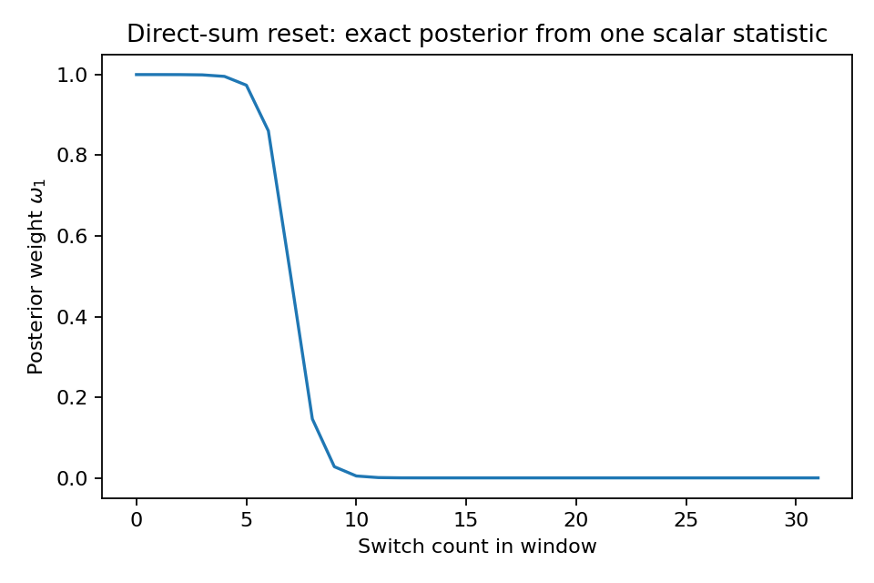

A linear rank-1 TXC then improves with \(T\):

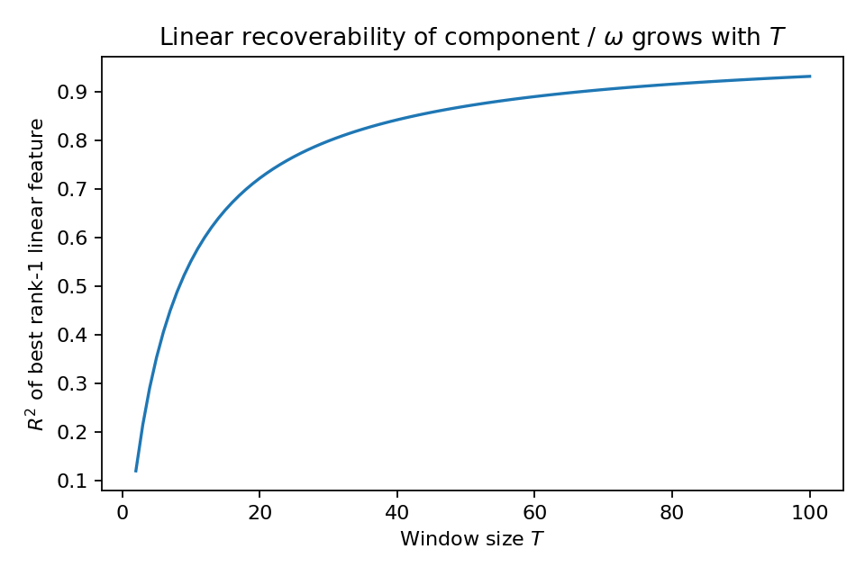

And the full-batch GD trajectories follow the exact recurrence:

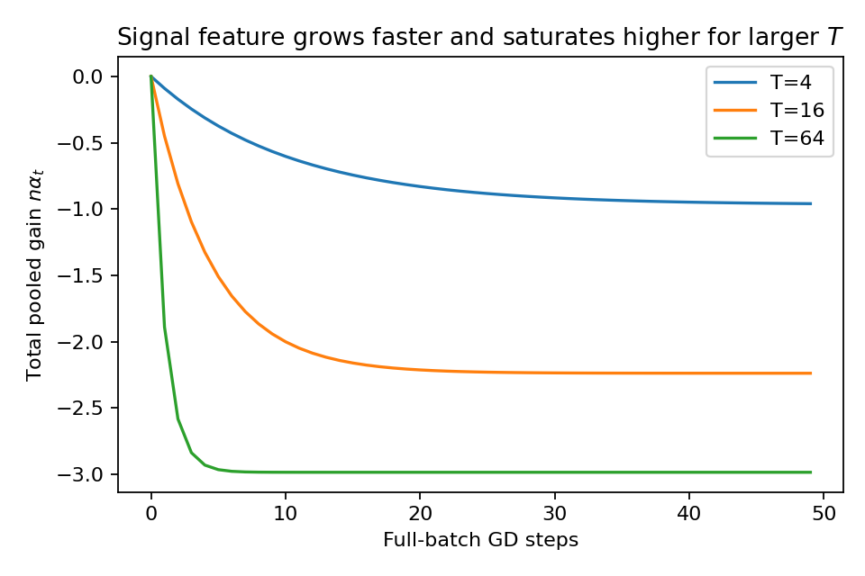

### 3e. Exact solution for \(K\)-block direct sums

The two-block family generalizes in two qualitatively different ways.

| object | shape | meaning |
|---|---:|---|
| \(c\) | \(\{1,\dots,K\}\) | block label |
| \(\omega=(\omega_1,\dots,\omega_K)\) | simplex point in \(\Delta^{K-1}\) | posterior over blocks |
| \(U\) | scalar or vector | temporal sufficient statistic(s) |
| \(M\) | integer | number of independent temporal channels |

Representative state diagram:

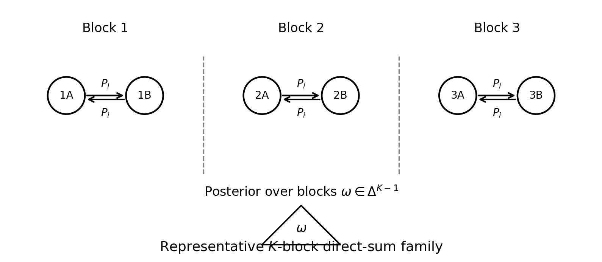

#### One-parameter \(K\)-block family: still rank 1

If blocks differ only by a single persistence parameter \(p_i\), then the sufficient statistic is still the scalar switch count \(U\). The exact posterior is

\[ \omega_i(U)=\operatorname{softmax}_i(\alpha_i+\beta_i U). \]

Even though there are \(K\) blocks, the posterior simplex only traces out a **1D curve**. So one scalar TXC feature is still enough.

#### Genuine simplex family: need \(K-1\) independent temporal signatures

To force a true \((K-1)\)-dimensional posterior family, we need \(K-1\) independent temporal statistics. A matched construction is:

- \(M\) independent temporal channels,
- block-specific switch-probability vectors \(p_i\in(0,1)^M\),
- count vector \(U\in\mathbb R^M\) summarizing the window.

Then the posterior log-odds are affine in \(U\), and the informative linear rank is the affine rank of the set \(\{p_i\}\).

The smallest genuinely nontrivial case is

\[ K=3,\qquad M=2. \]

That is the first direct-sum benchmark where one temporal feature is provably insufficient and a 2D posterior simplex appears.

#### Tiny numerical checks

One-parameter family: posterior stays on a 1D curve.

Rank-1 versus genuine simplex family:

Useful window scaling:

### 3f. Takeaway at the “richer HMM” level

This level is qualitatively different from Section 2.

- **Aliased-state HMMs:** time reveals new hidden directions via observability rank.
- **Proposal 5:** the relevant quantity is posterior-explained support energy \(Q_{k,T}\), not raw firing rate.
- **Direct sums:** a single temporal feature can literally become a posterior coefficient \(\omega_i\).
- **\(K\)-block simplex families:** temporal width becomes structurally necessary only when the posterior family has affine rank \(K-1\).

So the right notion of “harder HMM” is **not just larger persistence \(\rho\)**. It is larger **temporal observability** or larger **posterior-simplex dimension**.

---

## 4. Continuous-state matched teachers: the Jordan-block family

This section is not an HMM, but it is still valuable because it gives the cleanest exact “time reveals hidden coordinates” benchmark.

### 4a. Linear-Gaussian predictive-state teacher

The matched continuous-state teacher is

| object | shape | meaning |
|---|---:|---|
| \(z_t\) | \(\mathbb R^r\) | hidden continuous state |
| \(A\) | \(\mathbb R^{r\times r}\) | state transition matrix |
| \(x_t^{(1)},x_t^{(2)}\) | \(\mathbb R^{d_1},\mathbb R^{d_2}\) | two source-layer observations |
| \(C_1,C_2\) | \(\mathbb R^{d_1\times r},\mathbb R^{d_2\times r}\) | source-layer readout matrices |
| \(y_t\) | \(\mathbb R^{d_y}\) | target to reconstruct |
| \(F\) | \(\mathbb R^{d_y\times r}\) | target readout matrix |

with dynamics

\[ z_{t+1}=Az_t+\xi_t,\qquad x_t^{(1)}=C_1z_t+\varepsilon_t^{(1)},\qquad x_t^{(2)}=C_2z_t+\varepsilon_t^{(2)},\qquad y_t=Fz_t+\zeta_t. \]

Because the model is jointly Gaussian, the Bayes-optimal MSE predictor from a window is exactly linear:

\[ \hat y_t^\star = \Sigma_{yY}\Sigma_{YY}^{-1}Y_t. \]

So a window-\(T\) temporal XC with sufficient width can realize the population optimum exactly.

### 4b. The \(r\)-dimensional Jordan block

The cleanest exact family is

\[ z_{t+1}=J_r(\rho)z_t, \qquad J_r(\rho)=\rho I+N, \]

where \(N\) is the nilpotent Jordan off-diagonal shift.

Take the simplest single-view observation

\[ s_t=e_1^\top z_t. \]

Then the hidden coordinates are weighted discrete derivatives of the observed stream:

\[ (E-\rho)^j s_t = z_t^{(j+1)}, \qquad j=0,1,\dots,r-1, \]

where \(E\) is the time-shift operator \(Es_t=s_{t+1}\).

So in the noiseless single-view setting, the minimum useful window is exactly

\[ T_{\min}=r. \]

This gives the clean single-view scaling law:

- hidden-state dimension \(r\) grows;
- required temporal window grows linearly with \(r\).

For a \(q\)-view observation model, the correct object is again the observability index. If \(q\) independent instantaneous views are available, then

\[ \lceil r/q\rceil \le T_{\min}\le r. \]

So multiple layers can reduce the required window only when they add genuinely independent instantaneous views.

### 4c. Can Proposal 3 help here?

This gives a clean answer to the earlier question about Proposal 3.

- **Proposal 3A** mostly cannot create the missing Jordan coordinates from a single local channel. It helps denoise, but it does not beat the observability bound.
- **Proposal 3B / a temporal crosscoder with several temporal drivers** can realize the optimal window-to-state map, because the relevant object is a low-rank predictive-state representation.
- To match the Jordan family exactly, Proposal 3B should really learn a cross-driver recurrence
  \[ g_{t+1}=Mg_t+Ua_t \]
  with \(M\in\mathbb R^{r\times r}\) allowed to approximate a Jordan or companion form.

So the tensor-network / temporal-driver idea helps here by giving the right **low predictive rank**, not by lowering the information-theoretic minimum window.

#### Tiny numerical checks

Window scaling with \(r\):

Conditioning / observability degradation at larger \(r\):

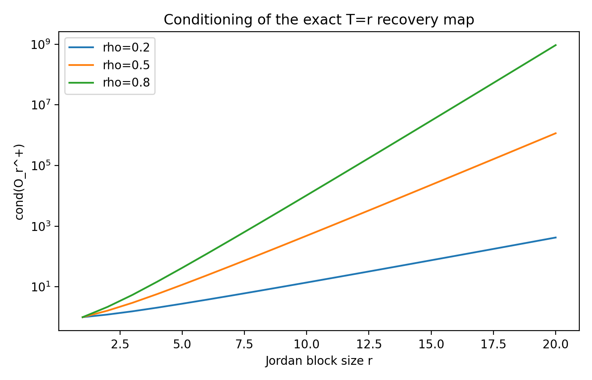

### 4d. Takeaway

The Jordan family is the clean continuous analogue of the aliased-HMM story:

- single-token evidence hides some latent coordinates;
- time reveals them through discrete derivatives / observability;
- the minimum useful window scales like the observability index.

---

## 5. Synthesis: what each benchmark is testing

Here is the whole ladder in one table.

| level | benchmark | what is hidden | what the exact solution shows | what a temporal model can gain |
|---|---|---|---|---|
| 0 | static Chanin toy | nothing temporal; only static co-firing structure | wrong \(L0\) makes mixed features MSE-optimal | nothing temporal; this is the static baseline |
| 1 | leaky-reset HMM + regular SAE | only persistence | population loss depends on \(\pi\), not \(\rho\) | nothing at population level; only SGD-noise effects |
| 2 | Proposal 3A on the same HMM | persistence | optimal temporal filter \(\beta^\star\propto \rho(1-u^\star)/u^\star\) | true temporal filtering |
| 3 | simplest two-layer TXC | persistence + multiview read-in | exact harmonic-mean layer split | same filter, plus exactly solvable layer allocation |
| 4 | window-\(T\) TXC on simple HMM | persistence over many lags | exact Toeplitz Wiener filter | monotone denoising gains with \(T\) |
| 5 | aliased-state HMM | hidden state distinctions invisible in one token | observability rank can jump with \(T\) | genuinely new recoverable directions |
| 6 | Proposal 5 shared-chain HMM | shared temporal mode controlling many features | exact GD in terms of \(Q_{k,T}\) | posterior-informed feature ranking |
| 7 | two-block direct sum | block identity / belief coefficient | one temporal feature can equal \(\omega_1\) | recover a belief-state coefficient |
| 8 | \(K\)-block simplex family | \((K-1)\)-dimensional posterior simplex | width \(K-1\) becomes structurally necessary | temporal width matters for structural reasons |
| 9 | Jordan block | hidden continuous coordinates | \(T_{\min}\) set by observability index | exact matched teacher for TXCs |

### What I think is genuinely solved

In the aligned / orthogonal basin, these pieces are analytically clean:

- static Chanin two-feature low-\(L0\) benchmark,
- regular SAE on reset/HMM supports,
- Proposal 3A one-feature temporal filter,
- simplest two-layer TXC,
- window-\(T\) TXC on a single persistent hidden scalar,
- aliased-state / observability benchmark,
- Proposal 5 gain dynamics via \(Q_{k,T}\),
- two-block and \(K\)-block direct sums,
- Jordan-block teacher.

### What is still genuinely open

The first really hard setting is where **component assignment itself** changes because of time, not just denoising or gain splitting:

- multiple ambiguous true features,
- finite latent budget,
- non-orthogonal / superposed decoder geometry,
- ReLU or TopK basin changes,
- several competing temporal explanations.

That is the point where a temporal architecture could discover **different** features, not just cleaner estimates of the same feature.

---

## 6. Practical reading guide

If you want the shortest path through the note, I think the clean order is:

1. **Section 1:** understand the static Chanin low-\(L0\) effect.  
2. **Section 2c–2f:** see exactly why regular SAEs are blind to persistence, while Proposal 3A and TXCs are not.  
3. **Section 3b:** see the first benchmark where time reveals a new hidden direction.  
4. **Section 3d–3e:** see the first benchmarks where a TXC feature is naturally a posterior coordinate \(\omega_i\).  
5. **Section 4:** use Jordan blocks when you want the sharpest scaling law for \(T\) versus hidden-state complexity.

---

## 7. Source map

This note consolidates the earlier working notes and the user-provided source notes:

- the temporal architecture note,
- the modular-addition dynamics note,
- the reset-process / HMM note,
- and the derived notes on static Chanin, regular SAE, Proposal 3A, simplest TXC, window-\(T\) TXC, Proposal 5, direct sums, \(K\)-block families, and Jordan blocks.

The main change here is stylistic rather than mathematical: the benchmark ladder is now explicit, and every object is introduced with its dimension and role before it is used.
