## what we did

Implemented the v0 toy model pipeline reproducing Chanin et al. (2025) "Sparse but Wrong" to establish a foundation for temporal crosscoder experiments. Built the full codebase in `src/v0_toy_model/` with modular components:

- **Data generation** (`data_generation.py`): Gaussian copula for correlated Bernoulli features with magnitude sampling. This is the core reusable module for later temporal experiments.
- **Toy model** (`toy_model.py`): `ToyModel(HookedRootModule)` with gradient-descent orthogonalized feature directions.
- **SAE training** (`train_sae.py`): SAE-lens `BatchTopKTrainingSAE` wrapper with `SAETrainer`.
- **Evaluation** (`eval_sae.py`, `metrics.py`): L0, dead features, shrinkage, MSE, variance explained, $c_{\text{dec}}$, decoder-feature cosine similarity, latent-to-feature matching.
- **Plotting** (`plotting.py`): Heatmaps, $c_{\text{dec}}$ vs L0, sparsity-reconstruction tradeoff. All saved as `.png` + `.html`.
- **Experiment scripts**: `run_small_experiment.py` (Section 3.1) and `run_large_experiment.py` (Sections 3.2/3.5).
- **Test suite**: 38 tests across 4 files, all passing.

Ran two experiments:

**Small experiment** (Section 3.1): 5 features, $d=20$, $p=0.4$ (true $L_0=2.0$), correlations $\pm 0.4$ between feature 0 and features 1-4. Trained SAEs at $k=2.0$ (correct) and $k=1.8$ (too low), 15M training samples, seed 42.

Correlation matrices:

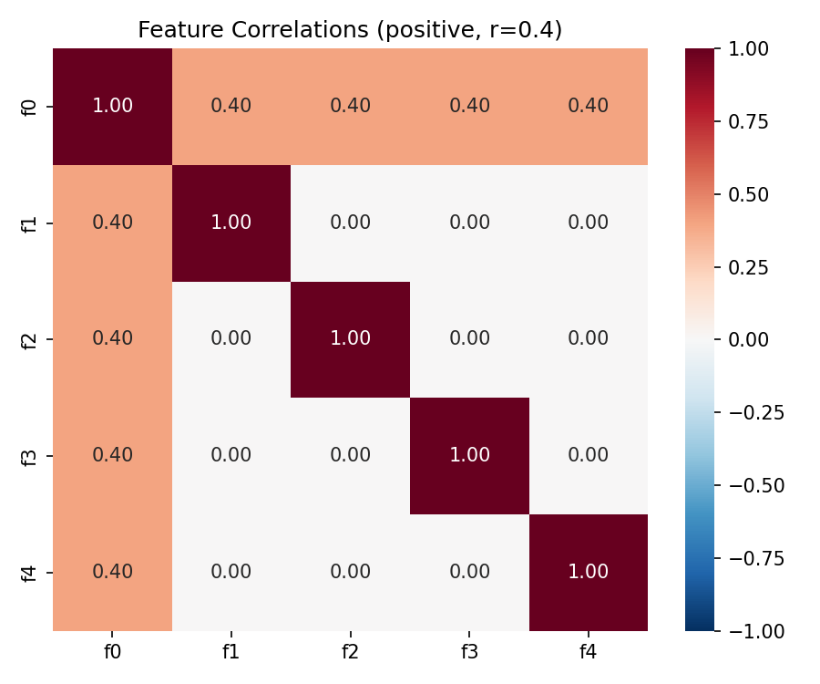
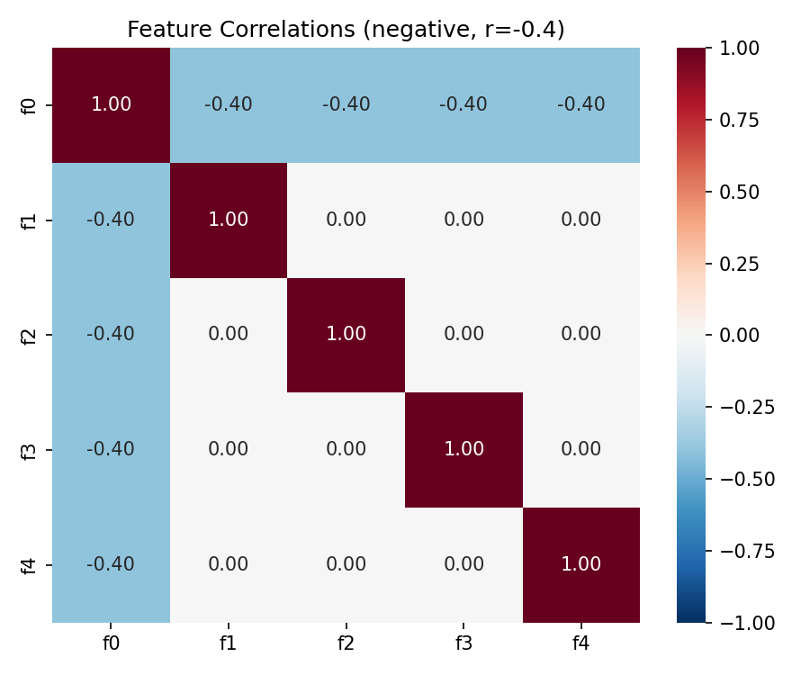

**Large experiment** (Sections 3.2/3.5): 50 features, $d=100$, power-law firing probabilities (0.345 to 0.05), random correlation matrix (strength 0.3-0.9, sparsity 0.3). Swept $k \in \{1,2,3,5,7,9,11,13,15,18,21,25\}$ with 5 seeds each. Total: 60 SAE training runs.

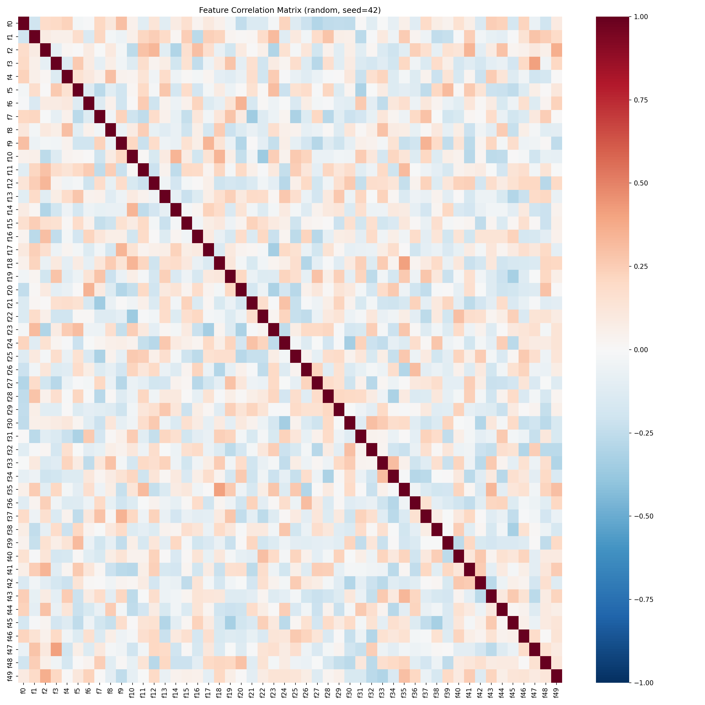

## what we found

**Small experiment — agrees with Chanin et al.:**

| Config                  | $c_{\text{dec}}$ | Feature 0 mixing pattern                                          |
| ----------------------- | ---------------- | ----------------------------------------------------------------- |
| Positive corr, $k=2.0$ | 0.003            | Clean diagonal (no mixing)                                        |
| Positive corr, $k=1.8$ | 0.090            | Positive mixing: $f_0$ absorbs $f_1$-$f_4$, mean cos sim +0.317  |
| Negative corr, $k=2.0$ | 0.003            | Clean diagonal (no mixing)                                        |
| Negative corr, $k=1.8$ | 0.074            | Negative mixing: $f_0$ repels $f_1$-$f_4$, mean cos sim -0.279   |

At the correct L0, SAE latents cleanly recover true features. At too-low L0, the SAE mixes correlated features — positive correlations cause positive mixing (decoder absorbs correlated features), negative correlations cause negative mixing (decoder repels). This exactly matches Figures 2-3 in the paper.

Positive correlations, $k=2.0$ (correct L0) — clean diagonal:

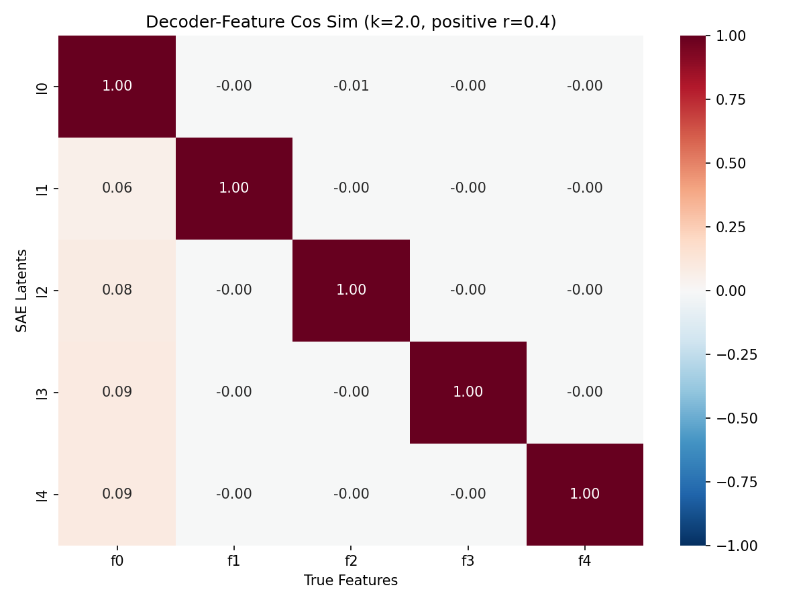

Positive correlations, $k=1.8$ (too low) — $f_0$ absorbs correlated features:

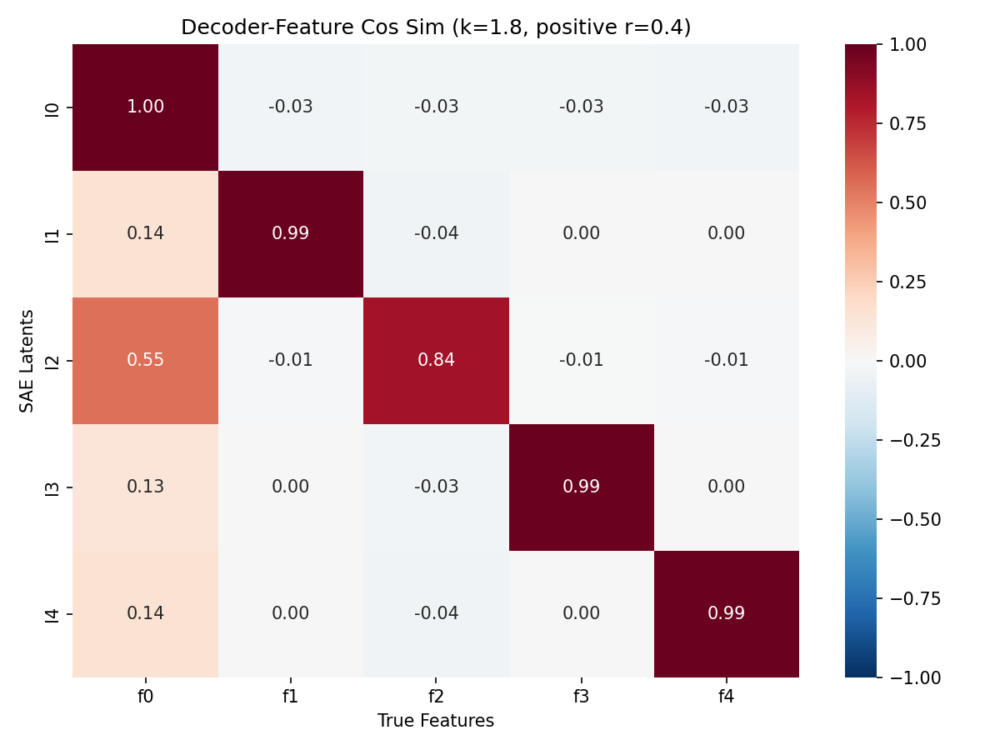

Negative correlations, $k=2.0$ (correct L0) — clean diagonal:

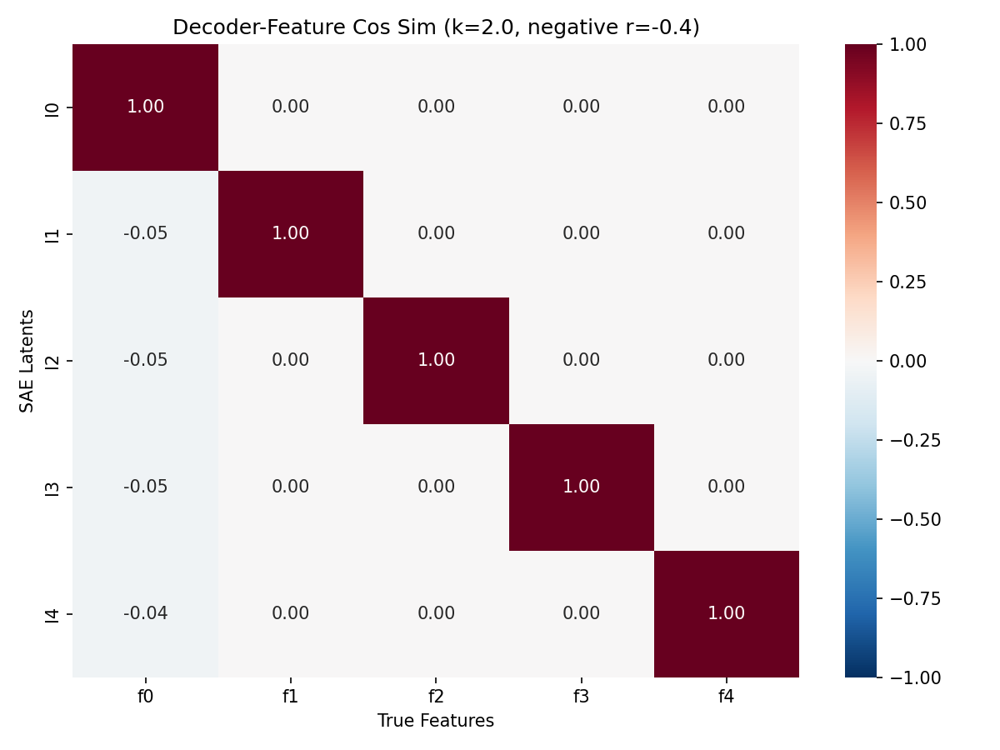

Negative correlations, $k=1.8$ (too low) — $f_0$ repels correlated features:

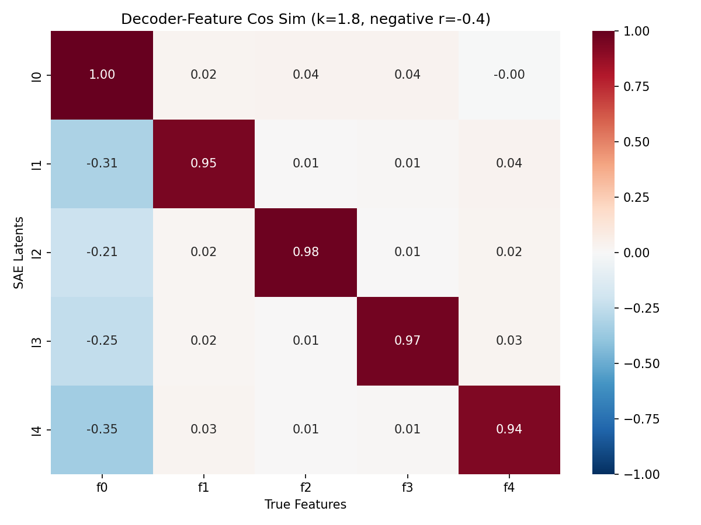

**Large experiment — agrees with Chanin et al.:**

$c_{\text{dec}}$ vs L0 — V-shaped curve minimized at $k=11$ ($c_{\text{dec}}=0.003$), near the true $L_0 \approx 9.9$. Matches Figure 6:

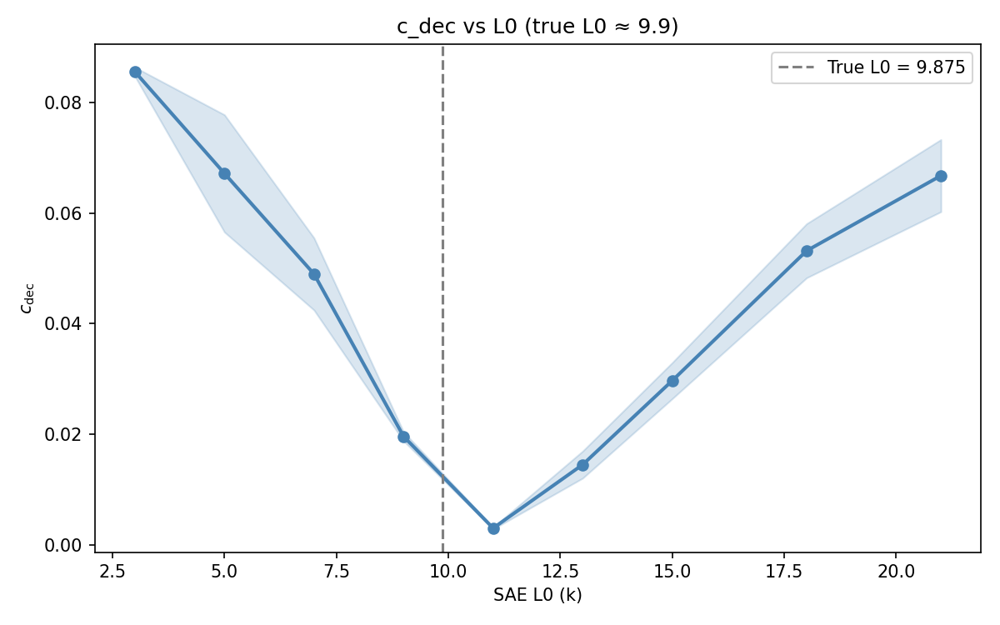

$k=5$ (too low) — widespread mixing, columns show multiple features absorbed into single latents:

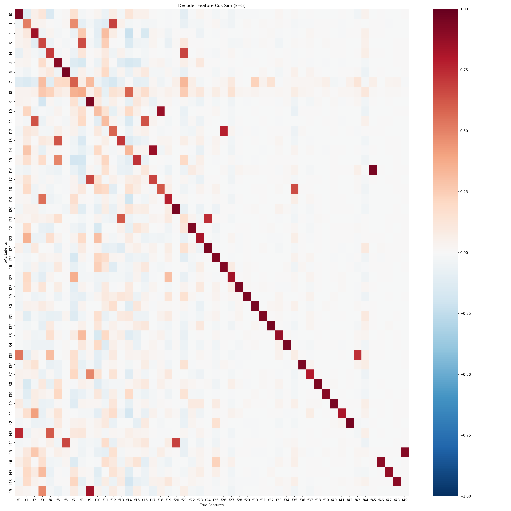

$k=11$ (correct) — near-perfect identity matrix, clean feature recovery:

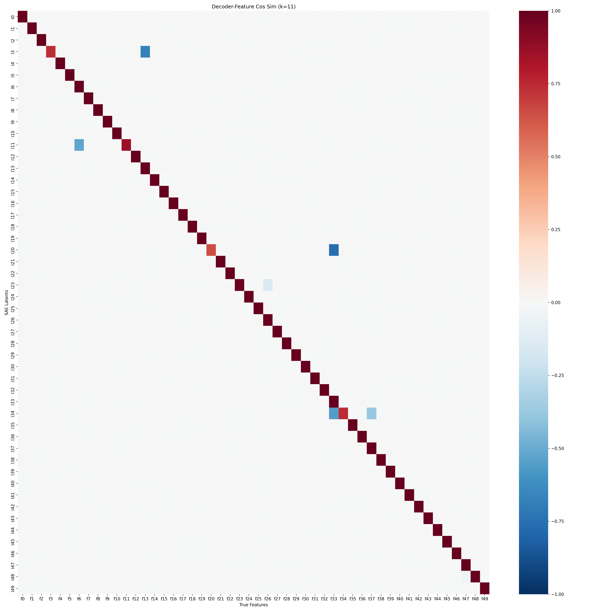

$k=18$ (too high) — degenerate mixing with dead features. Matches Figure 1:

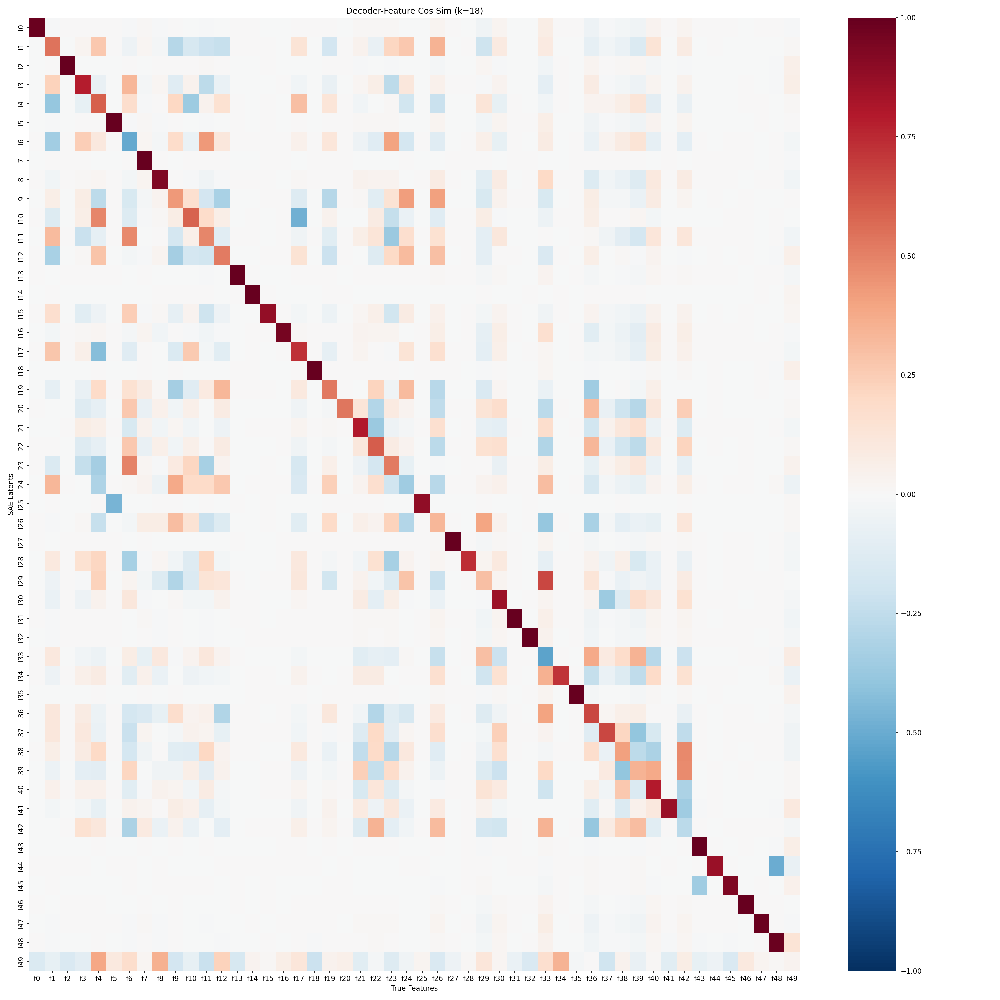

**One divergence from the paper:**

The paper claims ground-truth initialized SAEs at $k < L_0$ should escape toward mixed solutions. In our runs with SAE-lens v6.35.0, GT-initialized SAEs stayed near the identity (the GT local minimum was too strong to escape). Training from scratch at $k=1.8$ reliably shows mixing, confirming the scientific conclusion holds — the divergence is in training dynamics, not the underlying phenomenon.

Likely cause: SAE-lens v6.35.0 uses `rescale_acts_by_decoder_norm` (default True) and threshold EMA, which may stabilize the GT solution differently than Chanin's original training code.

**Minor note on true L0:** The paper states true $L_0 \approx 11$ for the large experiment, but `sum(linspace(0.345, 0.05, 50)) = 9.875`. Our $c_{\text{dec}}$ minimum at $k=11$ actually aligns slightly above the computed true $L_0$, suggesting the paper may use different probability values than stated, or the $c_{\text{dec}}$ minimum is shifted by training dynamics.

## takeaways

1. **Core scientific finding reproduced.** SAEs trained with $L_0$ below the true sparsity level mix correlated features together. The mixing direction matches the correlation sign. $c_{\text{dec}}$ reliably identifies the correct $L_0$.

2. **Data generation module is ready for reuse.** The Gaussian copula approach in `data_generation.py` is the building block for temporal experiments — extending to cross-token correlation matrices (block matrices of shape $(T \cdot g, T \cdot g)$) should be straightforward.

3. **SAE-lens v6.35.0 quirks to note:**
   - `W_dec` shape is `(d_sae, d_in)` — rows are decoder vectors, not columns.
   - `SAETrainerConfig` requires `lr_end` to not be `None` (use `lr_end=lr` for constant schedule).
   - `BatchTopKTrainingSAEConfig` must be imported from `sae_lens` directly, not from submodules.
   - GT initialization may behave differently than in the paper's original code due to `rescale_acts_by_decoder_norm` and threshold EMA.
