## motivation

We extend the v0 toy model (Chanin et al.) with two things: (1) features are split into "global" (same activation across all positions in a sequence) and "local" (independent per position), and (2) a simple causal mean-pooling step simulates attention-like cross-position mixing:

$$\mathbf{x}_t^{\text{post}} = (1 - \gamma)\mathbf{x}_t + \gamma \cdot \frac{1}{t}\sum_{t'=1}^{t} \mathbf{x}_{t'}$$

The idea: when $\gamma > 0$, the running mean reinforces global features (every attended position contributes the same feature direction) and dilutes local features (other positions contribute unrelated directions). This changes the marginal distribution at each position in a way that depends on whether a feature is global or local, which is what we need for the per-token SAE to have something to struggle with.

## setup

Data generation: global features sampled once via Gaussian copula and broadcast to all $T$ positions, local features sampled independently per position (see [[2026-02-20-v0-toy-model-reproduction]] for the base data generation pipeline). `TemporalToyModel` takes a `gamma` parameter; when `gamma=0` there is no cross-position interaction, when `gamma>0` it applies causal mixing after the linear projection.

**Distribution check.** Before running any SAEs, we confirmed that mixing actually changes what the SAE sees. For each feature $i$, we compute $|\mathbf{x}_t^{\text{post}} \cdot \hat{\mathbf{f}}_i|$ averaged only over samples where feature $i$ is active (binary activation = 1) at that position. This measures how much of a feature's signal survives in the post-mixing representation:

| gamma | position | global projection | local projection |
| ----- | -------- | ----------------- | ---------------- |
| 0.0   | any      | 1.000       | 1.000      |
| 0.3   | 1        | 1.000       | 1.000      |
| 0.3   | 4        | 1.000       | 0.865      |
| 0.7   | 1        | 1.000       | 1.000      |
| 0.7   | 4        | 1.000       | 0.685      |

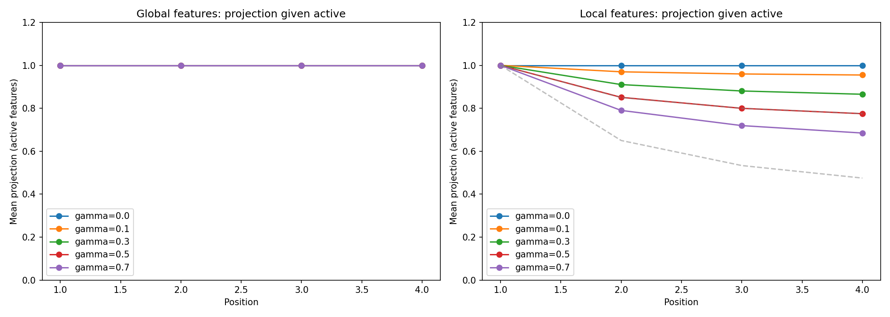

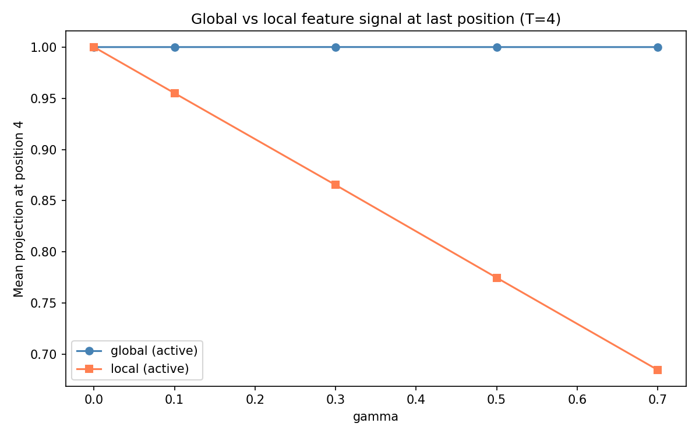

Global feature projections stay at 1.0 regardless of gamma and position. Local features get diluted at later positions — at gamma=0.7, position 4, the local projection drops to 0.685. The measured projection is slightly above the theoretical minimum ($1 - \gamma(t-1)/t$ at 1-indexed position $t$) because local features have a ~40% chance of being independently active at other positions too, which partially compensates.

**Metrics.** We used what Chanin et al. used: $c_{\text{dec}}$, decoder-feature cosine similarity heatmaps, and VE. The one addition is reporting the mean absolute heatmap diagonal split by global vs local features after greedy latent-to-feature matching ("recovery"). This reuses existing shared code, no new metric functions.

**Four experiments (all T=4, 3 seeds each, 10M training samples per run):**

- **A** — L0 sweep at gamma=0.3 (5g+5l, d=20, p=0.4)
- **B** — Gamma sweep at correct L0 (5g+5l, d=20, p=0.4) — the key experiment
- **C** — 2x2 design: gamma {0, 0.3} x correlations {none, +0.4 between globals}
- **D** — Large-scale L0 sweep (25g+25l, d=100, gamma=0.3, power-law probs)

## results

**Experiment A — L0 sweep (gamma=0.3)**

| $k$ | $c_{\text{dec}}$ | rec (global) | rec (local) |
| --- | ---------------- | ------------ | ----------- |
| 1   | 0.228            | 0.751        | 0.397       |
| 2   | 0.145            | 0.921        | 0.488       |
| 3   | 0.126            | 0.945        | 0.629       |
| 4   | 0.092            | 0.944        | 0.781       |
| 5   | 0.093            | 0.861        | 0.689       |
| 6   | 0.093            | 0.778        | 0.796       |
| 7   | 0.079            | 0.705        | 0.674       |
| 8   | 0.081            | 0.665        | 0.657       |

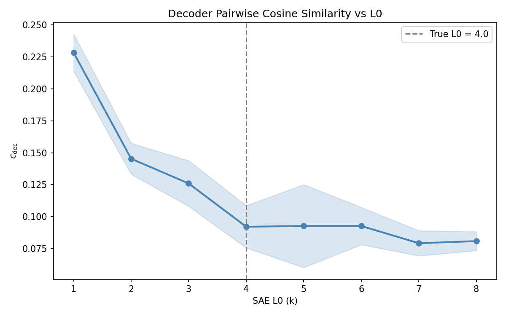

$c_{\text{dec}}$ drops steeply from $k=1$ to $k=4$ (the true per-position $L_0$), then flattens. Not a clean V-shape like in v0, but there is a clear knee near the true $L_0$. Global recovery peaks at $k=3\text{-}4$ (around 0.94), while local recovery keeps climbing and actually surpasses global at $k=6$. At the correct $L_0$ ($k=4$), there is a clear gap: global 0.944 vs local 0.781.

$k=2$ (too low):

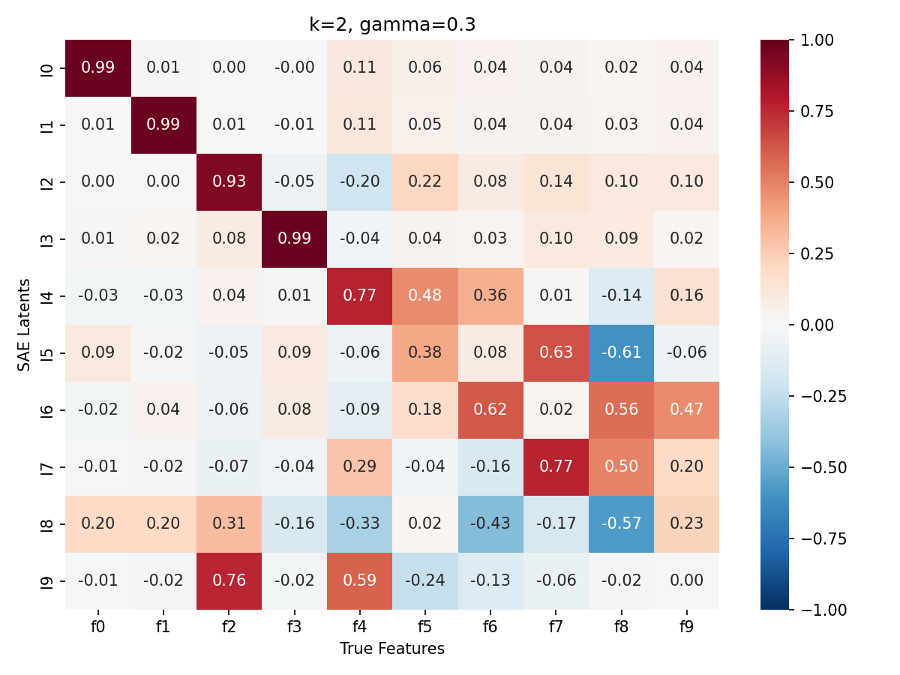

$k=4$ (correct per-position L0):

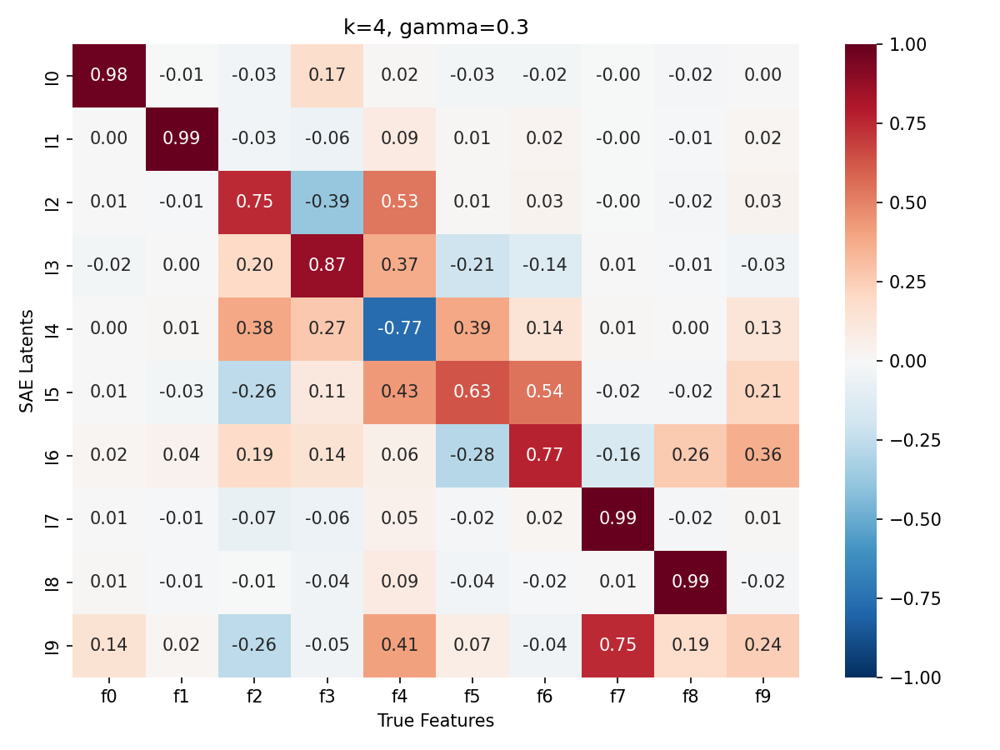

$k=6$:

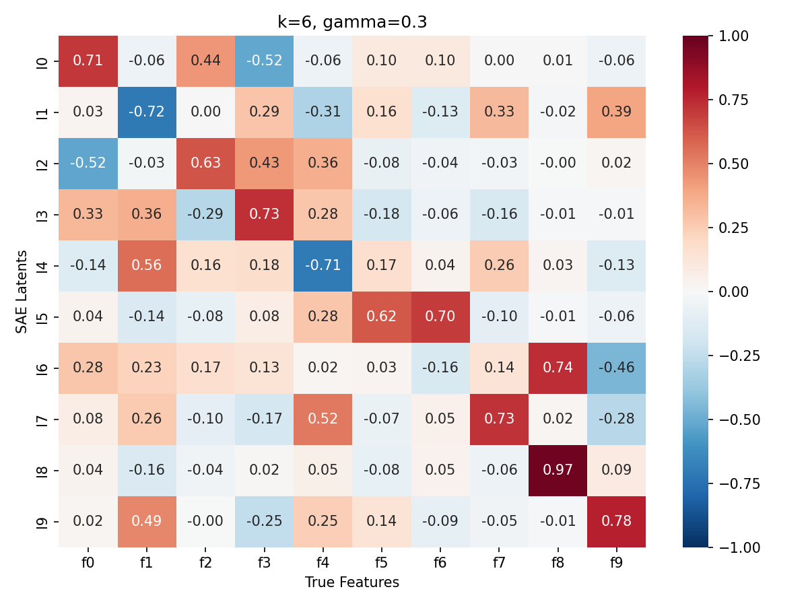

**Experiment B — Gamma sweep (the key one)**

| $\gamma$ | $c_{\text{dec}}$ | rec (global) | rec (local) |
| -------- | ---------------- | ------------ | ----------- |
| 0.0      | 0.088            | 0.887        | 0.886       |
| 0.1      | 0.075            | 0.930        | 0.734       |
| 0.2      | 0.093            | 0.953        | 0.692       |
| 0.3      | 0.092            | 0.944        | 0.781       |
| 0.5      | 0.113            | 0.900        | 0.683       |
| 0.7      | 0.132            | 0.838        | 0.511       |

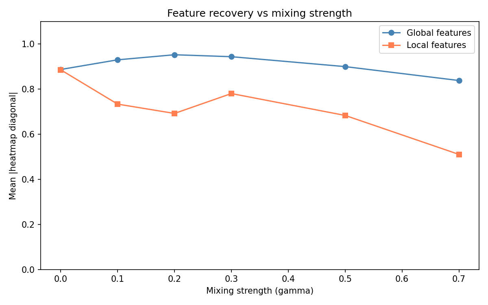

The gamma=0 baseline is what we'd expect: 0.887 global vs 0.886 local — essentially identical. No mixing, no differential. This confirms the setup is working correctly.

As gamma increases, local recovery drops substantially (0.886 → 0.511 at gamma=0.7). Global recovery actually *increases* slightly at moderate gamma (peaking at 0.953 at gamma=0.2) before declining at high gamma (0.838 at gamma=0.7). This makes sense: moderate mixing reinforces global features enough to help the SAE lock onto them, but very strong mixing adds so much noise that even global features suffer.

The global-local gap widens with gamma. At gamma=0.7, the ratio is 0.838/0.511 = 1.6x. The local recovery curve is noisy at intermediate gamma values (with only 3 seeds the variance is substantial — e.g. seed 44 at gamma=0.3 gives local recovery of 0.849 while seed 42 gives 0.725), but the overall trend from 0.886 down to 0.511 is clear.

$\gamma=0.0$ — no mixing:

$\gamma=0.3$:

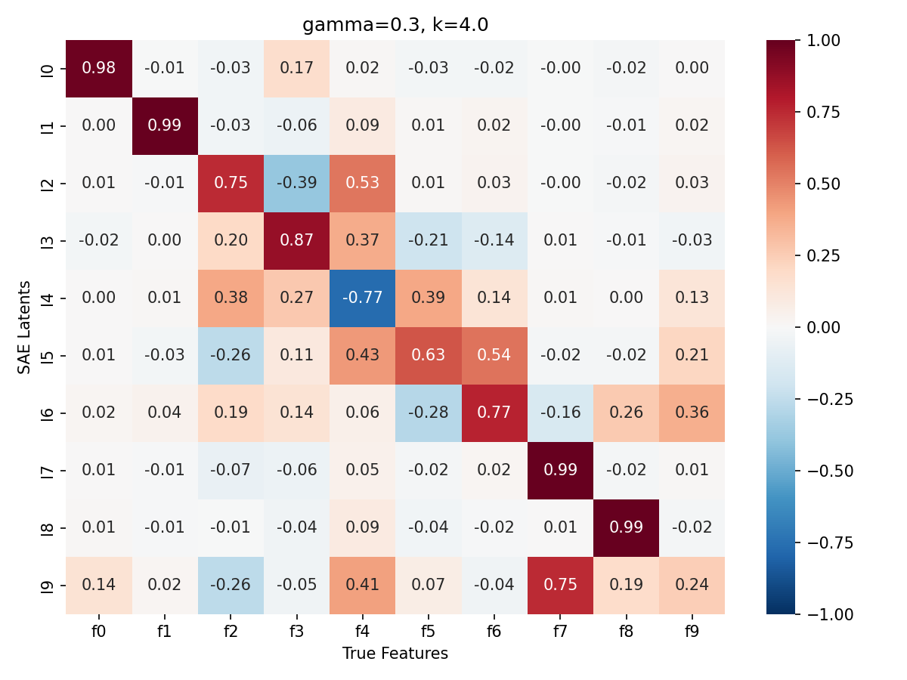

$\gamma=0.7$ — strong mixing:

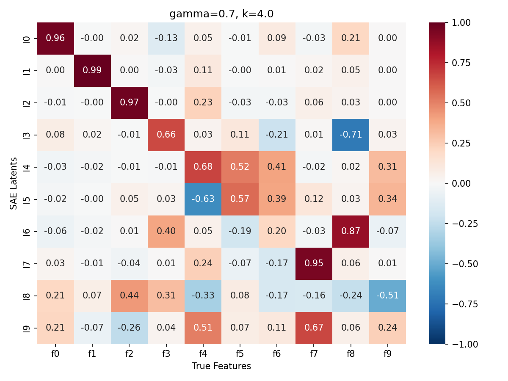

**Experiment C — Mixing x correlations**

| Condition              | $c_{\text{dec}}$ | rec (global) | rec (local) | VE    |
| ---------------------- | ---------------- | ------------ | ----------- | ----- |
| gamma=0, no corr       | 0.088            | 0.887        | 0.886       | 0.927 |
| gamma=0, +corr         | 0.083            | 0.770        | 0.943       | 0.947 |
| gamma=0.3, no corr     | 0.092            | 0.944        | 0.781       | 0.905 |
| gamma=0.3, +corr       | 0.092            | 0.817        | 0.832       | 0.909 |

This is interesting. Without mixing, adding correlations between global features hurts global recovery (0.887 → 0.770) but actually *helps* local recovery (0.886 → 0.943). The Chanin et al. effect: correlated features are harder to separate, so the SAE struggles with globals — but this seems to free up capacity for the uncorrelated local features.

Mixing and correlations act on different feature types in opposite directions. Mixing primarily hurts local features (dilution), correlations primarily hurt global features (entanglement). When both are present, the effects partially offset each other (global 0.817, local 0.832 — roughly comparable).

gamma=0, no correlations:

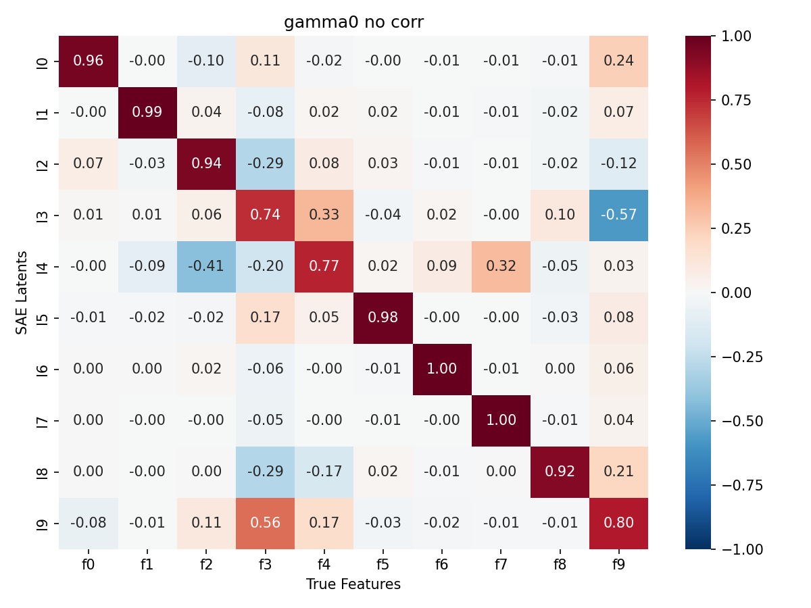

gamma=0.3, with correlations:

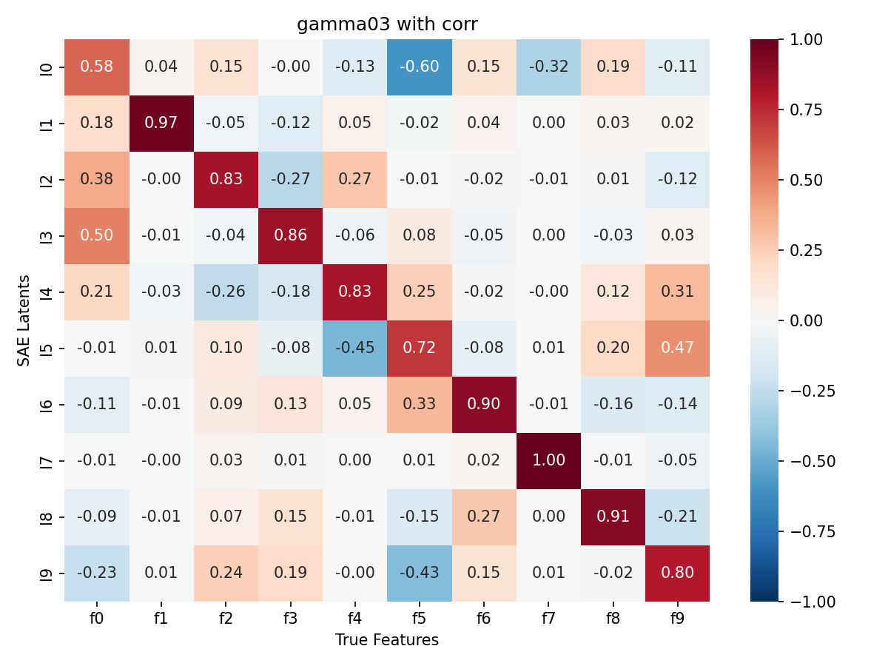

**Experiment D — Large scale (gamma=0.3)**

| $k$  | $c_{\text{dec}}$ | rec (global) | rec (local) |
| ---- | ---------------- | ------------ | ----------- |
| 2    | 0.131            | 0.721        | 0.126       |
| 4    | 0.110            | 0.865        | 0.162       |
| 6    | 0.101            | 0.953        | 0.252       |
| 8    | 0.075            | 0.982        | 0.408       |
| 10   | 0.062            | 0.911        | 0.553       |
| 12   | 0.059            | 0.851        | 0.613       |
| 14   | 0.063            | 0.783        | 0.587       |
| 17   | 0.062            | 0.754        | 0.562       |
| 20   | 0.076            | 0.706        | 0.436       |

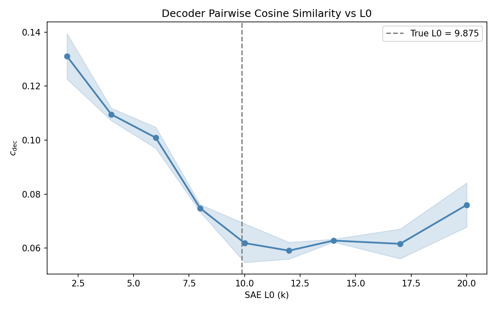

At scale (50 features, 100 dimensions), the differential is dramatic. Global recovery peaks at 0.982 ($k=8$, near the true $L_0 \approx 9.9$), while local recovery peaks at only 0.613 ($k=12$). The $c_{\text{dec}}$ curve has a rough minimum around $k=10\text{-}12$.

The SAE heavily prioritizes global features. At $k=8$, global recovery is 0.982 vs local 0.408 — a 2.4x ratio. Even at the best $k$ for local features ($k=12$), the gap is still 0.851 vs 0.613.

$k=4$:

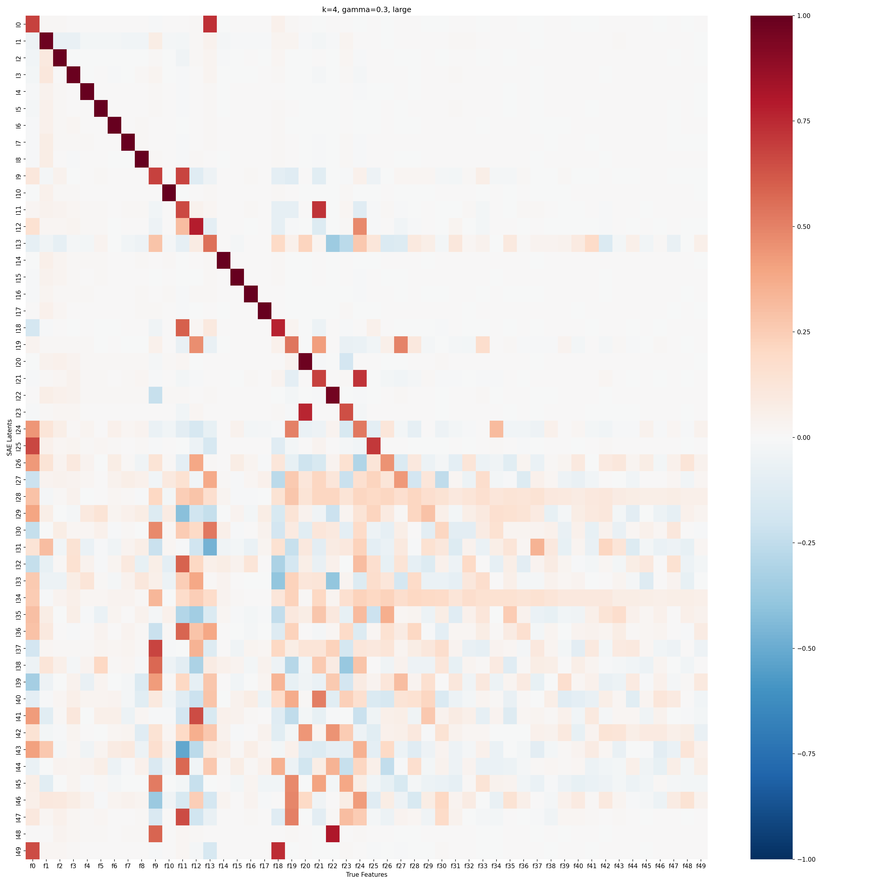

$k=10$ (near true L0):

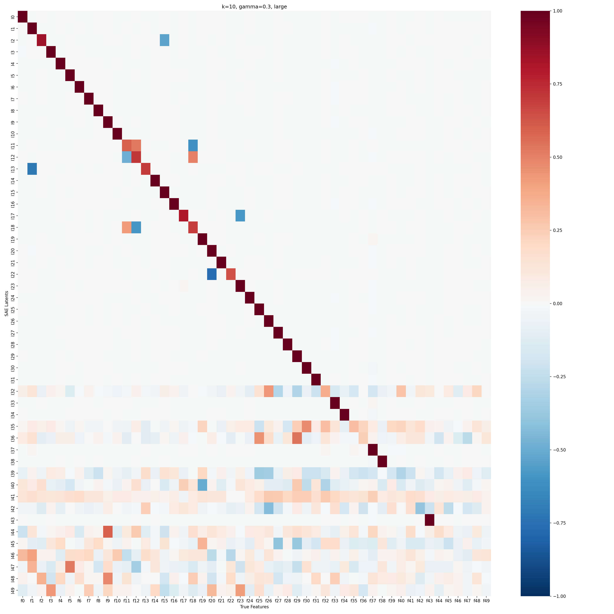

## caveats and open questions

**Seed variance is high.** With only 3 seeds, some intermediate gamma values show noisy trends (e.g. local recovery at gamma=0.3 is pulled up by one seed). The endpoints (gamma=0 vs gamma=0.7) are clear, but the exact shape of the curve between them is uncertain. More seeds would help but are expensive.

**The mixing formula is very simplified.** Real attention is softmax-weighted, query-key-dependent, and multi-headed. Our causal mean-pool is a uniform average over all prior positions. The qualitative effect (reinforcing repeated features) should be similar, but the quantitative strength and the way it interacts with feature correlations could be quite different.

**We only looked at one T value.** All experiments used T=4. The mixing effect should be stronger at larger T (more positions to average over, more dilution for local features) and weaker at T=2. Haven't checked this yet.

**Global recovery also drops at high gamma.** The mixing doesn't just hurt local features — at gamma=0.7, global recovery drops to 0.838 (from 0.887 at gamma=0). This means very strong uniform mixing is noisy enough to hurt all features, just disproportionately.

## what we can say so far

Adding causal mixing to the toy model creates a measurable differential between global and local feature recovery. At gamma=0 (no mixing), the per-token SAE recovers both types equally well (~0.89). As mixing increases, global features maintain or slightly improve their recovery while local features degrade, with the gap widening overall. At gamma=0.7 the ratio is about 1.6x; at scale (50 features, gamma=0.3) it's about 2.4x.

The mechanism is the asymmetric effect of mean-pooling: global features project at full strength after mixing (every position contributes coherently) while local features get diluted (other positions contribute noise). This is at least a toy setup where a per-token SAE demonstrably does worse on one type of feature than another, which is what we need to motivate looking at multi-position architectures. Whether this particular mechanism is relevant to real transformers is an open question.
