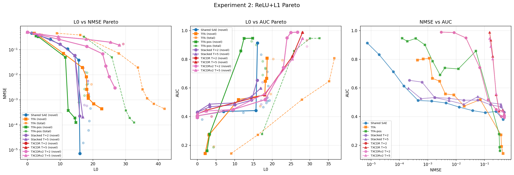
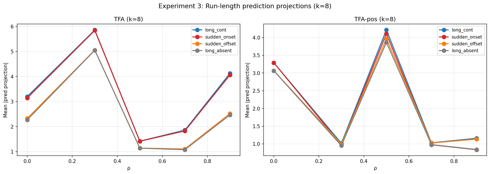
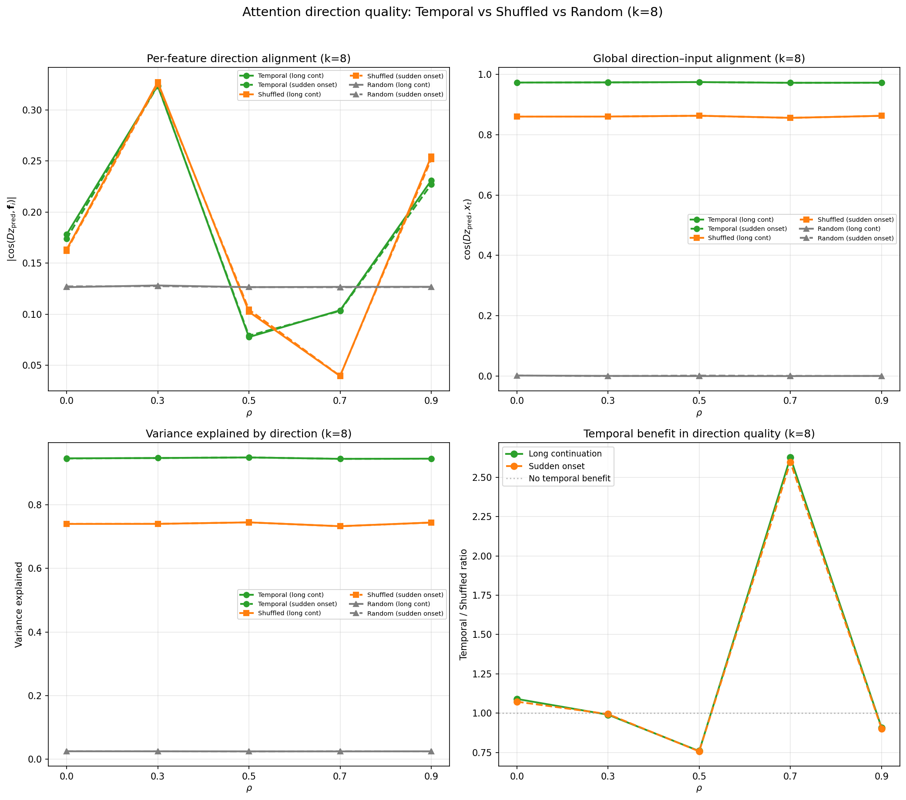

## Objective

Test whether Temporal Feature Analysis (TFA; Bhalla et al., 2025) outperforms a standard sparse autoencoder on synthetic data with known temporal correlations. Determine how much of any advantage comes from temporal structure vs architectural capacity.

## Background

**TFA** decomposes each token's reconstruction into a **predictable component** (produced by causal attention over previous positions; dense) and a **novel component** (a standard sparse encoder applied to the residual; sparse via TopK or L1). The full reconstruction is $\hat{x}_t = D(z_{p,t} + z_{n,t}) + b$ using a shared dictionary $D$.

The TFA paper's primary claims are qualitative — its predictive codes capture slow-moving contextual structure (event boundaries, syntactic chunks), not that it achieves lower reconstruction error. Table 1 of the paper shows TFA achieves *comparable* NMSE to standard SAEs. Our evaluation therefore asks three questions: (1) does TFA achieve lower NMSE under sparsity constraints, (2) does TFA's decomposition correctly separate persistent from transient features, and (3) how much of any advantage comes from temporal structure vs extra capacity?

**Temporal crosscoder (TXCDR).** A shared-latent crosscoder (ckkissane-style; ported from Andre Shportko's implementation) that encodes a window of $T$ consecutive tokens into a single sparse latent vector $z$ with $k$ active features, then decodes back to $T$ positions using per-position decoder weights. The encoder sums position-weighted projections: $z = \text{TopK}(\sum_t x_t W_{\text{enc}}^{(t)} + b_{\text{enc}})$. Unlike TFA, the crosscoder has no causal mask --- it sees all $T$ positions simultaneously. We use $T = 2$ as the primary comparison (the smallest temporal window).

**TFA-pos.** A variant of TFA with sinusoidal positional encoding added to the attention mechanism's query and key inputs (but not values). In our toy model, tokens have no positional information --- $x_t$ depends only on which features are active, not on position $t$. TFA's attention therefore cannot distinguish "this token was 2 positions ago" from "this token was 50 positions ago." TFA-pos injects fixed positional embeddings into Q/K so the attention can learn position-dependent routing (e.g., "attend more to recent tokens"), while values remain content-only. The positional encoding is a non-learnable buffer, so TFA-pos has the same trainable parameter count (8,200) as TFA.

**L0 ambiguity.** TFA's predictable component is dense (~20 nonzero codes regardless of $k$). We report both *novel L0* (sparse component only, = $k$ under TopK) and *total L0* (novel + predictable). Plotting TFA against novel L0 flatters it; plotting against total L0 does not.

**Feature recovery AUC.** In addition to NMSE, we measure how well each model's decoder directions recover the true feature directions (adapted from Shportko's evaluation). For each true feature $\mathbf{f}_i$, we find the best-matching decoder column by absolute cosine similarity: $\max_j |\cos(d_j, \mathbf{f}_i)|$. The AUC sweeps a threshold $\tau$ from 0 to 1 and integrates the fraction of features recovered at each threshold. AUC = 1.0 means every true feature has a perfectly aligned decoder column. R@0.9 is the fraction of features with best-match cosine $\geq 0.9$.

## Data

Synthetic data with temporal correlations controlled by construction. The activation vector at each sequence position $t$ is $\mathbf{x}_t = \sum_{i=1}^{n} s_{i,t} \, \mathbf{f}_i$, where $\mathbf{f}_1, \ldots, \mathbf{f}_n$ are orthogonal unit-norm feature directions and $s_{i,t} \in \{0,1\}$ is the support indicator (unit magnitudes).

For each feature $i$ independently, the support sequence $(s_{i,1}, s_{i,2}, \ldots)$ follows a two-state Markov chain parametrised by:

- $\pi_i$ — the **marginal activation probability** (stationary distribution).
- $\rho_i$ — the **lag-1 autocorrelation**. $\rho = 0$ gives i.i.d. support; $\rho = 0.9$ gives highly persistent features. Lag-$k$ autocorrelation decays geometrically: $\text{Corr}(s_{i,t}, s_{i,t+k}) = \rho_i^k$.

The transition probabilities are derived from $(\pi_i, \rho_i)$: $p_{01} = \pi_i(1 - \rho_i)$ (off $\to$ on), $p_{10} = (1 - \pi_i)(1 - \rho_i)$ (on $\to$ off). Higher $\rho$ compresses both transition rates toward zero, making features "stickier" — they stay on longer once activated and stay off longer once deactivated. Features are mutually independent; temporal correlations exist only within each feature across positions.

**Configuration.** $n = 20$ features, $d = 40$, $\pi = 0.5$ for all features ($\mathbb{E}[L_0] = 10$). To test whether TFA's behavior varies with temporal persistence, we spread $\rho$ across five levels: 4 features each at $\rho \in \{0.0, 0.3, 0.5, 0.7, 0.9\}$. Sequences of length $T = 64$. Input scaled so $\mathbb{E}[\|x\|] = \sqrt{d}$.

Data sanity check: all marginal rates within 0.002 of $\pi = 0.5$, all lag-1 autocorrelations within 0.004 of target $\rho_i$, L0 mean = 10.0, std = 2.24 (theory: 2.24), feature directions max off-diagonal cosine = 0.0005.

**Binding regime.** When $k < \mathbb{E}[L_0] = 10$, the sparsity budget cannot represent all active features per token. TFA claims its predictable component can carry persistent features "for free," leaving the novel budget for new activations.

**Evaluation.** NMSE $= \sum \|x - \hat{x}\|^2 / \sum \|x\|^2$ over 128K tokens (2000 sequences $\times$ 64 positions). For both models, NMSE measures **full reconstruction quality**: $\hat{x} = D(z_{\text{pred}} + z_{\text{novel}}) + b$ for TFA, $\hat{x} = W_{\text{dec}} z + b_{\text{dec}}$ for the SAE. When plots label the x-axis as "TFA (novel L0 = $k$)", the y-axis is still the full model's NMSE — TFA's dense predictable component contributes reconstruction that is invisible on the x-axis.

## Experiment 1: TopK sweep

**Models.** All use dictionary width 40 and per-token TopK sparsity at the same $k$:

- **TopK SAE** (3,280 params): $z = \text{TopK}(\text{ReLU}(W_{\text{enc}}(x - b_{\text{dec}}) + b_{\text{enc}}), k)$, $\hat{x} = W_{\text{dec}} z + b_{\text{dec}}$. Separate encoder/decoder, decoder columns unit-normed. Processes tokens independently.
- **TFA** (8,200 params): 4-head causal attention (1 layer, bottleneck factor 1, tied weights $E = D^T$). The 2.5x parameter gap comes entirely from the attention layer (6,560 params for key/query/value/output projections).
- **TFA-shuffled** (8,200 params): Identical TFA trained on position-shuffled sequences (destroying temporal correlations while preserving marginal distributions). Same optimizer, learning rate, and schedule as TFA. Evaluated on unshuffled temporal data.
- **TFA-pos** (8,200 params): TFA with sinusoidal positional encoding in attention Q/K (not V). Same parameter count as TFA.
- **TFA-pos-shuf** (8,200 params): TFA-pos trained on position-shuffled sequences. Evaluated on unshuffled temporal data.
- **Stacked SAE** ($T$=2): $T$ independent SAEs, one per position in a window of 2 consecutive tokens. Each position gets $k$ active latents independently. The "per-position SAEs" baseline from the crosscoders paper (Anthropic, 2024), adapted to the temporal setting. Controls for position-specific decoder structure without shared-latent information sharing.
- **Stacked SAE** ($T$=5): Same architecture with 5-token window.
- **TXCDR** ($T$=2): Temporal crosscoder with shared latent. Same $k$ as SAE. Sees 2 consecutive tokens per window.
- **TXCDR** ($T$=5): Same architecture with 5-token window.
 
All models trained 30K steps.[^1]

**NMSE results:**

| $k$ | TopK SAE | TFA | TFA-shuf | TFA-pos | pos-shuf | Stacked ($T$=2) | Stacked ($T$=5) | TXCDR ($T$=2) | TXCDR ($T$=5) |
| --- | --- | --- | --- | --- | --- | --- | --- | --- | --- |
| 1 | 0.388 | 0.091 | 0.115 | 0.175 | 0.198 | 0.394 | 0.392 | 0.428 | 0.445 |
| 2 | 0.282 | 0.093 | 0.091 | 0.146 | 0.143 | 0.295 | 0.299 | 0.353 | 0.387 |
| 3 | 0.220 | 0.074 | 0.090 | 0.090 | 0.119 | 0.231 | 0.232 | 0.287 | 0.351 |
| 4 | 0.176 | 0.056 | 0.063 | 0.082 | 0.091 | 0.183 | 0.182 | 0.252 | 0.332 |
| 5 | 0.143 | 0.041 | 0.053 | 0.050 | 0.071 | 0.145 | 0.142 | 0.219 | 0.313 |
| 6 | 0.091 | 0.032 | 0.035 | 0.026 | 0.056 | 0.083 | 0.090 | 0.192 | 0.300 |
| 8 | 0.068 | 0.014 | 0.018 | **0.007** | 0.023 | 0.034 | 0.044 | 0.140 | 0.269 |
| 10 | 0.032 | 0.005 | 0.006 | **0.001** | 0.007 | 0.025 | 0.024 | 0.100 | 0.243 |
| 12 | 0.004 | 0.002 | 0.003 | 7.3e-4 | 0.004 | 0.006 | 0.006 | 0.072 | 0.219 |
| 15 | 9.4e-5 | 0.001 | 9.1e-4 | 3.9e-4 | 0.002 | 2.8e-4 | 2.1e-4 | 0.043 | 0.197 |
| 17 | 4.8e-5 | 4.7e-4 | 2.9e-4 | 2.1e-4 | 0.001 | 3.5e-5 | 3.8e-5 | 0.022 | 0.184 |
| 20 | 2.1e-6 | 3.7e-6 | 3.7e-6 | 6.6e-7 | 2.2e-4 | 1.0e-6 | 5.3e-6 | 0.010 | 0.170 |

**Feature recovery AUC:**

| $k$ | TopK SAE | TFA | TFA-shuf | TFA-pos | pos-shuf | Stacked ($T$=2) | Stacked ($T$=5) | TXCDR ($T$=2) | TXCDR ($T$=5) |
| --- | --- | --- | --- | --- | --- | --- | --- | --- | --- |
| 1 | 0.389 | 0.511 | 0.497 | 0.520 | 0.464 | 0.376 | 0.375 | 0.388 | 0.409 |
| 2 | 0.339 | 0.511 | 0.526 | 0.542 | 0.489 | 0.347 | 0.359 | 0.398 | 0.442 |
| 3 | 0.352 | 0.538 | 0.529 | 0.635 | 0.527 | 0.364 | 0.365 | 0.503 | 0.555 |
| 4 | 0.356 | 0.583 | 0.563 | 0.676 | 0.539 | 0.380 | 0.376 | 0.564 | 0.566 |
| 5 | 0.374 | 0.634 | 0.611 | 0.755 | 0.591 | 0.419 | 0.474 | 0.606 | 0.643 |
| 6 | 0.644 | 0.633 | 0.718 | **0.800** | 0.631 | 0.724 | 0.636 | 0.746 | 0.650 |
| 8 | 0.639 | 0.720 | 0.747 | **0.910** | 0.739 | 0.853 | 0.823 | **0.818** | 0.753 |
| 10 | 0.688 | 0.807 | 0.780 | **0.918** | 0.731 | 0.849 | 0.824 | **0.919** | 0.873 |
| 12 | 0.873 | 0.745 | 0.702 | **0.899** | 0.684 | **0.913** | **0.901** | **0.925** | **0.918** |
| 15 | 0.863 | 0.714 | 0.713 | 0.777 | 0.592 | **0.918** | **0.944** | **0.959** | 0.925 |
| 17 | 0.787 | 0.602 | 0.631 | 0.720 | 0.523 | 0.819 | 0.861 | **0.972** | **0.924** |
| 20 | 0.595 | 0.568 | 0.533 | 0.638 | 0.528 | 0.670 | 0.617 | **0.941** | **0.942** |


Left: NMSE vs $k$. Centre: feature recovery AUC vs $k$. Right: NMSE vs AUC scatter.

**Findings.**

1. **NMSE: TFA wins in binding regime, TXCDR loses everywhere.** TFA achieves 3--7$\times$ lower NMSE than SAE for $k \leq 10$. The crosscoder's shared-latent bottleneck ($k$ features explaining $T \times d$ values) makes it strictly worse than the per-token SAE at every $k$. Larger windows worsen the bottleneck: TXCDR $T$=5 is worse than $T$=2 at every $k$ (e.g., at $k = 8$: 0.266 vs 0.136). The SAE wins decisively once $k > \mathbb{E}[L_0]$.

2. **AUC: TXCDR $T$=2 dominates at $k \geq 10$ despite worst NMSE.** At $k = 10$, TXCDR $T$=2 achieves AUC = 0.90 while SAE gets 0.69 and TFA gets 0.81 --- yet TXCDR's NMSE (0.099) is 3$\times$ worse than SAE's (0.032). The crosscoder learns the true feature directions better than SAE or TFA, even though its reconstructions are worse. At $k = 15$, TXCDR $T$=2 reaches AUC = 0.94 (near-perfect feature recovery) with NMSE = 0.042, while SAE has AUC = 0.86 with NMSE = 0.0001. TXCDR $T$=5 has lower AUC than $T$=2 at matched $k$ (e.g., 0.754 vs 0.758 at $k = 8$), suggesting the smaller window provides a better-conditioned learning signal for feature recovery.

3. **NMSE--AUC dissociation.** Good reconstruction does not imply good feature recovery. The SAE achieves near-perfect NMSE at $k = 20$ but its AUC drops to 0.59 (R@0.9 = 0.00) --- it reconstructs perfectly via superposition without recovering the true feature directions. The TXCDR achieves poor NMSE but near-perfect AUC --- its decoder columns align with the true features even though the shared-latent bottleneck prevents good reconstruction.

4. **TFA's AUC peaks at $k = 10$ then declines.** TFA's feature recovery is best at AUC = 0.81 ($k = 10$), then drops to 0.71 at $k = 15$ and 0.57 at $k = 20$. Like the SAE, excess capacity degrades feature recovery. TFA-shuffled tracks TFA closely on AUC, consistent with the temporal fraction being small.

5. **TFA-pos beats TFA at $k \geq 8$ and has a larger temporal fraction.** With positional encoding, TFA-pos achieves NMSE = 0.007 at $k = 8$ (vs TFA's 0.014 --- 2$\times$ better) and NMSE = 0.001 at $k = 10$ (vs TFA's 0.005 --- 3$\times$ better). The temporal decomposition shows that positional encoding roughly doubles the temporal fraction:

| $k$ | TFA gap | TFA arch | TFA temp | TFA-pos gap | TFA-pos arch | TFA-pos temp |
| --- | --- | --- | --- | --- | --- | --- |
| 3 | 0.146 | 89% | 11% | 0.130 | 78% | 22% |
| 5 | 0.102 | 88% | 12% | 0.092 | 77% | 23% |
| 8 | 0.054 | 92% | 8% | 0.061 | 74% | **26%** |
| 10 | 0.027 | 97% | 3% | 0.030 | 83% | **17%** |

Architecture % $= (\text{NMSE}_{\text{SAE}} - \text{NMSE}_{\text{shuf}}) / (\text{NMSE}_{\text{SAE}} - \text{NMSE}_{\text{model}})$. TFA-pos achieves 17--26% temporal fraction (vs TFA's 3--12%), confirming that positional encoding enables the attention to exploit temporal correlations. Without positional info, TFA's attention can only do content matching; with it, the attention can also learn "attend more to recent tokens" which are more likely to share the current token's features (due to Markov correlations).

6. **TFA-pos has higher AUC than TFA across the binding regime.** At $k = 8$, TFA-pos AUC = 0.91 vs TFA AUC = 0.72 --- a 19% absolute improvement. TFA-pos-shuf AUC (0.74) is close to TFA-shuf (0.75), showing the AUC improvement is primarily from temporal structure, not from the positional encoding itself.

7. **TFA without positional encoding: 88--97% architectural capacity, 3--12% temporal.** TFA-shuffled captures most of TFA's advantage over the TopK SAE. The Wide TopK SAE (8,140 params, matching TFA's parameter count) performs comparably to or worse than the standard TopK SAE at $k \geq 8$, ruling out raw parameter count as the explanation. At $k = 15$, TFA-shuffled slightly outperforms TFA (ratio 0.91), suggesting the temporal prediction mechanism becomes counterproductive when the sparsity budget is sufficient.

8. **TFA-pos is worse than TFA at low $k$.** At $k = 1$, TFA-pos NMSE = 0.175 (vs TFA 0.091 --- nearly 2$\times$ worse). The positional encoding adds noise to the attention when there is only one sparse code to benefit from temporal routing. The crossover occurs at $k \approx 5$.

## Experiment 2: ReLU + L1 Pareto frontier

**Models.** Same architectures as Experiment 1, but using **ReLU + L1** sparsity instead of TopK. Both the SAE and TFA's novel component use a ReLU encoder with an L1 penalty $\lambda \|z\|_1$ on the latent codes; L0 emerges from training rather than being fixed. We call the SAE baseline in this experiment the **ReLU SAE** to distinguish it from the TopK SAE in Experiment 1. Swept $\lambda$ over 15 log-spaced values (ReLU SAE: $5 \times 10^{-3}$ to $20$; TFA: $0.15$ to $60$; TXCDR: $3.2 \times 10^{-2}$ to $32$). Each $\lambda$ produces one (L0, NMSE) point; the Pareto frontier is the lower envelope.



Left: L0 vs NMSE Pareto. Centre: L0 vs AUC Pareto. Right: NMSE vs AUC scatter. **Solid lines with large markers** are Pareto frontiers; **faded dots** are dominated runs.

**Findings.**

1. **TFA's novel-L0 frontier lies below the ReLU SAE's in the binding regime** (1.3--2.2x advantage at L0 = 7--12), consistent with Experiment 1. On total L0, TFA's frontier is strictly *above* the ReLU SAE's — TFA uses 20--32 total active codes for NMSE that the ReLU SAE achieves with fewer purely sparse codes. This confirms that TFA's NMSE advantage at matched novel L0 comes at the cost of a dense channel that inflates total representation complexity.

2. **TXCDR $T$=2 achieves the best feature recovery of any model** (AUC = 0.987 at L0 = 26.6), but its NMSE floor (0.003) is an order of magnitude worse than the ReLU SAE's best ($7 \times 10^{-6}$). This reinforces the NMSE--AUC dissociation from Experiment 1: the crosscoder learns the true feature directions even though the shared-latent bottleneck limits reconstruction quality.

3. **TXCDR $T$=5 is substantially worse** on both NMSE (0.151) and AUC (0.939), confirming the TopK finding that larger windows degrade both reconstruction and feature recovery.

4. **Both TXCDR variants collapse at moderate L1** (NMSE $\approx 0.5$), indicating narrow usable L1 ranges compared to the SAE and TFA.

5. **The SAE's AUC frontier plateaus around 0.91** at moderate L0 (~16), while TFA's AUC peaks at ~0.81 before declining. Neither achieves AUC $> 0.92$ --- contrast with TXCDR $T$=2's 0.987. The NMSE vs AUC scatter (right) confirms the dissociation: the lowest-NMSE SAE runs (NMSE $< 10^{-4}$) have AUC ranging from 0.6 to 0.9, while TXCDR runs with poor NMSE achieve AUC $> 0.96$.

6. **TFA-pos achieves the best NMSE--AUC tradeoff of any ReLU+L1 model.** At its best operating point (L1 $= 0.16$, novel L0 $= 14.8$), TFA-pos achieves NMSE $= 1.2 \times 10^{-4}$ with AUC $= 0.95$ --- lower NMSE than TFA ($4.3 \times 10^{-4}$) at comparable AUC. TFA-pos's AUC peaks at 0.95 (vs TFA's 0.81 and SAE's 0.91), making it the best ReLU+L1 model for feature recovery.

## Experiment 3: Temporal decomposition

**Question.** Does TFA's predictable component preferentially capture *continuing* features (on at $t-1$ and $t$, which are temporally predictable) vs *onset* features (off at $t-1$, on at $t$, which are not)?

**Model.** TFA only (no SAE baseline). Same TFA architecture as Experiment 1 (TopK novel component), trained at $k \in \{3, 5, 8, 10, 15\}$. We analyse TFA's internal decomposition using ground-truth feature labels.

Run: `TQDM_DISABLE=1 python src/v2_temporal_schemeC/run_temporal_decomposition_v2.py`.

**Method.** Using the ground-truth Markov chain state, we classify each (feature $i$, position $t > 1$) event into four types based on the transition from $t-1$ to $t$:

- **Continuation** (on $\to$ on): feature was active at $t-1$ and remains active at $t$ (37% of events)
- **Onset** (off $\to$ on): feature was inactive at $t-1$ and becomes active at $t$ (13%)
- **Offset** (on $\to$ off): feature was active at $t-1$ and becomes inactive at $t$ (13%)
- **Absent** (off $\to$ off): feature was inactive at both $t-1$ and $t$ (37%)

For each event type and $\rho$-group, we compute the **mean absolute prediction projection**: $\mathbb{E}[|\langle D z_{\text{pred},t}, \mathbf{f}_i \rangle|]$ averaged over all tokens of that event type for features in that $\rho$-group. This measures how strongly TFA's predictable component reconstructs along a given feature's direction. 95% confidence intervals via bootstrap (200 resamples). Sample sizes range from ~19K (onset at $\rho = 0.9$) to ~359K (continuation at $\rho = 0.9$).

If TFA exploits temporal structure, we expect: (1) continuations should have higher prediction projection than onsets (persistent features are predictable from context), (2) offset/absent should have low projection (inactive features should not be predicted), and (3) these patterns should be sharper for high-$\rho$ features (which are more temporally persistent).


Mean prediction projection for continuations vs onsets across $\rho$ groups, with 95% bootstrap CIs.


Mean prediction projection when the feature is ON vs OFF, showing high false-positive rates.


All four event types: continuation $\approx$ onset and offset $\approx$ absent at every $k$ and $\rho$.

**Findings.**

1. **Continuations $\approx$ onsets.** At every $k$ and $\rho$, prediction projections are virtually identical for continuing vs newly appearing features (e.g., at $k = 8$, $\rho = 0.9$: 4.10 vs 4.04). The predictable component does not detect whether a feature was previously active.

2. **High false-positive rate.** The predictable component projects strongly onto feature directions even when the feature is OFF. This is because TFA's projection-scale mechanism ($\text{proj\_scale} = \langle D z_{\text{pred}}, x \rangle / \|D z_{\text{pred}}\|^2$) uses the current token, so the output adapts to the input regardless of temporal context.

3. **No monotonic relationship with $\rho$.** If TFA exploited temporal persistence, high-$\rho$ features should show higher prediction projections. Instead, projections vary erratically (at $k = 8$: $\rho\!=\!0.3 \to 5.85$, $\rho\!=\!0.5 \to 1.40$, $\rho\!=\!0.9 \to 4.10$). Routing appears driven by training dynamics, not temporal structure.

**Interpretation.** The attention averages over all $T = 64$ context positions. With $\pi = 0.5$, a feature is active at ~32 prior positions; whether it was active at $t-1$ specifically is one bit diluted across this average. The decomposition routes features by identity (which features the predictable component "owns"), not by temporal event.

These findings suggest TFA's predictable component may function as a general-purpose reconstruction channel rather than a temporal predictor. **Experiment 3b** (below) strengthens this conclusion by testing against longer temporal histories and longer sequences.

### Experiment 3b: Run-length and sequence-length controls

**Motivation.** The lag-1 analysis above could be criticised as a weak test: the attention sees 64 context positions, so a single-position transition is diluted. Three alternative hypotheses remain: (1) TFA cares about *long* persistence (e.g., 5+ consecutive ON) rather than lag-1, (2) $T = 64$ is too short for attention to learn temporal patterns, and (3) the attention architecture simply cannot exploit this type of persistence. We test all three.

Run: `TQDM_DISABLE=1 PYTHONUNBUFFERED=1 python -u src/v2_temporal_schemeC/run_temporal_decomposition_v3.py`.

**Method.** For each (feature $i$, position $t$), we look at the full recent history $s_{i,t-4}, \ldots, s_{i,t}$ (5 positions) and classify into six categories:

- **Long continuation** ($1\!1\!1\!1\!1$): feature ON for all 5 positions --- the strongest temporal signal
- **Sudden onset** ($0\!0\!0\!0\!1$): feature OFF for 4 positions, then ON --- temporally unpredictable
- **Short continuation**: feature ON at $t-1$ and $t$, but not all 5 positions ON
- **Short onset**: feature OFF at $t-1$, ON at $t$, but not all 5 OFF before
- **Sudden offset** ($1\!1\!1\!1\!0$): feature ON for 4 positions, then OFF
- **Long absence** ($0\!0\!0\!0\!0$): feature OFF for all 5 positions

If TFA exploits temporal structure, long continuations should have substantially higher prediction projections than sudden onsets.

**Part 1: Run-length conditioning ($T = 64$, $k \in \{5, 8\}$).**

| Category | $\rho = 0.5$ | $\rho = 0.9$ | Ratio (long/sudden) |
| --- | --- | --- | --- |
| Long cont ($k=8$) | 1.397 | 4.128 | --- |
| Sudden onset ($k=8$) | 1.422 | 4.054 | --- |
| **long/sudden** | **0.98** | **1.02** | $\approx 1.0$ |
| Long cont ($k=5$) | 4.964 | 3.512 | --- |
| Sudden onset ($k=5$) | 4.964 | 3.407 | --- |
| **long/sudden** | **1.00** | **1.03** | $\approx 1.0$ |

The same pattern holds for the OFF side: sudden offset $\approx$ long absence at all $\rho$ values.

**TFA-pos run-length conditioning ($T = 64$, $k \in \{5, 8\}$).**

| Category | $\rho = 0.5$ | $\rho = 0.9$ | Ratio (long/sudden) |
| --- | --- | --- | --- |
| Long cont ($k=8$) | 4.213 | 1.158 | --- |
| Sudden onset ($k=8$) | 4.108 | 0.836 | --- |
| **long/sudden** | **1.03** | **1.39** | $> 1.0$ |
| Long cont ($k=5$) | 5.398 | 0.908 | --- |
| Sudden onset ($k=5$) | 4.818 | 0.997 | --- |
| **long/sudden** | **1.12** | **0.91** | mixed |

With positional encoding, TFA-pos shows a long/sudden ratio of **1.39 at $\rho = 0.9$, $k = 8$** --- a 39% distinction that is absent in position-blind TFA (ratio 1.02). This confirms that positional encoding enables some temporal discrimination in the attention direction. The effect is modest and not uniform: at $k = 5$, $\rho = 0.9$, the ratio is 0.91, suggesting the temporal routing learned by TFA-pos is $k$-dependent.


For position-blind TFA (above plot): long continuation, sudden onset, and short continuation all produce virtually identical prediction projections at every $\rho$. The three curves overlap completely.



For TFA-pos (above plot): at $\rho = 0.9$, long continuation produces higher prediction projections than sudden onset, showing the positional encoding enables some temporal discrimination.

**Part 2: Sequence length ($T = 64$ vs $T = 256$, $k = 8$).**

| $T$ | $\rho$ | Long cont | Sudden onset | Ratio |
| --- | --- | --- | --- | --- |
| 64 | 0.5 | 1.397 | 1.422 | 0.983 |
| 64 | 0.9 | 4.128 | 4.054 | 1.018 |
| 256 | 0.5 | 0.237 | 0.237 | 1.001 |
| 256 | 0.9 | 3.862 | 3.844 | 1.005 |


At $T = 256$ with ~12 full ON/OFF cycles per feature (vs ~3 at $T = 64$), the long/sudden ratio moves *closer* to 1.0, not further.

**Findings.**

1. **Run-length history is irrelevant.** Whether a feature has been ON for 5+ consecutive positions or has just appeared makes no difference to the predictable component (ratios 0.98--1.03 across all conditions). This rules out the hypothesis that TFA exploits long-run persistence rather than lag-1 transitions.

2. **More context does not help.** Quadrupling the sequence length to $T = 256$ makes the long/sudden ratio even closer to 1.0. With 256 context positions and ~12 full cycles per feature at $\rho = 0.9$, the attention has ample opportunity to detect temporal patterns --- and ignores them.

3. **Content-based matching drowns out temporal signal.** The attention should in principle produce different directions for the two cases: in the 11111 case, context tokens contain feature $i$, so the attention direction should align with $\mathbf{f}_i$; in the 00001 case, context lacks feature $i$, so it should not. But with $\pi = 0.5$ and 20 features, any two tokens share ~5 features on average ($n\pi^2 = 5$). The attention finds partially matching tokens and produces a broad direction spanning many features, regardless of whether the specific feature under test appeared in context. The temporal signal (whether one particular feature was in context) is overwhelmed by the content-matching signal (many other shared features). The proj\_scale step then projects $x_t$ onto this broadly similar direction, yielding similar projections along $\mathbf{f}_i$ for both cases.

4. **The non-monotonic $\rho$ dependence persists.** Projection strength at $k = 8$ peaks at $\rho = 0.3$ ($\approx 5.85$), drops at $\rho = 0.5$ ($\approx 1.40$), and partially recovers at $\rho = 0.9$ ($\approx 4.13$). This confirms that which features the predictable component "owns" is determined by training dynamics and feature identity, not by temporal persistence.

Experiment 3c directly tests the content-matching hypothesis by examining the raw attention direction before proj\_scale.

### Experiment 3c: Attention direction quality analysis

**Motivation.** Experiments 3/3b show that the *final* prediction projection (after proj\_scale) is identical for long continuations and sudden onsets. But this could mean either (a) the attention genuinely fails to distinguish them, or (b) the attention produces different directions but proj\_scale collapses the difference. To disentangle these, we examine the raw attention direction $D z_{\text{pred}}$ *before* proj\_scale, comparing three conditions: TFA trained on temporal data, TFA trained on shuffled data, and random directions.

Run: `TQDM_DISABLE=1 PYTHONUNBUFFERED=1 python -u src/v2_temporal_schemeC/run_attention_direction_analysis.py`.

**Method.** For each trained TFA, we extract the raw attention direction $D z_{\text{pred}}$ (the decoded attention output before the proj\_scale step) and compute:

- **Per-feature alignment** $|\cos(D z_{\text{pred}}, \mathbf{f}_i)|$: does the direction point toward the specific feature under test?
- **Global alignment** $\cos(D z_{\text{pred}}, x_t)$: how well does the direction match the full input?
- **Variance explained** $\langle \hat{d}, x_t \rangle^2 / \|x_t\|^2$ where $\hat{d}$ is the unit direction: fraction of $x_t$'s energy captured by projection onto the direction.

Three conditions: temporal TFA, shuffled TFA, and random unit directions. All evaluated on the same unshuffled temporal eval data. Broken down by run-length category (long continuation, sudden onset, etc.) and $\rho$ group.

**Results — global direction quality ($k = 8$):**

| Condition | $\cos(Dz, x_t)$ | Var explained |
| --- | --- | --- |
| Temporal | 0.971 | 94.3% |
| Shuffled | 0.858 | 73.6% |
| Random | 0.000 | 2.5% |

The temporal model produces substantially better directions than shuffled (94% vs 74% variance explained), and both are far above random. Content-based matching (benefit 2) accounts for the bulk of direction quality, and temporal training adds ~20% variance explained on top.

**Results — per-feature alignment $|\cos(Dz, \mathbf{f}_i)|$ at $\rho = 0.9$, $k = 8$:**

| Condition | Long cont | Sudden onset | Ratio |
| --- | --- | --- | --- |
| Temporal | 0.231 | 0.227 | 1.02 |
| Shuffled | 0.255 | 0.252 | 1.01 |
| Random | 0.127 | 0.127 | 1.00 |

Long continuation $\approx$ sudden onset for **all** conditions — temporal, shuffled, and random. The attention does not produce directions that align more with $\mathbf{f}_i$ when the feature was persistently active in context.

**Results — global alignment is also identical across categories ($k = 8$, temporal):**

| Category | $\cos(Dz, x_t)$ | Var explained |
| --- | --- | --- |
| Long cont ($\rho = 0.9$) | 0.972 | 94.5% |
| Sudden onset ($\rho = 0.9$) | 0.972 | 94.5% |
| Sudden offset ($\rho = 0.9$) | 0.971 | 94.3% |
| Long absent ($\rho = 0.9$) | 0.971 | 94.3% |



**Findings.**

1. **The attention direction does not encode per-feature temporal history.** Per-feature alignment $|\cos(Dz, \mathbf{f}_i)|$ is virtually identical for long continuations and sudden onsets (ratio $\approx 1.0$) in all three conditions. This rules out explanation (b) — the attention genuinely fails to distinguish these cases, and proj\_scale is not collapsing a signal that was there.

2. **Temporal training improves overall direction quality, not temporal prediction.** The temporal model achieves 94% variance explained vs 74% for shuffled — a large gap. But this improvement is uniform across all run-length categories. The temporal model does not get *disproportionately* better for long continuations. The improvement likely comes from training on data whose distribution matches the eval data, not from learning temporal patterns.

3. **Content-based matching accounts for 74% of variance explained.** The shuffled model, which has no access to temporal information, still achieves 74% variance explained — the attention finds content-similar tokens in context regardless of position. The remaining ~20% gap between temporal and shuffled is consistent with the 3--12% temporal fraction from the shuffle diagnostic (Experiment 1, finding 5), given that direction quality maps nonlinearly to NMSE.

4. **The per-feature alignment is only 0.23 even for the temporal model.** The direction $D z_{\text{pred}}$ is broadly distributed across many features, not sharply aligned with any single one. This confirms that the attention produces a broad content-matching direction rather than a feature-specific prediction.

## Synthesis

### Summary of findings

1. **TFA achieves 3--7x lower NMSE than a standard SAE at matched novel sparsity in the binding regime**, consistent across both TopK (Experiment 1) and ReLU+L1 (Experiment 2) sparsity mechanisms. The advantage peaks at 6.7x near $k = \mathbb{E}[L_0] = 10$ and disappears once the SAE has enough capacity ($k > 12$).

2. **Most of this advantage is architectural capacity, not temporal structure** (Experiment 1, finding 5). TFA-shuffled — trained on data with all temporal correlations destroyed — captures most of TFA's advantage over the TopK SAE (2.4--5.7x improvement vs the TopK SAE's baseline). TFA improves only 1.2--1.3x beyond TFA-shuffled. Our linear decomposition attributes roughly 88--97% of the total NMSE gap to architecture and 3--12% to temporal structure, though these estimates are from a single seed and the decomposition does not account for possible architecture-temporal interactions.

3. **Temporal structure provides a small benefit without positional encoding, and a substantial benefit with it** (Experiment 1, findings 5--8). Without positional encoding, TFA's temporal fraction is 3--12%. With positional encoding (TFA-pos), the fraction rises to 17--26%. At $k = 8$, TFA-pos achieves 2$\times$ lower NMSE than TFA and 19% higher AUC. This shows that the attention mechanism *can* exploit temporal correlations when given positional information, but cannot do so from content alone in our toy model.

4. **TFA's predictable component does not distinguish temporal transitions** (Experiments 3, 3b): continuation and onset projections are virtually identical, and prediction strength shows no monotonic relationship with temporal persistence $\rho$. The predictable component does partially distinguish ON from OFF features (with high false-positive rates), but this discrimination does not depend on temporal history. This result is robust to stronger tests: conditioning on 5-position run-length history (long continuation $1\!1\!1\!1\!1$ vs sudden onset $0\!0\!0\!0\!1$) gives ratios of 0.98--1.02, and quadrupling the sequence length to $T = 256$ moves the ratio even closer to 1.0 (Experiment 3b). The likely explanation is that content-based matching dominates: with $\pi = 0.5$ and 20 features, any two tokens share ~5 features by chance, so the attention finds broadly similar context tokens regardless of whether the specific feature under test was active in context (see "Why content-based matching dominates" below).

5. **NMSE and feature recovery (AUC) are dissociated** (Experiments 1, 2). Good reconstruction does not imply good feature recovery. The SAE at $k = 20$ achieves near-perfect NMSE ($2 \times 10^{-6}$) but AUC = 0.59 --- it reconstructs via superposition without recovering the true feature directions. Conversely, the temporal crosscoder (TXCDR, $T = 2$) at $k = 15$ achieves AUC = 0.94 (near-perfect feature recovery) but NMSE = 0.042 --- its shared-latent bottleneck prevents good reconstruction while its per-position decoder columns align well with the true features. TFA sits between the two: AUC peaks at 0.81 ($k = 10$) then declines, mirroring the SAE's pattern. This dissociation is consistent with the "Sparse but Wrong" thesis (Chanin et al., 2025): reconstruction-optimized models may learn superposed representations that do not correspond to the true features.

### Why the attention mechanism helps without temporal structure

We hypothesise that TFA's attention mechanism provides reconstruction capacity through two pathways that do not require temporal order:

**Content-based retrieval.** The query (derived from the current token's encoding) and keys (from context tokens) interact via dot-product attention. Even when context tokens are randomly ordered, tokens that share active features with the current token should produce higher attention weights. The value projection then retrieves a weighted reconstruction biased toward the current token's content. With $\pi = 0.5$ and 20 features, any two tokens share ~5 features on average ($n \pi^2 = 5$), providing some signal for content-based matching even in shuffled sequences.

**Projection scaling.** After attention produces a predicted direction $D z_{\text{pred}}$, TFA scales it by $\text{proj\_scale} = \langle D z_{\text{pred}}, x \rangle / \|D z_{\text{pred}}\|^2$, which is the scalar projection of the current input onto the predicted direction. This adapts the predictable component's magnitude to the current token regardless of how the direction was obtained. Even a constant attention output (which would occur if context were completely uninformative) gets scaled to match the current input, providing a rank-1 reconstruction "for free." Note that proj\_scale is not the reason the Experiment 3b long/sudden ratio is $\approx 1.0$ --- even though $x_t$ is the same in both cases (the toy model is a memoryless embedding), the attention *direction* differs, and proj\_scale projects $x_t$ onto that direction, so different directions should yield different projections. The real reason is that content-based matching produces broadly similar directions regardless of whether the specific feature was in context (see below).

Together, these mechanisms give TFA an additional dense reconstruction channel with ~20 active codes that does not count toward the novel L0 budget. Note that this is not equivalent to an optimal rank-20 projection (which would give perfect reconstruction on our 20-feature data); TFA-shuffled at $k = 3$ still has NMSE $= 0.09$, so the predictable component captures only a fraction of the information that an oracle projection would. Nevertheless, this channel is sufficient to dramatically outperform the TopK SAE. We have not directly verified these mechanisms (e.g., by inspecting attention weights on shuffled data); they remain a plausible explanation for TFA-shuffled's strong performance.

### Why extra parameters alone do not help

The Wide TopK SAE (dictionary width 100, 8,140 params — roughly matching TFA's 8,200) performs comparably to or *worse* than the standard TopK SAE (width 40, 3,280 params) at $k \geq 8$. With 100 dictionary atoms in a 40-dimensional space, the extra atoms create redundant directions that compete during training, and TopK selection from a larger pool does not help when the underlying data has only 20 ground-truth features.

This rules out the simplest capacity hypothesis — that TFA wins merely because it has more parameters. TFA's advantage comes from the specific computational structure of the attention mechanism (query-key interaction, value aggregation, projection scaling), not from parameter count per se. We note, however, that the wide SAE tests only one form of extra capacity (wider dictionary); other ways of adding parameters to the SAE (e.g., deeper encoders, multiple encoder heads) were not tested.

### Why content-based matching dominates temporal signal

Experiment 3c directly confirms that content-based matching, not temporal prediction, drives the attention direction. The shuffled model achieves 74% variance explained (vs 94% temporal, 2.5% random), meaning that context tokens matched by content alone --- without any temporal order --- provide most of the directional signal. The temporal model's additional ~20% comes from training distribution match, not from per-feature temporal prediction: the per-feature alignment $|\cos(Dz, \mathbf{f}_i)|$ is identical for long continuations and sudden onsets in *both* temporal and shuffled models (Experiment 3c finding 1).

The mechanism is clear: with $\pi = 0.5$ and 20 features, $x_t$ has ~10 active features, and any context token shares ~5 of them ($n\pi^2 = 5$). The attention's query-key matching is dominated by these ~5 shared features, not by the single feature $i$ under test. Whether feature $i$ specifically appeared in context barely perturbs the attention weights, because it's one signal among many. The resulting direction $D z_{\text{pred}}$ is broadly distributed across features (per-feature alignment only ~0.23 even for the best model), confirming it's a content-matching direction rather than a feature-specific prediction.

This interpretation predicts that the temporal signal should become visible in regimes where content-based matching is weaker --- e.g., very low $\pi$ (sparse features, less incidental overlap). It also predicts that the 3--12% temporal fraction from the shuffle diagnostic is largely a training distribution effect rather than genuine temporal exploitation --- consistent with Experiment 3c's finding that temporal training improves direction quality uniformly across all run-length categories.

### Positional encoding unlocks temporal exploitation

The TFA-pos results (Experiment 1, findings 5--8) demonstrate that the lack of positional information in our toy model is a genuine limitation, not merely an academic concern. When TFA's attention receives sinusoidal positional encoding in its Q/K inputs, the temporal fraction rises from 3--12% (TFA) to 17--26% (TFA-pos). At $k = 8$, TFA-pos achieves 2$\times$ lower NMSE than TFA while also achieving substantially higher AUC (0.91 vs 0.72).

The mechanism is clear: without positional info, TFA's attention treats all context tokens identically --- it can only match by content. With positional encoding, the attention can learn "attend more to the immediately preceding tokens," which in a Markov chain are more likely to share the current token's active features (due to temporal correlation $\rho$). This is precisely the temporal exploitation pathway the TFA paper envisions, but it requires positional information that our toy model's memoryless representations do not provide by default.

Importantly, TFA-pos-shuffled still performs comparably to TFA-shuffled (both lack temporal correlations in training), confirming that the NMSE improvement comes from temporal structure, not from the positional encoding itself. The encoding provides the *mechanism* for temporal exploitation; the temporal data provides the *signal*.

This finding has implications for interpreting TFA on real LM activations: at middle layers, the residual stream already encodes positional information from the transformer's own positional encoding and prior attention layers, so TFA's attention has access to this signal by default. Our TFA-pos results suggest that this positional information is an important ingredient in TFA's ability to capture temporal structure on real data.

### Relationship to the TFA paper's claims

Our results do not directly contradict the TFA paper because the paper does not claim NMSE superiority --- it claims interpretive value of the pred/novel decomposition on real LLM activations. Our findings show that on synthetic data with high feature density ($\pi = 0.5$), content-based matching dominates temporal signal in TFA's predictable component. The TFA paper operates on real LM activations where features are much sparser and the residual stream already encodes temporal context, both of which would strengthen the temporal channel relative to what we observe.

The TFA paper's qualitative successes on stories, garden-path sentences, and in-context learning may reflect both of these differences: real LM activations have sparser feature representations and richer within-token temporal context than our toy model provides.

### Implications for temporal SAE design

The shuffle diagnostic (Experiment 1, finding 5) reveals that TFA's attention mechanism is a powerful reconstruction tool even without temporal structure. This suggests two directions:

- **For reconstruction under sparsity constraints:** attention-augmented SAEs may be useful even in non-temporal settings, as a way to provide dense reconstruction capacity alongside sparse codes.
- **For genuinely temporal feature discovery:** architectures should be designed so that the temporal pathway *cannot* function as a general-purpose reconstruction channel. This might mean restricting the predictable component to use only past tokens' codes (not the current token's query), or penalizing the predictable component's total L0 to prevent it from acting as a dense channel.

### Implications for toy model design

Our toy model places TFA in a regime where content-based matching is strong ($\pi = 0.5$, high feature overlap between tokens) and temporal signal is weak (per-feature persistence, not event-level structure). Two directions would make the toy model a better testbed for temporal exploitation:

1. **Sparser features.** Reducing $\pi$ (e.g., to 0.05--0.1) reduces incidental feature overlap between tokens, making content-based matching less powerful and temporal signal relatively more visible. The tradeoff is that this changes the binding regime ($\mathbb{E}[L_0]$ decreases).
2. **Causal mixing.** Passing the sparse activations through a small causal transformer before feeding them to the SAE would embed temporal context into each token's representation, as real middle-layer activations do. This would give TFA's proj\_scale step something temporal to amplify, and would test whether TFA can exploit within-token temporal information rather than only cross-position information.

## Limitations

- **High feature density ($\pi = 0.5$) favours content-based matching.** With 20 features and $\pi = 0.5$, any two tokens share ~5 features by chance, giving TFA's attention strong content-based matching signal that overwhelms per-feature temporal signal. Real LM features are much sparser, which would reduce incidental overlap and make temporal correlations relatively more visible. See "Why content-based matching dominates" in the Synthesis.

- **Memoryless representations (partially addressed).** The toy model is a linear embedding --- each $x_t$ depends only on features active at time $t$, with no causal mixing from prior positions. TFA-pos partially addresses this by injecting positional encoding into the attention, showing that positional information roughly doubles the temporal fraction (3--12% $\to$ 17--26%). However, real transformer representations carry richer positional information from prior attention layers, so $x_t$ itself differs between the 11111 and 00001 cases in ways our toy model cannot capture. Causal mixing remains an important untested direction.

- **Per-feature autocorrelation only.** The TFA paper claims event-level structure (co-occurring feature groups persisting across tokens). Our data has independent features with no event-level correlations. TFA's attention may be better suited to multi-feature structure; these conclusions may not generalize. (An event-structured data experiment is in progress --- see `run_event_shuffle_diagnostic.py`.)

- **Single seed (42).** No variance estimates across seeds.

- **Training config asymmetries.** The TopK SAE uses Adam (lr 3e-4, no weight decay); TFA uses AdamW (lr 1e-3, weight decay 1e-4, gradient clipping, cosine schedule). The shuffle diagnostic controls for this (TFA vs TFA-shuffled use identical configs), but the absolute TopK SAE vs TFA gap may be confounded.

- **NMSE, not support switching.** The TFA paper's Proposition 4.2 concerns support switching (disjoint codes for nearby inputs), not reconstruction error. A code-stability analysis would more directly test this claim.

## Reproduction

```bash
TQDM_DISABLE=1 python src/v2_temporal_schemeC/run_b1_topk_sweep.py
TQDM_DISABLE=1 python src/v2_temporal_schemeC/run_b1_b2_pareto.py
TQDM_DISABLE=1 python src/v2_temporal_schemeC/run_temporal_decomposition_v2.py
TQDM_DISABLE=1 PYTHONUNBUFFERED=1 python -u src/v2_temporal_schemeC/run_temporal_decomposition_v3.py
TQDM_DISABLE=1 PYTHONUNBUFFERED=1 python -u src/v2_temporal_schemeC/run_attention_direction_analysis.py
TQDM_DISABLE=1 PYTHONUNBUFFERED=1 python -u src/v2_temporal_schemeC/run_shuffle_diagnostic_fast.py
TQDM_DISABLE=1 PYTHONUNBUFFERED=1 python -u src/v2_temporal_schemeC/run_auc_and_crosscoder.py
TQDM_DISABLE=1 PYTHONUNBUFFERED=1 python -u src/v2_temporal_schemeC/run_txcdr_sweep_T.py 5
TQDM_DISABLE=1 PYTHONUNBUFFERED=1 python -u src/v2_temporal_schemeC/run_tfa_pos_experiments.py
TQDM_DISABLE=1 python src/v2_temporal_schemeC/plot_exp1_exp2.py
```

Results: `src/v2_temporal_schemeC/results/{b1_topk_sweep, b1_b2_pareto, temporal_decomposition_v2, temporal_decomposition_v3, attention_direction_analysis, shuffle_diagnostic, auc_and_crosscoder, txcdr_T5, tfa_pos}/`.

[^1]: All TXCDR numbers in this document are from the unified reproduction framework trained for 80K steps (the correct training budget per original specification). The original document's TXCDR values were from a 30K-step run; the 80K-step values shown here are the authoritative reproduction.
