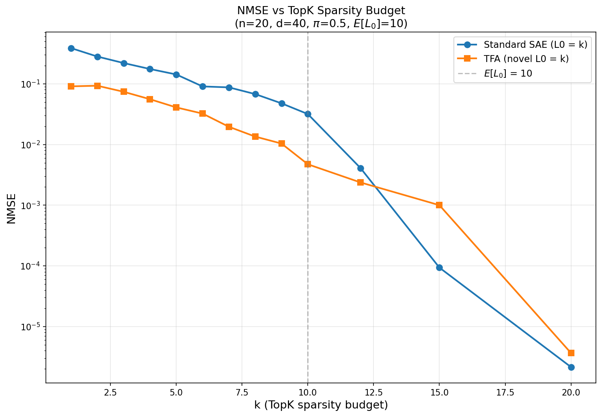
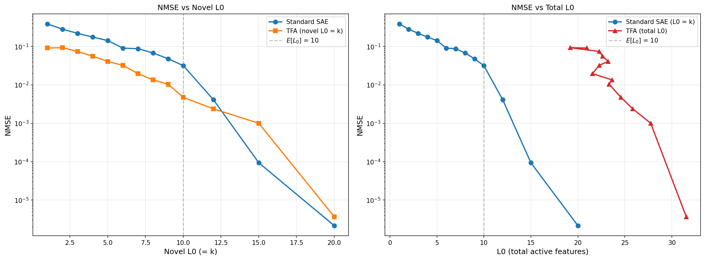
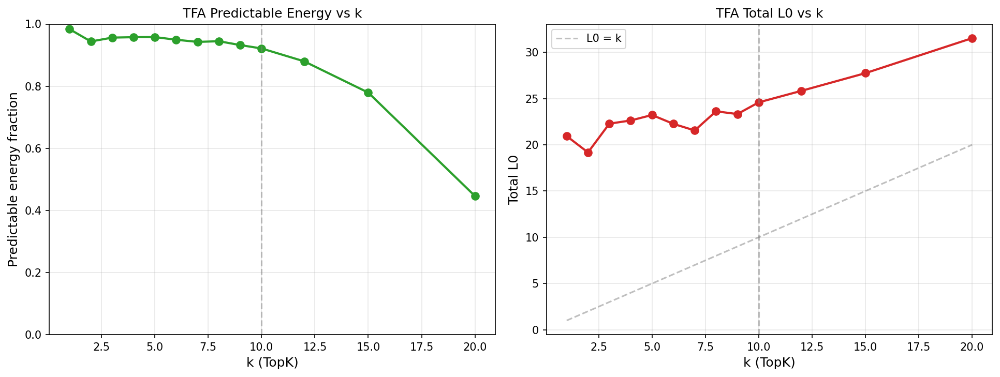
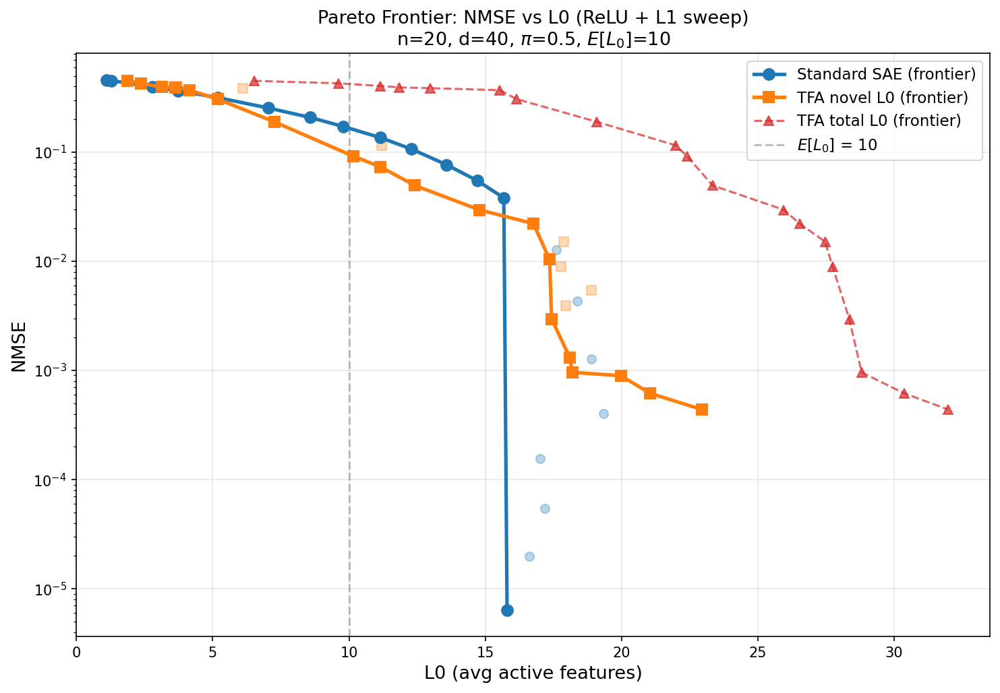
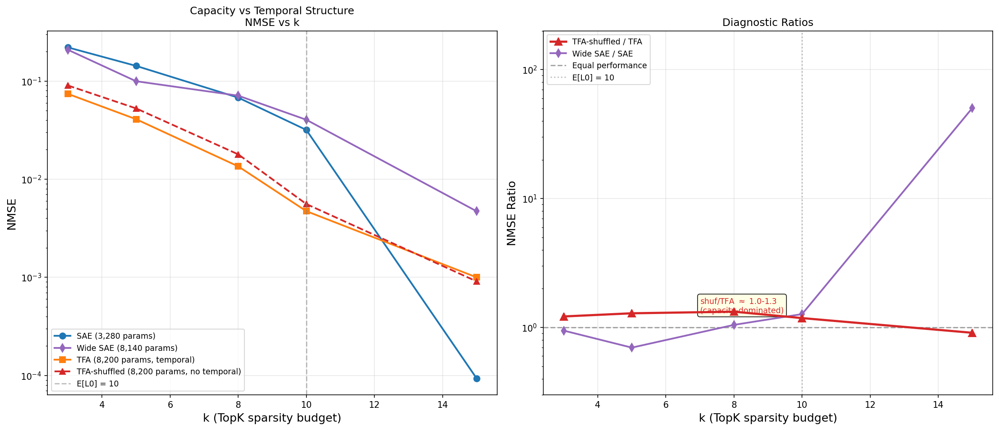

## Objective

Test whether Temporal Feature Analysis (TFA; Bhalla et al., 2025) outperforms a standard sparse autoencoder on synthetic data with known temporal correlations. Determine how much of any advantage comes from temporal structure vs architectural capacity.

## Background

**TFA** decomposes each token's reconstruction into a **predictable component** (produced by causal attention over previous positions; dense) and a **novel component** (a standard sparse encoder applied to the residual; sparse via TopK or L1). The full reconstruction is $\hat{x}_t = D(z_{p,t} + z_{n,t}) + b$ using a shared dictionary $D$.

The TFA paper's primary claims are qualitative — its predictive codes capture slow-moving contextual structure (event boundaries, syntactic chunks), not that it achieves lower reconstruction error. Table 1 of the paper shows TFA achieves *comparable* NMSE to standard SAEs. Our evaluation therefore asks three questions: (1) does TFA achieve lower NMSE under sparsity constraints, (2) does TFA's decomposition correctly separate persistent from transient features, and (3) how much of any advantage comes from temporal structure vs extra capacity?

**L0 ambiguity.** TFA's predictable component is dense (~20 nonzero codes regardless of $k$). We report both *novel L0* (sparse component only, = $k$ under TopK) and *total L0* (novel + predictable). Plotting TFA against novel L0 flatters it; plotting against total L0 does not.

## Data

Synthetic data with temporal correlations controlled by construction. The activation vector at each sequence position $t$ is $\mathbf{x}_t = \sum_{i=1}^{n} s_{i,t} \, \mathbf{f}_i$, where $\mathbf{f}_1, \ldots, \mathbf{f}_n$ are orthogonal unit-norm feature directions and $s_{i,t} \in \{0,1\}$ is the support indicator (unit magnitudes).

For each feature $i$ independently, the support sequence $(s_{i,1}, s_{i,2}, \ldots)$ follows a two-state Markov chain parametrised by:

- $\pi_i$ — the **marginal activation probability** (stationary distribution).
- $\rho_i$ — the **lag-1 autocorrelation**. $\rho = 0$ gives i.i.d. support; $\rho = 0.9$ gives highly persistent features. Lag-$k$ autocorrelation decays geometrically: $\text{Corr}(s_{i,t}, s_{i,t+k}) = \rho_i^k$.

The transition probabilities are derived from $(\pi_i, \rho_i)$: $p_{01} = \pi_i(1 - \rho_i)$ (off $\to$ on), $p_{10} = (1 - \pi_i)(1 - \rho_i)$ (on $\to$ off). Higher $\rho$ compresses both transition rates toward zero, making features "stickier" — they stay on longer once activated and stay off longer once deactivated. Features are mutually independent; temporal correlations exist only within each feature across positions.

**Configuration.** $n = 20$ features, $d = 40$, $\pi = 0.5$ for all features ($\mathbb{E}[L_0] = 10$). To test whether TFA's behavior varies with temporal persistence, we spread $\rho$ across five levels: 4 features each at $\rho \in \{0.0, 0.3, 0.5, 0.7, 0.9\}$. Sequences of length $T = 64$. Input scaled so $\mathbb{E}[\|x\|] = \sqrt{d}$.

Data sanity check: all marginal rates within 0.002 of $\pi = 0.5$, all lag-1 autocorrelations within 0.004 of target $\rho_i$, L0 mean = 10.0, std = 2.24 (theory: 2.24), feature directions max off-diagonal cosine = 0.0005.

**Binding regime.** When $k < \mathbb{E}[L_0] = 10$, the sparsity budget cannot represent all active features per token. TFA claims its predictable component can carry persistent features "for free," leaving the novel budget for new activations.

**Evaluation.** NMSE $= \sum \|x - \hat{x}\|^2 / \sum \|x\|^2$ over 128K tokens (2000 sequences $\times$ 64 positions). For both models, NMSE measures **full reconstruction quality**: $\hat{x} = D(z_{\text{pred}} + z_{\text{novel}}) + b$ for TFA, $\hat{x} = W_{\text{dec}} z + b_{\text{dec}}$ for the SAE. When plots label the x-axis as "TFA (novel L0 = $k$)", the y-axis is still the full model's NMSE — TFA's dense predictable component contributes reconstruction that is invisible on the x-axis.

## Experiment 1: TopK sweep

**Models.** Both use dictionary width 40 and per-token TopK sparsity at the same $k$:

- **TopK SAE** (3,280 params): $z = \text{TopK}(\text{ReLU}(W_{\text{enc}}(x - b_{\text{dec}}) + b_{\text{enc}}), k)$, $\hat{x} = W_{\text{dec}} z + b_{\text{dec}}$. Separate encoder/decoder, decoder columns unit-normed. Processes tokens independently.
- **TFA** (8,200 params): 4-head causal attention (1 layer, bottleneck factor 1, tied weights $E = D^T$). The 2.5x parameter gap comes entirely from the attention layer (6,560 params for key/query/value/output projections).

Both trained 30K steps, 4096 tokens/step. Run: `TQDM_DISABLE=1 python src/v2_temporal_schemeC/run_b1_topk_sweep.py`.

| $k$ | TopK SAE | TFA | TFA total L0 | TFA pred energy | Ratio |
| --- | --- | --- | --- | --- | --- |
| 1 | 0.388 | 0.091 | 20.9 | 98% | 4.3x |
| 3 | 0.220 | 0.074 | 22.3 | 96% | 3.0x |
| 5 | 0.143 | 0.041 | 23.2 | 96% | 3.5x |
| 8 | 0.068 | 0.014 | 23.6 | 95% | 5.0x |
| 10 | 0.032 | 0.0047 | 24.6 | 92% | 6.7x |
| 15 | 9.4e-5 | 0.001 | 27.8 | 78% | TopK SAE 10.7x |
| 20 | 2.1e-6 | 3.7e-6 | 31.5 | 45% | TopK SAE 1.7x |



NMSE vs $k$ for both models. TFA's curve sits below the TopK SAE for all $k \leq 12$; they cross near $k = 13$.



Left: NMSE vs novel L0 (= $k$), showing TFA's advantage in the binding regime. Right: TFA plotted against total L0 (novel + predictable codes, typically 20--32), showing that on honest representation complexity the TopK SAE frontier dominates.



Left: fraction of reconstruction energy carried by the predictable component (98% at $k = 1$, declining to 45% at $k = 20$). Right: TFA's total L0 vs $k$, always well above the $L_0 = k$ diagonal.

**Findings.** TFA wins by 3--7x for $k \leq 10$ (binding regime), peaking at 6.7x at $k = 10$. The TopK SAE wins decisively once $k > \mathbb{E}[L_0]$: at $k = 15$ it achieves NMSE $= 9.4 \times 10^{-5}$ (near-perfect reconstruction) while TFA stalls at $10^{-3}$.

TFA's predictable component carries 92--98% of the reconstruction energy and keeps ~20 codes active regardless of $k$ (the "total L0" column). When TFA is plotted against total L0 rather than novel L0, the TopK SAE frontier dominates — TFA uses 20--32 active features for reconstruction that the TopK SAE achieves with fewer. Neither TFA component reconstructs well alone: novel-only NMSE $> 1.0$ at all $k$ (it reconstructs the residual, not the full signal), and predictable-only NMSE ranges from 0.36 to 4.5.

These results cannot distinguish whether TFA's advantage comes from temporal structure or from the attention mechanism's extra capacity. Experiment 4 resolves this.

## Experiment 2: ReLU + L1 Pareto frontier

**Models.** Same architectures as Experiment 1, but using **ReLU + L1** sparsity instead of TopK. Both the SAE and TFA's novel component use a ReLU encoder with an L1 penalty $\lambda \|z\|_1$ on the latent codes; L0 emerges from training rather than being fixed. We call the SAE baseline in this experiment the **ReLU SAE** to distinguish it from the TopK SAE in Experiments 1 and 4. Swept $\lambda$ over 15 log-spaced values (ReLU SAE: $5 \times 10^{-3}$ to $20$; TFA: $0.15$ to $60$). Each $\lambda$ produces one (L0, NMSE) point; the Pareto frontier is the lower envelope.

Run: `TQDM_DISABLE=1 python src/v2_temporal_schemeC/run_b1_b2_pareto.py`.



NMSE vs L0 Pareto frontiers for the ReLU SAE and TFA. The plot shows three curves. **Solid lines with large markers** are Pareto frontiers. **Faded dots** are dominated (sub-optimal) runs. The blue (ReLU SAE) and orange (TFA novel L0) frontiers are directly comparable — both measure the sparse code's L0 against full NMSE. The red dashed curve plots TFA against its *total* L0 (novel + predictable codes); this is the "honest" comparison that accounts for TFA's dense predictable channel.

**Findings.** TFA's novel-L0 frontier lies below the ReLU SAE frontier in the binding regime (1.3--2.2x advantage at L0 = 7--12), consistent with Experiment 1. The frontier is only reliable for L0 $< 15$; above this, ReLU+L1 training is dominated by local minima (the ReLU SAE exhibits a 5970x NMSE spread between L0 = 15.7 and 15.8 depending on the training trajectory).

On total L0 (red dashed), TFA's frontier is strictly *above* the ReLU SAE's — TFA uses 20--32 total active codes for NMSE that the ReLU SAE achieves with fewer purely sparse codes. This confirms the pattern from Experiment 1: TFA's NMSE advantage at matched novel L0 comes at the cost of a dense channel that inflates total representation complexity.

## Experiment 3: Temporal decomposition

**Question.** Does TFA's predictable component preferentially capture *continuing* features (on at $t-1$ and $t$, which are temporally predictable) vs *onset* features (off at $t-1$, on at $t$, which are not)?

**Model.** TFA only (no SAE baseline). Same TFA architecture as Experiment 1 (TopK novel component), trained at $k \in \{3, 5, 8, 10, 15\}$. We analyse TFA's internal decomposition using ground-truth feature labels.

Run: `TQDM_DISABLE=1 python src/v2_temporal_schemeC/run_temporal_decomposition_v2.py`.

**Method.** Using the ground-truth Markov chain state, we classify each (feature $i$, position $t > 1$) event into four types based on the transition from $t-1$ to $t$:

- **Continuation** (on $\to$ on): feature was active at $t-1$ and remains active at $t$ (37% of events)
- **Onset** (off $\to$ on): feature was inactive at $t-1$ and becomes active at $t$ (13%)
- **Offset** (on $\to$ off): feature was active at $t-1$ and becomes inactive at $t$ (13%)
- **Absent** (off $\to$ off): feature was inactive at both $t-1$ and $t$ (37%)

For each event type and $\rho$-group, we compute the **mean absolute prediction projection**: $\mathbb{E}[|\langle D z_{\text{pred},t}, \mathbf{f}_i \rangle|]$ averaged over all tokens of that event type for features in that $\rho$-group. This measures how strongly TFA's predictable component reconstructs along a given feature's direction. 95% confidence intervals via bootstrap (200 resamples). Sample sizes range from ~19K (onset at $\rho = 0.9$) to ~359K (continuation at $\rho = 0.9$).

If TFA exploits temporal structure, we expect: (1) continuations should have higher prediction projection than onsets (persistent features are predictable from context), (2) offset/absent should have low projection (inactive features should not be predicted), and (3) these patterns should be sharper for high-$\rho$ features (which are more temporally persistent).


Mean prediction projection for continuations vs onsets across $\rho$ groups, with 95% bootstrap CIs.


Mean prediction projection when the feature is ON vs OFF, showing high false-positive rates.


All four event types: continuation $\approx$ onset and offset $\approx$ absent at every $k$ and $\rho$.

**Findings.**

1. **Continuations $\approx$ onsets.** At every $k$ and $\rho$, prediction projections are virtually identical for continuing vs newly appearing features (e.g., at $k = 8$, $\rho = 0.9$: 4.10 vs 4.04). The predictable component does not detect whether a feature was previously active.

2. **High false-positive rate.** The predictable component projects strongly onto feature directions even when the feature is OFF. This is because TFA's projection-scale mechanism ($\text{proj\_scale} = \langle D z_{\text{pred}}, x \rangle / \|D z_{\text{pred}}\|^2$) uses the current token, so the output adapts to the input regardless of temporal context.

3. **No monotonic relationship with $\rho$.** If TFA exploited temporal persistence, high-$\rho$ features should show higher prediction projections. Instead, projections vary erratically (at $k = 8$: $\rho\!=\!0.3 \to 5.85$, $\rho\!=\!0.5 \to 1.40$, $\rho\!=\!0.9 \to 4.10$). Routing appears driven by training dynamics, not temporal structure.

**Interpretation.** The attention averages over all $T = 64$ context positions. With $\pi = 0.5$, a feature is active at ~32 prior positions; whether it was active at $t-1$ specifically is one bit diluted across this average. The decomposition routes features by identity (which features the predictable component "owns"), not by temporal event.

These findings suggest TFA's predictable component may function as a general-purpose reconstruction channel rather than a temporal predictor. Experiment 4 tests this hypothesis directly.

## Experiment 4: Shuffle diagnostic (capacity vs temporal structure)

**Question.** How much of TFA's NMSE advantage (Experiments 1--2) comes from temporal structure vs the attention mechanism's extra capacity?

**Method.** Four models, all using TopK sparsity, trained 30K steps:

| Model | Architecture | Dict width | Params | Training data |
| --- | --- | --- | --- | --- |
| **TopK SAE** | Standard SAE | 40 | 3,280 | temporal |
| **Wide TopK SAE** | Standard SAE | 100 | 8,140 | temporal |
| **TFA** | TFA | 40 | 8,200 | temporal |
| **TFA-shuffled** | TFA | 40 | 8,200 | position-shuffled (no temporal correlations) |

The Wide TopK SAE has roughly the same parameter count as TFA but no attention mechanism — it controls for raw parameter count. TFA-shuffled is an *identical* TFA trained on sequences where positions are randomly permuted (destroying all temporal correlations while preserving marginal distributions); it uses the same optimizer, learning rate, and schedule as TFA. All models are evaluated on unshuffled temporal data.

If TFA-shuffled $\approx$ TFA, the advantage is architectural capacity. If TFA-shuffled $\approx$ TopK SAE, the advantage is temporal.

Run: `TQDM_DISABLE=1 PYTHONUNBUFFERED=1 python -u src/v2_temporal_schemeC/run_shuffle_diagnostic_fast.py`.

| $k$ | TopK SAE | Wide TopK SAE | TFA | TFA-shuffled | TFA / TopK SAE | TFA-shuf / TFA |
| --- | --- | --- | --- | --- | --- | --- |
| 3 | 0.220 | 0.208 | 0.074 | 0.090 | 3.0x | 1.22x |
| 5 | 0.143 | 0.100 | 0.041 | 0.053 | 3.5x | 1.29x |
| 8 | 0.068 | 0.071 | 0.014 | 0.018 | 5.0x | 1.33x |
| 10 | 0.032 | 0.040 | 0.0047 | 0.0056 | 6.7x | 1.18x |
| 15 | 9.4e-5 | 0.005 | 0.001 | 0.0009 | 0.1x | 0.91x |



**Decomposition.** We attribute TFA's NMSE advantage over the TopK SAE to two sources. "Architecture" is the portion explained by TFA-shuffled (no temporal information); "temporal" is the remainder. Concretely, at each $k$: architecture % $= (\text{NMSE}_{\text{TopK SAE}} - \text{NMSE}_{\text{TFA-shuffled}}) / (\text{NMSE}_{\text{TopK SAE}} - \text{NMSE}_{\text{TFA}})$.

| $k$ | Total NMSE gap | Architecture | Temporal |
| --- | --- | --- | --- |
| 3 | 0.146 | 89% | 11% |
| 5 | 0.102 | 88% | 12% |
| 8 | 0.054 | 92% | 8% |
| 10 | 0.027 | 97% | 3% |

**Findings.**

1. **TFA-shuffled captures most of TFA's advantage.** TFA-shuffled (no temporal information) is 2.4--5.7x better than the TopK SAE; TFA is only 1.2--1.3x better than TFA-shuffled. The decomposition table attributes 88--97% of the total NMSE gap to architecture and 3--12% to temporal structure.

2. **The Wide TopK SAE does not help.** It performs comparably to or *worse* than the standard TopK SAE at $k \geq 8$, ruling out raw parameter count as the explanation.

3. **At $k = 15 > \mathbb{E}[L_0]$, TFA-shuffled slightly outperforms TFA** (ratio 0.91), suggesting the temporal prediction mechanism becomes counterproductive when the sparsity budget is sufficient.

The interpretation of these findings — why the attention mechanism helps without temporal order, what this means for TFA's claims, and the caveats on our decomposition — is developed in the Synthesis.

## Synthesis

### Summary of findings

1. **TFA achieves 3--7x lower NMSE than a standard SAE at matched novel sparsity in the binding regime**, consistent across both TopK (Experiment 1) and ReLU+L1 (Experiment 2) sparsity mechanisms. The advantage peaks at 6.7x near $k = \mathbb{E}[L_0] = 10$ and disappears once the SAE has enough capacity ($k > 12$).

2. **Most of this advantage is architectural capacity, not temporal structure** (Experiment 4). TFA-shuffled — trained on data with all temporal correlations destroyed — captures most of TFA's advantage over the TopK SAE (2.4--5.7x improvement vs the TopK SAE's baseline). TFA improves only 1.2--1.3x beyond TFA-shuffled. Our linear decomposition attributes roughly 88--97% of the total NMSE gap to architecture and 3--12% to temporal structure, though these estimates are from a single seed and the decomposition does not account for possible architecture-temporal interactions.

3. **Temporal structure provides a small but consistent benefit** (Experiment 4). At every binding-regime $k$ value, TFA trained on temporal data outperforms TFA-shuffled by 15--25% (relative to TFA-shuffled's NMSE). This gap is consistent in direction across all tested $k$ values, suggesting it is not noise, but we cannot quantify the variance without multi-seed runs.

4. **TFA's predictable component does not distinguish temporal transitions** (Experiment 3): continuation and onset projections are virtually identical, and prediction strength shows no monotonic relationship with temporal persistence $\rho$. The predictable component does partially distinguish ON from OFF features (with high false-positive rates), but this discrimination does not depend on temporal history. We note that the continuation/onset metric is a weak test of temporal exploitation because the attention averages over ~32 context positions where a feature is active ($\pi = 0.5$), diluting the single-position signal.

### Why the attention mechanism helps without temporal structure

We hypothesise that TFA's attention mechanism provides reconstruction capacity through two pathways that do not require temporal order:

**Content-based retrieval.** The query (derived from the current token's encoding) and keys (from context tokens) interact via dot-product attention. Even when context tokens are randomly ordered, tokens that share active features with the current token should produce higher attention weights. The value projection then retrieves a weighted reconstruction biased toward the current token's content. With $\pi = 0.5$ and 20 features, any two tokens share ~5 features on average ($n \pi^2 = 5$), providing some signal for content-based matching even in shuffled sequences.

**Projection scaling.** After attention produces a predicted direction $D z_{\text{pred}}$, TFA scales it by $\text{proj\_scale} = \langle D z_{\text{pred}}, x \rangle / \|D z_{\text{pred}}\|^2$, which is the scalar projection of the current input onto the predicted direction. This adapts the predictable component's magnitude to the current token regardless of how the direction was obtained. Even a constant attention output (which would occur if context were completely uninformative) gets scaled to match the current input, providing a rank-1 reconstruction "for free."

Together, these mechanisms give TFA an additional dense reconstruction channel with ~20 active codes that does not count toward the novel L0 budget. Note that this is not equivalent to an optimal rank-20 projection (which would give perfect reconstruction on our 20-feature data); TFA-shuffled at $k = 3$ still has NMSE $= 0.09$, so the predictable component captures only a fraction of the information that an oracle projection would. Nevertheless, this channel is sufficient to dramatically outperform the TopK SAE. We have not directly verified these mechanisms (e.g., by inspecting attention weights on shuffled data); they remain a plausible explanation for TFA-shuffled's strong performance.

### Why extra parameters alone do not help

The Wide TopK SAE (dictionary width 100, 8,140 params — roughly matching TFA's 8,200) performs comparably to or *worse* than the standard TopK SAE (width 40, 3,280 params) at $k \geq 8$. With 100 dictionary atoms in a 40-dimensional space, the extra atoms create redundant directions that compete during training, and TopK selection from a larger pool does not help when the underlying data has only 20 ground-truth features.

This rules out the simplest capacity hypothesis — that TFA wins merely because it has more parameters. TFA's advantage comes from the specific computational structure of the attention mechanism (query-key interaction, value aggregation, projection scaling), not from parameter count per se. We note, however, that the wide SAE tests only one form of extra capacity (wider dictionary); other ways of adding parameters to the SAE (e.g., deeper encoders, multiple encoder heads) were not tested.

### Relationship to the TFA paper's claims

Our results do not directly contradict the TFA paper because the paper does not claim NMSE superiority — it claims interpretive value of the pred/novel decomposition on real LLM activations. However, our findings complicate the mechanism proposed by Proposition 4.2 (that TFA's predictable component carries persistent features "for free" in the binding regime). On our synthetic data, the predictable component does carry features "for free," but this appears to be primarily via the attention architecture's general reconstruction capacity rather than via temporal prediction of persistent features specifically.

The TFA paper's qualitative successes on stories, garden-path sentences, and in-context learning may reflect event-level structure (groups of correlated features that persist together) rather than per-feature autocorrelation. Our toy model tests only the latter. A stronger test of TFA's temporal claims would use synthetic data with event-level feature correlations — e.g., groups of features that activate and deactivate together, creating block structure in the temporal correlation matrix.

### Implications for temporal SAE design

The shuffle diagnostic reveals that TFA's attention mechanism is a powerful reconstruction tool even without temporal structure. This suggests two directions:

- **For reconstruction under sparsity constraints:** attention-augmented SAEs may be useful even in non-temporal settings, as a way to provide dense reconstruction capacity alongside sparse codes.
- **For genuinely temporal feature discovery:** architectures should be designed so that the temporal pathway *cannot* function as a general-purpose reconstruction channel. This might mean restricting the predictable component to use only past tokens' codes (not the current token's query), or penalizing the predictable component's total L0 to prevent it from acting as a dense channel.

## Limitations

- **Per-feature autocorrelation only.** The TFA paper claims event-level structure (co-occurring feature groups persisting across tokens). Our data has independent features with no event-level correlations. TFA's attention may be better suited to multi-feature structure; these conclusions may not generalize.

- **Single seed (42).** No variance estimates across seeds.

- **Training config asymmetries.** The TopK SAE uses Adam (lr 3e-4, no weight decay); TFA uses AdamW (lr 1e-3, weight decay 1e-4, gradient clipping, cosine schedule). The shuffle diagnostic controls for this (TFA vs TFA-shuffled use identical configs), but the absolute TopK SAE vs TFA gap may be confounded.

- **NMSE, not support switching.** The TFA paper's Proposition 4.2 concerns support switching (disjoint codes for nearby inputs), not reconstruction error. A code-stability analysis would more directly test this claim.

## Reproduction

```bash
TQDM_DISABLE=1 python src/v2_temporal_schemeC/run_b1_topk_sweep.py
TQDM_DISABLE=1 python src/v2_temporal_schemeC/run_b1_b2_pareto.py
TQDM_DISABLE=1 python src/v2_temporal_schemeC/run_temporal_decomposition_v2.py
TQDM_DISABLE=1 PYTHONUNBUFFERED=1 python -u src/v2_temporal_schemeC/run_shuffle_diagnostic_fast.py
```

Results: `src/v2_temporal_schemeC/results/{b1_topk_sweep, b1_b2_pareto, temporal_decomposition_v2, shuffle_diagnostic}/`.
