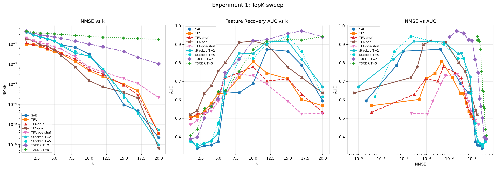
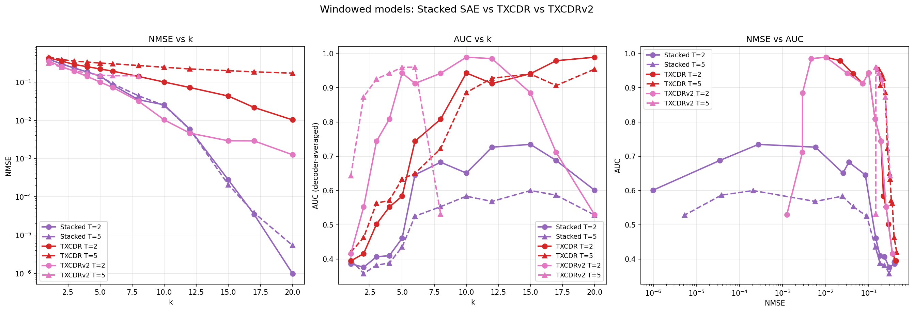

## Objective

Test whether Temporal Feature Analysis (TFA; Bhalla et al., 2025) outperforms a standard sparse autoencoder on synthetic data with known temporal correlations. Determine how much of any advantage comes from temporal structure vs architectural capacity.

## Background

**TFA** decomposes each token's reconstruction into a **predictable component** (produced by causal attention over previous positions; dense) and a **novel component** (a standard sparse encoder applied to the residual; sparse via TopK or L1). The full reconstruction is $\hat{x}_t = D(z_{p,t} + z_{n,t}) + b$ using a shared dictionary $D$.

The TFA paper's primary claims are qualitative — its predictive codes capture slow-moving contextual structure (event boundaries, syntactic chunks), not that it achieves lower reconstruction error. Table 1 of the paper shows TFA achieves *comparable* NMSE to standard SAEs. Our evaluation therefore asks three questions: (1) does TFA achieve lower NMSE under sparsity constraints, (2) does TFA's decomposition correctly separate persistent from transient features, and (3) how much of any advantage comes from temporal structure vs extra capacity?

**Temporal crosscoder (TXCDR / TXCDRv2).** A shared-latent crosscoder (ckkissane-style; ported from Andre Shportko's implementation) that encodes a window of $T$ consecutive tokens into a single sparse latent vector $z$, then decodes back to $T$ positions using per-position decoder weights. The encoder sums position-weighted projections: $z = \text{TopK}(\sum_t x_t W_{\text{enc}}^{(t)} + b_{\text{enc}})$. Unlike TFA, the crosscoder has no causal mask --- it sees all $T$ positions simultaneously. We report two variants:

- **TXCDR** uses $k$ active latents in the shared vector. This gives it fewer total active codes than the Stacked SAE (which gets $k$ per position = $k \times T$ total), making sparsity comparisons unfair. TXCDR results are included in tables for completeness but should not be used for direct comparisons against the Stacked SAE.
- **TXCDRv2** uses $k \times T$ active latents, matching the Stacked SAE's total L0 for a fair comparison. This follows Andre Shportko's v2 design. TXCDRv2 is the primary crosscoder baseline for all discussions.

**TFA-pos.** A variant of TFA with sinusoidal positional encoding added to the attention mechanism's query and key inputs (but not values). In our toy model, tokens have no positional information --- $x_t$ depends only on which features are active, not on position $t$. TFA's attention therefore cannot distinguish "this token was 2 positions ago" from "this token was 50 positions ago." TFA-pos injects fixed positional embeddings into Q/K so the attention can learn position-dependent routing (e.g., "attend more to recent tokens"), while values remain content-only. The positional encoding is a non-learnable buffer, so TFA-pos has the same trainable parameter count (8,200) as TFA.

**L0 ambiguity.** TFA's predictable component is dense (~20 nonzero codes regardless of $k$). We report both *novel L0* (sparse component only, = $k$ under TopK) and *total L0* (novel + predictable). Plotting TFA against novel L0 flatters it; plotting against total L0 does not.

**Feature recovery AUC.** In addition to NMSE, we measure how well each model's decoder directions recover the true feature directions (adapted from Shportko's evaluation). For each true feature $\mathbf{f}_i$, we find the best-matching decoder column by absolute cosine similarity: $\max_j |\cos(d_j, \mathbf{f}_i)|$. The AUC sweeps a threshold $\tau$ from 0 to 1 and integrates the fraction of features recovered at each threshold. AUC = 1.0 means every true feature has a perfectly aligned decoder column. R@0.9 is the fraction of features with best-match cosine $\geq 0.9$.

## Data

Synthetic data with temporal correlations controlled by construction. The activation vector at each sequence position $t$ is $\mathbf{x}_t = \sum_{i=1}^{n} s_{i,t} \, \mathbf{f}_i$, where $\mathbf{f}_1, \ldots, \mathbf{f}_n$ are orthogonal unit-norm feature directions and $s_{i,t} \in \{0,1\}$ is the support indicator (unit magnitudes).

For each feature $i$ independently, the support sequence $(s_{i,1}, s_{i,2}, \ldots)$ follows a two-state Markov chain parametrised by:

- $\pi_i$ — the **marginal activation probability** (stationary distribution).
- $\rho_i$ — the **lag-1 autocorrelation**. $\rho = 0$ gives i.i.d. support; $\rho = 0.9$ gives highly persistent features. Lag-$k$ autocorrelation decays geometrically: $\text{Corr}(s_{i,t}, s_{i,t+k}) = \rho_i^k$.

The transition probabilities are derived from $(\pi_i, \rho_i)$: $p_{01} = \pi_i(1 - \rho_i)$ (off $\to$ on), $p_{10} = (1 - \pi_i)(1 - \rho_i)$ (on $\to$ off). Higher $\rho$ compresses both transition rates toward zero, making features "stickier" — they stay on longer once activated and stay off longer once deactivated. Features are mutually independent; temporal correlations exist only within each feature across positions.

**Configuration.** $n = 20$ features, $d = 40$, $\pi = 0.5$ for all features ($\mathbb{E}[L_0] = 10$). To test whether TFA's behavior varies with temporal persistence, we spread $\rho$ across five levels: 4 features each at $\rho \in \{0.0, 0.3, 0.5, 0.7, 0.9\}$. Sequences of length $T = 64$. Input scaled so $\mathbb{E}[\|x\|] = \sqrt{d}$.

Data sanity check: all marginal rates within 0.002 of $\pi = 0.5$, all lag-1 autocorrelations within 0.004 of target $\rho_i$, L0 mean = 10.0, std = 2.24 (theory: 2.24), feature directions max off-diagonal cosine = 0.0005.

**Binding regime.** When $k < \mathbb{E}[L_0] = 10$, the sparsity budget cannot represent all active features per token. TFA claims its predictable component can carry persistent features "for free," leaving the novel budget for new activations.

**Evaluation.** NMSE $= \sum \|x - \hat{x}\|^2 / \sum \|x\|^2$ over 128K tokens (2000 sequences $\times$ 64 positions). For both models, NMSE measures **full reconstruction quality**: $\hat{x} = D(z_{\text{pred}} + z_{\text{novel}}) + b$ for TFA, $\hat{x} = W_{\text{dec}} z + b_{\text{dec}}$ for the SAE. When plots label the x-axis as "TFA (novel L0 = $k$)", the y-axis is still the full model's NMSE — TFA's dense predictable component contributes reconstruction that is invisible on the x-axis.

## Experiment 1: TopK sweep 

**Models.** All use dictionary width 40 and per-token TopK sparsity at the same $k$: 

- **Shared SAE** (3,280 params): $z = \text{TopK}(\text{ReLU}(W_{\text{enc}}(x - b_{\text{dec}}) + b_{\text{enc}}), k)$, $\hat{x} = W_{\text{dec}} z + b_{\text{dec}}$. Separate encoder/decoder, decoder columns unit-normed. Processes tokens independently.
- **TFA** (8,200 params): 4-head causal attention (1 layer, bottleneck factor 1, tied weights $E = D^T$). The 2.5x parameter gap comes entirely from the attention layer (6,560 params for key/query/value/output projections).
- **TFA-shuffled** (8,200 params): Identical TFA trained on position-shuffled sequences (destroying temporal correlations while preserving marginal distributions). Same optimizer, learning rate, and schedule as TFA. Evaluated on unshuffled temporal data.
- **TFA-pos** (8,200 params): TFA with sinusoidal positional encoding in attention Q/K (not V). Same parameter count as TFA.
- **TFA-pos-shuf** (8,200 params): TFA-pos trained on position-shuffled sequences. Evaluated on unshuffled temporal data.
- **Stacked SAE** ($T$=2): $T$ independent SAEs, one per position in a window of 2 consecutive tokens. Each position gets $k$ active latents independently. The "per-position SAEs" baseline from the crosscoders paper (Anthropic, 2024), adapted to the temporal setting. Controls for position-specific decoder structure without shared-latent information sharing.
- **Stacked SAE** ($T$=5): Same architecture with 5-token window.
- **TXCDR** ($T$=2): Temporal crosscoder with shared latent. Same $k$ as SAE. Sees 2 consecutive tokens per window.
- **TXCDR** ($T$=5): Same architecture with 5-token window.
 
All models trained 30K steps.[^1]

**NMSE results:**

| $k$ | Shared SAE | TFA | TFA-shuf | TFA-pos | pos-shuf | Stacked ($T$=2) | Stacked ($T$=5) | TXCDR ($T$=2) | TXCDR ($T$=5) | TXCDRv2 ($T$=2) | TXCDRv2 ($T$=5) |
| --- | --- | --- | --- | --- | --- | --- | --- | --- | --- | --- | --- |
| 1 | 0.388 | 0.091 | 0.115 | 0.175 | 0.198 | 0.394 | 0.392 | 0.428 | 0.445 | 0.353 | 0.313 |
| 2 | 0.282 | 0.093 | 0.091 | 0.146 | 0.143 | 0.295 | 0.299 | 0.353 | 0.387 | 0.252 | 0.243 |
| 3 | 0.220 | 0.074 | 0.090 | 0.090 | 0.119 | 0.231 | 0.232 | 0.287 | 0.351 | 0.192 | 0.197 |
| 4 | 0.176 | 0.056 | 0.063 | 0.082 | 0.091 | 0.183 | 0.182 | 0.252 | 0.332 | 0.140 | 0.170 |
| 5 | 0.143 | 0.041 | 0.053 | 0.050 | 0.071 | 0.145 | 0.142 | 0.219 | 0.313 | 0.100 | 0.151 |
| 6 | 0.091 | 0.032 | 0.035 | 0.026 | 0.056 | 0.083 | 0.090 | 0.192 | 0.300 | 0.072 | 0.146 |
| 8 | 0.068 | 0.014 | 0.018 | **0.007** | 0.023 | 0.034 | 0.044 | 0.140 | 0.269 | 0.032 | 0.145 |
| 10 | 0.032 | 0.005 | 0.006 | **0.001** | 0.007 | 0.025 | 0.024 | 0.100 | 0.243 | 0.010 | --- |
| 12 | 0.004 | 0.002 | 0.003 | 7.3e-4 | 0.004 | 0.006 | 0.006 | 0.072 | 0.219 | 0.005 | --- |
| 15 | 9.4e-5 | 0.001 | 9.1e-4 | 3.9e-4 | 0.002 | 2.8e-4 | 2.1e-4 | 0.043 | 0.197 | 0.003 | --- |
| 17 | 4.8e-5 | 4.7e-4 | 2.9e-4 | 2.1e-4 | 0.001 | 3.5e-5 | 3.8e-5 | 0.022 | 0.184 | 0.003 | --- |
| 20 | 2.1e-6 | 3.7e-6 | 3.7e-6 | 6.6e-7 | 2.2e-4 | 1.0e-6 | 5.3e-6 | 0.010 | 0.170 | 0.001 | --- |

**Feature recovery AUC** (decoder-averaged for windowed models):

| $k$ | Shared SAE | TFA | TFA-shuf | TFA-pos | pos-shuf | Stacked ($T$=2) | Stacked ($T$=5) | TXCDR ($T$=2) | TXCDR ($T$=5) | TXCDRv2 ($T$=2) | TXCDRv2 ($T$=5) |
| --- | --- | --- | --- | --- | --- | --- | --- | --- | --- | --- | --- |
| 1 | 0.389 | 0.511 | 0.497 | 0.520 | 0.464 | 0.387 | 0.398 | 0.395 | 0.420 | 0.398 | 0.643 |
| 2 | 0.339 | 0.511 | 0.526 | 0.542 | 0.489 | 0.377 | 0.358 | 0.416 | 0.463 | 0.564 | 0.873 |
| 3 | 0.352 | 0.538 | 0.529 | 0.635 | 0.527 | 0.407 | 0.383 | 0.502 | 0.563 | 0.746 | **0.925** |
| 4 | 0.356 | 0.583 | 0.563 | 0.676 | 0.539 | 0.410 | 0.389 | 0.552 | 0.571 | 0.818 | **0.942** |
| 5 | 0.374 | 0.634 | 0.611 | 0.755 | 0.591 | 0.461 | 0.436 | 0.584 | 0.634 | **0.919** | **0.959** |
| 6 | 0.644 | 0.633 | 0.718 | **0.800** | 0.631 | 0.646 | 0.526 | 0.744 | 0.650 | **0.925** | **0.960** |
| 8 | 0.639 | 0.720 | 0.747 | **0.910** | 0.739 | 0.683 | 0.553 | 0.808 | 0.722 | **0.927** | 0.532 |
| 10 | 0.688 | 0.807 | 0.780 | **0.918** | 0.731 | 0.651 | 0.584 | **0.943** | 0.886 | **0.941** | --- |
| 12 | 0.873 | 0.745 | 0.702 | **0.899** | 0.684 | 0.727 | 0.568 | 0.912 | **0.928** | **0.977** | --- |
| 15 | 0.863 | 0.714 | 0.713 | 0.777 | 0.592 | 0.735 | 0.600 | **0.941** | **0.940** | 0.869 | --- |
| 17 | 0.787 | 0.602 | 0.631 | 0.720 | 0.523 | 0.688 | 0.587 | **0.979** | 0.906 | 0.694 | --- |
| 20 | 0.595 | 0.568 | 0.533 | 0.638 | 0.528 | 0.601 | 0.529 | **0.989** | **0.954** | 0.539 | --- |

Left: NMSE vs $k$. Centre: feature recovery AUC vs $k$. Right: NMSE vs AUC scatter.

Windowed models only: Stacked SAE, TXCDR, and TXCDRv2 at $T$=2 and $T$=5. AUC is decoder-averaged (mean of per-position decoder matrices before computing cosine similarity with true features).

**Findings.**

1. **NMSE: TFA wins in binding regime; TXCDRv2 is competitive at matched L0.** TFA achieves 3--7$\times$ lower NMSE than the Shared SAE for $k \leq 10$. TXCDRv2 (with $k \times T$ active latents, matching Stacked SAE total L0) closes the gap: at $k = 5$, TXCDRv2 $T$=2 NMSE = 0.100 vs Shared SAE 0.143.

2. **TXCDRv2 achieves the best AUC in the binding regime.** With fair sparsity, TXCDRv2 $T$=5 achieves AUC = 0.959 at $k = 5$ and 0.960 at $k = 6$, far surpassing all other models at these $k$ values. TXCDRv2 $T$=2 peaks at AUC = 0.977 at $k = 12$. The shared latent forces each decoder column to represent the same feature across positions, yielding excellent cross-position interpretability. AUC degrades when $k \times T$ approaches the dictionary width (40), e.g., TXCDRv2 $T$=5 drops to 0.532 at $k = 8$ ($k \times T = 40$).

3. **Stacked SAE has low decoder-averaged AUC.** Despite achieving similar NMSE to the Shared SAE, Stacked SAE's decoder-averaged AUC is substantially lower (0.651 vs 0.688 at $k = 10$ for $T$=2). Each position's independent SAE recovers features with differently-indexed decoder columns --- averaging the decoder matrices across positions destroys alignment. This confirms the Stacked SAE does not learn cross-position feature consistency, unlike TXCDRv2 whose shared latent enforces it.

4. **NMSE--AUC dissociation.** Good reconstruction does not imply good feature recovery. The Shared SAE achieves near-perfect NMSE at $k = 20$ but its AUC drops to 0.595 --- it reconstructs via superposition without recovering the true feature directions.

5. **TFA's AUC peaks at $k = 10$ then declines.** TFA's feature recovery is best at AUC = 0.81 ($k = 10$), then drops to 0.71 at $k = 15$ and 0.57 at $k = 20$. Like the SAE, excess capacity degrades feature recovery. TFA-shuffled tracks TFA closely on AUC, consistent with the temporal fraction being small.

6. **TFA-pos beats TFA at $k \geq 8$ and has a larger temporal fraction.** With positional encoding, TFA-pos achieves NMSE = 0.007 at $k = 8$ (vs TFA's 0.014 --- 2$\times$ better) and NMSE = 0.001 at $k = 10$ (vs TFA's 0.005 --- 3$\times$ better). The temporal decomposition shows that positional encoding roughly doubles the temporal fraction:

| $k$ | TFA gap | TFA arch | TFA temp | TFA-pos gap | TFA-pos arch | TFA-pos temp |
| --- | --- | --- | --- | --- | --- | --- |
| 3 | 0.146 | 89% | 11% | 0.130 | 78% | 22% |
| 5 | 0.102 | 88% | 12% | 0.092 | 77% | 23% |
| 8 | 0.054 | 92% | 8% | 0.061 | 74% | **26%** |
| 10 | 0.027 | 97% | 3% | 0.030 | 83% | **17%** |

Architecture % $= (\text{NMSE}_{\text{SAE}} - \text{NMSE}_{\text{shuf}}) / (\text{NMSE}_{\text{SAE}} - \text{NMSE}_{\text{model}})$. TFA-pos achieves 17--26% temporal fraction (vs TFA's 3--12%), confirming that positional encoding enables the attention to exploit temporal correlations.

7. **TFA-pos has higher AUC than TFA across the binding regime.** At $k = 8$, TFA-pos AUC = 0.91 vs TFA AUC = 0.72 --- a 19% absolute improvement. TFA-pos-shuf AUC (0.74) is close to TFA-shuf (0.75), showing the AUC improvement is primarily from temporal structure, not from the positional encoding itself.

7. **TFA without positional encoding: 88--97% architectural capacity, 3--12% temporal.** TFA-shuffled captures most of TFA's advantage over the Shared SAE. The Wide Shared SAE (8,140 params, matching TFA's parameter count) performs comparably to or worse than the standard Shared SAE at $k \geq 8$, ruling out raw parameter count as the explanation. At $k = 15$, TFA-shuffled slightly outperforms TFA (ratio 0.91), suggesting the temporal prediction mechanism becomes counterproductive when the sparsity budget is sufficient.

8. **TFA-pos is worse than TFA at low $k$.** At $k = 1$, TFA-pos NMSE = 0.175 (vs TFA 0.091 --- nearly 2$\times$ worse). The positional encoding adds noise to the attention when there is only one sparse code to benefit from temporal routing. The crossover occurs at $k \approx 5$.
