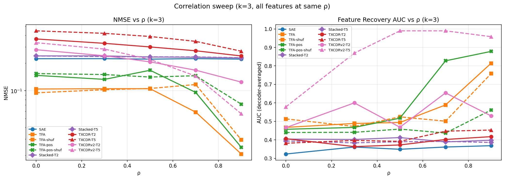
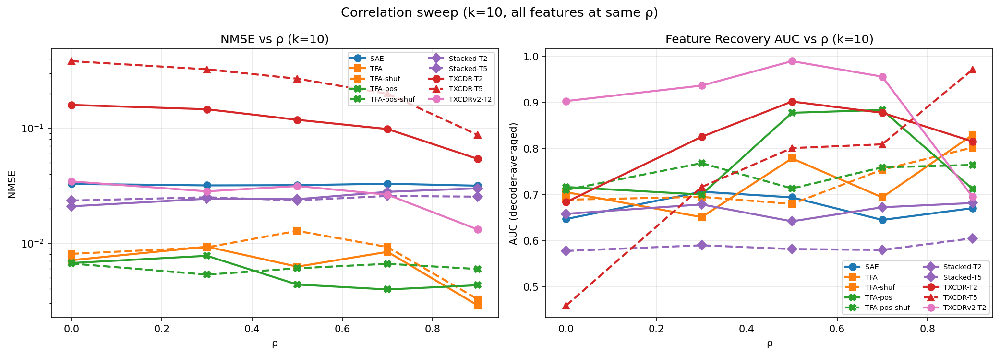

## Objective

Isolate the effect of temporal autocorrelation on TFA's advantage over a standard SAE by sweeping the Markov chain persistence parameter $\rho$ with **all features at the same value**. This provides a cleaner signal than the mixed-$\rho$ setup used in the main progress document, where 4 features each at $\rho \in \{0.0, 0.3, 0.5, 0.7, 0.9\}$ average over different persistence levels and potentially mask the true temporal fraction.

## Motivation

The mixed-$\rho$ experiments in [[2026-03-04-v2-progress]] attribute 3--12% of TFA's NMSE advantage to temporal structure (and 17--26% for TFA-pos). But these numbers average over features with very different temporal persistence. A feature at $\rho = 0.0$ has no temporal signal at all, while a feature at $\rho = 0.9$ is highly persistent. By sweeping $\rho$ uniformly --- all 20 features at the same value --- we can:

1. Determine whether the temporal fraction increases monotonically with $\rho$.
2. Identify the $\rho$ regime where temporal structure matters most.
3. Test whether the TFA advantage at $\rho = 0.0$ (where there is no temporal signal by construction) is purely architectural, providing a clean baseline.

## Data

Same toy model as the main experiments:

- $n = 20$ features, $d = 40$, $\pi = 0.5$ for all features ($\mathbb{E}[L_0] = 10$)
- Dictionary width = 40
- Sequences of length $T = 64$, input scaled so $\mathbb{E}[\|x\|] = \sqrt{d}$
- Seed 42, eval on 2000 sequences (128K tokens)

The key difference: instead of spreading $\rho$ across five levels, **all 20 features share a single $\rho$ value**, swept over $\{0.0, 0.3, 0.5, 0.7, 0.9\}$.

## Models

Eleven models evaluated at each $\rho$:

| Model | Description | Params |
| --- | --- | --- |
| **SAE** | TopK SAE, processes tokens independently | 3,280 |
| **TFA** | 4-head causal attention, tied $E = D^T$ | 8,200 |
| **TFA-shuf** | TFA trained on position-shuffled sequences | 8,200 |
| **TFA-pos** | TFA with sinusoidal positional encoding in Q/K | 8,200 |
| **TFA-pos-shuf** | TFA-pos trained on position-shuffled sequences | 8,200 |
| **Stacked SAE** ($T$=2) | 2 independent SAEs, one per position | 6,560 |
| **Stacked SAE** ($T$=5) | 5 independent SAEs, one per position | 16,400 |
| **TXCDR** ($T$=2) | Temporal crosscoder, shared latent, 2-token window | varies |
| **TXCDR** ($T$=5) | Temporal crosscoder, shared latent, 5-token window | varies |
| **TXCDRv2** ($T$=2) | Temporal crosscoder v2, shared latent, 2-token window | varies |
| **TXCDRv2** ($T$=5) | Temporal crosscoder v2, shared latent, 5-token window | varies |

All models trained for 30K steps.

## Results

### NMSE ($k = 3$, binding regime)

| $\rho$ | SAE | TFA | TFA-shuf | TFA-pos | pos-shuf | Stacked $T$=2 | Stacked $T$=5 | TXCDR $T$=2 | TXCDR $T$=5 | TXCDRv2 $T$=2 | TXCDRv2 $T$=5 |
| --- | --- | --- | --- | --- | --- | --- | --- | --- | --- | --- | --- |
| 0.0 | 0.223 | 0.105 | 0.095 | 0.147 | 0.154 | 0.239 | 0.239 | 0.365 | 0.447 | 0.279 | 0.332 |
| 0.3 | 0.223 | 0.105 | 0.103 | 0.133 | 0.150 | 0.239 | 0.235 | 0.327 | 0.420 | 0.240 | 0.283 |
| 0.5 | 0.220 | 0.105 | 0.106 | 0.167 | 0.141 | 0.233 | 0.234 | 0.299 | 0.388 | 0.206 | 0.219 |
| 0.7 | 0.223 | 0.059 | 0.117 | 0.096 | 0.146 | 0.231 | 0.233 | 0.272 | 0.344 | 0.167 | 0.145 |
| 0.9 | 0.221 | 0.021 | 0.029 | 0.024 | 0.072 | 0.227 | 0.229 | 0.239 | 0.269 | 0.124 | 0.056 |

### AUC ($k = 3$, decoder-averaged for windowed models)

| $\rho$ | SAE | TFA | TFA-shuf | TFA-pos | pos-shuf | Stacked $T$=2 | Stacked $T$=5 | TXCDR $T$=2 | TXCDR $T$=5 | TXCDRv2 $T$=2 | TXCDRv2 $T$=5 |
| --- | --- | --- | --- | --- | --- | --- | --- | --- | --- | --- | --- |
| 0.0 | 0.323 | 0.467 | 0.513 | 0.457 | 0.440 | 0.404 | 0.394 | 0.406 | 0.382 | 0.466 | 0.579 |
| 0.3 | 0.361 | 0.489 | 0.472 | 0.467 | 0.441 | 0.402 | 0.384 | 0.363 | 0.397 | 0.600 | **0.869** |
| 0.5 | 0.349 | 0.494 | 0.524 | 0.517 | 0.458 | 0.412 | 0.390 | 0.372 | 0.392 | 0.468 | **0.990** |
| 0.7 | 0.361 | 0.589 | 0.501 | **0.828** | 0.437 | 0.389 | 0.392 | 0.402 | 0.447 | 0.654 | **0.990** |
| 0.9 | 0.368 | **0.814** | 0.758 | **0.879** | 0.561 | 0.398 | 0.386 | 0.417 | 0.453 | 0.530 | **0.958** |

### NMSE ($k = 10$, $k = \mathbb{E}[L_0]$)

| $\rho$ | SAE | TFA | TFA-shuf | TFA-pos | pos-shuf | Stacked $T$=2 | Stacked $T$=5 | TXCDR $T$=2 | TXCDR $T$=5 | TXCDRv2 $T$=2 | TXCDRv2 $T$=5 |
| --- | --- | --- | --- | --- | --- | --- | --- | --- | --- | --- | --- |
| 0.0 | 0.033 | 0.007 | 0.008 | 0.007 | 0.007 | 0.021 | 0.023 | 0.159 | 0.382 | 0.034 | --- |
| 0.3 | 0.032 | 0.009 | 0.009 | 0.008 | 0.005 | 0.024 | 0.025 | 0.146 | 0.324 | 0.028 | --- |
| 0.5 | 0.032 | 0.006 | 0.013 | 0.004 | 0.006 | 0.024 | 0.024 | 0.118 | 0.269 | 0.031 | --- |
| 0.7 | 0.033 | 0.008 | 0.009 | 0.004 | 0.007 | 0.028 | 0.026 | 0.098 | 0.199 | 0.026 | --- |
| 0.9 | 0.032 | 0.003 | 0.003 | 0.004 | 0.006 | 0.030 | 0.025 | 0.054 | 0.087 | 0.013 | --- |

### AUC ($k = 10$, decoder-averaged for windowed models)

| $\rho$ | SAE | TFA | TFA-shuf | TFA-pos | pos-shuf | Stacked $T$=2 | Stacked $T$=5 | TXCDR $T$=2 | TXCDR $T$=5 | TXCDRv2 $T$=2 | TXCDRv2 $T$=5 |
| --- | --- | --- | --- | --- | --- | --- | --- | --- | --- | --- | --- |
| 0.0 | 0.647 | 0.705 | 0.689 | 0.716 | 0.710 | 0.658 | 0.578 | 0.684 | 0.459 | **0.903** | --- |
| 0.3 | 0.706 | 0.651 | 0.695 | 0.700 | 0.768 | 0.679 | 0.590 | 0.826 | 0.716 | **0.937** | --- |
| 0.5 | 0.694 | 0.779 | 0.680 | **0.878** | 0.713 | 0.642 | 0.582 | **0.902** | 0.801 | **0.990** | --- |
| 0.7 | 0.645 | 0.694 | 0.754 | **0.884** | 0.759 | 0.672 | 0.580 | **0.878** | 0.809 | **0.956** | --- |
| 0.9 | 0.670 | **0.830** | 0.802 | 0.712 | 0.764 | 0.682 | 0.605 | 0.815 | **0.971** | 0.695 | --- |

### Temporal fraction

The temporal fraction measures what share of TFA's NMSE improvement over the SAE is attributable to temporal structure (vs architectural capacity). Formula: $\text{temporal} = (\text{NMSE}_{\text{shuf}} - \text{NMSE}_{\text{model}}) / (\text{NMSE}_{\text{SAE}} - \text{NMSE}_{\text{model}})$. Values $\leq 0$ indicate the shuffled model outperforms the temporal model (no temporal benefit).

**$k = 3$:**

| $\rho$ | TFA gap | TFA arch % | TFA temp % | TFA-pos gap | TFA-pos arch % | TFA-pos temp % |
| --- | --- | --- | --- | --- | --- | --- |
| 0.0 | 0.118 | 108% | -8% | 0.0758 | 91% | 9% |
| 0.3 | 0.118 | 102% | -2% | 0.0901 | 81% | 19% |
| 0.5 | 0.115 | 99% | 1% | 0.0535 | 149% | -49% |
| 0.7 | 0.165 | 65% | **35%** | 0.127 | 61% | **39%** |
| 0.9 | 0.200 | 96% | **4%** | 0.196 | 76% | **24%** |

**$k = 10$:**

| $\rho$ | TFA gap | TFA arch % | TFA temp % | TFA-pos gap | TFA-pos arch % | TFA-pos temp % |
| --- | --- | --- | --- | --- | --- | --- |
| 0.0 | 0.0256 | 96% | 4% | 0.0260 | 100% | 0% |
| 0.3 | 0.0225 | 101% | -1% | 0.0240 | 110% | -10% |
| 0.5 | 0.0257 | 74% | **26%** | 0.0276 | 94% | 6% |
| 0.7 | 0.0245 | 97% | 3% | 0.0289 | 91% | **9%** |
| 0.9 | 0.0287 | 99% | 1% | 0.0273 | 94% | 6% |





## Findings

### 1. SAE performance is invariant to $\rho$

The SAE's NMSE is virtually constant across all $\rho$ values (0.220--0.223 at $k = 3$; 0.0316--0.0329 at $k = 10$). This is the expected result: the SAE processes tokens independently, and the marginal distribution $p(x_t)$ is identical at all $\rho$ values (by construction, $\pi = 0.5$ regardless of $\rho$). This confirms that the data generation correctly preserves marginal statistics while varying only temporal correlations.

### 2. TFA's NMSE advantage grows dramatically with $\rho$ at $k = 3$

In the binding regime ($k = 3$), TFA's NMSE drops sharply as temporal persistence increases:

- $\rho = 0.0$: TFA NMSE = 0.105 (2.1x better than SAE)
- $\rho = 0.7$: TFA NMSE = 0.0587 (3.8x better than SAE)
- $\rho = 0.9$: TFA NMSE = 0.0206 (10.7x better than SAE)

The TFA-shuffled baseline also improves at $\rho = 0.9$ (NMSE = 0.0295, a 7.5x advantage over SAE), indicating that even shuffled sequences at high $\rho$ provide better content-matching signal --- consistent with the $\rho = 0.9$ data having features that are active for long runs, making most context tokens more informative even when scrambled.

### 3. $\rho = 0.7$ is the sweet spot for temporal fraction at $k = 3$

The temporal fraction is maximised at $\rho = 0.7$, not $\rho = 0.9$:

- TFA temporal fraction at $\rho = 0.7$: **35%**
- TFA temporal fraction at $\rho = 0.9$: 4%
- TFA-pos temporal fraction at $\rho = 0.7$: **39%**
- TFA-pos temporal fraction at $\rho = 0.9$: 24%

This is the highest temporal fraction observed in any experiment in this project. At $\rho = 0.7$, TFA achieves NMSE = 0.0587 while TFA-shuffled achieves only 0.117 --- a 2x gap attributable to temporal structure alone. The mixed-$\rho$ experiments in the progress doc, which average over features at different persistence levels, report only 3--12% temporal fraction (TFA) and 17--26% (TFA-pos).

### 4. Why the temporal fraction drops at $\rho = 0.9$

At $\rho = 0.9$, the temporal fraction is *lower* than at $\rho = 0.7$ despite features being more persistent. The explanation is that TFA-shuffled also improves dramatically at $\rho = 0.9$:

| $\rho$ | TFA NMSE | TFA-shuf NMSE | Gap |
| --- | --- | --- | --- |
| 0.7 | 0.0587 | 0.117 | 0.0583 |
| 0.9 | 0.0206 | 0.0295 | 0.00881 |

At $\rho = 0.9$, features are active for long runs (~10 consecutive tokens). Even shuffled sequences place many informative context tokens near the query because the features are simply active most of the time. The content-matching pathway becomes so strong that shuffled and temporal models converge, compressing the temporal fraction. In other words, at very high $\rho$, the temporal structure becomes redundant with content structure --- the attention can recover most of the information from content alone because most context tokens share the query's active features.

At $\rho = 0.7$, features are moderately persistent (~3--4 consecutive tokens). Content matching is weaker (features switch on/off more frequently), so the attention genuinely benefits from knowing temporal order. This is the regime where temporal information is both present and non-redundant with content.

### 5. At $k = 10$, the temporal fraction is smaller and noisier

At $k = \mathbb{E}[L_0] = 10$, the sparsity budget matches the expected number of active features, so the binding pressure is weaker. The temporal fraction is correspondingly smaller and noisier: -1--26% for TFA and -10--9% for TFA-pos across $\rho$ values. The highest TFA temporal fraction at $k = 10$ is 26% at $\rho = 0.5$, but this does not form a clear monotonic pattern, and several values are negative (TFA-shuf outperforms TFA), suggesting the temporal signal is close to noise at this sparsity level.

### 6. TFA-pos has highest AUC at $\rho = 0.7$

TFA-pos achieves remarkably high feature recovery at $\rho = 0.7$: AUC = 0.828 at $k = 3$ (R@0.9 = 0.60) and AUC = 0.884 at $k = 10$ (R@0.9 = 0.60). These are among the highest AUC values observed at these $k$ values across any experiment. TFA-pos-shuf AUC at the same $\rho$ is 0.437 ($k = 3$) and 0.759 ($k = 10$), confirming the AUC improvement is driven by temporal structure accessed via positional encoding.

### 7. $\rho = 0.0$ confirms the architectural baseline

At $\rho = 0.0$ there is zero temporal correlation by construction. TFA's temporal fraction is -8% ($k = 3$) and 4% ($k = 10$) --- essentially zero, with the negative value indicating that TFA-shuffled slightly outperforms TFA (within noise). This confirms that the shuffle diagnostic correctly identifies the architectural component: at $\rho = 0.0$, the gap between SAE and TFA (NMSE 0.223 vs 0.105) is entirely attributable to TFA's attention mechanism acting as a general-purpose reconstruction channel.

## Summary

The correlation sweep reveals a non-monotonic relationship between temporal persistence and temporal exploitation:

- At **low $\rho$** (0.0--0.3): no temporal signal exists, and TFA's advantage is purely architectural (content-based matching + projection scaling).
- At **moderate $\rho$** (0.5--0.7): temporal information is present and non-redundant with content, yielding the highest temporal fractions (up to 35--39% at $\rho = 0.7$, $k = 3$).
- At **high $\rho$** (0.9): features are so persistent that content-based matching alone recovers most of the temporal information, reducing the relative benefit of temporal order. Both TFA and TFA-shuffled achieve strong performance, but the *differential* between them narrows.

This "sweet spot" at moderate $\rho$ was invisible in the mixed-$\rho$ experiments, which average over features at different persistence levels. The correlation sweep demonstrates that the temporal fraction can be substantially larger than the 3--12% reported in the progress doc when measured in the right regime.

## Reproduction

```bash
TQDM_DISABLE=1 PYTHONUNBUFFERED=1 PYTHONPATH=/home/elysium/temp_xc \
  /home/elysium/miniforge3/envs/torchgpu/bin/python -u \
  src/v2_temporal_schemeC/run_correlation_sweep.py
```

Results: `src/v2_temporal_schemeC/results/correlation_sweep/`.
