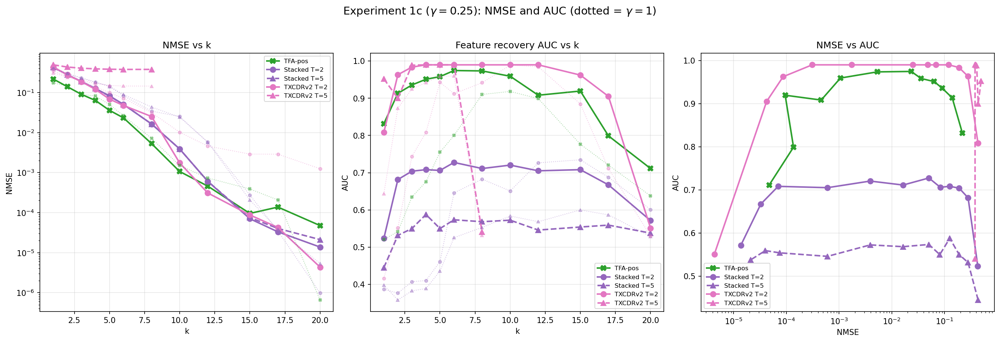
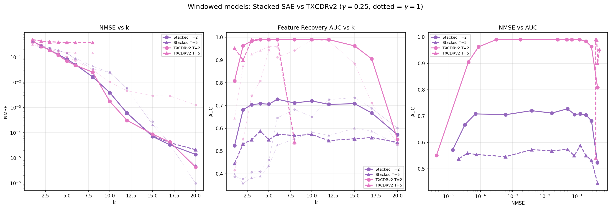
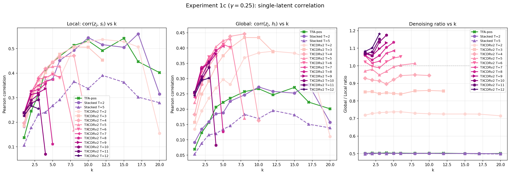
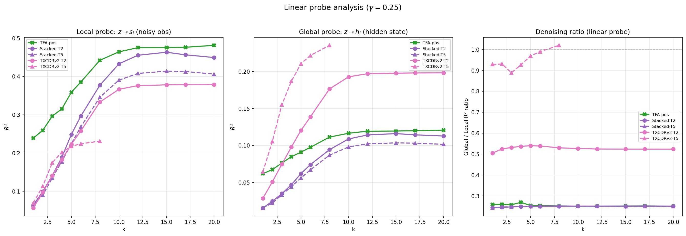
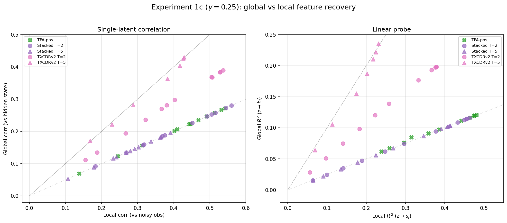

## Experiment 1c: TopK sweep with noisy emissions

### Goal

Run a TopK sweep identical to Experiment 1 but with **noisy emissions** ($\gamma = 0.25$). In Experiment 1, observations perfectly reveal the hidden state ($p_B = 1$, $\gamma = 1$). Here, features fire only 62.5% of the time when the hidden Markov state is ON ($p_B = 0.625$, $p_A = 0$), making per-token observations noisy indicators of the underlying state.

Two questions:

1. Which models degrade gracefully when per-token observations are noisy?
2. Can temporal models **denoise** --- recover the hidden state better than the noisy observations?

### Setup

**Data generation** (Aniket's HMM pipeline):

- $\lambda = 0.3$ ($\rho = 0.7$), $\mu = 0.5$, $p_A = 0$, $p_B = 0.625$, $q = 0.8$
- $\gamma = (1-q)/q = 0.25$
- 20 features, $d = 40$, $T = 64$, seed 42
- 2500 sequences total (2000 eval, 500 train)
- Scaling factor: $\sqrt{d} / \mathbb{E}[\|x\|] = 2.0655$

**Models** (5 total): 

| Model | Training config |
|-------|-----------------|
| TFA-pos | 30K steps, batch 64, lr 1e-3 |
| Stacked T=2 | 30K steps, batch 2048, lr 3e-4 |
| Stacked T=5 | 30K steps, batch 2048, lr 3e-4 |
| TXCDRv2 T=2 | 30K steps, batch 2048, lr 3e-4 |
| TXCDRv2 T=5 | 30K steps, batch 2048, lr 3e-4 |

TXCDRv2 uses $k \times T$ active latents (Andre's v2 design for fair sparsity comparison). TXCDRv2 T=5 skipped for $k \geq 9$ since $k \times 5 > d_{\text{sae}} = 40$.

### Metrics

#### NMSE and AUC

Standard metrics from Experiment 1: NMSE measures reconstruction quality of the noisy observations; decoder-averaged AUC measures how well the model's dictionary recovers the true feature directions.

#### Denoising: single-latent correlation

A new metric for this experiment. For each of the 20 true features $i$:

1. **Match**: find the best-matching latent $j$ by cosine similarity between the model's decoder columns and the true feature direction: $j = \arg\max_j |\cos(d_j, f_i)|$. This matching is done in weight space (decoder directions) and does not touch activation statistics. All models have the same dictionary width ($d_{\text{sae}} = 40$), so the matching is equally constrained regardless of how many latents are active.
2. **Correlate**: compute two Pearson correlations across all eval tokens:
   - **Local**: $\text{Pearson}(z_j, s_i)$ --- does latent $j$'s activation track the noisy observation of feature $i$?
   - **Global**: $\text{Pearson}(z_j, h_i)$ --- does latent $j$'s activation track the true hidden state of feature $i$?

   Each correlation is between two scalar time series of length $N = 128\text{K}$ tokens. Other active features at each token do not directly enter the computation --- we only ask whether latent $j$ covaries with feature $i$'s state. (Imperfect feature separation would dilute the correlation, not bias it.)

3. **Aggregate**: repeat for all 20 true features. Report the ratio $\bar{r}_{\text{global}} / \bar{r}_{\text{local}}$, where $\bar{r}$ denotes the mean Pearson correlation across the 20 features.

If global $>$ local, the model **denoises**. The per-token baseline ratio is 0.50 (equivalently $\text{Corr}(s, h) = 0.50$ with our emission parameters). Any model that processes tokens independently cannot exceed this ratio.

#### Denoising: linear probe

The single-latent correlation uses only the best-matching latent $j$ for each feature $i$. A **linear probe** is more comprehensive: it uses **all** latents simultaneously to predict each feature's state, capturing information that may be distributed across multiple latents.

For each true feature $i$, train two Ridge regressions ($\alpha = 1.0$) on an 80/20 train/test split of the eval data:

- **Local probe**: input $z \in \mathbb{R}^{d_{\text{sae}}}$ (full latent vector at each token), target $s_i \in \{0, 1\}$ (noisy observed firing). Reports $R^2$ on held-out test set.
- **Global probe**: same input $z$, target $h_i \in \{0, 1\}$ (true hidden state). Reports $R^2$ on held-out test set.

The probes are per-feature: 20 local probes and 20 global probes, each a linear map from $\mathbb{R}^{40} \to \mathbb{R}$. The reported ratio is $\text{mean global } R^2 / \text{mean local } R^2$, averaged across all 20 features. The per-token $R^2$ floor is 0.25 ($= \text{Corr}(s, h)^2 = 0.50^2$).

#### Latent extraction for windowed models

TFA-pos produces one latent vector per token directly. Windowed models (Stacked SAE, TXCDRv2) produce latents per window, and each token position appears in up to $T$ overlapping windows (at different position indices within the window). To obtain a single latent per token, we **average** the latent vectors across all overlapping windows containing that position, then compute correlations on the averaged latents. Both the single-latent correlation and the linear probe use this same averaging procedure.

This averaging is the natural choice from an interpretability standpoint --- we need one set of latents per token position, and this is the most information-preserving reduction. However, it introduces a subtlety: the averaged latent for position $t$ effectively depends on a wider context than any single window. For TXCDRv2-$T$, a mid-sequence token's averaged latent aggregates information from up to $2T - 1$ positions (not $T$). This could inflate the denoising ratio beyond what a single window pass would achieve.

**Control**: the Stacked SAE receives the same window-averaging treatment but its ratio remains exactly at the per-token floor (0.50 for single-latent, 0.25 for linear probe). This is because each position's latent in a Stacked SAE depends only on $x_t$ (processed by whichever per-position SAE corresponds to its index in the window), so averaging across windows is still a function of $x_t$ alone --- no cross-position information leaks in. This confirms that the averaging procedure alone does not cause denoising; it requires the model to have cross-position information flow (as TXCDRv2's shared encoder does). Nevertheless, the *magnitude* of TXCDRv2's denoising ratio likely overstates what a single window pass would achieve.

### Results

#### NMSE

| $k$ | TFA-pos | Stacked T=2 | Stacked T=5 | TXCDRv2 T=2 | TXCDRv2 T=5 |
|-----|---------|-------------|-------------|-------------|-------------|
| 1 | **0.218** | 0.427 | 0.433 | 0.431 | 0.493 |
| 3 | **0.090** | 0.189 | 0.189 | 0.187 | 0.407 |
| 5 | **0.036** | 0.083 | 0.081 | 0.069 | 0.383 |
| 8 | **0.005** | 0.016 | 0.016 | 0.025 | 0.379 |
| 10 | **0.001** | 0.004 | 0.004 | 0.002 | --- |
| 15 | 0.000095 | **0.000070** | 0.000075 | 0.000087 | --- |
| 20 | 0.000047 | 0.000014 | 0.000021 | **0.000004** | --- |

TFA-pos dominates NMSE at low-to-moderate $k$ (1--12), consistent with Experiment 1. At $k \geq 15$ the models converge to near-perfect reconstruction and differences vanish.

TXCDRv2 T=5 is essentially broken on NMSE ($\sim 0.38$ regardless of $k$) because $k \times 5$ quickly exceeds $d_{\text{sae}}$ and the model saturates.

#### AUC (feature recovery)

| $k$ | TFA-pos | Stacked T=2 | Stacked T=5 | TXCDRv2 T=2 | TXCDRv2 T=5 |
|-----|---------|-------------|-------------|-------------|-------------|
| 1 | 0.832 | 0.523 | 0.445 | 0.808 | **0.952** |
| 3 | 0.936 | 0.704 | 0.550 | 0.984 | **0.989** |
| 5 | 0.958 | 0.706 | 0.550 | **0.990** | 0.990 |
| 8 | 0.973 | 0.711 | 0.568 | **0.990** | 0.541 |
| 10 | 0.959 | 0.720 | 0.572 | **0.990** | --- |
| 15 | 0.919 | 0.708 | 0.554 | **0.962** | --- |
| 20 | 0.711 | 0.571 | 0.538 | 0.551 | --- |

TXCDRv2 T=2 achieves near-perfect feature recovery (AUC $\geq 0.98$) from $k = 3$ through $k = 12$, substantially outperforming all other models. Its decoder-averaged columns faithfully recover the true feature directions even under noisy emissions.

TFA-pos peaks at AUC $\approx 0.975$ near $k = 6$--$8$ then declines from superposition, mirroring Experiment 1. Stacked SAEs plateau at AUC $\approx 0.7$ (T=2) and $\approx 0.55$ (T=5).

#### Denoising: single-latent correlation ratio

| $k$ | TFA-pos | Stacked T=2 | Stacked T=5 | TXCDRv2 T=2 | TXCDRv2 T=5 |
|-----|---------|-------------|-------------|-------------|-------------|
| 1 | 0.50 | 0.50 | 0.50 | 0.72 | **0.97** |
| 3 | 0.50 | 0.50 | 0.50 | 0.73 | **0.95** |
| 5 | 0.50 | 0.50 | 0.50 | 0.74 | **0.99** |
| 6 | 0.50 | 0.50 | 0.50 | 0.74 | **1.00** |
| 8 | 0.50 | 0.50 | 0.50 | 0.73 | **1.01** |

Three tiers of denoising:

- **TFA-pos, Stacked T=2, Stacked T=5**: ratio $\approx 0.50$ (per-token floor). These models have zero denoising capability --- their latents track the noisy observation, not the hidden state.
- **TXCDRv2 T=2**: ratio $\approx 0.72$--$0.74$. Partial denoising: the shared-latent encoder aggregates two noisy observations, recovering some hidden-state information.
- **TXCDRv2 T=5**: ratio $\approx 0.95$--$1.01$. Near-complete denoising at $k = 6$--$8$ (ratio $\geq 1$), meaning the latent tracks the hidden state at least as well as it tracks the noisy observation. However, this comes at catastrophic NMSE cost ($\sim 0.38$) because $k \times 5$ exceeds dictionary size.

#### Denoising: linear probe

**Baselines**:

| Baseline | Local $R^2$ | Global $R^2$ | Ratio |
|----------|-------------|-------------|-------|
| Oracle (raw $x_t$, per-token) | 0.467 | 0.117 | 0.251 |
| $s \to h$ (fitted Ridge) | --- | 0.252 | --- |
| $\text{corr}(s, h)^2$ | --- | --- | 0.251 |
| Random $z$ | -0.001 | --- | --- |

**Results** (mean $R^2$ across 20 features):

| $k$ | TFA-pos local | TFA-pos global | TFA-pos ratio | TXCDRv2 T=2 local | TXCDRv2 T=2 global | TXCDRv2 T=2 ratio | TXCDRv2 T=5 ratio |
|-----|---------------|----------------|---------------|--------------------|--------------------|-------------------|----|
| 1 | 0.239 | 0.062 | 0.259 | 0.057 | 0.029 | 0.505 | 0.929 |
| 5 | 0.359 | 0.091 | 0.254 | 0.223 | 0.120 | 0.540 | 0.968 |
| 8 | 0.442 | 0.111 | 0.252 | 0.333 | 0.176 | 0.530 | **1.019** |
| 12 | 0.475 | 0.119 | 0.251 | 0.376 | 0.197 | 0.524 | --- |
| 20 | 0.481 | 0.121 | 0.251 | 0.379 | 0.198 | 0.523 | --- |

Stacked SAEs (not shown) match TFA-pos exactly at ratio $\approx 0.25$.

The linear probe results corroborate the single-latent correlation analysis in a different metric space. The per-token floor is 0.25 in $R^2$ space ($= 0.50^2$ in correlation space). TFA-pos and Stacked SAEs sit at this floor, TXCDRv2 T=2 rises to $\approx 0.53$, and TXCDRv2 T=5 reaches $\approx 0.93$--$1.02$.

### Findings

**Finding 1: TFA-pos NMSE advantage persists under noisy emissions.** TFA-pos achieves 2--5$\times$ lower NMSE than Stacked SAEs and TXCDRv2 T=2 at matched $k$ ($k = 1$--$8$), consistent with Experiment 1. The architectural capacity advantage from the attention mechanism is robust to emission noise.

**Finding 2: TXCDRv2 T=2 dominates feature recovery.** TXCDRv2 T=2 achieves AUC $\geq 0.98$ for $k = 3$--$12$, far exceeding TFA-pos ($\leq 0.97$) and Stacked SAEs ($\leq 0.73$). The shared-latent crosscoder architecture, combined with decoder-averaging, produces the most faithful feature directions.

**Finding 3: The per-token floor separates denoisers from non-denoisers.** With our emission parameters, $\text{Corr}(s, h) = 0.50$ ($R^2 = 0.25$). A model that *perfectly* tracks the per-token observation $s_i$ will achieve exactly this ratio. TFA-pos and Stacked SAEs sit precisely at this baseline --- excellent per-token encoders that do not leverage temporal context to recover the hidden state. TXCDRv2 exceeds it.

**Finding 4: TXCDRv2 partially denoises by aggregating across positions.** TXCDRv2 T=2's single-latent ratio of $\approx 0.73$ (linear probe: $\approx 0.53$) exceeds the per-token floor, meaning its shared encoder extracts more hidden-state information than a single noisy observation provides. TXCDRv2 T=5 pushes further to $\approx 1.0$ (linear probe: $\approx 0.97$), achieving near-complete denoising but at catastrophic NMSE cost ($\sim 0.38$).

**Finding 5: TFA-pos does not denoise despite having temporal attention.** TFA-pos's ratio is exactly at the per-token floor across all $k$ values --- identical to Stacked SAEs. Despite having an attention mechanism that can attend to other positions, TFA-pos does not leverage temporal context to recover the hidden state. This is consistent with the Experiment 1/3 finding that TFA's attention is dominated by content-based matching, not temporal prediction.

**Finding 6: Both denoising methods agree.** The single-latent correlation and linear probe produce consistent denoising hierarchies: Stacked/TFA-pos (floor) $<$ TXCDRv2 T=2 (partial) $<$ TXCDRv2 T=5 (near-complete). This robustness to method choice strengthens the conclusion.

**Finding 7: TFA-pos saturates the per-token oracle.** At $k = 20$, TFA-pos achieves local $R^2 = 0.481$, essentially matching the oracle ceiling of 0.467 (raw $x_t$ input). TFA-pos is a near-perfect per-token encoder. Its global $R^2$ ratio of 0.251 matches the oracle ratio, confirming it adds no temporal information.

### Implications

1. **NMSE and denoising are orthogonal.** TFA-pos has the best NMSE but zero denoising. TXCDRv2 T=5 has the best denoising but terrible NMSE. This suggests denoising requires architectural commitment to cross-position aggregation that conflicts with per-token reconstruction.

2. **The shared-latent bottleneck in TXCDRv2 forces denoising.** By encoding a window of $T$ noisy observations into a single shared latent, TXCDRv2 *must* aggregate, which naturally averages out emission noise. Per-token models (TFA-pos, Stacked) have no such pressure.

3. **$\gamma = 0.25$ is moderate noise.** Even at this noise level, TFA-pos shows zero denoising. Stronger noise ($\gamma \to 0$) would likely not change this qualitative result, as the mechanism (content-based attention vs temporal aggregation) is the same.

### Plots











### Reproduction

```bash
# Main experiment (trains models, ~87 min):
TQDM_DISABLE=1 PYTHONUNBUFFERED=1 PYTHONPATH=/home/elysium/temp_xc \
  /home/elysium/miniforge3/envs/torchgpu/bin/python -u \
  src/v2_temporal_schemeC/run_experiment1c_noisy.py

# Linear probe analysis (uses cached models, ~78s):
TQDM_DISABLE=1 PYTHONUNBUFFERED=1 PYTHONPATH=/home/elysium/temp_xc \
  /home/elysium/miniforge3/envs/torchgpu/bin/python -u \
  src/v2_temporal_schemeC/run_exp1c_linear_probe.py

# Re-plot only:
PYTHONPATH=/home/elysium/temp_xc python src/v2_temporal_schemeC/plot_exp1c.py
```

Results: `src/v2_temporal_schemeC/results/experiment1c_noisy/`

Runtime: ~87 minutes on RTX 5090.
