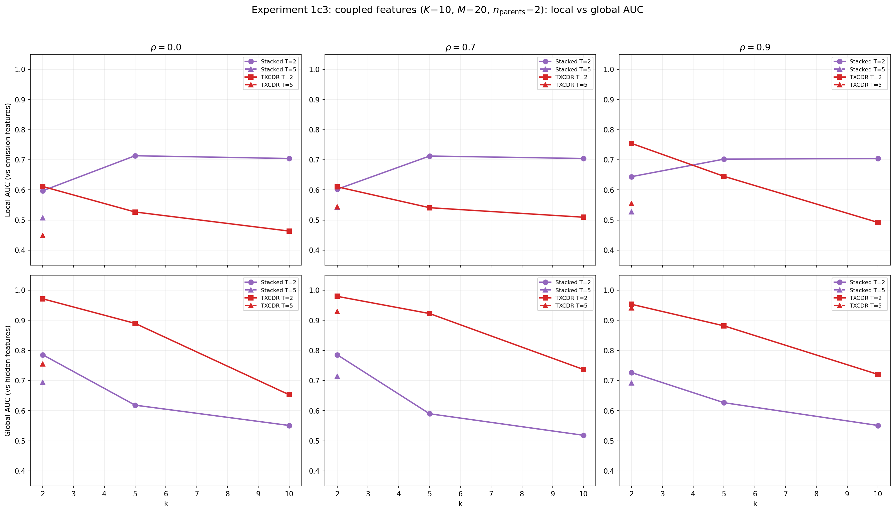
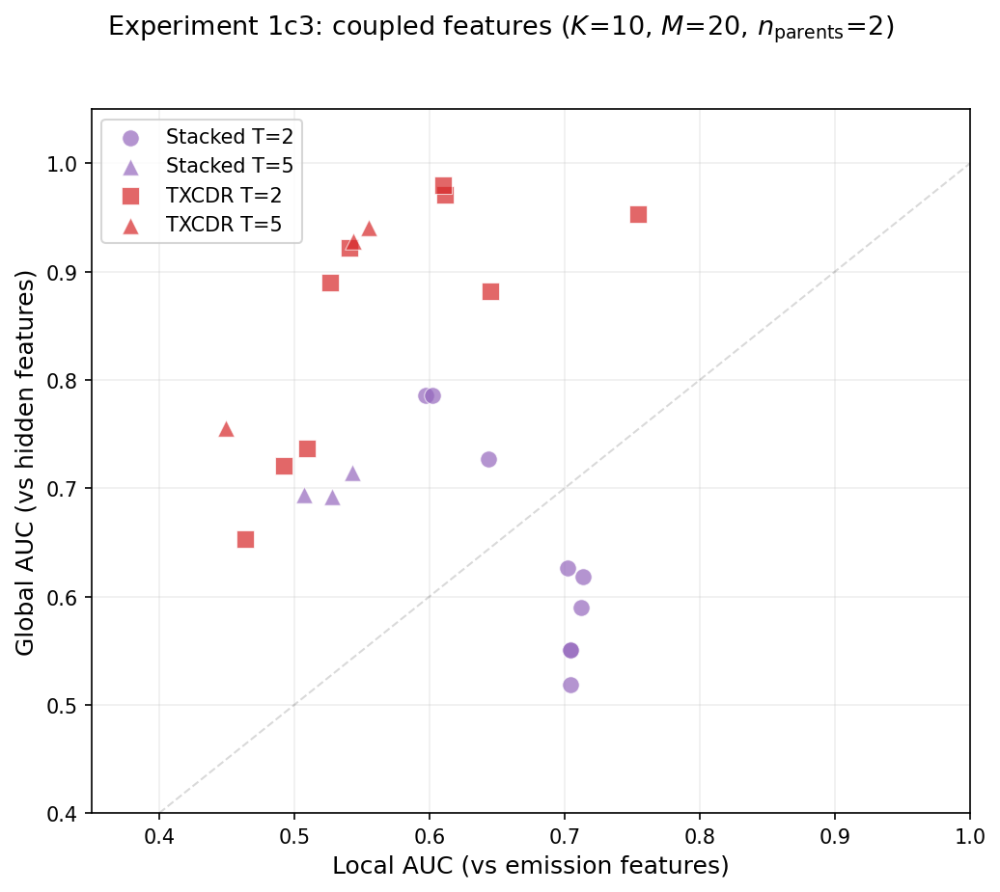
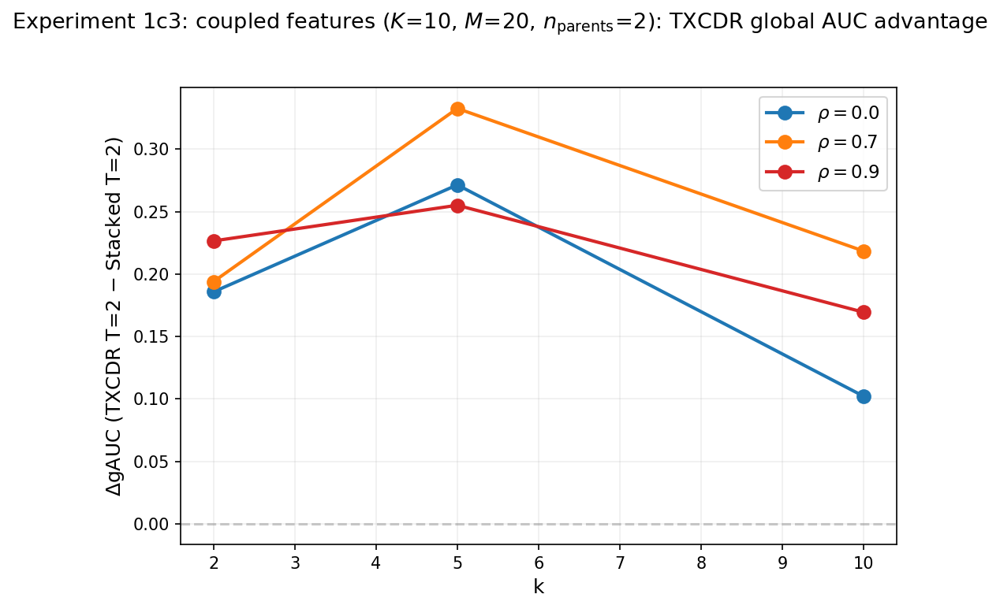

## Experiment 1c3: Local vs global feature recovery with coupled features

### Goal

Test whether the temporal crosscoder can discover **global** (hidden-state) feature structure that is invisible to per-token models, using Aniket's coupled-feature data generation pipeline. This is the "figure 2" experiment predicted in the midterm report: a phase transition where TXCDR's shared latent discovers that co-firing emissions share hidden-state parents.

### Background: coupled features

$K = 10$ hidden Markov chains drive $M = 20$ emission features through a binary coupling matrix $C \in \{0,1\}^{20 \times 10}$, where each emission has $n_{\text{parents}} = 2$ parent hidden states. Emission $j$ fires when ANY parent is active (OR gate): $s_j(t) = \mathbf{1}[\sum_i C_{ji} h_i(t) \geq 1]$.

This creates two sets of ground truth:

- **Local (emission)**: 20 orthogonal directions $\{f_j\}$ in $\mathbb{R}^{256}$, recoverable from single tokens.
- **Global (hidden)**: 10 directions $\{g_i\}$, each the normalized mean of its child emission directions. Only discoverable by aggregating across positions to identify temporally coherent co-activation patterns.

### Setup

- $K = 10$, $M = 20$, $n_{\text{parents}} = 2$, hidden dim $= 256$, $d_{\text{sae}} = 20$
- $\pi = 0.05$ (hidden state ON prob), $\rho \in \{0.0, 0.7, 0.9\}$
- Magnitudes: $\mathcal{N}(1.0, 0.15^2)$
- $k \in \{2, 5, 10, 15, 20, 25\}$, $T \in \{2, 5\}$
- 30K training steps per model
- Models: Stacked SAE ($T = 2, 5$), TXCDR ($T = 2, 5$)
- Evaluation: **dual AUC** --- local AUC (vs emission features) and global AUC (gAUC, vs hidden features)

**Constraint**: $d_{\text{sae}} = 20$ (= $M$), so $k \times T \leq 20$. This limits valid configs: T=2 runs at $k \leq 10$; T=5 only at $k = 2$.

### Results

#### $\rho = 0.0$ (IID, no temporal structure)

| $k$ | Model | NMSE | AUC (local) | gAUC (global) |
|-----|-------|------|-------------|---------------|
| 2 | Stacked T=2 | **0.186** | 0.597 | 0.786 |
| 2 | TXCDR T=2 | 0.229 | 0.611 | **0.971** |
| 2 | Stacked T=5 | **0.198** | 0.507 | 0.694 |
| 2 | TXCDR T=5 | 0.492 | 0.449 | **0.755** |
| 5 | Stacked T=2 | **0.027** | **0.713** | 0.618 |
| 5 | TXCDR T=2 | 0.190 | 0.527 | **0.890** |
| 10 | Stacked T=2 | **0.001** | **0.704** | 0.551 |
| 10 | TXCDR T=2 | 0.189 | 0.463 | **0.653** |

#### $\rho = 0.7$ (moderate temporal correlation)

| $k$ | Model | NMSE | AUC (local) | gAUC (global) |
|-----|-------|------|-------------|---------------|
| 2 | Stacked T=2 | **0.195** | 0.602 | 0.786 |
| 2 | TXCDR T=2 | 0.243 | 0.610 | **0.980** |
| 2 | Stacked T=5 | **0.201** | 0.543 | 0.714 |
| 2 | TXCDR T=5 | 0.390 | 0.544 | **0.929** |
| 5 | Stacked T=2 | **0.028** | **0.712** | 0.590 |
| 5 | TXCDR T=2 | 0.194 | 0.541 | **0.922** |
| 10 | Stacked T=2 | **0.001** | **0.704** | 0.518 |
| 10 | TXCDR T=2 | 0.189 | 0.509 | **0.737** |

#### $\rho = 0.9$ (strong temporal correlation)

| $k$ | Model | NMSE | AUC (local) | gAUC (global) |
|-----|-------|------|-------------|---------------|
| 2 | Stacked T=2 | **0.178** | 0.644 | 0.727 |
| 2 | TXCDR T=2 | 0.238 | **0.754** | **0.953** |
| 2 | Stacked T=5 | **0.192** | 0.528 | 0.692 |
| 2 | TXCDR T=5 | 0.333 | 0.555 | **0.941** |
| 5 | Stacked T=2 | **0.019** | **0.702** | 0.627 |
| 5 | TXCDR T=2 | 0.195 | 0.645 | **0.882** |
| 10 | Stacked T=2 | **0.001** | **0.704** | 0.551 |
| 10 | TXCDR T=2 | 0.188 | 0.492 | **0.720** |

### Findings

**Finding 1: TXCDR dominates global feature recovery across all regimes.** At $k = 2$, TXCDR T=2 achieves gAUC $= 0.97$--$0.98$ across all $\rho$ values, vs Stacked T=2's $0.73$--$0.79$. The shared latent discovers the 10 hidden-state directions even at $\rho = 0.0$ (no temporal signal). This is surprising --- it suggests the shared encoder exploits the co-occurrence structure of emissions (which share parents) even without temporal persistence.

**Finding 2: Stacked SAE wins NMSE and local AUC but loses global AUC.** Stacked T=2 achieves much lower NMSE (0.001 vs 0.189 at $k = 10$) and higher local AUC (0.704 vs 0.463--0.509). It is an excellent per-token reconstructor that faithfully recovers the 20 emission directions. But it cannot discover the 10 hidden-state directions --- its gAUC declines with $k$ (0.786 at $k = 2$ → 0.551 at $k = 10$).

**Finding 3: gAUC declines with $k$ for both models, but TXCDR declines slower.** As $k$ increases beyond $K = 10$ hidden states, both models overfit to emission-level structure. But TXCDR retains much more global information: at $k = 10$, $\rho = 0.7$, TXCDR gAUC = 0.737 vs Stacked gAUC = 0.518. The shared-latent bottleneck provides a structural prior that resists splitting global features into emission-level fragments.

**Finding 4: The gAUC advantage holds even at $\rho = 0$.** This was unexpected. At $\rho = 0.0$, features are IID --- there is no temporal signal to exploit. Yet TXCDR T=2 still achieves gAUC = 0.971 at $k = 2$ (vs Stacked's 0.786). The shared encoder aggregates two positions where the same hidden state drives correlated emissions, even without temporal persistence. The **spatial** co-occurrence within each window is sufficient.

**Finding 5: The $d_{\text{sae}} = M$ constraint severely limits the sweep.** With $d_{\text{sae}} = 20$, T=5 is only valid at $k = 2$, and T=2 is capped at $k = 10$. The phase transition predicted in the report (gAUC rising at high $k$) cannot be fully observed because the dictionary is too small for high-$k$ crosscoders. A follow-up with $d_{\text{sae}} > M$ (e.g., $d_{\text{sae}} = 40$ or $64$) would allow sweeping $k$ up to $20$+ at T=2 and reveal the full transition curve.

### Implications

1. **TXCDR discovers latent causal structure, not just temporal patterns.** The gAUC advantage at $\rho = 0$ proves that the shared encoder exploits co-occurrence (which emissions co-fire because they share parents), not just temporal persistence. This is the "figure 2" result predicted in the report.

2. **Local and global feature recovery are in tension.** Stacked SAE's high local AUC (0.70+) comes at the cost of low gAUC (0.55). TXCDR's high gAUC (0.90+) comes at the cost of lower local AUC (0.50--0.61) and much higher NMSE. The two architectures optimize for different aspects of the ground truth.

3. **The coupled-feature setting genuinely separates local from global.** Unlike the 1c/1c2 experiments (one-to-one hidden→emission), the coupled model creates a real distinction between emission-level and hidden-state-level structure. TXCDR's advantage in this setting is evidence of genuine structural inference, not just denoising.

### Plots







### Reproduction

```bash
TQDM_DISABLE=1 PYTHONUNBUFFERED=1 PYTHONPATH=/home/elysium/temp_xc \
  /home/elysium/miniforge3/envs/torchgpu/bin/python -m src.bench.sweep \
  --coupled --K-hidden 10 --M-emission 20 --n-parents 2 \
  --k 2 5 10 15 20 25 --rho 0.0 0.7 0.9 --T 2 5 \
  --steps 30000 --models Stacked TXCDR \
  --results-dir src/v2_temporal_schemeC/results/experiment1c3_coupled
```

Results: `src/v2_temporal_schemeC/results/experiment1c3_coupled/sweep_summary.json`

### Next steps

- Increase $d_{\text{sae}}$ to 40 or 64 to allow higher $k$ and reveal the full phase transition
- Add TFA-pos and TopK SAE baselines
- Sweep $n_{\text{parents}} \in \{1, 2, 3, 4\}$ to test how entanglement affects the gAUC gap
