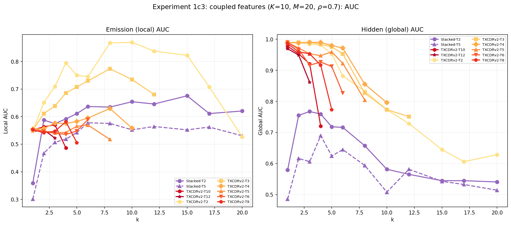
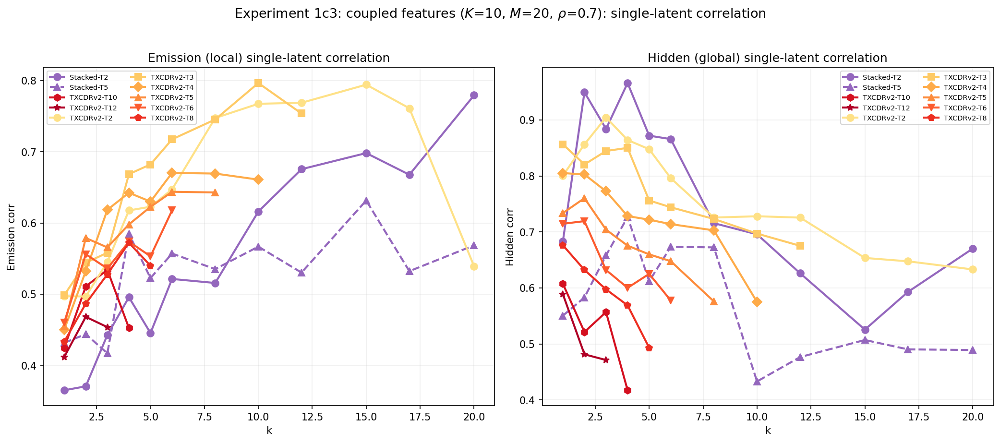
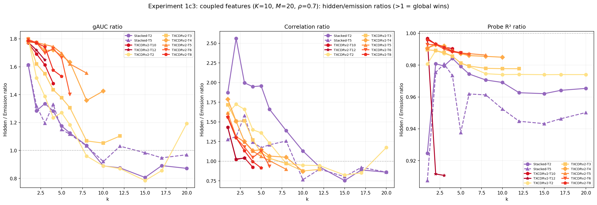
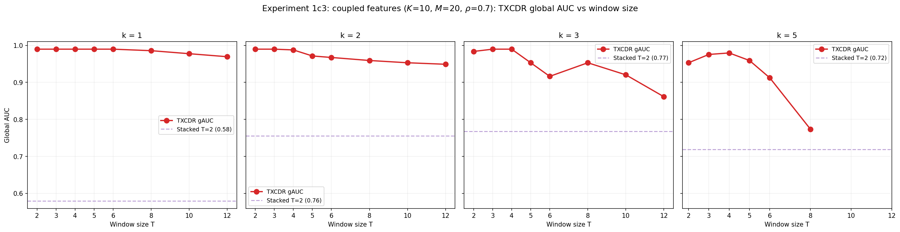

## Experiment 1c3: Local vs global feature recovery with coupled features

### Goal

Test whether TXCDR can discover **global** (hidden-state) structure that per-token models cannot, using Aniket's coupled-feature data generation pipeline. Three metrics are evaluated: (i) decoder AUC, (ii) single-latent correlation, (iii) linear probe R².

### Background: coupled features

$K = 10$ hidden Markov chains drive $M = 20$ emission features through a binary coupling matrix $C \in \{0,1\}^{20 \times 10}$, where each emission has $n_{\text{parents}} = 2$ parent hidden states. Emission $j$ fires when ANY parent is active (OR gate): $s_j(t) = \mathbf{1}[\sum_i C_{ji} h_i(t) \geq 1]$.

Two sets of ground truth:

- **Local (emission)**: 20 orthogonal directions $\{f_j\}$ in $\mathbb{R}^{256}$, recoverable from single tokens.
- **Global (hidden)**: 10 directions $\{g_i\}$, each the normalized mean of its child emission directions. These are a proxy for the hidden states --- the hidden states themselves are binary time series, not directions. The purest measure of global recovery is how well latent activations predict the hidden state time series (correlation and probe metrics below).

### Setup

- $K = 10$, $M = 20$, $n_{\text{parents}} = 2$, $d = 256$, $d_{\text{sae}} = 40$
- $\pi = 0.05$ (hidden state ON prob), $\rho = 0.7$
- Magnitudes: folded normal $\mathcal{N}(1.0, 0.15^2)$
- $T = 64$, seed 42, 2500 sequences (2000 eval, 500 train)
- $k \in \{1, 2, 3, 4, 5, 6, 8, 10, 12, 15, 17, 20\}$
- Models: Stacked SAE ($T = 2, 5$), TXCDRv2 ($T \in \{2, 3, 4, 5, 6, 8, 10, 12\}$)

### Metrics

#### (i) Decoder AUC

Cosine similarity between decoder columns and ground truth directions. Computed separately against emission features (local AUC) and hidden features (global AUC = gAUC). Measures whether the **dictionary directions** align with the ground truth.

#### (ii) Single-latent correlation

For each ground truth target (emission $j$ or hidden state $i$), find the best-matching latent by decoder cosine similarity with the corresponding direction. Compute $\text{Pearson}(z_j, \text{target})$ across all eval tokens. Report mean across targets. The correlation ratio (hidden/emission) measures whether latent **activations** track hidden states better than emissions.

#### (iii) Linear probe R²

Train Ridge regression from the full latent vector $z \in \mathbb{R}^{d_{\text{sae}}}$ to each target (emission support $s_j$ or hidden state $h_i$). Report mean R² across targets. The probe ratio (hidden/emission) captures information distributed across all latents, not just the best match.

Note: for windowed models, latent activations are averaged across overlapping windows (same procedure as Experiment 1c --- see caveats there).

### Results

#### Selected results at $k = 2$ and $k = 5$

| $k$ | Model | eAUC | gAUC | corr ratio | probe ratio |
|-----|-------|------|------|------------|-------------|
| 2 | Stacked T=2 | 0.588 | 0.755 | 2.56 | 0.98 |
| 2 | TXCDRv2 T=2 | 0.651 | **0.990** | 1.72 | 0.99 |
| 2 | TXCDRv2 T=5 | 0.548 | **0.971** | 1.31 | 0.99 |
| 2 | TXCDRv2 T=12 | 0.552 | **0.949** | 1.03 | 0.91 |
| 5 | Stacked T=2 | **0.611** | 0.718 | 1.96 | 0.98 |
| 5 | TXCDRv2 T=2 | **0.750** | **0.953** | 1.36 | 0.98 |
| 5 | TXCDRv2 T=5 | 0.565 | **0.959** | 1.06 | 0.99 |
| 5 | TXCDRv2 T=8 | 0.505 | 0.773 | 0.91 | 0.99 |

#### Comparison at $k = 10$ and $k = 20$

| $k$ | Model | eAUC | gAUC | corr ratio | probe ratio |
|-----|-------|------|------|------------|-------------|
| 10 | Stacked T=2 | **0.654** | 0.582 | 1.13 | 0.97 |
| 10 | TXCDRv2 T=2 | **0.869** | **0.773** | 0.95 | 0.97 |
| 20 | Stacked T=2 | 0.620 | 0.541 | 0.86 | 0.97 |
| 20 | TXCDRv2 T=2 | 0.527 | **0.629** | 1.17 | 0.97 |

### Findings

**Finding 1: gAUC shows clear TXCDR advantage, but other metrics are more nuanced.** TXCDR T=2 achieves gAUC $\geq 0.95$ at $k \leq 5$, far exceeding Stacked SAE. But the correlation ratio and probe ratio tell a different story --- Stacked SAE also has high correlation ratios (1.3--2.6) at low k, sometimes exceeding TXCDR. This is because the gAUC measures dictionary direction alignment, while the correlation and probe measure activation-level tracking.

**Finding 2: The correlation ratio is high for ALL models at low k.** At $k = 1$--$2$, both Stacked and TXCDR have correlation ratios well above 1.0, meaning all models' latents track hidden states better than emissions at very low k. This makes sense: with only $k = 1$--$2$ active latents and $\sim 4$ active emissions per token, the model is forced to learn composite features that aggregate emissions --- which naturally aligns with hidden state directions. The correlation ratio thus does not cleanly separate architectures at low k.

**Finding 3: At moderate $k$ ($5$--$10$), the metrics diverge.** As $k$ increases, Stacked SAE's gAUC drops (0.718 → 0.582) while TXCDR T=2's stays high (0.953 → 0.773). The correlation ratio for Stacked also drops below TXCDR's. This is the regime where the architectural difference matters most: Stacked SAE has enough capacity to learn individual emission features and stops aggregating, while TXCDR's shared bottleneck maintains global structure.

**Finding 4: The probe ratio is $\approx 1$ for all models.** The linear probe can predict hidden states about as well as emissions for both architectures, across all $k$ values. This means the latent representations contain hidden-state information whether or not the model explicitly learns hidden directions. The information is there --- the question is whether it's accessible via single latent inspection (correlation) or requires a linear combination (probe).

**Finding 5: gAUC is the most discriminative metric for this setting.** The correlation ratio is noisy and confounded by the low-k composite effect. The probe ratio is near 1 for everyone. The gAUC cleanly separates TXCDR (0.95+) from Stacked SAE (0.75) across the relevant $k$ range. This is because gAUC directly measures whether the learned dictionary captures hidden-state directions as interpretable, axis-aligned features --- which is the interpretability-relevant question.

### Plots











### Reproduction

```bash
# Train models + compute all 3 metrics (~68 min):
TQDM_DISABLE=1 PYTHONUNBUFFERED=1 PYTHONPATH=/home/elysium/temp_xc \
  /home/elysium/miniforge3/envs/torchgpu/bin/python -u \
  src/v2_temporal_schemeC/run_exp1c3_denoising.py

# Re-plot only:
PYTHONPATH=/home/elysium/temp_xc python src/v2_temporal_schemeC/plot_exp1c3.py
```

Results: `src/v2_temporal_schemeC/results/experiment1c3_coupled/`

Runtime: ~68 minutes on RTX 5090.
