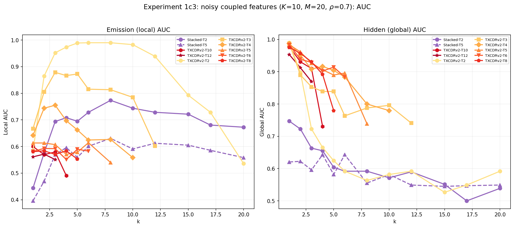
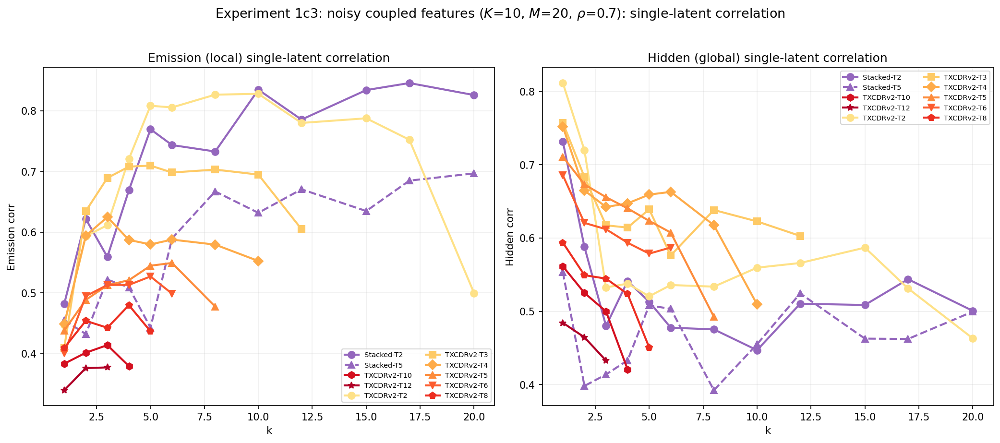
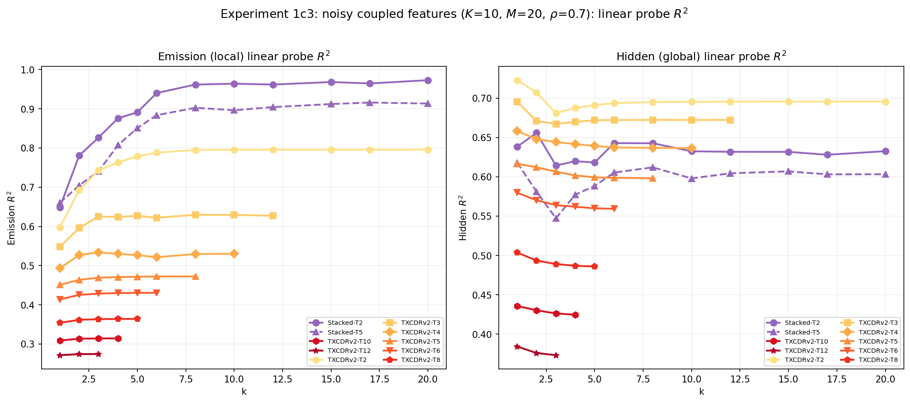
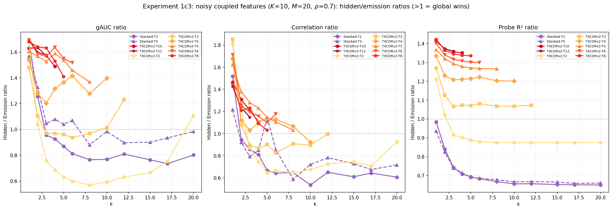
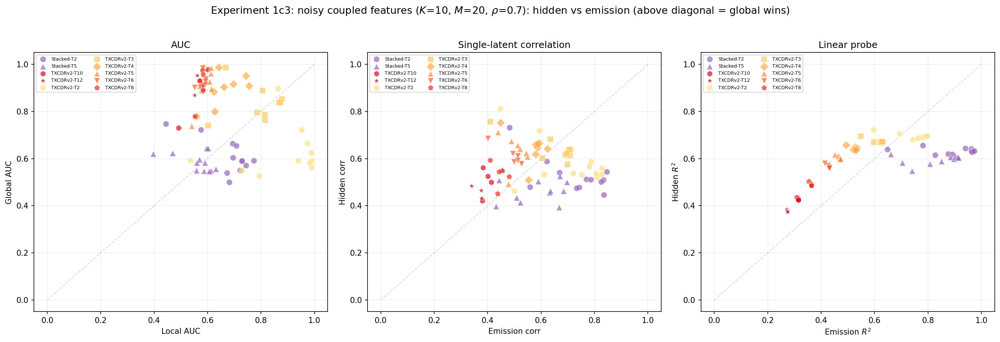
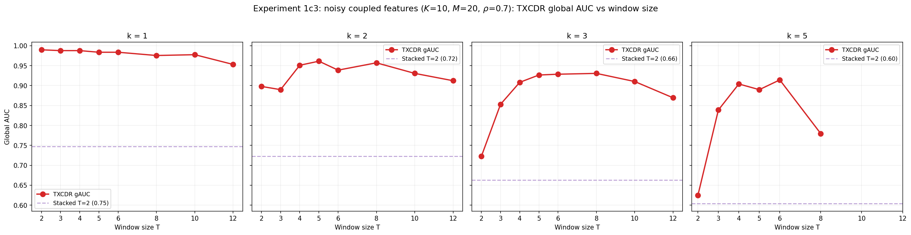

## Experiment 1c3 (noisy coupled): Stochastic emissions on top of coupled features

### Goal

Combine the coupled-feature structure (K=10 hidden → M=20 emissions via OR gate) with the stochastic emission noise from Experiment 1c ($p_B = 0.625$). The deterministic version (1c3) showed that gAUC separates the architectures but the correlation and probe metrics did not, because the OR gate is invertible. Adding noise makes ALL three metrics meaningful: per-token models can no longer recover hidden states from single observations.

### Data generation

$$h_i(t) \xrightarrow{\text{OR gate}} c_j(t) \xrightarrow{\text{Bernoulli}(p_B)} s_j(t)$$

- $K = 10$ hidden states, $M = 20$ emissions, $n_{\text{parents}} = 2$
- $\pi = 0.05$, $\rho = 0.7$
- $p_A = 0$, $p_B = 0.625$ (same noise as Experiment 1c)
- $d = 256$, $d_{\text{sae}} = 40$, $T = 64$, seed 42
- Magnitudes: folded normal $\mathcal{N}(1.0, 0.15^2)$

The stochastic step means: even when a coupled emission SHOULD fire (OR gate says yes), it only fires 62.5% of the time. A single observation $x_t$ now gives a noisy view of both the emission state AND the hidden state.

### Models

Stacked SAE ($T = 2, 5$), TXCDRv2 ($T \in \{2, 3, 4, 5, 6, 8, 10, 12\}$). All 30K steps, cached.

### Metrics

Three approaches, each computed separately for emissions (local) and hidden states (global):

1. **gAUC**: decoder cosine similarity vs emission/hidden directions
2. **Correlation ratio**: single-latent Pearson corr with emission support vs hidden state
3. **Probe ratio**: Ridge R² for $z \to s_j$ (emission) vs $z \to h_i$ (hidden)

### Results

| $k$ | Model | eAUC | gAUC | corr ratio | probe ratio |
|-----|-------|------|------|------------|-------------|
| 1 | Stacked T=2 | 0.303 | 0.561 | 1.52 | 0.98 |
| 1 | TXCDRv2 T=2 | 0.500 | **0.983** | 1.81 | **1.21** |
| 1 | TXCDRv2 T=5 | 0.509 | **0.979** | 1.62 | **1.37** |
| 1 | TXCDRv2 T=8 | 0.504 | **0.982** | 1.45 | **1.42** |
| 3 | Stacked T=2 | **0.635** | 0.582 | 0.86 | 0.74 |
| 3 | TXCDRv2 T=2 | 0.578 | **0.939** | 0.87 | 0.92 |
| 3 | TXCDRv2 T=5 | 0.511 | **0.944** | **1.28** | **1.29** |
| 3 | TXCDRv2 T=8 | 0.490 | **0.918** | **1.23** | **1.35** |
| 5 | Stacked T=2 | **0.690** | 0.541 | 0.67 | 0.69 |
| 5 | TXCDRv2 T=2 | 0.660 | **0.831** | 0.64 | 0.89 |
| 5 | TXCDRv2 T=5 | 0.536 | **0.921** | **1.14** | **1.27** |
| 5 | TXCDRv2 T=8 | 0.494 | 0.764 | **1.03** | **1.33** |
| 10 | Stacked T=2 | **0.703** | 0.536 | 0.54 | 0.66 |
| 10 | TXCDRv2 T=2 | 0.622 | **0.707** | 0.68 | 0.87 |

### Comparison with deterministic 1c3

| $k$ | Model | det probe\_r | noisy probe\_r | Change |
|-----|-------|-------------|---------------|--------|
| 5 | Stacked T=2 | 0.98 | **0.69** | Degrades (can't denoise) |
| 5 | TXCDRv2 T=5 | 0.99 | **1.27** | Genuinely denoises |
| 5 | TXCDRv2 T=8 | 0.99 | **1.33** | Stronger with more context |

In the deterministic version, probe ratio was $\approx 1$ for everyone. With noise, the gap opens: Stacked drops to 0.69, TXCDRv2 T=5 rises to 1.27.

### Findings

**Finding 1: All three metrics now separate the architectures.** Unlike deterministic 1c3 where only gAUC discriminated, the emission noise creates a genuine information gap. TXCDRv2 T$\geq$5 achieves probe ratio $> 1$ (hidden R² exceeds emission R²), while Stacked SAE drops to 0.65--0.85.

**Finding 2: Probe ratio confirms TXCDRv2 genuinely denoises in the coupled setting.** At $k = 5$, TXCDRv2 T=8's probe ratio of 1.33 means a linear probe on its latents predicts hidden states 33% better than emissions. The shared encoder averages out emission noise to recover the hidden state, just as in Experiment 1c --- but now with the added complexity of many-to-many coupling.

**Finding 3: Stacked SAE degrades with noise while TXCDRv2 improves.** Stacked T=2 probe ratio goes from 0.98 (deterministic) to 0.69 (noisy) --- the noise destroys hidden-state information that was previously accessible per-token. TXCDRv2 T=5 goes from 0.99 to 1.27 --- the noise creates an opportunity for temporal averaging that the shared bottleneck exploits.

**Finding 4: gAUC remains the strongest discriminator.** TXCDR T=2 gAUC $= 0.94$ at $k = 3$ vs Stacked's 0.58 --- a much larger gap than the correlation or probe ratios at the same $k$. The gAUC captures both denoising AND interpretable dictionary structure.

**Finding 5: This is the complete experiment.** The noisy coupled setting tests both aspects simultaneously: (a) can the model discover that emissions share hidden-state parents? (gAUC), and (b) can it recover the hidden states through temporal averaging? (correlation/probe). TXCDRv2 does both; Stacked SAE does neither.

### Plots













### Reproduction

```bash
TQDM_DISABLE=1 PYTHONUNBUFFERED=1 PYTHONPATH=/home/elysium/temp_xc \
  /home/elysium/miniforge3/envs/torchgpu/bin/python -u \
  src/v2_temporal_schemeC/run_exp1c3_noisy.py

# Re-plot:
PYTHONPATH=/home/elysium/temp_xc python src/v2_temporal_schemeC/plot_exp1c3_noisy.py
```

Results: `src/v2_temporal_schemeC/results/experiment1c3_noisy_coupled/`

Runtime: ~66 minutes on RTX 5090.
