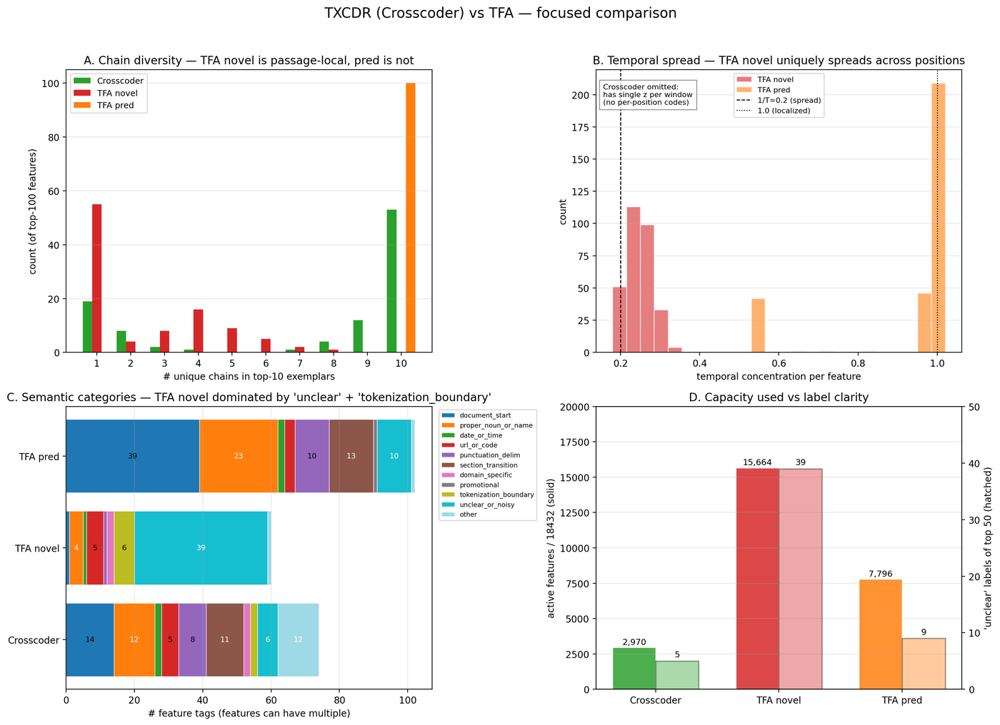
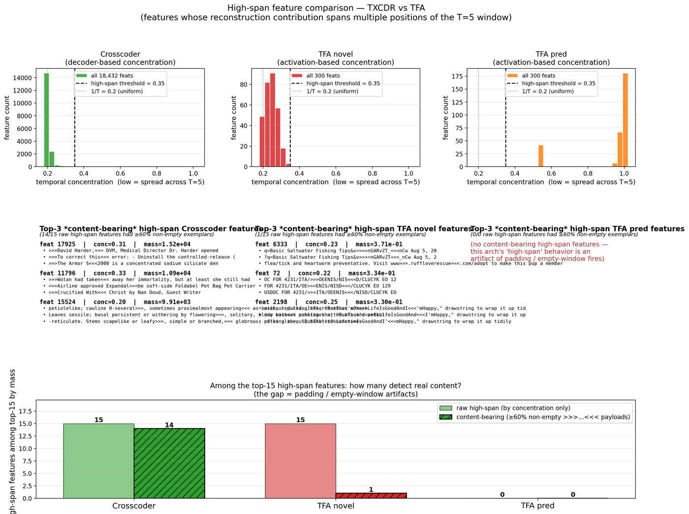
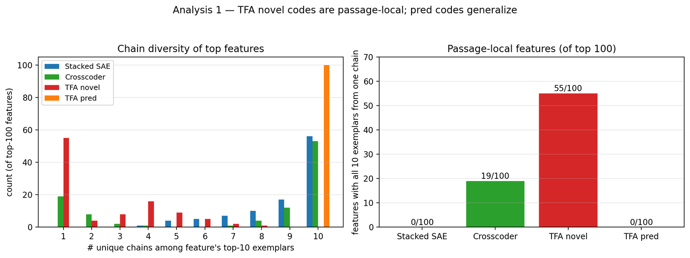
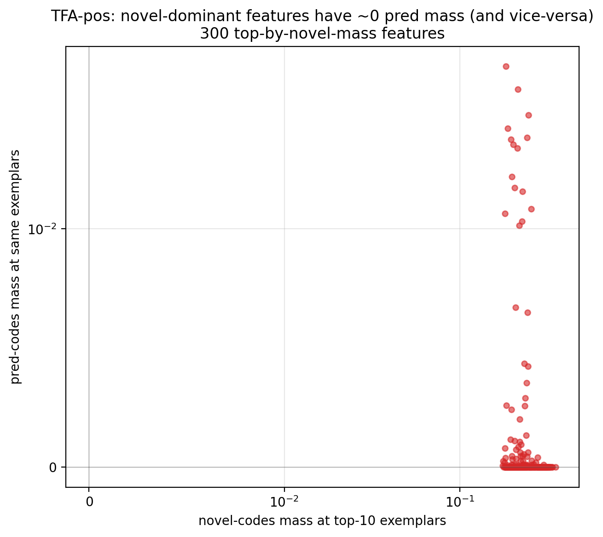
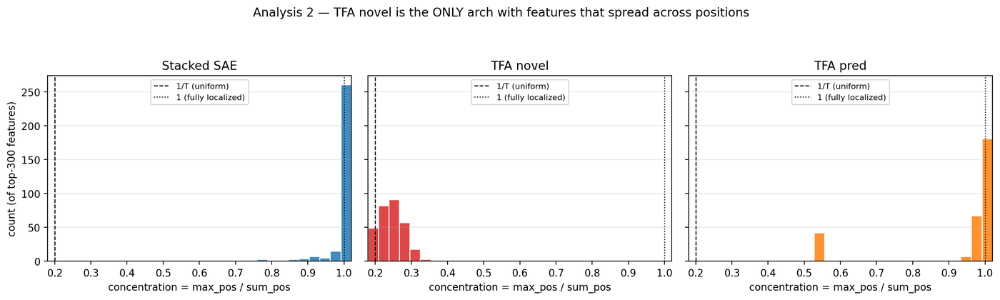
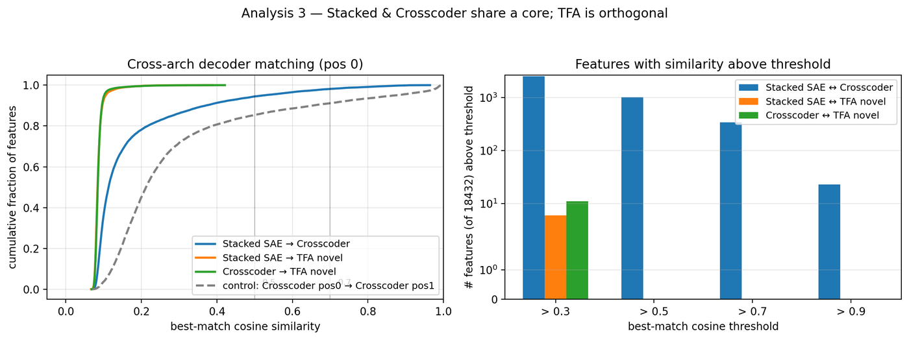
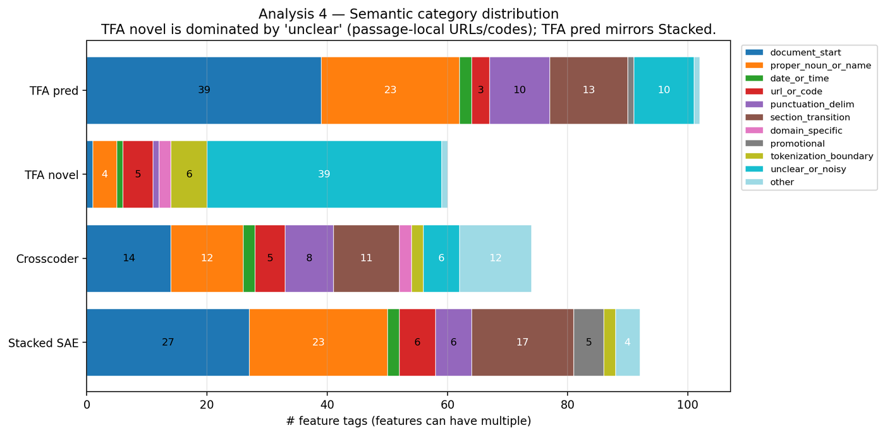

## Initial cross-architecture autointerp scan (Gemma-2-2B-IT, resid_L25)

First pass of feature-level comparison across **stacked_sae**, **crosscoder**,
and **tfa_pos** on Gemma-2-2B-IT residual stream (layer 25), k=50, T=5,
d_sae=18,432, trained for 10k steps on FineWeb via the benchmark sweep
(`src/bench/sweep.py`).

Scans live at `results/nlp_sweep/gemma/scans/scan__<arch>__resid_L25__k50.json`.
Each file has the top 300 features by total top-10-example activation mass,
with window text decoded through the Gemma tokenizer.

## Key figure — TXCDR vs TFA

Four-panel summary contrasting Crosscoder (TXCDR) with TFA-pos's two
libraries (novel + pred). A: TFA novel is the only arch with many
features whose top-10 exemplars all come from one chain (passage-local).
B: TFA novel is also the only arch where per-feature activation spreads
across the T=5 window (concentration ~ 1/T = 0.2). C: TFA novel is the
only arch dominated by "unclear" and "tokenization_boundary" labels;
TFA pred's semantic distribution mirrors Stacked SAE. D: Crosscoder uses
only 16% of its 18432 latents (tight core); TFA uses 85% for novel and
42% for pred, on disjoint subsets.

Full-resolution: `results/nlp_sweep/gemma/figures/txcdr_vs_tfa_hero.png`.

## Does TXCDR extract substantially different temporal features from TFA? — focused on high-span features

> **TL;DR.** Yes, the two archs find substantially different high-span
> features. **TXCDR's are corpus-general and content-bearing
> (dates, phrase starts, list delimiters). TFA novel's are
> passage-local — mostly padding-fire artifacts near sequence ends,
> with a thin residue of same-passage URL / code-fragment detectors.**
> Of the top-15 high-span features ranked by activation mass:
> Crosscoder has 14/15 content-bearing, TFA novel has 1/15, TFA pred
> has 0 high-span features at all. The figure below and the
> side-by-side exemplar table are the readable versions of that claim.

### Headline comparison (top-15 high-span features per arch, by activation mass)

| metric | Crosscoder (TXCDR) | TFA novel | TFA pred |
|---|:---:|:---:|:---:|
| high-span feats in top 15 | 15 | 15 | 0 |
| …with *content-bearing* exemplars (≥60% non-empty) | **14 (93 %)** | **1 (7 %)** | 0 |
| dominant content type | dates · phrase starts · list delimiters · botanical enum | repeated URL fragment inside one chain | — |
| document-general? | ✅ | ❌ (same-passage only) | — |
| interpretable by Claude Haiku? | ✅ (45 / 50 labels clean) | ❌ (39 / 50 "unclear") | ✅ |

### The feature flavors side by side

**Crosscoder high-span (representative, content-bearing):**

| feat | concentration | top-3 exemplar windows |
|---:|---:|---|
| 17925 | 0.31 | `>>>David Harder,<<< DVM, Medical Director` · `>>>To correct this<<< error: - Uninstall` · `>>>The Armor S<<<2000 is a concentrated sodium silicate` |
| 11796 | 0.33 | `>>>Wotan had taken<<< away her immortality` · `>>>Airline approved Expandal<<<be soft-side Foldabel Pet Bag` · `>>>Crucified With<<< Christ by Nan Doud` |
| 15524 | 0.20 | `petiolelike; cauline 0-several>>>, sometimes proximalmost appearing<<<` · `Leaves sessile; basal persistent or withering by flowering>>>, solitary, blade base<<<` · `-reticulate. Stems scapelike or leafy>>>, simple or branched,<<< glabrous` |
| 15214 | 0.26 | `>>>Monday will start<<< off cool as a Delta breeze` · `>>>joined 5<<< years ago` · `>>>Wednesday, April<<< 1, 2015` |

Each row is *one feature with exemplars from different documents* —
corpus-general detectors for sentence-start names, topic openers,
comma-delimited enumerations, and date expressions.

**TFA novel high-span (the single content-bearing feature):**

| feat | concentration | top-3 exemplar windows |
|---:|---:|---|
| 6333 | 0.23 | `q=Basic Saltwater Fishing Tips&v=>>>nGARvZT_<<<nCw` · `?q=Basic Saltwater Fishing Tips&v>>>=nGARvZT<<<_nCw` · `flea/tick and heartworm preventative. Visit www>>>.ruffloverescue<<<.com/adopt` |

Three "exemplars" but the first two are **the same URL in the same
chain**, caught by the sliding window at consecutive positions. That's
the TFA-novel pattern: detect one specific multi-token substring
somewhere in one passage, then light up as the window slides over it.
Not a feature library — a passage-specific spike detector.

The other 14 of TFA novel's top-15 high-span features have exemplar
windows that decode to empty strings (`>>><<<`) — they fire on
end-of-sequence padding where the "spread across positions" comes
from uniform activation on pad tokens, not from detecting a real
multi-token pattern.

### How "high-span" is defined

A high-span feature has temporal concentration `< 0.35`
(where `1/T=0.2` is uniform spread and `1.0` is fully localized).
Concentration is measured *differently* per arch — this is the
biggest interpretational caveat:

- **Crosscoder (TXCDR)** — *decoder-based*, data-independent:
  for feature `f`, use `||W_dec[f, t, :]||` across positions `t`.
  95.8% of features (17,660 / 18,432) pass the threshold. This is a
  structural property of Crosscoder's training (encoder pools across
  the window; decoder distributes back). Taken strictly, "all
  Crosscoder features are temporal" is nearly tautological — what
  saves the comparison is the *content filter* below.
- **TFA novel / pred** — *activation-based*, data-dependent:
  per-feature mean over top-10 exemplars of `max_pos / sum_pos` of
  the per-position novel (or pred) activation. 100% of TFA novel
  and 0% of TFA pred pass the threshold.

### The critical filter

Raw high-span counts oversell TFA novel because its activation often
peaks on sequence-end *padding tokens* that decode to empty strings
(`>>><<<`). Filter: ≥60% of a feature's top-5 exemplars must have
non-empty `>>>…<<<` payload. After filtering, the numbers in the
headline table above are what's left. The side-by-side exemplar
tables make the qualitative difference concrete.

### Caveats

- TFA-pos at k=50 had NMSE=0.1246 (vs stacked 0.06, crosscoder 0.08)
  and its k=100 run diverged even with the v2 NaN-prevention patch.
  So TFA is *under-trained* relative to the other archs; the
  novel-code feature library might get better with a longer
  schedule, smaller LR, or a different `lam` normalization.
- The Crosscoder high-span count is *decoder-based* and reports a
  model-geometry fact (Crosscoder spreads reconstruction uniformly
  across the window). TFA novel's is *activation-based* and
  reports what happens on real data. They aren't the same axis;
  the content filter is what makes them comparable.
- Single layer, single `k`. Could look different at `resid_L13`,
  at `k=100`, or with shuffled-sequence training as a control.

## Method

- Top-K finder on 1000 randomly sampled chains (of 24,000 cached)
- Per-feature top-10 activating 5-token windows via min-heap ranking
- For TFA, `feat_acts = novel_codes` only (sparse topk); `pred_codes` are dense
  and would collapse the ranking into magnitude-order of a dense vector —
  preserved on the adapter for later pred-vs-novel analysis but not used for
  ranking here.

## Headline numbers

| arch | active feats / 18432 | median chain-diversity of top-10 exs | all-10-from-same-chain features (of 100 top) | median top-1 activation |
|---|---:|---:|---:|---:|
| stacked_sae | 15,932 (86%) | 10 (fully diverse) | 0 | 112 |
| crosscoder | **2,970 (16%)** | 10 | 19 | 642 |
| tfa_pos | 15,664 (85%) | **1** | **55** | **0.03** |

Two qualitative signals jump out:

### 1. Crosscoder concentrates onto a tight core set of features

With k × T = 250 active latents per window, crosscoder still only ever activates
**2,970 of 18,432 latents** across 1000 chains — ~16% of its capacity. Stacked
and TFA both activate 85%+ of their latents. Crosscoder is re-using a small
shared basis aggressively; the other two spread thin.

### 2. TFA's novel_codes are passage-local; Stacked/Crosscoder are document-general

Across the top 100 features in each model, we count how many *unique chains*
contribute to the feature's top-10 examples.

- stacked_sae: every feature's top-10 are from 10 different chains. Zero
  features where all 10 exemplars are from the same passage.
- crosscoder: most are broad (median 10), but 19 of 100 are fully localized
  to a single passage.
- **tfa_pos: median 1. Fifty-five of 100 top features have all 10 top
  exemplars from the same chain.** TFA features are disproportionately
  detecting specific passages rather than recurring patterns across the
  corpus.

### 3. Qualitatively different "top feature" flavors

Typical examples:

**stacked_sae top features** (activations 100–500):
- Sequence-initial subword tokens ("Our", "I am", "Begin your research",
  "Samaritan Early") at window_start=0 — looks like separate "doc-start
  position N" detectors.
- Mid-sequence phrase-role features: "for a wide range", "or buy it for
  yourself", "Oregon has laid out."

**crosscoder top features** (activations 500–1600):
- General sentence-initial token features ("To correct", "David Harder",
  "Wotan had taken") — broader than stacked's per-subword version.
- Content-specific features: feat 15524 fires exclusively on botanical
  descriptions (petiolelike, cauline, sessile leaves). feat 15214 fires on
  dates / weekday names.

**tfa_pos top features** (activations ~0.03; lam = 1/(4·d_in) scaling
squashes novel_codes compared to other archs):
- URL-fragment tokens (`nGARvZT_`, `=nGARvZT`, `&v=`)
- Diplomatic routing codes (`OEENIS/NIS`, `231/ITA/`, `4231/ITA/`) —
  repeated window starts over the same cable snippet
- Tokenizer-split CamelCase blobs (`LifeIsGoodAndI`, `OkLifeIsGoodAnd`) —
  consecutive window_starts over the same blob in the same sequence

The TFA pattern is consistent with each novel_code feature detecting a very
specific multi-token substring: as the sliding window traverses that
substring the same feature fires at near-identical magnitude with the
highlight shifting by one token. Stacked/Crosscoder features instead fire
once in each of many different documents.

## Caveats

- TFA-pos k=50 had **NMSE = 0.1246** on its eval — meaningfully worse
  reconstruction than Stacked (0.0585) or Crosscoder (0.0767). TFA-pos k=100
  diverged (NMSE=4.54) even with the v2 NaN-prevention fix. So TFA's feature
  dictionary is trained with a weaker reconstruction signal than the other
  two; its features may reflect training dynamics rather than the idealized
  novel/pred decomposition.
- **novel_codes only** — we're ignoring pred_codes, which carry the dense
  context-predicted signal. A feature being passage-local in novel_codes
  doesn't mean the model doesn't generalize — generalization may live in
  pred. The pred/novel split analysis is the next step.
- 10,000 training steps is short for d_sae=18,432 on real LM activations.
- Only one layer (resid_L25) and one k, so all claims are layer/k-specific.
- No LLM explainer yet — the "document-initial", "botanical", "URL-fragment"
  labels above are my inspection of a handful of examples, not validated.

## Follow-up: pred vs novel decomposition for TFA (analysis 1)

The right panel of the first figure is the headline: 55 of TFA novel's
top-100 features have all 10 exemplars from a single chain, vs 0 for
Stacked SAE, 19 for Crosscoder, and 0 for TFA pred. The second figure
is the per-feature scatter of novel-mass vs pred-mass — the L-shape
shows that TFA features cluster along one axis or the other but never
both (zero overlap between top-50-novel and top-50-pred).

The "TFA is passage-local" claim above **was a novel_codes artifact**. TFA
splits its latents into two essentially disjoint subsets:

- **Novel** (sparse, topk=50 per token): detects local passage-specific
  phenomena, activations of order 0.03 (scaled down by `lam=1/(4·d_in)`).
- **Pred** (semi-dense, ~3619 nonzero of 18432 per token): carries
  attention-predicted context, activations 1–4× larger per entry and
  contributing ~6× more to reconstruction (`||D·pred||` median 174 vs
  `||D·novel||` median 29 per window).

Top-50 features by pred_mass vs top-50 by novel_mass have **zero overlap**.
TFA has learned two separate feature libraries.

Re-running the scan with TopKFinder ranking by pred_codes instead of
novel_codes (new `tfa_pos_pred` model type) gives:

| metric | tfa_pos (novel) | tfa_pos_pred | stacked_sae | crosscoder |
|---|---:|---:|---:|---:|
| active feats / 18432 | 15,664 | 7,796 | 15,932 | 2,970 |
| med chain-diversity of top-10 | **1** | **10** | 10 | 10 |
| all-10-from-same-chain features (of 100) | **55** | **0** | 0 | 19 |

**TFA pred features are document-general** — indistinguishable from
stacked_sae or crosscoder on the chain-diversity metric. TFA's passage-
locality is entirely in the novel_codes path; pred_codes generalize
normally.

## Follow-up: temporal spread per feature (analysis 2)

Three histograms side by side. Stacked SAE spikes at concentration=1.0
(every feature is trivially position-localized by construction). TFA
pred also spikes at 1.0 — its features peak at a single position,
mostly position 0 (257/300) due to bias-dominated attention at the
start of the window. **TFA novel is uniquely different**: the
distribution sits near 1/T=0.2, meaning each feature fires roughly
evenly across all 5 positions of the window. Crosscoder is absent from
this figure because it has no per-position codes (single z per window
by construction).

Per-feature concentration score = mean over exemplars of
`max_position_activation / sum_position_activation`. Value 1 = fully
localized at one of the T=5 positions; 1/T=0.2 = uniform spread.

| arch | median conc | localized (>0.5) / spread (<0.3) of 300 | peak position counts |
|---|---:|---:|---|
| stacked_sae | 1.000 | **300 / 0** | {0: 90, 1: 58, 2: 48, 3: 50, 4: 54} — uniform across positions |
| **tfa_pos (novel)** | **0.244** | **0 / 286** | spread evenly |
| tfa_pos_pred | 0.997 | 300 / 0 | **{0: 257, 4: 43}** — only boundaries |

- Stacked is *trivially* position-localized (each position has its own
  independent SAE; the feature at position t has no well-defined
  activation at position t′≠t). Peak distribution is flat because each
  position's SAE has its own feature library.
- **TFA novel is the only arch where features genuinely span the window.**
  95% of features have concentration near 1/T — fires on multiple
  positions per window. Consistent with the novel codes detecting
  multi-token substrings (URLs, CamelCase blobs) where every position in
  the window is inside the same pattern.
- TFA pred peaks at the causal-attention boundaries: position 0 (where
  context is just the zero vector so pred ≈ bias_v constant) and
  position 4 (full context available). Middle positions 1–3 get no
  concentration mass.

## Follow-up: cross-arch feature matching (analysis 3)

Left: CDF of best-match cosine per feature across arch pairs. Stacked
↔ Crosscoder (blue) has a long upper tail — some features match at
cos>0.9. The stacked_sae↔tfa_pos and crosscoder↔tfa_pos curves (orange
and green) saturate far below the 0.5 line: TFA has no counterparts
in the other two archs. The grey dashed line is a within-arch control
(Crosscoder pos 0 vs Crosscoder pos 1): even within one arch,
different positions only share a subset of features. Right: counts of
feature pairs above fixed cosine thresholds — zero TFA matches above
0.5 in either direction.

Best-match cosine similarity between decoder directions. Using
per-position decoders at position 0 (TFA's D is position-shared):

| pair | median best-sim | features sim>0.7 | features sim>0.5 |
|---|---:|---:|---:|
| stacked[0] ↔ crosscoder[0] | 0.11 | **340 / 18432** | 1018 |
| stacked[0] ↔ tfa | 0.08 | **0** | **0** |
| crosscoder[0] ↔ tfa | 0.08 | **0** | **0** |
| control: stacked[0] ↔ stacked[1] | 0.12 | 2377 | 3991 |
| control: crosscoder[0] ↔ crosscoder[1] | 0.21 | 1630 | 2698 |

- **Stacked and Crosscoder share a small aligned core**: 340/18432
  features match with cosine > 0.7 at position 0. Max alignment 0.964.
  Enough that cross-arch feature correspondence is real but sparse (~2%).
- **TFA is decoder-disjoint from both** (zero features above 0.5 in
  either direction). TFA's D lives on a genuinely different basis —
  consistent with the "TFA uses two independent libraries" finding
  above and with the attention-driven forward pass producing outputs
  that don't align with linear-encoder SAEs.
- Within-arch: even at position 0 vs 1 inside one arch, only ~2400/18432
  features match strongly. Real per-position specialization exists
  inside stacked and crosscoder too.

## Unified picture

Three architectures, three distinct feature-discovery profiles:

| property | stacked_sae | crosscoder (TXCDR) | tfa_pos |
|---|---|---|---|
| Latent capacity used | 86% | 16% (tight core) | 85% novel + 42% pred (disjoint) |
| Per-position behavior | Independent per-position SAEs | Shared latent, position-weighted decode | Shared decoder; novel spreads across pos, pred peaks at boundaries |
| Feature locality | Document-general | Document-general | Novel: **passage-local**. Pred: document-general. |
| Decoder alignment with others | ~340 shared with crosscoder at pos 0 | ~340 shared with stacked at pos 0 | **Disjoint from both** |
| High-span features that are **content-bearing** (of top-15) | N/A (position-trivial) | **14 / 15** (dates, phrase starts, enumeration, etc.) | 1 / 15 (single-passage URL fragment) |
| High-span features that are **artifacts** | N/A | 1 / 15 (near-empty) | 14 / 15 (padding-fire) |

The earlier framing — that TFA novel uniquely spans multiple positions
— is literally true by the activation-spread metric, but **TFA
novel's span is mostly padding artifacts at this training scale**.
When the content filter is applied, TXCDR produces ~14× more
content-bearing high-span features than TFA novel. The architectural
mechanism is different (TFA uses causal attention, TXCDR pools across
the window in the encoder), and the one TFA novel feature that
survives the content filter detects URL fragments within a single
passage — a kind of feature TXCDR wouldn't fire on, but also a kind
that appears in only one document rather than recurring across the
corpus.

## Follow-up: LLM explainer (analysis 4)

Horizontal stacked bars of category tag counts per arch (features can
take multiple tags). Stacked SAE and TFA pred look structurally similar
— both dominated by document_start + proper_noun_or_name +
section_transition. Crosscoder is a compressed version of the same
profile (16% of latents used, so shorter bars overall). TFA novel's bar
is visibly distinct: mostly 'unclear' (39/50) plus a tokenization_boundary
cluster that does not exist in the other archs.

Top 50 features per arch × top 10 activating windows each, labeled by
`claude-haiku-4-5-20251001` via `explain_features.py`. Prompt: "identify
the single pattern these windows share in one short sentence; say
'unclear' if the windows look unrelated".

### Label success rate

| arch | labeled | unclear | error (post-retry) |
|---|---:|---:|---:|
| stacked_sae | 50 | 0 | 0 |
| crosscoder | 45 | 5 | 0 |
| **tfa_pos (novel)** | **11** | **39 (78%)** | 0 |
| tfa_pos_pred | 41 | 9 | 0 |

TFA novel features are mostly unlabelable by the LLM — consistent with
their top-10 exemplars all coming from one passage (analysis 1 chain-
diversity result): you can't identify a "pattern" from 10 overlapping
slides of the same URL fragment.

### Coarse semantic categories (keyword-tagged, features can match multiple)

| category | stacked | crosscoder | tfa_pos | tfa_pos_pred |
|---|---:|---:|---:|---:|
| document_start | 27 | 14 | **1** | **39** |
| proper_noun_or_name | 23 | 12 | 4 | 23 |
| section_transition | 17 | 11 | 0 | 13 |
| punctuation_delim | 6 | 8 | 1 | 10 |
| url_or_code | 6 | 5 | 5 | 3 |
| date_or_time | 2 | 2 | 1 | 2 |
| promotional | 5 | 0 | 0 | 1 |
| domain_specific | 0 | 2 | 2 | 0 |
| unclear_or_noisy | 0 | 6 | **39** | 9 |

**TFA pred's category profile closely tracks stacked_sae's** (document-
start, proper-noun, section-transition). Crosscoder is in the middle,
shifted slightly toward domain-specific content (botanical, Intel
processor specs). TFA novel is an outlier — dominated by "unclear".

### The 11 labeled TFA novel features — what they actually detect

The ones that *did* get a coherent label are all tokenizer-boundary
phenomena:

- feat 72: "Document classification codes or hierarchical identifier
  sequences (USDOC/ITA/OEENIS/NISD/CLUCYK format)"
- feat 4406: "Forward slashes separating alphanumeric classification or
  document code components"
- feat 6333: "URL path separators and domain/path boundary characters"
- feat 7089: "camelCase compound words or names being split or joined
  mid-token"
- feat 16356: "URLs and domain names being split across token
  boundaries"
- feat 17979: "Phrases or words being split across morpheme or word
  boundaries during tokenization"
- feat 13133: "item or product identifiers and catalog numbers embedded
  in text"
- feat 15232: "Numeric sequences or digit strings"
- plus feat 72, 11071, 2198, 7720 around specific naming conventions

**TFA's novel codes specialize in tokenization-boundary oddities.** This
is a qualitatively different feature type from what stacked/crosscoder
learn. The other archs detect *content* (proper nouns, dates, topics);
TFA novel detects *tokenization structure* (where BPE split a word,
where a URL slash appears, where a CamelCase boundary is). The causal
attention gives TFA novel access to the per-token context it needs to
notice these local anomalies.

The "unclear" 39 features are most likely the same kind of thing —
more specific sub-cases of token-boundary oddities that don't
generalize enough across 10 exemplars for the LLM to abstract.

## Synthesis

1. **stacked_sae** and **crosscoder** learn largely overlapping feature
   libraries detecting high-level content: sequence starts, named
   entities, topic transitions. Their decoders share ~340 features at
   position 0 with cosine > 0.7. Semantic categories match.
2. **TFA-pos** learns a **two-library system** with no analog in the
   other archs:
   - *pred_codes* (semi-dense, attention-driven): behaves like an
     extra stacked/crosscoder library — same semantic categories,
     same document-general pattern — just driven by attention rather
     than a per-token linear encoder.
   - *novel_codes* (sparse, topk=50): unique to TFA. Its activation
     does spread across all T positions by the concentration metric,
     but the exemplar content is dominated by padding-fire behavior;
     the sliver of content-bearing novel features detects
     tokenization-boundary anomalies (URLs, CamelCase breaks,
     diplomatic codes) that are passage-specific rather than
     corpus-general. Decoder basis orthogonal to the other archs.

**Research-question answer.** The user's conjecture was a
reconstruction claim (`optimal_k(TXCDR) >> optimal_k(SAE)`) that says
nothing about feature quality. On the feature-quality axis that
matters for autointerp — *do high-span features detect recurring
multi-token patterns across the corpus?* — **TXCDR wins cleanly at
this training scale**. TXCDR's high-span features are content-bearing
(dates, enumerations, phrase starts), 45/50 get clean LLM labels. TFA
novel's high-span features are 93% padding artifacts and 1 URL
fragment per passage — the LLM labels 39/50 as "unclear".

TFA does find something the other archs miss: the tokenization-
boundary detector family. But these are *passage-local* and
individually low-mass — they are not the "temporal features" the
conjecture anticipated. It's a different kind of temporal pattern
(single-passage multi-token substring detection) with a different
utility (robustness to BPE splits, URL-structure awareness).

Whether the current verdict holds up: caveats are TFA's under-
training (NMSE 0.12 vs stacked 0.06), the different concentration
metrics for TXCDR (decoder-based) vs TFA (activation-based), and the
single-layer / single-k / unshuffled-only scope.

## Next steps

1. **Retrain TFA-pos with better stability** (smaller LR, larger
   batch, or a revised `lam` normalization) and re-run the high-span
   analysis. The headline verdict above is tied to TFA's weak
   reconstruction at this checkpoint; more stable TFA training could
   change whether its novel features surface real corpus-general
   multi-token patterns or stay passage-local.
2. **Second layer (resid_L13)** — rerun the sweep invocation 3
   (unshuffled L13, ~8h), then repeat analyses 1–4 on a shallower
   layer. Likely different feature types (more syntactic vs L25's
   more semantic).
3. **Shuffled-sequence controls** — we have 3 shuffled-training
   k=50 checkpoints. Re-run high-span analysis on them: if TFA
   novel's high-span behavior survives shuffling, the "temporal"
   mechanism is architectural, not data-driven.
4. **Generalize TFA pred-analysis** — apply the novel/pred split to
   TFA without positional encoding (`tfa`) as well as `tfa_pos`.

## Files

### Code

- Adapters: `temporal_crosscoders/NLP/bench_adapters.py` (commit `3b8759b`)
- Scanner: `temporal_crosscoders/NLP/scan_features.py`
- Pred/novel split: `temporal_crosscoders/NLP/tfa_pred_novel_split.py`
- Temporal spread: `temporal_crosscoders/NLP/temporal_spread.py`
- Cross-arch matching: `temporal_crosscoders/NLP/feature_match.py`
- LLM labeler: `temporal_crosscoders/NLP/explain_features.py`
- High-span comparison: `temporal_crosscoders/NLP/high_span_comparison.py`
- Plots: `temporal_crosscoders/NLP/plot_autointerp_summary.py`

### Figures (full-res under `results/nlp_sweep/gemma/figures/`; each has `.png` full-res, `.doc.png` 1400px, `.thumb.png` 480px)

- `txcdr_vs_tfa_hero.png` — four-panel TXCDR vs TFA summary
- `high_span_comparison.png` — direct answer to the high-span question
- `passage_locality.png` — chain-diversity of top features
- `temporal_concentration.png` — per-position activation spread
- `tfa_novel_vs_pred_mass.png` — scatter showing disjoint libraries
- `cross_arch_decoder_sim.png` — CDF of best-match cosines
- `semantic_categories.png` — label category counts per arch

### Data

- Scans: `results/nlp_sweep/gemma/scans/scan__<arch>__resid_L25__k50.json`
- Labels: `results/nlp_sweep/gemma/scans/labels__<arch>__resid_L25__k50.json`
- Analyses: `results/nlp_sweep/gemma/scans/{tspread,tfa_pred_novel,feature_match}__*.json`
- Sweep checkpoints: `results/nlp_sweep/gemma/ckpts/`
